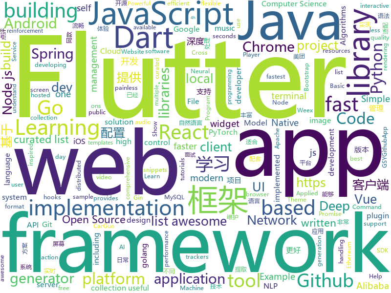

# 2018-11-04
See what the GitHub community is most excited about today.

## python
* [DeepCreamPy](https://github.com/deeppomf/DeepCreamPy)(**407 stars today**): Decensoring Hentai with Deep Neural Networks
* [bert](https://github.com/google-research/bert)(**304 stars today**): TensorFlow code and pre-trained models for BERT
* [PocketFlow](https://github.com/Tencent/PocketFlow)(**163 stars today**): An Automatic Model Compression (AutoMC) framework for developing smaller and faster AI applications.
* [Horizon](https://github.com/facebookresearch/Horizon)(**110 stars today**): A platform for Applied Reinforcement Learning (Applied RL)
* [Python](https://github.com/geekcomputers/Python)(**80 stars today**): My Python Examples
* [adanet](https://github.com/tensorflow/adanet)(**78 stars today**): Fast and flexible AutoML with learning guarantees.
* [models](https://github.com/tensorflow/models)(**46 stars today**): Models and examples built with TensorFlow
* [Python](https://github.com/TheAlgorithms/Python)(**47 stars today**): All Algorithms implemented in Python
* [TensorFlow-Course](https://github.com/open-source-for-science/TensorFlow-Course)(**46 stars today**): Simple and ready-to-use tutorials for TensorFlow
* [WattmanGTK](https://github.com/BoukeHaarsma23/WattmanGTK)(**41 stars today**): A Wattman-like GTK3+ GUI
* [tensorflow-in-practice-code](https://github.com/terrytangyuan/tensorflow-in-practice-code)(**37 stars today**): 源码实现：《TensorFlow实战》黄文坚，唐源 著
* [maskrcnn-benchmark](https://github.com/facebookresearch/maskrcnn-benchmark)(**35 stars today**): Fast, modular reference implementation of Instance Segmentation and Object Detection algorithms in PyTorch.
* [YouMayNotNeedAttention](https://github.com/ofirpress/YouMayNotNeedAttention)(**35 stars today**): 
* [cookie_crimes](https://github.com/defaultnamehere/cookie_crimes)(**34 stars today**): Read local Chrome cookies without root or decrypting
* [public-apis](https://github.com/toddmotto/public-apis)(**31 stars today**): A collective list of public JSON APIs for use in web development.
* [MentisOculi](https://github.com/mmirman/MentisOculi)(**32 stars today**): A raytracer written in PyTorch (raynet?)
* [system-design-primer](https://github.com/donnemartin/system-design-primer)(**29 stars today**): Learn how to design large-scale systems. Prep for the system design interview. Includes Anki flashcards.
* [home-assistant](https://github.com/home-assistant/home-assistant)(**27 stars today**): 🏡Open source home automation that puts local control and privacy first
* [Algorithm_Interview_Notes-Chinese](https://github.com/imhuay/Algorithm_Interview_Notes-Chinese)(**29 stars today**): 2018/2019/校招/春招/秋招/算法/机器学习(Machine Learning)/深度学习(Deep Learning)/自然语言处理(NLP)/C/C++/Python/面试笔记
* [youtube-dl](https://github.com/rg3/youtube-dl)(**27 stars today**): Command-line program to download videos from YouTube.com and other video sites
* [responder](https://github.com/kennethreitz/responder)(**28 stars today**): a familiar HTTP Service Framework for Python
* [awesome-python](https://github.com/vinta/awesome-python)(**26 stars today**): A curated list of awesome Python frameworks, libraries, software and resources
* [keras](https://github.com/keras-team/keras)(**20 stars today**): Deep Learning for humans
* [django](https://github.com/django/django)(**20 stars today**): The Web framework for perfectionists with deadlines.
* [BERT-pytorch](https://github.com/codertimo/BERT-pytorch)(**23 stars today**): Google AI 2018 BERT pytorch implementation

## java
* [JavaGuide](https://github.com/Snailclimb/JavaGuide)(**55 stars today**): 【Java学习+面试指南】 一份涵盖大部分Java程序员所需要掌握的核心知识。
* [Agent](https://github.com/ioFog/Agent)(**62 stars today**): 
* [spring-cloud-alibaba](https://github.com/spring-cloud-incubator/spring-cloud-alibaba)(**48 stars today**): Spring Cloud Alibaba provides a one-stop solution for application development for the distributed solutions of Alibaba middleware.
* [proxyee-down](https://github.com/proxyee-down-org/proxyee-down)(**44 stars today**): http下载工具，基于http代理，支持多连接分块下载
* [symphony](https://github.com/b3log/symphony)(**29 stars today**): 🎶一款用 Java 实现的现代化社区（论坛/BBS/社交网络/博客）平台。https://hacpai.com
* [arthas](https://github.com/alibaba/arthas)(**26 stars today**): Alibaba Java Diagnostic Tool Arthas/Alibaba Java诊断利器Arthas
* [java-design-patterns](https://github.com/iluwatar/java-design-patterns)(**21 stars today**): Design patterns implemented in Java
* [pig](https://github.com/pig4cloud/pig)(**22 stars today**): 基于Spring Cloud、oAuth2.0开发基于Vue前后分离的开发平台，支持账号、短信、SSO等多种登录，提供配套视频开发教程
* [spring-boot](https://github.com/spring-projects/spring-boot)(**16 stars today**): Spring Boot
* [openhab2-addons](https://github.com/openhab/openhab2-addons)(**21 stars today**): Add-ons for openHAB 2.x
* [Java](https://github.com/TheAlgorithms/Java)(**18 stars today**): All Algorithms implemented in Java
* [netty](https://github.com/netty/netty)(**16 stars today**): Netty project - an event-driven asynchronous network application framework
* [tutorials](https://github.com/eugenp/tutorials)(**10 stars today**): The "REST With Spring" Course:
* [elasticsearch](https://github.com/elastic/elasticsearch)(**16 stars today**): Open Source, Distributed, RESTful Search Engine
* [okhttp](https://github.com/square/okhttp)(**15 stars today**): An HTTP+HTTP/2 client for Android and Java applications.
* [HanLP](https://github.com/hankcs/HanLP)(**16 stars today**): 自然语言处理 中文分词 词性标注 命名实体识别 依存句法分析 关键词提取 新词发现 短语提取 自动摘要 文本分类 拼音简繁
* [apollo](https://github.com/ctripcorp/apollo)(**14 stars today**): Apollo（阿波罗）是携程框架部门研发的分布式配置中心，能够集中化管理应用不同环境、不同集群的配置，配置修改后能够实时推送到应用端，并且具备规范的权限、流程治理等特性，适用于微服务配置管理场景。
* [spring-framework](https://github.com/spring-projects/spring-framework)(**14 stars today**): Spring Framework
* [Sentinel](https://github.com/alibaba/Sentinel)(**15 stars today**): A lightweight flow-control library providing high-available protection and monitoring (高可用防护的流量管理框架)
* [QR-Code-generator](https://github.com/nayuki/QR-Code-generator)(**14 stars today**): High-quality QR Code generator library in Java, JavaScript, Python, C++, C.
* [graal](https://github.com/oracle/graal)(**15 stars today**): GraalVM: Run Programs Faster Anywhere🚀
* [AndroidAutoSize](https://github.com/JessYanCoding/AndroidAutoSize)(**13 stars today**): 🔥A low-cost Android screen adaptation solution (今日头条屏幕适配方案终极版，一个极低成本的 Android 屏幕适配方案).
* [MultiActionSwipeHelper](https://github.com/bufferapp/MultiActionSwipeHelper)(**13 stars today**): An Android RecyclerView Swipe Helper for handling multiple actions per direction
* [rocketmq](https://github.com/apache/rocketmq)(**11 stars today**): Mirror of Apache RocketMQ
* [kafka](https://github.com/apache/kafka)(**10 stars today**): Mirror of Apache Kafka

## unknown
* [A-to-Z-Resources-for-Students](https://github.com/dipakkr/A-to-Z-Resources-for-Students)(**145 stars today**): Curated list of resources for college students Show your❤️by giving a⭐️
* [CS-Notes](https://github.com/CyC2018/CS-Notes)(**48 stars today**): 📚Computer Science Learning Notes
* [You-Dont-Know-JS](https://github.com/getify/You-Dont-Know-JS)(**48 stars today**): A book series on JavaScript. @YDKJS on twitter.
* [Learn_Data_Science_in_3_Months](https://github.com/llSourcell/Learn_Data_Science_in_3_Months)(**41 stars today**): This is the Curriculum for "Learn Data Science in 3 Months" By Siraj Raval on Youtube
* [gitignore](https://github.com/github/gitignore)(**31 stars today**): A collection of useful .gitignore templates
* [awesome](https://github.com/sindresorhus/awesome)(**40 stars today**): 😎Curated list of awesome lists
* [developer-roadmap](https://github.com/kamranahmedse/developer-roadmap)(**41 stars today**): Roadmap to becoming a web developer in 2018
* [coding-interview-university](https://github.com/jwasham/coding-interview-university)(**38 stars today**): A complete computer science study plan to become a software engineer.
* [free-programming-books](https://github.com/EbookFoundation/free-programming-books)(**32 stars today**): 📚Freely available programming books
* [git-flight-rules](https://github.com/k88hudson/git-flight-rules)(**32 stars today**): Flight rules for git
* [bash-guide](https://github.com/omergulen/bash-guide)(**30 stars today**): Shell Rehberi
* [Front-End-FAQ](https://github.com/emmawedekind/Front-End-FAQ)(**30 stars today**): A place to anonymously ask questions and receive answers from the dev community
* [image-to-image-papers](https://github.com/lzhbrian/image-to-image-papers)(**27 stars today**): A collection of image to image papers
* [thelio](https://github.com/system76/thelio)(**25 stars today**): Thelio Desktop by System76
* [project-based-learning](https://github.com/tuvtran/project-based-learning)(**20 stars today**): Curated list of project-based tutorials
* [nodebestpractices](https://github.com/i0natan/nodebestpractices)(**19 stars today**): The largest Node.JS best practices list (October 2018)
* [weekly](https://github.com/ruanyf/weekly)(**20 stars today**): 技术分享周刊，每周五发布
* [awesome-nodejs-security](https://github.com/lirantal/awesome-nodejs-security)(**19 stars today**): Awesome Node.js Security resources
* [computer-science](https://github.com/ossu/computer-science)(**18 stars today**): 🎓Path to a free self-taught education in Computer Science!
* [first-contributions](https://github.com/firstcontributions/first-contributions)(**11 stars today**): 🚀✨Help beginners to contribute to open source projects
* [trackerslist](https://github.com/ngosang/trackerslist)(**18 stars today**): An updated list of public BitTorrent trackers
* [awesome-vue](https://github.com/vuejs/awesome-vue)(**16 stars today**): 🎉A curated list of awesome things related to Vue.js
* [README](https://github.com/guodongxiaren/README)(**15 stars today**): README文件语法解读，即Github Flavored Markdown语法介绍
* [Powerful-Plugins](https://github.com/Hack-with-Github/Powerful-Plugins)(**16 stars today**): Powerful plugins and add-ons for hackers
* [awesome-react-hooks](https://github.com/rehooks/awesome-react-hooks)(**16 stars today**): Awesome React Hooks

## javascript
* [carlo](https://github.com/GoogleChromeLabs/carlo)(**505 stars today**): Web rendering surface for Node applications
* [glorious-demo](https://github.com/glorious-codes/glorious-demo)(**354 stars today**): The easiest way to demonstrate your code in action.
* [33-js-concepts](https://github.com/leonardomso/33-js-concepts)(**117 stars today**): 📜33 concepts every JavaScript developer should know.
* [hexo-theme-icarus](https://github.com/ppoffice/hexo-theme-icarus)(**112 stars today**): A simple, delicate, and modern theme for the static site generator Hexo.
* [howler.js](https://github.com/goldfire/howler.js)(**105 stars today**): Javascript audio library for the modern web.
* [pennywise](https://github.com/kamranahmedse/pennywise)(**95 stars today**): Cross-platform application to open anything in a floating window
* [ervy](https://github.com/chunqiuyiyu/ervy)(**96 stars today**): Bring charts to terminal.
* [react](https://github.com/facebook/react)(**59 stars today**): A declarative, efficient, and flexible JavaScript library for building user interfaces.
* [vue](https://github.com/vuejs/vue)(**59 stars today**): 🖖A progressive, incrementally-adoptable JavaScript framework for building UI on the web.
* [cat](https://github.com/dianping/cat)(**59 stars today**): CAT 作为服务端项目基础组件，提供了 Java, C/C++, Node.js, Python, Go 等多语言客户端，已经在美团点评的基础架构中间件框架（MVC框架，RPC框架，数据库框架，缓存框架等，消息队列，配置系统等）深度集成，为美团点评各业务线提供系统丰富的性能指标、健康状况、实时告警等。
* [components](https://github.com/primer/components)(**57 stars today**): Primer React components
* [jobs-done](https://github.com/skidding/jobs-done)(**56 stars today**): Ritual app for ending the work day inspired by Deep Work
* [idevice](https://github.com/dieulot/idevice)(**52 stars today**): Discover which iOS devices are used on your site
* [puppeteer](https://github.com/GoogleChrome/puppeteer)(**47 stars today**): Headless Chrome Node API
* [30-seconds-of-code](https://github.com/30-seconds/30-seconds-of-code)(**45 stars today**): Curated collection of useful JavaScript snippets that you can understand in 30 seconds or less.
* [create-react-app](https://github.com/facebook/create-react-app)(**42 stars today**): Set up a modern web app by running one command.
* [bootstrap-vue](https://github.com/bootstrap-vue/bootstrap-vue)(**43 stars today**): BootstrapVue provides one of the most comprehensive implementations of Bootstrap 4 components and grid system for Vue.js and with extensive and automated WAI-ARIA accessibility markup.
* [keynote](https://github.com/znck/keynote)(**44 stars today**): Present with Vue
* [dinero.js](https://github.com/sarahdayan/dinero.js)(**42 stars today**): 💸An immutable library to create, calculate and format money.
* [react-native](https://github.com/facebook/react-native)(**36 stars today**): A framework for building native apps with React.
* [axios](https://github.com/axios/axios)(**39 stars today**): Promise based HTTP client for the browser and node.js
* [33-js-concepts](https://github.com/stephentian/33-js-concepts)(**39 stars today**): 📜每个 JavaScript 工程师都应懂的33个概念 @leonardomso
* [fastest-validator](https://github.com/icebob/fastest-validator)(**36 stars today**): ⚡️The fastest JS validator library for NodeJS
* [hooks.guide](https://github.com/Raathigesh/hooks.guide)(**34 stars today**): Collection of React hooks curated by the community
* [javascript](https://github.com/airbnb/javascript)(**33 stars today**): JavaScript Style Guide

## html
* [async-javascript-cheatsheet](https://github.com/frontarm/async-javascript-cheatsheet)(**27 stars today**): Cheatsheet for promises and async/await
* [ml-workshop-1-of-4](https://github.com/amueller/ml-workshop-1-of-4)(**21 stars today**): Introduction to Machine learning with Python, 4h interactive workshop
* [NLP-progress](https://github.com/sebastianruder/NLP-progress)(**19 stars today**): Repository to track the progress in Natural Language Processing (NLP), including the datasets and the current state-of-the-art for the most common NLP tasks.
* [vue-hooks](https://github.com/yyx990803/vue-hooks)(**17 stars today**): Experimental React hooks implementation in Vue
* [Spoon-Knife](https://github.com/octocat/Spoon-Knife)(****): This repo is for demonstration purposes only.
* [30-seconds-of-css](https://github.com/30-seconds/30-seconds-of-css)(**16 stars today**): A curated collection of useful CSS snippets you can understand in 30 seconds or less.
* [uBlock](https://github.com/gorhill/uBlock)(**15 stars today**): uBlock Origin - An efficient blocker for Chromium and Firefox. Fast and lean.
* [solid](https://github.com/solid/solid)(**14 stars today**): Solid - Re-decentralizing the web (project directory)
* [BFuzz](https://github.com/RootUp/BFuzz)(**14 stars today**): Fuzzing Browsers
* [fastText](https://github.com/facebookresearch/fastText)(**13 stars today**): Library for fast text representation and classification.
* [JavaScript30](https://github.com/wesbos/JavaScript30)(**5 stars today**): 30 Day Vanilla JS Challenge
* [gshark](https://github.com/neal1991/gshark)(**10 stars today**): Scan for sensitive information in Github easily and effectively.
* [core](https://github.com/stackblitz/core)(**9 stars today**): Online IDE powered by Visual Studio Code⚡️
* [imglab](https://github.com/NaturalIntelligence/imglab)(**9 stars today**): To speedup and simplify image labeling/ annotation process with multiple supported formats.
* [portainer](https://github.com/portainer/portainer)(**9 stars today**): Simple management UI for Docker
* [AdminLTE](https://github.com/almasaeed2010/AdminLTE)(**7 stars today**): AdminLTE - Free Premium Admin control Panel Theme Based On Bootstrap 3.x
* [baselines](https://github.com/openai/baselines)(**8 stars today**): OpenAI Baselines: high-quality implementations of reinforcement learning algorithms
* [simple-icons](https://github.com/simple-icons/simple-icons)(**7 stars today**): SVG icons for popular brands
* [openapi-generator](https://github.com/OpenAPITools/openapi-generator)(**7 stars today**): OpenAPI Generator allows generation of API client libraries (SDK generation), server stubs, documentation and configuration automatically given an OpenAPI Spec (v2, v3)
* [nndl.github.io](https://github.com/nndl/nndl.github.io)(**6 stars today**): 《神经网络与深度学习》 Neural Network and Deep Learning
* [gci18.fossasia.org](https://github.com/fossasia/gci18.fossasia.org)(**5 stars today**): FOSSASIA Google Code-In Website 2018 https://gci18.fossasia.org
* [react-redux](https://github.com/reduxjs/react-redux)(**6 stars today**): Official React bindings for Redux
* [blockchain](https://github.com/Azure-Samples/blockchain)(**6 stars today**): Azure Blockchain Content and Samples
* [EIPs](https://github.com/ethereum/EIPs)(**5 stars today**): The Ethereum Improvement Proposal repository
* [nginxconfig.io](https://github.com/valentinxxx/nginxconfig.io)(**6 stars today**): ⚙️NGiИX config generator generator on steroids💉

## dart
* [flutter](https://github.com/flutter/flutter)(**40 stars today**): Flutter makes it easy and fast to build beautiful mobile apps.
* [flutter_sidekick](https://github.com/letsar/flutter_sidekick)(**25 stars today**): Widgets for creating Hero-like animations between two widgets within the same screen.
* [awesome-flutter](https://github.com/Solido/awesome-flutter)(**21 stars today**): An awesome list that curates the best Flutter libraries, tools, tutorials, articles and more.
* [plugins](https://github.com/flutter/plugins)(**6 stars today**): Plugins for Flutter, including FlutterFire, maintained by the Flutter team
* [sdk](https://github.com/dart-lang/sdk)(**5 stars today**): The Dart SDK, including the VM, dart2js, core libraries, and more.
* [zefyr](https://github.com/memspace/zefyr)(****): 
* [flutter_typeahead](https://github.com/AbdulRahmanAlHamali/flutter_typeahead)(****): A TypeAhead widget for Flutter, where you can show suggestions to users as they type
* [Flutter-Music-Player](https://github.com/iampawan/Flutter-Music-Player)(****): Flutter Music Player - First Open Source Flutter based material design music player with audio plugin to play local music files.
* [dart-sass](https://github.com/sass/dart-sass)(****): A Dart implementation of Sass.
* [chromedeveditor](https://github.com/googlearchive/chromedeveditor)(****): Chrome Dev Editor is a developer tool for building apps on the Chrome platform - Chrome Apps and Web Apps, in JavaScript or Dart. (NO LONGER IN ACTIVE DEVELOPMENT)
* [GSYGithubAppFlutter](https://github.com/CarGuo/GSYGithubAppFlutter)(****): 超完整的Flutter项目，功能丰富，适合学习和日常使用。GSYGithubApp系列的优势：我们目前已经拥有Flutter、Weex、ReactNative三个版本。 功能齐全，项目框架内技术涉及面广，完成度高，持续维护，配套文章，适合全面学习，跨框架对比参考。跨平台的开源Github客户端App，更好的体验，更丰富的功能，旨在更好的日常管理和维护个人Github，提供更好更方便的驾车体验～～Σ(￣。￣ﾉ)ﾉ。同款Weex版本 ： https://github.com/CarGuo/GSYGithubAppWeex 、同款React Native版本 ： https://github.com/CarGuo/GSYGithubApp
* [FlutterExampleApps](https://github.com/iampawan/FlutterExampleApps)(****): [Example APPS] Basic Flutter apps, for flutter devs.
* [flutter-osc](https://github.com/yubo725/flutter-osc)(****): 基于Google Flutter的开源中国客户端，支持Android和iOS。
* [Flutter-UI-Kit](https://github.com/iampawan/Flutter-UI-Kit)(****): Flutter app for collection of UI in a UIKit
* [flutter-examples](https://github.com/nisrulz/flutter-examples)(****): [Examples] Simple basic isolated apps, for budding flutter devs.
* [flutter_architecture_samples](https://github.com/brianegan/flutter_architecture_samples)(****): TodoMVC for Flutter
* [Flutter-learning](https://github.com/AweiLoveAndroid/Flutter-learning)(****): 🔥👍🌟⭐️⭐️⭐️Flutter install&settings,Flutter problems when developing,Flutter sample codes& templates,Flutter projects,Dart languages sample codes
* [dio](https://github.com/flutterchina/dio)(****): A powerful Http client for Dart, which supports Interceptors, FormData, Request Cancellation, File Downloading, Timeout etc.
* [inKino](https://github.com/roughike/inKino)(****): inKino - A cross platform movie and showtime browser for Finnkino cinemas, made with Flutter.
* [hauberk](https://github.com/munificent/hauberk)(****): A web-based roguelike written in Dart.
* [zhihu-flutter](https://github.com/HackSoul/zhihu-flutter)(****): Flutter 高仿知乎 UI，非常漂亮，也非常流畅，flutter build apk 或 flutter build ios 之后更流畅
* [angular](https://github.com/dart-lang/angular)(****): Fast and productive web framework provided by Dart
* [StageXL](https://github.com/bp74/StageXL)(****): A fast and universal 2D rendering engine for HTML5 and Dart.
* [rxdart](https://github.com/ReactiveX/rxdart)(****): The Reactive Extensions for Dart
* [Flutter-Notebook](https://github.com/OpenFlutter/Flutter-Notebook)(****): 日更的FlutterDemo合集，今天你fu了吗

## go
* [dive](https://github.com/wagoodman/dive)(**97 stars today**): A tool for exploring each layer in a docker image
* [gotop](https://github.com/cjbassi/gotop)(**47 stars today**): A terminal based graphical activity monitor inspired by gtop and vtop
* [survey](https://github.com/AlecAivazis/survey)(**39 stars today**): A golang library for building interactive prompts with full support for windows and posix terminals.
* [go](https://github.com/golang/go)(**36 stars today**): The Go programming language
* [BaiduPCS-Go](https://github.com/iikira/BaiduPCS-Go)(**33 stars today**): 百度网盘客户端 - Go语言编写
* [errorx](https://github.com/joomcode/errorx)(**32 stars today**): A comprehensive error handling library for Go
* [kubernetes](https://github.com/kubernetes/kubernetes)(**25 stars today**): Production-Grade Container Scheduling and Management
* [up](https://github.com/akavel/up)(**28 stars today**): Ultimate Plumber is a tool for writing Linux pipes with instant live preview
* [awesome-go](https://github.com/avelino/awesome-go)(**25 stars today**): A curated list of awesome Go frameworks, libraries and software
* [go-mysql-server](https://github.com/src-d/go-mysql-server)(**25 stars today**): An extensible MySQL server implementation in Go.
* [gin](https://github.com/gin-gonic/gin)(**23 stars today**): Gin is a HTTP web framework written in Go (Golang). It features a Martini-like API with much better performance -- up to 40 times faster. If you need smashing performance, get yourself some Gin.
* [goboy](https://github.com/Humpheh/goboy)(**23 stars today**): Multi-platform Nintendo Game Boy Color emulator written in go
* [v2ray-core](https://github.com/v2ray/v2ray-core)(**19 stars today**): A platform for building proxies to bypass network restrictions.
* [gitea](https://github.com/go-gitea/gitea)(**21 stars today**): Git with a cup of tea, painless self-hosted git service
* [soar](https://github.com/XiaoMi/soar)(**20 stars today**): SQL Optimizer And Rewriter
* [frp](https://github.com/fatedier/frp)(**18 stars today**): A fast reverse proxy to help you expose a local server behind a NAT or firewall to the internet.
* [hugo](https://github.com/gohugoio/hugo)(**20 stars today**): The world’s fastest framework for building websites.
* [orchestrator](https://github.com/github/orchestrator)(**19 stars today**): MySQL replication topology management and HA
* [go-ethereum](https://github.com/ethereum/go-ethereum)(**16 stars today**): Official Go implementation of the Ethereum protocol
* [build-web-application-with-golang](https://github.com/astaxie/build-web-application-with-golang)(**16 stars today**): A golang ebook intro how to build a web with golang
* [gogs](https://github.com/gogs/gogs)(**17 stars today**): Gogs is a painless self-hosted Git service.
* [AdGuardHome](https://github.com/AdguardTeam/AdGuardHome)(**17 stars today**): Network-wide ads & trackers blocking DNS server
* [syncthing](https://github.com/syncthing/syncthing)(**16 stars today**): Open Source Continuous File Synchronization
* [gravity](https://github.com/gravitational/gravity)(**16 stars today**): Opinionated snapshot-based Kubernetes packaging and management tools.
* [traefik](https://github.com/containous/traefik)(**16 stars today**): The Cloud Native Edge Router

## WordCloud

