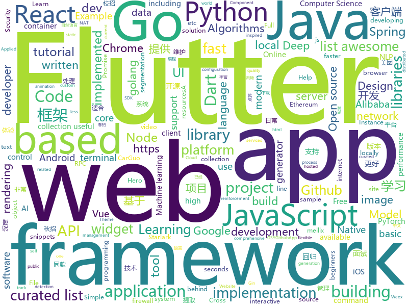

# 2018-11-05
See what the GitHub community is most excited about today.

## python
* [DeepCreamPy](https://github.com/deeppomf/DeepCreamPy)(**293 stars today**): Decensoring Hentai with Deep Neural Networks
* [bert](https://github.com/google-research/bert)(**213 stars today**): TensorFlow code and pre-trained models for BERT
* [Python](https://github.com/geekcomputers/Python)(**196 stars today**): My Python Examples
* [PocketFlow](https://github.com/Tencent/PocketFlow)(**166 stars today**): An Automatic Model Compression (AutoMC) framework for developing smaller and faster AI applications.
* [adanet](https://github.com/tensorflow/adanet)(**77 stars today**): Fast and flexible AutoML with learning guarantees.
* [Horizon](https://github.com/facebookresearch/Horizon)(**66 stars today**): A platform for Applied Reinforcement Learning (Applied RL)
* [Python](https://github.com/TheAlgorithms/Python)(**55 stars today**): All Algorithms implemented in Python
* [system-design-primer](https://github.com/donnemartin/system-design-primer)(**50 stars today**): Learn how to design large-scale systems. Prep for the system design interview. Includes Anki flashcards.
* [youtube-dl](https://github.com/rg3/youtube-dl)(**43 stars today**): Command-line program to download videos from YouTube.com and other video sites
* [Algorithm_Interview_Notes-Chinese](https://github.com/imhuay/Algorithm_Interview_Notes-Chinese)(**38 stars today**): 2018/2019/校招/春招/秋招/算法/机器学习(Machine Learning)/深度学习(Deep Learning)/自然语言处理(NLP)/C/C++/Python/面试笔记
* [models](https://github.com/tensorflow/models)(**33 stars today**): Models and examples built with TensorFlow
* [cookie_crimes](https://github.com/defaultnamehere/cookie_crimes)(**44 stars today**): Read local Chrome cookies without root or decrypting
* [TensorFlow-Course](https://github.com/open-source-for-science/TensorFlow-Course)(**43 stars today**): Simple and ready-to-use tutorials for TensorFlow
* [WattmanGTK](https://github.com/BoukeHaarsma23/WattmanGTK)(**38 stars today**): A Wattman-like GTK3+ GUI
* [MentisOculi](https://github.com/mmirman/MentisOculi)(**32 stars today**): A raytracer written in PyTorch (raynet?)
* [keras](https://github.com/keras-team/keras)(**23 stars today**): Deep Learning for humans
* [face_recognition](https://github.com/ageitgey/face_recognition)(**24 stars today**): The world's simplest facial recognition api for Python and the command line
* [home-assistant](https://github.com/home-assistant/home-assistant)(**27 stars today**): 🏡Open source home automation that puts local control and privacy first
* [awesome-python](https://github.com/vinta/awesome-python)(**27 stars today**): A curated list of awesome Python frameworks, libraries, software and resources
* [public-apis](https://github.com/toddmotto/public-apis)(**24 stars today**): A collective list of public JSON APIs for use in web development.
* [maskrcnn-benchmark](https://github.com/facebookresearch/maskrcnn-benchmark)(**25 stars today**): Fast, modular reference implementation of Instance Segmentation and Object Detection algorithms in PyTorch.
* [django](https://github.com/django/django)(**13 stars today**): The Web framework for perfectionists with deadlines.
* [flask](https://github.com/pallets/flask)(**22 stars today**): The Python micro framework for building web applications.
* [scikit-learn](https://github.com/scikit-learn/scikit-learn)(**19 stars today**): scikit-learn: machine learning in Python
* [Mask_RCNN](https://github.com/matterport/Mask_RCNN)(**20 stars today**): Mask R-CNN for object detection and instance segmentation on Keras and TensorFlow

## java
* [JavaGuide](https://github.com/Snailclimb/JavaGuide)(**87 stars today**): 【Java学习+面试指南】 一份涵盖大部分Java程序员所需要掌握的核心知识。
* [proxyee-down](https://github.com/proxyee-down-org/proxyee-down)(**69 stars today**): http下载工具，基于http代理，支持多连接分块下载
* [spring-boot](https://github.com/spring-projects/spring-boot)(**32 stars today**): Spring Boot
* [wildfly](https://github.com/wildfly/wildfly)(**37 stars today**): WildFly Application Server
* [symphony](https://github.com/b3log/symphony)(**35 stars today**): 🎶一款用 Java 实现的现代化社区（论坛/BBS/社交网络/博客）平台。https://hacpai.com
* [holer](https://github.com/wisdom-projects/holer)(**34 stars today**): Holer exposes local servers behind NATs and firewalls to the public internet over secure tunnels.
* [java-design-patterns](https://github.com/iluwatar/java-design-patterns)(**33 stars today**): Design patterns implemented in Java
* [spring-cloud-alibaba](https://github.com/spring-cloud-incubator/spring-cloud-alibaba)(**29 stars today**): Spring Cloud Alibaba provides a one-stop solution for application development for the distributed solutions of Alibaba middleware.
* [spring-framework](https://github.com/spring-projects/spring-framework)(**23 stars today**): Spring Framework
* [tutorials](https://github.com/eugenp/tutorials)(**18 stars today**): The "REST With Spring" Course:
* [JCSprout](https://github.com/crossoverJie/JCSprout)(**23 stars today**): 👨‍🎓Java Core Sprout : basic, concurrent, algorithm
* [arthas](https://github.com/alibaba/arthas)(**22 stars today**): Alibaba Java Diagnostic Tool Arthas/Alibaba Java诊断利器Arthas
* [Java](https://github.com/TheAlgorithms/Java)(**18 stars today**): All Algorithms implemented in Java
* [elasticsearch](https://github.com/elastic/elasticsearch)(**17 stars today**): Open Source, Distributed, RESTful Search Engine
* [JustifiedTextView](https://github.com/amilcar-sr/JustifiedTextView)(**19 stars today**): JustifiedTextView is an android view that justifies the text. Gives support to older Android versions because "setJustificationMode" was introduced until API 26.
* [bifurcan](https://github.com/lacuna/bifurcan)(**17 stars today**): impure functional data structures
* [QR-Code-generator](https://github.com/nayuki/QR-Code-generator)(**16 stars today**): High-quality QR Code generator library in Java, JavaScript, Python, C++, C.
* [Sentinel](https://github.com/alibaba/Sentinel)(**15 stars today**): A lightweight flow-control library providing high-available protection and monitoring (高可用防护的流量管理框架)
* [incubator-dubbo](https://github.com/apache/incubator-dubbo)(**11 stars today**): Apache Dubbo (incubating) is a high-performance, java based, open source RPC framework.
* [bisq](https://github.com/bisq-network/bisq)(**15 stars today**): The decentralized bitcoin exchange network
* [HanLP](https://github.com/hankcs/HanLP)(**14 stars today**): 自然语言处理 中文分词 词性标注 命名实体识别 依存句法分析 关键词提取 新词发现 短语提取 自动摘要 文本分类 拼音简繁
* [pig](https://github.com/pig4cloud/pig)(**14 stars today**): 基于Spring Cloud、oAuth2.0开发基于Vue前后分离的开发平台，支持账号、短信、SSO等多种登录，提供配套视频开发教程
* [guava](https://github.com/google/guava)(**11 stars today**): Google core libraries for Java
* [netty](https://github.com/netty/netty)(**10 stars today**): Netty project - an event-driven asynchronous network application framework
* [maxwell](https://github.com/zendesk/maxwell)(**12 stars today**): Maxwell's daemon, a mysql-to-json kafka producer

## unknown
* [2019_campus_apply](https://github.com/frank-lam/2019_campus_apply)(**304 stars today**): 🚀Full Stack Developer Tutorial，后台技术栈/全栈开发/架构师之路，秋招/春招/校招/面试。 from zero to hero.
* [A-to-Z-Resources-for-Students](https://github.com/dipakkr/A-to-Z-Resources-for-Students)(**146 stars today**): Curated list of resources for college students Show your❤️by giving a⭐️
* [awful-ai](https://github.com/daviddao/awful-ai)(**115 stars today**): 😈Awful AI is a curated list to track current scary usages of AI - hoping to raise awareness
* [FinancialSupportForOpenSource](https://github.com/wizicer/FinancialSupportForOpenSource)(**80 stars today**): 开源项目挣钱实用手册
* [Learn_Data_Science_in_3_Months](https://github.com/llSourcell/Learn_Data_Science_in_3_Months)(**51 stars today**): This is the Curriculum for "Learn Data Science in 3 Months" By Siraj Raval on Youtube
* [image-to-image-papers](https://github.com/lzhbrian/image-to-image-papers)(**53 stars today**): A collection of image to image papers
* [developer-roadmap](https://github.com/kamranahmedse/developer-roadmap)(**46 stars today**): Roadmap to becoming a web developer in 2018
* [awesome](https://github.com/sindresorhus/awesome)(**48 stars today**): 😎Curated list of awesome lists
* [gitignore](https://github.com/github/gitignore)(**40 stars today**): A collection of useful .gitignore templates
* [free-programming-books](https://github.com/EbookFoundation/free-programming-books)(**43 stars today**): 📚Freely available programming books
* [You-Dont-Know-JS](https://github.com/getify/You-Dont-Know-JS)(**40 stars today**): A book series on JavaScript. @YDKJS on twitter.
* [CS-Notes](https://github.com/CyC2018/CS-Notes)(**37 stars today**): 📚Computer Science Learning Notes
* [coding-interview-university](https://github.com/jwasham/coding-interview-university)(**35 stars today**): A complete computer science study plan to become a software engineer.
* [git-flight-rules](https://github.com/k88hudson/git-flight-rules)(**36 stars today**): Flight rules for git
* [Awesome-pytorch-list](https://github.com/bharathgs/Awesome-pytorch-list)(**34 stars today**): A comprehensive list of pytorch related content on github,such as different models,implementations,helper libraries,tutorials etc.
* [project-based-learning](https://github.com/tuvtran/project-based-learning)(**31 stars today**): Curated list of project-based tutorials
* [awesome-vue](https://github.com/vuejs/awesome-vue)(**27 stars today**): 🎉A curated list of awesome things related to Vue.js
* [awesome-nodejs-security](https://github.com/lirantal/awesome-nodejs-security)(**23 stars today**): Awesome Node.js Security resources
* [Front-End-FAQ](https://github.com/emmawedekind/Front-End-FAQ)(**22 stars today**): A place to anonymously ask questions and receive answers from the dev community
* [OSCP-survival-guide](https://github.com/lduck11007/OSCP-survival-guide)(**19 stars today**): Kali Linux Offensive Security Certified Professional Survival Exam Guide
* [computer-science](https://github.com/ossu/computer-science)(**18 stars today**): 🎓Path to a free self-taught education in Computer Science!
* [first-contributions](https://github.com/firstcontributions/first-contributions)(**9 stars today**): 🚀✨Help beginners to contribute to open source projects
* [awesome-for-beginners](https://github.com/MunGell/awesome-for-beginners)(**16 stars today**): A list of awesome beginners-friendly projects.
* [books](https://github.com/programthink/books)(**16 stars today**): 【编程随想】收藏的电子书清单（多个学科，含下载链接）
* [awesome-online-ide](https://github.com/styfle/awesome-online-ide)(**17 stars today**): 🌩️A list of awesome online development environments

## javascript
* [carlo](https://github.com/GoogleChromeLabs/carlo)(**348 stars today**): Web rendering surface for Node applications
* [glorious-demo](https://github.com/glorious-codes/glorious-demo)(**224 stars today**): The easiest way to demonstrate your code in action.
* [33-js-concepts](https://github.com/leonardomso/33-js-concepts)(**155 stars today**): 📜33 concepts every JavaScript developer should know.
* [pennywise](https://github.com/kamranahmedse/pennywise)(**129 stars today**): Cross-platform application to open anything in a floating window
* [ervy](https://github.com/chunqiuyiyu/ervy)(**100 stars today**): Bring charts to terminal.
* [idevice](https://github.com/dieulot/idevice)(**90 stars today**): Discover which iOS devices are used on your site
* [vue](https://github.com/vuejs/vue)(**83 stars today**): 🖖A progressive, incrementally-adoptable JavaScript framework for building UI on the web.
* [howler.js](https://github.com/goldfire/howler.js)(**82 stars today**): Javascript audio library for the modern web.
* [hexo-theme-icarus](https://github.com/ppoffice/hexo-theme-icarus)(**76 stars today**): A simple, delicate, and modern theme for the static site generator Hexo.
* [react](https://github.com/facebook/react)(**56 stars today**): A declarative, efficient, and flexible JavaScript library for building user interfaces.
* [the-platform](https://github.com/palmerhq/the-platform)(**64 stars today**): Web. Components.😂
* [30-seconds-of-code](https://github.com/30-seconds/30-seconds-of-code)(**58 stars today**): Curated collection of useful JavaScript snippets that you can understand in 30 seconds or less.
* [free-programming-books-zh_CN](https://github.com/justjavac/free-programming-books-zh_CN)(**51 stars today**): 📚免费的计算机编程类中文书籍，欢迎投稿
* [axios](https://github.com/axios/axios)(**45 stars today**): Promise based HTTP client for the browser and node.js
* [react-native](https://github.com/facebook/react-native)(**45 stars today**): A framework for building native apps with React.
* [puppeteer](https://github.com/GoogleChrome/puppeteer)(**43 stars today**): Headless Chrome Node API
* [javascript-algorithms](https://github.com/trekhleb/javascript-algorithms)(**39 stars today**): 📝Algorithms and data structures implemented in JavaScript with explanations and links to further readings
* [javascript](https://github.com/airbnb/javascript)(**40 stars today**): JavaScript Style Guide
* [create-react-app](https://github.com/facebook/create-react-app)(**32 stars today**): Set up a modern web app by running one command.
* [jobs-done](https://github.com/skidding/jobs-done)(**38 stars today**): Ritual app for ending the work day inspired by Deep Work
* [storybook](https://github.com/storybooks/storybook)(**37 stars today**): Interactive UI component dev & test: React, React Native, Vue, Angular, Ember
* [cat](https://github.com/dianping/cat)(**35 stars today**): CAT 作为服务端项目基础组件，提供了 Java, C/C++, Node.js, Python, Go 等多语言客户端，已经在美团点评的基础架构中间件框架（MVC框架，RPC框架，数据库框架，缓存框架等，消息队列，配置系统等）深度集成，为美团点评各业务线提供系统丰富的性能指标、健康状况、实时告警等。
* [ant-design-pro](https://github.com/ant-design/ant-design-pro)(**31 stars today**): 👨🏻‍💻👩🏻‍💻 Use Ant Design like a Pro!
* [react-spring](https://github.com/drcmda/react-spring)(**30 stars today**): 🙌A spring physics based React animation library
* [awesome-selfhosted](https://github.com/Kickball/awesome-selfhosted)(**30 stars today**): This is a list of Free Software network services and web applications which can be hosted locally. Selfhosting is the process of locally hosting and managing applications instead of renting from SaaS providers.

## html
* [async-javascript-cheatsheet](https://github.com/frontarm/async-javascript-cheatsheet)(**20 stars today**): Cheatsheet for promises and async/await
* [gshark](https://github.com/neal1991/gshark)(**14 stars today**): Scan for sensitive information in Github easily and effectively.
* [Spoon-Knife](https://github.com/octocat/Spoon-Knife)(****): This repo is for demonstration purposes only.
* [AdminLTE](https://github.com/almasaeed2010/AdminLTE)(**11 stars today**): AdminLTE - Free Premium Admin control Panel Theme Based On Bootstrap 3.x
* [react-redux](https://github.com/reduxjs/react-redux)(**12 stars today**): Official React bindings for Redux
* [NLP-progress](https://github.com/sebastianruder/NLP-progress)(**12 stars today**): Repository to track the progress in Natural Language Processing (NLP), including the datasets and the current state-of-the-art for the most common NLP tasks.
* [ml-workshop-1-of-4](https://github.com/amueller/ml-workshop-1-of-4)(**10 stars today**): Introduction to Machine learning with Python, 4h interactive workshop
* [solid](https://github.com/solid/solid)(**10 stars today**): Solid - Re-decentralizing the web (project directory)
* [core](https://github.com/stackblitz/core)(**10 stars today**): Online IDE powered by Visual Studio Code⚡️
* [30-seconds-of-css](https://github.com/30-seconds/30-seconds-of-css)(**9 stars today**): A curated collection of useful CSS snippets you can understand in 30 seconds or less.
* [imglab](https://github.com/NaturalIntelligence/imglab)(**9 stars today**): To speedup and simplify image labeling/ annotation process with multiple supported formats.
* [baselines](https://github.com/openai/baselines)(**7 stars today**): OpenAI Baselines: high-quality implementations of reinforcement learning algorithms
* [portainer](https://github.com/portainer/portainer)(**8 stars today**): Simple management UI for Docker
* [fastText](https://github.com/facebookresearch/fastText)(**6 stars today**): Library for fast text representation and classification.
* [vue-hooks](https://github.com/yyx990803/vue-hooks)(**8 stars today**): Experimental React hooks implementation in Vue
* [penn-sdk-python](https://github.com/pennlabs/penn-sdk-python)(**8 stars today**): A Python wrapper for the various services of Penn OpenData.
* [EIPs](https://github.com/ethereum/EIPs)(**7 stars today**): The Ethereum Improvement Proposal repository
* [gci18.fossasia.org](https://github.com/fossasia/gci18.fossasia.org)(**6 stars today**): FOSSASIA Google Code-In Website 2018 https://gci18.fossasia.org
* [electron-api-demos](https://github.com/electron/electron-api-demos)(**6 stars today**): Explore the Electron APIs
* [BFuzz](https://github.com/RootUp/BFuzz)(**7 stars today**): Fuzzing Browsers
* [openapi-generator](https://github.com/OpenAPITools/openapi-generator)(**6 stars today**): OpenAPI Generator allows generation of API client libraries (SDK generation), server stubs, documentation and configuration automatically given an OpenAPI Spec (v2, v3)
* [meilix-generator](https://github.com/fossasia/meilix-generator)(**6 stars today**): WebApp for generating a custom ISO image based on Meilix http://meilix.org
* [ctf-wiki](https://github.com/ctf-wiki/ctf-wiki)(**6 stars today**): CTF Wiki Online
* [Machine-Learning](https://github.com/Jack-Cherish/Machine-Learning)(**5 stars today**): ⚡️机器学习实战（Python3）：kNN、决策树、贝叶斯、逻辑回归、SVM、线性回归、树回归
* [fonts](https://github.com/google/fonts)(**6 stars today**): Font files available from Google Fonts

## dart
* [flutter](https://github.com/flutter/flutter)(**62 stars today**): Flutter makes it easy and fast to build beautiful mobile apps.
* [flutter_sidekick](https://github.com/letsar/flutter_sidekick)(**26 stars today**): Widgets for creating Hero-like animations between two widgets within the same screen.
* [awesome-flutter](https://github.com/Solido/awesome-flutter)(**21 stars today**): An awesome list that curates the best Flutter libraries, tools, tutorials, articles and more.
* [plugins](https://github.com/flutter/plugins)(**8 stars today**): Plugins for Flutter, including FlutterFire, maintained by the Flutter team
* [flutter_html](https://github.com/Sub6Resources/flutter_html)(****): A Flutter widget for rendering static html as Flutter widgets (Will render over 70 different html tags!)
* [flushbar](https://github.com/AndreHaueisen/flushbar)(****): Custom widget for Flutter
* [flutter_svg](https://github.com/dnfield/flutter_svg)(****): SVG parsing, rendering, and widget library for Flutter
* [zefyr](https://github.com/memspace/zefyr)(****): 
* [chromedeveditor](https://github.com/googlearchive/chromedeveditor)(****): Chrome Dev Editor is a developer tool for building apps on the Chrome platform - Chrome Apps and Web Apps, in JavaScript or Dart. (NO LONGER IN ACTIVE DEVELOPMENT)
* [sdk](https://github.com/dart-lang/sdk)(****): The Dart SDK, including the VM, dart2js, core libraries, and more.
* [GSYGithubAppFlutter](https://github.com/CarGuo/GSYGithubAppFlutter)(****): 超完整的Flutter项目，功能丰富，适合学习和日常使用。GSYGithubApp系列的优势：我们目前已经拥有Flutter、Weex、ReactNative三个版本。 功能齐全，项目框架内技术涉及面广，完成度高，持续维护，配套文章，适合全面学习，跨框架对比参考。跨平台的开源Github客户端App，更好的体验，更丰富的功能，旨在更好的日常管理和维护个人Github，提供更好更方便的驾车体验～～Σ(￣。￣ﾉ)ﾉ。同款Weex版本 ： https://github.com/CarGuo/GSYGithubAppWeex 、同款React Native版本 ： https://github.com/CarGuo/GSYGithubApp
* [FlutterExampleApps](https://github.com/iampawan/FlutterExampleApps)(****): [Example APPS] Basic Flutter apps, for flutter devs.
* [flutter-osc](https://github.com/yubo725/flutter-osc)(****): 基于Google Flutter的开源中国客户端，支持Android和iOS。
* [Flutter-UI-Kit](https://github.com/iampawan/Flutter-UI-Kit)(****): Flutter app for collection of UI in a UIKit
* [flutter-examples](https://github.com/nisrulz/flutter-examples)(****): [Examples] Simple basic isolated apps, for budding flutter devs.
* [flutter_architecture_samples](https://github.com/brianegan/flutter_architecture_samples)(****): TodoMVC for Flutter
* [Flutter-learning](https://github.com/AweiLoveAndroid/Flutter-learning)(****): 🔥👍🌟⭐️⭐️⭐️Flutter install&settings,Flutter problems when developing,Flutter sample codes& templates,Flutter projects,Dart languages sample codes
* [dio](https://github.com/flutterchina/dio)(****): A powerful Http client for Dart, which supports Interceptors, FormData, Request Cancellation, File Downloading, Timeout etc.
* [inKino](https://github.com/roughike/inKino)(****): inKino - A cross platform movie and showtime browser for Finnkino cinemas, made with Flutter.
* [hauberk](https://github.com/munificent/hauberk)(****): A web-based roguelike written in Dart.
* [zhihu-flutter](https://github.com/HackSoul/zhihu-flutter)(****): Flutter 高仿知乎 UI，非常漂亮，也非常流畅，flutter build apk 或 flutter build ios 之后更流畅
* [angular](https://github.com/dart-lang/angular)(****): Fast and productive web framework provided by Dart
* [StageXL](https://github.com/bp74/StageXL)(****): A fast and universal 2D rendering engine for HTML5 and Dart.
* [dart-sass](https://github.com/sass/dart-sass)(****): A Dart implementation of Sass.
* [rxdart](https://github.com/ReactiveX/rxdart)(****): The Reactive Extensions for Dart

## go
* [gocity](https://github.com/rodrigo-brito/gocity)(**162 stars today**): 📊Code City metaphor for visualizing Go source code in 3D
* [dive](https://github.com/wagoodman/dive)(**85 stars today**): A tool for exploring each layer in a docker image
* [krakend](https://github.com/devopsfaith/krakend)(**60 stars today**): Ultra performant API Gateway with middlewares
* [go](https://github.com/golang/go)(**30 stars today**): The Go programming language
* [BaiduPCS-Go](https://github.com/iikira/BaiduPCS-Go)(**31 stars today**): 百度网盘客户端 - Go语言编写
* [mattermost-server](https://github.com/mattermost/mattermost-server)(**26 stars today**): Open source Slack-alternative in Golang and React - Mattermost
* [survey](https://github.com/AlecAivazis/survey)(**27 stars today**): A golang library for building interactive prompts with full support for windows and posix terminals.
* [starlark-go](https://github.com/google/starlark-go)(**24 stars today**): Starlark in Go: the Starlark configuration language, implemented in Go
* [awesome-go](https://github.com/avelino/awesome-go)(**22 stars today**): A curated list of awesome Go frameworks, libraries and software
* [build-web-application-with-golang](https://github.com/astaxie/build-web-application-with-golang)(**22 stars today**): A golang ebook intro how to build a web with golang
* [v2ray-core](https://github.com/v2ray/v2ray-core)(**19 stars today**): A platform for building proxies to bypass network restrictions.
* [kubernetes](https://github.com/kubernetes/kubernetes)(**19 stars today**): Production-Grade Container Scheduling and Management
* [gitea](https://github.com/go-gitea/gitea)(**22 stars today**): Git with a cup of tea, painless self-hosted git service
* [errorx](https://github.com/joomcode/errorx)(**21 stars today**): A comprehensive error handling library for Go
* [goboy](https://github.com/Humpheh/goboy)(**20 stars today**): Multi-platform Nintendo Game Boy Color emulator written in go
* [soar](https://github.com/XiaoMi/soar)(**19 stars today**): SQL Optimizer And Rewriter
* [orchestrator](https://github.com/github/orchestrator)(**19 stars today**): MySQL replication topology management and HA
* [gotop](https://github.com/cjbassi/gotop)(**16 stars today**): A terminal based graphical activity monitor inspired by gtop and vtop
* [hugo](https://github.com/gohugoio/hugo)(**16 stars today**): The world’s fastest framework for building websites.
* [moby](https://github.com/moby/moby)(**15 stars today**): Moby Project - a collaborative project for the container ecosystem to assemble container-based systems
* [frp](https://github.com/fatedier/frp)(**15 stars today**): A fast reverse proxy to help you expose a local server behind a NAT or firewall to the internet.
* [gin](https://github.com/gin-gonic/gin)(**15 stars today**): Gin is a HTTP web framework written in Go (Golang). It features a Martini-like API with much better performance -- up to 40 times faster. If you need smashing performance, get yourself some Gin.
* [aquatone](https://github.com/michenriksen/aquatone)(**15 stars today**): A Tool for Domain Flyovers
* [go-ethereum](https://github.com/ethereum/go-ethereum)(**11 stars today**): Official Go implementation of the Ethereum protocol
* [go-ipfs](https://github.com/ipfs/go-ipfs)(**14 stars today**): IPFS implementation in Go

## WordCloud

