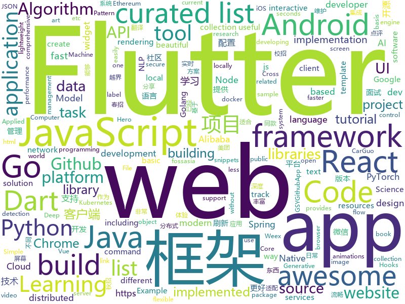

# 2018-11-06
See what the GitHub community is most excited about today.

## python
* [DeepCreamPy](https://github.com/deeppomf/DeepCreamPy)(**493 stars today**): Decensoring Hentai with Deep Neural Networks
* [bert](https://github.com/google-research/bert)(**409 stars today**): TensorFlow code and pre-trained models for BERT
* [Python](https://github.com/geekcomputers/Python)(**235 stars today**): My Python Examples
* [PocketFlow](https://github.com/Tencent/PocketFlow)(**227 stars today**): An Automatic Model Compression (AutoMC) framework for developing smaller and faster AI applications.
* [Python](https://github.com/TheAlgorithms/Python)(**176 stars today**): All Algorithms implemented in Python
* [kamerka](https://github.com/woj-ciech/kamerka)(**178 stars today**): Build interactive map of cameras from Shodan
* [TensorFlow-Course](https://github.com/open-source-for-science/TensorFlow-Course)(**106 stars today**): Simple and ready-to-use tutorials for TensorFlow
* [adanet](https://github.com/tensorflow/adanet)(**101 stars today**): Fast and flexible AutoML with learning guarantees.
* [Algorithm_Interview_Notes-Chinese](https://github.com/imhuay/Algorithm_Interview_Notes-Chinese)(**92 stars today**): 2018/2019/校招/春招/秋招/算法/机器学习(Machine Learning)/深度学习(Deep Learning)/自然语言处理(NLP)/C/C++/Python/面试笔记
* [progressive_growing_of_gans](https://github.com/tkarras/progressive_growing_of_gans)(**95 stars today**): Progressive Growing of GANs for Improved Quality, Stability, and Variation
* [Horizon](https://github.com/facebookresearch/Horizon)(**80 stars today**): A platform for Applied Reinforcement Learning (Applied RL)
* [models](https://github.com/tensorflow/models)(**61 stars today**): Models and examples built with TensorFlow
* [system-design-primer](https://github.com/donnemartin/system-design-primer)(**65 stars today**): Learn how to design large-scale systems. Prep for the system design interview. Includes Anki flashcards.
* [cookie_crimes](https://github.com/defaultnamehere/cookie_crimes)(**59 stars today**): Read local Chrome cookies without root or decrypting
* [byob](https://github.com/malwaredllc/byob)(**54 stars today**): BYOB (Build Your Own Botnet)
* [waveglow](https://github.com/npuichigo/waveglow)(**57 stars today**): A PyTorch implementation of the WaveGlow: A Flow-based Generative Network for Speech Synthesis
* [awesome-python](https://github.com/vinta/awesome-python)(**53 stars today**): A curated list of awesome Python frameworks, libraries, software and resources
* [hiddenlayer](https://github.com/waleedka/hiddenlayer)(**58 stars today**): Neural network graphs and training metrics for PyTorch and Tensorflow.
* [face_recognition](https://github.com/ageitgey/face_recognition)(**45 stars today**): The world's simplest facial recognition api for Python and the command line
* [keras](https://github.com/keras-team/keras)(**42 stars today**): Deep Learning for humans
* [maskrcnn-benchmark](https://github.com/facebookresearch/maskrcnn-benchmark)(**48 stars today**): Fast, modular reference implementation of Instance Segmentation and Object Detection algorithms in PyTorch.
* [camelot](https://github.com/socialcopsdev/camelot)(**46 stars today**): Camelot: PDF Table Extraction for Humans
* [Detectron](https://github.com/facebookresearch/Detectron)(**38 stars today**): FAIR's research platform for object detection research, implementing popular algorithms like Mask R-CNN and RetinaNet.
* [youtube-dl](https://github.com/rg3/youtube-dl)(**36 stars today**): Command-line program to download videos from YouTube.com and other video sites
* [public-apis](https://github.com/toddmotto/public-apis)(**35 stars today**): A collective list of public JSON APIs for use in web development.

## java
* [JavaGuide](https://github.com/Snailclimb/JavaGuide)(**177 stars today**): 【Java学习+面试指南】 一份涵盖大部分Java程序员所需要掌握的核心知识。
* [proxyee-down](https://github.com/proxyee-down-org/proxyee-down)(**96 stars today**): http下载工具，基于http代理，支持多连接分块下载
* [bifurcan](https://github.com/lacuna/bifurcan)(**89 stars today**): impure functional data structures
* [spring-cloud-alibaba](https://github.com/spring-cloud-incubator/spring-cloud-alibaba)(**81 stars today**): Spring Cloud Alibaba provides a one-stop solution for application development for the distributed solutions of Alibaba middleware.
* [arthas](https://github.com/alibaba/arthas)(**54 stars today**): Alibaba Java Diagnostic Tool Arthas/Alibaba Java诊断利器Arthas
* [java-design-patterns](https://github.com/iluwatar/java-design-patterns)(**47 stars today**): Design patterns implemented in Java
* [JustifiedTextView](https://github.com/amilcar-sr/JustifiedTextView)(**54 stars today**): JustifiedTextView is an android view that justifies the text. Gives support to older Android versions because "setJustificationMode" was introduced until API 26.
* [spring-boot](https://github.com/spring-projects/spring-boot)(**42 stars today**): Spring Boot
* [JCSprout](https://github.com/crossoverJie/JCSprout)(**43 stars today**): 👨‍🎓Java Core Sprout : basic, concurrent, algorithm
* [symphony](https://github.com/b3log/symphony)(**47 stars today**): 🎶一款用 Java 实现的现代化社区（论坛/BBS/社交网络/博客）平台。https://hacpai.com
* [AndroidAutoSize](https://github.com/JessYanCoding/AndroidAutoSize)(**44 stars today**): 🔥A low-cost Android screen adaptation solution (今日头条屏幕适配方案终极版，一个极低成本的 Android 屏幕适配方案).
* [tutorials](https://github.com/eugenp/tutorials)(**29 stars today**): The "REST With Spring" Course:
* [Sentinel](https://github.com/alibaba/Sentinel)(**41 stars today**): A lightweight flow-control library providing high-available protection and monitoring (高可用防护的流量管理框架)
* [apollo](https://github.com/ctripcorp/apollo)(**41 stars today**): Apollo（阿波罗）是携程框架部门研发的分布式配置中心，能够集中化管理应用不同环境、不同集群的配置，配置修改后能够实时推送到应用端，并且具备规范的权限、流程治理等特性，适用于微服务配置管理场景。
* [Java](https://github.com/TheAlgorithms/Java)(**36 stars today**): All Algorithms implemented in Java
* [xxl-job](https://github.com/xuxueli/xxl-job)(**35 stars today**): A lightweight distributed task scheduling framework.（分布式任务调度平台XXL-JOB）
* [spring-framework](https://github.com/spring-projects/spring-framework)(**28 stars today**): Spring Framework
* [wildfly](https://github.com/wildfly/wildfly)(**38 stars today**): WildFly Application Server
* [elasticsearch](https://github.com/elastic/elasticsearch)(**30 stars today**): Open Source, Distributed, RESTful Search Engine
* [moshi](https://github.com/square/moshi)(**33 stars today**): A modern JSON library for Android and Java.
* [holer](https://github.com/wisdom-projects/holer)(**32 stars today**): Holer exposes local servers behind NATs and firewalls to the public internet over secure tunnels.
* [SmartRefreshLayout](https://github.com/scwang90/SmartRefreshLayout)(**30 stars today**): 🔥下拉刷新、上拉加载、二级刷新、淘宝二楼、RefreshLayout、OverScroll，Android智能下拉刷新框架，支持越界回弹、越界拖动，具有极强的扩展性，集成了几十种炫酷的Header和 Footer。
* [LikeMeiTuan](https://github.com/cachecats/LikeMeiTuan)(**31 stars today**): 仿美团 Android 客户端的开源项目
* [weixin-java-tools](https://github.com/Wechat-Group/weixin-java-tools)(**25 stars today**): 全能微信Java开发工具包，支持包括微信支付、开放平台、小程序、企业微信/企业号和公众号等的开发
* [SpringCloudLearning](https://github.com/forezp/SpringCloudLearning)(**24 stars today**): 《史上最简单的Spring Cloud教程源码》

## unknown
* [2019_campus_apply](https://github.com/frank-lam/2019_campus_apply)(**628 stars today**): 🚀Full Stack Developer Tutorial，后台技术栈/全栈开发/架构师之路，秋招/春招/校招/面试。 from zero to hero.
* [awful-ai](https://github.com/daviddao/awful-ai)(**369 stars today**): 😈Awful AI is a curated list to track current scary usages of AI - hoping to raise awareness
* [FinancialSupportForOpenSource](https://github.com/wizicer/FinancialSupportForOpenSource)(**245 stars today**): 开源项目挣钱实用手册
* [A-to-Z-Resources-for-Students](https://github.com/dipakkr/A-to-Z-Resources-for-Students)(**217 stars today**): Curated list of resources for college students Show your❤️by giving a⭐️
* [developer-roadmap](https://github.com/kamranahmedse/developer-roadmap)(**110 stars today**): Roadmap to becoming a web developer in 2018
* [git-flight-rules](https://github.com/k88hudson/git-flight-rules)(**111 stars today**): Flight rules for git
* [kubernetes-the-hard-way](https://github.com/kelseyhightower/kubernetes-the-hard-way)(**86 stars today**): Bootstrap Kubernetes the hard way on Google Cloud Platform. No scripts.
* [CS-Notes](https://github.com/CyC2018/CS-Notes)(**74 stars today**): 📚Computer Science Learning Notes
* [You-Dont-Know-JS](https://github.com/getify/You-Dont-Know-JS)(**72 stars today**): A book series on JavaScript. @YDKJS on twitter.
* [gitignore](https://github.com/github/gitignore)(**58 stars today**): A collection of useful .gitignore templates
* [free-programming-books](https://github.com/EbookFoundation/free-programming-books)(**64 stars today**): 📚Freely available programming books
* [awesome](https://github.com/sindresorhus/awesome)(**66 stars today**): 😎Curated list of awesome lists
* [image-to-image-papers](https://github.com/lzhbrian/image-to-image-papers)(**57 stars today**): A collection of image to image papers
* [Learn_Data_Science_in_3_Months](https://github.com/llSourcell/Learn_Data_Science_in_3_Months)(**48 stars today**): This is the Curriculum for "Learn Data Science in 3 Months" By Siraj Raval on Youtube
* [2019-Autumn-recruitment-experience](https://github.com/zslomo/2019-Autumn-recruitment-experience)(**47 stars today**): 2019届秋招面经集合
* [awesome-vue](https://github.com/vuejs/awesome-vue)(**44 stars today**): 🎉A curated list of awesome things related to Vue.js
* [coding-interview-university](https://github.com/jwasham/coding-interview-university)(**36 stars today**): A complete computer science study plan to become a software engineer.
* [awesome-ai-residency](https://github.com/dangkhoasdc/awesome-ai-residency)(**41 stars today**): List of AI Residency Programs
* [project-based-learning](https://github.com/tuvtran/project-based-learning)(**38 stars today**): Curated list of project-based tutorials
* [weekly](https://github.com/ruanyf/weekly)(**37 stars today**): 技术分享周刊，每周五发布
* [first-contributions](https://github.com/firstcontributions/first-contributions)(**28 stars today**): 🚀✨Help beginners to contribute to open source projects
* [Awesome-pytorch-list](https://github.com/bharathgs/Awesome-pytorch-list)(**29 stars today**): A comprehensive list of pytorch related content on github,such as different models,implementations,helper libraries,tutorials etc.
* [Shared-learning-materials](https://github.com/EECS-PKU-XSB/Shared-learning-materials)(**27 stars today**): 正在搭架子 作为公共分享资料
* [awesome-react-hooks](https://github.com/rehooks/awesome-react-hooks)(**31 stars today**): Awesome React Hooks
* [gold-miner](https://github.com/xitu/gold-miner)(**30 stars today**): 🥇掘金翻译计划，可能是世界最大最好的英译中技术社区，最懂读者和译者的翻译平台：

## javascript
* [redbird](https://github.com/OptimalBits/redbird)(**626 stars today**): A modern reverse proxy for node
* [carlo](https://github.com/GoogleChromeLabs/carlo)(**495 stars today**): Web rendering surface for Node applications
* [glorious-demo](https://github.com/glorious-codes/glorious-demo)(**377 stars today**): The easiest way to demonstrate your code in action.
* [33-js-concepts](https://github.com/leonardomso/33-js-concepts)(**232 stars today**): 📜33 concepts every JavaScript developer should know.
* [free-programming-books-zh_CN](https://github.com/justjavac/free-programming-books-zh_CN)(**202 stars today**): 📚免费的计算机编程类中文书籍，欢迎投稿
* [pennywise](https://github.com/kamranahmedse/pennywise)(**154 stars today**): Cross-platform application to open any website or media in a floating window
* [ervy](https://github.com/chunqiuyiyu/ervy)(**137 stars today**): Bring charts to terminal.
* [30-seconds-of-code](https://github.com/30-seconds/30-seconds-of-code)(**128 stars today**): Curated collection of useful JavaScript snippets that you can understand in 30 seconds or less.
* [vue](https://github.com/vuejs/vue)(**115 stars today**): 🖖A progressive, incrementally-adoptable JavaScript framework for building UI on the web.
* [react](https://github.com/facebook/react)(**104 stars today**): A declarative, efficient, and flexible JavaScript library for building user interfaces.
* [howler.js](https://github.com/goldfire/howler.js)(**101 stars today**): Javascript audio library for the modern web.
* [33-js-concepts](https://github.com/stephentian/33-js-concepts)(**95 stars today**): 📜每个 JavaScript 工程师都应懂的33个概念 @leonardomso
* [create-react-app](https://github.com/facebook/create-react-app)(**77 stars today**): Set up a modern web app by running one command.
* [cat](https://github.com/dianping/cat)(**76 stars today**): CAT 作为服务端项目基础组件，提供了 Java, C/C++, Node.js, Python, Go 等多语言客户端，已经在美团点评的基础架构中间件框架（MVC框架，RPC框架，数据库框架，缓存框架等，消息队列，配置系统等）深度集成，为美团点评各业务线提供系统丰富的性能指标、健康状况、实时告警等。
* [the-platform](https://github.com/palmerhq/the-platform)(**78 stars today**): Web. Components.😂
* [puppeteer](https://github.com/GoogleChrome/puppeteer)(**65 stars today**): Headless Chrome Node API
* [react-native](https://github.com/facebook/react-native)(**55 stars today**): A framework for building native apps with React.
* [AwesomeXSS](https://github.com/s0md3v/AwesomeXSS)(**56 stars today**): Awesome XSS stuff
* [awesome-vscode](https://github.com/viatsko/awesome-vscode)(**58 stars today**): 🎨A curated list of delightful VS Code packages and resources.
* [storybook](https://github.com/storybooks/storybook)(**55 stars today**): Interactive UI component dev & test: React, React Native, Vue, Angular, Ember
* [axios](https://github.com/axios/axios)(**56 stars today**): Promise based HTTP client for the browser and node.js
* [node](https://github.com/nodejs/node)(**47 stars today**): Node.js JavaScript runtime✨🐢🚀✨
* [telescope](https://github.com/laravel/telescope)(**51 stars today**): 
* [awesome-selfhosted](https://github.com/Kickball/awesome-selfhosted)(**48 stars today**): This is a list of Free Software network services and web applications which can be hosted locally. Selfhosting is the process of locally hosting and managing applications instead of renting from SaaS providers.
* [javascript-algorithms](https://github.com/trekhleb/javascript-algorithms)(**42 stars today**): 📝Algorithms and data structures implemented in JavaScript with explanations and links to further readings

## html
* [30-seconds-of-css](https://github.com/30-seconds/30-seconds-of-css)(**42 stars today**): A curated collection of useful CSS snippets you can understand in 30 seconds or less.
* [NLP-progress](https://github.com/sebastianruder/NLP-progress)(**21 stars today**): Repository to track the progress in Natural Language Processing (NLP), including the datasets and the current state-of-the-art for the most common NLP tasks.
* [Spoon-Knife](https://github.com/octocat/Spoon-Knife)(****): This repo is for demonstration purposes only.
* [async-javascript-cheatsheet](https://github.com/frontarm/async-javascript-cheatsheet)(**22 stars today**): Cheatsheet for promises and async/await
* [vue-hooks](https://github.com/yyx990803/vue-hooks)(**22 stars today**): Experimental React hooks implementation in Vue
* [BFuzz](https://github.com/RootUp/BFuzz)(**18 stars today**): Fuzzing Browsers
* [react-redux](https://github.com/reduxjs/react-redux)(**17 stars today**): Official React bindings for Redux
* [core](https://github.com/stackblitz/core)(**18 stars today**): Online IDE powered by Visual Studio Code⚡️
* [JavaScript30](https://github.com/wesbos/JavaScript30)(**10 stars today**): 30 Day Vanilla JS Challenge
* [fastText](https://github.com/facebookresearch/fastText)(**17 stars today**): Library for fast text representation and classification.
* [gshark](https://github.com/neal1991/gshark)(**13 stars today**): Scan for sensitive information in Github easily and effectively.
* [solid](https://github.com/solid/solid)(**13 stars today**): Solid - Re-decentralizing the web (project directory)
* [ctf-wiki](https://github.com/ctf-wiki/ctf-wiki)(**12 stars today**): CTF Wiki Online
* [electron-api-demos](https://github.com/electron/electron-api-demos)(**12 stars today**): Explore the Electron APIs
* [react-app-rewired](https://github.com/timarney/react-app-rewired)(**12 stars today**): Override create-react-app webpack configs without ejecting
* [swagger-codegen](https://github.com/swagger-api/swagger-codegen)(**10 stars today**): swagger-codegen contains a template-driven engine to generate documentation, API clients and server stubs in different languages by parsing your OpenAPI / Swagger definition.
* [patchwork](https://github.com/jlord/patchwork)(****): All the Git-it Workshop completers!
* [gci18.fossasia.org](https://github.com/fossasia/gci18.fossasia.org)(**7 stars today**): FOSSASIA Google Code-In Website 2018 https://gci18.fossasia.org
* [YouMightNotNeedJS](https://github.com/una/YouMightNotNeedJS)(**10 stars today**): 
* [ml-workshop-1-of-4](https://github.com/amueller/ml-workshop-1-of-4)(**9 stars today**): Introduction to Machine learning with Python, 4h interactive workshop
* [hugo-academic](https://github.com/gcushen/hugo-academic)(**8 stars today**): The website designer for Hugo. Build and deploy a beautiful website in minutes🚀
* [awesome-creative-coding](https://github.com/terkelg/awesome-creative-coding)(**9 stars today**): 🎨Creative Coding: Generative Art, Data visualization, Interaction Design, Resources.
* [EIPs](https://github.com/ethereum/EIPs)(**8 stars today**): The Ethereum Improvement Proposal repository
* [portainer](https://github.com/portainer/portainer)(**9 stars today**): Simple management UI for Docker
* [aboutPython](https://github.com/kerbalwzy/aboutPython)(**9 stars today**): 关于Python的一些乱七八糟的东西，想要好东西就自己进来翻吧。

## dart
* [flutter](https://github.com/flutter/flutter)(**84 stars today**): Flutter makes it easy and fast to build beautiful mobile apps.
* [awesome-flutter](https://github.com/Solido/awesome-flutter)(**27 stars today**): An awesome list that curates the best Flutter libraries, tools, tutorials, articles and more.
* [flutter_sidekick](https://github.com/letsar/flutter_sidekick)(**16 stars today**): Widgets for creating Hero-like animations between two widgets within the same screen.
* [Flutter-Notebook](https://github.com/OpenFlutter/Flutter-Notebook)(**12 stars today**): 日更的FlutterDemo合集，今天你fu了吗
* [plugins](https://github.com/flutter/plugins)(**9 stars today**): Plugins for Flutter, including FlutterFire, maintained by the Flutter team
* [Flutter-UI-Kit](https://github.com/iampawan/Flutter-UI-Kit)(**7 stars today**): Flutter app for collection of UI in a UIKit
* [flutter_architecture_samples](https://github.com/brianegan/flutter_architecture_samples)(**7 stars today**): TodoMVC for Flutter
* [website](https://github.com/flutter/website)(**5 stars today**): Flutter web site
* [WhatTodo](https://github.com/burhanrashid52/WhatTodo)(****): A Simple Todo app design in Flutter to keep track of your task on daily basis. Its build on BLoC Pattern. You can add a project, labels, and due-date to your task also you can sort your task on the basis of project, label, and dates
* [flutter_html](https://github.com/Sub6Resources/flutter_html)(****): A Flutter widget for rendering static html as Flutter widgets (Will render over 70 different html tags!)
* [site-www](https://github.com/dart-lang/site-www)(****): Source for Dart website
* [Animated-Text-Kit](https://github.com/aagarwal1012/Animated-Text-Kit)(****): 🔔A flutter package to create cool and beautiful text animations.
* [chromedeveditor](https://github.com/googlearchive/chromedeveditor)(****): Chrome Dev Editor is a developer tool for building apps on the Chrome platform - Chrome Apps and Web Apps, in JavaScript or Dart. (NO LONGER IN ACTIVE DEVELOPMENT)
* [sdk](https://github.com/dart-lang/sdk)(****): The Dart SDK, including the VM, dart2js, core libraries, and more.
* [GSYGithubAppFlutter](https://github.com/CarGuo/GSYGithubAppFlutter)(****): 超完整的Flutter项目，功能丰富，适合学习和日常使用。GSYGithubApp系列的优势：我们目前已经拥有Flutter、Weex、ReactNative三个版本。 功能齐全，项目框架内技术涉及面广，完成度高，持续维护，配套文章，适合全面学习，跨框架对比参考。跨平台的开源Github客户端App，更好的体验，更丰富的功能，旨在更好的日常管理和维护个人Github，提供更好更方便的驾车体验～～Σ(￣。￣ﾉ)ﾉ。同款Weex版本 ： https://github.com/CarGuo/GSYGithubAppWeex 、同款React Native版本 ： https://github.com/CarGuo/GSYGithubApp
* [FlutterExampleApps](https://github.com/iampawan/FlutterExampleApps)(****): [Example APPS] Basic Flutter apps, for flutter devs.
* [flutter-osc](https://github.com/yubo725/flutter-osc)(****): 基于Google Flutter的开源中国客户端，支持Android和iOS。
* [flutter-examples](https://github.com/nisrulz/flutter-examples)(****): [Examples] Simple basic isolated apps, for budding flutter devs.
* [Flutter-learning](https://github.com/AweiLoveAndroid/Flutter-learning)(****): 🔥👍🌟⭐️⭐️⭐️Flutter install&settings,Flutter problems when developing,Flutter sample codes& templates,Flutter projects,Dart languages sample codes
* [dio](https://github.com/flutterchina/dio)(****): A powerful Http client for Dart, which supports Interceptors, FormData, Request Cancellation, File Downloading, Timeout etc.
* [inKino](https://github.com/roughike/inKino)(****): inKino - A cross platform movie and showtime browser for Finnkino cinemas, made with Flutter.
* [hauberk](https://github.com/munificent/hauberk)(****): A web-based roguelike written in Dart.
* [zhihu-flutter](https://github.com/HackSoul/zhihu-flutter)(****): Flutter 高仿知乎 UI，非常漂亮，也非常流畅，flutter build apk 或 flutter build ios 之后更流畅
* [angular](https://github.com/dart-lang/angular)(****): Fast and productive web framework provided by Dart
* [StageXL](https://github.com/bp74/StageXL)(****): A fast and universal 2D rendering engine for HTML5 and Dart.

## go
* [gocity](https://github.com/rodrigo-brito/gocity)(**268 stars today**): 📊Code City metaphor for visualizing Go source code in 3D
* [dive](https://github.com/wagoodman/dive)(**129 stars today**): A tool for exploring each layer in a docker image
* [kubefwd](https://github.com/txn2/kubefwd)(**90 stars today**): Bulk port forwarding Kubernetes services for local development.
* [go](https://github.com/golang/go)(**62 stars today**): The Go programming language
* [krakend](https://github.com/devopsfaith/krakend)(**61 stars today**): Ultra performant API Gateway with middlewares
* [errorx](https://github.com/joomcode/errorx)(**56 stars today**): A comprehensive error handling library for Go
* [kubernetes](https://github.com/kubernetes/kubernetes)(**42 stars today**): Production-Grade Container Scheduling and Management
* [hugo](https://github.com/gohugoio/hugo)(**48 stars today**): The world’s fastest framework for building websites.
* [BaiduPCS-Go](https://github.com/iikira/BaiduPCS-Go)(**44 stars today**): 百度网盘客户端 - Go语言编写
* [soar](https://github.com/XiaoMi/soar)(**39 stars today**): SQL Optimizer And Rewriter
* [go-write](https://github.com/google/go-write)(**41 stars today**): Package write provides a way to atomically create or replace a file or symbolic link.
* [orchestrator](https://github.com/github/orchestrator)(**41 stars today**): MySQL replication topology management and HA
* [aquatone](https://github.com/michenriksen/aquatone)(**37 stars today**): A Tool for Domain Flyovers
* [build-web-application-with-golang](https://github.com/astaxie/build-web-application-with-golang)(**35 stars today**): A golang ebook intro how to build a web with golang
* [gin](https://github.com/gin-gonic/gin)(**34 stars today**): Gin is a HTTP web framework written in Go (Golang). It features a Martini-like API with much better performance -- up to 40 times faster. If you need smashing performance, get yourself some Gin.
* [awesome-go](https://github.com/avelino/awesome-go)(**31 stars today**): A curated list of awesome Go frameworks, libraries and software
* [istio](https://github.com/istio/istio)(**29 stars today**): Connect, secure, control, and observe services.
* [up](https://github.com/akavel/up)(**32 stars today**): Ultimate Plumber is a tool for writing Linux pipes with instant live preview
* [starlark-go](https://github.com/google/starlark-go)(**32 stars today**): Starlark in Go: the Starlark configuration language, implemented in Go
* [mattermost-server](https://github.com/mattermost/mattermost-server)(**28 stars today**): Open source Slack-alternative in Golang and React - Mattermost
* [etcd](https://github.com/etcd-io/etcd)(**27 stars today**): Distributed reliable key-value store for the most critical data of a distributed system
* [codeclass](https://github.com/Golangltd/codeclass)(**26 stars today**): Golang语言社区项目付费课程代码及PPT
* [go-ethereum](https://github.com/ethereum/go-ethereum)(**25 stars today**): Official Go implementation of the Ethereum protocol
* [traefik](https://github.com/containous/traefik)(**25 stars today**): The Cloud Native Edge Router
* [goreleaser](https://github.com/goreleaser/goreleaser)(**24 stars today**): Deliver Go binaries as fast and easily as possible

## WordCloud

