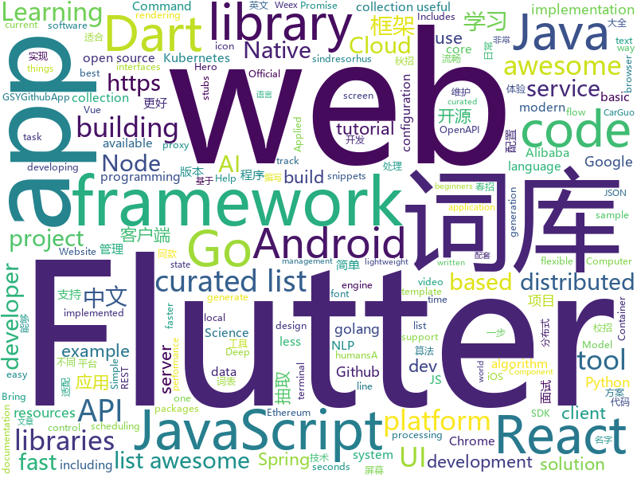

# 2018-11-07
See what the GitHub community is most excited about today.

## python
* [bert](https://github.com/google-research/bert)(**598 stars today**): TensorFlow code and pre-trained models for BERT
* [DeepCreamPy](https://github.com/deeppomf/DeepCreamPy)(**447 stars today**): Decensoring Hentai with Deep Neural Networks
* [Python](https://github.com/TheAlgorithms/Python)(**208 stars today**): All Algorithms implemented in Python
* [kamerka](https://github.com/woj-ciech/kamerka)(**134 stars today**): Build interactive map of cameras from Shodan
* [TensorFlow-Course](https://github.com/open-source-for-science/TensorFlow-Course)(**118 stars today**): Simple and ready-to-use tutorials for TensorFlow
* [Algorithm_Interview_Notes-Chinese](https://github.com/imhuay/Algorithm_Interview_Notes-Chinese)(**101 stars today**): 2018/2019/校招/春招/秋招/算法/机器学习(Machine Learning)/深度学习(Deep Learning)/自然语言处理(NLP)/C/C++/Python/面试笔记
* [PocketFlow](https://github.com/Tencent/PocketFlow)(**100 stars today**): An Automatic Model Compression (AutoMC) framework for developing smaller and faster AI applications.
* [Python](https://github.com/geekcomputers/Python)(**95 stars today**): My Python Examples
* [models](https://github.com/tensorflow/models)(**73 stars today**): Models and examples built with TensorFlow
* [system-design-primer](https://github.com/donnemartin/system-design-primer)(**57 stars today**): Learn how to design large-scale systems. Prep for the system design interview. Includes Anki flashcards.
* [Horizon](https://github.com/facebookresearch/Horizon)(**52 stars today**): A platform for Applied Reinforcement Learning (Applied RL)
* [funNLP](https://github.com/fighting41love/funNLP)(**45 stars today**): 中英文敏感词、语言检测、中外手机/电话归属地/运营商查询、名字推断性别、手机号抽取、身份证抽取、邮箱抽取、中日文人名库、中文缩写库、拆字词典、词汇情感值、停用词、反动词表、暴恐词表、繁简体转换、英文模拟中文发音、汪峰歌词生成器、职业名称词库、同义词库、反义词库、否定词库、汽车品牌&零件词库、时间抽取、连续英文切割、中文词向量大全、公司名字大全、古诗词库、IT词库、财经词库、成语词库、地名词库、历史名人词库、诗词词库、医学词库、饮食词库、法律词库、汽车词库、动物词库、中文聊天语料。
* [awesome-python](https://github.com/vinta/awesome-python)(**44 stars today**): A curated list of awesome Python frameworks, libraries, software and resources
* [keras](https://github.com/keras-team/keras)(**41 stars today**): Deep Learning for humans
* [public-apis](https://github.com/toddmotto/public-apis)(**43 stars today**): A collective list of public JSON APIs for use in web development.
* [youtube-dl](https://github.com/rg3/youtube-dl)(**40 stars today**): Command-line program to download videos from YouTube.com and other video sites
* [awesome-algorithm](https://github.com/apachecn/awesome-algorithm)(**37 stars today**): Leetcode 题解 (跟随思路一步一步撸出代码) 及经典算法实现
* [termtosvg](https://github.com/nbedos/termtosvg)(**42 stars today**): Record terminal sessions as SVG animations
* [adanet](https://github.com/tensorflow/adanet)(**40 stars today**): Fast and flexible AutoML with learning guarantees.
* [cpython](https://github.com/python/cpython)(**31 stars today**): The Python programming language
* [waveglow](https://github.com/npuichigo/waveglow)(**36 stars today**): A PyTorch implementation of the WaveGlow: A Flow-based Generative Network for Speech Synthesis
* [google-research](https://github.com/google-research/google-research)(**34 stars today**): Google AI Research
* [openshift-ansible](https://github.com/openshift/openshift-ansible)(**31 stars today**): OpenShift Installation and Configuration Management
* [maskrcnn-benchmark](https://github.com/facebookresearch/maskrcnn-benchmark)(**29 stars today**): Fast, modular reference implementation of Instance Segmentation and Object Detection algorithms in PyTorch.
* [Browser-Fuzz-Summarize](https://github.com/LyleMi/Browser-Fuzz-Summarize)(**34 stars today**): 浏览器模糊测试综述

## java
* [JCSprout](https://github.com/crossoverJie/JCSprout)(**237 stars today**): 👨‍🎓Java Core Sprout : basic, concurrent, algorithm
* [JavaGuide](https://github.com/Snailclimb/JavaGuide)(**200 stars today**): 【Java学习+面试指南】 一份涵盖大部分Java程序员所需要掌握的核心知识。
* [Agent](https://github.com/ioFog/Agent)(**101 stars today**): 
* [spring-cloud-alibaba](https://github.com/spring-cloud-incubator/spring-cloud-alibaba)(**85 stars today**): Spring Cloud Alibaba provides a one-stop solution for application development for the distributed solutions of Alibaba middleware.
* [easyexcel](https://github.com/alibaba/easyexcel)(**74 stars today**): 快速、简单避免OOM的java处理Excel工具
* [spring-boot](https://github.com/spring-projects/spring-boot)(**64 stars today**): Spring Boot
* [android-oss](https://github.com/kickstarter/android-oss)(**69 stars today**): Kickstarter for Android. Bring new ideas to life, anywhere.
* [proxyee-down](https://github.com/proxyee-down-org/proxyee-down)(**56 stars today**): http下载工具，基于http代理，支持多连接分块下载
* [nacos](https://github.com/alibaba/nacos)(**54 stars today**): an easy-to-use dynamic service discovery, configuration and service management platform for building cloud native applications
* [Connector](https://github.com/ioFog/Connector)(**47 stars today**): 
* [bifurcan](https://github.com/lacuna/bifurcan)(**52 stars today**): impure functional data structures
* [java-design-patterns](https://github.com/iluwatar/java-design-patterns)(**40 stars today**): Design patterns implemented in Java
* [symphony](https://github.com/b3log/symphony)(**46 stars today**): 🎶一款用 Java 实现的现代化社区（论坛/BBS/社交网络/博客）平台。https://hacpai.com
* [spring-framework](https://github.com/spring-projects/spring-framework)(**36 stars today**): Spring Framework
* [arthas](https://github.com/alibaba/arthas)(**37 stars today**): Alibaba Java Diagnostic Tool Arthas/Alibaba Java诊断利器Arthas
* [guava](https://github.com/google/guava)(**35 stars today**): Google core libraries for Java
* [Sentinel](https://github.com/alibaba/Sentinel)(**34 stars today**): A lightweight flow-control library providing high-available protection and monitoring (高可用防护的流量管理框架)
* [elasticsearch](https://github.com/elastic/elasticsearch)(**31 stars today**): Open Source, Distributed, RESTful Search Engine
* [tutorials](https://github.com/eugenp/tutorials)(**23 stars today**): The "REST With Spring" Course:
* [AndroidAutoSize](https://github.com/JessYanCoding/AndroidAutoSize)(**30 stars today**): 🔥A low-cost Android screen adaptation solution (今日头条屏幕适配方案终极版，一个极低成本的 Android 屏幕适配方案).
* [xxl-job](https://github.com/xuxueli/xxl-job)(**29 stars today**): A lightweight distributed task scheduling framework.（分布式任务调度平台XXL-JOB）
* [JustifiedTextView](https://github.com/amilcar-sr/JustifiedTextView)(**31 stars today**): JustifiedTextView is an android view that justifies the text. Gives support to older Android versions because "setJustificationMode" was introduced until API 26.
* [LikeMeiTuan](https://github.com/cachecats/LikeMeiTuan)(**30 stars today**): 仿美团 Android 客户端的开源项目
* [apollo](https://github.com/ctripcorp/apollo)(**23 stars today**): Apollo（阿波罗）是携程框架部门研发的分布式配置中心，能够集中化管理应用不同环境、不同集群的配置，配置修改后能够实时推送到应用端，并且具备规范的权限、流程治理等特性，适用于微服务配置管理场景。
* [SpringCloudLearning](https://github.com/forezp/SpringCloudLearning)(**25 stars today**): 《史上最简单的Spring Cloud教程源码》

## unknown
* [2019_campus_apply](https://github.com/frank-lam/2019_campus_apply)(**282 stars today**): 🚀Full Stack Developer Tutorial，后台技术栈/全栈开发/架构师之路，秋招/春招/校招/面试。 from zero to hero.
* [awful-ai](https://github.com/daviddao/awful-ai)(**218 stars today**): 😈Awful AI is a curated list to track current scary usages of AI - hoping to raise awareness
* [git-flight-rules](https://github.com/k88hudson/git-flight-rules)(**183 stars today**): Flight rules for git
* [A-to-Z-Resources-for-Students](https://github.com/dipakkr/A-to-Z-Resources-for-Students)(**150 stars today**): Curated list of resources for college students Show your❤️by giving a⭐️
* [FinancialSupportForOpenSource](https://github.com/wizicer/FinancialSupportForOpenSource)(**151 stars today**): 开源项目挣钱实用手册
* [CS-Notes](https://github.com/CyC2018/CS-Notes)(**84 stars today**): 📚Computer Science Learning Notes
* [awesome](https://github.com/sindresorhus/awesome)(**88 stars today**): 😎Curated list of awesome lists
* [gitignore](https://github.com/github/gitignore)(**53 stars today**): A collection of useful .gitignore templates
* [developer-roadmap](https://github.com/kamranahmedse/developer-roadmap)(**69 stars today**): Roadmap to becoming a web developer in 2018
* [You-Dont-Know-JS](https://github.com/getify/You-Dont-Know-JS)(**63 stars today**): A book series on JavaScript. @YDKJS on twitter.
* [coding-interview-university](https://github.com/jwasham/coding-interview-university)(**58 stars today**): A complete computer science study plan to become a software engineer.
* [3y](https://github.com/ZhongFuCheng3y/3y)(**50 stars today**): 3y文章导航
* [first-contributions](https://github.com/firstcontributions/first-contributions)(**34 stars today**): 🚀✨Help beginners to contribute to open source projects
* [free-programming-books](https://github.com/EbookFoundation/free-programming-books)(**42 stars today**): 📚Freely available programming books
* [PRML-Solution-Manual](https://github.com/GoldenCheese/PRML-Solution-Manual)(**44 stars today**): my own Solution Manual of PRML
* [awesome-ruby-security](https://github.com/pxlpnk/awesome-ruby-security)(**49 stars today**): Awesome Ruby Security resources
* [awesome-vue](https://github.com/vuejs/awesome-vue)(**42 stars today**): 🎉A curated list of awesome things related to Vue.js
* [project-based-learning](https://github.com/tuvtran/project-based-learning)(**43 stars today**): Curated list of project-based tutorials
* [Learn_Data_Science_in_3_Months](https://github.com/llSourcell/Learn_Data_Science_in_3_Months)(**36 stars today**): This is the Curriculum for "Learn Data Science in 3 Months" By Siraj Raval on Youtube
* [kubernetes-the-hard-way](https://github.com/kelseyhightower/kubernetes-the-hard-way)(**35 stars today**): Bootstrap Kubernetes the hard way on Google Cloud Platform. No scripts.
* [awesome-sysadmin](https://github.com/kahun/awesome-sysadmin)(**33 stars today**): A curated list of amazingly awesome open source sysadmin resources inspired by Awesome PHP.
* [nodebestpractices](https://github.com/i0natan/nodebestpractices)(**32 stars today**): The largest Node.JS best practices list (October 2018)
* [awesome-for-beginners](https://github.com/MunGell/awesome-for-beginners)(**29 stars today**): A list of awesome beginners-friendly projects.
* [awesome-ai-residency](https://github.com/dangkhoasdc/awesome-ai-residency)(**27 stars today**): List of AI Residency Programs
* [awesome-react](https://github.com/enaqx/awesome-react)(**27 stars today**): A collection of awesome things regarding React ecosystem.

## javascript
* [redbird](https://github.com/OptimalBits/redbird)(**568 stars today**): A modern reverse proxy for node
* [carlo](https://github.com/GoogleChromeLabs/carlo)(**405 stars today**): Web rendering surface for Node applications
* [glorious-demo](https://github.com/glorious-codes/glorious-demo)(**317 stars today**): The easiest way to demonstrate your code in action.
* [free-programming-books-zh_CN](https://github.com/justjavac/free-programming-books-zh_CN)(**231 stars today**): 📚免费的计算机编程类中文书籍，欢迎投稿
* [33-js-concepts](https://github.com/leonardomso/33-js-concepts)(**198 stars today**): 📜33 concepts every JavaScript developer should know.
* [AwesomeXSS](https://github.com/s0md3v/AwesomeXSS)(**151 stars today**): Awesome XSS stuff
* [easy-peasy](https://github.com/ctrlplusb/easy-peasy)(**144 stars today**): Easy peasy global state for React
* [taro](https://github.com/NervJS/taro)(**133 stars today**): 多端统一开发框架，支持用 React 的开发方式编写一次代码，生成能运行在微信小程序/百度智能小程序/支付宝小程序、H5、React Native 等的应用。
* [vue](https://github.com/vuejs/vue)(**124 stars today**): 🖖A progressive, incrementally-adoptable JavaScript framework for building UI on the web.
* [30-seconds-of-code](https://github.com/30-seconds/30-seconds-of-code)(**122 stars today**): Curated collection of useful JavaScript snippets that you can understand in 30 seconds or less.
* [fx](https://github.com/antonmedv/fx)(**118 stars today**): Command-line JSON processing tool🔥
* [react](https://github.com/facebook/react)(**103 stars today**): A declarative, efficient, and flexible JavaScript library for building user interfaces.
* [33-js-concepts](https://github.com/stephentian/33-js-concepts)(**100 stars today**): 📜每个 JavaScript 工程师都应懂的33个概念 @leonardomso
* [create-react-app](https://github.com/facebook/create-react-app)(**77 stars today**): Set up a modern web app by running one command.
* [ice](https://github.com/alibaba/ice)(**79 stars today**): 🚀飞冰 - 让前端开发简单而友好，海量可复用物料，配套桌面工具极速构建前端应用，效率提升 100%
* [node](https://github.com/nodejs/node)(**53 stars today**): Node.js JavaScript runtime✨🐢🚀✨
* [howler.js](https://github.com/goldfire/howler.js)(**77 stars today**): Javascript audio library for the modern web.
* [react-native](https://github.com/facebook/react-native)(**63 stars today**): A framework for building native apps with React.
* [ervy](https://github.com/chunqiuyiyu/ervy)(**72 stars today**): Bring charts to terminal.
* [humanize-url](https://github.com/sindresorhus/humanize-url)(**72 stars today**): Humanize a URL: https://sindresorhus.com → sindresorhus.com
* [puppeteer](https://github.com/GoogleChrome/puppeteer)(**61 stars today**): Headless Chrome Node API
* [awesome-vscode](https://github.com/viatsko/awesome-vscode)(**63 stars today**): 🎨A curated list of delightful VS Code packages and resources.
* [Controller](https://github.com/ioFog/Controller)(**48 stars today**): 
* [axios](https://github.com/axios/axios)(**57 stars today**): Promise based HTTP client for the browser and node.js
* [storybook](https://github.com/storybooks/storybook)(**54 stars today**): Interactive UI component dev & test: React, React Native, Vue, Angular, Ember

## html
* [SuperTextView](https://github.com/chenBingX/SuperTextView)(**69 stars today**): Welcome to use SuperTextView
* [30-seconds-of-css](https://github.com/30-seconds/30-seconds-of-css)(**41 stars today**): A curated collection of useful CSS snippets you can understand in 30 seconds or less.
* [BFuzz](https://github.com/RootUp/BFuzz)(**21 stars today**): Fuzzing Browsers
* [coreui-free-bootstrap-admin-template](https://github.com/coreui/coreui-free-bootstrap-admin-template)(**20 stars today**): CoreUI is free bootstrap admin template
* [NLP-progress](https://github.com/sebastianruder/NLP-progress)(**16 stars today**): Repository to track the progress in Natural Language Processing (NLP), including the datasets and the current state-of-the-art for the most common NLP tasks.
* [swagger-codegen](https://github.com/swagger-api/swagger-codegen)(**17 stars today**): swagger-codegen contains a template-driven engine to generate documentation, API clients and server stubs in different languages by parsing your OpenAPI / Swagger definition.
* [solid](https://github.com/solid/solid)(**18 stars today**): Solid - Re-decentralizing the web (project directory)
* [async-javascript-cheatsheet](https://github.com/frontarm/async-javascript-cheatsheet)(**17 stars today**): Cheatsheet for promises and async/await
* [Spoon-Knife](https://github.com/octocat/Spoon-Knife)(****): This repo is for demonstration purposes only.
* [JavaScript30](https://github.com/wesbos/JavaScript30)(**8 stars today**): 30 Day Vanilla JS Challenge
* [qiubaiying.github.io](https://github.com/qiubaiying/qiubaiying.github.io)(**6 stars today**): BY Blog ->
* [react-redux](https://github.com/reduxjs/react-redux)(**12 stars today**): Official React bindings for Redux
* [openapi-generator](https://github.com/OpenAPITools/openapi-generator)(**12 stars today**): OpenAPI Generator allows generation of API client libraries (SDK generation), server stubs, documentation and configuration automatically given an OpenAPI Spec (v2, v3)
* [fastText](https://github.com/facebookresearch/fastText)(**11 stars today**): Library for fast text representation and classification.
* [computer-museum-dnbwg](https://github.com/pengan1987/computer-museum-dnbwg)(**9 stars today**): 电脑博物馆 - DNBWG.com
* [gci18.fossasia.org](https://github.com/fossasia/gci18.fossasia.org)(**7 stars today**): FOSSASIA Google Code-In Website 2018 https://gci18.fossasia.org
* [portainer](https://github.com/portainer/portainer)(**10 stars today**): Simple management UI for Docker
* [react-from-zero](https://github.com/kay-is/react-from-zero)(**10 stars today**): A simple (99% ES2015 less) tutorial for React
* [foundation-sites](https://github.com/zurb/foundation-sites)(**10 stars today**): The most advanced responsive front-end framework in the world. Quickly create prototypes and production code for sites that work on any kind of device.
* [EIPs](https://github.com/ethereum/EIPs)(**8 stars today**): The Ethereum Improvement Proposal repository
* [electron-api-demos](https://github.com/electron/electron-api-demos)(**9 stars today**): Explore the Electron APIs
* [YouMightNotNeedJS](https://github.com/una/YouMightNotNeedJS)(**9 stars today**): 
* [ionicons](https://github.com/ionic-team/ionicons)(**8 stars today**): The premium icon font for Ionic Framework and web apps everywhere
* [webcomponentsjs](https://github.com/webcomponents/webcomponentsjs)(**8 stars today**): A suite of polyfills supporting the HTML Web Components specs
* [javascript-tutorial-en](https://github.com/iliakan/javascript-tutorial-en)(**6 stars today**): Modern JavaScript Tutorial

## dart
* [flutter](https://github.com/flutter/flutter)(**70 stars today**): Flutter makes it easy and fast to build beautiful mobile apps.
* [awesome-flutter](https://github.com/Solido/awesome-flutter)(**31 stars today**): An awesome list that curates the best Flutter libraries, tools, tutorials, articles and more.
* [plugins](https://github.com/flutter/plugins)(**10 stars today**): Plugins for Flutter, including FlutterFire, maintained by the Flutter team
* [Flutter-UI-Kit](https://github.com/iampawan/Flutter-UI-Kit)(**9 stars today**): Flutter app for collection of UI in a UIKit
* [samples](https://github.com/flutter/samples)(**8 stars today**): A collection of Flutter examples and demos.
* [sdk](https://github.com/dart-lang/sdk)(**6 stars today**): The Dart SDK, including the VM, dart2js, core libraries, and more.
* [flutter_architecture_samples](https://github.com/brianegan/flutter_architecture_samples)(**5 stars today**): TodoMVC for Flutter
* [flutter_sidekick](https://github.com/letsar/flutter_sidekick)(**5 stars today**): Widgets for creating Hero-like animations between two widgets within the same screen.
* [website](https://github.com/flutter/website)(****): Flutter web site
* [font_awesome_flutter](https://github.com/brianegan/font_awesome_flutter)(****): The Font Awesome Icon pack available as Flutter Icons
* [gcloud](https://github.com/dart-lang/gcloud)(****): High-level interfaces to Google Cloud Platform APIs
* [site-www](https://github.com/dart-lang/site-www)(****): Source for Dart website
* [chromedeveditor](https://github.com/googlearchive/chromedeveditor)(****): Chrome Dev Editor is a developer tool for building apps on the Chrome platform - Chrome Apps and Web Apps, in JavaScript or Dart. (NO LONGER IN ACTIVE DEVELOPMENT)
* [GSYGithubAppFlutter](https://github.com/CarGuo/GSYGithubAppFlutter)(****): 超完整的Flutter项目，功能丰富，适合学习和日常使用。GSYGithubApp系列的优势：我们目前已经拥有Flutter、Weex、ReactNative三个版本。 功能齐全，项目框架内技术涉及面广，完成度高，持续维护，配套文章，适合全面学习，跨框架对比参考。跨平台的开源Github客户端App，更好的体验，更丰富的功能，旨在更好的日常管理和维护个人Github，提供更好更方便的驾车体验～～Σ(￣。￣ﾉ)ﾉ。同款Weex版本 ： https://github.com/CarGuo/GSYGithubAppWeex 、同款React Native版本 ： https://github.com/CarGuo/GSYGithubApp
* [FlutterExampleApps](https://github.com/iampawan/FlutterExampleApps)(****): [Example APPS] Basic Flutter apps, for flutter devs.
* [flutter-osc](https://github.com/yubo725/flutter-osc)(****): 基于Google Flutter的开源中国客户端，支持Android和iOS。
* [flutter-examples](https://github.com/nisrulz/flutter-examples)(****): [Examples] Simple basic isolated apps, for budding flutter devs.
* [Flutter-learning](https://github.com/AweiLoveAndroid/Flutter-learning)(****): 🔥👍🌟⭐️⭐️⭐️Flutter install&settings,Flutter problems when developing,Flutter sample codes& templates,Flutter projects,Dart languages sample codes
* [dio](https://github.com/flutterchina/dio)(****): A powerful Http client for Dart, which supports Interceptors, FormData, Request Cancellation, File Downloading, Timeout etc.
* [inKino](https://github.com/roughike/inKino)(****): inKino - A cross platform movie and showtime browser for Finnkino cinemas, made with Flutter.
* [hauberk](https://github.com/munificent/hauberk)(****): A web-based roguelike written in Dart.
* [zhihu-flutter](https://github.com/HackSoul/zhihu-flutter)(****): Flutter 高仿知乎 UI，非常漂亮，也非常流畅，flutter build apk 或 flutter build ios 之后更流畅
* [angular](https://github.com/dart-lang/angular)(****): Fast and productive web framework provided by Dart
* [StageXL](https://github.com/bp74/StageXL)(****): A fast and universal 2D rendering engine for HTML5 and Dart.
* [dart-sass](https://github.com/sass/dart-sass)(****): A Dart implementation of Sass.

## go
* [kubefwd](https://github.com/txn2/kubefwd)(**225 stars today**): Bulk port forwarding Kubernetes services for local development.
* [gocity](https://github.com/rodrigo-brito/gocity)(**164 stars today**): 📊Code City metaphor for visualizing Go source code in 3D
* [stellar](https://github.com/ehazlett/stellar)(**135 stars today**): Simplified Container System
* [dive](https://github.com/wagoodman/dive)(**91 stars today**): A tool for exploring each layer in a docker image
* [go](https://github.com/golang/go)(**69 stars today**): The Go programming language
* [kubernetes](https://github.com/kubernetes/kubernetes)(**58 stars today**): Production-Grade Container Scheduling and Management
* [up](https://github.com/akavel/up)(**56 stars today**): Ultimate Plumber is a tool for writing Linux pipes with instant live preview
* [gin](https://github.com/gin-gonic/gin)(**52 stars today**): Gin is a HTTP web framework written in Go (Golang). It features a Martini-like API with much better performance -- up to 40 times faster. If you need smashing performance, get yourself some Gin.
* [soar](https://github.com/XiaoMi/soar)(**48 stars today**): SQL Optimizer And Rewriter
* [awesome-go](https://github.com/avelino/awesome-go)(**43 stars today**): A curated list of awesome Go frameworks, libraries and software
* [frp](https://github.com/fatedier/frp)(**37 stars today**): A fast reverse proxy to help you expose a local server behind a NAT or firewall to the internet.
* [beku](https://github.com/yulibaozi/beku)(**44 stars today**): A golang Kubernetes deploy library for humans
* [errorx](https://github.com/joomcode/errorx)(**41 stars today**): A comprehensive error handling library for Go
* [build-web-application-with-golang](https://github.com/astaxie/build-web-application-with-golang)(**37 stars today**): A golang ebook intro how to build a web with golang
* [gogs](https://github.com/gogs/gogs)(**37 stars today**): Gogs is a painless self-hosted Git service.
* [gqlgen](https://github.com/99designs/gqlgen)(**36 stars today**): go generate based graphql server library
* [BaiduPCS-Go](https://github.com/iikira/BaiduPCS-Go)(**32 stars today**): 百度网盘客户端 - Go语言编写
* [server](https://github.com/gotify/server)(**35 stars today**): A REST-API for sending and receiving messages in real-time per web socket. (Includes a sleek web-ui)
* [hugo](https://github.com/gohugoio/hugo)(**32 stars today**): The world’s fastest framework for building websites.
* [gorm](https://github.com/jinzhu/gorm)(**30 stars today**): The fantastic ORM library for Golang, aims to be developer friendly
* [istio](https://github.com/istio/istio)(**28 stars today**): Connect, secure, control, and observe services.
* [go-ethereum](https://github.com/ethereum/go-ethereum)(**23 stars today**): Official Go implementation of the Ethereum protocol
* [go-internal](https://github.com/rogpeppe/go-internal)(**26 stars today**): Selected Go-internal packages factored out from the standard library
* [jaeger](https://github.com/jaegertracing/jaeger)(**25 stars today**): CNCF Jaeger, a Distributed Tracing System
* [etcd](https://github.com/etcd-io/etcd)(**25 stars today**): Distributed reliable key-value store for the most critical data of a distributed system

## WordCloud

