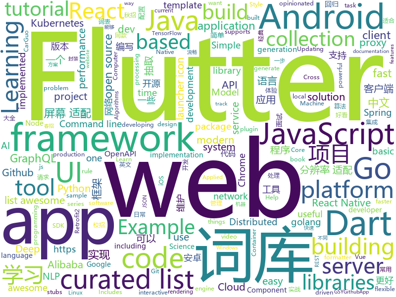

# 2018-11-08
See what the GitHub community is most excited about today.

## python
* [bert](https://github.com/google-research/bert)(**436 stars today**): TensorFlow code and pre-trained models for BERT
* [DeepCreamPy](https://github.com/deeppomf/DeepCreamPy)(**261 stars today**): Decensoring Hentai with Deep Neural Networks
* [funNLP](https://github.com/fighting41love/funNLP)(**169 stars today**): 中英文敏感词、语言检测、中外手机/电话归属地/运营商查询、名字推断性别、手机号抽取、身份证抽取、邮箱抽取、中日文人名库、中文缩写库、拆字词典、词汇情感值、停用词、反动词表、暴恐词表、繁简体转换、英文模拟中文发音、汪峰歌词生成器、职业名称词库、同义词库、反义词库、否定词库、汽车品牌&零件词库、时间抽取、连续英文切割、中文词向量大全、公司名字大全、古诗词库、IT词库、财经词库、成语词库、地名词库、历史名人词库、诗词词库、医学词库、饮食词库、法律词库、汽车词库、动物词库、中文聊天语料。
* [Python](https://github.com/TheAlgorithms/Python)(**158 stars today**): All Algorithms implemented in Python
* [hiddenlayer](https://github.com/waleedka/hiddenlayer)(**107 stars today**): Neural network graphs and training metrics for PyTorch and Tensorflow.
* [Algorithm_Interview_Notes-Chinese](https://github.com/imhuay/Algorithm_Interview_Notes-Chinese)(**89 stars today**): 2018/2019/校招/春招/秋招/算法/机器学习(Machine Learning)/深度学习(Deep Learning)/自然语言处理(NLP)/C/C++/Python/面试笔记
* [FloWaveNet](https://github.com/ksw0306/FloWaveNet)(**92 stars today**): A Pytorch implementation of "FloWaveNet: A Generative Flow for Raw Audio"
* [models](https://github.com/tensorflow/models)(**74 stars today**): Models and examples built with TensorFlow
* [TensorFlow-Course](https://github.com/open-source-for-science/TensorFlow-Course)(**79 stars today**): Simple and ready-to-use tutorials for TensorFlow
* [Python](https://github.com/geekcomputers/Python)(**76 stars today**): My Python Examples
* [shopping-classification](https://github.com/kakao-arena/shopping-classification)(**69 stars today**): 쇼핑몰 상품 카테고리 분류 대회의 baseline
* [pytorch-tutorial](https://github.com/yunjey/pytorch-tutorial)(**71 stars today**): PyTorch Tutorial for Deep Learning Researchers
* [system-design-primer](https://github.com/donnemartin/system-design-primer)(**67 stars today**): Learn how to design large-scale systems. Prep for the system design interview. Includes Anki flashcards.
* [saleor](https://github.com/mirumee/saleor)(**61 stars today**): A modular, high performance e-commerce storefront built with Python, GraphQL, Django, and ReactJS.
* [awesome-algorithm](https://github.com/apachecn/awesome-algorithm)(**55 stars today**): Leetcode 题解 (跟随思路一步一步撸出代码) 及经典算法实现
* [awesome-python](https://github.com/vinta/awesome-python)(**52 stars today**): A curated list of awesome Python frameworks, libraries, software and resources
* [kamerka](https://github.com/woj-ciech/kamerka)(**51 stars today**): Build interactive map of cameras from Shodan
* [Horizon](https://github.com/facebookresearch/Horizon)(**52 stars today**): A platform for Applied Reinforcement Learning (Applied RL)
* [youtube-dl](https://github.com/rg3/youtube-dl)(**49 stars today**): Command-line program to download videos from YouTube.com and other video sites
* [scikit-learn](https://github.com/scikit-learn/scikit-learn)(**43 stars today**): scikit-learn: machine learning in Python
* [PocketFlow](https://github.com/Tencent/PocketFlow)(**48 stars today**): An Automatic Model Compression (AutoMC) framework for developing smaller and faster AI applications.
* [zulip](https://github.com/zulip/zulip)(**46 stars today**): Zulip server - powerful open source team chat
* [studyFiles](https://github.com/threerocks/studyFiles)(**40 stars today**): 一些经典且高质量的电子书分享
* [keras](https://github.com/keras-team/keras)(**34 stars today**): Deep Learning for humans
* [progressive_growing_of_gans](https://github.com/tkarras/progressive_growing_of_gans)(**40 stars today**): Progressive Growing of GANs for Improved Quality, Stability, and Variation

## java
* [JavaGuide](https://github.com/Snailclimb/JavaGuide)(**255 stars today**): 【Java学习+面试指南】 一份涵盖大部分Java程序员所需要掌握的核心知识。
* [ratel](https://github.com/ainilili/ratel)(**164 stars today**): A fighting landlord program that can be played on the command line
* [JCSprout](https://github.com/crossoverJie/JCSprout)(**137 stars today**): 👨‍🎓Java Core Sprout : basic, concurrent, algorithm
* [ToastUtils](https://github.com/getActivity/ToastUtils)(**97 stars today**): This is a very functional Toast
* [proxyee-down](https://github.com/proxyee-down-org/proxyee-down)(**90 stars today**): http下载工具，基于http代理，支持多连接分块下载
* [spring-boot](https://github.com/spring-projects/spring-boot)(**67 stars today**): Spring Boot
* [tutorials](https://github.com/eugenp/tutorials)(**53 stars today**): The "REST With Spring" Course:
* [arthas](https://github.com/alibaba/arthas)(**69 stars today**): Alibaba Java Diagnostic Tool Arthas/Alibaba Java诊断利器Arthas
* [java-design-patterns](https://github.com/iluwatar/java-design-patterns)(**67 stars today**): Design patterns implemented in Java
* [spring-cloud-alibaba](https://github.com/spring-cloud-incubator/spring-cloud-alibaba)(**58 stars today**): Spring Cloud Alibaba provides a one-stop solution for application development for the distributed solutions of Alibaba middleware.
* [easyexcel](https://github.com/alibaba/easyexcel)(**58 stars today**): 快速、简单避免OOM的java处理Excel工具
* [symphony](https://github.com/b3log/symphony)(**56 stars today**): 🎶一款用 Java 实现的现代化社区（论坛/BBS/社交网络/博客）平台。https://hacpai.com
* [APIJSON](https://github.com/TommyLemon/APIJSON)(**48 stars today**): 🚀后端接口和文档自动化，前端(客户端) 定制返回JSON的数据和结构！
* [AndroidAutoSize](https://github.com/JessYanCoding/AndroidAutoSize)(**42 stars today**): 🔥A low-cost Android screen adaptation solution (今日头条屏幕适配方案终极版，一个极低成本的 Android 屏幕适配方案).
* [elasticsearch](https://github.com/elastic/elasticsearch)(**39 stars today**): Open Source, Distributed, RESTful Search Engine
* [spring-framework](https://github.com/spring-projects/spring-framework)(**35 stars today**): Spring Framework
* [apollo](https://github.com/ctripcorp/apollo)(**37 stars today**): Apollo（阿波罗）是携程框架部门研发的分布式配置中心，能够集中化管理应用不同环境、不同集群的配置，配置修改后能够实时推送到应用端，并且具备规范的权限、流程治理等特性，适用于微服务配置管理场景。
* [incubator-dubbo](https://github.com/apache/incubator-dubbo)(**35 stars today**): Apache Dubbo (incubating) is a high-performance, java based, open source RPC framework.
* [android-oss](https://github.com/kickstarter/android-oss)(**39 stars today**): Kickstarter for Android. Bring new ideas to life, anywhere.
* [TimoMenu](https://github.com/samlss/TimoMenu)(**40 stars today**): A pop-up menu for android that supports multi-row scrollable submenus.
* [BaseProject](https://github.com/fly803/BaseProject)(**38 stars today**): BaseProject是一个Android基础程序架构库（安卓屏幕适配ResolutionAdaption，安卓分辨率适配，网络通信，公用方法等），使用它可以快速稳定高效的建立一个Android工程， 它集成了一个项目最基本，可以说每个项目必备的一些库。 省的自己导入BaseActivity，BaseFragment，集成好分辨率适配（屏幕适配），使开发者可以 用侵入性最小的代价完成Android屏幕适配（安卓分辨率适配），网络请求（RxJava2+Retrofit2）， 有大量常用的工具类。让你更加专注去实现自己产品需求， 业务逻辑，而不是浪费时间在重复的工作上！，包含四大部分：一、分辨率适配 二、网络请求框架Retrofit2封装 三、Android基类封装和项目常用Utils 方…
* [SpringCloudLearning](https://github.com/forezp/SpringCloudLearning)(**31 stars today**): 《史上最简单的Spring Cloud教程源码》
* [Java](https://github.com/TheAlgorithms/Java)(**34 stars today**): All Algorithms implemented in Java
* [nacos](https://github.com/alibaba/nacos)(**27 stars today**): an easy-to-use dynamic service discovery, configuration and service management platform for building cloud native applications
* [netty](https://github.com/netty/netty)(**24 stars today**): Netty project - an event-driven asynchronous network application framework

## unknown
* [git-flight-rules](https://github.com/k88hudson/git-flight-rules)(**292 stars today**): Flight rules for git
* [clash_for_windows_pkg](https://github.com/Fndroid/clash_for_windows_pkg)(**197 stars today**): A Windows GUI for Clash
* [2019_campus_apply](https://github.com/frank-lam/2019_campus_apply)(**154 stars today**): 🚀Full Stack Developer Tutorial，后台技术栈/全栈开发/架构师之路，秋招/春招/校招/面试。 from zero to hero.
* [awful-ai](https://github.com/daviddao/awful-ai)(**161 stars today**): 😈Awful AI is a curated list to track current scary usages of AI - hoping to raise awareness
* [awesome](https://github.com/sindresorhus/awesome)(**82 stars today**): 😎Curated list of awesome lists
* [CS-Notes](https://github.com/CyC2018/CS-Notes)(**71 stars today**): 📚Computer Science Learning Notes
* [gitignore](https://github.com/github/gitignore)(**58 stars today**): A collection of useful .gitignore templates
* [free-programming-books](https://github.com/EbookFoundation/free-programming-books)(**59 stars today**): 📚Freely available programming books
* [FinancialSupportForOpenSource](https://github.com/wizicer/FinancialSupportForOpenSource)(**61 stars today**): 开源项目挣钱实用手册
* [A-to-Z-Resources-for-Students](https://github.com/dipakkr/A-to-Z-Resources-for-Students)(**53 stars today**): Curated list of resources for college students Show your❤️by giving a⭐️
* [You-Dont-Know-JS](https://github.com/getify/You-Dont-Know-JS)(**52 stars today**): A book series on JavaScript. @YDKJS on twitter.
* [awesome-vue](https://github.com/vuejs/awesome-vue)(**45 stars today**): 🎉A curated list of awesome things related to Vue.js
* [coding-interview-university](https://github.com/jwasham/coding-interview-university)(**38 stars today**): A complete computer science study plan to become a software engineer.
* [PRML-Solution-Manual](https://github.com/GoldenCheese/PRML-Solution-Manual)(**37 stars today**): my own Solution Manual of PRML
* [Learn_Data_Science_in_3_Months](https://github.com/llSourcell/Learn_Data_Science_in_3_Months)(**30 stars today**): This is the Curriculum for "Learn Data Science in 3 Months" By Siraj Raval on Youtube
* [go-best-practice](https://github.com/llitfkitfk/go-best-practice)(**37 stars today**): Go语言实战: 编写可维护Go语言代码建议
* [ambiente-react-native](https://github.com/Rocketseat/ambiente-react-native)(**32 stars today**): 📱Configuração de ambiente de desenvolvimento React Native no Windows, Linux e OS X (Mac)
* [project-based-learning](https://github.com/tuvtran/project-based-learning)(**31 stars today**): Curated list of project-based tutorials
* [first-contributions](https://github.com/firstcontributions/first-contributions)(**24 stars today**): 🚀✨Help beginners to contribute to open source projects
* [PentestHardware](https://github.com/unprovable/PentestHardware)(**33 stars today**): Kinda useful notes collated together publicly
* [docs](https://github.com/laravel/docs)(**26 stars today**): 
* [eee](https://github.com/karalabe/eee)(**27 stars today**): Ethereum Engineering Effort
* [kubernetes-the-hard-way](https://github.com/kelseyhightower/kubernetes-the-hard-way)(**24 stars today**): Bootstrap Kubernetes the hard way on Google Cloud Platform. No scripts.
* [awesome-react](https://github.com/enaqx/awesome-react)(**26 stars today**): A collection of awesome things regarding React ecosystem.
* [3y](https://github.com/ZhongFuCheng3y/3y)(**24 stars today**): 3y文章导航

## javascript
* [fx](https://github.com/antonmedv/fx)(**618 stars today**): Command-line JSON processing tool🔥
* [redbird](https://github.com/OptimalBits/redbird)(**263 stars today**): A modern reverse proxy for node
* [taro](https://github.com/NervJS/taro)(**238 stars today**): 多端统一开发框架，支持用 React 的开发方式编写一次代码，生成能运行在微信小程序/百度智能小程序/支付宝小程序、H5、React Native 等的应用。
* [AwesomeXSS](https://github.com/s0md3v/AwesomeXSS)(**219 stars today**): Awesome XSS stuff
* [carlo](https://github.com/GoogleChromeLabs/carlo)(**217 stars today**): Web rendering surface for Node applications
* [free-programming-books-zh_CN](https://github.com/justjavac/free-programming-books-zh_CN)(**188 stars today**): 📚免费的计算机编程类中文书籍，欢迎投稿
* [glorious-demo](https://github.com/glorious-codes/glorious-demo)(**185 stars today**): The easiest way to demonstrate your code in action.
* [33-js-concepts](https://github.com/leonardomso/33-js-concepts)(**146 stars today**): 📜33 concepts every JavaScript developer should know.
* [easy-peasy](https://github.com/ctrlplusb/easy-peasy)(**122 stars today**): Easy peasy global state for React
* [vue](https://github.com/vuejs/vue)(**104 stars today**): 🖖A progressive, incrementally-adoptable JavaScript framework for building UI on the web.
* [react](https://github.com/facebook/react)(**97 stars today**): A declarative, efficient, and flexible JavaScript library for building user interfaces.
* [30-seconds-of-code](https://github.com/30-seconds/30-seconds-of-code)(**90 stars today**): Curated collection of useful JavaScript snippets that you can understand in 30 seconds or less.
* [ice](https://github.com/alibaba/ice)(**91 stars today**): 🚀飞冰 - 让前端开发简单而友好，海量可复用物料，配套桌面工具极速构建前端应用，效率提升 100%
* [pennywise](https://github.com/kamranahmedse/pennywise)(**83 stars today**): Cross-platform application to open any website or media in a floating window
* [create-react-app](https://github.com/facebook/create-react-app)(**73 stars today**): Set up a modern web app by running one command.
* [33-js-concepts](https://github.com/stephentian/33-js-concepts)(**76 stars today**): 📜每个 JavaScript 工程师都应懂的33个概念 @leonardomso
* [react-native](https://github.com/facebook/react-native)(**66 stars today**): A framework for building native apps with React.
* [omi](https://github.com/Tencent/omi)(**64 stars today**): Next generation web framework in 4kb JavaScript (Web Components + JSX + Proxy + Store + Path Updating)
* [storybook](https://github.com/storybooks/storybook)(**62 stars today**): Interactive UI component dev & test: React, React Native, Vue, Angular, Ember
* [javascript](https://github.com/airbnb/javascript)(**56 stars today**): JavaScript Style Guide
* [node](https://github.com/nodejs/node)(**47 stars today**): Node.js JavaScript runtime✨🐢🚀✨
* [prettier](https://github.com/prettier/prettier)(**52 stars today**): Prettier is an opinionated code formatter.
* [cn.vuejs.org](https://github.com/vuejs/cn.vuejs.org)(**53 stars today**): 🇨🇳Chinese translation for vuejs.org
* [puppeteer](https://github.com/GoogleChrome/puppeteer)(**49 stars today**): Headless Chrome Node API
* [three.js](https://github.com/mrdoob/three.js)(**36 stars today**): JavaScript 3D library.

## html
* [SuperTextView](https://github.com/chenBingX/SuperTextView)(**60 stars today**): Welcome to use SuperTextView
* [react-redux](https://github.com/reduxjs/react-redux)(**34 stars today**): Official React bindings for Redux
* [fit2cloud2.0-module-demo](https://github.com/fit2cloudrd/fit2cloud2.0-module-demo)(**23 stars today**): FIT2CLOUD 云管平台2.0 扩展模块示范工程
* [styleguide](https://github.com/google/styleguide)(**19 stars today**): Style guides for Google-originated open-source projects
* [illustrated-tls13](https://github.com/syncsynchalt/illustrated-tls13)(**22 stars today**): The Illustrated TLS 1.3 Connection: Every byte explained
* [JavaScript30](https://github.com/wesbos/JavaScript30)(**11 stars today**): 30 Day Vanilla JS Challenge
* [solid](https://github.com/solid/solid)(**18 stars today**): Solid - Re-decentralizing the web (project directory)
* [coreui-free-bootstrap-admin-template](https://github.com/coreui/coreui-free-bootstrap-admin-template)(**15 stars today**): CoreUI is free bootstrap admin template
* [Spoon-Knife](https://github.com/octocat/Spoon-Knife)(****): This repo is for demonstration purposes only.
* [portainer](https://github.com/portainer/portainer)(**14 stars today**): Simple management UI for Docker
* [NLP-progress](https://github.com/sebastianruder/NLP-progress)(**14 stars today**): Repository to track the progress in Natural Language Processing (NLP), including the datasets and the current state-of-the-art for the most common NLP tasks.
* [computer-museum-dnbwg](https://github.com/pengan1987/computer-museum-dnbwg)(**12 stars today**): 电脑博物馆 - DNBWG.com
* [GTFOBins.github.io](https://github.com/GTFOBins/GTFOBins.github.io)(**12 stars today**): Curated list of Unix binaries that can be exploited to bypass system security restrictions
* [fastText](https://github.com/facebookresearch/fastText)(**11 stars today**): Library for fast text representation and classification.
* [openapi-generator](https://github.com/OpenAPITools/openapi-generator)(**9 stars today**): OpenAPI Generator allows generation of API client libraries (SDK generation), server stubs, documentation and configuration automatically given an OpenAPI Spec (v2, v3)
* [polymer](https://github.com/Polymer/polymer)(**10 stars today**): Build modern apps using web components
* [electron-api-demos](https://github.com/electron/electron-api-demos)(**9 stars today**): Explore the Electron APIs
* [babel-blade](https://github.com/sw-yx/babel-blade)(**10 stars today**): a Babel plugin/macro that solves the Double Declaration problem in GraphQL. Please see Docs at:
* [EIPs](https://github.com/ethereum/EIPs)(**9 stars today**): The Ethereum Improvement Proposal repository
* [foundation-sites](https://github.com/zurb/foundation-sites)(**9 stars today**): The most advanced responsive front-end framework in the world. Quickly create prototypes and production code for sites that work on any kind of device.
* [swagger-codegen](https://github.com/swagger-api/swagger-codegen)(**7 stars today**): swagger-codegen contains a template-driven engine to generate documentation, API clients and server stubs in different languages by parsing your OpenAPI / Swagger definition.
* [Machine-Learning](https://github.com/Jack-Cherish/Machine-Learning)(**7 stars today**): ⚡️机器学习实战（Python3）：kNN、决策树、贝叶斯、逻辑回归、SVM、线性回归、树回归
* [bitcoin-whitepaper-chinese-translation](https://github.com/xiaolai/bitcoin-whitepaper-chinese-translation)(**8 stars today**): 
* [patchwork](https://github.com/jlord/patchwork)(****): All the Git-it Workshop completers!
* [webcomponentsjs](https://github.com/webcomponents/webcomponentsjs)(**8 stars today**): A suite of polyfills supporting the HTML Web Components specs

## dart
* [flutter](https://github.com/flutter/flutter)(**90 stars today**): Flutter makes it easy and fast to build beautiful mobile apps.
* [inKino](https://github.com/roughike/inKino)(**25 stars today**): inKino - A multiplatform Dart movie app with code sharing between Flutter and the Web.
* [awesome-flutter](https://github.com/Solido/awesome-flutter)(**24 stars today**): An awesome list that curates the best Flutter libraries, tools, tutorials, articles and more.
* [Flutter-Notebook](https://github.com/OpenFlutter/Flutter-Notebook)(**12 stars today**): 日更的FlutterDemo合集，今天你fu了吗
* [samples](https://github.com/flutter/samples)(**11 stars today**): A collection of Flutter examples and demos.
* [plugins](https://github.com/flutter/plugins)(**7 stars today**): Plugins for Flutter, including FlutterFire, maintained by the Flutter team
* [cool_ui](https://github.com/Im-Kevin/cool_ui)(**9 stars today**): 用flutter实现一些我认为好看的UI控件,有觉得好看的UI控件可以提出来,我会考虑实现
* [flutter_architecture_samples](https://github.com/brianegan/flutter_architecture_samples)(**8 stars today**): TodoMVC for Flutter
* [graphql-flutter](https://github.com/zino-app/graphql-flutter)(**6 stars today**): A GraphQL client for Flutter, bringing all the features from a modern GraphQL client to one easy to use package.
* [dart_style](https://github.com/dart-lang/dart_style)(****): An opinionated formatter/linter for Dart code
* [flutter_launcher_icons](https://github.com/fluttercommunity/flutter_launcher_icons)(****): Flutter Launcher Icons - A package which simplifies the task of updating your Flutter app's launcher icon. Fully flexible, allowing you to choose what platform you wish to update the launcher icon for and if you want, the option to keep your old launcher icon in case you want to revert back sometime in the future. Maintainer: @MarkOSullivan94
* [chromedeveditor](https://github.com/googlearchive/chromedeveditor)(****): Chrome Dev Editor is a developer tool for building apps on the Chrome platform - Chrome Apps and Web Apps, in JavaScript or Dart. (NO LONGER IN ACTIVE DEVELOPMENT)
* [sdk](https://github.com/dart-lang/sdk)(****): The Dart SDK, including the VM, dart2js, core libraries, and more.
* [GSYGithubAppFlutter](https://github.com/CarGuo/GSYGithubAppFlutter)(****): 超完整的Flutter项目，功能丰富，适合学习和日常使用。GSYGithubApp系列的优势：我们目前已经拥有Flutter、Weex、ReactNative三个版本。 功能齐全，项目框架内技术涉及面广，完成度高，持续维护，配套文章，适合全面学习，跨框架对比参考。跨平台的开源Github客户端App，更好的体验，更丰富的功能，旨在更好的日常管理和维护个人Github，提供更好更方便的驾车体验～～Σ(￣。￣ﾉ)ﾉ。同款Weex版本 ： https://github.com/CarGuo/GSYGithubAppWeex 、同款React Native版本 ： https://github.com/CarGuo/GSYGithubApp
* [FlutterExampleApps](https://github.com/iampawan/FlutterExampleApps)(****): [Example APPS] Basic Flutter apps, for flutter devs.
* [flutter-osc](https://github.com/yubo725/flutter-osc)(****): 基于Google Flutter的开源中国客户端，支持Android和iOS。
* [Flutter-UI-Kit](https://github.com/iampawan/Flutter-UI-Kit)(****): Flutter app for collection of UI in a UIKit
* [flutter-examples](https://github.com/nisrulz/flutter-examples)(****): [Examples] Simple basic isolated apps, for budding flutter devs.
* [Flutter-learning](https://github.com/AweiLoveAndroid/Flutter-learning)(****): 🔥👍🌟⭐️⭐️⭐️Flutter install&settings,Flutter problems when developing,Flutter sample codes& templates,Flutter projects,Dart languages sample codes
* [dio](https://github.com/flutterchina/dio)(****): A powerful Http client for Dart, which supports Interceptors, FormData, Request Cancellation, File Downloading, Timeout etc.
* [hauberk](https://github.com/munificent/hauberk)(****): A web-based roguelike written in Dart.
* [zhihu-flutter](https://github.com/HackSoul/zhihu-flutter)(****): Flutter 高仿知乎 UI，非常漂亮，也非常流畅，flutter build apk 或 flutter build ios 之后更流畅
* [angular](https://github.com/dart-lang/angular)(****): Fast and productive web framework provided by Dart
* [StageXL](https://github.com/bp74/StageXL)(****): A fast and universal 2D rendering engine for HTML5 and Dart.
* [dart-sass](https://github.com/sass/dart-sass)(****): A Dart implementation of Sass.

## go
* [kubefwd](https://github.com/txn2/kubefwd)(**140 stars today**): Bulk port forwarding Kubernetes services for local development.
* [clash](https://github.com/Dreamacro/clash)(**100 stars today**): A rule based proxy in Go.
* [gocity](https://github.com/rodrigo-brito/gocity)(**91 stars today**): 📊Code City metaphor for visualizing Go source code in 3D
* [server](https://github.com/gotify/server)(**92 stars today**): A REST-API for sending and receiving messages in real-time per web socket. (Includes a sleek web-ui)
* [dive](https://github.com/wagoodman/dive)(**78 stars today**): A tool for exploring each layer in a docker image
* [go](https://github.com/golang/go)(**58 stars today**): The Go programming language
* [gin](https://github.com/gin-gonic/gin)(**51 stars today**): Gin is a HTTP web framework written in Go (Golang). It features a Martini-like API with much better performance -- up to 40 times faster. If you need smashing performance, get yourself some Gin.
* [hugo](https://github.com/gohugoio/hugo)(**48 stars today**): The world’s fastest framework for building websites.
* [kubernetes](https://github.com/kubernetes/kubernetes)(**43 stars today**): Production-Grade Container Scheduling and Management
* [stellar](https://github.com/ehazlett/stellar)(**50 stars today**): Simplified Container System
* [soar](https://github.com/XiaoMi/soar)(**47 stars today**): SQL Optimizer And Rewriter
* [up](https://github.com/akavel/up)(**42 stars today**): Ultimate Plumber is a tool for writing Linux pipes with instant live preview
* [BaiduPCS-Go](https://github.com/iikira/BaiduPCS-Go)(**41 stars today**): 百度网盘客户端 - Go语言编写
* [istio](https://github.com/istio/istio)(**40 stars today**): Connect, secure, control, and observe services.
* [beku](https://github.com/yulibaozi/beku)(**40 stars today**): A golang Kubernetes deploy library for humans
* [awesome-go](https://github.com/avelino/awesome-go)(**35 stars today**): A curated list of awesome Go frameworks, libraries and software
* [build-web-application-with-golang](https://github.com/astaxie/build-web-application-with-golang)(**33 stars today**): A golang ebook intro how to build a web with golang
* [defold-games](https://github.com/benjames-171/defold-games)(**29 stars today**): Collection of simple games made with Defold
* [dgraph](https://github.com/dgraph-io/dgraph)(**29 stars today**): Fast, Distributed Graph DB
* [helm](https://github.com/helm/helm)(**26 stars today**): The Kubernetes Package Manager
* [frp](https://github.com/fatedier/frp)(**28 stars today**): A fast reverse proxy to help you expose a local server behind a NAT or firewall to the internet.
* [go-git](https://github.com/src-d/go-git)(**28 stars today**): A highly extensible Git implementation in pure Go.
* [gqlgen](https://github.com/99designs/gqlgen)(**27 stars today**): go generate based graphql server library
* [caddy](https://github.com/mholt/caddy)(**25 stars today**): Fast, cross-platform HTTP/2 web server with automatic HTTPS
* [prometheus](https://github.com/prometheus/prometheus)(**24 stars today**): The Prometheus monitoring system and time series database.

## WordCloud

