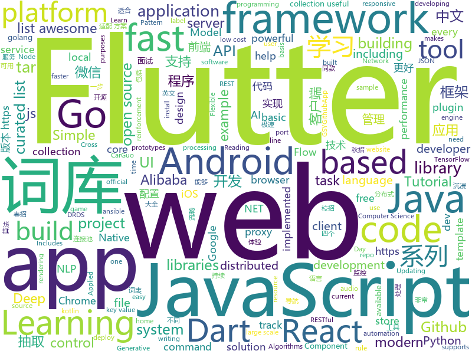

# 2018-11-10
See what the GitHub community is most excited about today.

## python
* [spinningup](https://github.com/openai/spinningup)(**462 stars today**): An educational resource to help anyone learn deep reinforcement learning.
* [bert](https://github.com/google-research/bert)(**173 stars today**): TensorFlow code and pre-trained models for BERT
* [waveglow](https://github.com/NVIDIA/waveglow)(**158 stars today**): A Flow-based Generative Network for Speech Synthesis
* [DeepCreamPy](https://github.com/deeppomf/DeepCreamPy)(**136 stars today**): Decensoring Hentai with Deep Neural Networks
* [awesome-algorithm](https://github.com/apachecn/awesome-algorithm)(**132 stars today**): Leetcode 题解 (跟随思路一步一步撸出代码) 及经典算法实现
* [funNLP](https://github.com/fighting41love/funNLP)(**132 stars today**): 中英文敏感词、语言检测、中外手机/电话归属地/运营商查询、名字推断性别、手机号抽取、身份证抽取、邮箱抽取、中日文人名库、中文缩写库、拆字词典、词汇情感值、停用词、反动词表、暴恐词表、繁简体转换、英文模拟中文发音、汪峰歌词生成器、职业名称词库、同义词库、反义词库、否定词库、汽车品牌&零件词库、时间抽取、连续英文切割、中文词向量大全、公司名字大全、古诗词库、IT词库、财经词库、成语词库、地名词库、历史名人词库、诗词词库、医学词库、饮食词库、法律词库、汽车词库、动物词库、中文聊天语料。
* [models](https://github.com/tensorflow/models)(**73 stars today**): Models and examples built with TensorFlow
* [Python](https://github.com/TheAlgorithms/Python)(**72 stars today**): All Algorithms implemented in Python
* [Python](https://github.com/geekcomputers/Python)(**59 stars today**): My Python Examples
* [PocketFlow](https://github.com/Tencent/PocketFlow)(**52 stars today**): An Automatic Model Compression (AutoMC) framework for developing smaller and faster AI applications.
* [system-design-primer](https://github.com/donnemartin/system-design-primer)(**52 stars today**): Learn how to design large-scale systems. Prep for the system design interview. Includes Anki flashcards.
* [Algorithm_Interview_Notes-Chinese](https://github.com/imhuay/Algorithm_Interview_Notes-Chinese)(**49 stars today**): 2018/2019/校招/春招/秋招/算法/机器学习(Machine Learning)/深度学习(Deep Learning)/自然语言处理(NLP)/C/C++/Python/面试笔记
* [FloWaveNet](https://github.com/ksw0306/FloWaveNet)(**50 stars today**): A Pytorch implementation of "FloWaveNet: A Generative Flow for Raw Audio"
* [pytorch-tutorial](https://github.com/yunjey/pytorch-tutorial)(**47 stars today**): PyTorch Tutorial for Deep Learning Researchers
* [keras](https://github.com/keras-team/keras)(**41 stars today**): Deep Learning for humans
* [saleor](https://github.com/mirumee/saleor)(**46 stars today**): A modular, high performance e-commerce storefront built with Python, GraphQL, Django, and ReactJS.
* [home-assistant](https://github.com/home-assistant/home-assistant)(**41 stars today**): 🏡Open source home automation that puts local control and privacy first
* [pipenv](https://github.com/pypa/pipenv)(**44 stars today**): Python Development Workflow for Humans.
* [Horizon](https://github.com/facebookresearch/Horizon)(**43 stars today**): A platform for Applied Reinforcement Learning (Applied RL)
* [awesome-python](https://github.com/vinta/awesome-python)(**41 stars today**): A curated list of awesome Python frameworks, libraries, software and resources
* [zulip](https://github.com/zulip/zulip)(**37 stars today**): Zulip server - powerful open source team chat
* [ansible](https://github.com/ansible/ansible)(**28 stars today**): Ansible is a radically simple IT automation platform that makes your applications and systems easier to deploy. Avoid writing scripts or custom code to deploy and update your applications — automate in a language that approaches plain English, using SSH, with no agents to install on remote systems. https://docs.ansible.com/ansible/
* [progressive_growing_of_gans](https://github.com/tkarras/progressive_growing_of_gans)(**35 stars today**): Progressive Growing of GANs for Improved Quality, Stability, and Variation
* [Mask_RCNN](https://github.com/matterport/Mask_RCNN)(**28 stars today**): Mask R-CNN for object detection and instance segmentation on Keras and TensorFlow
* [TensorFlow-Course](https://github.com/open-source-for-science/TensorFlow-Course)(**33 stars today**): Simple and ready-to-use tutorials for TensorFlow

## java
* [JavaGuide](https://github.com/Snailclimb/JavaGuide)(**133 stars today**): 【Java学习+面试指南】 一份涵盖大部分Java程序员所需要掌握的核心知识。
* [JCSprout](https://github.com/crossoverJie/JCSprout)(**58 stars today**): 👨‍🎓Java Core Sprout : basic, concurrent, algorithm
* [proxyee-down](https://github.com/proxyee-down-org/proxyee-down)(**59 stars today**): http下载工具，基于http代理，支持多连接分块下载
* [symphony](https://github.com/b3log/symphony)(**59 stars today**): 🎶一款用 Java 实现的现代化社区（论坛/BBS/社交网络/博客）平台。https://hacpai.com
* [java-design-patterns](https://github.com/iluwatar/java-design-patterns)(**48 stars today**): Design patterns implemented in Java
* [spring-boot](https://github.com/spring-projects/spring-boot)(**43 stars today**): Spring Boot
* [tutorials](https://github.com/eugenp/tutorials)(**30 stars today**): The "REST With Spring" Course:
* [APIJSON](https://github.com/TommyLemon/APIJSON)(**43 stars today**): 🚀后端接口和文档自动化，前端(客户端) 定制返回JSON的数据和结构！
* [arthas](https://github.com/alibaba/arthas)(**34 stars today**): Alibaba Java Diagnostic Tool Arthas/Alibaba Java诊断利器Arthas
* [apollo](https://github.com/ctripcorp/apollo)(**34 stars today**): Apollo（阿波罗）是携程框架部门研发的分布式配置中心，能够集中化管理应用不同环境、不同集群的配置，配置修改后能够实时推送到应用端，并且具备规范的权限、流程治理等特性，适用于微服务配置管理场景。
* [easyexcel](https://github.com/alibaba/easyexcel)(**34 stars today**): 快速、简单避免OOM的java处理Excel工具
* [elasticsearch](https://github.com/elastic/elasticsearch)(**29 stars today**): Open Source, Distributed, RESTful Search Engine
* [guava](https://github.com/google/guava)(**31 stars today**): Google core libraries for Java
* [AndroidUtilCode](https://github.com/Blankj/AndroidUtilCode)(**27 stars today**): 🔥Android developers should collect the following utils(updating).
* [Java](https://github.com/TheAlgorithms/Java)(**29 stars today**): All Algorithms implemented in Java
* [sdb-mall](https://github.com/yjjdick/sdb-mall)(**31 stars today**): 极速开发微商城,分销商城的微服务分布式框架，前后端分离
* [ImmersionBar](https://github.com/gyf-dev/ImmersionBar)(**29 stars today**): android 4.4以上沉浸式状态栏和沉浸式导航栏管理，包括状态栏字体颜色，一句代码轻松实现，以及对bar的其他设置，详见README，http://www.jianshu.com/p/2a884e211a62
* [Sentinel](https://github.com/alibaba/Sentinel)(**26 stars today**): A lightweight flow-control library providing high-available protection and monitoring (高可用防护的流量管理框架)
* [druid](https://github.com/alibaba/druid)(**27 stars today**): ♨️为监控而生的数据库连接池！阿里云DRDS(https://www.aliyun.com/product/drds )、阿里巴巴TDDL 连接池powered by Druid
* [spring-cloud-alibaba](https://github.com/spring-cloud-incubator/spring-cloud-alibaba)(**23 stars today**): Spring Cloud Alibaba provides a one-stop solution for application development for the distributed solutions of Alibaba middleware.
* [weixin-java-tools](https://github.com/Wechat-Group/weixin-java-tools)(**20 stars today**): 全能微信Java开发工具包，支持包括微信支付、开放平台、小程序、企业微信/企业号和公众号等的开发
* [AndroidAutoSize](https://github.com/JessYanCoding/AndroidAutoSize)(**23 stars today**): 🔥A low-cost Android screen adaptation solution (今日头条屏幕适配方案终极版，一个极低成本的 Android 屏幕适配方案).
* [angel](https://github.com/Angel-ML/angel)(**20 stars today**): A Flexible and Powerful Parameter Server for large-scale machine learning
* [ToastUtils](https://github.com/getActivity/ToastUtils)(**20 stars today**): This is a very functional Toast
* [TimoMenu](https://github.com/samlss/TimoMenu)(**20 stars today**): A pop-up menu for android that supports multi-row scrollable submenus.

## unknown
* [podlaskigit](https://github.com/maciejkorsan/podlaskigit)(**178 stars today**): Podlaskie aliasy dla gitowych komend
* [KFMARK](https://github.com/Septillion/KFMARK)(**140 stars today**): A free app for benchmarking Android 3D games.
* [virtualbox_e1000_0day](https://github.com/MorteNoir1/virtualbox_e1000_0day)(**128 stars today**): VirtualBox E1000 Guest-to-Host Escape
* [git-flight-rules](https://github.com/k88hudson/git-flight-rules)(**112 stars today**): Flight rules for git
* [A-to-Z-Resources-for-Students](https://github.com/dipakkr/A-to-Z-Resources-for-Students)(**79 stars today**): Curated list of resources for college students Show your❤️by giving a⭐️
* [awful-ai](https://github.com/daviddao/awful-ai)(**77 stars today**): 😈Awful AI is a curated list to track current scary usages of AI - hoping to raise awareness
* [clash_for_windows_pkg](https://github.com/Fndroid/clash_for_windows_pkg)(**74 stars today**): A Windows GUI for Clash
* [You-Dont-Know-JS](https://github.com/getify/You-Dont-Know-JS)(**68 stars today**): A book series on JavaScript. @YDKJS on twitter.
* [gitignore](https://github.com/github/gitignore)(**52 stars today**): A collection of useful .gitignore templates
* [awesome](https://github.com/sindresorhus/awesome)(**65 stars today**): 😎Curated list of awesome lists
* [learning-article](https://github.com/webproblem/learning-article)(**55 stars today**): 学习资源 or 大前端导航，持续更新
* [image-to-image-papers](https://github.com/lzhbrian/image-to-image-papers)(**60 stars today**): A collection of image to image papers
* [CS-Notes](https://github.com/CyC2018/CS-Notes)(**51 stars today**): 📚Computer Science Learning Notes
* [free-programming-books](https://github.com/EbookFoundation/free-programming-books)(**53 stars today**): 📚Freely available programming books
* [youtube-br-desenvolvimento](https://github.com/carolcodes/youtube-br-desenvolvimento)(**53 stars today**): Repositório de canais no Youtube BR sobre desenvolvimento
* [awesome-ruby-security](https://github.com/pxlpnk/awesome-ruby-security)(**50 stars today**): Awesome Ruby Security resources
* [coding-interview-university](https://github.com/jwasham/coding-interview-university)(**39 stars today**): A complete computer science study plan to become a software engineer.
* [first-contributions](https://github.com/firstcontributions/first-contributions)(**24 stars today**): 🚀✨Help beginners to contribute to open source projects
* [2019_campus_apply](https://github.com/frank-lam/2019_campus_apply)(**38 stars today**): 🚀Full Stack Developer Tutorial，后台技术栈/全栈开发/架构师之路，秋招/春招/校招/面试。 from zero to hero.
* [Easy-SDR](https://github.com/IgrikXD/Easy-SDR)(**40 stars today**): Creating affordable, easy-to-manufacture prototypes of PCBs to working and expand the capabilities of existing low-cost SDR receivers based on RTL2832U chip.
* [weekly](https://github.com/ruanyf/weekly)(**38 stars today**): 技术分享周刊，每周五发布
* [highload-2018](https://github.com/NickVolynkin/highload-2018)(**37 stars today**): Конспекты докладов на Highload 2018
* [awesome-vue](https://github.com/vuejs/awesome-vue)(**32 stars today**): 🎉A curated list of awesome things related to Vue.js
* [eeeeeeeeeeeeeeeeeeeeeeeeeeeeeeeeeeeeeeeeeeeeeeeeeeeeeeeeeeeeeeeeeeeeeeeeeeeeeeeeeeeeeeeeeeeeeeeeeeee](https://github.com/eeeeeeeeeeeeeeeeeeeeeeeeeeeeeeee/eeeeeeeeeeeeeeeeeeeeeeeeeeeeeeeeeeeeeeeeeeeeeeeeeeeeeeeeeeeeeeeeeeeeeeeeeeeeeeeeeeeeeeeeeeeeeeeeeeee)(**31 stars today**): eeeeeeeeeeeeeeeeeeeeeeeeeeeeeeeeeeeeeeeeeeeeeeeeeeeeeeeeeeeeeeeeeeeeeeeeeeeeeeeeeeeeeeeeeeeeeeeeeeeeeeeeeeeeeeeeeeeeeeeeeeeeeeeeeeeeeeeeeeeeeeeeeeeeeeeeeeeeeeeeeeeeeeeeeeeeeeeeeeeeeeeeeeeeeeeeeeeeeeeeeeeeeeeeeeeeeeeeeeeeeeeeeeeeeeeeeeeeeeeeeeeeeeeeeeeeeeeeeeeeeeeeeeeeeeeeeeeeeeeeeeeeeeeeeeeeeeeeeeeeeeeeeeeeeeeeeeeeeeeeeeeeeeeeeeeeeeeeeeeeeeeeeee…
* [Blog](https://github.com/mqyqingfeng/Blog)(**30 stars today**): 冴羽写博客的地方，预计写四个系列：JavaScript深入系列、JavaScript专题系列、ES6系列、React系列。

## javascript
* [rawact](https://github.com/sokra/rawact)(**768 stars today**): [POC] A babel plugin which compiles React.js components into native DOM instructions to eliminate the need for the react library at runtime.
* [enquirer](https://github.com/enquirer/enquirer)(**620 stars today**): Stylish, intuitive and user-friendly prompt system.
* [fx](https://github.com/antonmedv/fx)(**377 stars today**): Command-line JSON processing tool🔥
* [33-js-concepts](https://github.com/leonardomso/33-js-concepts)(**312 stars today**): 📜33 concepts every JavaScript developer should know.
* [33-js-concepts](https://github.com/stephentian/33-js-concepts)(**175 stars today**): 📜每个 JavaScript 工程师都应懂的33个概念 @leonardomso
* [taro](https://github.com/NervJS/taro)(**150 stars today**): 多端统一开发框架，支持用 React 的开发方式编写一次代码，生成能运行在微信小程序/百度智能小程序/支付宝小程序、H5、React Native 等的应用。
* [carlo](https://github.com/GoogleChromeLabs/carlo)(**121 stars today**): Web rendering surface for Node applications
* [vue](https://github.com/vuejs/vue)(**102 stars today**): 🖖A progressive, incrementally-adoptable JavaScript framework for building UI on the web.
* [glorious-demo](https://github.com/glorious-codes/glorious-demo)(**103 stars today**): The easiest way to demonstrate your code in action.
* [redbird](https://github.com/OptimalBits/redbird)(**91 stars today**): A modern reverse proxy for node
* [30-seconds-of-code](https://github.com/30-seconds/30-seconds-of-code)(**86 stars today**): Curated collection of useful JavaScript snippets that you can understand in 30 seconds or less.
* [dayjs](https://github.com/iamkun/dayjs)(**88 stars today**): ⏰Day.js 2KB immutable date library alternative to Moment.js with the same modern API
* [zanePerfor](https://github.com/wangweianger/zanePerfor)(**80 stars today**): 前端性能监控系统,消息队列,高可用,集群等相关架构
* [wink](https://github.com/writingink/wink)(**83 stars today**): A Laravel-based publishing platform
* [irondb](https://github.com/gruns/irondb)(**82 stars today**): 🔩A relentless key-value store for the browser.
* [react](https://github.com/facebook/react)(**76 stars today**): A declarative, efficient, and flexible JavaScript library for building user interfaces.
* [Glider.js](https://github.com/NickPiscitelli/Glider.js)(**80 stars today**): A blazingly fast, lightweight, dependency free, minimal carousel with momentum scrolling!
* [openmct](https://github.com/nasa/openmct)(**76 stars today**): A web based mission control framework.
* [free-programming-books-zh_CN](https://github.com/justjavac/free-programming-books-zh_CN)(**69 stars today**): 📚免费的计算机编程类中文书籍，欢迎投稿
* [ice](https://github.com/alibaba/ice)(**72 stars today**): 🚀飞冰 - 让前端开发简单而友好，海量可复用物料，配套桌面工具极速构建前端应用，效率提升 100%
* [thelounge](https://github.com/thelounge/thelounge)(**71 stars today**): 💬Modern, responsive, cross-platform, self-hosted web IRC client
* [omi](https://github.com/Tencent/omi)(**63 stars today**): Next generation web framework in 4kb JavaScript (Web Components + JSX + Proxy + Store + Path Updating)
* [pennywise](https://github.com/kamranahmedse/pennywise)(**61 stars today**): Cross-platform application to open any website or media in a floating window
* [axios](https://github.com/axios/axios)(**58 stars today**): Promise based HTTP client for the browser and node.js
* [create-react-app](https://github.com/facebook/create-react-app)(**45 stars today**): Set up a modern web app by running one command.

## html
* [proposal-bigint](https://github.com/tc39/proposal-bigint)(**37 stars today**): Arbitrary precision integers in JavaScript
* [styleguide](https://github.com/google/styleguide)(**31 stars today**): Style guides for Google-originated open-source projects
* [illustrated-tls13](https://github.com/syncsynchalt/illustrated-tls13)(**23 stars today**): The Illustrated TLS 1.3 Connection: Every byte explained
* [NLP-progress](https://github.com/sebastianruder/NLP-progress)(**20 stars today**): Repository to track the progress in Natural Language Processing (NLP), including the datasets and the current state-of-the-art for the most common NLP tasks.
* [JavaScript30](https://github.com/wesbos/JavaScript30)(**11 stars today**): 30 Day Vanilla JS Challenge
* [sgfin.github.io](https://github.com/sgfin/sgfin.github.io)(**16 stars today**): Academic blog with markdown stolen from Sam Greydanus who stole it from Andrej Karpathy...
* [portainer](https://github.com/portainer/portainer)(**16 stars today**): Simple management UI for Docker
* [Spoon-Knife](https://github.com/octocat/Spoon-Knife)(****): This repo is for demonstration purposes only.
* [swagger-codegen](https://github.com/swagger-api/swagger-codegen)(**13 stars today**): swagger-codegen contains a template-driven engine to generate documentation, API clients and server stubs in different languages by parsing your OpenAPI / Swagger definition.
* [fastText](https://github.com/facebookresearch/fastText)(**13 stars today**): Library for fast text representation and classification.
* [30-seconds-of-css](https://github.com/30-seconds/30-seconds-of-css)(**13 stars today**): A curated collection of useful CSS snippets you can understand in 30 seconds or less.
* [react-redux](https://github.com/reduxjs/react-redux)(**12 stars today**): Official React bindings for Redux
* [coreui-free-bootstrap-admin-template](https://github.com/coreui/coreui-free-bootstrap-admin-template)(**11 stars today**): CoreUI is free bootstrap admin template
* [SuperTextView](https://github.com/chenBingX/SuperTextView)(**11 stars today**): Welcome to use SuperTextView
* [EIPs](https://github.com/ethereum/EIPs)(**9 stars today**): The Ethereum Improvement Proposal repository
* [fonts](https://github.com/google/fonts)(**9 stars today**): Font files available from Google Fonts
* [mxgraph](https://github.com/jgraph/mxgraph)(**9 stars today**): mxGraph is a fully client side JavaScript diagramming library
* [polymer](https://github.com/Polymer/polymer)(**8 stars today**): Our original Web Component library.
* [ecma262](https://github.com/tc39/ecma262)(**8 stars today**): Status, process, and documents for ECMA262
* [foundation-sites](https://github.com/zurb/foundation-sites)(**6 stars today**): The most advanced responsive front-end framework in the world. Quickly create prototypes and production code for sites that work on any kind of device.
* [webperl](https://github.com/haukex/webperl)(**7 stars today**): Run Perl 5 in the browser with WebPerl!
* [dotnet](https://github.com/Microsoft/dotnet)(**6 stars today**): This repo is the official home of .NET on GitHub. It's a great starting point to find many .NET OSS projects from Microsoft and the community, including many that are part of the .NET Foundation.
* [tiny-slider](https://github.com/ganlanyuan/tiny-slider)(**6 stars today**): Vanilla javascript slider for all purposes.
* [electron-api-demos](https://github.com/electron/electron-api-demos)(**5 stars today**): Explore the Electron APIs
* [hyperHTML](https://github.com/WebReflection/hyperHTML)(**6 stars today**): A Fast & Light Virtual DOM Alternative

## dart
* [flutter](https://github.com/flutter/flutter)(**74 stars today**): Flutter makes it easy and fast to build beautiful mobile apps.
* [awesome-flutter](https://github.com/Solido/awesome-flutter)(**67 stars today**): An awesome list that curates the best Flutter libraries, tools, tutorials, articles and more.
* [GSYGithubAppFlutter](https://github.com/CarGuo/GSYGithubAppFlutter)(**16 stars today**): 超完整的Flutter项目，功能丰富，适合学习和日常使用。GSYGithubApp系列的优势：我们目前已经拥有Flutter、Weex、ReactNative、kotlin 四个版本。 功能齐全，项目框架内技术涉及面广，完成度高，持续维护，配套文章，适合全面学习，对比参考。跨平台的开源Github客户端App，更好的体验，更丰富的功能，旨在更好的日常管理和维护个人Github，提供更好更方便的驾车体验Σ(￣。￣ﾉ)ﾉ。同款Weex版本 ： https://github.com/CarGuo/GSYGithubAppWeex 、同款React Native版本 ： https://github.com/CarGuo/GSYGithubApp 、原生 kotlin 版本 https://g…
* [Flutter-Notebook](https://github.com/OpenFlutter/Flutter-Notebook)(**9 stars today**): 日更的FlutterDemo合集，今天你fu了吗
* [inKino](https://github.com/roughike/inKino)(**8 stars today**): A multiplatform Dart movie app with 40% of code sharing between Flutter and the Web.
* [plugins](https://github.com/flutter/plugins)(**7 stars today**): Plugins for Flutter, including FlutterFire, maintained by the Flutter team
* [dio](https://github.com/flutterchina/dio)(**7 stars today**): A powerful Http client for Dart, which supports Interceptors, FormData, Request Cancellation, File Downloading, Timeout etc.
* [sdk](https://github.com/dart-lang/sdk)(**5 stars today**): The Dart SDK, including the VM, dart2js, core libraries, and more.
* [samples](https://github.com/flutter/samples)(**5 stars today**): A collection of Flutter examples and demos.
* [flutter_architecture_samples](https://github.com/brianegan/flutter_architecture_samples)(**5 stars today**): TodoMVC for Flutter
* [trex-flame](https://github.com/renancaraujo/trex-flame)(**5 stars today**): Flutter port of the famous Chrome`s Trex game
* [flutter_crush](https://github.com/boeledi/flutter_crush)(**5 stars today**): How to build a Match-3 game, like Candy Crush, Bejeweled, FishDom… in Flutter.
* [audioplayer](https://github.com/luanpotter/audioplayer)(****): A Flutter plugin to play multiple audio files simultaneously (Android/iOS)
* [WhatTodo](https://github.com/burhanrashid52/WhatTodo)(****): A Simple Todo app design in Flutter to keep track of your task on daily basis. Its build on BLoC Pattern. You can add a project, labels, and due-date to your task also you can sort your task on the basis of project, label, and dates
* [chartjs.dart](https://github.com/google/chartjs.dart)(****): Dart API for Chart.js
* [chromedeveditor](https://github.com/googlearchive/chromedeveditor)(****): Chrome Dev Editor is a developer tool for building apps on the Chrome platform - Chrome Apps and Web Apps, in JavaScript or Dart. (NO LONGER IN ACTIVE DEVELOPMENT)
* [FlutterExampleApps](https://github.com/iampawan/FlutterExampleApps)(****): [Example APPS] Basic Flutter apps, for flutter devs.
* [Flutter-UI-Kit](https://github.com/iampawan/Flutter-UI-Kit)(****): Flutter app for collection of UI in a UIKit
* [flutter-osc](https://github.com/yubo725/flutter-osc)(****): 基于Google Flutter的开源中国客户端，支持Android和iOS。
* [flutter-examples](https://github.com/nisrulz/flutter-examples)(****): [Examples] Simple basic isolated apps, for budding flutter devs.
* [Flutter-learning](https://github.com/AweiLoveAndroid/Flutter-learning)(****): 🔥👍🌟⭐️⭐️⭐️Flutter install&settings,Flutter problems when developing,Flutter sample codes& templates,Flutter projects,Dart languages sample codes
* [hauberk](https://github.com/munificent/hauberk)(****): A web-based roguelike written in Dart.
* [zhihu-flutter](https://github.com/HackSoul/zhihu-flutter)(****): Flutter 高仿知乎 UI，非常漂亮，也非常流畅，flutter build apk 或 flutter build ios 之后更流畅
* [angular](https://github.com/dart-lang/angular)(****): Fast and productive web framework provided by Dart
* [StageXL](https://github.com/bp74/StageXL)(****): A fast and universal 2D rendering engine for HTML5 and Dart.

## go
* [archiver](https://github.com/mholt/archiver)(**249 stars today**): Easily create and extract .zip, .tar, .tar.gz, .tar.bz2, .tar.xz, .tar.lz4, .tar.sz, and .rar (extract-only) files with Go
* [Tigo](https://github.com/karldoenitz/Tigo)(**180 stars today**): A go restful framework
* [gocity](https://github.com/rodrigo-brito/gocity)(**143 stars today**): 📊Code City metaphor for visualizing Go source code in 3D
* [pipelines](https://github.com/kubeflow/pipelines)(**142 stars today**): Machine Learning Pipelines for Kubeflow
* [clash](https://github.com/Dreamacro/clash)(**97 stars today**): A rule based tunnel in Go.
* [server](https://github.com/gotify/server)(**87 stars today**): A REST-API for sending and receiving messages in real-time per web socket. (Includes a sleek web-ui)
* [dive](https://github.com/wagoodman/dive)(**69 stars today**): A tool for exploring each layer in a docker image
* [go](https://github.com/golang/go)(**59 stars today**): The Go programming language
* [kubernetes](https://github.com/kubernetes/kubernetes)(**53 stars today**): Production-Grade Container Scheduling and Management
* [kubefwd](https://github.com/txn2/kubefwd)(**39 stars today**): Bulk port forwarding Kubernetes services for local development.
* [soar](https://github.com/XiaoMi/soar)(**36 stars today**): SQL Optimizer And Rewriter
* [night-reading-go](https://github.com/developer-learning/night-reading-go)(**36 stars today**): Go 夜读 > Night Reading Go - Go source reading and offline technical discussion every Thursday night.
* [hugo](https://github.com/gohugoio/hugo)(**33 stars today**): The world’s fastest framework for building websites.
* [BaiduPCS-Go](https://github.com/iikira/BaiduPCS-Go)(**33 stars today**): 百度网盘客户端 - Go语言编写
* [dgraph](https://github.com/dgraph-io/dgraph)(**35 stars today**): Fast, Distributed Graph DB
* [v2ray-core](https://github.com/v2ray/v2ray-core)(**29 stars today**): A platform for building proxies to bypass network restrictions.
* [frp](https://github.com/fatedier/frp)(**30 stars today**): A fast reverse proxy to help you expose a local server behind a NAT or firewall to the internet.
* [istio](https://github.com/istio/istio)(**30 stars today**): Connect, secure, control, and observe services.
* [awesome-go](https://github.com/avelino/awesome-go)(**27 stars today**): A curated list of awesome Go frameworks, libraries and software
* [up](https://github.com/akavel/up)(**30 stars today**): Ultimate Plumber is a tool for writing Linux pipes with instant live preview
* [etcd](https://github.com/etcd-io/etcd)(**27 stars today**): Distributed reliable key-value store for the most critical data of a distributed system
* [gin](https://github.com/gin-gonic/gin)(**29 stars today**): Gin is a HTTP web framework written in Go (Golang). It features a Martini-like API with much better performance -- up to 40 times faster. If you need smashing performance, get yourself some Gin.
* [build-web-application-with-golang](https://github.com/astaxie/build-web-application-with-golang)(**24 stars today**): A golang ebook intro how to build a web with golang
* [fzf](https://github.com/junegunn/fzf)(**26 stars today**): 🌸A command-line fuzzy finder
* [gogs](https://github.com/gogs/gogs)(**23 stars today**): Gogs is a painless self-hosted Git service.

## WordCloud

