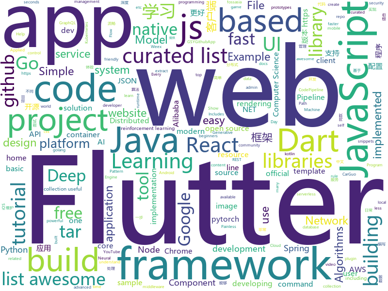

# 2018-11-11
See what the GitHub community is most excited about today.

## python
* [spinningup](https://github.com/openai/spinningup)(**236 stars today**): An educational resource to help anyone learn deep reinforcement learning.
* [pampy](https://github.com/santinic/pampy)(**208 stars today**): Pampy: The Pattern Matching for Python you always dreamed of.
* [bert](https://github.com/google-research/bert)(**96 stars today**): TensorFlow code and pre-trained models for BERT
* [waveglow](https://github.com/NVIDIA/waveglow)(**66 stars today**): A Flow-based Generative Network for Speech Synthesis
* [DeepCreamPy](https://github.com/deeppomf/DeepCreamPy)(**66 stars today**): Decensoring Hentai with Deep Neural Networks
* [Python](https://github.com/TheAlgorithms/Python)(**50 stars today**): All Algorithms implemented in Python
* [system-design-primer](https://github.com/donnemartin/system-design-primer)(**44 stars today**): Learn how to design large-scale systems. Prep for the system design interview. Includes Anki flashcards.
* [models](https://github.com/tensorflow/models)(**27 stars today**): Models and examples built with TensorFlow
* [TensorFlow-Course](https://github.com/open-source-for-science/TensorFlow-Course)(**34 stars today**): Simple and ready-to-use tutorials for TensorFlow
* [awesome-algorithm](https://github.com/apachecn/awesome-algorithm)(**34 stars today**): Leetcode 题解 (跟随思路一步一步撸出代码) 及经典算法实现
* [XSStrike](https://github.com/s0md3v/XSStrike)(**32 stars today**): Most advanced XSS detection suite.
* [awesome-python](https://github.com/vinta/awesome-python)(**30 stars today**): A curated list of awesome Python frameworks, libraries, software and resources
* [keras](https://github.com/keras-team/keras)(**27 stars today**): Deep Learning for humans
* [FloWaveNet](https://github.com/ksw0306/FloWaveNet)(**28 stars today**): A Pytorch implementation of "FloWaveNet: A Generative Flow for Raw Audio"
* [Python](https://github.com/geekcomputers/Python)(**26 stars today**): My Python Examples
* [home-assistant](https://github.com/home-assistant/home-assistant)(**25 stars today**): 🏡Open source home automation that puts local control and privacy first
* [public-apis](https://github.com/toddmotto/public-apis)(**26 stars today**): A collective list of public JSON APIs for use in web development.
* [pytorch-tutorial](https://github.com/yunjey/pytorch-tutorial)(**22 stars today**): PyTorch Tutorial for Deep Learning Researchers
* [youtube-dl](https://github.com/rg3/youtube-dl)(**26 stars today**): Command-line program to download videos from YouTube.com and other video sites
* [gym](https://github.com/openai/gym)(**23 stars today**): A toolkit for developing and comparing reinforcement learning algorithms.
* [django](https://github.com/django/django)(**16 stars today**): The Web framework for perfectionists with deadlines.
* [Algorithm_Interview_Notes-Chinese](https://github.com/imhuay/Algorithm_Interview_Notes-Chinese)(**22 stars today**): 2018/2019/校招/春招/秋招/算法/机器学习(Machine Learning)/深度学习(Deep Learning)/自然语言处理(NLP)/C/C++/Python/面试笔记
* [PocketFlow](https://github.com/Tencent/PocketFlow)(**23 stars today**): An Automatic Model Compression (AutoMC) framework for developing smaller and faster AI applications.
* [scikit-learn](https://github.com/scikit-learn/scikit-learn)(**18 stars today**): scikit-learn: machine learning in Python
* [Horizon](https://github.com/facebookresearch/Horizon)(**20 stars today**): A platform for Applied Reinforcement Learning (Applied RL)

## java
* [JavaGuide](https://github.com/Snailclimb/JavaGuide)(**50 stars today**): 【Java学习+面试指南】 一份涵盖大部分Java程序员所需要掌握的核心知识。
* [proxyee-down](https://github.com/proxyee-down-org/proxyee-down)(**51 stars today**): http下载工具，基于http代理，支持多连接分块下载
* [spring-cloud-alibaba](https://github.com/spring-cloud-incubator/spring-cloud-alibaba)(**32 stars today**): Spring Cloud Alibaba provides a one-stop solution for application development for the distributed solutions of Alibaba middleware.
* [symphony](https://github.com/b3log/symphony)(**31 stars today**): 🎶一款用 Java 实现的现代化社区（论坛/BBS/社交网络/博客）平台。https://hacpai.com
* [tutorials](https://github.com/eugenp/tutorials)(**17 stars today**): The "REST With Spring" Course:
* [spring-boot](https://github.com/spring-projects/spring-boot)(**21 stars today**): Spring Boot
* [apollo](https://github.com/ctripcorp/apollo)(**22 stars today**): Apollo（阿波罗）是携程框架部门研发的分布式配置中心，能够集中化管理应用不同环境、不同集群的配置，配置修改后能够实时推送到应用端，并且具备规范的权限、流程治理等特性，适用于微服务配置管理场景。
* [JCSprout](https://github.com/crossoverJie/JCSprout)(**21 stars today**): 👨‍🎓Java Core Sprout : basic, concurrent, algorithm
* [java-design-patterns](https://github.com/iluwatar/java-design-patterns)(**17 stars today**): Design patterns implemented in Java
* [sharding-sphere](https://github.com/sharding-sphere/sharding-sphere)(**19 stars today**): Distributed database middleware
* [guava](https://github.com/google/guava)(**16 stars today**): Google core libraries for Java
* [SpringCloudLearning](https://github.com/forezp/SpringCloudLearning)(**17 stars today**): 《史上最简单的Spring Cloud教程源码》
* [Java](https://github.com/TheAlgorithms/Java)(**16 stars today**): All Algorithms implemented in Java
* [arthas](https://github.com/alibaba/arthas)(**17 stars today**): Alibaba Java Diagnostic Tool Arthas/Alibaba Java诊断利器Arthas
* [elasticsearch](https://github.com/elastic/elasticsearch)(**14 stars today**): Open Source, Distributed, RESTful Search Engine
* [sdb-mall](https://github.com/yjjdick/sdb-mall)(**15 stars today**): 极速开发微商城,分销商城的微服务分布式框架，前后端分离
* [easyexcel](https://github.com/alibaba/easyexcel)(**13 stars today**): 快速、简单避免OOM的java处理Excel工具
* [zxing](https://github.com/zxing/zxing)(**13 stars today**): ZXing ("Zebra Crossing") barcode scanning library for Java, Android
* [spring-framework](https://github.com/spring-projects/spring-framework)(**10 stars today**): Spring Framework
* [APIJSON](https://github.com/TommyLemon/APIJSON)(**13 stars today**): 🚀后端接口和文档自动化，前端(客户端) 定制返回JSON的数据和结构！
* [study](https://github.com/keesun/study)(**12 stars today**): 
* [mybatis-3](https://github.com/mybatis/mybatis-3)(**8 stars today**): MyBatis SQL mapper framework for Java
* [material-components-android](https://github.com/material-components/material-components-android)(**12 stars today**): Modular and customizable Material Design UI components for Android
* [netty](https://github.com/netty/netty)(**10 stars today**): Netty project - an event-driven asynchronous network application framework
* [graal](https://github.com/oracle/graal)(**10 stars today**): GraalVM: Run Programs Faster Anywhere🚀

## unknown
* [KFMARK](https://github.com/Septillion/KFMARK)(**80 stars today**): A free app for benchmarking Android 3D games.
* [A-to-Z-Resources-for-Students](https://github.com/dipakkr/A-to-Z-Resources-for-Students)(**58 stars today**): Curated list of resources for college students Show your❤️by giving a⭐️
* [CS-Notes](https://github.com/CyC2018/CS-Notes)(**37 stars today**): 📚Computer Science Learning Notes
* [gitignore](https://github.com/github/gitignore)(**30 stars today**): A collection of useful .gitignore templates
* [git-flight-rules](https://github.com/k88hudson/git-flight-rules)(**42 stars today**): Flight rules for git
* [Data-Competition-TopSolution](https://github.com/Smilexuhc/Data-Competition-TopSolution)(**40 stars today**): Data competition Top Solution 数据竞赛top解决方案开源整理
* [awesome](https://github.com/sindresorhus/awesome)(**40 stars today**): 😎Curated list of awesome lists
* [youtube-br-desenvolvimento](https://github.com/carolcodes/youtube-br-desenvolvimento)(**36 stars today**): Repositório de canais no Youtube BR sobre desenvolvimento
* [virtualbox_e1000_0day](https://github.com/MorteNoir1/virtualbox_e1000_0day)(**34 stars today**): VirtualBox E1000 Guest-to-Host Escape
* [podlaskigit](https://github.com/maciejkorsan/podlaskigit)(**37 stars today**): Podlaskie aliasy dla gitowych komend
* [free-programming-books](https://github.com/EbookFoundation/free-programming-books)(**29 stars today**): 📚Freely available programming books
* [project-based-learning](https://github.com/tuvtran/project-based-learning)(**25 stars today**): Curated list of project-based tutorials
* [awful-ai](https://github.com/daviddao/awful-ai)(**28 stars today**): 😈Awful AI is a curated list to track current scary usages of AI - hoping to raise awareness
* [clash_for_windows_pkg](https://github.com/Fndroid/clash_for_windows_pkg)(**25 stars today**): A Windows GUI for Clash
* [blockchain-security-contacts](https://github.com/trailofbits/blockchain-security-contacts)(**16 stars today**): Directory of security contacts for blockchain companies
* [awesome-mechanical-keyboard](https://github.com/BenRoe/awesome-mechanical-keyboard)(**22 stars today**): ⌨️A curated list of awesome Mechanical Keyboard resources.
* [awesome-vue](https://github.com/vuejs/awesome-vue)(**21 stars today**): 🎉A curated list of awesome things related to Vue.js
* [first-contributions](https://github.com/firstcontributions/first-contributions)(**6 stars today**): 🚀✨Help beginners to contribute to open source projects
* [Easy-SDR](https://github.com/IgrikXD/Easy-SDR)(**20 stars today**): Creating affordable, easy-to-manufacture prototypes of PCBs to working and expand the capabilities of existing low-cost SDR receivers based on RTL2832U chip.
* [computer-science](https://github.com/ossu/computer-science)(**17 stars today**): 🎓Path to a free self-taught education in Computer Science!
* [awesome-ruby-security](https://github.com/pxlpnk/awesome-ruby-security)(**18 stars today**): Awesome Ruby Security resources
* [papers-we-love](https://github.com/papers-we-love/papers-we-love)(**17 stars today**): Papers from the computer science community to read and discuss.
* [image-to-image-papers](https://github.com/lzhbrian/image-to-image-papers)(**17 stars today**): A collection of image to image papers
* [awesome-for-beginners](https://github.com/MunGell/awesome-for-beginners)(**13 stars today**): A list of awesome beginners-friendly projects.
* [Awesome-pytorch-list](https://github.com/bharathgs/Awesome-pytorch-list)(**13 stars today**): A comprehensive list of pytorch related content on github,such as different models,implementations,helper libraries,tutorials etc.

## javascript
* [rawact](https://github.com/sokra/rawact)(**291 stars today**): [POC] A babel plugin which compiles React.js components into native DOM instructions to eliminate the need for the react library at runtime.
* [enquirer](https://github.com/enquirer/enquirer)(**256 stars today**): Stylish, intuitive and user-friendly prompt system.
* [fx](https://github.com/antonmedv/fx)(**205 stars today**): Command-line JSON processing tool🔥
* [Glider.js](https://github.com/NickPiscitelli/Glider.js)(**146 stars today**): A blazingly fast, lightweight, dependency free, minimal carousel with momentum scrolling!
* [33-js-concepts](https://github.com/leonardomso/33-js-concepts)(**114 stars today**): 📜33 concepts every JavaScript developer should know.
* [dayjs](https://github.com/iamkun/dayjs)(**90 stars today**): ⏰Day.js 2KB immutable date library alternative to Moment.js with the same modern API
* [carlo](https://github.com/GoogleChromeLabs/carlo)(**79 stars today**): Web rendering surface for Node applications
* [react](https://github.com/facebook/react)(**61 stars today**): A declarative, efficient, and flexible JavaScript library for building user interfaces.
* [vue](https://github.com/vuejs/vue)(**56 stars today**): 🖖A progressive, incrementally-adoptable JavaScript framework for building UI on the web.
* [33-js-concepts](https://github.com/stephentian/33-js-concepts)(**55 stars today**): 📜每个 JavaScript 工程师都应懂的33个概念 @leonardomso
* [create-react-app](https://github.com/facebook/create-react-app)(**47 stars today**): Set up a modern web app by running one command.
* [30-seconds-of-code](https://github.com/30-seconds/30-seconds-of-code)(**50 stars today**): Curated collection of useful JavaScript snippets that you can understand in 30 seconds or less.
* [glorious-demo](https://github.com/glorious-codes/glorious-demo)(**54 stars today**): The easiest way to demonstrate your code in action.
* [taro](https://github.com/NervJS/taro)(**49 stars today**): 多端统一开发框架，支持用 React 的开发方式编写一次代码，生成能运行在微信小程序/百度智能小程序/支付宝小程序、H5、React Native 等的应用。
* [jsbi](https://github.com/GoogleChromeLabs/jsbi)(**42 stars today**): JSBI is a pure-JavaScript implementation of the official ECMAScript BigInt proposal.
* [react-native](https://github.com/facebook/react-native)(**37 stars today**): A framework for building native apps with React.
* [free-programming-books-zh_CN](https://github.com/justjavac/free-programming-books-zh_CN)(**36 stars today**): 📚免费的计算机编程类中文书籍，欢迎投稿
* [node](https://github.com/nodejs/node)(**30 stars today**): Node.js JavaScript runtime✨🐢🚀✨
* [omi](https://github.com/Tencent/omi)(**30 stars today**): Next generation web framework in 4kb JavaScript (Web Components + JSX + Proxy + Store + Path Updating)
* [javascript](https://github.com/airbnb/javascript)(**29 stars today**): JavaScript Style Guide
* [wink](https://github.com/writingink/wink)(**25 stars today**): A Laravel-based publishing platform
* [javascript-algorithms](https://github.com/trekhleb/javascript-algorithms)(**25 stars today**): 📝Algorithms and data structures implemented in JavaScript with explanations and links to further readings
* [d3](https://github.com/d3/d3)(**23 stars today**): Bring data to life with SVG, Canvas and HTML.📊📈🎉
* [serverless](https://github.com/serverless/serverless)(**23 stars today**): Serverless Framework – Build web, mobile and IoT applications with serverless architectures using AWS Lambda, Azure Functions, Google CloudFunctions & more! –
* [strapi](https://github.com/strapi/strapi)(**20 stars today**): 🚀Node.js Content Management Framework (headless-CMS) to build powerful API with no effort.

## html
* [JavaScript30](https://github.com/wesbos/JavaScript30)(**11 stars today**): 30 Day Vanilla JS Challenge
* [Spoon-Knife](https://github.com/octocat/Spoon-Knife)(****): This repo is for demonstration purposes only.
* [react-redux](https://github.com/reduxjs/react-redux)(**13 stars today**): Official React bindings for Redux
* [styleguide](https://github.com/google/styleguide)(**10 stars today**): Style guides for Google-originated open-source projects
* [illustrated-tls13](https://github.com/syncsynchalt/illustrated-tls13)(**11 stars today**): The Illustrated TLS 1.3 Connection: Every byte explained
* [portainer](https://github.com/portainer/portainer)(**10 stars today**): Simple management UI for Docker
* [30-seconds-of-css](https://github.com/30-seconds/30-seconds-of-css)(**9 stars today**): A curated collection of useful CSS snippets you can understand in 30 seconds or less.
* [gci18.fossasia.org](https://github.com/fossasia/gci18.fossasia.org)(**6 stars today**): FOSSASIA Google Code-In Website 2018 https://gci18.fossasia.org
* [electron-api-demos](https://github.com/electron/electron-api-demos)(**7 stars today**): Explore the Electron APIs
* [coreui-free-bootstrap-admin-template](https://github.com/coreui/coreui-free-bootstrap-admin-template)(**7 stars today**): CoreUI is free bootstrap admin template
* [Adminator-admin-dashboard](https://github.com/puikinsh/Adminator-admin-dashboard)(**6 stars today**): Adminator is a easy to use and well design admin dashboard template for web apps, websites, services and more
* [docs.konghq.com](https://github.com/Kong/docs.konghq.com)(**6 stars today**): 🦍Source code for docs.konghq.com website
* [Drone_Flight_Controller](https://github.com/llSourcell/Drone_Flight_Controller)(**5 stars today**): This is the code for "Drone Flight Controller" By Siraj Raval on Youtube
* [polymer](https://github.com/Polymer/polymer)(**7 stars today**): Our original Web Component library.
* [sgfin.github.io](https://github.com/sgfin/sgfin.github.io)(**7 stars today**): Academic blog with markdown stolen from Sam Greydanus who stole it from Andrej Karpathy...
* [fonts](https://github.com/google/fonts)(**5 stars today**): Font files available from Google Fonts
* [dotnet](https://github.com/Microsoft/dotnet)(**6 stars today**): This repo is the official home of .NET on GitHub. It's a great starting point to find many .NET OSS projects from Microsoft and the community, including many that are part of the .NET Foundation.
* [bulma-templates](https://github.com/dansup/bulma-templates)(**6 stars today**): free flexbox templates built with the bulma css framework
* [chinese-ig](https://github.com/w3c/chinese-ig)(**5 stars today**): Web中文兴趣组
* [nndl.github.io](https://github.com/nndl/nndl.github.io)(**5 stars today**): 《神经网络与深度学习》 Neural Network and Deep Learning
* [foundation-sites](https://github.com/zurb/foundation-sites)(**5 stars today**): The most advanced responsive front-end framework in the world. Quickly create prototypes and production code for sites that work on any kind of device.
* [nodejs-ex](https://github.com/sclorg/nodejs-ex)(****): node.js example
* [www-sugarlabs](https://github.com/sugarlabs/www-sugarlabs)(****): The Sugar Labs website
* [home-assistant.io](https://github.com/home-assistant/home-assistant.io)(****): 📘Home Assistant User documentation
* [aws-codepipeline-s3-codedeploy-linux](https://github.com/aws-samples/aws-codepipeline-s3-codedeploy-linux)(****): Use this sample when creating a simple pipeline in AWS CodePipeline while following the Simple Pipeline Walkthrough tutorial. http://docs.aws.amazon.com/codepipeline/latest/userguide/getting-started-w.html

## dart
* [flutter](https://github.com/flutter/flutter)(**51 stars today**): Flutter makes it easy and fast to build beautiful mobile apps.
* [awesome-flutter](https://github.com/Solido/awesome-flutter)(**29 stars today**): An awesome list that curates the best Flutter libraries, tools, tutorials, articles and more.
* [inKino](https://github.com/roughike/inKino)(**7 stars today**): A multiplatform Dart movie app with 40% of code sharing between Flutter and the Web.
* [flutter_crush](https://github.com/boeledi/flutter_crush)(**6 stars today**): How to build a Match-3 game, like Candy Crush, Bejeweled, FishDom… in Flutter.
* [GSYGithubAppFlutter](https://github.com/CarGuo/GSYGithubAppFlutter)(**5 stars today**): 超完整的Flutter项目，功能丰富，适合学习和日常使用。GSYGithubApp系列的优势：我们目前已经拥有Flutter、Weex、ReactNative、kotlin 四个版本。 功能齐全，项目框架内技术涉及面广，完成度高，持续维护，配套文章，适合全面学习，对比参考。跨平台的开源Github客户端App，更好的体验，更丰富的功能，旨在更好的日常管理和维护个人Github，提供更好更方便的驾车体验Σ(￣。￣ﾉ)ﾉ。同款Weex版本 ： https://github.com/CarGuo/GSYGithubAppWeex 、同款React Native版本 ： https://github.com/CarGuo/GSYGithubApp 、原生 kotlin 版本 https://g…
* [Flutter-Notebook](https://github.com/OpenFlutter/Flutter-Notebook)(**5 stars today**): 日更的FlutterDemo合集，今天你fu了吗
* [charts](https://github.com/google/charts)(****): 
* [website](https://github.com/flutter/website)(****): Flutter web site
* [flutter_svg](https://github.com/dnfield/flutter_svg)(****): SVG parsing, rendering, and widget library for Flutter
* [flutter_cached_network_image](https://github.com/renefloor/flutter_cached_network_image)(****): Download, cache and show images in a flutter app
* [graphql-flutter](https://github.com/zino-app/graphql-flutter)(****): A GraphQL client for Flutter, bringing all the features from a modern GraphQL client to one easy to use package.
* [chromedeveditor](https://github.com/googlearchive/chromedeveditor)(****): Chrome Dev Editor is a developer tool for building apps on the Chrome platform - Chrome Apps and Web Apps, in JavaScript or Dart. (NO LONGER IN ACTIVE DEVELOPMENT)
* [sdk](https://github.com/dart-lang/sdk)(****): The Dart SDK, including the VM, dart2js, core libraries, and more.
* [plugins](https://github.com/flutter/plugins)(****): Plugins for Flutter, including FlutterFire, maintained by the Flutter team
* [FlutterExampleApps](https://github.com/iampawan/FlutterExampleApps)(****): [Example APPS] Basic Flutter apps, for flutter devs.
* [Flutter-UI-Kit](https://github.com/iampawan/Flutter-UI-Kit)(****): Flutter app for collection of UI in a UIKit
* [flutter-osc](https://github.com/yubo725/flutter-osc)(****): 基于Google Flutter的开源中国客户端，支持Android和iOS。
* [flutter_architecture_samples](https://github.com/brianegan/flutter_architecture_samples)(****): TodoMVC for Flutter
* [flutter-examples](https://github.com/nisrulz/flutter-examples)(****): [Examples] Simple basic isolated apps, for budding flutter devs.
* [Flutter-learning](https://github.com/AweiLoveAndroid/Flutter-learning)(****): 🔥👍🌟⭐️⭐️⭐️Flutter install&settings,Flutter problems when developing,Flutter sample codes& templates,Flutter projects,Dart languages sample codes
* [dio](https://github.com/flutterchina/dio)(****): A powerful Http client for Dart, which supports Interceptors, FormData, Request Cancellation, File Downloading, Timeout etc.
* [hauberk](https://github.com/munificent/hauberk)(****): A web-based roguelike written in Dart.
* [zhihu-flutter](https://github.com/HackSoul/zhihu-flutter)(****): Flutter 高仿知乎 UI，非常漂亮，也非常流畅，flutter build apk 或 flutter build ios 之后更流畅
* [angular](https://github.com/dart-lang/angular)(****): Fast and productive web framework provided by Dart
* [StageXL](https://github.com/bp74/StageXL)(****): A fast and universal 2D rendering engine for HTML5 and Dart.

## go
* [archiver](https://github.com/mholt/archiver)(**78 stars today**): Easily create and extract .zip, .tar, .tar.gz, .tar.bz2, .tar.xz, .tar.lz4, .tar.sz, and .rar (extract-only) files with Go
* [go](https://github.com/golang/go)(**48 stars today**): The Go programming language
* [pipelines](https://github.com/kubeflow/pipelines)(**48 stars today**): Machine Learning Pipelines for Kubeflow
* [dive](https://github.com/wagoodman/dive)(**47 stars today**): A tool for exploring each layer in a docker image
* [badger](https://github.com/dgraph-io/badger)(**42 stars today**): Fast key-value DB in Go.
* [writefreely](https://github.com/writeas/writefreely)(**40 stars today**): Painless, simple, federated blogging platform.
* [clash](https://github.com/Dreamacro/clash)(**36 stars today**): A rule based tunnel in Go.
* [dgraph](https://github.com/dgraph-io/dgraph)(**34 stars today**): Fast, Distributed Graph DB
* [argo](https://github.com/argoproj/argo)(**34 stars today**): Container-native workflows for Kubernetes.
* [gocity](https://github.com/rodrigo-brito/gocity)(**33 stars today**): 📊Code City metaphor for visualizing Go source code in 3D
* [kubernetes](https://github.com/kubernetes/kubernetes)(**26 stars today**): Production-Grade Container Scheduling and Management
* [gogs](https://github.com/gogs/gogs)(**30 stars today**): Gogs is a painless self-hosted Git service.
* [istio](https://github.com/istio/istio)(**29 stars today**): Connect, secure, control, and observe services.
* [BaiduPCS-Go](https://github.com/iikira/BaiduPCS-Go)(**26 stars today**): 百度网盘客户端 - Go语言编写
* [v2ray-core](https://github.com/v2ray/v2ray-core)(**25 stars today**): A platform for building proxies to bypass network restrictions.
* [awesome-go](https://github.com/avelino/awesome-go)(**24 stars today**): A curated list of awesome Go frameworks, libraries and software
* [soar](https://github.com/XiaoMi/soar)(**25 stars today**): SQL Optimizer And Rewriter
* [server](https://github.com/gotify/server)(**25 stars today**): A REST-API for sending and receiving messages in real-time per web socket. (Includes a sleek web-ui)
* [build-web-application-with-golang](https://github.com/astaxie/build-web-application-with-golang)(**17 stars today**): A golang ebook intro how to build a web with golang
* [filebrowser](https://github.com/filebrowser/filebrowser)(**19 stars today**): 📁Web File Browser which can be used as a middleware or standalone app.
* [prometheus](https://github.com/prometheus/prometheus)(**17 stars today**): The Prometheus monitoring system and time series database.
* [moby](https://github.com/moby/moby)(**17 stars today**): Moby Project - a collaborative project for the container ecosystem to assemble container-based systems
* [hugo](https://github.com/gohugoio/hugo)(**16 stars today**): The world’s fastest framework for building websites.
* [fzf](https://github.com/junegunn/fzf)(**16 stars today**): 🌸A command-line fuzzy finder
* [kubefwd](https://github.com/txn2/kubefwd)(**15 stars today**): Bulk port forwarding Kubernetes services for local development.

## WordCloud

