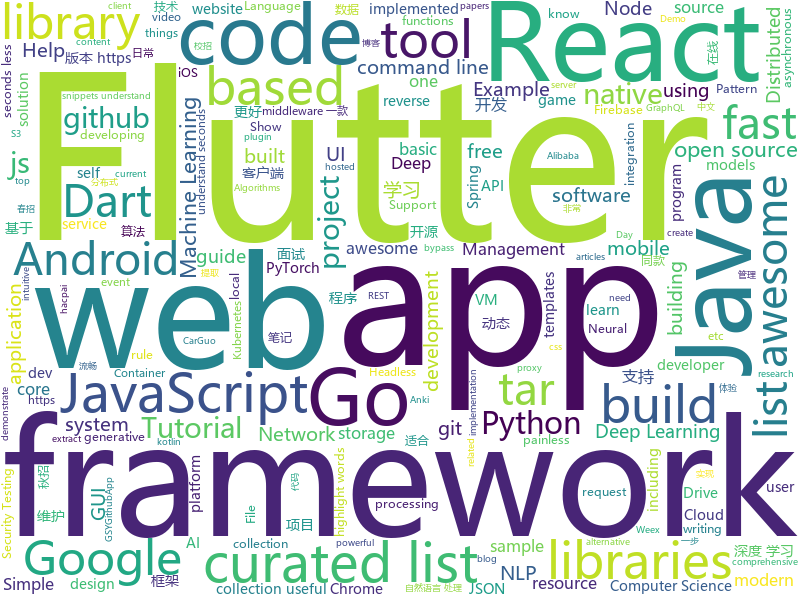

# 2018-11-12
See what the GitHub community is most excited about today.

## python
* [pampy](https://github.com/santinic/pampy)(**214 stars today**): Pampy: The Pattern Matching for Python you always dreamed of.
* [spinningup](https://github.com/openai/spinningup)(**198 stars today**): An educational resource to help anyone learn deep reinforcement learning.
* [XSStrike](https://github.com/s0md3v/XSStrike)(**114 stars today**): Most advanced XSS detection suite.
* [bert](https://github.com/google-research/bert)(**99 stars today**): TensorFlow code and pre-trained models for BERT
* [Python](https://github.com/TheAlgorithms/Python)(**50 stars today**): All Algorithms implemented in Python
* [models](https://github.com/tensorflow/models)(**39 stars today**): Models and examples built with TensorFlow
* [DeepCreamPy](https://github.com/deeppomf/DeepCreamPy)(**50 stars today**): Decensoring Hentai with Deep Neural Networks
* [sotawhat](https://github.com/chiphuyen/sotawhat)(**51 stars today**): Returns latest research results by crawling arxiv papers and summarizing abstracts. Helps you stay afloat with so many new papers everyday.
* [system-design-primer](https://github.com/donnemartin/system-design-primer)(**39 stars today**): Learn how to design large-scale systems. Prep for the system design interview. Includes Anki flashcards.
* [youtube-dl](https://github.com/rg3/youtube-dl)(**38 stars today**): Command-line program to download videos from YouTube.com and other video sites
* [PySimpleGUI](https://github.com/MikeTheWatchGuy/PySimpleGUI)(**38 stars today**): Launched in 2018 Actively developed and supported. Super-simple to create custom layout GUI's. Python 2.7 & 3 Support. 100 Demo programs & Cookbook for rapid start. Extensive documentation. Examples using Machine Learning(GUI, OpenCV Integration, Chatterbot), Floating Desktop Widgets, Matplotlib + Pyplot integration, add GUI to command line scri…
* [waveglow](https://github.com/NVIDIA/waveglow)(**37 stars today**): A Flow-based Generative Network for Speech Synthesis
* [writing-code-for-nlp-research-emnlp2018](https://github.com/allenai/writing-code-for-nlp-research-emnlp2018)(**35 stars today**): A companion repository for the "Writing code for NLP Research" Tutorial at EMNLP 2018
* [Algorithm_Interview_Notes-Chinese](https://github.com/imhuay/Algorithm_Interview_Notes-Chinese)(**28 stars today**): 2018/2019/校招/春招/秋招/算法/机器学习(Machine Learning)/深度学习(Deep Learning)/自然语言处理(NLP)/C/C++/Python/面试笔记
* [Python](https://github.com/geekcomputers/Python)(**28 stars today**): My Python Examples
* [awesome-python](https://github.com/vinta/awesome-python)(**25 stars today**): A curated list of awesome Python frameworks, libraries, software and resources
* [pixyz](https://github.com/masa-su/pixyz)(**27 stars today**): a library for developing deep generative models in a more concise, intuitive and extendable way
* [saleor](https://github.com/mirumee/saleor)(**23 stars today**): A modular, high performance e-commerce storefront built with Python, GraphQL, Django, and ReactJS.
* [django](https://github.com/django/django)(**20 stars today**): The Web framework for perfectionists with deadlines.
* [awesome-machine-learning](https://github.com/josephmisiti/awesome-machine-learning)(**22 stars today**): A curated list of awesome Machine Learning frameworks, libraries and software.
* [keras](https://github.com/keras-team/keras)(**18 stars today**): Deep Learning for humans
* [awesome-algorithm](https://github.com/apachecn/awesome-algorithm)(**22 stars today**): Leetcode 题解 (跟随思路一步一步撸出代码) 及经典算法实现
* [pytorch-tutorial](https://github.com/yunjey/pytorch-tutorial)(**20 stars today**): PyTorch Tutorial for Deep Learning Researchers
* [scikit-learn](https://github.com/scikit-learn/scikit-learn)(**18 stars today**): scikit-learn: machine learning in Python
* [public-apis](https://github.com/toddmotto/public-apis)(**21 stars today**): A collective list of public JSON APIs for use in web development.

## java
* [JavaGuide](https://github.com/Snailclimb/JavaGuide)(**45 stars today**): 【Java学习+面试指南】 一份涵盖大部分Java程序员所需要掌握的核心知识。
* [proxyee-down](https://github.com/proxyee-down-org/proxyee-down)(**43 stars today**): http下载工具，基于http代理，支持多连接分块下载
* [java-design-patterns](https://github.com/iluwatar/java-design-patterns)(**36 stars today**): Design patterns implemented in Java
* [interviews](https://github.com/kdn251/interviews)(**31 stars today**): Everything you need to know to get the job.
* [spring-boot](https://github.com/spring-projects/spring-boot)(**25 stars today**): Spring Boot
* [Signal-Android](https://github.com/signalapp/Signal-Android)(**29 stars today**): A private messenger for Android.
* [sharding-sphere](https://github.com/sharding-sphere/sharding-sphere)(**27 stars today**): Distributed database middleware
* [symphony](https://github.com/b3log/symphony)(**25 stars today**): 🎶一款用 Java 实现的现代化社区（论坛/BBS/社交网络/博客）平台。https://hacpai.com
* [tutorials](https://github.com/eugenp/tutorials)(**16 stars today**): The "REST With Spring" Course:
* [guava](https://github.com/google/guava)(**24 stars today**): Google core libraries for Java
* [JCSprout](https://github.com/crossoverJie/JCSprout)(**20 stars today**): 👨‍🎓Java Core Sprout : basic, concurrent, algorithm
* [Java](https://github.com/TheAlgorithms/Java)(**17 stars today**): All Algorithms implemented in Java
* [sdb-mall](https://github.com/yjjdick/sdb-mall)(**20 stars today**): 极速开发微商城,分销商城的微服务分布式框架，前后端分离
* [elasticsearch](https://github.com/elastic/elasticsearch)(**16 stars today**): Open Source, Distributed, RESTful Search Engine
* [spring-framework](https://github.com/spring-projects/spring-framework)(**11 stars today**): Spring Framework
* [HanLP](https://github.com/hankcs/HanLP)(**14 stars today**): 自然语言处理 中文分词 词性标注 命名实体识别 依存句法分析 关键词提取 新词发现 短语提取 自动摘要 文本分类 拼音简繁
* [incubator-dubbo](https://github.com/apache/incubator-dubbo)(**13 stars today**): Apache Dubbo (incubating) is a high-performance, java based, open source RPC framework.
* [APIJSON](https://github.com/TommyLemon/APIJSON)(**14 stars today**): 🚀后端接口和文档自动化，前端(客户端) 定制返回JSON的数据和结构！
* [Anki-Android](https://github.com/ankidroid/Anki-Android)(**14 stars today**): AnkiDroid: Anki on Android
* [PreferenceRoom](https://github.com/skydoves/PreferenceRoom)(**14 stars today**): 🏡Android processor library for managing SharedPreferences persistence efficiently and structurally.
* [hsweb-framework](https://github.com/hs-web/hsweb-framework)(**12 stars today**): hsweb (haʊs wɛb) 是一个用于快速搭建企业后台管理系统的基础项目,集成一揽子便捷功能如:通用增删改查，在线代码生成，权限管理，OAuth2.0 ,动态多数据源分布式事务，动态脚本，动态定时任务，在线数据库维护等等. 基于 spring-boot,mybaits
* [spring-cloud-alibaba](https://github.com/spring-cloud-incubator/spring-cloud-alibaba)(**13 stars today**): Spring Cloud Alibaba provides a one-stop solution for application development for the distributed solutions of Alibaba middleware.
* [solo](https://github.com/b3log/solo)(**11 stars today**): 🎸一款小而美的 Java 博客系统。https://hacpai.com/tag/solo
* [RxJava](https://github.com/ReactiveX/RxJava)(**13 stars today**): RxJava – Reactive Extensions for the JVM – a library for composing asynchronous and event-based programs using observable sequences for the Java VM.
* [netty](https://github.com/netty/netty)(**12 stars today**): Netty project - an event-driven asynchronous network application framework

## unknown
* [A-to-Z-Resources-for-Students](https://github.com/dipakkr/A-to-Z-Resources-for-Students)(**76 stars today**): ☑️Curated list of resources for college students Show your❤️by giving a⭐️
* [gitignore](https://github.com/github/gitignore)(**37 stars today**): A collection of useful .gitignore templates
* [awful-ai](https://github.com/daviddao/awful-ai)(**50 stars today**): 😈Awful AI is a curated list to track current scary usages of AI - hoping to raise awareness
* [git-flight-rules](https://github.com/k88hudson/git-flight-rules)(**39 stars today**): Flight rules for git
* [awesome](https://github.com/sindresorhus/awesome)(**39 stars today**): 😎Curated list of awesome lists
* [KFMARK](https://github.com/Septillion/KFMARK)(**38 stars today**): A free app for benchmarking Android 3D games.
* [awesome-pytorch-scholarship](https://github.com/arnas/awesome-pytorch-scholarship)(**36 stars today**): A list of awesome PyTorch scholarship articles, guides, blogs, courses and other resources.
* [project-based-learning](https://github.com/tuvtran/project-based-learning)(**32 stars today**): Curated list of project-based tutorials
* [Data-Competition-TopSolution](https://github.com/Smilexuhc/Data-Competition-TopSolution)(**31 stars today**): Data competition Top Solution 数据竞赛top解决方案开源整理
* [coding-interview-university](https://github.com/jwasham/coding-interview-university)(**27 stars today**): A complete computer science study plan to become a software engineer.
* [CS-Notes](https://github.com/CyC2018/CS-Notes)(**25 stars today**): 📚Computer Science Learning Notes
* [virtualbox_e1000_0day](https://github.com/MorteNoir1/virtualbox_e1000_0day)(**28 stars today**): VirtualBox E1000 Guest-to-Host Escape
* [Introspected-REST](https://github.com/vasilakisfil/Introspected-REST)(**29 stars today**): An alternative to REST and GraphQL
* [free-programming-books](https://github.com/EbookFoundation/free-programming-books)(**24 stars today**): 📚Freely available programming books
* [computer-science](https://github.com/ossu/computer-science)(**22 stars today**): 🎓Path to a free self-taught education in Computer Science!
* [awesome-react-hooks](https://github.com/rehooks/awesome-react-hooks)(**22 stars today**): Awesome React Hooks
* [clash_for_windows_pkg](https://github.com/Fndroid/clash_for_windows_pkg)(**22 stars today**): A Windows GUI for Clash
* [tls-what-can-go-wrong](https://github.com/hannob/tls-what-can-go-wrong)(**21 stars today**): TLS - what can go wrong?
* [awesome-vue](https://github.com/vuejs/awesome-vue)(**19 stars today**): 🎉A curated list of awesome things related to Vue.js
* [awesome-react](https://github.com/enaqx/awesome-react)(**19 stars today**): A collection of awesome things regarding React ecosystem.
* [Awesome-pytorch-list](https://github.com/bharathgs/Awesome-pytorch-list)(**18 stars today**): A comprehensive list of pytorch related content on github,such as different models,implementations,helper libraries,tutorials etc.
* [first-contributions](https://github.com/firstcontributions/first-contributions)(**10 stars today**): 🚀✨Help beginners to contribute to open source projects
* [PentestHardware](https://github.com/unprovable/PentestHardware)(**17 stars today**): Kinda useful notes collated together publicly
* [2019_campus_apply](https://github.com/frank-lam/2019_campus_apply)(**17 stars today**): 🚀Full Stack Developer Tutorial，后台技术栈/全栈开发/架构师之路，秋招/春招/校招/面试。 from zero to hero.
* [list_of_recommender_systems](https://github.com/grahamjenson/list_of_recommender_systems)(**17 stars today**): A List of Recommender Systems and Resources

## javascript
* [enquirer](https://github.com/enquirer/enquirer)(**219 stars today**): Stylish, intuitive and user-friendly prompt system.
* [rawact](https://github.com/sokra/rawact)(**186 stars today**): [POC] A babel plugin which compiles React.js components into native DOM instructions to eliminate the need for the react library at runtime.
* [Glider.js](https://github.com/NickPiscitelli/Glider.js)(**140 stars today**): A blazingly fast, lightweight, dependency free, minimal carousel with momentum scrolling!
* [fx](https://github.com/antonmedv/fx)(**134 stars today**): Command-line JSON processing tool🔥
* [33-js-concepts](https://github.com/leonardomso/33-js-concepts)(**126 stars today**): 📜33 concepts every JavaScript developer should know.
* [vue](https://github.com/vuejs/vue)(**66 stars today**): 🖖A progressive, incrementally-adoptable JavaScript framework for building UI on the web.
* [carlo](https://github.com/GoogleChromeLabs/carlo)(**67 stars today**): Web rendering surface for Node applications
* [react](https://github.com/facebook/react)(**59 stars today**): A declarative, efficient, and flexible JavaScript library for building user interfaces.
* [dayjs](https://github.com/iamkun/dayjs)(**63 stars today**): ⏰Day.js 2KB immutable date library alternative to Moment.js with the same modern API
* [33-js-concepts](https://github.com/stephentian/33-js-concepts)(**60 stars today**): 📜每个 JavaScript 工程师都应懂的33个概念 @leonardomso
* [30-seconds-of-code](https://github.com/30-seconds/30-seconds-of-code)(**54 stars today**): Curated collection of useful JavaScript snippets that you can understand in 30 seconds or less.
* [strapi](https://github.com/strapi/strapi)(**41 stars today**): 🚀Node.js Content Management Framework (headless-CMS) to build powerful API with no effort.
* [taro](https://github.com/NervJS/taro)(**39 stars today**): 多端统一开发框架，支持用 React 的开发方式编写一次代码，生成能运行在微信小程序/百度智能小程序/支付宝小程序、H5、React Native 等的应用。
* [opunit](https://github.com/ottomatica/opunit)(**40 stars today**): 🕵️‍♂️🍞Sanity checking containers, vms, and servers
* [redbird](https://github.com/OptimalBits/redbird)(**39 stars today**): A modern reverse proxy for node
* [jsbi](https://github.com/GoogleChromeLabs/jsbi)(**38 stars today**): JSBI is a pure-JavaScript implementation of the official ECMAScript BigInt proposal.
* [glorious-demo](https://github.com/glorious-codes/glorious-demo)(**38 stars today**): The easiest way to demonstrate your code in action.
* [javascript](https://github.com/airbnb/javascript)(**37 stars today**): JavaScript Style Guide
* [pizza-cli](https://github.com/xxczaki/pizza-cli)(**37 stars today**): 🍕Order a pizza in a CLI app (just for fun!)
* [axios](https://github.com/axios/axios)(**36 stars today**): Promise based HTTP client for the browser and node.js
* [create-react-app](https://github.com/facebook/create-react-app)(**29 stars today**): Set up a modern web app by running one command.
* [highlight-words-core](https://github.com/bvaughn/highlight-words-core)(**33 stars today**): Utility functions shared by react-highlight-words and react-native-highlight-words
* [free-programming-books-zh_CN](https://github.com/justjavac/free-programming-books-zh_CN)(**30 stars today**): 📚免费的计算机编程类中文书籍，欢迎投稿
* [puppeteer](https://github.com/GoogleChrome/puppeteer)(**30 stars today**): Headless Chrome Node API
* [serverless](https://github.com/serverless/serverless)(**31 stars today**): Serverless Framework – Build web, mobile and IoT applications with serverless architectures using AWS Lambda, Azure Functions, Google CloudFunctions & more! –

## html
* [portainer](https://github.com/portainer/portainer)(**15 stars today**): Simple management UI for Docker
* [Spoon-Knife](https://github.com/octocat/Spoon-Knife)(****): This repo is for demonstration purposes only.
* [JavaScript30](https://github.com/wesbos/JavaScript30)(**7 stars today**): 30 Day Vanilla JS Challenge
* [react-redux](https://github.com/reduxjs/react-redux)(**11 stars today**): Official React bindings for Redux
* [styleguide](https://github.com/google/styleguide)(**10 stars today**): Style guides for Google-originated open-source projects
* [sgfin.github.io](https://github.com/sgfin/sgfin.github.io)(**8 stars today**): Academic blog with markdown stolen from Sam Greydanus who stole it from Andrej Karpathy...
* [now-github-starter](https://github.com/zeit/now-github-starter)(****): Starter project to demonstrate a project whose pull requests get automatically deployed
* [ecma262](https://github.com/tc39/ecma262)(**9 stars today**): Status, process, and documents for ECMA262
* [NLP-progress](https://github.com/sebastianruder/NLP-progress)(**7 stars today**): Repository to track the progress in Natural Language Processing (NLP), including the datasets and the current state-of-the-art for the most common NLP tasks.
* [nndl.github.io](https://github.com/nndl/nndl.github.io)(**7 stars today**): 《神经网络与深度学习》 Neural Network and Deep Learning
* [docs.konghq.com](https://github.com/Kong/docs.konghq.com)(**7 stars today**): 🦍Source code for docs.konghq.com website
* [fastText](https://github.com/facebookresearch/fastText)(**6 stars today**): Library for fast text representation and classification.
* [electron-api-demos](https://github.com/electron/electron-api-demos)(**6 stars today**): Explore the Electron APIs
* [deeplearning_ai_books](https://github.com/fengdu78/deeplearning_ai_books)(**6 stars today**): deeplearning.ai（吴恩达老师的深度学习课程笔记及资源）
* [coreui-free-bootstrap-admin-template](https://github.com/coreui/coreui-free-bootstrap-admin-template)(**6 stars today**): CoreUI is free bootstrap admin template
* [30-seconds-of-css](https://github.com/30-seconds/30-seconds-of-css)(**6 stars today**): A curated collection of useful CSS snippets you can understand in 30 seconds or less.
* [quickstart-js](https://github.com/firebase/quickstart-js)(**6 stars today**): Firebase Quickstart Samples for Web
* [bulma-templates](https://github.com/dansup/bulma-templates)(**5 stars today**): free flexbox templates built with the bulma css framework
* [model-analysis](https://github.com/tensorflow/model-analysis)(**5 stars today**): Model analysis tools for TensorFlow
* [patchwork](https://github.com/jlord/patchwork)(****): All the Git-it Workshop completers!
* [w3id.org](https://github.com/perma-id/w3id.org)(****): Website source code for w3id.org
* [beautifulhugo](https://github.com/halogenica/beautifulhugo)(****): Theme for the Hugo static website generator
* [www-sugarlabs](https://github.com/sugarlabs/www-sugarlabs)(****): The Sugar Labs website
* [home-assistant.io](https://github.com/home-assistant/home-assistant.io)(****): 📘Home Assistant User documentation
* [owasp-mstg](https://github.com/OWASP/owasp-mstg)(****): The Mobile Security Testing Guide (MSTG) is a comprehensive manual for mobile app security testing and reverse engineering.

## dart
* [flutter](https://github.com/flutter/flutter)(**36 stars today**): Flutter makes it easy and fast to build beautiful mobile apps.
* [awesome-flutter](https://github.com/Solido/awesome-flutter)(**22 stars today**): An awesome list that curates the best Flutter libraries, tools, tutorials, articles and more.
* [flutter_crush](https://github.com/boeledi/flutter_crush)(**11 stars today**): How to build a Match-3 game, like Candy Crush, Bejeweled, FishDom… in Flutter.
* [zefyr](https://github.com/memspace/zefyr)(****): 
* [spaceblast](https://github.com/spritewidget/spaceblast)(****): Demo game for SpriteWidget
* [flutter_cached_network_image](https://github.com/renefloor/flutter_cached_network_image)(****): Download, cache and show images in a flutter app
* [fluttergram](https://github.com/mdanics/fluttergram)(****): A working Instagram clone written in Flutter using Firebase / Firestore
* [flutter-mobile](https://github.com/invoiceninja/flutter-mobile)(****): iOS/Android app for Invoice Ninja built with Google Flutter
* [flutter-test](https://github.com/xster/flutter-test)(****): Various test scenarios
* [flutter_stetho](https://github.com/brianegan/flutter_stetho)(****): Integrate Flutter with the Facebook Stetho tool for Android
* [chromedeveditor](https://github.com/googlearchive/chromedeveditor)(****): Chrome Dev Editor is a developer tool for building apps on the Chrome platform - Chrome Apps and Web Apps, in JavaScript or Dart. (NO LONGER IN ACTIVE DEVELOPMENT)
* [sdk](https://github.com/dart-lang/sdk)(****): The Dart SDK, including the VM, dart2js, core libraries, and more.
* [plugins](https://github.com/flutter/plugins)(****): Plugins for Flutter, including FlutterFire, maintained by the Flutter team
* [GSYGithubAppFlutter](https://github.com/CarGuo/GSYGithubAppFlutter)(****): 超完整的Flutter项目，功能丰富，适合学习和日常使用。GSYGithubApp系列的优势：我们目前已经拥有Flutter、Weex、ReactNative、kotlin 四个版本。 功能齐全，项目框架内技术涉及面广，完成度高，持续维护，配套文章，适合全面学习，对比参考。跨平台的开源Github客户端App，更好的体验，更丰富的功能，旨在更好的日常管理和维护个人Github，提供更好更方便的驾车体验Σ(￣。￣ﾉ)ﾉ。同款Weex版本 ： https://github.com/CarGuo/GSYGithubAppWeex 、同款React Native版本 ： https://github.com/CarGuo/GSYGithubApp 、原生 kotlin 版本 https://g…
* [FlutterExampleApps](https://github.com/iampawan/FlutterExampleApps)(****): [Example APPS] Basic Flutter apps, for flutter devs.
* [Flutter-UI-Kit](https://github.com/iampawan/Flutter-UI-Kit)(****): Flutter app for collection of UI in a UIKit
* [flutter-osc](https://github.com/yubo725/flutter-osc)(****): 基于Google Flutter的开源中国客户端，支持Android和iOS。
* [flutter_architecture_samples](https://github.com/brianegan/flutter_architecture_samples)(****): TodoMVC for Flutter
* [flutter-examples](https://github.com/nisrulz/flutter-examples)(****): [Examples] Simple basic isolated apps, for budding flutter devs.
* [inKino](https://github.com/roughike/inKino)(****): A multiplatform Dart movie app with 40% of code sharing between Flutter and the Web.
* [Flutter-learning](https://github.com/AweiLoveAndroid/Flutter-learning)(****): 🔥👍🌟⭐️⭐️⭐️Flutter install&settings,Flutter problems when developing,Flutter sample codes& templates,Flutter projects,Dart languages sample codes
* [dio](https://github.com/flutterchina/dio)(****): A powerful Http client for Dart, which supports Interceptors, FormData, Request Cancellation, File Downloading, Timeout etc.
* [hauberk](https://github.com/munificent/hauberk)(****): A web-based roguelike written in Dart.
* [zhihu-flutter](https://github.com/HackSoul/zhihu-flutter)(****): Flutter 高仿知乎 UI，非常漂亮，也非常流畅，flutter build apk 或 flutter build ios 之后更流畅
* [angular](https://github.com/dart-lang/angular)(****): Fast and productive web framework provided by Dart

## go
* [argo](https://github.com/argoproj/argo)(**98 stars today**): Container-native workflows for Kubernetes.
* [archiver](https://github.com/mholt/archiver)(**69 stars today**): Easily create and extract .zip, .tar, .tar.gz, .tar.bz2, .tar.xz, .tar.lz4, .tar.sz, and .rar (extract-only) files with Go
* [logger](https://github.com/google/logger)(**59 stars today**): Cross platform Go logging library.
* [pipelines](https://github.com/kubeflow/pipelines)(**40 stars today**): Machine Learning Pipelines for Kubeflow
* [go](https://github.com/golang/go)(**38 stars today**): The Go programming language
* [gogs](https://github.com/gogs/gogs)(**38 stars today**): Gogs is a painless self-hosted Git service.
* [kubernetes](https://github.com/kubernetes/kubernetes)(**27 stars today**): Production-Grade Container Scheduling and Management
* [gocity](https://github.com/rodrigo-brito/gocity)(**28 stars today**): 📊Code City metaphor for visualizing Go source code in 3D
* [up](https://github.com/akavel/up)(**27 stars today**): Ultimate Plumber is a tool for writing Linux pipes with instant live preview
* [modern-go-application](https://github.com/sagikazarmark/modern-go-application)(**26 stars today**): Modern Go Application example
* [badger](https://github.com/dgraph-io/badger)(**23 stars today**): Fast key-value DB in Go.
* [evilginx2](https://github.com/kgretzky/evilginx2)(**20 stars today**): Standalone man-in-the-middle attack framework used for phishing login credentials along with session cookies, allowing for the bypass of 2-factor authentication
* [awesome-go](https://github.com/avelino/awesome-go)(**20 stars today**): A curated list of awesome Go frameworks, libraries and software
* [rclone](https://github.com/ncw/rclone)(**20 stars today**): "rsync for cloud storage" - Google Drive, Amazon Drive, S3, Dropbox, Backblaze B2, One Drive, Swift, Hubic, Cloudfiles, Google Cloud Storage, Yandex Files
* [gitea](https://github.com/go-gitea/gitea)(**19 stars today**): Git with a cup of tea, painless self-hosted git service
* [frp](https://github.com/fatedier/frp)(**18 stars today**): A fast reverse proxy to help you expose a local server behind a NAT or firewall to the internet.
* [dgraph](https://github.com/dgraph-io/dgraph)(**18 stars today**): Fast, Distributed Graph DB
* [clash](https://github.com/Dreamacro/clash)(**18 stars today**): A rule based tunnel in Go.
* [dive](https://github.com/wagoodman/dive)(**18 stars today**): A tool for exploring each layer in a docker image
* [kubefwd](https://github.com/txn2/kubefwd)(**18 stars today**): Bulk port forwarding Kubernetes services for local development.
* [fzf](https://github.com/junegunn/fzf)(**17 stars today**): 🌸A command-line fuzzy finder
* [v2ray-core](https://github.com/v2ray/v2ray-core)(**14 stars today**): A platform for building proxies to bypass network restrictions.
* [minio](https://github.com/minio/minio)(**16 stars today**): Minio is an open source object storage server compatible with Amazon S3 APIs
* [build-web-application-with-golang](https://github.com/astaxie/build-web-application-with-golang)(**14 stars today**): A golang ebook intro how to build a web with golang
* [istio](https://github.com/istio/istio)(**16 stars today**): Connect, secure, control, and observe services.

## WordCloud

