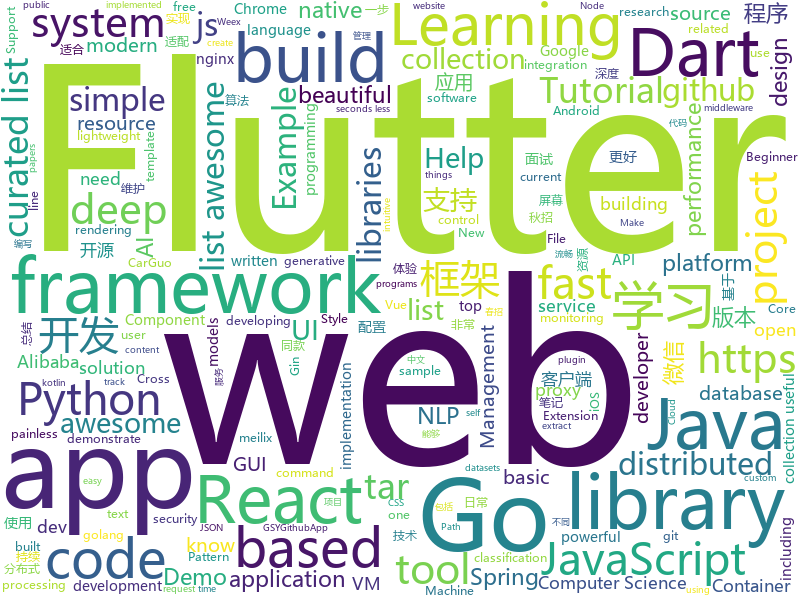

# 2018-11-13
See what the GitHub community is most excited about today.

## python
* [XSStrike](https://github.com/s0md3v/XSStrike)(**1,601 stars today**): Most advanced XSS detection suite.
* [pampy](https://github.com/santinic/pampy)(**290 stars today**): Pampy: The Pattern Matching for Python you always dreamed of.
* [spinningup](https://github.com/openai/spinningup)(**219 stars today**): An educational resource to help anyone learn deep reinforcement learning.
* [bert](https://github.com/google-research/bert)(**177 stars today**): TensorFlow code and pre-trained models for BERT
* [Python](https://github.com/TheAlgorithms/Python)(**100 stars today**): All Algorithms implemented in Python
* [models](https://github.com/tensorflow/models)(**72 stars today**): Models and examples built with TensorFlow
* [DeepCreamPy](https://github.com/deeppomf/DeepCreamPy)(**82 stars today**): Decensoring Hentai with Deep Neural Networks
* [system-design-primer](https://github.com/donnemartin/system-design-primer)(**68 stars today**): Learn how to design large-scale systems. Prep for the system design interview. Includes Anki flashcards.
* [Algorithm_Interview_Notes-Chinese](https://github.com/imhuay/Algorithm_Interview_Notes-Chinese)(**57 stars today**): 2018/2019/校招/春招/秋招/算法/机器学习(Machine Learning)/深度学习(Deep Learning)/自然语言处理(NLP)/C/C++/Python/面试笔记
* [HTML-as-programming-language](https://github.com/HTML-as-programming-language/HTML-as-programming-language)(**62 stars today**): We aim to build a programming language that looks like HTML
* [awesome-python](https://github.com/vinta/awesome-python)(**57 stars today**): A curated list of awesome Python frameworks, libraries, software and resources
* [awesome-algorithm](https://github.com/apachecn/awesome-algorithm)(**52 stars today**): Leetcode 题解 (跟随思路一步一步撸出代码) 及经典算法实现
* [keras](https://github.com/keras-team/keras)(**44 stars today**): Deep Learning for humans
* [pixyz](https://github.com/masa-su/pixyz)(**56 stars today**): a library for developing deep generative models in a more concise, intuitive and extendable way
* [Python](https://github.com/geekcomputers/Python)(**47 stars today**): My Python Examples
* [pycm](https://github.com/sepandhaghighi/pycm)(**52 stars today**): Multi-class confusion matrix library in Python.
* [sotawhat](https://github.com/chiphuyen/sotawhat)(**46 stars today**): Returns latest research results by crawling arxiv papers and summarizing abstracts. Helps you stay afloat with so many new papers everyday.
* [pcam](https://github.com/basveeling/pcam)(**45 stars today**): The PatchCamelyon (PCam) deep learning classification benchmark.
* [waveglow](https://github.com/NVIDIA/waveglow)(**42 stars today**): A Flow-based Generative Network for Speech Synthesis
* [saleor](https://github.com/mirumee/saleor)(**44 stars today**): A modular, high performance e-commerce storefront built with Python, GraphQL, Django, and ReactJS.
* [cedardeploy](https://github.com/liquanzhou/cedardeploy)(**38 stars today**): 基于ssh秘钥supervisord的发布系统
* [PySimpleGUI](https://github.com/MikeTheWatchGuy/PySimpleGUI)(**41 stars today**): Launched in 2018 Actively developed and supported. Super-simple to create custom layout GUI's. Python 2.7 & 3 Support. 100 Demo programs & Cookbook for rapid start. Extensive documentation. Examples using Machine Learning(GUI, OpenCV Integration, Chatterbot), Floating Desktop Widgets, Matplotlib + Pyplot integration, add GUI to command line scri…
* [writing-code-for-nlp-research-emnlp2018](https://github.com/allenai/writing-code-for-nlp-research-emnlp2018)(**40 stars today**): A companion repository for the "Writing code for NLP Research" Tutorial at EMNLP 2018
* [dirhunt](https://github.com/Nekmo/dirhunt)(**39 stars today**): Find web directories without bruteforce
* [public-apis](https://github.com/toddmotto/public-apis)(**38 stars today**): A collective list of public JSON APIs for use in web development.

## java
* [JavaGuide](https://github.com/Snailclimb/JavaGuide)(**154 stars today**): 【Java学习+面试指南】 一份涵盖大部分Java程序员所需要掌握的核心知识。
* [ToastUtils](https://github.com/getActivity/ToastUtils)(**93 stars today**): This is a very functional Toast
* [arthas](https://github.com/alibaba/arthas)(**61 stars today**): Alibaba Java Diagnostic Tool Arthas/Alibaba Java诊断利器Arthas
* [CookieBar2](https://github.com/AviranAbady/CookieBar2)(**63 stars today**): CookieBar2 is a lightweight library for fancy toast messages at the top or bottom of the screen.
* [proxyee-down](https://github.com/proxyee-down-org/proxyee-down)(**57 stars today**): http下载工具，基于http代理，支持多连接分块下载
* [symphony](https://github.com/b3log/symphony)(**57 stars today**): 🎶一款用 Java 实现的现代化社区（论坛/BBS/社交网络/博客）平台。https://hacpai.com
* [FFmpegDemo](https://github.com/tangpeng/FFmpegDemo)(**57 stars today**): Android使用FFmpeg框架进行本地视频压缩，扩展性高，效果好，亲测有效！！！
* [RxJava](https://github.com/ReactiveX/RxJava)(**48 stars today**): RxJava – Reactive Extensions for the JVM – a library for composing asynchronous and event-based programs using observable sequences for the Java VM.
* [sharding-sphere](https://github.com/sharding-sphere/sharding-sphere)(**40 stars today**): Distributed database middleware
* [JCSprout](https://github.com/crossoverJie/JCSprout)(**41 stars today**): 👨‍🎓Java Core Sprout : basic, concurrent, algorithm
* [interviews](https://github.com/kdn251/interviews)(**42 stars today**): Everything you need to know to get the job.
* [java-design-patterns](https://github.com/iluwatar/java-design-patterns)(**39 stars today**): Design patterns implemented in Java
* [apollo](https://github.com/ctripcorp/apollo)(**37 stars today**): Apollo（阿波罗）是携程框架部门研发的分布式配置中心，能够集中化管理应用不同环境、不同集群的配置，配置修改后能够实时推送到应用端，并且具备规范的权限、流程治理等特性，适用于微服务配置管理场景。
* [spring-cloud-alibaba](https://github.com/spring-cloud-incubator/spring-cloud-alibaba)(**40 stars today**): Spring Cloud Alibaba provides a one-stop solution for application development for the distributed solutions of Alibaba middleware.
* [spring-boot](https://github.com/spring-projects/spring-boot)(**36 stars today**): Spring Boot
* [mybatis-plus](https://github.com/baomidou/mybatis-plus)(**39 stars today**): An powerful enhanced toolkit of Mybatis for simplify development
* [spring-framework](https://github.com/spring-projects/spring-framework)(**30 stars today**): Spring Framework
* [weixin-java-tools](https://github.com/Wechat-Group/weixin-java-tools)(**31 stars today**): 全能微信Java开发工具包，支持包括微信支付、开放平台、小程序、企业微信/企业号和公众号等的开发
* [9stepsawesome](https://github.com/burrsutter/9stepsawesome)(**34 stars today**): 
* [hutool](https://github.com/looly/hutool)(**33 stars today**): A set of tools that keep Java sweet.
* [Signal-Android](https://github.com/signalapp/Signal-Android)(**33 stars today**): A private messenger for Android.
* [SpringCloudLearning](https://github.com/forezp/SpringCloudLearning)(**31 stars today**): 《史上最简单的Spring Cloud教程源码》
* [tutorials](https://github.com/eugenp/tutorials)(**14 stars today**): The "REST With Spring" Course:
* [incubator-skywalking](https://github.com/apache/incubator-skywalking)(**31 stars today**): A distributed tracing system, and APM ( Application Performance Monitoring )
* [sdb-mall](https://github.com/yjjdick/sdb-mall)(**32 stars today**): 极速开发微商城,分销商城的微服务分布式框架，前后端分离

## unknown
* [Data-Competition-TopSolution](https://github.com/Smilexuhc/Data-Competition-TopSolution)(**213 stars today**): Data competition Top Solution 数据竞赛top解决方案开源整理
* [git-flight-rules](https://github.com/k88hudson/git-flight-rules)(**122 stars today**): Flight rules for git
* [awful-ai](https://github.com/daviddao/awful-ai)(**87 stars today**): 😈Awful AI is a curated list to track current scary usages of AI - hoping to raise awareness
* [awesome-web-you-should-know](https://github.com/leinov/awesome-web-you-should-know)(**86 stars today**): 🌎awesome-web-you-should-know
* [learning-article](https://github.com/webproblem/learning-article)(**70 stars today**): 学习资源 or 大前端导航，持续更新
* [A-to-Z-Resources-for-Students](https://github.com/dipakkr/A-to-Z-Resources-for-Students)(**73 stars today**): ☑️Curated list of resources for college students Show your❤️by giving a⭐️
* [awesome](https://github.com/sindresorhus/awesome)(**60 stars today**): 😎Curated list of awesome lists
* [CS-Notes](https://github.com/CyC2018/CS-Notes)(**53 stars today**): 📚Computer Science Learning Notes
* [gitignore](https://github.com/github/gitignore)(**38 stars today**): A collection of useful .gitignore templates
* [coding-interview-university](https://github.com/jwasham/coding-interview-university)(**45 stars today**): A complete computer science study plan to become a software engineer.
* [awesome-vue](https://github.com/vuejs/awesome-vue)(**46 stars today**): 🎉A curated list of awesome things related to Vue.js
* [free-programming-books](https://github.com/EbookFoundation/free-programming-books)(**41 stars today**): 📚Freely available programming books
* [project-based-learning](https://github.com/tuvtran/project-based-learning)(**44 stars today**): Curated list of project-based tutorials
* [first-contributions](https://github.com/firstcontributions/first-contributions)(**25 stars today**): 🚀✨Help beginners to contribute to open source projects
* [list_of_recommender_systems](https://github.com/grahamjenson/list_of_recommender_systems)(**39 stars today**): A List of Recommender Systems and Resources
* [2019_campus_apply](https://github.com/frank-lam/2019_campus_apply)(**33 stars today**): 🚀Full Stack Developer Tutorial，后台技术栈/全栈开发/架构师之路，秋招/春招/校招/面试。 from zero to hero.
* [computer-science](https://github.com/ossu/computer-science)(**33 stars today**): 🎓Path to a free self-taught education in Computer Science!
* [virtualbox_e1000_0day](https://github.com/MorteNoir1/virtualbox_e1000_0day)(**31 stars today**): VirtualBox E1000 Guest-to-Host Escape
* [Awesome-pytorch-list](https://github.com/bharathgs/Awesome-pytorch-list)(**29 stars today**): A comprehensive list of pytorch related content on github,such as different models,implementations,helper libraries,tutorials etc.
* [awesome-sec-talks](https://github.com/PaulSec/awesome-sec-talks)(**28 stars today**): A collected list of awesome security talks
* [NTU-HsuanTienLin-MachineLearning](https://github.com/RedstoneWill/NTU-HsuanTienLin-MachineLearning)(**27 stars today**): 
* [advanced-nginx](https://github.com/Zhucola/advanced-nginx)(**28 stars today**): 一些nginx的基础操作与总结，包括nginx编译与安装，nginx各模块基本操作与总结，使用openssl搭建PKI
* [awesome-windows-security](https://github.com/chryzsh/awesome-windows-security)(**28 stars today**): List of Awesome Windows Security Resources
* [awesome-public-datasets](https://github.com/awesomedata/awesome-public-datasets)(**24 stars today**): A topic-centric list of high-quality open datasets in public domains. New PR ☛☛☛
* [awesome-react](https://github.com/enaqx/awesome-react)(**24 stars today**): A collection of awesome things regarding React ecosystem.

## javascript
* [openmct](https://github.com/nasa/openmct)(**850 stars today**): A web based mission control framework.
* [enquirer](https://github.com/enquirer/enquirer)(**400 stars today**): Stylish, intuitive and user-friendly prompt system.
* [Glider.js](https://github.com/NickPiscitelli/Glider.js)(**307 stars today**): A blazingly fast, lightweight, dependency free, minimal carousel with momentum scrolling!
* [react-beautiful-dnd](https://github.com/atlassian/react-beautiful-dnd)(**298 stars today**): Beautiful and accessible drag and drop for lists with React
* [rawact](https://github.com/sokra/rawact)(**290 stars today**): [POC] A babel plugin which compiles React.js components into native DOM instructions to eliminate the need for the react library at runtime.
* [33-js-concepts](https://github.com/leonardomso/33-js-concepts)(**274 stars today**): 📜33 concepts every JavaScript developer should know.
* [33-js-concepts](https://github.com/stephentian/33-js-concepts)(**249 stars today**): 📜每个 JavaScript 工程师都应懂的33个概念 @leonardomso
* [fx](https://github.com/antonmedv/fx)(**252 stars today**): Command-line JSON processing tool🔥
* [dayjs](https://github.com/iamkun/dayjs)(**231 stars today**): ⏰Day.js 2KB immutable date library alternative to Moment.js with the same modern API
* [30-seconds-of-code](https://github.com/30-seconds/30-seconds-of-code)(**138 stars today**): Curated collection of useful JavaScript snippets that you can understand in 30 seconds or less.
* [vue](https://github.com/vuejs/vue)(**117 stars today**): 🖖A progressive, incrementally-adoptable JavaScript framework for building UI on the web.
* [carlo](https://github.com/GoogleChromeLabs/carlo)(**113 stars today**): Web rendering surface for Node applications
* [ProjectVisBug](https://github.com/GoogleChromeLabs/ProjectVisBug)(**102 stars today**): 🎨Make any webpage feel like an artboard, download extension here https://chrome.google.com/webstore/detail/cdockenadnadldjbbgcallicgledbeoc
* [tiptap](https://github.com/heyscrumpy/tiptap)(**100 stars today**): A rich-text editor for Vue.js
* [SwiftnessX](https://github.com/ehrishirajsharma/SwiftnessX)(**90 stars today**): A cross-platform note-taking & target-tracking app for penetration testers.
* [react](https://github.com/facebook/react)(**73 stars today**): A declarative, efficient, and flexible JavaScript library for building user interfaces.
* [free-programming-books-zh_CN](https://github.com/justjavac/free-programming-books-zh_CN)(**72 stars today**): 📚免费的计算机编程类中文书籍，欢迎投稿
* [create-react-app](https://github.com/facebook/create-react-app)(**68 stars today**): Set up a modern web app by running one command.
* [glorious-demo](https://github.com/glorious-codes/glorious-demo)(**75 stars today**): The easiest way to demonstrate your code in action.
* [taro](https://github.com/NervJS/taro)(**68 stars today**): 多端统一开发框架，支持用 React 的开发方式编写一次代码，生成能运行在微信小程序/百度智能小程序/支付宝小程序、H5、React Native 等的应用。
* [strapi](https://github.com/strapi/strapi)(**68 stars today**): 🚀Node.js Content Management Framework (headless-CMS) to build powerful API with no effort.
* [redbird](https://github.com/OptimalBits/redbird)(**67 stars today**): A modern reverse proxy for node
* [omi](https://github.com/Tencent/omi)(**63 stars today**): Next generation web framework in 4kb JavaScript (Web Components + JSX + Proxy + Store + Path Updating)
* [opunit](https://github.com/ottomatica/opunit)(**63 stars today**): 🕵️‍♂️🍞Sanity checking containers, vms, and servers
* [javascript](https://github.com/airbnb/javascript)(**56 stars today**): JavaScript Style Guide

## html
* [BabySploit](https://github.com/M4cs/BabySploit)(**40 stars today**): BabySploit Beginner Pentesting Framework Written in Python
* [NLP-progress](https://github.com/sebastianruder/NLP-progress)(**37 stars today**): Repository to track the progress in Natural Language Processing (NLP), including the datasets and the current state-of-the-art for the most common NLP tasks.
* [styleguide](https://github.com/google/styleguide)(**25 stars today**): Style guides for Google-originated open-source projects
* [meilix-generator](https://github.com/fossasia/meilix-generator)(**23 stars today**): WebApp for generating a custom ISO image based on Meilix http://meilix.org
* [Spoon-Knife](https://github.com/octocat/Spoon-Knife)(****): This repo is for demonstration purposes only.
* [30-seconds-of-css](https://github.com/30-seconds/30-seconds-of-css)(**19 stars today**): A curated collection of useful CSS snippets you can understand in 30 seconds or less.
* [fastText](https://github.com/facebookresearch/fastText)(**15 stars today**): Library for fast text representation and classification.
* [chinese-ig](https://github.com/w3c/chinese-ig)(**13 stars today**): Web中文兴趣组
* [react-redux](https://github.com/reduxjs/react-redux)(**14 stars today**): Official React bindings for Redux
* [Adminator-admin-dashboard](https://github.com/puikinsh/Adminator-admin-dashboard)(**12 stars today**): Adminator is a easy to use and well design admin dashboard template for web apps, websites, services and more
* [sgfin.github.io](https://github.com/sgfin/sgfin.github.io)(**11 stars today**): Academic blog with markdown stolen from Sam Greydanus who stole it from Andrej Karpathy...
* [portainer](https://github.com/portainer/portainer)(**12 stars today**): Simple management UI for Docker
* [now-github-starter](https://github.com/zeit/now-github-starter)(****): Starter project to demonstrate a project whose pull requests get automatically deployed
* [ai-deadlines](https://github.com/abhshkdz/ai-deadlines)(**12 stars today**): ⏰AI conference deadline countdowns
* [electron-api-demos](https://github.com/electron/electron-api-demos)(**11 stars today**): Explore the Electron APIs
* [deeplearning_ai_books](https://github.com/fengdu78/deeplearning_ai_books)(**10 stars today**): deeplearning.ai（吴恩达老师的深度学习课程笔记及资源）
* [solid](https://github.com/solid/solid)(**10 stars today**): Solid - Re-decentralizing the web (project directory)
* [beautiful-jekyll](https://github.com/daattali/beautiful-jekyll)(**5 stars today**): ✨Build a beautiful and simple website in literally minutes. Demo at http://deanattali.com/beautiful-jekyll
* [boost](https://github.com/boostorg/boost)(**8 stars today**): Super-project for modularized Boost
* [EIPs](https://github.com/ethereum/EIPs)(**8 stars today**): The Ethereum Improvement Proposal repository
* [polymer](https://github.com/Polymer/polymer)(**7 stars today**): Our original Web Component library.
* [expressjs.com](https://github.com/expressjs/expressjs.com)(**7 stars today**): 
* [illustrated-tls13](https://github.com/syncsynchalt/illustrated-tls13)(**7 stars today**): The Illustrated TLS 1.3 Connection: Every byte explained
* [realworld](https://github.com/sveltejs/realworld)(**7 stars today**): Svelte/Sapper implementation of the RealWorld app
* [flag-icon-css](https://github.com/lipis/flag-icon-css)(**6 stars today**): 🎏A collection of all country flags in SVG — plus the CSS for easier integration

## dart
* [flutter](https://github.com/flutter/flutter)(**80 stars today**): Flutter makes it easy and fast to build beautiful mobile apps.
* [awesome-flutter](https://github.com/Solido/awesome-flutter)(**35 stars today**): An awesome list that curates the best Flutter libraries, tools, tutorials, articles and more.
* [GSYGithubAppFlutter](https://github.com/CarGuo/GSYGithubAppFlutter)(**15 stars today**): 超完整的Flutter项目，功能丰富，适合学习和日常使用。GSYGithubApp系列的优势：我们目前已经拥有Flutter、Weex、ReactNative、kotlin 四个版本。 功能齐全，项目框架内技术涉及面广，完成度高，持续维护，配套文章，适合全面学习，对比参考。跨平台的开源Github客户端App，更好的体验，更丰富的功能，旨在更好的日常管理和维护个人Github，提供更好更方便的驾车体验Σ(￣。￣ﾉ)ﾉ。同款Weex版本 ： https://github.com/CarGuo/GSYGithubAppWeex 、同款React Native版本 ： https://github.com/CarGuo/GSYGithubApp 、原生 kotlin 版本 https://g…
* [plugins](https://github.com/flutter/plugins)(**11 stars today**): Plugins for Flutter, including FlutterFire, maintained by the Flutter team
* [dio](https://github.com/flutterchina/dio)(**13 stars today**): A powerful Http client for Dart, which supports Interceptors, FormData, Request Cancellation, File Downloading, Timeout etc.
* [flutter_architecture_samples](https://github.com/brianegan/flutter_architecture_samples)(**9 stars today**): TodoMVC for Flutter
* [samples](https://github.com/flutter/samples)(**8 stars today**): A collection of Flutter examples and demos.
* [inKino](https://github.com/roughike/inKino)(**6 stars today**): A multiplatform Dart movie app with 40% of code sharing between Flutter and the Web.
* [sdk](https://github.com/dart-lang/sdk)(**6 stars today**): The Dart SDK, including the VM, dart2js, core libraries, and more.
* [flutter_ScreenUtil](https://github.com/OpenFlutter/flutter_ScreenUtil)(**5 stars today**): flutter 屏幕适配 ，字体适配，获取屏幕信息
* [flutter_crush](https://github.com/boeledi/flutter_crush)(**5 stars today**): How to build a Match-3 game, like Candy Crush, Bejeweled, FishDom… in Flutter.
* [zefyr](https://github.com/memspace/zefyr)(****): 
* [website](https://github.com/flutter/website)(****): Flutter web site
* [spaceblast](https://github.com/spritewidget/spaceblast)(****): Demo game for SpriteWidget
* [chromedeveditor](https://github.com/googlearchive/chromedeveditor)(****): Chrome Dev Editor is a developer tool for building apps on the Chrome platform - Chrome Apps and Web Apps, in JavaScript or Dart. (NO LONGER IN ACTIVE DEVELOPMENT)
* [FlutterExampleApps](https://github.com/iampawan/FlutterExampleApps)(****): [Example APPS] Basic Flutter apps, for flutter devs.
* [Flutter-UI-Kit](https://github.com/iampawan/Flutter-UI-Kit)(****): Flutter app for collection of UI in a UIKit
* [flutter-osc](https://github.com/yubo725/flutter-osc)(****): 基于Google Flutter的开源中国客户端，支持Android和iOS。
* [flutter-examples](https://github.com/nisrulz/flutter-examples)(****): [Examples] Simple basic isolated apps, for budding flutter devs.
* [Flutter-learning](https://github.com/AweiLoveAndroid/Flutter-learning)(****): 🔥👍🌟⭐️⭐️⭐️Flutter install&settings,Flutter problems when developing,Flutter sample codes& templates,Flutter projects,Dart languages sample codes
* [hauberk](https://github.com/munificent/hauberk)(****): A web-based roguelike written in Dart.
* [zhihu-flutter](https://github.com/HackSoul/zhihu-flutter)(****): Flutter 高仿知乎 UI，非常漂亮，也非常流畅，flutter build apk 或 flutter build ios 之后更流畅
* [angular](https://github.com/dart-lang/angular)(****): Fast and productive web framework provided by Dart
* [StageXL](https://github.com/bp74/StageXL)(****): A fast and universal 2D rendering engine for HTML5 and Dart.
* [dart-sass](https://github.com/sass/dart-sass)(****): A Dart implementation of Sass.

## go
* [webrtty](https://github.com/maxmcd/webrtty)(**158 stars today**): Share a terminal session over WebRTC
* [writefreely](https://github.com/writeas/writefreely)(**142 stars today**): A painless, simple, federated blogging platform.
* [logger](https://github.com/google/logger)(**131 stars today**): Cross platform Go logging library.
* [argo](https://github.com/argoproj/argo)(**126 stars today**): Container-native workflows for Kubernetes.
* [gocity](https://github.com/rodrigo-brito/gocity)(**127 stars today**): 📊Code City metaphor for visualizing Go source code in 3D
* [chain33](https://github.com/33cn/chain33)(**92 stars today**): 高度模块化, 遵循 KISS原则的区块链开发框架
* [frp](https://github.com/fatedier/frp)(**61 stars today**): A fast reverse proxy to help you expose a local server behind a NAT or firewall to the internet.
* [kubernetes](https://github.com/kubernetes/kubernetes)(**57 stars today**): Production-Grade Container Scheduling and Management
* [go-mega](https://github.com/bonfy/go-mega)(**58 stars today**): ✨🤟✨Go-Mega Tutorial for Go Web Develop | Demo: https://go-mega.herokuapp.com
* [pipelines](https://github.com/kubeflow/pipelines)(**54 stars today**): Machine Learning Pipelines for Kubeflow
* [soar](https://github.com/XiaoMi/soar)(**51 stars today**): SQL Optimizer And Rewriter
* [awesome-go](https://github.com/avelino/awesome-go)(**48 stars today**): A curated list of awesome Go frameworks, libraries and software
* [archiver](https://github.com/mholt/archiver)(**47 stars today**): Easily create and extract .zip, .tar, .tar.gz, .tar.bz2, .tar.xz, .tar.lz4, .tar.sz, and .rar (extract-only) files with Go
* [go](https://github.com/golang/go)(**42 stars today**): The Go programming language
* [dive](https://github.com/wagoodman/dive)(**43 stars today**): A tool for exploring each layer in a docker image
* [BaiduPCS-Go](https://github.com/iikira/BaiduPCS-Go)(**41 stars today**): 百度网盘客户端 - Go语言编写
* [gin](https://github.com/gin-gonic/gin)(**39 stars today**): Gin is a HTTP web framework written in Go (Golang). It features a Martini-like API with much better performance -- up to 40 times faster. If you need smashing performance, get yourself some Gin.
* [tinygo](https://github.com/aykevl/tinygo)(**41 stars today**): Go compiler for small devices, based on LLVM.
* [dgraph](https://github.com/dgraph-io/dgraph)(**35 stars today**): Fast, Distributed Graph DB
* [tidb](https://github.com/pingcap/tidb)(**35 stars today**): TiDB is a distributed HTAP database compatible with the MySQL protocol
* [build-web-application-with-golang](https://github.com/astaxie/build-web-application-with-golang)(**32 stars today**): A golang ebook intro how to build a web with golang
* [modern-go-application](https://github.com/sagikazarmark/modern-go-application)(**35 stars today**): Modern Go Application example
* [istio](https://github.com/istio/istio)(**32 stars today**): Connect, secure, control, and observe services.
* [prometheus](https://github.com/prometheus/prometheus)(**31 stars today**): The Prometheus monitoring system and time series database.
* [gogs](https://github.com/gogs/gogs)(**29 stars today**): Gogs is a painless self-hosted Git service.

## WordCloud

