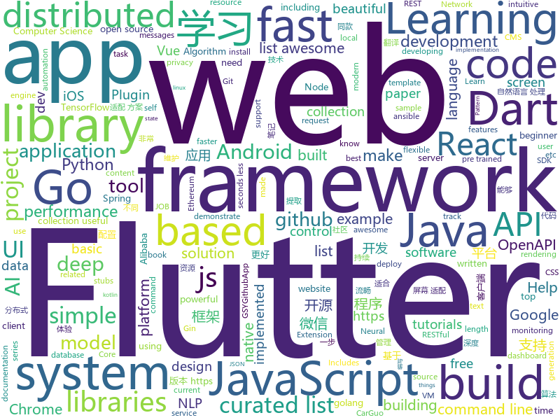

# 2018-11-14
See what the GitHub community is most excited about today.

## python
* [XSStrike](https://github.com/s0md3v/XSStrike)(**766 stars today**): Most advanced XSS detection suite.
* [uis-rnn](https://github.com/google/uis-rnn)(**213 stars today**): This is the library for the Unbounded Interleaved-State Recurrent Neural Network (UIS-RNN) algorithm, corresponding to the paper Fully Supervised Speaker Diarization.
* [bert](https://github.com/google-research/bert)(**142 stars today**): TensorFlow code and pre-trained models for BERT
* [pampy](https://github.com/santinic/pampy)(**145 stars today**): Pampy: The Pattern Matching for Python you always dreamed of.
* [Python](https://github.com/TheAlgorithms/Python)(**86 stars today**): All Algorithms implemented in Python
* [models](https://github.com/tensorflow/models)(**72 stars today**): Models and examples built with TensorFlow
* [spinningup](https://github.com/openai/spinningup)(**89 stars today**): An educational resource to help anyone learn deep reinforcement learning.
* [DeepCreamPy](https://github.com/deeppomf/DeepCreamPy)(**74 stars today**): Decensoring Hentai with Deep Neural Networks
* [awesome-python](https://github.com/vinta/awesome-python)(**67 stars today**): A curated list of awesome Python frameworks, libraries, software and resources
* [keras](https://github.com/keras-team/keras)(**45 stars today**): Deep Learning for humans
* [Algorithm_Interview_Notes-Chinese](https://github.com/imhuay/Algorithm_Interview_Notes-Chinese)(**47 stars today**): 2018/2019/校招/春招/秋招/算法/机器学习(Machine Learning)/深度学习(Deep Learning)/自然语言处理(NLP)/C/C++/Python/面试笔记
* [system-design-primer](https://github.com/donnemartin/system-design-primer)(**47 stars today**): Learn how to design large-scale systems. Prep for the system design interview. Includes Anki flashcards.
* [WebMap](https://github.com/Rev3rseSecurity/WebMap)(**45 stars today**): Nmap Web Dashboard and Reporting
* [bert-as-service](https://github.com/hanxiao/bert-as-service)(**41 stars today**): Mapping a variable-length sentence to a fixed-length vector using pretrained BERT model
* [face_recognition](https://github.com/ageitgey/face_recognition)(**37 stars today**): The world's simplest facial recognition api for Python and the command line
* [PocketFlow](https://github.com/Tencent/PocketFlow)(**37 stars today**): An Automatic Model Compression (AutoMC) framework for developing smaller and faster AI applications.
* [PySyft](https://github.com/OpenMined/PySyft)(**37 stars today**): A library for encrypted, privacy preserving deep learning - based on PyTorch
* [ansible](https://github.com/ansible/ansible)(**29 stars today**): Ansible is a radically simple IT automation platform that makes your applications and systems easier to deploy. Avoid writing scripts or custom code to deploy and update your applications — automate in a language that approaches plain English, using SSH, with no agents to install on remote systems. https://docs.ansible.com/ansible/
* [home-assistant](https://github.com/home-assistant/home-assistant)(**30 stars today**): 🏡Open source home automation that puts local control and privacy first
* [saleor](https://github.com/mirumee/saleor)(**34 stars today**): A modular, high performance e-commerce storefront built with Python, GraphQL, Django, and ReactJS.
* [public-apis](https://github.com/toddmotto/public-apis)(**32 stars today**): A collective list of public JSON APIs for use in web development.
* [sotawhat](https://github.com/chiphuyen/sotawhat)(**32 stars today**): Returns latest research results by crawling arxiv papers and summarizing abstracts. Helps you stay afloat with so many new papers everyday.
* [adanet](https://github.com/tensorflow/adanet)(**31 stars today**): Fast and flexible AutoML with learning guarantees.
* [awesome-algorithm](https://github.com/apachecn/awesome-algorithm)(**28 stars today**): Leetcode 题解 (跟随思路一步一步撸出代码) 及经典算法实现
* [you-get](https://github.com/soimort/you-get)(**30 stars today**): ⏬Dumb downloader that scrapes the web

## java
* [ratel](https://github.com/ainilili/ratel)(**248 stars today**): A fighting landlord program that can be played on the command line
* [JavaGuide](https://github.com/Snailclimb/JavaGuide)(**133 stars today**): 【Java学习+面试指南】 一份涵盖大部分Java程序员所需要掌握的核心知识。
* [java-design-patterns](https://github.com/iluwatar/java-design-patterns)(**59 stars today**): Design patterns implemented in Java
* [proxyee-down](https://github.com/proxyee-down-org/proxyee-down)(**58 stars today**): http下载工具，基于http代理，支持多连接分块下载
* [spring-boot](https://github.com/spring-projects/spring-boot)(**50 stars today**): Spring Boot
* [Agent](https://github.com/ioFog/Agent)(**57 stars today**): 
* [arthas](https://github.com/alibaba/arthas)(**51 stars today**): Alibaba Java Diagnostic Tool Arthas/Alibaba Java诊断利器Arthas
* [elasticsearch](https://github.com/elastic/elasticsearch)(**47 stars today**): Open Source, Distributed, RESTful Search Engine
* [apollo](https://github.com/ctripcorp/apollo)(**46 stars today**): Apollo（阿波罗）是携程框架部门研发的分布式配置中心，能够集中化管理应用不同环境、不同集群的配置，配置修改后能够实时推送到应用端，并且具备规范的权限、流程治理等特性，适用于微服务配置管理场景。
* [CookieBar2](https://github.com/AviranAbady/CookieBar2)(**51 stars today**): CookieBar2 is an Android library for displaying messages at the top or bottom of the screen.
* [symphony](https://github.com/b3log/symphony)(**47 stars today**): 🎶一款用 Java 实现的现代化社区（论坛/BBS/社交网络/博客）平台。https://hacpai.com
* [RxJava](https://github.com/ReactiveX/RxJava)(**46 stars today**): RxJava – Reactive Extensions for the JVM – a library for composing asynchronous and event-based programs using observable sequences for the Java VM.
* [ToastUtils](https://github.com/getActivity/ToastUtils)(**44 stars today**): This is a very functional Toast
* [spring-cloud-alibaba](https://github.com/spring-cloud-incubator/spring-cloud-alibaba)(**44 stars today**): Spring Cloud Alibaba provides a one-stop solution for application development for the distributed solutions of Alibaba middleware.
* [sharding-sphere](https://github.com/sharding-sphere/sharding-sphere)(**42 stars today**): Distributed database middleware
* [tutorials](https://github.com/eugenp/tutorials)(**23 stars today**): The "REST With Spring" Course:
* [weixin-java-tools](https://github.com/Wechat-Group/weixin-java-tools)(**38 stars today**): 全能微信Java开发工具包，支持包括微信支付、开放平台、小程序、企业微信/企业号和公众号等的开发
* [spring-framework](https://github.com/spring-projects/spring-framework)(**32 stars today**): Spring Framework
* [interviews](https://github.com/kdn251/interviews)(**35 stars today**): Everything you need to know to get the job.
* [mybatis-plus](https://github.com/baomidou/mybatis-plus)(**33 stars today**): An powerful enhanced toolkit of Mybatis for simplify development
* [JCSprout](https://github.com/crossoverJie/JCSprout)(**28 stars today**): 👨‍🎓Java Core Sprout : basic, concurrent, algorithm
* [incubator-skywalking](https://github.com/apache/incubator-skywalking)(**30 stars today**): A distributed tracing system, and APM ( Application Performance Monitoring )
* [xxl-job](https://github.com/xuxueli/xxl-job)(**29 stars today**): A lightweight distributed task scheduling framework.（分布式任务调度平台XXL-JOB）
* [AndroidAutoSize](https://github.com/JessYanCoding/AndroidAutoSize)(**28 stars today**): 🔥A low-cost Android screen adaptation solution (今日头条屏幕适配方案终极版，一个极低成本的 Android 屏幕适配方案).
* [HanLP](https://github.com/hankcs/HanLP)(**28 stars today**): 自然语言处理 中文分词 词性标注 命名实体识别 依存句法分析 关键词提取 新词发现 短语提取 自动摘要 文本分类 拼音简繁

## unknown
* [Data-Competition-TopSolution](https://github.com/Smilexuhc/Data-Competition-TopSolution)(**132 stars today**): Data competition Top Solution 数据竞赛top解决方案开源整理
* [Activity_PPT](https://github.com/FreeCodeCamp-Chengdu/Activity_PPT)(**116 stars today**): 线下活动的PPT存放
* [frontend-tech-list](https://github.com/alienzhou/frontend-tech-list)(**78 stars today**): a frontend tech list for developers
* [coding-interview-university](https://github.com/jwasham/coding-interview-university)(**71 stars today**): A complete computer science study plan to become a software engineer.
* [git-flight-rules](https://github.com/k88hudson/git-flight-rules)(**75 stars today**): Flight rules for git
* [You-Dont-Know-JS](https://github.com/getify/You-Dont-Know-JS)(**71 stars today**): A book series on JavaScript. @YDKJS on twitter.
* [gitignore](https://github.com/github/gitignore)(**56 stars today**): A collection of useful .gitignore templates
* [FCL](https://github.com/chenerlich/FCL)(**65 stars today**): FCL (Fileless Command Lines) - Known command lines of fileless malicious executions
* [learning-article](https://github.com/webproblem/learning-article)(**59 stars today**): 学习资源 or 大前端导航，持续更新
* [awesome](https://github.com/sindresorhus/awesome)(**60 stars today**): 😎Curated list of awesome lists
* [CS-Notes](https://github.com/CyC2018/CS-Notes)(**48 stars today**): 📚Computer Science Learning Notes
* [project-based-learning](https://github.com/tuvtran/project-based-learning)(**46 stars today**): Curated list of project-based tutorials
* [free-programming-books](https://github.com/EbookFoundation/free-programming-books)(**46 stars today**): 📚Freely available programming books
* [awesome-vue](https://github.com/vuejs/awesome-vue)(**47 stars today**): 🎉A curated list of awesome things related to Vue.js
* [awful-ai](https://github.com/daviddao/awful-ai)(**47 stars today**): 😈Awful AI is a curated list to track current scary usages of AI - hoping to raise awareness
* [gold-miner](https://github.com/xitu/gold-miner)(**37 stars today**): 🥇掘金翻译计划，可能是世界最大最好的英译中技术社区，最懂读者和译者的翻译平台：
* [A-to-Z-Resources-for-Students](https://github.com/dipakkr/A-to-Z-Resources-for-Students)(**35 stars today**): ☑️Curated list of resources for college students Show your❤️by giving a⭐️
* [computer-science](https://github.com/ossu/computer-science)(**30 stars today**): 🎓Path to a free self-taught education in Computer Science!
* [Awesome-pytorch-list](https://github.com/bharathgs/Awesome-pytorch-list)(**28 stars today**): A comprehensive list of pytorch related content on github,such as different models,implementations,helper libraries,tutorials etc.
* [first-contributions](https://github.com/firstcontributions/first-contributions)(**18 stars today**): 🚀✨Help beginners to contribute to open source projects
* [nodebestpractices](https://github.com/i0natan/nodebestpractices)(**30 stars today**): The largest Node.JS best practices list (November 2018)
* [Ethereum-Smart-Contracts-Security-CheckList](https://github.com/knownsec/Ethereum-Smart-Contracts-Security-CheckList)(**29 stars today**): Ethereum Smart Contracts Security CheckList From Knownsec 404 Team
* [awesome-react](https://github.com/enaqx/awesome-react)(**28 stars today**): A collection of awesome things regarding React ecosystem.
* [elixir-tips](https://github.com/blackode/elixir-tips)(**28 stars today**): The Killer Elixir Tips and Tricks...from the experience...
* [OpenAPI-Specification](https://github.com/OAI/OpenAPI-Specification)(**25 stars today**): The OpenAPI Specification Repository

## javascript
* [tensorspace](https://github.com/tensorspace-team/tensorspace)(**882 stars today**): Neural network 3D visualization framework, build interactive and intuitive model in browsers, support pre-trained deep learning models from TensorFlow, Keras, TensorFlow.js
* [openmct](https://github.com/nasa/openmct)(**522 stars today**): A web based mission control framework.
* [ProjectVisBug](https://github.com/GoogleChromeLabs/ProjectVisBug)(**489 stars today**): 🎨Make any webpage feel like an artboard, download extension here https://chrome.google.com/webstore/detail/cdockenadnadldjbbgcallicgledbeoc
* [react-beautiful-dnd](https://github.com/atlassian/react-beautiful-dnd)(**352 stars today**): Beautiful and accessible drag and drop for lists with React
* [enquirer](https://github.com/enquirer/enquirer)(**272 stars today**): Stylish, intuitive and user-friendly prompt system.
* [33-js-concepts](https://github.com/leonardomso/33-js-concepts)(**197 stars today**): 📜33 concepts every JavaScript developer should know.
* [Glider.js](https://github.com/NickPiscitelli/Glider.js)(**192 stars today**): A blazingly fast, lightweight, dependency free, minimal carousel with momentum scrolling!
* [fx](https://github.com/antonmedv/fx)(**191 stars today**): Command-line JSON viewer🔥
* [rawact](https://github.com/sokra/rawact)(**174 stars today**): [POC] A babel plugin which compiles React.js components into native DOM instructions to eliminate the need for the react library at runtime.
* [33-js-concepts](https://github.com/stephentian/33-js-concepts)(**159 stars today**): 📜每个 JavaScript 工程师都应懂的33个概念 @leonardomso
* [30-seconds-of-code](https://github.com/30-seconds/30-seconds-of-code)(**151 stars today**): Curated collection of useful JavaScript snippets that you can understand in 30 seconds or less.
* [vue](https://github.com/vuejs/vue)(**134 stars today**): 🖖A progressive, incrementally-adoptable JavaScript framework for building UI on the web.
* [dayjs](https://github.com/iamkun/dayjs)(**137 stars today**): ⏰Day.js 2KB immutable date library alternative to Moment.js with the same modern API
* [react](https://github.com/facebook/react)(**115 stars today**): A declarative, efficient, and flexible JavaScript library for building user interfaces.
* [taro](https://github.com/NervJS/taro)(**125 stars today**): 多端统一开发框架，支持用 React 的开发方式编写一次代码，生成能运行在微信小程序/百度智能小程序/支付宝小程序、H5、React Native 等的应用。
* [carlo](https://github.com/GoogleChromeLabs/carlo)(**106 stars today**): Web rendering surface for Node applications
* [virtual-scroller](https://github.com/valdrinkoshi/virtual-scroller)(**81 stars today**): 
* [tiptap](https://github.com/heyscrumpy/tiptap)(**70 stars today**): A rich-text editor for Vue.js
* [javascript](https://github.com/airbnb/javascript)(**65 stars today**): JavaScript Style Guide
* [glorious-demo](https://github.com/glorious-codes/glorious-demo)(**68 stars today**): The easiest way to demonstrate your code in action.
* [strapi](https://github.com/strapi/strapi)(**63 stars today**): 🚀Node.js Content Management Framework (headless-CMS) to build powerful API with no effort.
* [create-react-app](https://github.com/facebook/create-react-app)(**54 stars today**): Set up a modern web app by running one command.
* [md-page](https://github.com/oscarmorrison/md-page)(**65 stars today**): 📝create a webpage with just markdown
* [javascript-algorithms](https://github.com/trekhleb/javascript-algorithms)(**55 stars today**): 📝Algorithms and data structures implemented in JavaScript with explanations and links to further readings
* [megalo](https://github.com/kaola-fed/megalo)(**56 stars today**): 基于 Vue 的小程序开发框架

## html
* [NLP-progress](https://github.com/sebastianruder/NLP-progress)(**157 stars today**): Repository to track the progress in Natural Language Processing (NLP), including the datasets and the current state-of-the-art for the most common NLP tasks.
* [30-seconds-of-css](https://github.com/30-seconds/30-seconds-of-css)(**55 stars today**): A curated collection of useful CSS snippets you can understand in 30 seconds or less.
* [dfirtrack](https://github.com/stuhli/dfirtrack)(**30 stars today**): DFIRTrack - The Incident Response Tracking Application
* [styleguide](https://github.com/google/styleguide)(**20 stars today**): Style guides for Google-originated open-source projects
* [Flex-One](https://github.com/vladocar/Flex-One)(**21 stars today**): 1 CSS Class Layout System made with Flex
* [portainer](https://github.com/portainer/portainer)(**19 stars today**): Simple management UI for Docker
* [deeplearning_ai_books](https://github.com/fengdu78/deeplearning_ai_books)(**15 stars today**): deeplearning.ai（吴恩达老师的深度学习课程笔记及资源）
* [Spoon-Knife](https://github.com/octocat/Spoon-Knife)(****): This repo is for demonstration purposes only.
* [qiubaiying.github.io](https://github.com/qiubaiying/qiubaiying.github.io)(**6 stars today**): BY Blog ->
* [react-redux](https://github.com/reduxjs/react-redux)(**12 stars today**): Official React bindings for Redux
* [fastText](https://github.com/facebookresearch/fastText)(**11 stars today**): Library for fast text representation and classification.
* [Publii](https://github.com/GetPublii/Publii)(**13 stars today**): Publii is a desktop-based CMS for Windows, Mac and Linux that makes creating static websites fast and hassle-free, even for beginners.
* [solid](https://github.com/solid/solid)(**12 stars today**): Solid - Re-decentralizing the web (project directory)
* [electron-api-demos](https://github.com/electron/electron-api-demos)(**11 stars today**): Explore the Electron APIs
* [EIPs](https://github.com/ethereum/EIPs)(**7 stars today**): The Ethereum Improvement Proposal repository
* [now-github-starter](https://github.com/zeit/now-github-starter)(****): Starter project to demonstrate a project whose pull requests get automatically deployed
* [chilipie-kiosk](https://github.com/futurice/chilipie-kiosk)(**10 stars today**): Easy-to-use Raspberry Pi image for booting directly into full-screen Chrome, with built-in convenience features for unattended operation. Perfect for dashboards and build monitors.
* [beautiful-jekyll](https://github.com/daattali/beautiful-jekyll)(**6 stars today**): ✨Build a beautiful and simple website in literally minutes. Demo at http://deanattali.com/beautiful-jekyll
* [ai-deadlines](https://github.com/abhshkdz/ai-deadlines)(**9 stars today**): ⏰AI conference deadline countdowns
* [BabySploit](https://github.com/M4cs/BabySploit)(**8 stars today**): BabySploit Beginner Pentesting Framework Written in Python
* [patchwork](https://github.com/jlord/patchwork)(****): All the Git-it Workshop completers!
* [polymer](https://github.com/Polymer/polymer)(**8 stars today**): Our original Web Component library.
* [home](https://github.com/apachecn/home)(**7 stars today**): ApacheCN 开源组织
* [openapi-generator](https://github.com/OpenAPITools/openapi-generator)(**7 stars today**): OpenAPI Generator allows generation of API client libraries (SDK generation), server stubs, documentation and configuration automatically given an OpenAPI Spec (v2, v3)
* [swagger-codegen](https://github.com/swagger-api/swagger-codegen)(**6 stars today**): swagger-codegen contains a template-driven engine to generate documentation, API clients and server stubs in different languages by parsing your OpenAPI / Swagger definition.

## dart
* [flutter](https://github.com/flutter/flutter)(**88 stars today**): Flutter makes it easy and fast to build beautiful mobile apps.
* [awesome-flutter](https://github.com/Solido/awesome-flutter)(**36 stars today**): An awesome list that curates the best Flutter libraries, tools, tutorials, articles and more.
* [GSYGithubAppFlutter](https://github.com/CarGuo/GSYGithubAppFlutter)(**21 stars today**): 超完整的Flutter项目，功能丰富，适合学习和日常使用。GSYGithubApp系列的优势：我们目前已经拥有Flutter、Weex、ReactNative、kotlin 四个版本。 功能齐全，项目框架内技术涉及面广，完成度高，持续维护，配套文章，适合全面学习，对比参考。跨平台的开源Github客户端App，更好的体验，更丰富的功能，旨在更好的日常管理和维护个人Github，提供更好更方便的驾车体验Σ(￣。￣ﾉ)ﾉ。同款Weex版本 ： https://github.com/CarGuo/GSYGithubAppWeex 、同款React Native版本 ： https://github.com/CarGuo/GSYGithubApp 、原生 kotlin 版本 https://g…
* [plugins](https://github.com/flutter/plugins)(**10 stars today**): Plugins for Flutter, including FlutterFire, maintained by the Flutter team
* [flutter_architecture_samples](https://github.com/brianegan/flutter_architecture_samples)(**9 stars today**): TodoMVC for Flutter
* [samples](https://github.com/flutter/samples)(**7 stars today**): A collection of Flutter examples and demos.
* [inKino](https://github.com/roughike/inKino)(**8 stars today**): A multiplatform Dart movie app with 40% of code sharing between Flutter and the Web.
* [sdk](https://github.com/dart-lang/sdk)(**7 stars today**): The Dart SDK, including the VM, dart2js, core libraries, and more.
* [Flutter-Notebook](https://github.com/OpenFlutter/Flutter-Notebook)(**5 stars today**): 日更的FlutterDemo合集，今天你fu了吗
* [dio](https://github.com/flutterchina/dio)(**5 stars today**): A powerful Http client for Dart, which supports Interceptors, FormData, Request Cancellation, File Downloading, Timeout etc.
* [redux.dart](https://github.com/johnpryan/redux.dart)(****): Redux for Dart
* [FlutterHtmlView](https://github.com/PonnamKarthik/FlutterHtmlView)(****): Flutter Plugin to render html as a Widget
* [flutter_offline](https://github.com/jogboms/flutter_offline)(****): ✈️A tidy utility to handle offline/online connectivity like a Boss
* [dart-sass](https://github.com/sass/dart-sass)(****): A Dart implementation of Sass.
* [flutter-mobile](https://github.com/invoiceninja/flutter-mobile)(****): iOS/Android app for Invoice Ninja built with Google Flutter
* [chromedeveditor](https://github.com/googlearchive/chromedeveditor)(****): Chrome Dev Editor is a developer tool for building apps on the Chrome platform - Chrome Apps and Web Apps, in JavaScript or Dart. (NO LONGER IN ACTIVE DEVELOPMENT)
* [FlutterExampleApps](https://github.com/iampawan/FlutterExampleApps)(****): [Example APPS] Basic Flutter apps, for flutter devs.
* [Flutter-UI-Kit](https://github.com/iampawan/Flutter-UI-Kit)(****): Flutter app for collection of UI in a UIKit
* [flutter-osc](https://github.com/yubo725/flutter-osc)(****): 基于Google Flutter的开源中国客户端，支持Android和iOS。
* [flutter-examples](https://github.com/nisrulz/flutter-examples)(****): [Examples] Simple basic isolated apps, for budding flutter devs.
* [Flutter-learning](https://github.com/AweiLoveAndroid/Flutter-learning)(****): 🔥👍🌟⭐️⭐️⭐️Flutter install&settings,Flutter problems when developing,Flutter sample codes& templates,Flutter projects,Dart languages sample codes
* [hauberk](https://github.com/munificent/hauberk)(****): A web-based roguelike written in Dart.
* [zhihu-flutter](https://github.com/HackSoul/zhihu-flutter)(****): Flutter 高仿知乎 UI，非常漂亮，也非常流畅，flutter build apk 或 flutter build ios 之后更流畅
* [angular](https://github.com/dart-lang/angular)(****): Fast and productive web framework provided by Dart
* [StageXL](https://github.com/bp74/StageXL)(****): A fast and universal 2D rendering engine for HTML5 and Dart.

## go
* [webtty](https://github.com/maxmcd/webtty)(**532 stars today**): Share a terminal session over WebRTC
* [writefreely](https://github.com/writeas/writefreely)(**130 stars today**): A simple, federated blogging platform.
* [soar](https://github.com/XiaoMi/soar)(**86 stars today**): SQL Optimizer And Rewriter
* [Tigo](https://github.com/karldoenitz/Tigo)(**87 stars today**): A go restful framework
* [kubernetes](https://github.com/kubernetes/kubernetes)(**72 stars today**): Production-Grade Container Scheduling and Management
* [go](https://github.com/golang/go)(**57 stars today**): The Go programming language
* [logger](https://github.com/google/logger)(**59 stars today**): Cross platform Go logging library.
* [frp](https://github.com/fatedier/frp)(**49 stars today**): A fast reverse proxy to help you expose a local server behind a NAT or firewall to the internet.
* [tinygo](https://github.com/aykevl/tinygo)(**47 stars today**): Go compiler for small devices, based on LLVM.
* [awesome-go](https://github.com/avelino/awesome-go)(**45 stars today**): A curated list of awesome Go frameworks, libraries and software
* [BaiduPCS-Go](https://github.com/iikira/BaiduPCS-Go)(**45 stars today**): 百度网盘客户端 - Go语言编写
* [dive](https://github.com/wagoodman/dive)(**46 stars today**): A tool for exploring each layer in a docker image
* [argo](https://github.com/argoproj/argo)(**37 stars today**): Container-native workflows for Kubernetes.
* [gocity](https://github.com/rodrigo-brito/gocity)(**37 stars today**): 📊Code City metaphor for visualizing Go source code in 3D
* [TarsGo](https://github.com/TarsCloud/TarsGo)(**35 stars today**): A high performance microservice framework in golang. A linux foundation project.
* [istio](https://github.com/istio/istio)(**33 stars today**): Connect, secure, control, and observe services.
* [prometheus](https://github.com/prometheus/prometheus)(**35 stars today**): The Prometheus monitoring system and time series database.
* [gogs](https://github.com/gogs/gogs)(**33 stars today**): Gogs is a painless self-hosted Git service.
* [gin](https://github.com/gin-gonic/gin)(**32 stars today**): Gin is a HTTP web framework written in Go (Golang). It features a Martini-like API with much better performance -- up to 40 times faster. If you need smashing performance, get yourself some Gin.
* [build-web-application-with-golang](https://github.com/astaxie/build-web-application-with-golang)(**31 stars today**): A golang ebook intro how to build a web with golang
* [hugo](https://github.com/gohugoio/hugo)(**32 stars today**): The world’s fastest framework for building websites.
* [mkcert](https://github.com/FiloSottile/mkcert)(**31 stars today**): A simple zero-config tool to make locally trusted development certificates with any names you'd like.
* [faas](https://github.com/openfaas/faas)(**29 stars today**): OpenFaaS - Serverless Functions Made Simple for Docker & Kubernetes
* [server](https://github.com/gotify/server)(**28 stars today**): A REST-API for sending and receiving messages in real-time per web socket. (Includes a sleek web-ui)
* [etcd](https://github.com/etcd-io/etcd)(**27 stars today**): Distributed reliable key-value store for the most critical data of a distributed system

## WordCloud

