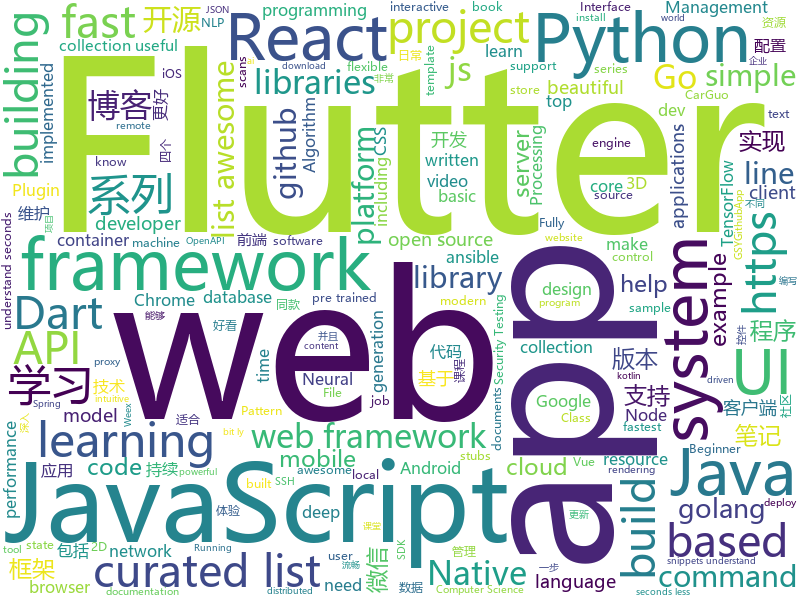

# 2018-11-15
See what the GitHub community is most excited about today.

## python
* [XSStrike](https://github.com/s0md3v/XSStrike)(**293 stars today**): Most advanced XSS detection suite.
* [uis-rnn](https://github.com/google/uis-rnn)(**173 stars today**): This is the library for the Unbounded Interleaved-State Recurrent Neural Network (UIS-RNN) algorithm, corresponding to the paper Fully Supervised Speaker Diarization.
* [bert](https://github.com/google-research/bert)(**124 stars today**): TensorFlow code and pre-trained models for BERT
* [models](https://github.com/tensorflow/models)(**72 stars today**): Models and examples built with TensorFlow
* [pampy](https://github.com/santinic/pampy)(**86 stars today**): Pampy: The Pattern Matching for Python you always dreamed of.
* [Python](https://github.com/TheAlgorithms/Python)(**67 stars today**): All Algorithms implemented in Python
* [spinningup](https://github.com/openai/spinningup)(**72 stars today**): An educational resource to help anyone learn deep reinforcement learning.
* [DeepCreamPy](https://github.com/deeppomf/DeepCreamPy)(**69 stars today**): Decensoring Hentai with Deep Neural Networks
* [keras](https://github.com/keras-team/keras)(**47 stars today**): Deep Learning for humans
* [cedardeploy](https://github.com/liquanzhou/cedardeploy)(**51 stars today**): 基于ssh秘钥supervisord的发布系统
* [system-design-primer](https://github.com/donnemartin/system-design-primer)(**50 stars today**): Learn how to design large-scale systems. Prep for the system design interview. Includes Anki flashcards.
* [awesome-python](https://github.com/vinta/awesome-python)(**46 stars today**): A curated list of awesome Python frameworks, libraries, software and resources
* [cpython](https://github.com/python/cpython)(**36 stars today**): The Python programming language
* [awesome-algorithm](https://github.com/apachecn/awesome-algorithm)(**39 stars today**): Leetcode 题解 (跟随思路一步一步撸出代码) 及经典算法实现
* [Python](https://github.com/geekcomputers/Python)(**37 stars today**): My Python Examples
* [flask](https://github.com/pallets/flask)(**38 stars today**): The Python micro framework for building web applications.
* [django](https://github.com/django/django)(**27 stars today**): The Web framework for perfectionists with deadlines.
* [localstack](https://github.com/localstack/localstack)(**41 stars today**): 💻A fully functional local AWS cloud stack. Develop and test your cloud apps offline!
* [face_recognition](https://github.com/ageitgey/face_recognition)(**34 stars today**): The world's simplest facial recognition api for Python and the command line
* [generative_art](https://github.com/aaronpenne/generative_art)(**38 stars today**): A collection of my generative artwork, mostly with Processing in Python mode
* [youtube-dl](https://github.com/rg3/youtube-dl)(**38 stars today**): Command-line program to download videos from YouTube.com and other video sites
* [adanet](https://github.com/tensorflow/adanet)(**37 stars today**): Fast and flexible AutoML with learning guarantees.
* [CodingInterviews](https://github.com/jayshah19949596/CodingInterviews)(**34 stars today**): 
* [ansible](https://github.com/ansible/ansible)(**27 stars today**): Ansible is a radically simple IT automation platform that makes your applications and systems easier to deploy. Avoid writing scripts or custom code to deploy and update your applications — automate in a language that approaches plain English, using SSH, with no agents to install on remote systems. https://docs.ansible.com/ansible/
* [scikit-learn](https://github.com/scikit-learn/scikit-learn)(**30 stars today**): scikit-learn: machine learning in Python

## java
* [AndroidNote](https://github.com/GcsSloop/AndroidNote)(**316 stars today**): 安卓学习笔记
* [corretto-8](https://github.com/corretto/corretto-8)(**168 stars today**): Corretto 8 (Preview)
* [JavaGuide](https://github.com/Snailclimb/JavaGuide)(**135 stars today**): 【Java学习+面试指南】 一份涵盖大部分Java程序员所需要掌握的核心知识。
* [ratel](https://github.com/ainilili/ratel)(**133 stars today**): A fighting landlord program that can be played on the command line
* [APIJSON](https://github.com/TommyLemon/APIJSON)(**108 stars today**): 🚀后端接口和文档自动化，前端(客户端) 定制返回JSON的数据和结构！
* [NullProguard](https://github.com/w296488320/NullProguard)(**95 stars today**): 空白混淆 源码
* [pipeline](https://github.com/PipelineAI/pipeline)(**71 stars today**): PipelineAI: Real-Time Enterprise AI Platform
* [j2cl](https://github.com/google/j2cl)(**61 stars today**): Java to Closure JavaScript transpiler
* [spring-boot](https://github.com/spring-projects/spring-boot)(**43 stars today**): Spring Boot
* [proxyee-down](https://github.com/proxyee-down-org/proxyee-down)(**52 stars today**): http下载工具，基于http代理，支持多连接分块下载
* [java-design-patterns](https://github.com/iluwatar/java-design-patterns)(**42 stars today**): Design patterns implemented in Java
* [dragonfly](https://github.com/dragonflyoss/dragonfly)(**47 stars today**): Dragonfly is an intelligent P2P based image and file distribution system.
* [apollo](https://github.com/ctripcorp/apollo)(**44 stars today**): Apollo（阿波罗）是携程框架部门研发的分布式配置中心，能够集中化管理应用不同环境、不同集群的配置，配置修改后能够实时推送到应用端，并且具备规范的权限、流程治理等特性，适用于微服务配置管理场景。
* [symphony](https://github.com/b3log/symphony)(**37 stars today**): 🎶一款用 Java 实现的现代化社区（论坛/BBS/社交网络/博客）平台。https://hacpai.com
* [elasticsearch](https://github.com/elastic/elasticsearch)(**34 stars today**): Open Source, Distributed, RESTful Search Engine
* [CookieBar2](https://github.com/AviranAbady/CookieBar2)(**38 stars today**): CookieBar2 is an Android library for displaying messages at the top or bottom of the screen.
* [Java](https://github.com/TheAlgorithms/Java)(**33 stars today**): All Algorithms implemented in Java
* [JCSprout](https://github.com/crossoverJie/JCSprout)(**33 stars today**): 👨‍🎓Java Core Sprout : basic, concurrent, algorithm
* [interviews](https://github.com/kdn251/interviews)(**34 stars today**): Everything you need to know to get the job.
* [guava](https://github.com/google/guava)(**28 stars today**): Google core libraries for Java
* [weixin-java-tools](https://github.com/Wechat-Group/weixin-java-tools)(**30 stars today**): 全能微信Java开发工具包，支持包括微信支付、开放平台、小程序、企业微信/企业号和公众号等的开发
* [spring-framework](https://github.com/spring-projects/spring-framework)(**24 stars today**): Spring Framework
* [sharding-sphere](https://github.com/sharding-sphere/sharding-sphere)(**27 stars today**): Distributed database middleware
* [incubator-dubbo](https://github.com/apache/incubator-dubbo)(**24 stars today**): Apache Dubbo (incubating) is a high-performance, java based, open source RPC framework.
* [spring-boot-admin](https://github.com/codecentric/spring-boot-admin)(**28 stars today**): Admin UI for administration of spring boot applications

## unknown
* [YCBlogs](https://github.com/yangchong211/YCBlogs)(**485 stars today**): 技术博客笔记大汇总【15年10月到至今】，包括Java基础及深入知识点，Android技术博客，Python，Go学习笔记等等，还包括平时开发中遇到的bug汇总，当然也在工作之余收集了大量的面试题，长期更新维护并且修正，持续完善……开源的文件是markdown格式的！同时也开源了生活博客，从12年起，积累共计47篇[近20万字]，转载请注明出处，谢谢！
* [frontend-tech-list](https://github.com/alienzhou/frontend-tech-list)(**346 stars today**): a frontend tech list for developers
* [FCL](https://github.com/chenerlich/FCL)(**100 stars today**): FCL (Fileless Command Lines) - Known command lines of fileless malicious executions
* [Data-Competition-TopSolution](https://github.com/Smilexuhc/Data-Competition-TopSolution)(**87 stars today**): Data competition Top Solution 数据竞赛top解决方案开源整理
* [git-flight-rules](https://github.com/k88hudson/git-flight-rules)(**89 stars today**): Flight rules for git
* [You-Dont-Know-JS](https://github.com/getify/You-Dont-Know-JS)(**70 stars today**): A book series on JavaScript. @YDKJS on twitter.
* [learning-article](https://github.com/webproblem/learning-article)(**69 stars today**): 学习资源 or 大前端导航，持续更新
* [awesome](https://github.com/sindresorhus/awesome)(**68 stars today**): 😎Curated list of awesome lists
* [awesome-remote-job](https://github.com/lukasz-madon/awesome-remote-job)(**65 stars today**): A curated list of awesome remote jobs and resources. Inspired by https://github.com/vinta/awesome-python
* [CS-Notes](https://github.com/CyC2018/CS-Notes)(**51 stars today**): 📚Computer Science Learning Notes
* [ML-OpenSource-Projects](https://github.com/ydlan/ML-OpenSource-Projects)(**64 stars today**): 🎉Some interesting machine learning open source projects
* [gitignore](https://github.com/github/gitignore)(**38 stars today**): A collection of useful .gitignore templates
* [developer-roadmap](https://github.com/kamranahmedse/developer-roadmap)(**46 stars today**): Roadmap to becoming a web developer in 2018
* [ecmascript-asset-references](https://github.com/sebmarkbage/ecmascript-asset-references)(**53 stars today**): Proposal to ECMAScript to add first-class location references relative to a module
* [coding-interview-university](https://github.com/jwasham/coding-interview-university)(**42 stars today**): A complete computer science study plan to become a software engineer.
* [awesome-engfordev](https://github.com/EngForDev/awesome-engfordev)(**48 stars today**): 오픈소스 프로젝트 활동할 때 유용한 영어 표현 모음!
* [first-contributions](https://github.com/firstcontributions/first-contributions)(**27 stars today**): 🚀✨Help beginners to contribute to open source projects
* [free-programming-books](https://github.com/EbookFoundation/free-programming-books)(**42 stars today**): 📚Freely available programming books
* [awesome-vue](https://github.com/vuejs/awesome-vue)(**40 stars today**): 🎉A curated list of awesome things related to Vue.js
* [eeeeeeeeeeeeeeeeeeeeeeeeeeeeeeeeeeeeeeeeeeeeeeeeeeeeeeeeeeeeeeeeeeeeeeeeeeeeeeeeeeeeeeeeeeeeeeeeeeee](https://github.com/eeeeeeeeeeeeeeeeeeeeeeeeeeeeeeee/eeeeeeeeeeeeeeeeeeeeeeeeeeeeeeeeeeeeeeeeeeeeeeeeeeeeeeeeeeeeeeeeeeeeeeeeeeeeeeeeeeeeeeeeeeeeeeeeeeee)(**38 stars today**): eeeeeeeeeeeeeeeeeeeeeeeeeeeeeeeeeeeeeeeeeeeeeeeeeeeeeeeeeeeeeeeeeeeeeeeeeeeeeeeeeeeeeeeeeeeeeeeeeeeeeeeeeeeeeeeeeeeeeeeeeeeeeeeeeeeeeeeeeeeeeeeeeeeeeeeeeeeeeeeeeeeeeeeeeeeeeeeeeeeeeeeeeeeeeeeeeeeeeeeeeeeeeeeeeeeeeeeeeeeeeeeeeeeeeeeeeeeeeeeeeeeeeeeeeeeeeeeeeeeeeeeeeeeeeeeeeeeeeeeeeeeeeeeeeeeeeeeeeeeeeeeeeeeeeeeeeeeeeeeeeeeeeeeeeeeeeeeeeeeeeeeeeee…
* [project-based-learning](https://github.com/tuvtran/project-based-learning)(**34 stars today**): Curated list of project-based tutorials
* [micromark](https://github.com/micromark/micromark)(**35 stars today**): markdown parser under @unifiedjs that’s different
* [awesome-react-hooks](https://github.com/rehooks/awesome-react-hooks)(**34 stars today**): Awesome React Hooks
* [Blog](https://github.com/mqyqingfeng/Blog)(**30 stars today**): 冴羽写博客的地方，预计写四个系列：JavaScript深入系列、JavaScript专题系列、ES6系列、React系列。
* [A-to-Z-Resources-for-Students](https://github.com/dipakkr/A-to-Z-Resources-for-Students)(**32 stars today**): ☑️Curated list of resources for college students Show your❤️by giving a⭐️

## javascript
* [tensorspace](https://github.com/tensorspace-team/tensorspace)(**937 stars today**): Neural network 3D visualization framework, build interactive and intuitive model in browsers, support pre-trained deep learning models from TensorFlow, Keras, TensorFlow.js
* [ProjectVisBug](https://github.com/GoogleChromeLabs/ProjectVisBug)(**334 stars today**): 🎨Make any webpage feel like an artboard, download extension here https://chrome.google.com/webstore/detail/cdockenadnadldjbbgcallicgledbeoc
* [fx](https://github.com/antonmedv/fx)(**274 stars today**): Command-line JSON viewer🔥
* [virtual-scroller](https://github.com/valdrinkoshi/virtual-scroller)(**208 stars today**): 
* [enquirer](https://github.com/enquirer/enquirer)(**187 stars today**): Stylish, intuitive and user-friendly prompt system.
* [openmct](https://github.com/nasa/openmct)(**183 stars today**): A web based mission control framework.
* [33-js-concepts](https://github.com/leonardomso/33-js-concepts)(**170 stars today**): 📜33 concepts every JavaScript developer should know.
* [react-beautiful-dnd](https://github.com/atlassian/react-beautiful-dnd)(**172 stars today**): Beautiful and accessible drag and drop for lists with React
* [unified](https://github.com/unifiedjs/unified)(**145 stars today**): ☔ Text processing umbrella: Parse / Transform / Compile
* [30-seconds-of-code](https://github.com/30-seconds/30-seconds-of-code)(**132 stars today**): Curated collection of useful JavaScript snippets that you can understand in 30 seconds or less.
* [model-viewer](https://github.com/GoogleWebComponents/model-viewer)(**133 stars today**): Easily display interactive 3D models on the web and in AR!
* [react](https://github.com/facebook/react)(**113 stars today**): A declarative, efficient, and flexible JavaScript library for building user interfaces.
* [vue](https://github.com/vuejs/vue)(**103 stars today**): 🖖A progressive, incrementally-adoptable JavaScript framework for building UI on the web.
* [carlo](https://github.com/GoogleChromeLabs/carlo)(**97 stars today**): Web rendering surface for Node applications
* [create-react-app](https://github.com/facebook/create-react-app)(**79 stars today**): Set up a modern web app by running one command.
* [33-js-concepts](https://github.com/stephentian/33-js-concepts)(**87 stars today**): 📜每个 JavaScript 工程师都应懂的33个概念 @leonardomso
* [omi](https://github.com/Tencent/omi)(**83 stars today**): Next generation web framework in 4kb JavaScript (Web Components + JSX + Proxy + Store + Path Updating)
* [taro](https://github.com/NervJS/taro)(**78 stars today**): 多端统一开发框架，支持用 React 的开发方式编写一次代码，生成能运行在微信小程序/百度智能小程序/支付宝小程序、H5、React Native 等的应用。
* [Glider.js](https://github.com/NickPiscitelli/Glider.js)(**79 stars today**): A blazingly fast, lightweight, dependency free, minimal carousel with momentum scrolling!
* [strapi](https://github.com/strapi/strapi)(**71 stars today**): 🚀Node.js Content Management Framework (headless-CMS) to build powerful API with no effort.
* [dayjs](https://github.com/iamkun/dayjs)(**71 stars today**): ⏰Day.js 2KB immutable date library alternative to Moment.js with the same modern API
* [rawact](https://github.com/sokra/rawact)(**70 stars today**): [POC] A babel plugin which compiles React.js components into native DOM instructions to eliminate the need for the react library at runtime.
* [axios](https://github.com/axios/axios)(**66 stars today**): Promise based HTTP client for the browser and node.js
* [megalo](https://github.com/kaola-fed/megalo)(**65 stars today**): 基于 Vue 的小程序开发框架
* [javascript](https://github.com/airbnb/javascript)(**54 stars today**): JavaScript Style Guide

## html
* [NLP-progress](https://github.com/sebastianruder/NLP-progress)(**103 stars today**): Repository to track the progress in Natural Language Processing (NLP), including the datasets and the current state-of-the-art for the most common NLP tasks.
* [hello](https://github.com/vasanthv/hello)(**54 stars today**): Hello - Video chat that works in most major desktop & mobile browsers.
* [30-seconds-of-css](https://github.com/30-seconds/30-seconds-of-css)(**43 stars today**): A curated collection of useful CSS snippets you can understand in 30 seconds or less.
* [lanchepelowhats](https://github.com/terremoth/lanchepelowhats)(**27 stars today**): Peça lanches facilmente para lanchonetes pelo WhatsApp com essa ferramenta
* [swagger-codegen](https://github.com/swagger-api/swagger-codegen)(**13 stars today**): swagger-codegen contains a template-driven engine to generate documentation, API clients and server stubs in different languages by parsing your OpenAPI / Swagger definition.
* [deeplearning_ai_books](https://github.com/fengdu78/deeplearning_ai_books)(**14 stars today**): deeplearning.ai（吴恩达老师的深度学习课程笔记及资源）
* [docs](https://github.com/cs50/docs)(**15 stars today**): These are CS50 documents.
* [react-redux](https://github.com/reduxjs/react-redux)(**15 stars today**): Official React bindings for Redux
* [fastText](https://github.com/facebookresearch/fastText)(**13 stars today**): Library for fast text representation and classification.
* [Spoon-Knife](https://github.com/octocat/Spoon-Knife)(****): This repo is for demonstration purposes only.
* [portainer](https://github.com/portainer/portainer)(**14 stars today**): Simple management UI for Docker
* [solid](https://github.com/solid/solid)(**13 stars today**): Solid - Re-decentralizing the web (project directory)
* [Flex-One](https://github.com/vladocar/Flex-One)(**13 stars today**): 1 CSS Class Layout System made with Flex
* [archerysec](https://github.com/archerysec/archerysec)(**12 stars today**): Open Source Vulnerability Assessment and Management helps developers and pentesters to perform scans and manage vulnerabilities.
* [godbasin.github.io](https://github.com/godbasin/godbasin.github.io)(**10 stars today**): 被删前端博客--喜欢请star
* [electron-api-demos](https://github.com/electron/electron-api-demos)(**10 stars today**): Explore the Electron APIs
* [beautiful-jekyll](https://github.com/daattali/beautiful-jekyll)(**5 stars today**): ✨Build a beautiful and simple website in literally minutes. Demo at http://deanattali.com/beautiful-jekyll
* [TranslatorX](https://github.com/pingfangx/TranslatorX)(**9 stars today**): JetBrains 系列软件汉化包
* [dfirtrack](https://github.com/stuhli/dfirtrack)(**9 stars today**): DFIRTrack - The Incident Response Tracking Application
* [owasp-mstg](https://github.com/OWASP/owasp-mstg)(**8 stars today**): The Mobile Security Testing Guide (MSTG) is a comprehensive manual for mobile app security testing and reverse engineering.
* [ecma262](https://github.com/tc39/ecma262)(**8 stars today**): Status, process, and documents for ECMA262
* [milligram](https://github.com/milligram/milligram)(**8 stars today**): A minimalist CSS framework.
* [BabySploit](https://github.com/M4cs/BabySploit)(**7 stars today**): BabySploit Beginner Pentesting Framework Written in Python
* [openapi-generator](https://github.com/OpenAPITools/openapi-generator)(**6 stars today**): OpenAPI Generator allows generation of API client libraries (SDK generation), server stubs, documentation and configuration automatically given an OpenAPI Spec (v2, v3)
* [patchwork](https://github.com/jlord/patchwork)(****): All the Git-it Workshop completers!

## dart
* [flutter](https://github.com/flutter/flutter)(**85 stars today**): Flutter makes it easy and fast to build beautiful mobile apps.
* [awesome-flutter](https://github.com/Solido/awesome-flutter)(**36 stars today**): An awesome list that curates the best Flutter libraries, tools, tutorials, articles and more.
* [GSYGithubAppFlutter](https://github.com/CarGuo/GSYGithubAppFlutter)(**16 stars today**): 超完整的Flutter项目，功能丰富，适合学习和日常使用。GSYGithubApp系列的优势：我们目前已经拥有Flutter、Weex、ReactNative、kotlin 四个版本。 功能齐全，项目框架内技术涉及面广，完成度高，持续维护，配套文章，适合全面学习，对比参考。跨平台的开源Github客户端App，更好的体验，更丰富的功能，旨在更好的日常管理和维护个人Github，提供更好更方便的驾车体验Σ(￣。￣ﾉ)ﾉ。同款Weex版本 ： https://github.com/CarGuo/GSYGithubAppWeex 、同款React Native版本 ： https://github.com/CarGuo/GSYGithubApp 、原生 kotlin 版本 https://g…
* [flutter-examples](https://github.com/nisrulz/flutter-examples)(**9 stars today**): [Examples] Simple basic isolated apps, for budding flutter devs.
* [samples](https://github.com/flutter/samples)(**8 stars today**): A collection of Flutter examples and demos.
* [cool_ui](https://github.com/Im-Kevin/cool_ui)(**8 stars today**): 用flutter实现一些我认为好看的UI控件,有觉得好看的UI控件可以提出来,我会考虑实现
* [plugins](https://github.com/flutter/plugins)(**7 stars today**): Plugins for Flutter, including FlutterFire, maintained by the Flutter team
* [Flutter-Notebook](https://github.com/OpenFlutter/Flutter-Notebook)(**6 stars today**): 日更的FlutterDemo合集，今天你fu了吗
* [dio](https://github.com/flutterchina/dio)(**6 stars today**): A powerful Http client for Dart, which supports Interceptors, FormData, Request Cancellation, File Downloading, Timeout etc.
* [sdk](https://github.com/dart-lang/sdk)(**5 stars today**): The Dart SDK, including the VM, dart2js, core libraries, and more.
* [flutter_google_places](https://github.com/lejard-h/flutter_google_places)(****): 
* [xamarin.flutter](https://github.com/adamped/xamarin.flutter)(****): Running Flutter on Xamarin
* [website](https://github.com/flutter/website)(****): Flutter web site
* [FlutterHtmlView](https://github.com/PonnamKarthik/FlutterHtmlView)(****): Flutter Plugin to render html as a Widget
* [chromedeveditor](https://github.com/googlearchive/chromedeveditor)(****): Chrome Dev Editor is a developer tool for building apps on the Chrome platform - Chrome Apps and Web Apps, in JavaScript or Dart. (NO LONGER IN ACTIVE DEVELOPMENT)
* [FlutterExampleApps](https://github.com/iampawan/FlutterExampleApps)(****): [Example APPS] Basic Flutter apps, for flutter devs.
* [Flutter-UI-Kit](https://github.com/iampawan/Flutter-UI-Kit)(****): Flutter app for collection of UI in a UIKit
* [flutter_architecture_samples](https://github.com/brianegan/flutter_architecture_samples)(****): TodoMVC for Flutter
* [flutter-osc](https://github.com/yubo725/flutter-osc)(****): 基于Google Flutter的开源中国客户端，支持Android和iOS。
* [inKino](https://github.com/roughike/inKino)(****): A multiplatform Dart movie app with 40% of code sharing between Flutter and the Web.
* [Flutter-learning](https://github.com/AweiLoveAndroid/Flutter-learning)(****): 🔥👍🌟⭐️⭐️⭐️Flutter install&settings,Flutter problems when developing,Flutter sample codes& templates,Flutter projects,Dart languages sample codes
* [zhihu-flutter](https://github.com/HackSoul/zhihu-flutter)(****): Flutter 高仿知乎 UI，非常漂亮，也非常流畅，flutter build apk 或 flutter build ios 之后更流畅
* [hauberk](https://github.com/munificent/hauberk)(****): A web-based roguelike written in Dart.
* [angular](https://github.com/dart-lang/angular)(****): Fast and productive web framework provided by Dart
* [StageXL](https://github.com/bp74/StageXL)(****): A fast and universal 2D rendering engine for HTML5 and Dart.

## go
* [webtty](https://github.com/maxmcd/webtty)(**347 stars today**): Share a terminal session over WebRTC
* [go](https://github.com/golang/go)(**74 stars today**): The Go programming language
* [kubernetes](https://github.com/kubernetes/kubernetes)(**52 stars today**): Production-Grade Container Scheduling and Management
* [soar](https://github.com/XiaoMi/soar)(**55 stars today**): SQL Optimizer And Rewriter
* [BaiduPCS-Go](https://github.com/iikira/BaiduPCS-Go)(**51 stars today**): 百度网盘客户端 - Go语言编写
* [gi](https://github.com/goki/gi)(**50 stars today**): Native Go (golang) Graphical Interface system (2D and 3D), built on GoKi tree framework
* [frp](https://github.com/fatedier/frp)(**43 stars today**): A fast reverse proxy to help you expose a local server behind a NAT or firewall to the internet.
* [writefreely](https://github.com/writeas/writefreely)(**46 stars today**): A simple, federated blogging platform.
* [prometheus](https://github.com/prometheus/prometheus)(**40 stars today**): The Prometheus monitoring system and time series database.
* [awesome-go](https://github.com/avelino/awesome-go)(**36 stars today**): A curated list of awesome Go frameworks, libraries and software
* [moby](https://github.com/moby/moby)(**35 stars today**): Moby Project - a collaborative project for the container ecosystem to assemble container-based systems
* [harbor](https://github.com/goharbor/harbor)(**35 stars today**): An open source trusted cloud native registry project that stores, signs, and scans content.
* [hugo](https://github.com/gohugoio/hugo)(**35 stars today**): The world’s fastest framework for building websites.
* [go-askme](https://github.com/bashmohandes/go-askme)(**31 stars today**): My GoLang learning journey by building an AskFm clone
* [build-web-application-with-golang](https://github.com/astaxie/build-web-application-with-golang)(**29 stars today**): A golang ebook intro how to build a web with golang
* [codeclass](https://github.com/Golangltd/codeclass)(**29 stars today**): Golang语言社区--腾讯课堂、网易云课堂课程PPT及代码
* [traefik](https://github.com/containous/traefik)(**29 stars today**): The Cloud Native Edge Router
* [v2ray-core](https://github.com/v2ray/v2ray-core)(**26 stars today**): A platform for building proxies to bypass network restrictions.
* [istio](https://github.com/istio/istio)(**27 stars today**): Connect, secure, control, and observe services.
* [caddy](https://github.com/mholt/caddy)(**28 stars today**): Fast, cross-platform HTTP/2 web server with automatic HTTPS
* [dexon](https://github.com/dexon-foundation/dexon)(**29 stars today**): Official golang DEXON fullnode implementation
* [gin](https://github.com/gin-gonic/gin)(**27 stars today**): Gin is a HTTP web framework written in Go (Golang). It features a Martini-like API with much better performance -- up to 40 times faster. If you need smashing performance, get yourself some Gin.
* [helm](https://github.com/helm/helm)(**24 stars today**): The Kubernetes Package Manager
* [tidb](https://github.com/pingcap/tidb)(**26 stars today**): TiDB is a distributed HTAP database compatible with the MySQL protocol
* [iris](https://github.com/kataras/iris)(**27 stars today**): The fastest backend community-driven web framework on (THIS) Earth. HTTP/2, MVC and more. Can your favourite web framework do that?👉http://bit.ly/iriscandothat1 or even http://bit.ly/iriscandothat2

## WordCloud

