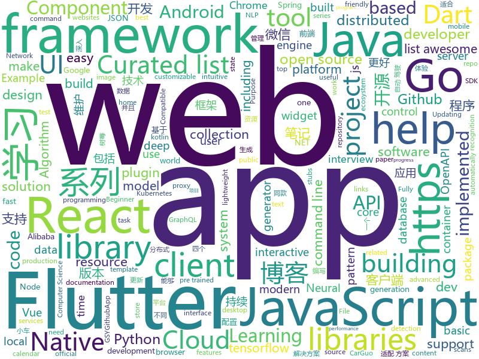

# 2018-11-16
See what the GitHub community is most excited about today.

## python
* [q](https://github.com/harelba/q)(**291 stars today**): q - Run SQL directly on CSV or TSV files
* [torchdiffeq](https://github.com/rtqichen/torchdiffeq)(**197 stars today**): Differentiable ODE solvers with full GPU support and O(1)-memory backpropagation.
* [XSStrike](https://github.com/s0md3v/XSStrike)(**180 stars today**): Most advanced XSS detection suite.
* [chartify](https://github.com/spotify/chartify)(**105 stars today**): Python library that makes it easy for data scientists to create charts.
* [cutie](https://github.com/Kamik423/cutie)(**102 stars today**): Command line User Tools for Input Easification
* [bert](https://github.com/google-research/bert)(**94 stars today**): TensorFlow code and pre-trained models for BERT
* [DeepCreamPy](https://github.com/deeppomf/DeepCreamPy)(**94 stars today**): Decensoring Hentai with Deep Neural Networks
* [models](https://github.com/tensorflow/models)(**66 stars today**): Models and examples built with TensorFlow
* [CodingInterviews](https://github.com/jayshah19949596/CodingInterviews)(**71 stars today**): This repository contains coding interviews that I have encountered in company interviews
* [self_drive](https://github.com/Timthony/self_drive)(**70 stars today**): 基于树莓派的自动驾驶小车，利用树莓派和tensorflow实现小车在赛道的自动驾驶。（Self-driving car based on raspberry pie（tensorflow））
* [Python](https://github.com/TheAlgorithms/Python)(**68 stars today**): All Algorithms implemented in Python
* [einops](https://github.com/arogozhnikov/einops)(**65 stars today**): Deep learning operations rethinked (supports tf, pytorch, chainer, gluon and others)
* [pampy](https://github.com/santinic/pampy)(**63 stars today**): Pampy: The Pattern Matching for Python you always dreamed of.
* [msf-autoshell](https://github.com/DanMcInerney/msf-autoshell)(**57 stars today**): Feed the tool a .nessus file and it will automatically get you MSF shell
* [home-assistant](https://github.com/home-assistant/home-assistant)(**52 stars today**): 🏡Open source home automation that puts local control and privacy first
* [keras](https://github.com/keras-team/keras)(**49 stars today**): Deep Learning for humans
* [system-design-primer](https://github.com/donnemartin/system-design-primer)(**49 stars today**): Learn how to design large-scale systems. Prep for the system design interview. Includes Anki flashcards.
* [uis-rnn](https://github.com/google/uis-rnn)(**48 stars today**): This is the library for the Unbounded Interleaved-State Recurrent Neural Network (UIS-RNN) algorithm, corresponding to the paper Fully Supervised Speaker Diarization.
* [awesome-python](https://github.com/vinta/awesome-python)(**41 stars today**): A curated list of awesome Python frameworks, libraries, software and resources
* [public-apis](https://github.com/toddmotto/public-apis)(**44 stars today**): A collective list of public JSON APIs for use in web development.
* [renrenBackup](https://github.com/whusnoopy/renrenBackup)(**38 stars today**): A backup tool for renren.com
* [BDCI2018-ChinauUicom-1st-solution](https://github.com/PPshrimpGo/BDCI2018-ChinauUicom-1st-solution)(**34 stars today**): 这是BDCI2018的联通赛题第一名解决方案
* [spinningup](https://github.com/openai/spinningup)(**36 stars today**): An educational resource to help anyone learn deep reinforcement learning.
* [localstack](https://github.com/localstack/localstack)(**37 stars today**): 💻A fully functional local AWS cloud stack. Develop and test your cloud apps offline!
* [face_recognition](https://github.com/ageitgey/face_recognition)(**33 stars today**): The world's simplest facial recognition api for Python and the command line

## java
* [corretto-8](https://github.com/corretto/corretto-8)(**358 stars today**): Amazon Corretto is a no-cost, multi-platform, production-ready distribution of OpenJDK
* [AndroidNote](https://github.com/GcsSloop/AndroidNote)(**157 stars today**): 安卓学习笔记
* [JavaGuide](https://github.com/Snailclimb/JavaGuide)(**125 stars today**): 【Java学习+面试指南】 一份涵盖大部分Java程序员所需要掌握的核心知识。
* [proxyee-down](https://github.com/proxyee-down-org/proxyee-down)(**90 stars today**): http下载工具，基于http代理，支持多连接分块下载
* [Taira](https://github.com/Keep-Tech/Taira)(**77 stars today**): 一个 byte 序列化库，助力使用 byte 协议的解析和生成。
* [APIJSON](https://github.com/TommyLemon/APIJSON)(**75 stars today**): 🚀后端接口和文档自动化，前端(客户端) 定制返回JSON的数据和结构！
* [spring-boot](https://github.com/spring-projects/spring-boot)(**53 stars today**): Spring Boot
* [ratel](https://github.com/ainilili/ratel)(**60 stars today**): A fighting landlord program that can be played on the command line
* [symphony](https://github.com/b3log/symphony)(**58 stars today**): 🎶一款用 Java 实现的现代化社区（论坛/BBS/社交网络/博客）平台。https://hacpai.com
* [weixin-java-tools](https://github.com/Wechat-Group/weixin-java-tools)(**40 stars today**): 全能微信Java开发工具包，支持包括微信支付、开放平台、小程序、企业微信/企业号和公众号等的开发
* [Java](https://github.com/TheAlgorithms/Java)(**36 stars today**): All Algorithms implemented in Java
* [tutorials](https://github.com/eugenp/tutorials)(**24 stars today**): The "REST With Spring" Course:
* [pipeline](https://github.com/PipelineAI/pipeline)(**38 stars today**): PipelineAI: Real-Time Enterprise AI Platform
* [arthas](https://github.com/alibaba/arthas)(**33 stars today**): Alibaba Java Diagnostic Tool Arthas/Alibaba Java诊断利器Arthas
* [apollo](https://github.com/ctripcorp/apollo)(**31 stars today**): Apollo（阿波罗）是携程框架部门研发的分布式配置中心，能够集中化管理应用不同环境、不同集群的配置，配置修改后能够实时推送到应用端，并且具备规范的权限、流程治理等特性，适用于微服务配置管理场景。
* [spring-cloud-alibaba](https://github.com/spring-cloud-incubator/spring-cloud-alibaba)(**33 stars today**): Spring Cloud Alibaba provides a one-stop solution for application development for the distributed solutions of Alibaba middleware.
* [solo](https://github.com/b3log/solo)(**34 stars today**): 🎸一款小而美的 Java 博客系统。https://hacpai.com/tag/solo
* [AndroidUtilCode](https://github.com/Blankj/AndroidUtilCode)(**28 stars today**): 🔥Android developers should collect the following utils(updating).
* [java-design-patterns](https://github.com/iluwatar/java-design-patterns)(**29 stars today**): Design patterns implemented in Java
* [spring-framework](https://github.com/spring-projects/spring-framework)(**28 stars today**): Spring Framework
* [xxl-job](https://github.com/xuxueli/xxl-job)(**29 stars today**): A lightweight distributed task scheduling framework.（分布式任务调度平台XXL-JOB）
* [elasticsearch](https://github.com/elastic/elasticsearch)(**25 stars today**): Open Source, Distributed, RESTful Search Engine
* [AndroidAutoSize](https://github.com/JessYanCoding/AndroidAutoSize)(**27 stars today**): 🔥A low-cost Android screen adaptation solution (今日头条屏幕适配方案终极版，一个极低成本的 Android 屏幕适配方案).
* [JCSprout](https://github.com/crossoverJie/JCSprout)(**24 stars today**): 👨‍🎓Java Core Sprout : basic, concurrent, algorithm
* [guava](https://github.com/google/guava)(**23 stars today**): Google core libraries for Java

## unknown
* [YCBlogs](https://github.com/yangchong211/YCBlogs)(**209 stars today**): 技术博客笔记大汇总【15年10月到至今】，包括Java基础及深入知识点，Android技术博客，Python，Go学习笔记等等，还包括平时开发中遇到的bug汇总，当然也在工作之余收集了大量的面试题，长期更新维护并且修正，持续完善……开源的文件是markdown格式的！同时也开源了生活博客，从12年起，积累共计47篇[近20万字]，转载请注明出处，谢谢！
* [awesome](https://github.com/sindresorhus/awesome)(**161 stars today**): 😎Curated list of awesome lists
* [learning-article](https://github.com/webproblem/learning-article)(**91 stars today**): 学习资源 or 大前端导航，持续更新
* [You-Dont-Know-JS](https://github.com/getify/You-Dont-Know-JS)(**84 stars today**): A book series on JavaScript. @YDKJS on twitter.
* [CS-Notes](https://github.com/CyC2018/CS-Notes)(**61 stars today**): 📚Computer Science Learning Notes
* [git-flight-rules](https://github.com/k88hudson/git-flight-rules)(**68 stars today**): Flight rules for git
* [developer-roadmap](https://github.com/kamranahmedse/developer-roadmap)(**62 stars today**): Roadmap to becoming a web developer in 2018
* [free-programming-books](https://github.com/EbookFoundation/free-programming-books)(**65 stars today**): 📚Freely available programming books
* [gitignore](https://github.com/github/gitignore)(**52 stars today**): A collection of useful .gitignore templates
* [linux-kernel-exploitation](https://github.com/xairy/linux-kernel-exploitation)(**54 stars today**): A bunch of links related to Linux kernel exploitation
* [coding-interview-university](https://github.com/jwasham/coding-interview-university)(**37 stars today**): A complete computer science study plan to become a software engineer.
* [Data-Competition-TopSolution](https://github.com/Smilexuhc/Data-Competition-TopSolution)(**37 stars today**): Data competition Top Solution 数据竞赛top解决方案开源整理
* [FCL](https://github.com/chenerlich/FCL)(**35 stars today**): FCL (Fileless Command Lines) - Known command lines of fileless malicious executions
* [awesome-vue](https://github.com/vuejs/awesome-vue)(**35 stars today**): 🎉A curated list of awesome things related to Vue.js
* [first-contributions](https://github.com/firstcontributions/first-contributions)(**18 stars today**): 🚀✨Help beginners to contribute to open source projects
* [eeeeeeeeeeeeeeeeeeeeeeeeeeeeeeeeeeeeeeeeeeeeeeeeeeeeeeeeeeeeeeeeeeeeeeeeeeeeeeeeeeeeeeeeeeeeeeeeeeee](https://github.com/eeeeeeeeeeeeeeeeeeeeeeeeeeeeeeee/eeeeeeeeeeeeeeeeeeeeeeeeeeeeeeeeeeeeeeeeeeeeeeeeeeeeeeeeeeeeeeeeeeeeeeeeeeeeeeeeeeeeeeeeeeeeeeeeeeee)(**34 stars today**): eeeeeeeeeeeeeeeeeeeeeeeeeeeeeeeeeeeeeeeeeeeeeeeeeeeeeeeeeeeeeeeeeeeeeeeeeeeeeeeeeeeeeeeeeeeeeeeeeeeeeeeeeeeeeeeeeeeeeeeeeeeeeeeeeeeeeeeeeeeeeeeeeeeeeeeeeeeeeeeeeeeeeeeeeeeeeeeeeeeeeeeeeeeeeeeeeeeeeeeeeeeeeeeeeeeeeeeeeeeeeeeeeeeeeeeeeeeeeeeeeeeeeeeeeeeeeeeeeeeeeeeeeeeeeeeeeeeeeeeeeeeeeeeeeeeeeeeeeeeeeeeeeeeeeeeeeeeeeeeeeeeeeeeeeeeeeeeeeeeeeeeeeee…
* [awesome-nodejs](https://github.com/sindresorhus/awesome-nodejs)(**31 stars today**): ⚡️Delightful Node.js packages and resources
* [Blog](https://github.com/mqyqingfeng/Blog)(**28 stars today**): 冴羽写博客的地方，预计写四个系列：JavaScript深入系列、JavaScript专题系列、ES6系列、React系列。
* [APISecurityBestPractices](https://github.com/GitGuardian/APISecurityBestPractices)(**28 stars today**): Resources to help you keep secrets (API keys, database credentials, certificates, ...) out of source code.
* [project-based-learning](https://github.com/tuvtran/project-based-learning)(**22 stars today**): Curated list of project-based tutorials
* [SceneTextPapers](https://github.com/Jyouhou/SceneTextPapers)(**20 stars today**): Tracking the latest progress in Scene Text Detection and Recognition: Must-read papers well organized
* [field-ops-guide](https://github.com/futurice/field-ops-guide)(**24 stars today**): A booklet to help you survive a software project
* [awesome-public-datasets](https://github.com/awesomedata/awesome-public-datasets)(**22 stars today**): A topic-centric list of high-quality open datasets in public domains. New PR ☛☛☛
* [kubernetes-the-hard-way](https://github.com/kelseyhightower/kubernetes-the-hard-way)(**21 stars today**): Bootstrap Kubernetes the hard way on Google Cloud Platform. No scripts.
* [A-to-Z-Resources-for-Students](https://github.com/dipakkr/A-to-Z-Resources-for-Students)(**21 stars today**): ☑️Curated list of resources for college students Show your❤️by giving a⭐️

## javascript
* [slate](https://github.com/ianstormtaylor/slate)(**697 stars today**): A completely customizable framework for building rich text editors.
* [tensorspace](https://github.com/tensorspace-team/tensorspace)(**364 stars today**): Neural network 3D visualization framework, build interactive and intuitive model in browsers, support pre-trained deep learning models from TensorFlow, Keras, TensorFlow.js
* [fx](https://github.com/antonmedv/fx)(**268 stars today**): Command-line JSON viewer🔥
* [ProjectVisBug](https://github.com/GoogleChromeLabs/ProjectVisBug)(**249 stars today**): 🎨Make any webpage feel like an artboard, download extension here https://chrome.google.com/webstore/detail/cdockenadnadldjbbgcallicgledbeoc
* [unified](https://github.com/unifiedjs/unified)(**213 stars today**): ☔ friendly interface backed by an ecosystem of plugins built for creating and manipulating content
* [react-beautiful-dnd](https://github.com/atlassian/react-beautiful-dnd)(**158 stars today**): Beautiful and accessible drag and drop for lists with React
* [virtual-scroller](https://github.com/valdrinkoshi/virtual-scroller)(**132 stars today**): 
* [vue](https://github.com/vuejs/vue)(**117 stars today**): 🖖A progressive, incrementally-adoptable JavaScript framework for building UI on the web.
* [33-js-concepts](https://github.com/leonardomso/33-js-concepts)(**124 stars today**): 📜33 concepts every JavaScript developer should know.
* [react](https://github.com/facebook/react)(**104 stars today**): A declarative, efficient, and flexible JavaScript library for building user interfaces.
* [33-js-concepts](https://github.com/stephentian/33-js-concepts)(**95 stars today**): 📜每个 JavaScript 工程师都应懂的33个概念 @leonardomso
* [enquirer](https://github.com/enquirer/enquirer)(**101 stars today**): Stylish, intuitive and user-friendly prompt system.
* [vue-lazy-image-loading](https://github.com/subotkevic/vue-lazy-image-loading)(**102 stars today**): Vue lazy image and background loading plugin.
* [carlo](https://github.com/GoogleChromeLabs/carlo)(**97 stars today**): Web rendering surface for Node applications
* [30-seconds-of-code](https://github.com/30-seconds/30-seconds-of-code)(**91 stars today**): Curated collection of useful JavaScript snippets that you can understand in 30 seconds or less.
* [javascript-algorithms](https://github.com/trekhleb/javascript-algorithms)(**84 stars today**): 📝Algorithms and data structures implemented in JavaScript with explanations and links to further readings
* [taro](https://github.com/NervJS/taro)(**78 stars today**): 多端统一开发框架，支持用 React 的开发方式编写一次代码，生成能运行在微信小程序/百度智能小程序/支付宝小程序、H5、React Native 等的应用。
* [axios](https://github.com/axios/axios)(**67 stars today**): Promise based HTTP client for the browser and node.js
* [create-react-app](https://github.com/facebook/create-react-app)(**54 stars today**): Set up a modern web app by running one command.
* [rawact](https://github.com/sokra/rawact)(**67 stars today**): [POC] A babel plugin which compiles React.js components into native DOM instructions to eliminate the need for the react library at runtime.
* [Glider.js](https://github.com/NickPiscitelli/Glider.js)(**64 stars today**): A blazingly fast, lightweight, dependency free, minimal carousel with momentum scrolling!
* [storybook](https://github.com/storybooks/storybook)(**60 stars today**): Interactive UI component dev & test: React, React Native, Vue, Angular, Ember
* [omi](https://github.com/Tencent/omi)(**60 stars today**): Next generation web framework in 4kb JavaScript (Web Components + JSX + Proxy + Store + Path Updating)
* [openmct](https://github.com/nasa/openmct)(**59 stars today**): A web based mission control framework.
* [model-viewer](https://github.com/GoogleWebComponents/model-viewer)(**55 stars today**): Easily display interactive 3D models on the web and in AR!

## html
* [nginxconfig.io](https://github.com/valentinxxx/nginxconfig.io)(**191 stars today**): ⚙️NGiИX config generator generator on steroids💉
* [NLP-progress](https://github.com/sebastianruder/NLP-progress)(**98 stars today**): Repository to track the progress in Natural Language Processing (NLP), including the datasets and the current state-of-the-art for the most common NLP tasks.
* [colorpalette](https://github.com/makkoncept/colorpalette)(**48 stars today**): Flask app : extracts palette of dominating colors from image. https://colorpalettedemo.herokuapp.com/
* [BabySploit](https://github.com/M4cs/BabySploit)(**19 stars today**): BabySploit Beginner Pentesting Framework Written in Python
* [hello](https://github.com/vasanthv/hello)(**18 stars today**): Hello - Video chat that works in most major desktop & mobile browsers.
* [swagger-codegen](https://github.com/swagger-api/swagger-codegen)(**13 stars today**): swagger-codegen contains a template-driven engine to generate documentation, API clients and server stubs in different languages by parsing your OpenAPI / Swagger definition.
* [archerysec](https://github.com/archerysec/archerysec)(**15 stars today**): Open Source Vulnerability Assessment and Management helps developers and pentesters to perform scans and manage vulnerabilities.
* [Spoon-Knife](https://github.com/octocat/Spoon-Knife)(****): This repo is for demonstration purposes only.
* [deeplearning_ai_books](https://github.com/fengdu78/deeplearning_ai_books)(**9 stars today**): deeplearning.ai（吴恩达老师的深度学习课程笔记及资源）
* [openapi-generator](https://github.com/OpenAPITools/openapi-generator)(**12 stars today**): OpenAPI Generator allows generation of API client libraries (SDK generation), server stubs, documentation and configuration automatically given an OpenAPI Spec (v2, v3)
* [react-redux](https://github.com/reduxjs/react-redux)(**10 stars today**): Official React bindings for Redux
* [primeng](https://github.com/primefaces/primeng)(**9 stars today**): UI Components for Angular
* [qiubaiying.github.io](https://github.com/qiubaiying/qiubaiying.github.io)(**5 stars today**): BY Blog ->
* [keynote](https://github.com/ElemeFE/keynote)(**9 stars today**): 大前端分享会公开演示文稿
* [solid](https://github.com/solid/solid)(**9 stars today**): Solid - Re-decentralizing the web (project directory)
* [blockchain](https://github.com/Azure-Samples/blockchain)(**8 stars today**): Azure Blockchain Content and Samples
* [portainer](https://github.com/portainer/portainer)(**9 stars today**): Simple management UI for Docker
* [polymer](https://github.com/Polymer/polymer)(**8 stars today**): Our original Web Component library.
* [foundation-sites](https://github.com/zurb/foundation-sites)(**7 stars today**): The most advanced responsive front-end framework in the world. Quickly create prototypes and production code for sites that work on any kind of device.
* [smart-contract-best-practices](https://github.com/ConsenSys/smart-contract-best-practices)(**7 stars today**): A guide to smart contract security best practices
* [javascript-tutorial-en](https://github.com/iliakan/javascript-tutorial-en)(**6 stars today**): Modern JavaScript Tutorial
* [Adminator-admin-dashboard](https://github.com/puikinsh/Adminator-admin-dashboard)(**5 stars today**): Adminator is a easy to use and well design admin dashboard template for web apps, websites, services and more
* [patchwork](https://github.com/jlord/patchwork)(****): All the Git-it Workshop completers!
* [dotnet](https://github.com/Microsoft/dotnet)(**6 stars today**): This repo is the official home of .NET on GitHub. It's a great starting point to find many .NET OSS projects from Microsoft and the community, including many that are part of the .NET Foundation.
* [TranslatorX](https://github.com/pingfangx/TranslatorX)(**6 stars today**): JetBrains 系列软件汉化包

## dart
* [flutter](https://github.com/flutter/flutter)(**65 stars today**): Flutter makes it easy and fast to build beautiful mobile apps.
* [awesome-flutter](https://github.com/Solido/awesome-flutter)(**31 stars today**): An awesome list that curates the best Flutter libraries, tools, tutorials, articles and more.
* [GSYGithubAppFlutter](https://github.com/CarGuo/GSYGithubAppFlutter)(**12 stars today**): 超完整的Flutter项目，功能丰富，适合学习和日常使用。GSYGithubApp系列的优势：我们目前已经拥有Flutter、Weex、ReactNative、kotlin 四个版本。 功能齐全，项目框架内技术涉及面广，完成度高，持续维护，配套文章，适合全面学习，对比参考。跨平台的开源Github客户端App，更好的体验，更丰富的功能，旨在更好的日常管理和维护个人Github，提供更好更方便的驾车体验Σ(￣。￣ﾉ)ﾉ。同款Weex版本 ： https://github.com/CarGuo/GSYGithubAppWeex 、同款React Native版本 ： https://github.com/CarGuo/GSYGithubApp 、原生 kotlin 版本 https://g…
* [plugins](https://github.com/flutter/plugins)(**12 stars today**): Plugins for Flutter, including FlutterFire, maintained by the Flutter team
* [flutter-examples](https://github.com/nisrulz/flutter-examples)(**9 stars today**): [Examples] Simple basic isolated apps, for budding flutter devs.
* [Flutter-Notebook](https://github.com/OpenFlutter/Flutter-Notebook)(**6 stars today**): 日更的FlutterDemo合集，今天你fu了吗
* [flutter_architecture_samples](https://github.com/brianegan/flutter_architecture_samples)(**5 stars today**): TodoMVC for Flutter
* [dio](https://github.com/flutterchina/dio)(**5 stars today**): A powerful Http client for Dart, which supports Interceptors, FormData, Request Cancellation, File Downloading, Timeout etc.
* [built_collection.dart](https://github.com/google/built_collection.dart)(****): Immutable Dart collections via the builder pattern.
* [over_react](https://github.com/Workiva/over_react)(****): A library for building statically-typed React UI components using Dart.
* [flutter_calendar_carousel](https://github.com/dooboolab/flutter_calendar_carousel)(****): Calendar widget for flutter that is swipeable horizontally. This widget can help you build your own calendar widget highly customizable.
* [graphql-flutter](https://github.com/zino-app/graphql-flutter)(****): A GraphQL client for Flutter, bringing all the features from a modern GraphQL client to one easy to use package.
* [Grey](https://github.com/avirias/Grey)(****): A Material designed music player developed in Flutter
* [spaceblast](https://github.com/spritewidget/spaceblast)(****): Demo game for SpriteWidget
* [flutter_offline](https://github.com/jogboms/flutter_offline)(****): ✈️A tidy utility to handle offline/online connectivity like a Boss
* [flutter_flip_panel](https://github.com/hnvn/flutter_flip_panel)(****): A package for flip panel with built-in animation
* [flutter_picker](https://github.com/yangyxd/flutter_picker)(****): Flutter picker plugin
* [github.dart](https://github.com/DirectMyFile/github.dart)(****): GitHub Client Library for Dart
* [website](https://github.com/flutter/website)(****): Flutter web site
* [chromedeveditor](https://github.com/googlearchive/chromedeveditor)(****): Chrome Dev Editor is a developer tool for building apps on the Chrome platform - Chrome Apps and Web Apps, in JavaScript or Dart. (NO LONGER IN ACTIVE DEVELOPMENT)
* [sdk](https://github.com/dart-lang/sdk)(****): The Dart SDK, including the VM, dart2js, core libraries, and more.
* [FlutterExampleApps](https://github.com/iampawan/FlutterExampleApps)(****): [Example APPS] Basic Flutter apps, for flutter devs.
* [Flutter-UI-Kit](https://github.com/iampawan/Flutter-UI-Kit)(****): Flutter app for collection of UI in a UIKit
* [flutter-osc](https://github.com/yubo725/flutter-osc)(****): 基于Google Flutter的开源中国客户端，支持Android和iOS。
* [inKino](https://github.com/roughike/inKino)(****): A multiplatform Dart movie app with 40% of code sharing between Flutter and the Web.

## go
* [golua](https://github.com/Azure/golua)(**335 stars today**): A Lua 5.3 engine implemented in Go
* [webtty](https://github.com/maxmcd/webtty)(**217 stars today**): Share a terminal session over WebRTC
* [lorca](https://github.com/zserge/lorca)(**165 stars today**): Build cross-platform modern desktop apps in Go + HTML5
* [titan](https://github.com/meitu/titan)(**95 stars today**): A Distributed Redis Protocol Compatible NoSQL Database
* [go](https://github.com/golang/go)(**58 stars today**): The Go programming language
* [kubernetes](https://github.com/kubernetes/kubernetes)(**53 stars today**): Production-Grade Container Scheduling and Management
* [soar](https://github.com/XiaoMi/soar)(**52 stars today**): SQL Optimizer And Rewriter
* [tidb](https://github.com/pingcap/tidb)(**47 stars today**): TiDB is a distributed HTAP database compatible with the MySQL protocol
* [awesome-go](https://github.com/avelino/awesome-go)(**40 stars today**): A curated list of awesome Go frameworks, libraries and software
* [BaiduPCS-Go](https://github.com/iikira/BaiduPCS-Go)(**43 stars today**): 百度网盘客户端 - Go语言编写
* [prometheus](https://github.com/prometheus/prometheus)(**39 stars today**): The Prometheus monitoring system and time series database.
* [harbor](https://github.com/goharbor/harbor)(**41 stars today**): An open source trusted cloud native registry project that stores, signs, and scans content.
* [frameworkcontroller](https://github.com/Microsoft/frameworkcontroller)(**36 stars today**): General-Purpose Kubernetes Pod Controller
* [frp](https://github.com/fatedier/frp)(**36 stars today**): A fast reverse proxy to help you expose a local server behind a NAT or firewall to the internet.
* [istio](https://github.com/istio/istio)(**33 stars today**): Connect, secure, control, and observe services.
* [pipelines](https://github.com/kubeflow/pipelines)(**32 stars today**): Machine Learning Pipelines for Kubeflow
* [gin](https://github.com/gin-gonic/gin)(**32 stars today**): Gin is a HTTP web framework written in Go (Golang). It features a Martini-like API with much better performance -- up to 40 times faster. If you need smashing performance, get yourself some Gin.
* [go-consistent](https://github.com/Quasilyte/go-consistent)(**34 stars today**): Source code analyzer that helps you to make your Go programs more consistent.
* [quic-go](https://github.com/lucas-clemente/quic-go)(**33 stars today**): A QUIC implementation in pure go
* [build-web-application-with-golang](https://github.com/astaxie/build-web-application-with-golang)(**29 stars today**): A golang ebook intro how to build a web with golang
* [moby](https://github.com/moby/moby)(**26 stars today**): Moby Project - a collaborative project for the container ecosystem to assemble container-based systems
* [athens](https://github.com/gomods/athens)(**28 stars today**): A Go module datastore and proxy
* [soup](https://github.com/anaskhan96/soup)(**28 stars today**): Web Scraper in Go, similar to BeautifulSoup
* [traefik](https://github.com/containous/traefik)(**27 stars today**): The Cloud Native Edge Router
* [hugo](https://github.com/gohugoio/hugo)(**26 stars today**): The world’s fastest framework for building websites.

## WordCloud

