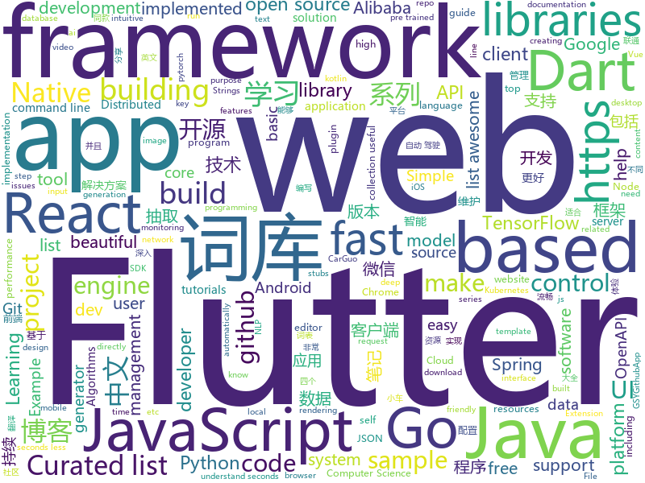

# 2018-11-17
See what the GitHub community is most excited about today.

## python
* [big-list-of-naughty-strings](https://github.com/minimaxir/big-list-of-naughty-strings)(**2,593 stars today**): The Big List of Naughty Strings is a list of strings which have a high probability of causing issues when used as user-input data.
* [chartify](https://github.com/spotify/chartify)(**364 stars today**): Python library that makes it easy for data scientists to create charts.
* [funNLP](https://github.com/fighting41love/funNLP)(**259 stars today**): 中英文敏感词、语言检测、中外手机/电话归属地/运营商查询、名字推断性别、手机号抽取、身份证抽取、邮箱抽取、中日文人名库、中文缩写库、拆字词典、词汇情感值、停用词、反动词表、暴恐词表、繁简体转换、英文模拟中文发音、汪峰歌词生成器、职业名称词库、同义词库、反义词库、否定词库、汽车品牌&零件词库、时间抽取、连续英文切割、中文词向量大全、公司名字大全、古诗词库、IT词库、财经词库、成语词库、地名词库、历史名人词库、诗词词库、医学词库、饮食词库、法律词库、汽车词库、动物词库、中文聊天语料、中文谣言数据。
* [q](https://github.com/harelba/q)(**263 stars today**): q - Run SQL directly on CSV or TSV files
* [XSStrike](https://github.com/s0md3v/XSStrike)(**133 stars today**): Most advanced XSS detection suite.
* [torchdiffeq](https://github.com/rtqichen/torchdiffeq)(**130 stars today**): Differentiable ODE solvers with full GPU support and O(1)-memory backpropagation.
* [bert](https://github.com/google-research/bert)(**89 stars today**): TensorFlow code and pre-trained models for BERT
* [Python](https://github.com/TheAlgorithms/Python)(**56 stars today**): All Algorithms implemented in Python
* [models](https://github.com/tensorflow/models)(**44 stars today**): Models and examples built with TensorFlow
* [pampy](https://github.com/santinic/pampy)(**63 stars today**): Pampy: The Pattern Matching for Python you always dreamed of.
* [self_drive](https://github.com/Timthony/self_drive)(**59 stars today**): 基于树莓派的自动驾驶小车，利用树莓派和tensorflow实现小车在赛道的自动驾驶。（Self-driving car based on raspberry pie（tensorflow））
* [public-apis](https://github.com/toddmotto/public-apis)(**57 stars today**): A collective list of public JSON APIs for use in web development.
* [home-assistant](https://github.com/home-assistant/home-assistant)(**52 stars today**): 🏡Open source home automation that puts local control and privacy first
* [einops](https://github.com/arogozhnikov/einops)(**58 stars today**): Deep learning operations rethinked (supports tf, pytorch, chainer, gluon and others)
* [2018-CCF-BDCI-China-Unicom-Research-Institute-top2](https://github.com/PandasCute/2018-CCF-BDCI-China-Unicom-Research-Institute-top2)(**46 stars today**): 2018-CCF大数据与计算智能大赛-面向电信行业存量用户的智能套餐个性化匹配模型联通赛-复赛第二名解决方案
* [awesome-python](https://github.com/vinta/awesome-python)(**46 stars today**): A curated list of awesome Python frameworks, libraries, software and resources
* [system-design-primer](https://github.com/donnemartin/system-design-primer)(**44 stars today**): Learn how to design large-scale systems. Prep for the system design interview. Includes Anki flashcards.
* [DeepCreamPy](https://github.com/deeppomf/DeepCreamPy)(**44 stars today**): Decensoring Hentai with Deep Neural Networks
* [youtube-dl](https://github.com/rg3/youtube-dl)(**39 stars today**): Command-line program to download videos from YouTube.com and other video sites
* [keras](https://github.com/keras-team/keras)(**34 stars today**): Deep Learning for humans
* [cutie](https://github.com/Kamik423/cutie)(**42 stars today**): Command line User Tools for Input Easification
* [Osmedeus](https://github.com/j3ssie/Osmedeus)(**38 stars today**): Automatic Reconnaisance and Scanning in Penetration Testing
* [BDCI2018-ChinauUicom-1st-solution](https://github.com/PPshrimpGo/BDCI2018-ChinauUicom-1st-solution)(**36 stars today**): 这是BDCI2018的联通赛题第一名解决方案
* [flask](https://github.com/pallets/flask)(**34 stars today**): The Python micro framework for building web applications.
* [django](https://github.com/django/django)(**30 stars today**): The Web framework for perfectionists with deadlines.

## java
* [corretto-8](https://github.com/corretto/corretto-8)(**189 stars today**): Amazon Corretto is a no-cost, multi-platform, production-ready distribution of OpenJDK
* [delverengine](https://github.com/Interrupt/delverengine)(**159 stars today**): Delver game engine and editor
* [JavaGuide](https://github.com/Snailclimb/JavaGuide)(**115 stars today**): 【Java学习+面试指南】 一份涵盖大部分Java程序员所需要掌握的核心知识。
* [AndroidNote](https://github.com/GcsSloop/AndroidNote)(**87 stars today**): 安卓学习笔记
* [proxyee-down](https://github.com/proxyee-down-org/proxyee-down)(**64 stars today**): http下载工具，基于http代理，支持多连接分块下载
* [tutorials](https://github.com/eugenp/tutorials)(**33 stars today**): The "REST With Spring" Course:
* [spring-boot](https://github.com/spring-projects/spring-boot)(**44 stars today**): Spring Boot
* [ratel](https://github.com/ainilili/ratel)(**45 stars today**): A fighting landlord program that can be played on the command line
* [symphony](https://github.com/b3log/symphony)(**41 stars today**): 🎶一款用 Java 实现的现代化社区（论坛/BBS/社交网络/博客）平台。https://hacpai.com
* [interviews](https://github.com/kdn251/interviews)(**40 stars today**): Everything you need to know to get the job.
* [JCSprout](https://github.com/crossoverJie/JCSprout)(**40 stars today**): 👨‍🎓Java Core Sprout : basic, concurrent, algorithm
* [Java](https://github.com/TheAlgorithms/Java)(**32 stars today**): All Algorithms implemented in Java
* [apollo](https://github.com/ctripcorp/apollo)(**33 stars today**): Apollo（阿波罗）是携程框架部门研发的分布式配置中心，能够集中化管理应用不同环境、不同集群的配置，配置修改后能够实时推送到应用端，并且具备规范的权限、流程治理等特性，适用于微服务配置管理场景。
* [spring-framework](https://github.com/spring-projects/spring-framework)(**29 stars today**): Spring Framework
* [elasticsearch](https://github.com/elastic/elasticsearch)(**32 stars today**): Open Source, Distributed, RESTful Search Engine
* [APIJSON](https://github.com/TommyLemon/APIJSON)(**35 stars today**): 🚀后端接口和文档自动化，前端(客户端) 定制返回JSON的数据和结构！
* [AndroidUtilCode](https://github.com/Blankj/AndroidUtilCode)(**31 stars today**): 🔥Android developers should collect the following utils(updating).
* [guava](https://github.com/google/guava)(**31 stars today**): Google core libraries for Java
* [weixin-java-tools](https://github.com/Wechat-Group/weixin-java-tools)(**28 stars today**): 全能微信Java开发工具包，支持包括微信支付、开放平台、小程序、企业微信/企业号和公众号等的开发
* [arthas](https://github.com/alibaba/arthas)(**30 stars today**): Alibaba Java Diagnostic Tool Arthas/Alibaba Java诊断利器Arthas
* [incubator-dubbo](https://github.com/apache/incubator-dubbo)(**23 stars today**): Apache Dubbo (incubating) is a high-performance, java based, open source RPC framework.
* [Sentinel](https://github.com/alibaba/Sentinel)(**26 stars today**): A lightweight flow-control library providing high-available protection and monitoring (高可用防护的流量管理框架)
* [spring-cloud-alibaba](https://github.com/spring-cloud-incubator/spring-cloud-alibaba)(**26 stars today**): Spring Cloud Alibaba provides a one-stop solution for application development for the distributed solutions of Alibaba middleware.
* [solo](https://github.com/b3log/solo)(**26 stars today**): 🎸一款小而美的 Java 博客系统。https://hacpai.com/tag/solo
* [runelite](https://github.com/runelite/runelite)(**13 stars today**): Open source Old School RuneScape client

## unknown
* [CS-Notes](https://github.com/CyC2018/CS-Notes)(**106 stars today**): 📚Computer Science Learning Notes
* [awesome](https://github.com/sindresorhus/awesome)(**109 stars today**): 😎Curated list of awesome lists
* [YCBlogs](https://github.com/yangchong211/YCBlogs)(**105 stars today**): 技术博客笔记大汇总【15年10月到至今】，包括Java基础及深入知识点，Android技术博客，Python，Go学习笔记等等，还包括平时开发中遇到的bug汇总，当然也在工作之余收集了大量的面试题，长期更新维护并且修正，持续完善……开源的文件是markdown格式的！同时也开源了生活博客，从12年起，积累共计47篇[近20万字]，转载请注明出处，谢谢！
* [git-flight-rules](https://github.com/k88hudson/git-flight-rules)(**91 stars today**): Flight rules for git
* [git-recipes](https://github.com/geeeeeeeeek/git-recipes)(**84 stars today**): 🥡 Git recipes in Chinese by Zhongyi Tong. 高质量的Git中文教程.
* [gitignore](https://github.com/github/gitignore)(**49 stars today**): A collection of useful .gitignore templates
* [Data-Competition-TopSolution](https://github.com/Smilexuhc/Data-Competition-TopSolution)(**60 stars today**): Data competition Top Solution 数据竞赛top解决方案开源整理
* [Awesome-pytorch-list](https://github.com/bharathgs/Awesome-pytorch-list)(**54 stars today**): A comprehensive list of pytorch related content on github,such as different models,implementations,helper libraries,tutorials etc.
* [You-Dont-Know-JS](https://github.com/getify/You-Dont-Know-JS)(**51 stars today**): A book series on JavaScript. @YDKJS on twitter.
* [APISecurityBestPractices](https://github.com/GitGuardian/APISecurityBestPractices)(**50 stars today**): Resources to help you keep secrets (API keys, database credentials, certificates, ...) out of source code.
* [awesome-vue](https://github.com/vuejs/awesome-vue)(**43 stars today**): 🎉A curated list of awesome things related to Vue.js
* [trackerslist](https://github.com/ngosang/trackerslist)(**43 stars today**): An updated list of public BitTorrent trackers
* [free-programming-books](https://github.com/EbookFoundation/free-programming-books)(**39 stars today**): 📚Freely available programming books
* [developer-roadmap](https://github.com/kamranahmedse/developer-roadmap)(**42 stars today**): Roadmap to becoming a web developer in 2018
* [eeeeeeeeeeeeeeeeeeeeeeeeeeeeeeeeeeeeeeeeeeeeeeeeeeeeeeeeeeeeeeeeeeeeeeeeeeeeeeeeeeeeeeeeeeeeeeeeeeee](https://github.com/eeeeeeeeeeeeeeeeeeeeeeeeeeeeeeee/eeeeeeeeeeeeeeeeeeeeeeeeeeeeeeeeeeeeeeeeeeeeeeeeeeeeeeeeeeeeeeeeeeeeeeeeeeeeeeeeeeeeeeeeeeeeeeeeeeee)(**35 stars today**): eeeeeeeeeeeeeeeeeeeeeeeeeeeeeeeeeeeeeeeeeeeeeeeeeeeeeeeeeeeeeeeeeeeeeeeeeeeeeeeeeeeeeeeeeeeeeeeeeeeeeeeeeeeeeeeeeeeeeeeeeeeeeeeeeeeeeeeeeeeeeeeeeeeeeeeeeeeeeeeeeeeeeeeeeeeeeeeeeeeeeeeeeeeeeeeeeeeeeeeeeeeeeeeeeeeeeeeeeeeeeeeeeeeeeeeeeeeeeeeeeeeeeeeeeeeeeeeeeeeeeeeeeeeeeeeeeeeeeeeeeeeeeeeeeeeeeeeeeeeeeeeeeeeeeeeeeeeeeeeeeeeeeeeeeeeeeeeeeeeeeeeeeee…
* [weekly](https://github.com/ruanyf/weekly)(**36 stars today**): 技术分享周刊，每周五发布
* [gold-miner](https://github.com/xitu/gold-miner)(**32 stars today**): 🥇掘金翻译计划，可能是世界最大最好的英译中技术社区，最懂读者和译者的翻译平台：
* [coding-interview-university](https://github.com/jwasham/coding-interview-university)(**29 stars today**): A complete computer science study plan to become a software engineer.
* [awesome-nodejs](https://github.com/sindresorhus/awesome-nodejs)(**29 stars today**): ⚡️Delightful Node.js packages and resources
* [learning-article](https://github.com/webproblem/learning-article)(**27 stars today**): 学习资源 or 大前端导航，持续更新
* [project-based-learning](https://github.com/tuvtran/project-based-learning)(**27 stars today**): Curated list of project-based tutorials
* [Blog](https://github.com/mqyqingfeng/Blog)(**30 stars today**): 冴羽写博客的地方，预计写四个系列：JavaScript深入系列、JavaScript专题系列、ES6系列、React系列。
* [computer-science](https://github.com/ossu/computer-science)(**27 stars today**): 🎓Path to a free self-taught education in Computer Science!
* [A-to-Z-Resources-for-Students](https://github.com/dipakkr/A-to-Z-Resources-for-Students)(**24 stars today**): ☑️Curated list of resources for college students Show your❤️by giving a⭐️
* [FCL](https://github.com/chenerlich/FCL)(**25 stars today**): FCL (Fileless Command Lines) - Known command lines of fileless malicious executions

## javascript
* [slate](https://github.com/ianstormtaylor/slate)(**576 stars today**): A completely customizable framework for building rich text editors.
* [tensorspace](https://github.com/tensorspace-team/tensorspace)(**202 stars today**): Neural network 3D visualization framework, build interactive and intuitive model in browsers, support pre-trained deep learning models from TensorFlow, Keras, TensorFlow.js
* [fx](https://github.com/antonmedv/fx)(**177 stars today**): Terminal JSON viewer🔥
* [vue](https://github.com/vuejs/vue)(**141 stars today**): 🖖A progressive, incrementally-adoptable JavaScript framework for building UI on the web.
* [react-beautiful-dnd](https://github.com/atlassian/react-beautiful-dnd)(**139 stars today**): Beautiful and accessible drag and drop for lists with React
* [unified](https://github.com/unifiedjs/unified)(**128 stars today**): ☔ friendly interface backed by an ecosystem of plugins built for creating and manipulating content
* [react](https://github.com/facebook/react)(**106 stars today**): A declarative, efficient, and flexible JavaScript library for building user interfaces.
* [ProjectVisBug](https://github.com/GoogleChromeLabs/ProjectVisBug)(**103 stars today**): 🎨Make any webpage feel like an artboard, download extension here https://chrome.google.com/webstore/detail/cdockenadnadldjbbgcallicgledbeoc
* [33-js-concepts](https://github.com/leonardomso/33-js-concepts)(**98 stars today**): 📜33 concepts every JavaScript developer should know.
* [statusfy](https://github.com/bazzite/statusfy)(**91 stars today**): A marvelous Open Source Status Page system
* [vue-lazy-image-loading](https://github.com/subotkevic/vue-lazy-image-loading)(**90 stars today**): Vue lazy image and background loading plugin.
* [33-js-concepts](https://github.com/stephentian/33-js-concepts)(**82 stars today**): 📜每个 JavaScript 工程师都应懂的33个概念 @leonardomso
* [30-seconds-of-code](https://github.com/30-seconds/30-seconds-of-code)(**74 stars today**): Curated collection of useful JavaScript snippets that you can understand in 30 seconds or less.
* [carlo](https://github.com/GoogleChromeLabs/carlo)(**76 stars today**): Web rendering surface for Node applications
* [taro](https://github.com/NervJS/taro)(**69 stars today**): 多端统一开发框架，支持用 React 的开发方式编写一次代码，生成能运行在微信小程序/百度智能小程序/支付宝小程序、H5、React Native 等的应用。
* [wink](https://github.com/writingink/wink)(**72 stars today**): A Laravel-based publishing platform
* [Glider.js](https://github.com/NickPiscitelli/Glider.js)(**73 stars today**): A blazingly fast, lightweight, dependency free, minimal carousel with momentum scrolling!
* [enquirer](https://github.com/enquirer/enquirer)(**72 stars today**): Stylish, intuitive and user-friendly prompt system.
* [modern-react](https://github.com/kentcdodds/modern-react)(**73 stars today**): workshop about React's hottest new features in 16.7.0
* [virtual-scroller](https://github.com/valdrinkoshi/virtual-scroller)(**71 stars today**): 
* [axios](https://github.com/axios/axios)(**66 stars today**): Promise based HTTP client for the browser and node.js
* [storybook](https://github.com/storybooks/storybook)(**64 stars today**): Interactive UI component dev & test: React, React Native, Vue, Angular, Ember
* [openmct](https://github.com/nasa/openmct)(**61 stars today**): A web based mission control framework.
* [javascript-algorithms](https://github.com/trekhleb/javascript-algorithms)(**59 stars today**): 📝Algorithms and data structures implemented in JavaScript with explanations and links to further readings
* [javascript](https://github.com/airbnb/javascript)(**53 stars today**): JavaScript Style Guide

## html
* [nginxconfig.io](https://github.com/valentinxxx/nginxconfig.io)(**466 stars today**): ⚙️NGiИX config generator generator on steroids💉
* [colorpalette](https://github.com/makkoncept/colorpalette)(**68 stars today**): Flask app : extracts palette of dominating colors from image. https://colorpalettedemo.herokuapp.com/
* [NLP-progress](https://github.com/sebastianruder/NLP-progress)(**47 stars today**): Repository to track the progress in Natural Language Processing (NLP), including the datasets and the current state-of-the-art for the most common NLP tasks.
* [styleguide](https://github.com/google/styleguide)(**28 stars today**): Style guides for Google-originated open-source projects
* [blockchain](https://github.com/Azure-Samples/blockchain)(**22 stars today**): Azure Blockchain Content and Samples
* [AdminLTE](https://github.com/almasaeed2010/AdminLTE)(**15 stars today**): AdminLTE - Free Premium Admin control Panel Theme Based On Bootstrap 3.x
* [fastText](https://github.com/facebookresearch/fastText)(**17 stars today**): Library for fast text representation and classification.
* [Spoon-Knife](https://github.com/octocat/Spoon-Knife)(****): This repo is for demonstration purposes only.
* [portainer](https://github.com/portainer/portainer)(**13 stars today**): Simple management UI for Docker
* [react-redux](https://github.com/reduxjs/react-redux)(**13 stars today**): Official React bindings for Redux
* [JavaScript30](https://github.com/wesbos/JavaScript30)(**6 stars today**): 30 Day Vanilla JS Challenge
* [qiubaiying.github.io](https://github.com/qiubaiying/qiubaiying.github.io)(**5 stars today**): BY Blog ->
* [deeplearning_ai_books](https://github.com/fengdu78/deeplearning_ai_books)(**8 stars today**): deeplearning.ai（吴恩达老师的深度学习课程笔记及资源）
* [beautiful-jekyll](https://github.com/daattali/beautiful-jekyll)(**6 stars today**): ✨Build a beautiful and simple website in literally minutes. Demo at http://deanattali.com/beautiful-jekyll
* [now-github-starter](https://github.com/zeit/now-github-starter)(****): Starter project to demonstrate a project whose pull requests get automatically deployed
* [swagger-codegen](https://github.com/swagger-api/swagger-codegen)(**8 stars today**): swagger-codegen contains a template-driven engine to generate documentation, API clients and server stubs in different languages by parsing your OpenAPI / Swagger definition.
* [devsonket.github.io](https://github.com/devsonket/devsonket.github.io)(**7 stars today**): 🎨🛠📌সম্পূর্ণ বাংলায় ডেভেলপার চিটশিট🎨🛠📌
* [openapi-generator](https://github.com/OpenAPITools/openapi-generator)(**8 stars today**): OpenAPI Generator allows generation of API client libraries (SDK generation), server stubs, documentation and configuration automatically given an OpenAPI Spec (v2, v3)
* [parcel-by-sample](https://github.com/Lemoncode/parcel-by-sample)(**8 stars today**): Learn parcel by sample, each of the samples contains a readme.md file that indicates the purpose of the sample plus an step by step guide to reproduce it.
* [ai-deadlines](https://github.com/abhshkdz/ai-deadlines)(**8 stars today**): ⏰AI conference deadline countdowns
* [30-seconds-of-css](https://github.com/30-seconds/30-seconds-of-css)(**8 stars today**): A curated collection of useful CSS snippets you can understand in 30 seconds or less.
* [polymer](https://github.com/Polymer/polymer)(**7 stars today**): Our original Web Component library.
* [Publii](https://github.com/GetPublii/Publii)(**7 stars today**): Publii is a desktop-based CMS for Windows, Mac and Linux that makes creating static websites fast and hassle-free, even for beginners.
* [archerysec](https://github.com/archerysec/archerysec)(**7 stars today**): Open Source Vulnerability Assessment and Management helps developers and pentesters to perform scans and manage vulnerabilities.
* [keynote](https://github.com/ElemeFE/keynote)(**7 stars today**): 大前端分享会公开演示文稿

## dart
* [flutter](https://github.com/flutter/flutter)(**74 stars today**): Flutter makes it easy and fast to build beautiful mobile apps.
* [awesome-flutter](https://github.com/Solido/awesome-flutter)(**29 stars today**): An awesome list that curates the best Flutter libraries, tools, tutorials, articles and more.
* [plugins](https://github.com/flutter/plugins)(**13 stars today**): Plugins for Flutter, including FlutterFire, maintained by the Flutter team
* [GSYGithubAppFlutter](https://github.com/CarGuo/GSYGithubAppFlutter)(**12 stars today**): 超完整的Flutter项目，功能丰富，适合学习和日常使用。GSYGithubApp系列的优势：我们目前已经拥有Flutter、Weex、ReactNative、kotlin 四个版本。 功能齐全，项目框架内技术涉及面广，完成度高，持续维护，配套文章，适合全面学习，对比参考。跨平台的开源Github客户端App，更好的体验，更丰富的功能，旨在更好的日常管理和维护个人Github，提供更好更方便的驾车体验Σ(￣。￣ﾉ)ﾉ。同款Weex版本 ： https://github.com/CarGuo/GSYGithubAppWeex 、同款React Native版本 ： https://github.com/CarGuo/GSYGithubApp 、原生 kotlin 版本 https://g…
* [inKino](https://github.com/roughike/inKino)(**9 stars today**): A multiplatform Dart movie app with 40% of code sharing between Flutter and the Web.
* [flutter-examples](https://github.com/nisrulz/flutter-examples)(**8 stars today**): [Examples] Simple basic isolated apps, for budding flutter devs.
* [flutter_architecture_samples](https://github.com/brianegan/flutter_architecture_samples)(**5 stars today**): TodoMVC for Flutter
* [dio](https://github.com/flutterchina/dio)(**5 stars today**): A powerful Http client for Dart, which supports Interceptors, FormData, Request Cancellation, File Downloading, Timeout etc.
* [udacity-course](https://github.com/flutter/udacity-course)(****): Build native mobile apps with Flutter
* [website](https://github.com/flutter/website)(****): Flutter web site
* [sqflite](https://github.com/tekartik/sqflite)(****): SQLite flutter plugin
* [chromedeveditor](https://github.com/googlearchive/chromedeveditor)(****): Chrome Dev Editor is a developer tool for building apps on the Chrome platform - Chrome Apps and Web Apps, in JavaScript or Dart. (NO LONGER IN ACTIVE DEVELOPMENT)
* [sdk](https://github.com/dart-lang/sdk)(****): The Dart SDK, including the VM, dart2js, core libraries, and more.
* [FlutterExampleApps](https://github.com/iampawan/FlutterExampleApps)(****): [Example APPS] Basic Flutter apps, for flutter devs.
* [Flutter-UI-Kit](https://github.com/iampawan/Flutter-UI-Kit)(****): Flutter app for collection of UI in a UIKit
* [flutter-osc](https://github.com/yubo725/flutter-osc)(****): 基于Google Flutter的开源中国客户端，支持Android和iOS。
* [Flutter-learning](https://github.com/AweiLoveAndroid/Flutter-learning)(****): 🔥👍🌟⭐️⭐️⭐️Flutter install&settings,Flutter problems when developing,Flutter sample codes& templates,Flutter projects,Dart languages sample codes
* [zhihu-flutter](https://github.com/HackSoul/zhihu-flutter)(****): Flutter 高仿知乎 UI，非常漂亮，也非常流畅，flutter build apk 或 flutter build ios 之后更流畅
* [hauberk](https://github.com/munificent/hauberk)(****): A web-based roguelike written in Dart.
* [angular](https://github.com/dart-lang/angular)(****): Fast and productive web framework provided by Dart
* [StageXL](https://github.com/bp74/StageXL)(****): A fast and universal 2D rendering engine for HTML5 and Dart.
* [dart-sass](https://github.com/sass/dart-sass)(****): A Dart implementation of Sass.
* [rxdart](https://github.com/ReactiveX/rxdart)(****): The Reactive Extensions for Dart
* [Flutter-Notebook](https://github.com/OpenFlutter/Flutter-Notebook)(****): 日更的FlutterDemo合集，今天你fu了吗
* [github-issue-mover](https://github.com/google/github-issue-mover)(****): Making it easy to migrate issues between repos.

## go
* [golua](https://github.com/Azure/golua)(**500 stars today**): A Lua 5.3 engine implemented in Go
* [lorca](https://github.com/zserge/lorca)(**472 stars today**): Build cross-platform modern desktop apps in Go + HTML5
* [webtty](https://github.com/maxmcd/webtty)(**132 stars today**): Share a terminal session over WebRTC
* [kubeedge](https://github.com/kubeedge/kubeedge)(**94 stars today**): Kubernetes Native Edge Computing Management Framework
* [titan](https://github.com/meitu/titan)(**95 stars today**): A Distributed Redis Protocol Compatible NoSQL Database
* [kubernetes](https://github.com/kubernetes/kubernetes)(**50 stars today**): Production-Grade Container Scheduling and Management
* [logger](https://github.com/google/logger)(**55 stars today**): Cross platform Go logging library.
* [frp](https://github.com/fatedier/frp)(**46 stars today**): A fast reverse proxy to help you expose a local server behind a NAT or firewall to the internet.
* [go](https://github.com/golang/go)(**47 stars today**): The Go programming language
* [kubegene](https://github.com/kubegene/kubegene)(**42 stars today**): KubeGene - A turn-key Genome Sequencing workflow management framework
* [BaiduPCS-Go](https://github.com/iikira/BaiduPCS-Go)(**45 stars today**): 百度网盘客户端 - Go语言编写
* [prometheus](https://github.com/prometheus/prometheus)(**38 stars today**): The Prometheus monitoring system and time series database.
* [devspace](https://github.com/covexo/devspace)(**39 stars today**): Cloud Native Software Development with Kubernetes and Docker - simply run "devspace up" in any of your projects and start coding directly on top of Kubernetes (works with minikube, self-hosted and cloud-based clusters)
* [pipelines](https://github.com/kubeflow/pipelines)(**37 stars today**): Machine Learning Pipelines for Kubeflow
* [soar](https://github.com/XiaoMi/soar)(**36 stars today**): SQL Optimizer And Rewriter
* [awesome-go](https://github.com/avelino/awesome-go)(**32 stars today**): A curated list of awesome Go frameworks, libraries and software
* [go-consistent](https://github.com/Quasilyte/go-consistent)(**35 stars today**): Source code analyzer that helps you to make your Go programs more consistent.
* [build-web-application-with-golang](https://github.com/astaxie/build-web-application-with-golang)(**31 stars today**): A golang ebook intro how to build a web with golang
* [gin](https://github.com/gin-gonic/gin)(**31 stars today**): Gin is a HTTP web framework written in Go (Golang). It features a Martini-like API with much better performance -- up to 40 times faster. If you need smashing performance, get yourself some Gin.
* [diligent](https://github.com/senseyeio/diligent)(**33 stars today**): Get the licenses associated with your software dependencies
* [istio](https://github.com/istio/istio)(**32 stars today**): Connect, secure, control, and observe services.
* [hugo](https://github.com/gohugoio/hugo)(**31 stars today**): The world’s fastest framework for building websites.
* [athens](https://github.com/gomods/athens)(**31 stars today**): A Go module datastore and proxy
* [quic-go](https://github.com/lucas-clemente/quic-go)(**28 stars today**): A QUIC implementation in pure go
* [v2ray-core](https://github.com/v2ray/v2ray-core)(**23 stars today**): A platform for building proxies to bypass network restrictions.

## WordCloud

