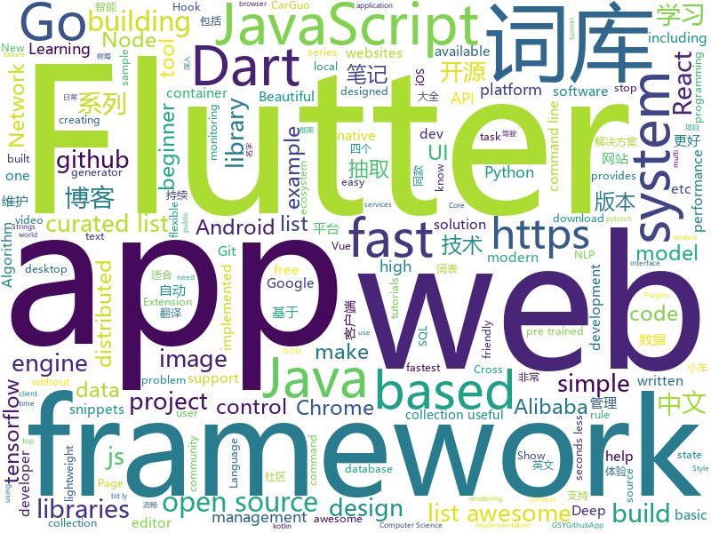

# 2018-11-18
See what the GitHub community is most excited about today.

## python
* [big-list-of-naughty-strings](https://github.com/minimaxir/big-list-of-naughty-strings)(**842 stars today**): The Big List of Naughty Strings is a list of strings which have a high probability of causing issues when used as user-input data.
* [chartify](https://github.com/spotify/chartify)(**205 stars today**): Python library that makes it easy for data scientists to create charts.
* [funNLP](https://github.com/fighting41love/funNLP)(**183 stars today**): 中英文敏感词、语言检测、中外手机/电话归属地/运营商查询、名字推断性别、手机号抽取、身份证抽取、邮箱抽取、中日文人名库、中文缩写库、拆字词典、词汇情感值、停用词、反动词表、暴恐词表、繁简体转换、英文模拟中文发音、汪峰歌词生成器、职业名称词库、同义词库、反义词库、否定词库、汽车品牌&零件词库、时间抽取、连续英文切割、中文词向量大全、公司名字大全、古诗词库、IT词库、财经词库、成语词库、地名词库、历史名人词库、诗词词库、医学词库、饮食词库、法律词库、汽车词库、动物词库、中文聊天语料、中文谣言数据。
* [public-apis](https://github.com/toddmotto/public-apis)(**125 stars today**): A collective list of public JSON APIs for use in web development.
* [q](https://github.com/harelba/q)(**119 stars today**): q - Run SQL directly on CSV or TSV files
* [IntelTXE-PoC](https://github.com/ptresearch/IntelTXE-PoC)(**103 stars today**): Intel Management Engine JTAG Proof of Concept
* [hmtl](https://github.com/huggingface/hmtl)(**89 stars today**): HMTL: Hierarchical Multi-Task Learning
* [XSStrike](https://github.com/s0md3v/XSStrike)(**81 stars today**): Most advanced XSS detection suite.
* [ddgr](https://github.com/jarun/ddgr)(**55 stars today**): 🦆DuckDuckGo from the terminal
* [bert](https://github.com/google-research/bert)(**39 stars today**): TensorFlow code and pre-trained models for BERT
* [models](https://github.com/tensorflow/models)(**33 stars today**): Models and examples built with TensorFlow
* [Python](https://github.com/TheAlgorithms/Python)(**39 stars today**): All Algorithms implemented in Python
* [system-design-primer](https://github.com/donnemartin/system-design-primer)(**42 stars today**): Learn how to design large-scale systems. Prep for the system design interview. Includes Anki flashcards.
* [keras](https://github.com/keras-team/keras)(**35 stars today**): Deep Learning for humans
* [pytorch_misc](https://github.com/ptrblck/pytorch_misc)(**34 stars today**): Code snippets created for the PyTorch discussion board
* [face_recognition](https://github.com/ageitgey/face_recognition)(**27 stars today**): The world's simplest facial recognition api for Python and the command line
* [youtube-dl](https://github.com/rg3/youtube-dl)(**28 stars today**): Command-line program to download videos from YouTube.com and other video sites
* [awesome-python](https://github.com/vinta/awesome-python)(**25 stars today**): A curated list of awesome Python frameworks, libraries, software and resources
* [self_drive](https://github.com/Timthony/self_drive)(**27 stars today**): 基于树莓派的自动驾驶小车，利用树莓派和tensorflow实现小车在赛道的自动驾驶。（Self-driving car based on raspberry pi（tensorflow））
* [scikit-learn](https://github.com/scikit-learn/scikit-learn)(**21 stars today**): scikit-learn: machine learning in Python
* [torchdiffeq](https://github.com/rtqichen/torchdiffeq)(**26 stars today**): Differentiable ODE solvers with full GPU support and O(1)-memory backpropagation.
* [2018-CCF-BDCI-China-Unicom-Research-Institute-top2](https://github.com/PandasCute/2018-CCF-BDCI-China-Unicom-Research-Institute-top2)(**25 stars today**): 2018-CCF大数据与计算智能大赛-面向电信行业存量用户的智能套餐个性化匹配模型联通赛-复赛第二名解决方案
* [django](https://github.com/django/django)(**20 stars today**): The Web framework for perfectionists with deadlines.
* [DeepCreamPy](https://github.com/deeppomf/DeepCreamPy)(**24 stars today**): Decensoring Hentai with Deep Neural Networks
* [home-assistant](https://github.com/home-assistant/home-assistant)(**15 stars today**): 🏡Open source home automation that puts local control and privacy first

## java
* [delverengine](https://github.com/Interrupt/delverengine)(**90 stars today**): Delver game engine and editor
* [JavaGuide](https://github.com/Snailclimb/JavaGuide)(**80 stars today**): 【Java学习+面试指南】 一份涵盖大部分Java程序员所需要掌握的核心知识。
* [proxyee-down](https://github.com/proxyee-down-org/proxyee-down)(**53 stars today**): http下载工具，基于http代理，支持多连接分块下载
* [corretto-8](https://github.com/corretto/corretto-8)(**46 stars today**): Amazon Corretto is a no-cost, multi-platform, production-ready distribution of OpenJDK
* [spring-boot](https://github.com/spring-projects/spring-boot)(**29 stars today**): Spring Boot
* [AndroidNote](https://github.com/GcsSloop/AndroidNote)(**31 stars today**): 安卓学习笔记
* [tutorials](https://github.com/eugenp/tutorials)(**22 stars today**): The "REST With Spring" Course:
* [elasticsearch](https://github.com/elastic/elasticsearch)(**23 stars today**): Open Source, Distributed, RESTful Search Engine
* [JCSprout](https://github.com/crossoverJie/JCSprout)(**24 stars today**): 👨‍🎓Java Core Sprout : basic, concurrent, algorithm
* [symphony](https://github.com/b3log/symphony)(**21 stars today**): 🎶一款用 Java 实现的现代化社区（论坛/BBS/社交网络/博客）平台。https://hacpai.com
* [interviews](https://github.com/kdn251/interviews)(**21 stars today**): Everything you need to know to get the job.
* [Java](https://github.com/TheAlgorithms/Java)(**20 stars today**): All Algorithms implemented in Java
* [runelite](https://github.com/runelite/runelite)(**12 stars today**): Open source Old School RuneScape client
* [spring-framework](https://github.com/spring-projects/spring-framework)(**13 stars today**): Spring Framework
* [incubator-dubbo](https://github.com/apache/incubator-dubbo)(**13 stars today**): Apache Dubbo (incubating) is a high-performance, java based, open source RPC framework.
* [arthas](https://github.com/alibaba/arthas)(**13 stars today**): Alibaba Java Diagnostic Tool Arthas/Alibaba Java诊断利器Arthas
* [spring-cloud-alibaba](https://github.com/spring-cloud-incubator/spring-cloud-alibaba)(**13 stars today**): Spring Cloud Alibaba provides a one-stop solution for application development for the distributed solutions of Alibaba middleware.
* [kafka](https://github.com/apache/kafka)(**14 stars today**): Mirror of Apache Kafka
* [solo](https://github.com/b3log/solo)(**13 stars today**): 🎸一款小而美的 Java 博客系统。https://hacpai.com/tag/solo
* [plaid](https://github.com/nickbutcher/plaid)(**12 stars today**): An Android app which provides design news & inspiration as well as being an example of implementing material design.
* [templatespider](https://github.com/xnx3/templatespider)(**11 stars today**): 扒网站工具，看好哪个网站，指定好URL，自动扒下来做成模版。所见网站，皆可为我所用！
* [Sentinel](https://github.com/alibaba/Sentinel)(**10 stars today**): A lightweight flow-control library providing high-available protection and monitoring (高可用防护的流量管理框架)
* [VirtualXposed](https://github.com/android-hacker/VirtualXposed)(**12 stars today**): A simple app to use Xposed without root, unlock the bootloader or modify system image, etc.
* [Magisk](https://github.com/topjohnwu/Magisk)(**12 stars today**): A Magic Mask to Alter Android System Systemless-ly
* [Hystrix](https://github.com/Netflix/Hystrix)(**12 stars today**): Hystrix is a latency and fault tolerance library designed to isolate points of access to remote systems, services and 3rd party libraries, stop cascading failure and enable resilience in complex distributed systems where failure is inevitable.

## unknown
* [git-recipes](https://github.com/geeeeeeeeek/git-recipes)(**81 stars today**): 🥡 Git recipes in Chinese by Zhongyi Tong. 高质量的Git中文教程.
* [CS-Notes](https://github.com/CyC2018/CS-Notes)(**51 stars today**): 📚Computer Science Learning Notes
* [awesome](https://github.com/sindresorhus/awesome)(**49 stars today**): 😎Curated list of awesome lists
* [You-Dont-Know-JS](https://github.com/getify/You-Dont-Know-JS)(**42 stars today**): A book series on JavaScript. @YDKJS on twitter.
* [free-programming-books](https://github.com/EbookFoundation/free-programming-books)(**29 stars today**): 📚Freely available programming books
* [cncf-presentations](https://github.com/bbotte/cncf-presentations)(**23 stars today**): Presentations from the CNCF community to share and reuse
* [gitignore](https://github.com/github/gitignore)(**20 stars today**): A collection of useful .gitignore templates
* [developer-roadmap](https://github.com/kamranahmedse/developer-roadmap)(**29 stars today**): Roadmap to becoming a web developer in 2018
* [git-flight-rules](https://github.com/k88hudson/git-flight-rules)(**28 stars today**): Flight rules for git
* [coding-interview-university](https://github.com/jwasham/coding-interview-university)(**27 stars today**): A complete computer science study plan to become a software engineer.
* [Data-Competition-TopSolution](https://github.com/Smilexuhc/Data-Competition-TopSolution)(**21 stars today**): Data competition Top Solution 数据竞赛top解决方案开源整理
* [build-your-own-x](https://github.com/danistefanovic/build-your-own-x)(**23 stars today**): 🤓Build your own (insert technology here)
* [YCBlogs](https://github.com/yangchong211/YCBlogs)(**22 stars today**): 技术博客笔记大汇总【15年10月到至今】，包括Java基础及深入知识点，Android技术博客，Python，Go学习笔记等等，还包括平时开发中遇到的bug汇总，当然也在工作之余收集了大量的面试题，长期更新维护并且修正，持续完善……开源的文件是markdown格式的！同时也开源了生活博客，从12年起，积累共计47篇[近20万字]，转载请注明出处，谢谢！
* [Awesome-pytorch-list](https://github.com/bharathgs/Awesome-pytorch-list)(**20 stars today**): A comprehensive list of pytorch related content on github,such as different models,implementations,helper libraries,tutorials etc.
* [awesome-vue](https://github.com/vuejs/awesome-vue)(**19 stars today**): 🎉A curated list of awesome things related to Vue.js
* [APISecurityBestPractices](https://github.com/GitGuardian/APISecurityBestPractices)(**19 stars today**): Resources to help you keep secrets (API keys, database credentials, certificates, ...) out of source code.
* [awesome-scalability](https://github.com/binhnguyennus/awesome-scalability)(**18 stars today**): Scalable, Available, Stable, Performant, and Intelligent System Design Patterns
* [awesome-for-beginners](https://github.com/MunGell/awesome-for-beginners)(**17 stars today**): A list of awesome beginners-friendly projects.
* [A-to-Z-Resources-for-Students](https://github.com/dipakkr/A-to-Z-Resources-for-Students)(**15 stars today**): ☑️Curated list of resources for college students Show your❤️by giving a⭐️
* [first-contributions](https://github.com/firstcontributions/first-contributions)(**9 stars today**): 🚀✨Help beginners to contribute to open source projects
* [awesome-public-datasets](https://github.com/awesomedata/awesome-public-datasets)(**16 stars today**): A topic-centric list of high-quality open datasets in public domains. New PR ☛☛☛
* [gold-miner](https://github.com/xitu/gold-miner)(**17 stars today**): 🥇掘金翻译计划，可能是世界最大最好的英译中技术社区，最懂读者和译者的翻译平台：
* [FCL](https://github.com/chenerlich/FCL)(**15 stars today**): FCL (Fileless Command Lines) - Known command lines of fileless malicious executions
* [Blog](https://github.com/mqyqingfeng/Blog)(**15 stars today**): 冴羽写博客的地方，预计写四个系列：JavaScript深入系列、JavaScript专题系列、ES6系列、React系列。
* [Awesome-Hacking](https://github.com/Hack-with-Github/Awesome-Hacking)(**14 stars today**): A collection of various awesome lists for hackers, pentesters and security researchers

## javascript
* [slate](https://github.com/ianstormtaylor/slate)(**248 stars today**): A completely customizable framework for building rich text editors.
* [tensorspace](https://github.com/tensorspace-team/tensorspace)(**119 stars today**): Neural network 3D visualization framework, build interactive and intuitive model in browsers, support pre-trained deep learning models from TensorFlow, Keras, TensorFlow.js
* [fx](https://github.com/antonmedv/fx)(**107 stars today**): Terminal JSON viewer🔥
* [vue](https://github.com/vuejs/vue)(**95 stars today**): 🖖A progressive, incrementally-adoptable JavaScript framework for building UI on the web.
* [react-beautiful-dnd](https://github.com/atlassian/react-beautiful-dnd)(**93 stars today**): Beautiful and accessible drag and drop for lists with React
* [carlo](https://github.com/GoogleChromeLabs/carlo)(**69 stars today**): Web rendering surface for Node applications
* [30-seconds-of-code](https://github.com/30-seconds/30-seconds-of-code)(**65 stars today**): Curated collection of useful JavaScript snippets that you can understand in 30 seconds or less.
* [react](https://github.com/facebook/react)(**58 stars today**): A declarative, efficient, and flexible JavaScript library for building user interfaces.
* [statusfy](https://github.com/bazzite/statusfy)(**52 stars today**): A marvelous Open Source Status Page system
* [33-js-concepts](https://github.com/leonardomso/33-js-concepts)(**49 stars today**): 📜33 concepts every JavaScript developer should know.
* [create-react-app](https://github.com/facebook/create-react-app)(**41 stars today**): Set up a modern web app by running one command.
* [axios](https://github.com/axios/axios)(**46 stars today**): Promise based HTTP client for the browser and node.js
* [unified](https://github.com/unifiedjs/unified)(**47 stars today**): ☔ friendly interface backed by an ecosystem of plugins built for creating and manipulating content
* [gatsby](https://github.com/gatsbyjs/gatsby)(**41 stars today**): Build blazing fast, modern apps and websites with React
* [node](https://github.com/nodejs/node)(**29 stars today**): Node.js JavaScript runtime✨🐢🚀✨
* [33-js-concepts](https://github.com/stephentian/33-js-concepts)(**39 stars today**): 📜每个 JavaScript 工程师都应懂的33个概念 @leonardomso
* [tng-hooks](https://github.com/getify/tng-hooks)(**40 stars today**): Provides React-inspired 'hooks' like useState(..) for stand-alone functions
* [use-profunctor-state](https://github.com/staltz/use-profunctor-state)(**40 stars today**): React Hook for state management with profunctor lenses
* [router](https://github.com/kevindurb/router)(**39 stars today**): A simple js router designed to solve one problem outside of any other frameworks like React, Angular, or Vue
* [ProjectVisBug](https://github.com/GoogleChromeLabs/ProjectVisBug)(**38 stars today**): 🎨Make any webpage feel like an artboard, download extension here https://chrome.google.com/webstore/detail/cdockenadnadldjbbgcallicgledbeoc
* [puppeteer](https://github.com/GoogleChrome/puppeteer)(**33 stars today**): Headless Chrome Node API
* [javascript](https://github.com/airbnb/javascript)(**31 stars today**): JavaScript Style Guide
* [react-native](https://github.com/facebook/react-native)(**31 stars today**): A framework for building native apps with React.
* [Glider.js](https://github.com/NickPiscitelli/Glider.js)(**30 stars today**): A fast, lightweight, dependency free, native scrolling carousel alternative!
* [virtual-scroller](https://github.com/valdrinkoshi/virtual-scroller)(**29 stars today**): 

## html
* [nginxconfig.io](https://github.com/valentinxxx/nginxconfig.io)(**244 stars today**): ⚙️NGiИX config generator generator on steroids💉
* [BabySploit](https://github.com/M4cs/BabySploit)(**107 stars today**): BabySploit Beginner Pentesting Toolkit/Framework Written in Python
* [spark-crowd](https://github.com/enriquegrodrigo/spark-crowd)(**27 stars today**): A package for dealing with crowdsourced big data.
* [NLP-progress](https://github.com/sebastianruder/NLP-progress)(**20 stars today**): Repository to track the progress in Natural Language Processing (NLP), including the datasets and the current state-of-the-art for the most common NLP tasks.
* [styleguide](https://github.com/google/styleguide)(**12 stars today**): Style guides for Google-originated open-source projects
* [blockchain](https://github.com/Azure-Samples/blockchain)(**10 stars today**): Azure Blockchain Content and Samples
* [cypherpunks.com.br](https://github.com/cypherpunksbr/cypherpunks.com.br)(**9 stars today**): Repositório do site cypherpunks.com.br
* [fastText](https://github.com/facebookresearch/fastText)(**9 stars today**): Library for fast text representation and classification.
* [colorpalette](https://github.com/makkoncept/colorpalette)(**10 stars today**): Flask app : extracts palette of dominating colors from image. https://colorpalettedemo.herokuapp.com/
* [Spoon-Knife](https://github.com/octocat/Spoon-Knife)(****): This repo is for demonstration purposes only.
* [deeplearning_ai_books](https://github.com/fengdu78/deeplearning_ai_books)(**8 stars today**): deeplearning.ai（吴恩达老师的深度学习课程笔记及资源）
* [30-seconds-of-css](https://github.com/30-seconds/30-seconds-of-css)(**10 stars today**): A curated collection of useful CSS snippets you can understand in 30 seconds or less.
* [react-redux](https://github.com/reduxjs/react-redux)(**8 stars today**): Official React bindings for Redux
* [devsonket.github.io](https://github.com/devsonket/devsonket.github.io)(**8 stars today**): 🎨🛠📌সম্পূর্ণ বাংলায় ডেভেলপার চিটশিট🎨🛠📌
* [AdminLTE](https://github.com/almasaeed2010/AdminLTE)(**8 stars today**): AdminLTE - Free Premium Admin control Panel Theme Based On Bootstrap 3.x
* [JavaScript30](https://github.com/wesbos/JavaScript30)(**5 stars today**): 30 Day Vanilla JS Challenge
* [Publii](https://github.com/GetPublii/Publii)(**8 stars today**): Publii is a desktop-based CMS for Windows, Mac and Linux that makes creating static websites fast and hassle-free, even for beginners.
* [portainer](https://github.com/portainer/portainer)(**7 stars today**): Simple management UI for Docker
* [solid](https://github.com/solid/solid)(**7 stars today**): Solid - Re-decentralizing the web (project directory)
* [zenbot](https://github.com/DeviaVir/zenbot)(**6 stars today**): Zenbot is a command-line cryptocurrency trading bot using Node.js and MongoDB.
* [simple-icons](https://github.com/simple-icons/simple-icons)(**5 stars today**): SVG icons for popular brands
* [Winds](https://github.com/GetStream/Winds)(**5 stars today**): A Beautiful Open Source RSS & Podcast App Powered by Getstream.io
* [nginx-error-pages](https://github.com/denysvitali/nginx-error-pages)(**5 stars today**): Cute Error Pages for your nginx web server
* [patchwork](https://github.com/jlord/patchwork)(****): All the Git-it Workshop completers!
* [game-of-life](https://github.com/wakaleo/game-of-life)(****): Demo application for the 'Jenkins: The Definitive Guide' book

## dart
* [flutter](https://github.com/flutter/flutter)(**51 stars today**): Flutter makes it easy and fast to build beautiful mobile apps.
* [awesome-flutter](https://github.com/Solido/awesome-flutter)(**25 stars today**): An awesome list that curates the best Flutter libraries, tools, tutorials, articles and more.
* [plugins](https://github.com/flutter/plugins)(**10 stars today**): Plugins for Flutter, including FlutterFire, maintained by the Flutter team
* [GSYGithubAppFlutter](https://github.com/CarGuo/GSYGithubAppFlutter)(**6 stars today**): 超完整的Flutter项目，功能丰富，适合学习和日常使用。GSYGithubApp系列的优势：我们目前已经拥有Flutter、Weex、ReactNative、kotlin 四个版本。 功能齐全，项目框架内技术涉及面广，完成度高，持续维护，配套文章，适合全面学习，对比参考。跨平台的开源Github客户端App，更好的体验，更丰富的功能，旨在更好的日常管理和维护个人Github，提供更好更方便的驾车体验Σ(￣。￣ﾉ)ﾉ。同款Weex版本 ： https://github.com/CarGuo/GSYGithubAppWeex 、同款React Native版本 ： https://github.com/CarGuo/GSYGithubApp 、原生 kotlin 版本 https://g…
* [Flutter-UI-Kit](https://github.com/iampawan/Flutter-UI-Kit)(**5 stars today**): Flutter app for collection of UI in a UIKit
* [flutter_architecture_samples](https://github.com/brianegan/flutter_architecture_samples)(**5 stars today**): TodoMVC for Flutter
* [flutter_cached_network_image](https://github.com/renefloor/flutter_cached_network_image)(****): Download, cache and show images in a flutter app
* [website](https://github.com/flutter/website)(****): Flutter web site
* [photo_view](https://github.com/renancaraujo/photo_view)(****): A simple zoomable image widget for Flutter
* [flutter_staggered_grid_view](https://github.com/letsar/flutter_staggered_grid_view)(****): A Flutter staggered grid view
* [chromedeveditor](https://github.com/googlearchive/chromedeveditor)(****): Chrome Dev Editor is a developer tool for building apps on the Chrome platform - Chrome Apps and Web Apps, in JavaScript or Dart. (NO LONGER IN ACTIVE DEVELOPMENT)
* [sdk](https://github.com/dart-lang/sdk)(****): The Dart SDK, including the VM, dart2js, core libraries, and more.
* [FlutterExampleApps](https://github.com/iampawan/FlutterExampleApps)(****): [Example APPS] Basic Flutter apps, for flutter devs.
* [flutter-examples](https://github.com/nisrulz/flutter-examples)(****): [Examples] Simple basic isolated apps, for budding flutter devs.
* [flutter-osc](https://github.com/yubo725/flutter-osc)(****): 基于Google Flutter的开源中国客户端，支持Android和iOS。
* [inKino](https://github.com/roughike/inKino)(****): A multiplatform Dart movie app with 40% of code sharing between Flutter and the Web.
* [Flutter-learning](https://github.com/AweiLoveAndroid/Flutter-learning)(****): 🔥👍🌟⭐️⭐️⭐️Flutter install&settings,Flutter problems when developing,Flutter sample codes& templates,Flutter projects,Dart languages sample codes
* [dio](https://github.com/flutterchina/dio)(****): A powerful Http client for Dart, which supports Interceptors, FormData, Request Cancellation, File Downloading, Timeout etc.
* [zhihu-flutter](https://github.com/HackSoul/zhihu-flutter)(****): Flutter 高仿知乎 UI，非常漂亮，也非常流畅，flutter build apk 或 flutter build ios 之后更流畅
* [hauberk](https://github.com/munificent/hauberk)(****): A web-based roguelike written in Dart.
* [angular](https://github.com/dart-lang/angular)(****): Fast and productive web framework provided by Dart
* [StageXL](https://github.com/bp74/StageXL)(****): A fast and universal 2D rendering engine for HTML5 and Dart.
* [dart-sass](https://github.com/sass/dart-sass)(****): A Dart implementation of Sass.
* [rxdart](https://github.com/ReactiveX/rxdart)(****): The Reactive Extensions for Dart
* [Flutter-Notebook](https://github.com/OpenFlutter/Flutter-Notebook)(****): 日更的FlutterDemo合集，今天你fu了吗

## go
* [golua](https://github.com/Azure/golua)(**301 stars today**): A Lua 5.3 engine implemented in Go
* [lorca](https://github.com/zserge/lorca)(**292 stars today**): Build cross-platform modern desktop apps in Go + HTML5
* [rtctunnel](https://github.com/rtctunnel/rtctunnel)(**75 stars today**): build network tunnels over WebRTC
* [webtty](https://github.com/maxmcd/webtty)(**58 stars today**): Share a terminal session over WebRTC
* [go](https://github.com/golang/go)(**35 stars today**): The Go programming language
* [kubernetes](https://github.com/kubernetes/kubernetes)(**29 stars today**): Production-Grade Container Scheduling and Management
* [BaiduPCS-Go](https://github.com/iikira/BaiduPCS-Go)(**31 stars today**): 百度网盘客户端 - Go语言编写
* [awesome-go](https://github.com/avelino/awesome-go)(**23 stars today**): A curated list of awesome Go frameworks, libraries and software
* [SaSSHimi](https://github.com/TarlogicSecurity/SaSSHimi)(**24 stars today**): SSH Tunnelling in "RAW mode", via STDIN/OUT without using forwarding channels
* [gin](https://github.com/gin-gonic/gin)(**23 stars today**): Gin is a HTTP web framework written in Go (Golang). It features a Martini-like API with much better performance -- up to 40 times faster. If you need smashing performance, get yourself some Gin.
* [cngrok](https://github.com/ssstk/cngrok)(**20 stars today**): frp、ngrok内网穿透服务管理平台
* [titan](https://github.com/meitu/titan)(**23 stars today**): A Distributed Redis Protocol Compatible NoSQL Database
* [diligent](https://github.com/senseyeio/diligent)(**23 stars today**): Get the licenses associated with your software dependencies
* [makisu](https://github.com/uber/makisu)(**22 stars today**): Fast and flexible Docker image building tool, works on OSX and in containerized environments like Kubernetes.
* [frp](https://github.com/fatedier/frp)(**18 stars today**): A fast reverse proxy to help you expose a local server behind a NAT or firewall to the internet.
* [logger](https://github.com/google/logger)(**19 stars today**): Cross platform Go logging library.
* [moby](https://github.com/moby/moby)(**17 stars today**): Moby Project - a collaborative project for the container ecosystem to assemble container-based systems
* [hugo](https://github.com/gohugoio/hugo)(**17 stars today**): The world’s fastest framework for building websites.
* [istio](https://github.com/istio/istio)(**17 stars today**): Connect, secure, control, and observe services.
* [clash](https://github.com/Dreamacro/clash)(**17 stars today**): A rule based tunnel in Go.
* [soar](https://github.com/XiaoMi/soar)(**15 stars today**): SQL Optimizer And Rewriter
* [prometheus](https://github.com/prometheus/prometheus)(**14 stars today**): The Prometheus monitoring system and time series database.
* [Amass](https://github.com/OWASP/Amass)(**15 stars today**): In-Depth DNS Enumeration and Network Mapping
* [build-web-application-with-golang](https://github.com/astaxie/build-web-application-with-golang)(**14 stars today**): A golang ebook intro how to build a web with golang
* [iris](https://github.com/kataras/iris)(**13 stars today**): The fastest backend community-driven web framework on (THIS) Earth. HTTP/2, MVC and more. Can your favourite web framework do that?👉http://bit.ly/iriscandothat1 or even http://bit.ly/iriscandothat2

## WordCloud

