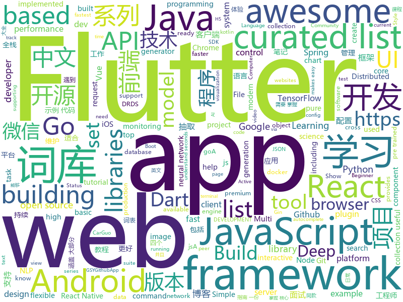

# 2018-11-21
See what the GitHub community is most excited about today.

## python
* [big-list-of-naughty-strings](https://github.com/minimaxir/big-list-of-naughty-strings)(**561 stars today**): The Big List of Naughty Strings is a list of strings which have a high probability of causing issues when used as user-input data.
* [self_driving_pi_car](https://github.com/felipessalvatore/self_driving_pi_car)(**335 stars today**): A deep neural network based self-driving car, that combines Lego Mindstorms NXT with the computational power of a Raspberry Pi 3.
* [funNLP](https://github.com/fighting41love/funNLP)(**285 stars today**): 中英文敏感词、语言检测、中外手机/电话归属地/运营商查询、名字推断性别、手机号抽取、身份证抽取、邮箱抽取、中日文人名库、中文缩写库、拆字词典、词汇情感值、停用词、反动词表、暴恐词表、繁简体转换、英文模拟中文发音、汪峰歌词生成器、职业名称词库、同义词库、反义词库、否定词库、汽车品牌&零件词库、时间抽取、连续英文切割、中文词向量大全、公司名字大全、古诗词库、IT词库、财经词库、成语词库、地名词库、历史名人词库、诗词词库、医学词库、饮食词库、法律词库、汽车词库、动物词库、中文聊天语料、中文谣言数据。
* [bert](https://github.com/google-research/bert)(**98 stars today**): TensorFlow code and pre-trained models for BERT
* [funky](https://github.com/bbugyi200/funky)(**105 stars today**): Funky takes shell functions to the next level by making them easier to define, more flexible, and more interactive.
* [models](https://github.com/tensorflow/models)(**75 stars today**): Models and examples built with TensorFlow
* [byob](https://github.com/malwaredllc/byob)(**80 stars today**): BYOB (Build Your Own Botnet)
* [SetSimilaritySearch](https://github.com/ekzhu/SetSimilaritySearch)(**86 stars today**): All-pair set similarity search on millions of sets in Python and on a laptop (faster than MinHash LSH)
* [Python](https://github.com/TheAlgorithms/Python)(**64 stars today**): All Algorithms implemented in Python
* [public-apis](https://github.com/toddmotto/public-apis)(**61 stars today**): A collective list of public JSON APIs for use in web development.
* [system-design-primer](https://github.com/donnemartin/system-design-primer)(**54 stars today**): Learn how to design large-scale systems. Prep for the system design interview. Includes Anki flashcards.
* [chartify](https://github.com/spotify/chartify)(**56 stars today**): Python library that makes it easy for data scientists to create charts.
* [keras](https://github.com/keras-team/keras)(**42 stars today**): Deep Learning for humans
* [awesome-python](https://github.com/vinta/awesome-python)(**51 stars today**): A curated list of awesome Python frameworks, libraries, software and resources
* [hmtl](https://github.com/huggingface/hmtl)(**51 stars today**): 🌊HMTL: Hierarchical Multi-Task Learning - A State-of-the-Art neural network model for several NLP tasks based on PyTorch and AllenNLP
* [Talking-Face-Generation-DAVS](https://github.com/Hangz-nju-cuhk/Talking-Face-Generation-DAVS)(**48 stars today**): Code for Talking Face Generation by Adversarially Disentangled Audio-Visual Representation
* [face_recognition](https://github.com/ageitgey/face_recognition)(**43 stars today**): The world's simplest facial recognition api for Python and the command line
* [q](https://github.com/harelba/q)(**47 stars today**): q - Run SQL directly on CSV or TSV files
* [Fnord](https://github.com/Neo23x0/Fnord)(**46 stars today**): Pattern Extractor for Obfuscated Code
* [mycli](https://github.com/dbcli/mycli)(**44 stars today**): A Terminal Client for MySQL with AutoCompletion and Syntax Highlighting.
* [XSStrike](https://github.com/s0md3v/XSStrike)(**41 stars today**): Most advanced XSS detection suite.
* [youtube-dl](https://github.com/rg3/youtube-dl)(**41 stars today**): Command-line program to download videos from YouTube.com and other video sites
* [DeepCreamPy](https://github.com/deeppomf/DeepCreamPy)(**40 stars today**): Decensoring Hentai with Deep Neural Networks
* [ungoogled-chromium](https://github.com/Eloston/ungoogled-chromium)(**42 stars today**): Google Chromium, sans integration with Google
* [SSRFmap](https://github.com/swisskyrepo/SSRFmap)(**40 stars today**): Automatic SSRF fuzzer and exploitation tool

## java
* [coderiver](https://github.com/cachecats/coderiver)(**194 stars today**): 致力于打造全平台全栈精品开源项目，计划做成包含 pc端（Vue、React）、移动H5（Vue、React）、ReactNative混合开发、Android原生、微信小程序、java后端的全平台型全栈项目，欢迎关注。
* [JavaGuide](https://github.com/Snailclimb/JavaGuide)(**120 stars today**): 【Java学习+面试指南】 一份涵盖大部分Java程序员所需要掌握的核心知识。
* [java-design-patterns](https://github.com/iluwatar/java-design-patterns)(**59 stars today**): Design patterns implemented in Java
* [JCSprout](https://github.com/crossoverJie/JCSprout)(**54 stars today**): 👨‍🎓Java Core Sprout : basic, concurrent, algorithm
* [corretto-8](https://github.com/corretto/corretto-8)(**55 stars today**): Amazon Corretto is a no-cost, multi-platform, production-ready distribution of OpenJDK
* [interviews](https://github.com/kdn251/interviews)(**48 stars today**): Everything you need to know to get the job.
* [proxyee-down](https://github.com/proxyee-down-org/proxyee-down)(**48 stars today**): http下载工具，基于http代理，支持多连接分块下载
* [spring-boot](https://github.com/spring-projects/spring-boot)(**46 stars today**): Spring Boot
* [delverengine](https://github.com/Interrupt/delverengine)(**52 stars today**): Delver game engine and editor
* [apollo](https://github.com/ctripcorp/apollo)(**36 stars today**): Apollo（阿波罗）是携程框架部门研发的分布式配置中心，能够集中化管理应用不同环境、不同集群的配置，配置修改后能够实时推送到应用端，并且具备规范的权限、流程治理等特性，适用于微服务配置管理场景。
* [tutorials](https://github.com/eugenp/tutorials)(**17 stars today**): The "REST With Spring" Course:
* [ToastUtils](https://github.com/getActivity/ToastUtils)(**32 stars today**): This is a very functional Toast
* [spring-framework](https://github.com/spring-projects/spring-framework)(**26 stars today**): Spring Framework
* [AndroidUtilCode](https://github.com/Blankj/AndroidUtilCode)(**29 stars today**): 🔥Android developers should collect the following utils(updating).
* [Sentinel](https://github.com/alibaba/Sentinel)(**29 stars today**): A lightweight flow-control library providing high-available protection and monitoring (高可用防护的流量管理框架)
* [symphony](https://github.com/b3log/symphony)(**30 stars today**): 🎶一款用 Java 实现的现代化社区（论坛/BBS/社交网络/博客）平台。https://hacpai.com
* [elasticsearch](https://github.com/elastic/elasticsearch)(**27 stars today**): Open Source, Distributed, RESTful Search Engine
* [MPAndroidChart](https://github.com/PhilJay/MPAndroidChart)(**29 stars today**): A powerful🚀Android chart view / graph view library, supporting line- bar- pie- radar- bubble- and candlestick charts as well as scaling, dragging and animations.
* [spring-boot-examples](https://github.com/ityouknow/spring-boot-examples)(**24 stars today**): about learning Spring Boot via examples. Spring Boot 教程、技术栈示例代码，快速简单上手教程。
* [weixin-java-tools](https://github.com/Wechat-Group/weixin-java-tools)(**28 stars today**): 全能微信Java开发工具包，支持包括微信支付、开放平台、小程序、企业微信/企业号和公众号等的开发
* [guava](https://github.com/google/guava)(**27 stars today**): Google core libraries for Java
* [conjure](https://github.com/palantir/conjure)(**30 stars today**): Strongly typed HTTP/JSON APIs for browsers and microservices
* [incubator-dubbo](https://github.com/apache/incubator-dubbo)(**19 stars today**): Apache Dubbo (incubating) is a high-performance, java based, open source RPC framework.
* [incubator-skywalking](https://github.com/apache/incubator-skywalking)(**25 stars today**): A distributed tracing system, and APM ( Application Performance Monitoring )
* [canal](https://github.com/alibaba/canal)(**24 stars today**): 阿里巴巴mysql数据库binlog的增量订阅&消费组件 。阿里云DRDS( https://www.aliyun.com/product/drds )、阿里巴巴TDDL 二级索引、小表复制powerd by canal.

## unknown
* [AD-Attack-Defense](https://github.com/infosecn1nja/AD-Attack-Defense)(**224 stars today**): Active Directory Security For Red & Blue Team
* [build-your-own-x](https://github.com/danistefanovic/build-your-own-x)(**162 stars today**): 🤓Build your own (insert technology here)
* [CS-Notes](https://github.com/CyC2018/CS-Notes)(**115 stars today**): 📚Computer Science Learning Notes
* [developer-roadmap](https://github.com/kamranahmedse/developer-roadmap)(**74 stars today**): Roadmap to becoming a web developer in 2018
* [You-Dont-Know-JS](https://github.com/getify/You-Dont-Know-JS)(**68 stars today**): A book series on JavaScript. @YDKJS on twitter.
* [free-programming-books](https://github.com/EbookFoundation/free-programming-books)(**64 stars today**): 📚Freely available programming books
* [gitignore](https://github.com/github/gitignore)(**49 stars today**): A collection of useful .gitignore templates
* [2019_campus_apply](https://github.com/frank-lam/2019_campus_apply)(**69 stars today**): 🚀Full Stack Developer Tutorial，后台技术栈/全栈开发/架构师之路，秋招/春招/校招/面试。 from zero to hero.
* [awesome-burp-extensions](https://github.com/snoopysecurity/awesome-burp-extensions)(**61 stars today**): A curated list of amazingly awesome Burp Extensions
* [awesome](https://github.com/sindresorhus/awesome)(**63 stars today**): 😎Curated list of awesome lists
* [learning-article](https://github.com/webproblem/learning-article)(**45 stars today**): 学习资源 or 大前端导航，持续更新
* [A-to-Z-Resources-for-Students](https://github.com/dipakkr/A-to-Z-Resources-for-Students)(**42 stars today**): ☑️Curated list of resources for college students Show your❤️by giving a⭐️
* [coding-interview-university](https://github.com/jwasham/coding-interview-university)(**38 stars today**): A complete computer science study plan to become a software engineer.
* [FEGuide](https://github.com/nanhupatar/FEGuide)(**38 stars today**): 【前端面试题+前端学习+面试指南】 一份涵盖大部分前端工程师所需要掌握的核心知识。这个项目就是为了帮助那些找工作的前端开发工程师去回顾前端的基础知识，如果你不想找工作，也可以通过查看这些面试问题去巩固你的前端技能。
* [project-based-learning](https://github.com/tuvtran/project-based-learning)(**38 stars today**): Curated list of project-based tutorials
* [awesome-vue](https://github.com/vuejs/awesome-vue)(**37 stars today**): 🎉A curated list of awesome things related to Vue.js
* [Blog](https://github.com/mqyqingfeng/Blog)(**35 stars today**): 冴羽写博客的地方，预计写四个系列：JavaScript深入系列、JavaScript专题系列、ES6系列、React系列。
* [forum-do-front-ao-end](https://github.com/CollabCodeTech/forum-do-front-ao-end)(**36 stars today**): Fórum da turma do curso do Front ao End
* [git-flight-rules](https://github.com/k88hudson/git-flight-rules)(**33 stars today**): Flight rules for git
* [YCBlogs](https://github.com/yangchong211/YCBlogs)(**33 stars today**): 技术博客笔记大汇总【15年10月到至今】，包括Java基础及深入知识点，Android技术博客，Python，Go学习笔记等等，还包括平时开发中遇到的bug汇总，当然也在工作之余收集了大量的面试题，长期更新维护并且修正，持续完善……开源的文件是markdown格式的！同时也开源了生活博客，从12年起，积累共计47篇[近20万字]，转载请注明出处，谢谢！
* [git-recipes](https://github.com/geeeeeeeeek/git-recipes)(**32 stars today**): 🥡 Git recipes in Chinese by Zhongyi Tong. 高质量的Git中文教程.
* [first-contributions](https://github.com/firstcontributions/first-contributions)(**15 stars today**): 🚀✨Help beginners to contribute to open source projects
* [Data-Competition-TopSolution](https://github.com/Smilexuhc/Data-Competition-TopSolution)(**27 stars today**): Data competition Top Solution 数据竞赛top解决方案开源整理
* [awful-ai](https://github.com/daviddao/awful-ai)(**26 stars today**): 😈Awful AI is a curated list to track current scary usages of AI - hoping to raise awareness
* [iqiyi_security_conference_2018](https://github.com/71src/iqiyi_security_conference_2018)(**22 stars today**): 第一届爱奇艺安全沙龙 议题PPT分享

## javascript
* [style2paints](https://github.com/lllyasviel/style2paints)(**542 stars today**): sketch + style = paints🎨
* [DoodleMaster](https://github.com/karanchahal/DoodleMaster)(**495 stars today**): "Don't code your UI, Draw it !"
* [33-js-concepts](https://github.com/leonardomso/33-js-concepts)(**199 stars today**): 📜33 concepts every JavaScript developer should know.
* [edex-ui](https://github.com/GitSquared/edex-ui)(**170 stars today**): A science fiction desktop running everywhere. Awesome.
* [imba](https://github.com/somebee/imba)(**168 stars today**): The new programming language for web apps
* [slate](https://github.com/ianstormtaylor/slate)(**163 stars today**): A completely customizable framework for building rich text editors.
* [vue](https://github.com/vuejs/vue)(**131 stars today**): 🖖A progressive, incrementally-adoptable JavaScript framework for building UI on the web.
* [virtual-scroller](https://github.com/valdrinkoshi/virtual-scroller)(**136 stars today**): 
* [30-seconds-of-code](https://github.com/30-seconds/30-seconds-of-code)(**119 stars today**): Curated collection of useful JavaScript snippets that you can understand in 30 seconds or less.
* [vs](https://github.com/anvaka/vs)(**121 stars today**): Visualization of Google's autocomplete
* [33-js-concepts](https://github.com/stephentian/33-js-concepts)(**108 stars today**): 📜每个 JavaScript 工程师都应懂的33个概念 @leonardomso
* [react-beautiful-dnd](https://github.com/atlassian/react-beautiful-dnd)(**110 stars today**): Beautiful and accessible drag and drop for lists with React
* [arbitrary-image-stylization-tfjs](https://github.com/reiinakano/arbitrary-image-stylization-tfjs)(**99 stars today**): Arbitrary image stylization using TensorFlow.js
* [statusfy](https://github.com/bazzite/statusfy)(**99 stars today**): A marvelous Open Source Status Page system
* [tensorspace](https://github.com/tensorspace-team/tensorspace)(**96 stars today**): Neural network 3D visualization framework, build interactive and intuitive model in browsers, support pre-trained deep learning models from TensorFlow, Keras, TensorFlow.js
* [react](https://github.com/facebook/react)(**76 stars today**): A declarative, efficient, and flexible JavaScript library for building user interfaces.
* [carlo](https://github.com/GoogleChromeLabs/carlo)(**86 stars today**): Web rendering surface for Node applications
* [autoComplete.js](https://github.com/TarekRaafat/autoComplete.js)(**84 stars today**): Simple autocomplete pure vanilla Javascript library.
* [nivo](https://github.com/plouc/nivo)(**82 stars today**): nivo provides a rich set of dataviz components, built on top of the awesome d3 and Reactjs libraries
* [graphql-engine](https://github.com/hasura/graphql-engine)(**68 stars today**): Blazing fast, instant realtime GraphQL APIs on Postgres with fine grained access control, also trigger webhooks on database events.
* [storybook](https://github.com/storybooks/storybook)(**62 stars today**): Interactive UI component dev & test: React, React Native, Vue, Angular, Ember
* [taro](https://github.com/NervJS/taro)(**64 stars today**): 多端统一开发框架，支持用 React 的开发方式编写一次代码，生成能运行在微信小程序/百度智能小程序/支付宝小程序、H5、React Native 等的应用。
* [create-react-app](https://github.com/facebook/create-react-app)(**61 stars today**): Set up a modern web app by running one command.
* [puppeteer](https://github.com/GoogleChrome/puppeteer)(**58 stars today**): Headless Chrome Node API
* [axios](https://github.com/axios/axios)(**57 stars today**): Promise based HTTP client for the browser and node.js

## html
* [nginxconfig.io](https://github.com/valentinxxx/nginxconfig.io)(**589 stars today**): ⚙️NGiИX config generator generator on steroids💉
* [CSS-file-icons](https://github.com/colorswall/CSS-file-icons)(**38 stars today**): Pure CSS icons for popular file extensions
* [JavaScript30](https://github.com/wesbos/JavaScript30)(**13 stars today**): 30 Day Vanilla JS Challenge
* [NLP-progress](https://github.com/sebastianruder/NLP-progress)(**22 stars today**): Repository to track the progress in Natural Language Processing (NLP), including the datasets and the current state-of-the-art for the most common NLP tasks.
* [styleguide](https://github.com/google/styleguide)(**18 stars today**): Style guides for Google-originated open-source projects
* [30-seconds-of-css](https://github.com/30-seconds/30-seconds-of-css)(**19 stars today**): A curated collection of useful CSS snippets you can understand in 30 seconds or less.
* [Coursera-ML-AndrewNg-Notes](https://github.com/fengdu78/Coursera-ML-AndrewNg-Notes)(**16 stars today**): 吴恩达老师的机器学习课程个人笔记
* [react-redux](https://github.com/reduxjs/react-redux)(**15 stars today**): Official React bindings for Redux
* [BabySploit](https://github.com/M4cs/BabySploit)(**17 stars today**): BabySploit Beginner Pentesting Toolkit/Framework Written in Python
* [fastText](https://github.com/facebookresearch/fastText)(**12 stars today**): Library for fast text representation and classification.
* [AdminLTE](https://github.com/almasaeed2010/AdminLTE)(**11 stars today**): AdminLTE - Free Premium Admin control Panel Theme Based On Bootstrap 3.x
* [nndl.github.io](https://github.com/nndl/nndl.github.io)(**15 stars today**): 《神经网络与深度学习》 Neural Network and Deep Learning
* [Spoon-Knife](https://github.com/octocat/Spoon-Knife)(****): This repo is for demonstration purposes only.
* [portainer](https://github.com/portainer/portainer)(**13 stars today**): Simple management UI for Docker
* [arewedistributedyet](https://github.com/arewedistributedyet/arewedistributedyet)(**12 stars today**): Website + Community effort to unlock the peer-to-peer web at arewedistributedyet.com ⚡🌐🔑
* [zju-icicles](https://github.com/QSCTech/zju-icicles)(**10 stars today**): 浙江大学课程攻略共享计划
* [openapi-generator](https://github.com/OpenAPITools/openapi-generator)(**10 stars today**): OpenAPI Generator allows generation of API client libraries (SDK generation), server stubs, documentation and configuration automatically given an OpenAPI Spec (v2, v3)
* [now-github-starter](https://github.com/zeit/now-github-starter)(****): Starter project to demonstrate a project whose pull requests get automatically deployed
* [webcomponentsjs](https://github.com/webcomponents/webcomponentsjs)(**11 stars today**): A suite of polyfills supporting the HTML Web Components specs
* [design-blocks](https://github.com/froala/design-blocks)(**9 stars today**): A set of 170+ Bootstrap based design blocks ready to be used to create clean modern websites.
* [ecma262](https://github.com/tc39/ecma262)(**9 stars today**): Status, process, and documents for ECMA262
* [ionicons](https://github.com/ionic-team/ionicons)(**9 stars today**): The premium icon font for Ionic Framework and web apps everywhere
* [TranslatorX](https://github.com/pingfangx/TranslatorX)(**7 stars today**): JetBrains 系列软件汉化包
* [react-app-rewired](https://github.com/timarney/react-app-rewired)(**8 stars today**): Override create-react-app webpack configs without ejecting
* [blockchain](https://github.com/Azure-Samples/blockchain)(**7 stars today**): Azure Blockchain Content and Samples

## dart
* [flutter](https://github.com/flutter/flutter)(**85 stars today**): Flutter makes it easy and fast to build beautiful mobile apps.
* [awesome-flutter](https://github.com/Solido/awesome-flutter)(**29 stars today**): An awesome list that curates the best Flutter libraries, tools, tutorials, articles and more.
* [GSYGithubAppFlutter](https://github.com/CarGuo/GSYGithubAppFlutter)(**13 stars today**): 超完整的Flutter项目，功能丰富，适合学习和日常使用。GSYGithubApp系列的优势：我们目前已经拥有Flutter、Weex、ReactNative、kotlin 四个版本。 功能齐全，项目框架内技术涉及面广，完成度高，持续维护，配套文章，适合全面学习，对比参考。跨平台的开源Github客户端App，更好的体验，更丰富的功能，旨在更好的日常管理和维护个人Github，提供更好更方便的驾车体验Σ(￣。￣ﾉ)ﾉ。同款Weex版本 ： https://github.com/CarGuo/GSYGithubAppWeex 、同款React Native版本 ： https://github.com/CarGuo/GSYGithubApp 、原生 kotlin 版本 https://g…
* [plugins](https://github.com/flutter/plugins)(**7 stars today**): Plugins for Flutter, including FlutterFire, maintained by the Flutter team
* [Flutter-UI-Kit](https://github.com/iampawan/Flutter-UI-Kit)(**9 stars today**): Flutter app for collection of UI in a UIKit
* [Flutter-learning](https://github.com/AweiLoveAndroid/Flutter-learning)(**8 stars today**): 🔥👍🌟⭐️⭐️⭐️Flutter安装和配置，Flutter开发遇到的难题，Flutter示例代码和模板，Flutter项目实战，Dart语言学习示例代码。
* [dio](https://github.com/flutterchina/dio)(**7 stars today**): A powerful Http client for Dart, which supports Interceptors, FormData, Request Cancellation, File Downloading, Timeout etc.
* [flutter_staggered_grid_view](https://github.com/letsar/flutter_staggered_grid_view)(**7 stars today**): A Flutter staggered grid view
* [flutter_architecture_samples](https://github.com/brianegan/flutter_architecture_samples)(**6 stars today**): TodoMVC for Flutter
* [sdk](https://github.com/dart-lang/sdk)(**6 stars today**): The Dart SDK, including the VM, dart2js, core libraries, and more.
* [WanAndroid-Flutter](https://github.com/canhuah/WanAndroid-Flutter)(**5 stars today**): Flutter版本 WanAndroid客户端 适合Flutter入门学习
* [flutter-mobile](https://github.com/invoiceninja/flutter-mobile)(**5 stars today**): iOS/Android app for Invoice Ninja built with Google Flutter
* [FlutterUI](https://github.com/yumi0629/FlutterUI)(**5 stars today**): For help building amazing UI with Flutter.
* [flushbar](https://github.com/AndreHaueisen/flushbar)(****): Custom widget for Flutter
* [flutter_blue](https://github.com/pauldemarco/flutter_blue)(****): Bluetooth plugin for Flutter
* [flutter-permission-handler](https://github.com/BaseflowIT/flutter-permission-handler)(****): Permission plugin for Flutter. This plugin provides a cross-platform (iOS, Android) API to request and check permissions.
* [flutter-search-bar](https://github.com/ArcticZeroo/flutter-search-bar)(****): (mostly) Automatic search-enabled appBar for flutter
* [pageloader](https://github.com/google/pageloader)(****): A framework for creating page objects for in-browser or WebDriver tests.
* [built_collection.dart](https://github.com/google/built_collection.dart)(****): Immutable Dart collections via the builder pattern.
* [flutter_cached_network_image](https://github.com/renefloor/flutter_cached_network_image)(****): Download, cache and show images in a flutter app
* [website](https://github.com/flutter/website)(****): Flutter web site
* [chromedeveditor](https://github.com/googlearchive/chromedeveditor)(****): Chrome Dev Editor is a developer tool for building apps on the Chrome platform - Chrome Apps and Web Apps, in JavaScript or Dart. (NO LONGER IN ACTIVE DEVELOPMENT)
* [FlutterExampleApps](https://github.com/iampawan/FlutterExampleApps)(****): [Example APPS] Basic Flutter apps, for flutter devs.
* [flutter-examples](https://github.com/nisrulz/flutter-examples)(****): [Examples] Simple basic isolated apps, for budding flutter devs.
* [flutter-osc](https://github.com/yubo725/flutter-osc)(****): 基于Google Flutter的开源中国客户端，支持Android和iOS。

## go
* [lorca](https://github.com/zserge/lorca)(**233 stars today**): Build cross-platform modern desktop apps in Go + HTML5
* [makisu](https://github.com/uber/makisu)(**122 stars today**): Fast and flexible Docker image building tool, works on OSX and in containerized environments like Kubernetes.
* [kubernetes](https://github.com/kubernetes/kubernetes)(**60 stars today**): Production-Grade Container Scheduling and Management
* [golicense](https://github.com/mitchellh/golicense)(**69 stars today**): Scan and analyze OSS dependencies and licenses from compiled Go binaries
* [go](https://github.com/golang/go)(**50 stars today**): The Go programming language
* [quic-go](https://github.com/lucas-clemente/quic-go)(**53 stars today**): A QUIC implementation in pure go
* [golua](https://github.com/Azure/golua)(**52 stars today**): A Lua 5.3 engine implemented in Go
* [frp](https://github.com/fatedier/frp)(**47 stars today**): A fast reverse proxy to help you expose a local server behind a NAT or firewall to the internet.
* [awesome-go](https://github.com/avelino/awesome-go)(**46 stars today**): A curated list of awesome Go frameworks, libraries and software
* [mmh](https://github.com/mritd/mmh)(**47 stars today**): A simple Multi-server ssh tool
* [webtty](https://github.com/maxmcd/webtty)(**43 stars today**): Share a terminal session over WebRTC
* [soar](https://github.com/XiaoMi/soar)(**41 stars today**): SQL Optimizer And Rewriter
* [nbd](https://github.com/Merovius/nbd)(**42 stars today**): Go implementation of Linux Network Block Devices
* [filebrowser](https://github.com/filebrowser/filebrowser)(**37 stars today**): 📁Web File Browser which can be used as a middleware or standalone app.
* [prometheus](https://github.com/prometheus/prometheus)(**37 stars today**): The Prometheus monitoring system and time series database.
* [titan](https://github.com/meitu/titan)(**38 stars today**): A Distributed Redis Protocol Compatible NoSQL Database
* [istio](https://github.com/istio/istio)(**36 stars today**): Connect, secure, control, and observe services.
* [gin](https://github.com/gin-gonic/gin)(**35 stars today**): Gin is a HTTP web framework written in Go (Golang). It features a Martini-like API with much better performance -- up to 40 times faster. If you need smashing performance, get yourself some Gin.
* [gocc](https://github.com/goccmack/gocc)(**35 stars today**): Parser / Scanner Generator
* [buildkit](https://github.com/moby/buildkit)(**31 stars today**): concurrent, cache-efficient, and Dockerfile-agnostic builder toolkit
* [BaiduPCS-Go](https://github.com/iikira/BaiduPCS-Go)(**26 stars today**): 百度网盘客户端 - Go语言编写
* [dive](https://github.com/wagoodman/dive)(**29 stars today**): A tool for exploring each layer in a docker image
* [iris](https://github.com/kataras/iris)(**27 stars today**): The fastest backend community-driven web framework on (THIS) Earth. HTTP/2, MVC and more. Can your favourite web framework do that?👉http://bit.ly/iriscandothat1 or even http://bit.ly/iriscandothat2
* [minio](https://github.com/minio/minio)(**27 stars today**): Minio is an open source object storage server compatible with Amazon S3 APIs
* [hugo](https://github.com/gohugoio/hugo)(**26 stars today**): The world’s fastest framework for building websites.

## WordCloud

