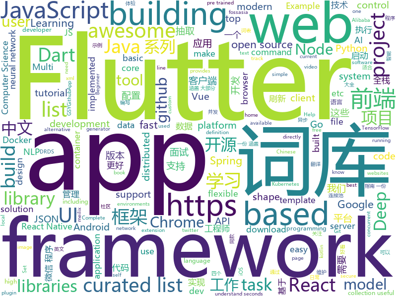

# 2018-11-22
See what the GitHub community is most excited about today.

## python
* [big-list-of-naughty-strings](https://github.com/minimaxir/big-list-of-naughty-strings)(**274 stars today**): The Big List of Naughty Strings is a list of strings which have a high probability of causing issues when used as user-input data.
* [funNLP](https://github.com/fighting41love/funNLP)(**133 stars today**): 中英文敏感词、语言检测、中外手机/电话归属地/运营商查询、名字推断性别、手机号抽取、身份证抽取、邮箱抽取、中日文人名库、中文缩写库、拆字词典、词汇情感值、停用词、反动词表、暴恐词表、繁简体转换、英文模拟中文发音、汪峰歌词生成器、职业名称词库、同义词库、反义词库、否定词库、汽车品牌&零件词库、时间抽取、连续英文切割、中文词向量大全、公司名字大全、古诗词库、IT词库、财经词库、成语词库、地名词库、历史名人词库、诗词词库、医学词库、饮食词库、法律词库、汽车词库、动物词库、中文聊天语料、中文谣言数据。
* [hmtl](https://github.com/huggingface/hmtl)(**138 stars today**): 🌊HMTL: Hierarchical Multi-Task Learning - A State-of-the-Art neural network model for several NLP tasks based on PyTorch and AllenNLP
* [bert](https://github.com/google-research/bert)(**98 stars today**): TensorFlow code and pre-trained models for BERT
* [jax](https://github.com/google/jax)(**102 stars today**): 
* [models](https://github.com/tensorflow/models)(**68 stars today**): Models and examples built with TensorFlow
* [self_driving_pi_car](https://github.com/felipessalvatore/self_driving_pi_car)(**83 stars today**): A deep neural network based self-driving car, that combines Lego Mindstorms NXT with the computational power of a Raspberry Pi 3.
* [Python](https://github.com/TheAlgorithms/Python)(**65 stars today**): All Algorithms implemented in Python
* [awesome-python](https://github.com/vinta/awesome-python)(**54 stars today**): A curated list of awesome Python frameworks, libraries, software and resources
* [chartify](https://github.com/spotify/chartify)(**57 stars today**): Python library that makes it easy for data scientists to create charts.
* [DeOldify](https://github.com/jantic/DeOldify)(**51 stars today**): A Deep Learning based project for colorizing and restoring old images
* [django](https://github.com/django/django)(**38 stars today**): The Web framework for perfectionists with deadlines.
* [public-apis](https://github.com/toddmotto/public-apis)(**45 stars today**): A collective list of public JSON APIs for use in web development.
* [keras](https://github.com/keras-team/keras)(**35 stars today**): Deep Learning for humans
* [q](https://github.com/harelba/q)(**45 stars today**): q - Run SQL directly on CSV or TSV files
* [home-assistant](https://github.com/home-assistant/home-assistant)(**40 stars today**): 🏡Open source home automation that puts local control and privacy first
* [youtube-dl](https://github.com/rg3/youtube-dl)(**42 stars today**): Command-line program to download videos from YouTube.com and other video sites
* [system-design-primer](https://github.com/donnemartin/system-design-primer)(**40 stars today**): Learn how to design large-scale systems. Prep for the system design interview. Includes Anki flashcards.
* [fsauor2018](https://github.com/xueyouluo/fsauor2018)(**39 stars today**): Code for Fine-grained Sentiment Analysis of User Reviews of AI Challenger 2018
* [face_recognition](https://github.com/ageitgey/face_recognition)(**32 stars today**): The world's simplest facial recognition api for Python and the command line
* [DeepCreamPy](https://github.com/deeppomf/DeepCreamPy)(**31 stars today**): Decensoring Hentai with Deep Neural Networks
* [XSStrike](https://github.com/s0md3v/XSStrike)(**35 stars today**): Most advanced XSS detection suite.
* [Python](https://github.com/geekcomputers/Python)(**29 stars today**): My Python Examples
* [flask](https://github.com/pallets/flask)(**30 stars today**): The Python micro framework for building web applications.
* [httpie](https://github.com/jakubroztocil/httpie)(****): Modern command line HTTP client – user-friendly curl alternative with intuitive UI, JSON support, syntax highlighting, wget-like downloads, extensions, etc. https://twitter.com/clihttp

## java
* [coderiver](https://github.com/cachecats/coderiver)(**215 stars today**): 致力于打造全平台全栈精品开源项目，计划做成包含 pc端（Vue、React）、移动H5（Vue、React）、ReactNative混合开发、Android原生、微信小程序、java后端的全平台型全栈项目，欢迎关注。
* [JavaGuide](https://github.com/Snailclimb/JavaGuide)(**105 stars today**): 【Java学习+面试指南】 一份涵盖大部分Java程序员所需要掌握的核心知识。
* [soul](https://github.com/Dromara/soul)(**94 stars today**): 这是一个高性能，异步的响应式的gateway
* [litemall](https://github.com/linlinjava/litemall)(**92 stars today**): 又一个小商城。litemall = Spring Boot后端 + Vue管理员前端 + 微信小程序用户前端
* [spring-cloud-alibaba](https://github.com/spring-cloud-incubator/spring-cloud-alibaba)(**95 stars today**): Spring Cloud Alibaba provides a one-stop solution for application development for the distributed solutions of Alibaba middleware.
* [spring-boot](https://github.com/spring-projects/spring-boot)(**58 stars today**): Spring Boot
* [java-design-patterns](https://github.com/iluwatar/java-design-patterns)(**52 stars today**): Design patterns implemented in Java
* [interviews](https://github.com/kdn251/interviews)(**47 stars today**): Everything you need to know to get the job.
* [symphony](https://github.com/b3log/symphony)(**47 stars today**): 🎶一款用 Java 实现的现代化社区（论坛/BBS/社交网络/博客）平台。https://hacpai.com
* [proxyee-down](https://github.com/proxyee-down-org/proxyee-down)(**43 stars today**): http下载工具，基于http代理，支持多连接分块下载
* [JCSprout](https://github.com/crossoverJie/JCSprout)(**42 stars today**): 👨‍🎓Java Core Sprout : basic, concurrent, algorithm
* [Sentinel](https://github.com/alibaba/Sentinel)(**42 stars today**): A lightweight flow-control library providing high-available protection and monitoring (高可用防护的流量管理框架)
* [spring-framework](https://github.com/spring-projects/spring-framework)(**24 stars today**): Spring Framework
* [guava](https://github.com/google/guava)(**37 stars today**): Google core libraries for Java
* [tutorials](https://github.com/eugenp/tutorials)(**19 stars today**): The "REST With Spring" Course:
* [APIJSON](https://github.com/TommyLemon/APIJSON)(**37 stars today**): 🚀后端接口和文档自动化，前端(客户端) 定制返回JSON的数据和结构！
* [conjure](https://github.com/palantir/conjure)(**38 stars today**): Strongly typed HTTP/JSON APIs for browsers and microservices
* [elasticsearch](https://github.com/elastic/elasticsearch)(**32 stars today**): Open Source, Distributed, RESTful Search Engine
* [incubator-dubbo](https://github.com/apache/incubator-dubbo)(**28 stars today**): Apache Dubbo (incubating) is a high-performance, java based, open source RPC framework.
* [apollo](https://github.com/ctripcorp/apollo)(**30 stars today**): Apollo（阿波罗）是携程框架部门研发的分布式配置中心，能够集中化管理应用不同环境、不同集群的配置，配置修改后能够实时推送到应用端，并且具备规范的权限、流程治理等特性，适用于微服务配置管理场景。
* [SmartRefreshLayout](https://github.com/scwang90/SmartRefreshLayout)(**34 stars today**): 🔥下拉刷新、上拉加载、二级刷新、淘宝二楼、RefreshLayout、OverScroll，Android智能下拉刷新框架，支持越界回弹、越界拖动，具有极强的扩展性，集成了几十种炫酷的Header和 Footer。
* [BackgroundLibrary](https://github.com/JavaNoober/BackgroundLibrary)(**29 stars today**): A framework for directly generating shape through Tags, no need to write shape.xml again（通过标签直接生成shape，无需再写shape.xml）
* [corretto-8](https://github.com/corretto/corretto-8)(**30 stars today**): Amazon Corretto is a no-cost, multi-platform, production-ready distribution of OpenJDK
* [druid](https://github.com/alibaba/druid)(**23 stars today**): 阿里巴巴数据库事业部出品，为监控而生的数据库连接池。2018年开源中国最受欢迎开源软件评选请参与投票 https://www.oschina.net/project/top_cn_2018 阿里云DRDS(https://www.aliyun.com/product/drds )、阿里巴巴TDDL 连接池powered by Druid
* [Java](https://github.com/TheAlgorithms/Java)(**24 stars today**): All Algorithms implemented in Java

## unknown
* [awesome-f2e-libs](https://github.com/sorrycc/awesome-f2e-libs)(**139 stars today**): 🎉整理我平时关注的前端库。
* [CS-Notes](https://github.com/CyC2018/CS-Notes)(**91 stars today**): 📚Computer Science Learning Notes
* [AD-Attack-Defense](https://github.com/infosecn1nja/AD-Attack-Defense)(**91 stars today**): Active Directory Security For Red & Blue Team
* [build-your-own-x](https://github.com/danistefanovic/build-your-own-x)(**79 stars today**): 🤓Build your own (insert technology here)
* [You-Dont-Know-JS](https://github.com/getify/You-Dont-Know-JS)(**70 stars today**): A book series on JavaScript. @YDKJS on twitter.
* [awful-ai](https://github.com/daviddao/awful-ai)(**76 stars today**): 😈Awful AI is a curated list to track current scary usages of AI - hoping to raise awareness
* [gitignore](https://github.com/github/gitignore)(**55 stars today**): A collection of useful .gitignore templates
* [awesome](https://github.com/sindresorhus/awesome)(**59 stars today**): 😎Curated list of awesome lists
* [free-programming-books](https://github.com/EbookFoundation/free-programming-books)(**52 stars today**): 📚Freely available programming books
* [awesome-vue](https://github.com/vuejs/awesome-vue)(**45 stars today**): 🎉A curated list of awesome things related to Vue.js
* [coding-interview-university](https://github.com/jwasham/coding-interview-university)(**36 stars today**): A complete computer science study plan to become a software engineer.
* [Awesome-pytorch-list](https://github.com/bharathgs/Awesome-pytorch-list)(**31 stars today**): A comprehensive list of pytorch related content on github,such as different models,implementations,helper libraries,tutorials etc.
* [project-based-learning](https://github.com/tuvtran/project-based-learning)(**30 stars today**): Curated list of project-based tutorials
* [Blog](https://github.com/mqyqingfeng/Blog)(**25 stars today**): 冴羽写博客的地方，预计写四个系列：JavaScript深入系列、JavaScript专题系列、ES6系列、React系列。
* [2019_campus_apply](https://github.com/frank-lam/2019_campus_apply)(**26 stars today**): 🚀Full Stack Developer Tutorial，后台技术栈/全栈开发/架构师之路，秋招/春招/校招/面试。 from zero to hero.
* [React-Native-Apps](https://github.com/ReactNativeNews/React-Native-Apps)(**27 stars today**): Curated List of Open Source React Native Apps
* [computer-science](https://github.com/ossu/computer-science)(**26 stars today**): 🎓Path to a free self-taught education in Computer Science!
* [Data-Competition-TopSolution](https://github.com/Smilexuhc/Data-Competition-TopSolution)(**24 stars today**): Data competition Top Solution 数据竞赛top解决方案开源整理
* [awesome-burp-extensions](https://github.com/snoopysecurity/awesome-burp-extensions)(**25 stars today**): A curated list of amazingly awesome Burp Extensions
* [git-flight-rules](https://github.com/k88hudson/git-flight-rules)(**23 stars today**): Flight rules for git
* [nodebestpractices](https://github.com/i0natan/nodebestpractices)(**23 stars today**): The largest Node.JS best practices list (November 2018)
* [FEGuide](https://github.com/nanhupatar/FEGuide)(**21 stars today**): 【前端面试题+前端学习+面试指南】 一份涵盖大部分前端工程师所需要掌握的核心知识。这个项目就是为了帮助那些找工作的前端开发工程师去回顾前端的基础知识，如果你不想找工作，也可以通过查看这些面试问题去巩固你的前端技能。
* [gold-miner](https://github.com/xitu/gold-miner)(**22 stars today**): 🥇掘金翻译计划，可能是世界最大最好的英译中技术社区，最懂读者和译者的翻译平台：
* [first-contributions](https://github.com/firstcontributions/first-contributions)(**13 stars today**): 🚀✨Help beginners to contribute to open source projects
* [git-recipes](https://github.com/geeeeeeeeek/git-recipes)(**21 stars today**): 🥡 Git recipes in Chinese by Zhongyi Tong. 高质量的Git中文教程.

## javascript
* [htm](https://github.com/developit/htm)(**1,096 stars today**): Hyperscript Tagged Markup: JSX alternative using standard tagged templates, with compiler support.
* [edex-ui](https://github.com/GitSquared/edex-ui)(**675 stars today**): A science fiction desktop running everywhere. Awesome.
* [style2paints](https://github.com/lllyasviel/style2paints)(**317 stars today**): sketch + style = paints🎨
* [33-js-concepts](https://github.com/stephentian/33-js-concepts)(**239 stars today**): 📜每个 JavaScript 工程师都应懂的33个概念 @leonardomso
* [33-js-concepts](https://github.com/leonardomso/33-js-concepts)(**214 stars today**): 📜33 concepts every JavaScript developer should know.
* [DoodleMaster](https://github.com/karanchahal/DoodleMaster)(**222 stars today**): "Don't code your UI, Draw it !"
* [imba](https://github.com/somebee/imba)(**167 stars today**): The new programming language for web apps
* [vue](https://github.com/vuejs/vue)(**150 stars today**): 🖖A progressive, incrementally-adoptable JavaScript framework for building UI on the web.
* [slate](https://github.com/ianstormtaylor/slate)(**128 stars today**): A completely customizable framework for building rich text editors.
* [nivo](https://github.com/plouc/nivo)(**123 stars today**): nivo provides a rich set of dataviz components, built on top of the awesome d3 and Reactjs libraries
* [react](https://github.com/facebook/react)(**110 stars today**): A declarative, efficient, and flexible JavaScript library for building user interfaces.
* [30-seconds-of-code](https://github.com/30-seconds/30-seconds-of-code)(**90 stars today**): Curated collection of useful JavaScript snippets that you can understand in 30 seconds or less.
* [virtual-scroller](https://github.com/valdrinkoshi/virtual-scroller)(**91 stars today**): 
* [ProjectVisBug](https://github.com/GoogleChromeLabs/ProjectVisBug)(**79 stars today**): 🎨Make any webpage feel like an artboard, download extension here https://chrome.google.com/webstore/detail/cdockenadnadldjbbgcallicgledbeoc
* [vs](https://github.com/anvaka/vs)(**74 stars today**): Visualization of Google's autocomplete
* [react-beautiful-dnd](https://github.com/atlassian/react-beautiful-dnd)(**71 stars today**): Beautiful and accessible drag and drop for lists with React
* [taro](https://github.com/NervJS/taro)(**65 stars today**): 多端统一开发框架，支持用 React 的开发方式编写一次代码，生成能运行在微信小程序/百度智能小程序/支付宝小程序、H5、React Native 等的应用。
* [axios](https://github.com/axios/axios)(**62 stars today**): Promise based HTTP client for the browser and node.js
* [material-ui](https://github.com/mui-org/material-ui)(**55 stars today**): React components that implement Google's Material Design.
* [swup](https://github.com/gmrchk/swup)(**63 stars today**): Complete, flexible, easy to use page transition library.
* [create-react-app](https://github.com/facebook/create-react-app)(**48 stars today**): Set up a modern web app by running one command.
* [puppeteer](https://github.com/GoogleChrome/puppeteer)(**54 stars today**): Headless Chrome Node API
* [tensorspace](https://github.com/tensorspace-team/tensorspace)(**56 stars today**): Neural network 3D visualization framework, build interactive and intuitive model in browsers, support pre-trained deep learning models from TensorFlow, Keras, TensorFlow.js
* [carlo](https://github.com/GoogleChromeLabs/carlo)(**52 stars today**): Web rendering surface for Node applications
* [gatsby](https://github.com/gatsbyjs/gatsby)(**48 stars today**): Build blazing fast, modern apps and websites with React

## html
* [nginxconfig.io](https://github.com/valentinxxx/nginxconfig.io)(**472 stars today**): ⚙️NGiИX config generator generator on steroids💉
* [concurrency-glossary](https://github.com/slikts/concurrency-glossary)(**93 stars today**): 🦑Informal definitions of terms used in concurrency modeling
* [alpha](https://github.com/alibaba/alpha)(**49 stars today**): Alpha是一个基于PERT图构建的Android异步启动框架，它简单，高效，功能完善。 在应用启动的时候，我们通常会有很多工作需要做，为了提高启动速度，我们会尽可能让这些工作并发进行。但这些工作之间可能存在前后依赖的关系，所以我们又需要想办法保证他们执行顺序的正确性。Alpha就是为此而设计的，使用者只需定义好自己的task，并描述它依赖的task，将它添加到Project中。框架会自动并发有序地执行这些task，并将执行的结果抛出来。
* [shan-shui-inf](https://github.com/LingDong-/shan-shui-inf)(**41 stars today**): Procedurally generated Chinese landscape painting.
* [Coursera-ML-AndrewNg-Notes](https://github.com/fengdu78/Coursera-ML-AndrewNg-Notes)(**29 stars today**): 吴恩达老师的机器学习课程个人笔记
* [CSS-file-icons](https://github.com/colorswall/CSS-file-icons)(**27 stars today**): Pure CSS icons for popular file extensions
* [styleguide](https://github.com/google/styleguide)(**19 stars today**): Style guides for Google-originated open-source projects
* [JavaScript30](https://github.com/wesbos/JavaScript30)(**14 stars today**): 30 Day Vanilla JS Challenge
* [NLP-progress](https://github.com/sebastianruder/NLP-progress)(**18 stars today**): Repository to track the progress in Natural Language Processing (NLP), including the datasets and the current state-of-the-art for the most common NLP tasks.
* [fastText](https://github.com/facebookresearch/fastText)(**16 stars today**): Library for fast text representation and classification.
* [AdminLTE](https://github.com/almasaeed2010/AdminLTE)(**14 stars today**): AdminLTE - Free Premium Admin control Panel Theme Based On Bootstrap 3.x
* [30-seconds-of-css](https://github.com/30-seconds/30-seconds-of-css)(**16 stars today**): A curated collection of useful CSS snippets you can understand in 30 seconds or less.
* [Spoon-Knife](https://github.com/octocat/Spoon-Knife)(****): This repo is for demonstration purposes only.
* [2019.fossasia.org](https://github.com/fossasia/2019.fossasia.org)(**14 stars today**): FOSSASIA Summit 2019 https://2019.fossasia.org
* [swagger-codegen](https://github.com/swagger-api/swagger-codegen)(**14 stars today**): swagger-codegen contains a template-driven engine to generate documentation, API clients and server stubs in different languages by parsing your OpenAPI / Swagger definition.
* [meilix-generator](https://github.com/fossasia/meilix-generator)(**14 stars today**): WebApp for generating a custom ISO image based on Meilix http://meilix.org
* [react-redux](https://github.com/reduxjs/react-redux)(**13 stars today**): Official React bindings for Redux
* [solid](https://github.com/solid/solid)(**12 stars today**): Solid - Re-decentralizing the web (project directory)
* [electron-api-demos](https://github.com/electron/electron-api-demos)(**10 stars today**): Explore the Electron APIs
* [portainer](https://github.com/portainer/portainer)(**11 stars today**): Simple management UI for Docker
* [nndl.github.io](https://github.com/nndl/nndl.github.io)(**10 stars today**): 《神经网络与深度学习》 Neural Network and Deep Learning
* [BabySploit](https://github.com/M4cs/BabySploit)(**10 stars today**): BabySploit Beginner Pentesting Toolkit/Framework Written in Python
* [eatwhat](https://github.com/MetaWeng/eatwhat)(**10 stars today**): 
* [EIPs](https://github.com/ethereum/EIPs)(**7 stars today**): The Ethereum Improvement Proposal repository
* [home-assistant.io](https://github.com/home-assistant/home-assistant.io)(**8 stars today**): 📘Home Assistant User documentation

## dart
* [flutter](https://github.com/flutter/flutter)(**73 stars today**): Flutter makes it easy and fast to build beautiful mobile apps.
* [awesome-flutter](https://github.com/Solido/awesome-flutter)(**31 stars today**): An awesome list that curates the best Flutter libraries, tools, tutorials, articles and more.
* [cool_ui](https://github.com/Im-Kevin/cool_ui)(**14 stars today**): 用flutter实现一些我认为好看的UI控件,有觉得好看的UI控件可以提出来,我会考虑实现
* [plugins](https://github.com/flutter/plugins)(**10 stars today**): Plugins for Flutter, including FlutterFire, maintained by the Flutter team
* [flutter-examples](https://github.com/nisrulz/flutter-examples)(**12 stars today**): [Examples] Simple basic isolated apps, for budding flutter devs.
* [Flutter-Notebook](https://github.com/OpenFlutter/Flutter-Notebook)(**11 stars today**): 日更的FlutterDemo合集，今天你fu了吗
* [dio](https://github.com/flutterchina/dio)(**10 stars today**): A powerful Http client for Dart, which supports Interceptors, FormData, Request Cancellation, File Downloading, Timeout etc.
* [GSYGithubAppFlutter](https://github.com/CarGuo/GSYGithubAppFlutter)(**10 stars today**): 超完整的Flutter项目，功能丰富，适合学习和日常使用。GSYGithubApp系列的优势：我们目前已经拥有Flutter、Weex、ReactNative、kotlin 四个版本。 功能齐全，项目框架内技术涉及面广，完成度高，持续维护，配套文章，适合全面学习，对比参考。跨平台的开源Github客户端App，更好的体验，更丰富的功能，旨在更好的日常管理和维护个人Github，提供更好更方便的驾车体验Σ(￣。￣ﾉ)ﾉ。同款Weex版本 ： https://github.com/CarGuo/GSYGithubAppWeex 、同款React Native版本 ： https://github.com/CarGuo/GSYGithubApp 、原生 kotlin 版本 https://g…
* [Flutter-learning](https://github.com/AweiLoveAndroid/Flutter-learning)(**9 stars today**): 🔥👍🌟⭐️⭐️⭐️Flutter安装和配置，Flutter开发遇到的难题，Flutter示例代码和模板，Flutter项目实战，Dart语言学习示例代码。
* [flutter_architecture_samples](https://github.com/brianegan/flutter_architecture_samples)(**8 stars today**): TodoMVC for Flutter
* [Flutter-UI-Kit](https://github.com/iampawan/Flutter-UI-Kit)(**7 stars today**): Flutter app for collection of UI in a UIKit
* [sdk](https://github.com/dart-lang/sdk)(**5 stars today**): The Dart SDK, including the VM, dart2js, core libraries, and more.
* [TheGorgeousLogin](https://github.com/huextrat/TheGorgeousLogin)(****): Login page built with @flutter😍
* [flushbar](https://github.com/AndreHaueisen/flushbar)(****): Custom widget for Flutter
* [language](https://github.com/dart-lang/language)(****): 
* [trex-flame](https://github.com/renancaraujo/trex-flame)(****): Flutter port of the famous Trex game
* [flutter_blue](https://github.com/pauldemarco/flutter_blue)(****): Bluetooth plugin for Flutter
* [node-interop](https://github.com/pulyaevskiy/node-interop)(****): Interop library for writing Node.js apps and modules in Dart.
* [chromedeveditor](https://github.com/googlearchive/chromedeveditor)(****): Chrome Dev Editor is a developer tool for building apps on the Chrome platform - Chrome Apps and Web Apps, in JavaScript or Dart. (NO LONGER IN ACTIVE DEVELOPMENT)
* [FlutterExampleApps](https://github.com/iampawan/FlutterExampleApps)(****): [Example APPS] Basic Flutter apps, for flutter devs.
* [flutter-osc](https://github.com/yubo725/flutter-osc)(****): 基于Google Flutter的开源中国客户端，支持Android和iOS。
* [inKino](https://github.com/roughike/inKino)(****): A multiplatform Dart movie app with 40% of code sharing between Flutter and the Web.
* [zhihu-flutter](https://github.com/HackSoul/zhihu-flutter)(****): Flutter 高仿知乎 UI，非常漂亮，也非常流畅，flutter build apk 或 flutter build ios 之后更流畅
* [hauberk](https://github.com/munificent/hauberk)(****): A web-based roguelike written in Dart.
* [angular](https://github.com/dart-lang/angular)(****): Fast and productive web framework provided by Dart

## go
* [blb](https://github.com/westerndigitalcorporation/blb)(**296 stars today**): Blb is a distributed object storage system designed for use on bare metal in cluster computing environments.
* [lorca](https://github.com/zserge/lorca)(**153 stars today**): Build cross-platform modern desktop apps in Go + HTML5
* [kubernetes](https://github.com/kubernetes/kubernetes)(**65 stars today**): Production-Grade Container Scheduling and Management
* [awesome-go](https://github.com/avelino/awesome-go)(**45 stars today**): A curated list of awesome Go frameworks, libraries and software
* [frp](https://github.com/fatedier/frp)(**39 stars today**): A fast reverse proxy to help you expose a local server behind a NAT or firewall to the internet.
* [go](https://github.com/golang/go)(**39 stars today**): The Go programming language
* [moby](https://github.com/moby/moby)(**39 stars today**): Moby Project - a collaborative project for the container ecosystem to assemble container-based systems
* [mmh](https://github.com/mritd/mmh)(**41 stars today**): A simple Multi-server ssh tool
* [BaiduPCS-Go](https://github.com/iikira/BaiduPCS-Go)(**36 stars today**): 百度网盘客户端 - Go语言编写
* [istio](https://github.com/istio/istio)(**34 stars today**): Connect, secure, control, and observe services.
* [buildkit](https://github.com/moby/buildkit)(**35 stars today**): concurrent, cache-efficient, and Dockerfile-agnostic builder toolkit
* [dive](https://github.com/wagoodman/dive)(**35 stars today**): A tool for exploring each layer in a docker image
* [out-of-tree](https://github.com/jollheef/out-of-tree)(**33 stars today**): out-of-tree kernel {module, exploit} development tool
* [v2ray-core](https://github.com/v2ray/v2ray-core)(**29 stars today**): A platform for building proxies to bypass network restrictions.
* [webtty](https://github.com/maxmcd/webtty)(**33 stars today**): Share a terminal session over WebRTC
* [quic-go](https://github.com/lucas-clemente/quic-go)(**34 stars today**): A QUIC implementation in pure go
* [gocc](https://github.com/goccmack/gocc)(**34 stars today**): Parser / Scanner Generator
* [helm](https://github.com/helm/helm)(**29 stars today**): The Kubernetes Package Manager
* [build-web-application-with-golang](https://github.com/astaxie/build-web-application-with-golang)(**28 stars today**): A golang ebook intro how to build a web with golang
* [soar](https://github.com/XiaoMi/soar)(**30 stars today**): SQL Optimizer And Rewriter
* [titan](https://github.com/meitu/titan)(**30 stars today**): A Distributed Redis Protocol Compatible NoSQL Database
* [makisu](https://github.com/uber/makisu)(**31 stars today**): Fast and flexible Docker image building tool, works on OSX and in containerized environments like Kubernetes.
* [hugo](https://github.com/gohugoio/hugo)(**30 stars today**): The world’s fastest framework for building websites.
* [linuxkit](https://github.com/linuxkit/linuxkit)(**30 stars today**): A toolkit for building secure, portable and lean operating systems for containers
* [watermill](https://github.com/ThreeDotsLabs/watermill)(**29 stars today**): Go library for building event-driven applications.

## WordCloud

