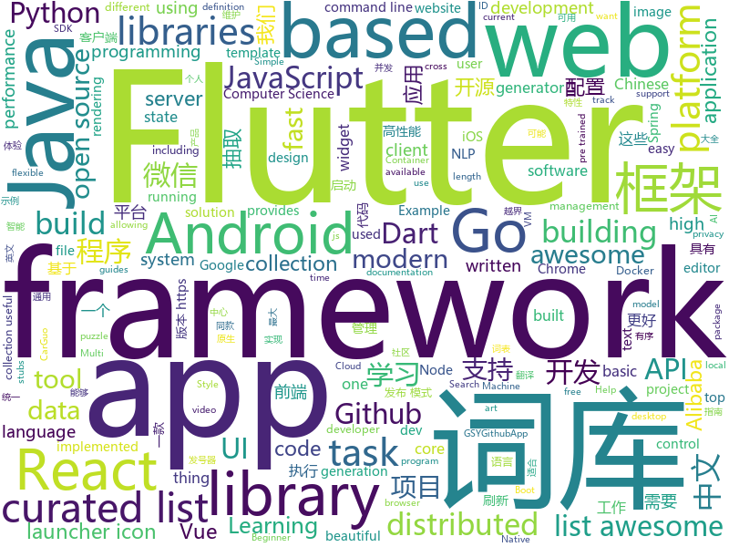

# 2018-11-23
See what the GitHub community is most excited about today.

## python
* [big-list-of-naughty-strings](https://github.com/minimaxir/big-list-of-naughty-strings)(**169 stars today**): The Big List of Naughty Strings is a list of strings which have a high probability of causing issues when used as user-input data.
* [funNLP](https://github.com/fighting41love/funNLP)(**142 stars today**): 中英文敏感词、语言检测、中外手机/电话归属地/运营商查询、名字推断性别、手机号抽取、身份证抽取、邮箱抽取、中日文人名库、中文缩写库、拆字词典、词汇情感值、停用词、反动词表、暴恐词表、繁简体转换、英文模拟中文发音、汪峰歌词生成器、职业名称词库、同义词库、反义词库、否定词库、汽车品牌&零件词库、时间抽取、连续英文切割、中文词向量大全、公司名字大全、古诗词库、IT词库、财经词库、成语词库、地名词库、历史名人词库、诗词词库、医学词库、饮食词库、法律词库、汽车词库、动物词库、中文聊天语料、中文谣言数据。
* [bert-as-service](https://github.com/hanxiao/bert-as-service)(**126 stars today**): Mapping a variable-length sentence to a fixed-length vector using pretrained BERT model
* [bert](https://github.com/google-research/bert)(**121 stars today**): TensorFlow code and pre-trained models for BERT
* [AutoCrawler](https://github.com/YoongiKim/AutoCrawler)(**91 stars today**): Google, Naver multiprocess image web crawler (Selenium)
* [PySyft](https://github.com/OpenMined/PySyft)(**91 stars today**): A library for encrypted, privacy preserving deep learning
* [models](https://github.com/tensorflow/models)(**59 stars today**): Models and examples built with TensorFlow
* [Base](https://github.com/john-smith-19/Base)(**76 stars today**): Base python library
* [Python](https://github.com/TheAlgorithms/Python)(**65 stars today**): All Algorithms implemented in Python
* [hmtl](https://github.com/huggingface/hmtl)(**69 stars today**): 🌊HMTL: Hierarchical Multi-Task Learning - A State-of-the-Art neural network model for several NLP tasks based on PyTorch and AllenNLP
* [awesome-python](https://github.com/vinta/awesome-python)(**64 stars today**): A curated list of awesome Python frameworks, libraries, software and resources
* [rl-baselines-zoo](https://github.com/araffin/rl-baselines-zoo)(**59 stars today**): A collection of pre-trained RL agents using Stable Baselines
* [jax](https://github.com/google/jax)(**59 stars today**): 
* [keras](https://github.com/keras-team/keras)(**47 stars today**): Deep Learning for humans
* [system-design-primer](https://github.com/donnemartin/system-design-primer)(**47 stars today**): Learn how to design large-scale systems. Prep for the system design interview. Includes Anki flashcards.
* [youtube-dl](https://github.com/rg3/youtube-dl)(**43 stars today**): Command-line program to download videos from YouTube.com and other video sites
* [chartify](https://github.com/spotify/chartify)(**46 stars today**): Python library that makes it easy for data scientists to create charts.
* [public-apis](https://github.com/toddmotto/public-apis)(**39 stars today**): A collective list of public JSON APIs for use in web development.
* [face_recognition](https://github.com/ageitgey/face_recognition)(**32 stars today**): The world's simplest facial recognition api for Python and the command line
* [home-assistant](https://github.com/home-assistant/home-assistant)(**34 stars today**): 🏡Open source home automation that puts local control and privacy first
* [Python](https://github.com/geekcomputers/Python)(**31 stars today**): My Python Examples
* [django](https://github.com/django/django)(**31 stars today**): The Web framework for perfectionists with deadlines.
* [awesome-machine-learning](https://github.com/josephmisiti/awesome-machine-learning)(**28 stars today**): A curated list of awesome Machine Learning frameworks, libraries and software.
* [scikit-learn](https://github.com/scikit-learn/scikit-learn)(**23 stars today**): scikit-learn: machine learning in Python
* [flask](https://github.com/pallets/flask)(****): The Python micro framework for building web applications.

## java
* [coderiver](https://github.com/cachecats/coderiver)(**129 stars today**): 致力于打造全平台全栈精品开源项目，计划做成包含 pc端（Vue、React）、移动H5（Vue、React）、ReactNative混合开发、Android原生、微信小程序、java后端的全平台型全栈项目，欢迎关注。
* [litemall](https://github.com/linlinjava/litemall)(**114 stars today**): 又一个小商城。litemall = Spring Boot后端 + Vue管理员前端 + 微信小程序用户前端
* [JavaGuide](https://github.com/Snailclimb/JavaGuide)(**106 stars today**): 【Java学习+面试指南】 一份涵盖大部分Java程序员所需要掌握的核心知识。
* [spring-cloud-alibaba](https://github.com/spring-cloud-incubator/spring-cloud-alibaba)(**103 stars today**): Spring Cloud Alibaba provides a one-stop solution for application development for the distributed solutions of Alibaba middleware.
* [AndroidModuleDemo](https://github.com/wutq/AndroidModuleDemo)(**67 stars today**): 基于MVP搭建的组件化开发框架
* [vesta-id-generator](https://github.com/cloudatee/vesta-id-generator)(**56 stars today**): Vesta是一款通用的ID产生器，互联网俗称统一发号器，它具有全局唯一、粗略有序、可反解和可制造等特性，它支持三种发布模式：嵌入发布模式、中心服务器发布模式、REST发 布模式，根据业务的性能需求，它可以产生最大峰值型和最小粒度型两种类型的ID，它的实现架构使其具有高性能，高可用和可伸缩等互联网产品需要的质量属性，是一款通用的高性能的发号器产品。
* [java-design-patterns](https://github.com/iluwatar/java-design-patterns)(**49 stars today**): Design patterns implemented in Java
* [symphony](https://github.com/b3log/symphony)(**48 stars today**): 🎶一款用 Java 实现的现代化社区（论坛/BBS/社交网络/博客）平台。https://hacpai.com
* [spring-boot](https://github.com/spring-projects/spring-boot)(**35 stars today**): Spring Boot
* [soul](https://github.com/Dromara/soul)(**40 stars today**): 这是一个高性能，异步的响应式的gateway
* [UltimateAndroidReference](https://github.com/aritraroy/UltimateAndroidReference)(**39 stars today**): 🚀Ultimate Android Reference - Your Road to Become a Better Android Developer
* [JCSprout](https://github.com/crossoverJie/JCSprout)(**35 stars today**): 👨‍🎓Java Core Sprout : basic, concurrent, algorithm
* [tutorials](https://github.com/eugenp/tutorials)(**23 stars today**): The "REST With Spring" Course:
* [apollo](https://github.com/ctripcorp/apollo)(**32 stars today**): Apollo（阿波罗）是携程框架部门研发的分布式配置中心，能够集中化管理应用不同环境、不同集群的配置，配置修改后能够实时推送到应用端，并且具备规范的权限、流程治理等特性，适用于微服务配置管理场景。
* [arthas](https://github.com/alibaba/arthas)(**31 stars today**): Alibaba Java Diagnostic Tool Arthas/Alibaba Java诊断利器Arthas
* [Java](https://github.com/TheAlgorithms/Java)(**27 stars today**): All Algorithms implemented in Java
* [elasticsearch](https://github.com/elastic/elasticsearch)(**26 stars today**): Open Source, Distributed, RESTful Search Engine
* [guava](https://github.com/google/guava)(**26 stars today**): Google core libraries for Java
* [spring-framework](https://github.com/spring-projects/spring-framework)(**21 stars today**): Spring Framework
* [weixin-java-tools](https://github.com/Wechat-Group/weixin-java-tools)(**25 stars today**): 全能微信Java开发工具包，支持包括微信支付、开放平台、小程序、企业微信/企业号和公众号等的后端开发
* [SmartRefreshLayout](https://github.com/scwang90/SmartRefreshLayout)(**25 stars today**): 🔥下拉刷新、上拉加载、二级刷新、淘宝二楼、RefreshLayout、OverScroll，Android智能下拉刷新框架，支持越界回弹、越界拖动，具有极强的扩展性，集成了几十种炫酷的Header和 Footer。
* [Dragonfly](https://github.com/dragonflyoss/Dragonfly)(**24 stars today**): Dragonfly is an intelligent P2P based image and file distribution system.
* [incubator-dubbo](https://github.com/apache/incubator-dubbo)(**17 stars today**): Apache Dubbo (incubating) is a high-performance, java based, open source RPC framework.
* [Sentinel](https://github.com/alibaba/Sentinel)(**21 stars today**): A lightweight flow-control library providing high-available protection and monitoring (高可用防护的流量管理框架)
* [RxJava](https://github.com/ReactiveX/RxJava)(**23 stars today**): RxJava – Reactive Extensions for the JVM – a library for composing asynchronous and event-based programs using observable sequences for the Java VM.

## unknown
* [CS-Notes](https://github.com/CyC2018/CS-Notes)(**117 stars today**): 📚Computer Science Learning Notes
* [gitignore](https://github.com/github/gitignore)(**63 stars today**): A collection of useful .gitignore templates
* [awesome-f2e-libs](https://github.com/sorrycc/awesome-f2e-libs)(**75 stars today**): 🎉整理我平时关注的前端库。
* [awesome](https://github.com/sindresorhus/awesome)(**72 stars today**): 😎Curated list of awesome lists
* [free-programming-books](https://github.com/EbookFoundation/free-programming-books)(**58 stars today**): 📚Freely available programming books
* [You-Dont-Know-JS](https://github.com/getify/You-Dont-Know-JS)(**57 stars today**): A book series on JavaScript. @YDKJS on twitter.
* [awesome-vue](https://github.com/vuejs/awesome-vue)(**49 stars today**): 🎉A curated list of awesome things related to Vue.js
* [AD-Attack-Defense](https://github.com/infosecn1nja/AD-Attack-Defense)(**37 stars today**): Active Directory Security For Red & Blue Team
* [awful-ai](https://github.com/daviddao/awful-ai)(**39 stars today**): 😈Awful AI is a curated list to track current scary usages of AI - hoping to raise awareness
* [build-your-own-x](https://github.com/danistefanovic/build-your-own-x)(**38 stars today**): 🤓Build your own (insert technology here)
* [coding-interview-university](https://github.com/jwasham/coding-interview-university)(**31 stars today**): A complete computer science study plan to become a software engineer.
* [weekly](https://github.com/dt-fe/weekly)(**34 stars today**): 前端精读周刊
* [L7](https://github.com/antvis/L7)(**37 stars today**): Large-scale WebGL-powered Geospatial Data Visualization
* [git-flight-rules](https://github.com/k88hudson/git-flight-rules)(**32 stars today**): Flight rules for git
* [infrastructure-as-code-tutorial](https://github.com/Artemmkin/infrastructure-as-code-tutorial)(**29 stars today**): Infrastructure As Code Tutorial. Covers Packer, Terraform, Ansible, Vagrant, Docker, Docker Compose, Kubernetes
* [THUOCL](https://github.com/thunlp/THUOCL)(**29 stars today**): THUOCL（THU Open Chinese Lexicon）中文词库
* [kubernetes-the-hard-way](https://github.com/kelseyhightower/kubernetes-the-hard-way)(**28 stars today**): Bootstrap Kubernetes the hard way on Google Cloud Platform. No scripts.
* [computer-science](https://github.com/ossu/computer-science)(**21 stars today**): 🎓Path to a free self-taught education in Computer Science!
* [project-based-learning](https://github.com/tuvtran/project-based-learning)(**21 stars today**): Curated list of project-based tutorials
* [awesome-react](https://github.com/enaqx/awesome-react)(**23 stars today**): A collection of awesome things regarding React ecosystem.
* [gold-miner](https://github.com/xitu/gold-miner)(**23 stars today**): 🥇掘金翻译计划，可能是世界最大最好的英译中技术社区，最懂读者和译者的翻译平台：
* [android-architecture](https://github.com/googlesamples/android-architecture)(**17 stars today**): A collection of samples to discuss and showcase different architectural tools and patterns for Android apps.
* [Data-Competition-TopSolution](https://github.com/Smilexuhc/Data-Competition-TopSolution)(**20 stars today**): Data competition Top Solution 数据竞赛top解决方案开源整理
* [first-contributions](https://github.com/firstcontributions/first-contributions)(**9 stars today**): 🚀✨Help beginners to contribute to open source projects
* [awesome-shell](https://github.com/alebcay/awesome-shell)(**21 stars today**): A curated list of awesome command-line frameworks, toolkits, guides and gizmos. Inspired by awesome-php.

## javascript
* [edex-ui](https://github.com/GitSquared/edex-ui)(**1,292 stars today**): A science fiction desktop running everywhere. Awesome.
* [htm](https://github.com/developit/htm)(**693 stars today**): Hyperscript Tagged Markup: JSX alternative using standard tagged templates, with compiler support.
* [nivo](https://github.com/plouc/nivo)(**252 stars today**): nivo provides a rich set of dataviz components, built on top of the awesome d3 and Reactjs libraries
* [style2paints](https://github.com/lllyasviel/style2paints)(**211 stars today**): sketch + style = paints🎨
* [33-js-concepts](https://github.com/stephentian/33-js-concepts)(**148 stars today**): 📜每个 JavaScript 工程师都应懂的33个概念 @leonardomso
* [DoodleMaster](https://github.com/karanchahal/DoodleMaster)(**140 stars today**): "Don't code your UI, Draw it !"
* [vue](https://github.com/vuejs/vue)(**129 stars today**): 🖖A progressive, incrementally-adoptable JavaScript framework for building UI on the web.
* [33-js-concepts](https://github.com/leonardomso/33-js-concepts)(**124 stars today**): 📜33 concepts every JavaScript developer should know.
* [imba](https://github.com/somebee/imba)(**119 stars today**): The new programming language for web apps
* [react](https://github.com/facebook/react)(**93 stars today**): A declarative, efficient, and flexible JavaScript library for building user interfaces.
* [30-seconds-of-code](https://github.com/30-seconds/30-seconds-of-code)(**97 stars today**): Curated collection of useful JavaScript snippets that you can understand in 30 seconds or less.
* [sky](https://github.com/lucagez/sky)(**89 stars today**): sky component for React
* [slate](https://github.com/ianstormtaylor/slate)(**81 stars today**): A completely customizable framework for building rich text editors.
* [create-react-app](https://github.com/facebook/create-react-app)(**58 stars today**): Set up a modern web app by running one command.
* [axios](https://github.com/axios/axios)(**66 stars today**): Promise based HTTP client for the browser and node.js
* [cube-ui](https://github.com/didi/cube-ui)(**64 stars today**): 🔶A fantastic mobile ui lib implement by Vue
* [create-phaser-app](https://github.com/simiancraft/create-phaser-app)(**66 stars today**): Phaser 3, Webpack 4, Babel 7+boilerplate and a scaffold
* [taro](https://github.com/NervJS/taro)(**59 stars today**): 多端统一开发框架，支持用 React 的开发方式编写一次代码，生成能运行在微信小程序/百度智能小程序/支付宝小程序、H5、React Native 等的应用。
* [free-programming-books-zh_CN](https://github.com/justjavac/free-programming-books-zh_CN)(**56 stars today**): 📚免费的计算机编程类中文书籍，欢迎投稿
* [puppeteer](https://github.com/GoogleChrome/puppeteer)(**60 stars today**): Headless Chrome Node API
* [carlo](https://github.com/GoogleChromeLabs/carlo)(**59 stars today**): Web rendering surface for Node applications
* [marktext](https://github.com/marktext/marktext)(**54 stars today**): 📝Next generation markdown editor, running on platforms of MacOS Windows and Linux.
* [15-puzzle](https://github.com/imshubhamsingh/15-puzzle)(**53 stars today**): The 15-puzzle is a sliding puzzle that consists of a frame of numbered square tiles in random order with one tile missing
* [gatsby](https://github.com/gatsbyjs/gatsby)(**49 stars today**): Build blazing fast, modern apps and websites with React
* [react-beautiful-dnd](https://github.com/atlassian/react-beautiful-dnd)(**48 stars today**): Beautiful and accessible drag and drop for lists with React

## html
* [nginxconfig.io](https://github.com/valentinxxx/nginxconfig.io)(**267 stars today**): ⚙️NGiИX config generator generator on steroids💉
* [concurrency-glossary](https://github.com/slikts/concurrency-glossary)(**83 stars today**): 🦑Informal definitions of terms used in concurrency modeling
* [alpha](https://github.com/alibaba/alpha)(**55 stars today**): Alpha是一个基于PERT图构建的Android异步启动框架，它简单，高效，功能完善。 在应用启动的时候，我们通常会有很多工作需要做，为了提高启动速度，我们会尽可能让这些工作并发进行。但这些工作之间可能存在前后依赖的关系，所以我们又需要想办法保证他们执行顺序的正确性。Alpha就是为此而设计的，使用者只需定义好自己的task，并描述它依赖的task，将它添加到Project中。框架会自动并发有序地执行这些task，并将执行的结果抛出来。
* [http2priorities](https://github.com/pmeenan/http2priorities)(**26 stars today**): Test Page for HTTP/2 prioritization (server and browser)
* [AdminLTE](https://github.com/almasaeed2010/AdminLTE)(**21 stars today**): AdminLTE - Free Premium Admin control Panel Theme Based On Bootstrap 3.x
* [NLP-progress](https://github.com/sebastianruder/NLP-progress)(**20 stars today**): Repository to track the progress in Natural Language Processing (NLP), including the datasets and the current state-of-the-art for the most common NLP tasks.
* [30-seconds-of-css](https://github.com/30-seconds/30-seconds-of-css)(**22 stars today**): A curated collection of useful CSS snippets you can understand in 30 seconds or less.
* [CSS-file-icons](https://github.com/colorswall/CSS-file-icons)(**21 stars today**): Pure CSS icons for popular file extensions
* [learngganimate](https://github.com/ropenscilabs/learngganimate)(**21 stars today**): 
* [Coursera-ML-AndrewNg-Notes](https://github.com/fengdu78/Coursera-ML-AndrewNg-Notes)(**16 stars today**): 吴恩达老师的机器学习课程个人笔记
* [Spoon-Knife](https://github.com/octocat/Spoon-Knife)(****): This repo is for demonstration purposes only.
* [fastText](https://github.com/facebookresearch/fastText)(**15 stars today**): Library for fast text representation and classification.
* [styleguide](https://github.com/google/styleguide)(**15 stars today**): Style guides for Google-originated open-source projects
* [electron-api-demos](https://github.com/electron/electron-api-demos)(**16 stars today**): Explore the Electron APIs
* [portainer](https://github.com/portainer/portainer)(**14 stars today**): Simple management UI for Docker
* [react-redux](https://github.com/reduxjs/react-redux)(**13 stars today**): Official React bindings for Redux
* [nndl.github.io](https://github.com/nndl/nndl.github.io)(**13 stars today**): 《神经网络与深度学习》 Neural Network and Deep Learning
* [swagger-codegen](https://github.com/swagger-api/swagger-codegen)(**11 stars today**): swagger-codegen contains a template-driven engine to generate documentation, API clients and server stubs in different languages by parsing your OpenAPI / Swagger definition.
* [JavaScript30](https://github.com/wesbos/JavaScript30)(**8 stars today**): 30 Day Vanilla JS Challenge
* [qiubaiying.github.io](https://github.com/qiubaiying/qiubaiying.github.io)(**8 stars today**): BY Blog ->
* [BabySploit](https://github.com/M4cs/BabySploit)(**11 stars today**): BabySploit Beginner Pentesting Toolkit/Framework Written in Python
* [openapi-generator](https://github.com/OpenAPITools/openapi-generator)(**9 stars today**): OpenAPI Generator allows generation of API client libraries (SDK generation), server stubs, documentation and configuration automatically given an OpenAPI Spec (v2, v3)
* [shan-shui-inf](https://github.com/LingDong-/shan-shui-inf)(**11 stars today**): Procedurally generated Chinese landscape painting.
* [github](https://github.com/phodal/github)(**10 stars today**): GitHub 漫游指南- a Chinese ebook on how to build a good project on Github. Explore the users' behavior. Find some thing interest.
* [beautiful-jekyll](https://github.com/daattali/beautiful-jekyll)(**5 stars today**): ✨Build a beautiful and simple website in literally minutes. Demo at http://deanattali.com/beautiful-jekyll

## dart
* [flutter](https://github.com/flutter/flutter)(**65 stars today**): Flutter makes it easy and fast to build beautiful mobile apps.
* [awesome-flutter](https://github.com/Solido/awesome-flutter)(**40 stars today**): An awesome list that curates the best Flutter libraries, tools, tutorials, articles and more.
* [GSYGithubAppFlutter](https://github.com/CarGuo/GSYGithubAppFlutter)(**13 stars today**): 超完整的Flutter项目，功能丰富，适合学习和日常使用。GSYGithubApp系列的优势：我们目前已经拥有Flutter、Weex、ReactNative、kotlin 四个版本。 功能齐全，项目框架内技术涉及面广，完成度高，持续维护，配套文章，适合全面学习，对比参考。跨平台的开源Github客户端App，更好的体验，更丰富的功能，旨在更好的日常管理和维护个人Github，提供更好更方便的驾车体验Σ(￣。￣ﾉ)ﾉ。同款Weex版本 ： https://github.com/CarGuo/GSYGithubAppWeex 、同款React Native版本 ： https://github.com/CarGuo/GSYGithubApp 、原生 kotlin 版本 https://g…
* [sdk](https://github.com/dart-lang/sdk)(**10 stars today**): The Dart SDK, including the VM, dart2js, core libraries, and more.
* [Flutter-Notebook](https://github.com/OpenFlutter/Flutter-Notebook)(**9 stars today**): 日更的FlutterDemo合集，今天你fu了吗
* [Flutter-learning](https://github.com/AweiLoveAndroid/Flutter-learning)(**8 stars today**): 🔥👍🌟⭐️⭐️⭐️Flutter安装和配置，Flutter开发遇到的难题，Flutter示例代码和模板，Flutter项目实战，Dart语言学习示例代码。
* [dio](https://github.com/flutterchina/dio)(**8 stars today**): A powerful Http client for Dart, which supports Interceptors, FormData, Request Cancellation, File Downloading, Timeout etc.
* [flutter_architecture_samples](https://github.com/brianegan/flutter_architecture_samples)(**7 stars today**): TodoMVC for Flutter
* [plugins](https://github.com/flutter/plugins)(**5 stars today**): Plugins for Flutter, including FlutterFire, maintained by the Flutter team
* [flutter_launcher_icons](https://github.com/fluttercommunity/flutter_launcher_icons)(**6 stars today**): Flutter Launcher Icons - A package which simplifies the task of updating your Flutter app's launcher icon. Fully flexible, allowing you to choose what platform you wish to update the launcher icon for and if you want, the option to keep your old launcher icon in case you want to revert back sometime in the future. Maintainer: @MarkOSullivan94
* [flutter_html](https://github.com/Sub6Resources/flutter_html)(****): A Flutter widget for rendering static html as Flutter widgets (Will render over 70 different html tags!)
* [rebloc](https://github.com/RedBrogdon/rebloc)(****): A state management library for Flutter that combines aspects of Redux and BLoC.
* [flutter_flip_panel](https://github.com/hnvn/flutter_flip_panel)(****): A package for flip panel with built-in animation
* [flutter-permission-handler](https://github.com/BaseflowIT/flutter-permission-handler)(****): Permission plugin for Flutter. This plugin provides a cross-platform (iOS, Android) API to request and check permissions.
* [flutter_svg](https://github.com/dnfield/flutter_svg)(****): SVG parsing, rendering, and widget library for Flutter
* [flutter-search-bar](https://github.com/ArcticZeroo/flutter-search-bar)(****): (mostly) Automatic search-enabled appBar for flutter
* [chromedeveditor](https://github.com/googlearchive/chromedeveditor)(****): Chrome Dev Editor is a developer tool for building apps on the Chrome platform - Chrome Apps and Web Apps, in JavaScript or Dart. (NO LONGER IN ACTIVE DEVELOPMENT)
* [FlutterExampleApps](https://github.com/iampawan/FlutterExampleApps)(****): [Example APPS] Basic Flutter apps, for flutter devs.
* [Flutter-UI-Kit](https://github.com/iampawan/Flutter-UI-Kit)(****): Flutter app for collection of UI in a UIKit
* [flutter-examples](https://github.com/nisrulz/flutter-examples)(****): [Examples] Simple basic isolated apps, for budding flutter devs.
* [flutter-osc](https://github.com/yubo725/flutter-osc)(****): 基于Google Flutter的开源中国客户端，支持Android和iOS。
* [inKino](https://github.com/roughike/inKino)(****): A multiplatform Dart movie app with 40% of code sharing between Flutter and the Web.
* [zhihu-flutter](https://github.com/HackSoul/zhihu-flutter)(****): Flutter 高仿知乎 UI，非常漂亮，也非常流畅，flutter build apk 或 flutter build ios 之后更流畅
* [hauberk](https://github.com/munificent/hauberk)(****): A web-based roguelike written in Dart.
* [angular](https://github.com/dart-lang/angular)(****): Fast and productive web framework provided by Dart

## go
* [autopprof](https://github.com/rakyll/autopprof)(**225 stars today**): Pprof made easy at development time for Go
* [blb](https://github.com/westerndigitalcorporation/blb)(**142 stars today**): Blb is a distributed object storage system designed for use on bare metal in cluster computing environments.
* [lorca](https://github.com/zserge/lorca)(**104 stars today**): Build cross-platform modern desktop apps in Go + HTML5
* [kubernetes](https://github.com/kubernetes/kubernetes)(**81 stars today**): Production-Grade Container Scheduling and Management
* [go](https://github.com/golang/go)(**53 stars today**): The Go programming language
* [micro](https://github.com/zyedidia/micro)(**54 stars today**): A modern and intuitive terminal-based text editor
* [rancher](https://github.com/rancher/rancher)(**53 stars today**): Complete container management platform
* [watermill](https://github.com/ThreeDotsLabs/watermill)(**53 stars today**): Go library for building event-driven applications.
* [supergloo](https://github.com/solo-io/supergloo)(**48 stars today**): The Service Mesh Orchestration Platform
* [awesome-go](https://github.com/avelino/awesome-go)(**45 stars today**): A curated list of awesome Go frameworks, libraries and software
* [gin](https://github.com/gin-gonic/gin)(**41 stars today**): Gin is a HTTP web framework written in Go (Golang). It features a Martini-like API with much better performance -- up to 40 times faster. If you need smashing performance, get yourself some Gin.
* [hugo](https://github.com/gohugoio/hugo)(**40 stars today**): The world’s fastest framework for building websites.
* [frp](https://github.com/fatedier/frp)(**38 stars today**): A fast reverse proxy to help you expose a local server behind a NAT or firewall to the internet.
* [evilginx2](https://github.com/kgretzky/evilginx2)(**35 stars today**): Standalone man-in-the-middle attack framework used for phishing login credentials along with session cookies, allowing for the bypass of 2-factor authentication
* [BaiduPCS-Go](https://github.com/iikira/BaiduPCS-Go)(**31 stars today**): 百度网盘客户端 - Go语言编写
* [goboy](https://github.com/Humpheh/goboy)(**31 stars today**): Multi-platform Nintendo Game Boy Color emulator written in go
* [cobra](https://github.com/spf13/cobra)(**32 stars today**): A Commander for modern Go CLI interactions
* [titan](https://github.com/meitu/titan)(**31 stars today**): A Distributed Redis Protocol Compatible NoSQL Database
* [golicense](https://github.com/mitchellh/golicense)(**31 stars today**): Scan and analyze OSS dependencies and licenses from compiled Go binaries
* [beego](https://github.com/astaxie/beego)(**29 stars today**): beego is an open-source, high-performance web framework for the Go programming language.
* [etcd](https://github.com/etcd-io/etcd)(**28 stars today**): Distributed reliable key-value store for the most critical data of a distributed system
* [go-ethereum](https://github.com/ethereum/go-ethereum)(**25 stars today**): Official Go implementation of the Ethereum protocol
* [soar](https://github.com/XiaoMi/soar)(**26 stars today**): SQL Optimizer And Rewriter
* [tidb](https://github.com/pingcap/tidb)(**27 stars today**): TiDB is a distributed HTAP database compatible with the MySQL protocol
* [dive](https://github.com/wagoodman/dive)(**25 stars today**): A tool for exploring each layer in a docker image

## WordCloud

