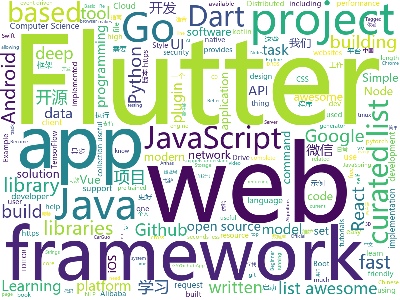

# 2018-11-25
See what the GitHub community is most excited about today.

## python
* [3DDFA](https://github.com/cleardusk/3DDFA)(**377 stars today**): The pytorch improved re-implementation of TPAMI 2017 paper: Face Alignment in Full Pose Range: A 3D Total Solution.
* [system-design-primer](https://github.com/donnemartin/system-design-primer)(**96 stars today**): Learn how to design large-scale systems. Prep for the system design interview. Includes Anki flashcards.
* [big-list-of-naughty-strings](https://github.com/minimaxir/big-list-of-naughty-strings)(**71 stars today**): The Big List of Naughty Strings is a list of strings which have a high probability of causing issues when used as user-input data.
* [models](https://github.com/tensorflow/models)(**39 stars today**): Models and examples built with TensorFlow
* [Python](https://github.com/TheAlgorithms/Python)(**38 stars today**): All Algorithms implemented in Python
* [cnn_captcha](https://github.com/nickliqian/cnn_captcha)(**38 stars today**): 本项目针对字符型图片验证码，使用tensorflow实现卷积神经网络，进行验证码识别。use cnn recognize captcha by tensorflow
* [awesome-python](https://github.com/vinta/awesome-python)(**36 stars today**): A curated list of awesome Python frameworks, libraries, software and resources
* [bert](https://github.com/google-research/bert)(**36 stars today**): TensorFlow code and pre-trained models for BERT
* [bert-as-service](https://github.com/hanxiao/bert-as-service)(**34 stars today**): Mapping a variable-length sentence to a fixed-length vector using pretrained BERT model
* [pyxel](https://github.com/kitao/pyxel)(**34 stars today**): A retro game engine for Python
* [PySyft](https://github.com/OpenMined/PySyft)(**27 stars today**): A library for encrypted, privacy preserving deep learning
* [Python](https://github.com/geekcomputers/Python)(**29 stars today**): My Python Examples
* [youtube-dl](https://github.com/rg3/youtube-dl)(**28 stars today**): Command-line program to download videos from YouTube.com and other video sites
* [django](https://github.com/django/django)(**23 stars today**): The Web framework for perfectionists with deadlines.
* [scrapy](https://github.com/scrapy/scrapy)(**27 stars today**): Scrapy, a fast high-level web crawling & scraping framework for Python.
* [keras](https://github.com/keras-team/keras)(**18 stars today**): Deep Learning for humans
* [chartify](https://github.com/spotify/chartify)(**25 stars today**): Python library that makes it easy for data scientists to create charts.
* [autojump](https://github.com/wting/autojump)(**24 stars today**): A cd command that learns - easily navigate directories from the command line
* [Telethon](https://github.com/LonamiWebs/Telethon)(**22 stars today**): Pure Python 3 MTProto API Telegram client library
* [pandas](https://github.com/pandas-dev/pandas)(**21 stars today**): Flexible and powerful data analysis / manipulation library for Python, providing labeled data structures similar to R data.frame objects, statistical functions, and much more
* [spinningup](https://github.com/openai/spinningup)(**20 stars today**): An educational resource to help anyone learn deep reinforcement learning.
* [public-apis](https://github.com/toddmotto/public-apis)(**19 stars today**): A collective list of public JSON APIs for use in web development.
* [XSStrike](https://github.com/s0md3v/XSStrike)(**20 stars today**): Most advanced XSS detection suite.
* [cpython](https://github.com/python/cpython)(**14 stars today**): The Python programming language
* [DeOldify](https://github.com/jantic/DeOldify)(**20 stars today**): A Deep Learning based project for colorizing and restoring old images

## java
* [litemall](https://github.com/linlinjava/litemall)(**75 stars today**): 又一个小商城。litemall = Spring Boot后端 + Vue管理员前端 + 微信小程序用户前端
* [JavaGuide](https://github.com/Snailclimb/JavaGuide)(**52 stars today**): 【Java学习+面试指南】 一份涵盖大部分Java程序员所需要掌握的核心知识。
* [symphony](https://github.com/b3log/symphony)(**36 stars today**): 🎶一款用 Java 实现的现代化社区（论坛/BBS/社交网络/博客）平台。https://hacpai.com
* [librootjava](https://github.com/Chainfire/librootjava)(**38 stars today**): Run Java (and Kotlin) code as root!
* [resilience4j](https://github.com/resilience4j/resilience4j)(**32 stars today**): Resilience4j is a fault tolerance library designed for Java8 and functional programming
* [thinking-in-spring-boot-samples](https://github.com/mercyblitz/thinking-in-spring-boot-samples)(**27 stars today**): 小马哥书籍《Spring Boot 编程思想》示例工程
* [soul](https://github.com/Dromara/soul)(**26 stars today**): 这是一个高性能，异步的响应式的gateway
* [java-design-patterns](https://github.com/iluwatar/java-design-patterns)(**25 stars today**): Design patterns implemented in Java
* [spring-boot](https://github.com/spring-projects/spring-boot)(**21 stars today**): Spring Boot
* [coderiver](https://github.com/cachecats/coderiver)(**25 stars today**): 致力于打造全平台全栈精品开源项目，计划做成包含 pc端（Vue、React）、移动H5（Vue、React）、ReactNative混合开发、Android原生、微信小程序、java后端的全平台型全栈项目，欢迎关注。
* [elasticsearch](https://github.com/elastic/elasticsearch)(**23 stars today**): Open Source, Distributed, RESTful Search Engine
* [spring-framework](https://github.com/spring-projects/spring-framework)(**15 stars today**): Spring Framework
* [Java](https://github.com/TheAlgorithms/Java)(**18 stars today**): All Algorithms implemented in Java
* [spring-cloud-alibaba](https://github.com/spring-cloud-incubator/spring-cloud-alibaba)(**18 stars today**): Spring Cloud Alibaba provides a one-stop solution for application development for the distributed solutions of Alibaba middleware.
* [netty](https://github.com/netty/netty)(**16 stars today**): Netty project - an event-driven asynchronous network application framework
* [incubator-dubbo](https://github.com/apache/incubator-dubbo)(**13 stars today**): Apache Dubbo (incubating) is a high-performance, java based, open source RPC framework.
* [interviews](https://github.com/kdn251/interviews)(**16 stars today**): Everything you need to know to get the job.
* [hmily](https://github.com/yu199195/hmily)(**15 stars today**): 高性能异步分布式事务TCC框架(try,confirm,cancel)
* [SnapchatClone](https://github.com/Stoick001/SnapchatClone)(**17 stars today**): 
* [druid](https://github.com/alibaba/druid)(**15 stars today**): 阿里巴巴数据库事业部出品，为监控而生的数据库连接池。2018年开源中国最受欢迎开源软件评选请参与投票 https://www.oschina.net/project/top_cn_2018 阿里云DRDS(https://www.aliyun.com/product/drds )、阿里巴巴TDDL 连接池powered by Druid
* [UltimateAndroidReference](https://github.com/aritraroy/UltimateAndroidReference)(**15 stars today**): 🚀Ultimate Android Reference - Your Road to Become a Better Android Developer
* [easy-cloud](https://github.com/dqeasycloud/easy-cloud)(**14 stars today**): 开源改变世界，让微服务开发更简单
* [guava](https://github.com/google/guava)(**13 stars today**): Google core libraries for Java
* [arthas](https://github.com/alibaba/arthas)(**13 stars today**): Alibaba Java Diagnostic Tool Arthas/Alibaba Java诊断利器Arthas
* [weixin-java-tools](https://github.com/Wechat-Group/weixin-java-tools)(**12 stars today**): 全能微信Java开发工具包，支持包括微信支付、开放平台、小程序、企业微信/企业号和公众号等的后端开发

## unknown
* [CS-Notes](https://github.com/CyC2018/CS-Notes)(**43 stars today**): 📚Computer Science Learning Notes
* [awesome](https://github.com/sindresorhus/awesome)(**47 stars today**): 😎Curated list of awesome lists
* [You-Dont-Know-JS](https://github.com/getify/You-Dont-Know-JS)(**41 stars today**): A book series on JavaScript. @YDKJS on twitter.
* [gitignore](https://github.com/github/gitignore)(**39 stars today**): A collection of useful .gitignore templates
* [leetcode](https://github.com/gzc426/leetcode)(**23 stars today**): 每天一道leetcode
* [coding-interview-university](https://github.com/jwasham/coding-interview-university)(**31 stars today**): A complete computer science study plan to become a software engineer.
* [awesome-vue](https://github.com/vuejs/awesome-vue)(**33 stars today**): 🎉A curated list of awesome things related to Vue.js
* [developer-roadmap](https://github.com/kamranahmedse/developer-roadmap)(**29 stars today**): Roadmap to becoming a web developer in 2018
* [build-your-own-x](https://github.com/danistefanovic/build-your-own-x)(**33 stars today**): 🤓Build your own (insert technology here)
* [project-based-learning](https://github.com/tuvtran/project-based-learning)(**29 stars today**): Curated list of project-based tutorials
* [OI-wiki](https://github.com/24OI/OI-wiki)(**29 stars today**): 🌟Wiki for OI / ICPC. （某大型游戏线上攻略，内含炫酷算术魔法）
* [peek-for-tmux](https://github.com/lf94/peek-for-tmux)(**29 stars today**): The most useful smallest tmux trick by yours truly. peek() { tmux split-window -p 33 $EDITOR $@ || exit; }
* [A-to-Z-Resources-for-Students](https://github.com/dipakkr/A-to-Z-Resources-for-Students)(**27 stars today**): ☑️Curated list of resources for college students Show your❤️by giving a⭐️
* [awful-ai](https://github.com/daviddao/awful-ai)(**26 stars today**): 😈Awful AI is a curated list to track current scary usages of AI - hoping to raise awareness
* [AD-Attack-Defense](https://github.com/infosecn1nja/AD-Attack-Defense)(**22 stars today**): Active Directory Security For Red & Blue Team
* [100-Days-Of-ML-Code](https://github.com/Avik-Jain/100-Days-Of-ML-Code)(**21 stars today**): 100 Days of ML Coding
* [free-programming-books](https://github.com/EbookFoundation/free-programming-books)(**19 stars today**): 📚Freely available programming books
* [Awesome-pytorch-list](https://github.com/bharathgs/Awesome-pytorch-list)(**20 stars today**): A comprehensive list of pytorch related content on github,such as different models,implementations,helper libraries,tutorials etc.
* [git-flight-rules](https://github.com/k88hudson/git-flight-rules)(**18 stars today**): Flight rules for git
* [computer-science](https://github.com/ossu/computer-science)(**16 stars today**): 🎓Path to a free self-taught education in Computer Science!
* [awesome-courses](https://github.com/prakhar1989/awesome-courses)(**14 stars today**): 📚List of awesome university courses for learning Computer Science!
* [awesome-cpp](https://github.com/fffaraz/awesome-cpp)(**16 stars today**): A curated list of awesome C++ (or C) frameworks, libraries, resources, and shiny things. Inspired by awesome-... stuff.
* [awesome-vm-exploit](https://github.com/WinMin/awesome-vm-exploit)(**16 stars today**): share some useful archives about vm and qemu escape exploit.
* [Black-Friday-Deals](https://github.com/mRs-/Black-Friday-Deals)(**15 stars today**): Black Friday Deals for macOS Software & Books
* [first-contributions](https://github.com/firstcontributions/first-contributions)(**8 stars today**): 🚀✨Help beginners to contribute to open source projects

## javascript
* [edex-ui](https://github.com/GitSquared/edex-ui)(**461 stars today**): A science fiction desktop running everywhere. Awesome.
* [htm](https://github.com/developit/htm)(**177 stars today**): Hyperscript Tagged Markup: JSX alternative using standard tagged templates, with compiler support.
* [nivo](https://github.com/plouc/nivo)(**150 stars today**): nivo provides a rich set of dataviz components, built on top of the awesome d3 and Reactjs libraries
* [carlo](https://github.com/GoogleChromeLabs/carlo)(**102 stars today**): Web rendering surface for Node applications
* [vue](https://github.com/vuejs/vue)(**76 stars today**): 🖖A progressive, incrementally-adoptable JavaScript framework for building UI on the web.
* [cms.js](https://github.com/chrisdiana/cms.js)(**76 stars today**): Client-Side JavaScript Site Generator
* [twizzy-landing](https://github.com/kitze/twizzy-landing)(**64 stars today**): The landing page for Twizzy, built with React 16.7
* [taskbook](https://github.com/klaussinani/taskbook)(**65 stars today**): 📓Tasks, boards & notes for the command-line habitat
* [DoodleMaster](https://github.com/karanchahal/DoodleMaster)(**53 stars today**): "Don't code your UI, Draw it !"
* [react](https://github.com/facebook/react)(**47 stars today**): A declarative, efficient, and flexible JavaScript library for building user interfaces.
* [Dweb.page](https://github.com/PACTCare/Dweb.page)(**51 stars today**): Dweb.page – Your Gateway to the Distributed Web
* [33-js-concepts](https://github.com/leonardomso/33-js-concepts)(**46 stars today**): 📜33 concepts every JavaScript developer should know.
* [node](https://github.com/nodejs/node)(**28 stars today**): Node.js JavaScript runtime✨🐢🚀✨
* [style2paints](https://github.com/lllyasviel/style2paints)(**44 stars today**): sketch + style = paints🎨
* [30-seconds-of-code](https://github.com/30-seconds/30-seconds-of-code)(**38 stars today**): Curated collection of useful JavaScript snippets that you can understand in 30 seconds or less.
* [react-testing-library](https://github.com/kentcdodds/react-testing-library)(**38 stars today**): 🐐Simple and complete React DOM testing utilities that encourage good testing practices.
* [create-react-app](https://github.com/facebook/create-react-app)(**31 stars today**): Set up a modern web app by running one command.
* [axios](https://github.com/axios/axios)(**35 stars today**): Promise based HTTP client for the browser and node.js
* [33-js-concepts](https://github.com/stephentian/33-js-concepts)(**31 stars today**): 📜每个 JavaScript 工程师都应懂的33个概念 @leonardomso
* [free-programming-books-zh_CN](https://github.com/justjavac/free-programming-books-zh_CN)(**29 stars today**): 📚免费的计算机编程类中文书籍，欢迎投稿
* [gatsby](https://github.com/gatsbyjs/gatsby)(**27 stars today**): Build blazing fast, modern apps and websites with React
* [javascript](https://github.com/airbnb/javascript)(**28 stars today**): JavaScript Style Guide
* [imba](https://github.com/somebee/imba)(**28 stars today**): The new programming language for web apps
* [tensorspace](https://github.com/tensorspace-team/tensorspace)(**24 stars today**): Neural network 3D visualization framework, build interactive and intuitive model in browsers, support pre-trained deep learning models from TensorFlow, Keras, TensorFlow.js
* [react-native](https://github.com/facebook/react-native)(**23 stars today**): A framework for building native apps with React.

## html
* [nginxconfig.io](https://github.com/valentinxxx/nginxconfig.io)(**124 stars today**): ⚙️NGiИX config generator generator on steroids💉
* [styleguide](https://github.com/google/styleguide)(**13 stars today**): Style guides for Google-originated open-source projects
* [Coursera-ML-AndrewNg-Notes](https://github.com/fengdu78/Coursera-ML-AndrewNg-Notes)(**9 stars today**): 吴恩达老师的机器学习课程个人笔记
* [react-redux](https://github.com/reduxjs/react-redux)(**12 stars today**): Official React bindings for Redux
* [AdminLTE](https://github.com/almasaeed2010/AdminLTE)(**10 stars today**): AdminLTE - Free Premium Admin control Panel Theme Based On Bootstrap 3.x
* [fastText](https://github.com/facebookresearch/fastText)(**11 stars today**): Library for fast text representation and classification.
* [portainer](https://github.com/portainer/portainer)(**10 stars today**): Simple management UI for Docker
* [polymer](https://github.com/Polymer/polymer)(**9 stars today**): Our original Web Component library.
* [Spoon-Knife](https://github.com/octocat/Spoon-Knife)(****): This repo is for demonstration purposes only.
* [pure](https://github.com/pure-css/pure)(**7 stars today**): A set of small, responsive CSS modules that you can use in every web project.
* [NLP-progress](https://github.com/sebastianruder/NLP-progress)(**7 stars today**): Repository to track the progress in Natural Language Processing (NLP), including the datasets and the current state-of-the-art for the most common NLP tasks.
* [now-github-starter](https://github.com/zeit/now-github-starter)(****): Starter project to demonstrate a project whose pull requests get automatically deployed
* [github](https://github.com/phodal/github)(**7 stars today**): GitHub 漫游指南- a Chinese ebook on how to build a good project on Github. Explore the users' behavior. Find some thing interest.
* [30-seconds-of-css](https://github.com/30-seconds/30-seconds-of-css)(**7 stars today**): A curated collection of useful CSS snippets you can understand in 30 seconds or less.
* [nndl.github.io](https://github.com/nndl/nndl.github.io)(**7 stars today**): 《神经网络与深度学习》 Neural Network and Deep Learning
* [CSS-file-icons](https://github.com/colorswall/CSS-file-icons)(**6 stars today**): Pure CSS icons for popular file extensions
* [solid](https://github.com/solid/solid)(**6 stars today**): Solid - Re-decentralizing the web (project directory)
* [electron-api-demos](https://github.com/electron/electron-api-demos)(**6 stars today**): Explore the Electron APIs
* [ecma262](https://github.com/tc39/ecma262)(**5 stars today**): Status, process, and documents for ECMA262
* [BabySploit](https://github.com/M4cs/BabySploit)(**5 stars today**): BabySploit Beginner Pentesting Toolkit/Framework Written in Python
* [fonts](https://github.com/google/fonts)(**5 stars today**): Font files available from Google Fonts
* [design-blocks](https://github.com/froala/design-blocks)(**5 stars today**): A set of 170+ Bootstrap based design blocks ready to be used to create clean modern websites.
* [alpha](https://github.com/alibaba/alpha)(**5 stars today**): Alpha是一个基于PERT图构建的Android异步启动框架，它简单，高效，功能完善。 在应用启动的时候，我们通常会有很多工作需要做，为了提高启动速度，我们会尽可能让这些工作并发进行。但这些工作之间可能存在前后依赖的关系，所以我们又需要想办法保证他们执行顺序的正确性。Alpha就是为此而设计的，使用者只需定义好自己的task，并描述它依赖的task，将它添加到Project中。框架会自动并发有序地执行这些task，并将执行的结果抛出来。
* [chinese-ig](https://github.com/w3c/chinese-ig)(**5 stars today**): Web中文兴趣组
* [shan-shui-inf](https://github.com/LingDong-/shan-shui-inf)(**5 stars today**): Procedurally generated Chinese landscape painting.

## dart
* [awesome-flutter](https://github.com/Solido/awesome-flutter)(**109 stars today**): An awesome list that curates the best Flutter libraries, tools, tutorials, articles and more.
* [flutter](https://github.com/flutter/flutter)(**44 stars today**): Flutter makes it easy and fast to build beautiful mobile apps.
* [plugins](https://github.com/flutter/plugins)(**7 stars today**): Plugins for Flutter, including FlutterFire, maintained by the Flutter team
* [flutter_architecture_samples](https://github.com/brianegan/flutter_architecture_samples)(**7 stars today**): TodoMVC for Flutter
* [dio](https://github.com/flutterchina/dio)(**5 stars today**): A powerful Http client for Dart, which supports Interceptors, FormData, Request Cancellation, File Downloading, Timeout etc.
* [speech_recognition](https://github.com/rxlabz/speech_recognition)(****): A Flutter plugin to use speech recognition on iOS & Android (Swift/Java)
* [flutter_google_map_view](https://github.com/apptreesoftware/flutter_google_map_view)(****): A flutter plugin for Google Maps
* [flutter-permission-handler](https://github.com/BaseflowIT/flutter-permission-handler)(****): Permission plugin for Flutter. This plugin provides a cross-platform (iOS, Android) API to request and check permissions.
* [fluttergram](https://github.com/mdanics/fluttergram)(****): A working Instagram clone written in Flutter using Firebase / Firestore
* [chromedeveditor](https://github.com/googlearchive/chromedeveditor)(****): Chrome Dev Editor is a developer tool for building apps on the Chrome platform - Chrome Apps and Web Apps, in JavaScript or Dart. (NO LONGER IN ACTIVE DEVELOPMENT)
* [sdk](https://github.com/dart-lang/sdk)(****): The Dart SDK, including the VM, dart2js, core libraries, and more.
* [GSYGithubAppFlutter](https://github.com/CarGuo/GSYGithubAppFlutter)(****): 超完整的Flutter项目，功能丰富，适合学习和日常使用。GSYGithubApp系列的优势：我们目前已经拥有Flutter、Weex、ReactNative、kotlin 四个版本。 功能齐全，项目框架内技术涉及面广，完成度高，持续维护，配套文章，适合全面学习，对比参考。跨平台的开源Github客户端App，更好的体验，更丰富的功能，旨在更好的日常管理和维护个人Github，提供更好更方便的驾车体验Σ(￣。￣ﾉ)ﾉ。同款Weex版本 ： https://github.com/CarGuo/GSYGithubAppWeex 、同款React Native版本 ： https://github.com/CarGuo/GSYGithubApp 、原生 kotlin 版本 https://g…
* [FlutterExampleApps](https://github.com/iampawan/FlutterExampleApps)(****): [Example APPS] Basic Flutter apps, for flutter devs.
* [Flutter-UI-Kit](https://github.com/iampawan/Flutter-UI-Kit)(****): Flutter app for collection of UI in a UIKit
* [flutter-examples](https://github.com/nisrulz/flutter-examples)(****): [Examples] Simple basic isolated apps, for budding flutter devs.
* [flutter-osc](https://github.com/yubo725/flutter-osc)(****): 基于Google Flutter的开源中国客户端，支持Android和iOS。
* [inKino](https://github.com/roughike/inKino)(****): A multiplatform Dart movie app with 40% of code sharing between Flutter and the Web.
* [Flutter-learning](https://github.com/AweiLoveAndroid/Flutter-learning)(****): 🔥👍🌟⭐️⭐️⭐️Flutter安装和配置，Flutter开发遇到的难题，Flutter示例代码和模板，Flutter项目实战，Dart语言学习示例代码。
* [zhihu-flutter](https://github.com/HackSoul/zhihu-flutter)(****): Flutter 高仿知乎 UI，非常漂亮，也非常流畅，flutter build apk 或 flutter build ios 之后更流畅
* [hauberk](https://github.com/munificent/hauberk)(****): A web-based roguelike written in Dart.
* [angular](https://github.com/dart-lang/angular)(****): Fast and productive web framework provided by Dart
* [StageXL](https://github.com/bp74/StageXL)(****): A fast and universal 2D rendering engine for HTML5 and Dart.
* [dart-sass](https://github.com/sass/dart-sass)(****): A Dart implementation of Sass.
* [Flutter-Notebook](https://github.com/OpenFlutter/Flutter-Notebook)(****): 日更的FlutterDemo合集，今天你fu了吗
* [rxdart](https://github.com/ReactiveX/rxdart)(****): The Reactive Extensions for Dart

## go
* [goboy](https://github.com/Humpheh/goboy)(**207 stars today**): Multi-platform Nintendo Game Boy Color emulator written in go
* [evilginx2](https://github.com/kgretzky/evilginx2)(**131 stars today**): Standalone man-in-the-middle attack framework used for phishing login credentials along with session cookies, allowing for the bypass of 2-factor authentication
* [lorca](https://github.com/zserge/lorca)(**54 stars today**): Build cross-platform modern desktop apps in Go + HTML5
* [sso](https://github.com/buzzfeed/sso)(**54 stars today**): sso, aka S.S.Octopus, aka octoboi, is a single sign-on solution for securing internal services
* [autopprof](https://github.com/rakyll/autopprof)(**45 stars today**): Pprof made easy at development time for Go
* [hydra](https://github.com/ory/hydra)(**44 stars today**): OpenID Connect certified OAuth2 Server - cloud native, security-first, open source API security for your infrastructure. Written in Go. SDKs for any language.
* [tparse](https://github.com/mfridman/tparse)(**43 stars today**): CLI tool for analyzing and summarizing go test output. Pipe friendly. CI/CD friendly.
* [dive](https://github.com/wagoodman/dive)(**39 stars today**): A tool for exploring each layer in a docker image
* [go](https://github.com/golang/go)(**32 stars today**): The Go programming language
* [kubernetes](https://github.com/kubernetes/kubernetes)(**30 stars today**): Production-Grade Container Scheduling and Management
* [fastcache](https://github.com/VictoriaMetrics/fastcache)(**30 stars today**): Fast thread-safe inmemory cache for big number of entries in Go
* [simple-vpn](https://github.com/skx/simple-vpn)(**30 stars today**): A simple VPN allowing mesh-like communication between nodes, over websockets
* [gin](https://github.com/gin-gonic/gin)(**27 stars today**): Gin is a HTTP web framework written in Go (Golang). It features a Martini-like API with much better performance -- up to 40 times faster. If you need smashing performance, get yourself some Gin.
* [awesome-go](https://github.com/avelino/awesome-go)(**28 stars today**): A curated list of awesome Go frameworks, libraries and software
* [smtp2http](https://github.com/uflare/smtp2http)(**26 stars today**): a tiny software that receive a smtp request (email) and send it to the specified webhook as a http post request
* [v2ray-core](https://github.com/v2ray/v2ray-core)(**21 stars today**): A platform for building proxies to bypass network restrictions.
* [go-ethereum](https://github.com/ethereum/go-ethereum)(**19 stars today**): Official Go implementation of the Ethereum protocol
* [frp](https://github.com/fatedier/frp)(**20 stars today**): A fast reverse proxy to help you expose a local server behind a NAT or firewall to the internet.
* [watermill](https://github.com/ThreeDotsLabs/watermill)(**20 stars today**): Go library for building event-driven applications.
* [rclone](https://github.com/ncw/rclone)(**20 stars today**): "rsync for cloud storage" - Google Drive, Amazon Drive, S3, Dropbox, Backblaze B2, One Drive, Swift, Hubic, Cloudfiles, Google Cloud Storage, Yandex Files
* [chezmoi](https://github.com/twpayne/chezmoi)(**20 stars today**): chezmoi is a tool for managing your dotfiles across multiple machines.
* [hugo](https://github.com/gohugoio/hugo)(**18 stars today**): The world’s fastest framework for building websites.
* [gogs](https://github.com/gogs/gogs)(**17 stars today**): Gogs is a painless self-hosted Git service.
* [golicense](https://github.com/mitchellh/golicense)(**19 stars today**): Scan and analyze OSS dependencies and licenses from compiled Go binaries
* [slug](https://github.com/gosimple/slug)(**18 stars today**): URL-friendly slugify with multiple languages support.

## WordCloud

