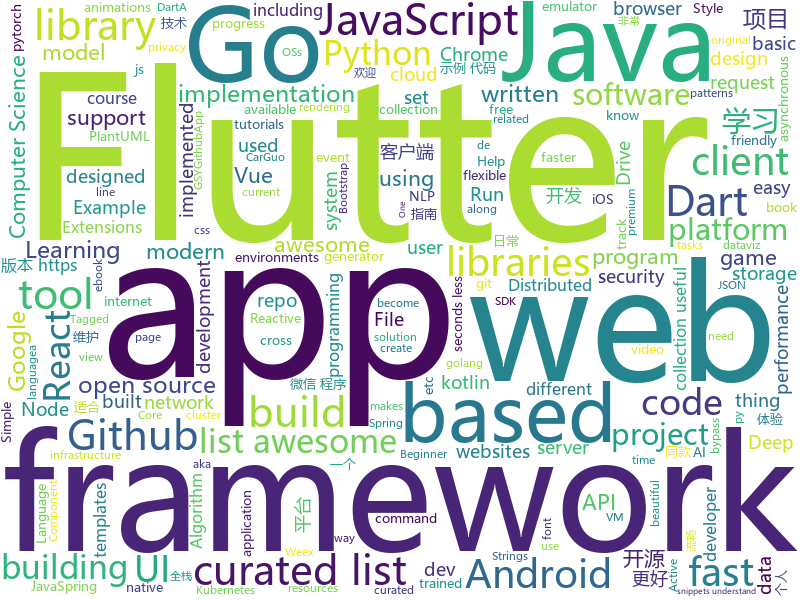

# 2018-11-26
See what the GitHub community is most excited about today.

## python
* [3DDFA](https://github.com/cleardusk/3DDFA)(**190 stars today**): The pytorch improved re-implementation of TPAMI 2017 paper: Face Alignment in Full Pose Range: A 3D Total Solution.
* [trape](https://github.com/jofpin/trape)(**183 stars today**): People tracker on the Internet: OSINT analysis and research tool.
* [satpy](https://github.com/pytroll/satpy)(**161 stars today**): Python package for earth-observing satellite data processing
* [system-design-primer](https://github.com/donnemartin/system-design-primer)(**97 stars today**): Learn how to design large-scale systems. Prep for the system design interview. Includes Anki flashcards.
* [QuickDraw](https://github.com/1991viet/QuickDraw)(**87 stars today**): Implementation of Quickdraw - an online game developed by Google
* [Python](https://github.com/TheAlgorithms/Python)(**53 stars today**): All Algorithms implemented in Python
* [big-list-of-naughty-strings](https://github.com/minimaxir/big-list-of-naughty-strings)(**63 stars today**): The Big List of Naughty Strings is a list of strings which have a high probability of causing issues when used as user-input data.
* [medicaltorch](https://github.com/perone/medicaltorch)(**59 stars today**): A medical imaging framework for Pytorch
* [inter](https://github.com/rsms/inter)(**57 stars today**): The Inter UI font family
* [youtube-dl](https://github.com/rg3/youtube-dl)(**51 stars today**): Command-line program to download videos from YouTube.com and other video sites
* [models](https://github.com/tensorflow/models)(**36 stars today**): Models and examples built with TensorFlow
* [bert](https://github.com/google-research/bert)(**35 stars today**): TensorFlow code and pre-trained models for BERT
* [keras](https://github.com/keras-team/keras)(**32 stars today**): Deep Learning for humans
* [pnn.pytorch.update](https://github.com/juefeix/pnn.pytorch.update)(**32 stars today**): This repo houses the new PNN code, along with our responses to the issue raised in the recent Reddit discussion. The code is based on Michael Klachko’s repo with slight modification in model.py and main.py. All changes are marked.
* [happymac](https://github.com/laffra/happymac)(**32 stars today**): A Python Mac app to suspend background processes
* [cpython](https://github.com/python/cpython)(**22 stars today**): The Python programming language
* [public-apis](https://github.com/toddmotto/public-apis)(**30 stars today**): A collective list of public JSON APIs for use in web development.
* [awesome-python](https://github.com/vinta/awesome-python)(**28 stars today**): A curated list of awesome Python frameworks, libraries, software and resources
* [DeOldify](https://github.com/jantic/DeOldify)(**28 stars today**): A Deep Learning based project for colorizing and restoring old images
* [AI_plays_snake](https://github.com/aliakbar09a/AI_plays_snake)(**27 stars today**): AI trained using Genetic Algorithm and Deep Learning to play the game of snake
* [Python](https://github.com/geekcomputers/Python)(**23 stars today**): My Python Examples
* [chartify](https://github.com/spotify/chartify)(**27 stars today**): Python library that makes it easy for data scientists to create charts.
* [Telethon](https://github.com/LonamiWebs/Telethon)(**27 stars today**): Pure Python 3 MTProto API Telegram client library
* [PySyft](https://github.com/OpenMined/PySyft)(**26 stars today**): A library for encrypted, privacy preserving deep learning
* [PyOne](https://github.com/abbeyokgo/PyOne)(**22 stars today**): PyOne-directory of onedrive

## java
* [litemall](https://github.com/linlinjava/litemall)(**62 stars today**): 又一个小商城。litemall = Spring Boot后端 + Vue管理员前端 + 微信小程序用户前端
* [JavaGuide](https://github.com/Snailclimb/JavaGuide)(**43 stars today**): 【Java学习+面试指南】 一份涵盖大部分Java程序员所需要掌握的核心知识。
* [soul](https://github.com/Dromara/soul)(**39 stars today**): 这是一个高性能，异步的响应式的gateway
* [resilience4j](https://github.com/resilience4j/resilience4j)(**31 stars today**): Resilience4j is a fault tolerance library designed for Java8 and functional programming
* [tutorials](https://github.com/eugenp/tutorials)(**20 stars today**): The "REST With Spring" Course:
* [symphony](https://github.com/b3log/symphony)(**26 stars today**): 🎶一款用 Java 实现的现代化社区（论坛/BBS/社交网络/博客）平台。https://hacpai.com
* [java-design-patterns](https://github.com/iluwatar/java-design-patterns)(**23 stars today**): Design patterns implemented in Java
* [spring-framework](https://github.com/spring-projects/spring-framework)(**20 stars today**): Spring Framework
* [Cartoon](https://github.com/chrissen0814/Cartoon)(**23 stars today**): 猫漫
* [elasticsearch](https://github.com/elastic/elasticsearch)(**15 stars today**): Open Source, Distributed, RESTful Search Engine
* [Java](https://github.com/TheAlgorithms/Java)(**16 stars today**): All Algorithms implemented in Java
* [spring-boot](https://github.com/spring-projects/spring-boot)(**15 stars today**): Spring Boot
* [AndroidAutoSwitcher](https://github.com/Marksss/AndroidAutoSwitcher)(**16 stars today**): AutoSwitchView, a view animating between two items for Android, supports multiple switching animations or you can customize your own strategy of animations. And its child view can be reused.
* [RxJava](https://github.com/ReactiveX/RxJava)(**15 stars today**): RxJava – Reactive Extensions for the JVM – a library for composing asynchronous and event-based programs using observable sequences for the Java VM.
* [easy-cloud](https://github.com/dqeasycloud/easy-cloud)(**15 stars today**): 开源改变世界，让微服务开发更简单
* [netty](https://github.com/netty/netty)(**12 stars today**): Netty project - an event-driven asynchronous network application framework
* [JCSprout](https://github.com/crossoverJie/JCSprout)(**12 stars today**): 👨‍🎓Java Core Sprout : basic, concurrent, algorithm
* [retrofit](https://github.com/square/retrofit)(**13 stars today**): Type-safe HTTP client for Android and Java by Square, Inc.
* [selenium](https://github.com/SeleniumHQ/selenium)(**11 stars today**): A browser automation framework and ecosystem.
* [coderiver](https://github.com/cachecats/coderiver)(**11 stars today**): 致力于打造全平台全栈精品开源项目，计划做成包含 pc端（Vue、React）、移动H5（Vue、React）、ReactNative混合开发、Android原生、微信小程序、java后端的全平台型全栈项目，欢迎关注。
* [librootjava](https://github.com/Chainfire/librootjava)(**13 stars today**): Run Java (and Kotlin) code as root!
* [interviews](https://github.com/kdn251/interviews)(**12 stars today**): Everything you need to know to get the job.
* [graal](https://github.com/oracle/graal)(**12 stars today**): GraalVM: Run Programs Faster Anywhere🚀
* [okhttp](https://github.com/square/okhttp)(**12 stars today**): An HTTP+HTTP/2 client for Android and Java applications.
* [incubator-dubbo](https://github.com/apache/incubator-dubbo)(**11 stars today**): Apache Dubbo (incubating) is a high-performance, java based, open source RPC framework.

## unknown
* [CS-Notes](https://github.com/CyC2018/CS-Notes)(**173 stars today**): 📚Computer Science Learning Notes
* [You-Dont-Know-JS](https://github.com/getify/You-Dont-Know-JS)(**75 stars today**): A book series on JavaScript. @YDKJS on twitter.
* [awesome](https://github.com/sindresorhus/awesome)(**71 stars today**): 😎Curated list of awesome lists
* [developer-roadmap](https://github.com/kamranahmedse/developer-roadmap)(**35 stars today**): Roadmap to becoming a web developer in 2018
* [gitignore](https://github.com/github/gitignore)(**26 stars today**): A collection of useful .gitignore templates
* [free-programming-books](https://github.com/EbookFoundation/free-programming-books)(**29 stars today**): 📚Freely available programming books
* [OI-wiki](https://github.com/24OI/OI-wiki)(**32 stars today**): 🌟Wiki for OI / ICPC. （某大型游戏线上攻略，内含炫酷算术魔法）
* [computer-science](https://github.com/ossu/computer-science)(**28 stars today**): 🎓Path to a free self-taught education in Computer Science!
* [awesome-burp-extensions](https://github.com/snoopysecurity/awesome-burp-extensions)(**26 stars today**): A curated list of amazingly awesome Burp Extensions
* [awesome-vue](https://github.com/vuejs/awesome-vue)(**24 stars today**): 🎉A curated list of awesome things related to Vue.js
* [C4-PlantUML](https://github.com/RicardoNiepel/C4-PlantUML)(**26 stars today**): C4-PlantUML combines the benefits of PlantUML and the C4 model for providing a simple way of describing and communicate software architectures
* [coding-interview-university](https://github.com/jwasham/coding-interview-university)(**22 stars today**): A complete computer science study plan to become a software engineer.
* [awful-ai](https://github.com/daviddao/awful-ai)(**26 stars today**): 😈Awful AI is a curated list to track current scary usages of AI - hoping to raise awareness
* [build-your-own-x](https://github.com/danistefanovic/build-your-own-x)(**24 stars today**): 🤓Build your own (insert technology here)
* [100-Days-Of-ML-Code](https://github.com/Avik-Jain/100-Days-Of-ML-Code)(**18 stars today**): 100 Days of ML Coding
* [first-contributions](https://github.com/firstcontributions/first-contributions)(**10 stars today**): 🚀✨Help beginners to contribute to open source projects
* [awesome-cpp](https://github.com/fffaraz/awesome-cpp)(**21 stars today**): A curated list of awesome C++ (or C) frameworks, libraries, resources, and shiny things. Inspired by awesome-... stuff.
* [A-to-Z-Resources-for-Students](https://github.com/dipakkr/A-to-Z-Resources-for-Students)(**19 stars today**): ☑️Curated list of resources for college students Show your❤️by giving a⭐️
* [architect-awesome](https://github.com/xingshaocheng/architect-awesome)(**19 stars today**): 后端架构师技术图谱
* [android-architecture](https://github.com/googlesamples/android-architecture)(**16 stars today**): A collection of samples to discuss and showcase different architectural tools and patterns for Android apps.
* [biblioteca-espanol-gratis](https://github.com/rosepac/biblioteca-espanol-gratis)(**15 stars today**): 📚Biblioteca de libros, cursos y recursos para el aprendizaje de la programación y mucho más, 100% gratis en español.
* [Awesome-pytorch-list](https://github.com/bharathgs/Awesome-pytorch-list)(**14 stars today**): A comprehensive list of pytorch related content on github,such as different models,implementations,helper libraries,tutorials etc.
* [rstats-ed](https://github.com/rstudio-education/rstats-ed)(**13 stars today**): List of courses teaching R
* [awesome-courses](https://github.com/prakhar1989/awesome-courses)(**14 stars today**): 📚List of awesome university courses for learning Computer Science!
* [AD-Attack-Defense](https://github.com/infosecn1nja/AD-Attack-Defense)(**14 stars today**): Active Directory Security For Red & Blue Team

## javascript
* [edex-ui](https://github.com/GitSquared/edex-ui)(**291 stars today**): A science fiction terminal emulator designed for large touchscreens that runs on all major OSs.
* [progress-estimator](https://github.com/bvaughn/progress-estimator)(**147 stars today**): Logs a progress bar and estimation for how long a Promise will take to complete
* [learnGitBranching](https://github.com/pcottle/learnGitBranching)(**133 stars today**): An interactive git visualization to challenge and educate!
* [htm](https://github.com/developit/htm)(**111 stars today**): Hyperscript Tagged Markup: JSX alternative using standard tagged templates, with compiler support.
* [cms.js](https://github.com/chrisdiana/cms.js)(**100 stars today**): Client-Side JavaScript Site Generator
* [nivo](https://github.com/plouc/nivo)(**91 stars today**): nivo provides a rich set of dataviz components, built on top of the awesome d3 and Reactjs libraries
* [vue](https://github.com/vuejs/vue)(**75 stars today**): 🖖A progressive, incrementally-adoptable JavaScript framework for building UI on the web.
* [react](https://github.com/facebook/react)(**63 stars today**): A declarative, efficient, and flexible JavaScript library for building user interfaces.
* [33-js-concepts](https://github.com/leonardomso/33-js-concepts)(**64 stars today**): 📜33 concepts every JavaScript developer should know.
* [carlo](https://github.com/GoogleChromeLabs/carlo)(**62 stars today**): Web rendering surface for Node applications
* [cytoscape.js](https://github.com/cytoscape/cytoscape.js)(**61 stars today**): Graph theory (network) library for visualisation and analysis
* [axios](https://github.com/axios/axios)(**42 stars today**): Promise based HTTP client for the browser and node.js
* [DoodleMaster](https://github.com/karanchahal/DoodleMaster)(**40 stars today**): "Don't code your UI, Draw it !"
* [create-react-app](https://github.com/facebook/create-react-app)(**36 stars today**): Set up a modern web app by running one command.
* [taskbook](https://github.com/klaussinani/taskbook)(**40 stars today**): 📓Tasks, boards & notes for the command-line habitat
* [style2paints](https://github.com/lllyasviel/style2paints)(**38 stars today**): sketch + style = paints🎨
* [Dweb.page](https://github.com/PACTCare/Dweb.page)(**37 stars today**): Dweb.page – Your Gateway to the Distributed Web
* [discovery](https://github.com/discoveryjs/discovery)(**37 stars today**): Hackable JSON discovery tool
* [puppeteer](https://github.com/GoogleChrome/puppeteer)(**36 stars today**): Headless Chrome Node API
* [next.js](https://github.com/zeit/next.js)(**33 stars today**): The React Framework
* [node](https://github.com/nodejs/node)(**34 stars today**): Node.js JavaScript runtime✨🐢🚀✨
* [30-seconds-of-code](https://github.com/30-seconds/30-seconds-of-code)(**32 stars today**): Curated collection of useful JavaScript snippets that you can understand in 30 seconds or less.
* [free-programming-books-zh_CN](https://github.com/justjavac/free-programming-books-zh_CN)(**29 stars today**): 📚免费的计算机编程类中文书籍，欢迎投稿
* [awesome-mac](https://github.com/jaywcjlove/awesome-mac)(**30 stars today**):  Now we have become very big, Different from the original idea. Collect premium software in various categories.
* [gatsby](https://github.com/gatsbyjs/gatsby)(**28 stars today**): Build blazing fast, modern apps and websites with React

## html
* [nginxconfig.io](https://github.com/valentinxxx/nginxconfig.io)(**141 stars today**): ⚙️NGiИX config generator generator on steroids💉
* [Coursera-ML-AndrewNg-Notes](https://github.com/fengdu78/Coursera-ML-AndrewNg-Notes)(**15 stars today**): 吴恩达老师的机器学习课程个人笔记
* [github](https://github.com/phodal/github)(**11 stars today**): GitHub 漫游指南- a Chinese ebook on how to build a good project on Github. Explore the users' behavior. Find some thing interest.
* [NLP-progress](https://github.com/sebastianruder/NLP-progress)(**12 stars today**): Repository to track the progress in Natural Language Processing (NLP), including the datasets and the current state-of-the-art for the most common NLP tasks.
* [AdminLTE](https://github.com/almasaeed2010/AdminLTE)(**10 stars today**): AdminLTE - Free Premium Admin control Panel Theme Based On Bootstrap 3.x
* [30-seconds-of-css](https://github.com/30-seconds/30-seconds-of-css)(**11 stars today**): A curated collection of useful CSS snippets you can understand in 30 seconds or less.
* [styleguide](https://github.com/google/styleguide)(**9 stars today**): Style guides for Google-originated open-source projects
* [now-github-starter](https://github.com/zeit/now-github-starter)(****): Starter project to demonstrate a project whose pull requests get automatically deployed
* [bulma-templates](https://github.com/dansup/bulma-templates)(**7 stars today**): free flexbox templates built with the bulma css framework
* [Spoon-Knife](https://github.com/octocat/Spoon-Knife)(****): This repo is for demonstration purposes only.
* [pnotify](https://github.com/sciactive/pnotify)(**8 stars today**): Beautiful JavaScript notifications with Web Notifications support.
* [BabySploit](https://github.com/M4cs/BabySploit)(**7 stars today**): BabySploit Beginner Pentesting Toolkit/Framework Written in Python
* [electron-api-demos](https://github.com/electron/electron-api-demos)(**7 stars today**): Explore the Electron APIs
* [portainer](https://github.com/portainer/portainer)(**6 stars today**): Simple management UI for Docker
* [react-redux](https://github.com/reduxjs/react-redux)(**6 stars today**): Official React bindings for Redux
* [McLighting](https://github.com/toblum/McLighting)(**5 stars today**): The ESP8266 based multi-client lighting gadget
* [polymer](https://github.com/Polymer/polymer)(**7 stars today**): Our original Web Component library.
* [data_to_viz](https://github.com/holtzy/data_to_viz)(**5 stars today**): Leading to the dataviz you need
* [design-blocks](https://github.com/froala/design-blocks)(**5 stars today**): A set of 170+ Bootstrap based design blocks ready to be used to create clean modern websites.
* [fastText](https://github.com/facebookresearch/fastText)(**5 stars today**): Library for fast text representation and classification.
* [fonts](https://github.com/google/fonts)(**5 stars today**): Font files available from Google Fonts
* [http2priorities](https://github.com/pmeenan/http2priorities)(**5 stars today**): Test Page for HTTP/2 prioritization (server and browser)
* [adalite](https://github.com/vacuumlabs/adalite)(**5 stars today**): A lightweight wallet for Cardano cryptocurrency
* [patchwork](https://github.com/jlord/patchwork)(****): All the Git-it Workshop completers!
* [first-pr](https://github.com/ituring/first-pr)(****): 《GitHub实践入门》实验用仓库

## dart
* [awesome-flutter](https://github.com/Solido/awesome-flutter)(**105 stars today**): An awesome list that curates the best Flutter libraries, tools, tutorials, articles and more.
* [flutter](https://github.com/flutter/flutter)(**41 stars today**): Flutter makes it easy and fast to build beautiful mobile apps.
* [plugins](https://github.com/flutter/plugins)(**6 stars today**): Plugins for Flutter, including FlutterFire, maintained by the Flutter team
* [flutter_architecture_samples](https://github.com/brianegan/flutter_architecture_samples)(**7 stars today**): TodoMVC for Flutter
* [GSYGithubAppFlutter](https://github.com/CarGuo/GSYGithubAppFlutter)(**7 stars today**): 超完整的Flutter项目，功能丰富，适合学习和日常使用。GSYGithubApp系列的优势：我们目前已经拥有Flutter、Weex、ReactNative、kotlin 四个版本。 功能齐全，项目框架内技术涉及面广，完成度高，持续维护，配套文章，适合全面学习，对比参考。跨平台的开源Github客户端App，更好的体验，更丰富的功能，旨在更好的日常管理和维护个人Github，提供更好更方便的驾车体验Σ(￣。￣ﾉ)ﾉ。同款Weex版本 ： https://github.com/CarGuo/GSYGithubAppWeex 、同款React Native版本 ： https://github.com/CarGuo/GSYGithubApp 、原生 kotlin 版本 https://g…
* [dio](https://github.com/flutterchina/dio)(**6 stars today**): A powerful Http client for Dart, which supports Interceptors, FormData, Request Cancellation, File Downloading, Timeout etc.
* [flame](https://github.com/luanpotter/flame)(**6 stars today**): A minimalist Flutter game engine
* [website](https://github.com/flutter/website)(****): Flutter web site
* [simple_auth](https://github.com/Clancey/simple_auth)(****): The Simplest way to Authenticate in Flutter
* [flutter-chat-demo](https://github.com/duytq94/flutter-chat-demo)(****): This is the demo for chat app by Flutter
* [chromedeveditor](https://github.com/googlearchive/chromedeveditor)(****): Chrome Dev Editor is a developer tool for building apps on the Chrome platform - Chrome Apps and Web Apps, in JavaScript or Dart. (NO LONGER IN ACTIVE DEVELOPMENT)
* [sdk](https://github.com/dart-lang/sdk)(****): The Dart SDK, including the VM, dart2js, core libraries, and more.
* [FlutterExampleApps](https://github.com/iampawan/FlutterExampleApps)(****): [Example APPS] Basic Flutter apps, for flutter devs.
* [Flutter-UI-Kit](https://github.com/iampawan/Flutter-UI-Kit)(****): Flutter app for collection of UI in a UIKit
* [flutter-examples](https://github.com/nisrulz/flutter-examples)(****): [Examples] Simple basic isolated apps, for budding flutter devs.
* [flutter-osc](https://github.com/yubo725/flutter-osc)(****): 基于Google Flutter的开源中国客户端，支持Android和iOS。
* [inKino](https://github.com/roughike/inKino)(****): A multiplatform Dart movie app with 40% of code sharing between Flutter and the Web.
* [Flutter-learning](https://github.com/AweiLoveAndroid/Flutter-learning)(****): 🔥👍🌟⭐️⭐️⭐️Flutter安装和配置，Flutter开发遇到的难题，Flutter示例代码和模板，Flutter项目实战，Dart语言学习示例代码。
* [zhihu-flutter](https://github.com/HackSoul/zhihu-flutter)(****): Flutter 高仿知乎 UI，非常漂亮，也非常流畅，flutter build apk 或 flutter build ios 之后更流畅
* [hauberk](https://github.com/munificent/hauberk)(****): A web-based roguelike written in Dart.
* [angular](https://github.com/dart-lang/angular)(****): Fast and productive web framework provided by Dart
* [StageXL](https://github.com/bp74/StageXL)(****): A fast and universal 2D rendering engine for HTML5 and Dart.
* [dart-sass](https://github.com/sass/dart-sass)(****): A Dart implementation of Sass.
* [Flutter-Notebook](https://github.com/OpenFlutter/Flutter-Notebook)(****): 日更的FlutterDemo合集，今天你fu了吗
* [rxdart](https://github.com/ReactiveX/rxdart)(****): The Reactive Extensions for Dart

## go
* [dive](https://github.com/wagoodman/dive)(**915 stars today**): A tool for exploring each layer in a docker image
* [goboy](https://github.com/Humpheh/goboy)(**168 stars today**): Multi-platform Nintendo Game Boy Color emulator written in go
* [evilginx2](https://github.com/kgretzky/evilginx2)(**87 stars today**): Standalone man-in-the-middle attack framework used for phishing login credentials along with session cookies, allowing for the bypass of 2-factor authentication
* [hydra](https://github.com/ory/hydra)(**75 stars today**): OpenID Connect certified OAuth2 Server - cloud native, security-first, open source API security for your infrastructure. Written in Go. SDKs for any language.
* [sso](https://github.com/buzzfeed/sso)(**67 stars today**): sso, aka S.S.Octopus, aka octoboi, is a single sign-on solution for securing internal services
* [lorca](https://github.com/zserge/lorca)(**40 stars today**): Build cross-platform modern desktop apps in Go + HTML5
* [kubernetes](https://github.com/kubernetes/kubernetes)(**36 stars today**): Production-Grade Container Scheduling and Management
* [go](https://github.com/golang/go)(**33 stars today**): The Go programming language
* [smtp2http](https://github.com/uflare/smtp2http)(**32 stars today**): a tiny software that receive a smtp request (email) and send it to the specified webhook as a http post request
* [gin](https://github.com/gin-gonic/gin)(**31 stars today**): Gin is a HTTP web framework written in Go (Golang). It features a Martini-like API with much better performance -- up to 40 times faster. If you need smashing performance, get yourself some Gin.
* [tparse](https://github.com/mfridman/tparse)(**28 stars today**): CLI tool for analyzing and summarizing go test output. Pipe friendly. CI/CD friendly.
* [awesome-go](https://github.com/avelino/awesome-go)(**27 stars today**): A curated list of awesome Go frameworks, libraries and software
* [v2ray-core](https://github.com/v2ray/v2ray-core)(**25 stars today**): A platform for building proxies to bypass network restrictions.
* [rattlesnakeos-stack](https://github.com/dan-v/rattlesnakeos-stack)(**26 stars today**): A cross platform tool that provisions all of the AWS infrastructure required to build your own privacy focused Android OS on a continuous basis with OTA updates.
* [hugo](https://github.com/gohugoio/hugo)(**25 stars today**): The world’s fastest framework for building websites.
* [rclone](https://github.com/ncw/rclone)(**21 stars today**): "rsync for cloud storage" - Google Drive, Amazon Drive, S3, Dropbox, Backblaze B2, One Drive, Swift, Hubic, Cloudfiles, Google Cloud Storage, Yandex Files
* [BaiduPCS-Go](https://github.com/iikira/BaiduPCS-Go)(**20 stars today**): 百度网盘客户端 - Go语言编写
* [makisu](https://github.com/uber/makisu)(**20 stars today**): Fast and flexible Docker image building tool, works on OSX and in containerized environments like Kubernetes.
* [frp](https://github.com/fatedier/frp)(**18 stars today**): A fast reverse proxy to help you expose a local server behind a NAT or firewall to the internet.
* [build-web-application-with-golang](https://github.com/astaxie/build-web-application-with-golang)(**16 stars today**): A golang ebook intro how to build a web with golang
* [blb](https://github.com/westerndigitalcorporation/blb)(**19 stars today**): Blb is a distributed object storage system designed for use on bare metal in cluster computing environments.
* [autopprof](https://github.com/rakyll/autopprof)(**18 stars today**): Pprof made easy at development time for Go
* [kubectl-trace](https://github.com/fntlnz/kubectl-trace)(**18 stars today**): Schedule bpftrace programs on your kubernetes cluster using the kubectl
* [go-ethereum](https://github.com/ethereum/go-ethereum)(**13 stars today**): Official Go implementation of the Ethereum protocol
* [golicense](https://github.com/mitchellh/golicense)(**15 stars today**): Scan and analyze OSS dependencies and licenses from compiled Go binaries

## WordCloud

