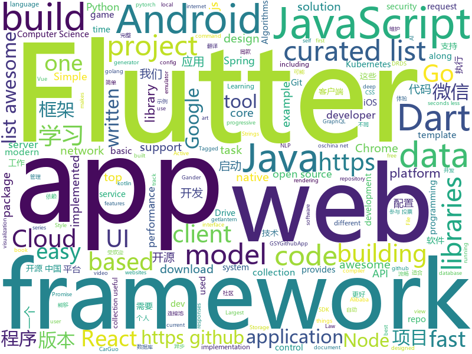

# 2018-11-27
See what the GitHub community is most excited about today.

## python
* [trape](https://github.com/jofpin/trape)(**522 stars today**): People tracker on the Internet: OSINT analysis and research tool.
* [QuickDraw](https://github.com/1991viet/QuickDraw)(**214 stars today**): Implementation of Quickdraw - an online game developed by Google
* [3DDFA](https://github.com/cleardusk/3DDFA)(**165 stars today**): The pytorch improved re-implementation of TPAMI 2017 paper: Face Alignment in Full Pose Range: A 3D Total Solution.
* [tencent-ml-images](https://github.com/Tencent/tencent-ml-images)(**151 stars today**): Largest multi-label image database; ResNet-101 model; 80.73% top-1 acc on ImageNet
* [system-design-primer](https://github.com/donnemartin/system-design-primer)(**89 stars today**): Learn how to design large-scale systems. Prep for the system design interview. Includes Anki flashcards.
* [trio](https://github.com/python-trio/trio)(**99 stars today**): Trio – Pythonic async I/O for humans and snake people🐍
* [Python](https://github.com/TheAlgorithms/Python)(**83 stars today**): All Algorithms implemented in Python
* [pnn.pytorch.update](https://github.com/juefeix/pnn.pytorch.update)(**87 stars today**): This repo houses the new PNN code, along with our responses to the issue raised in the recent Reddit discussion. The code is based on Michael Klachko’s repo with slight modification in model.py and main.py. All changes are marked.
* [big-list-of-naughty-strings](https://github.com/minimaxir/big-list-of-naughty-strings)(**84 stars today**): The Big List of Naughty Strings is a list of strings which have a high probability of causing issues when used as user-input data.
* [models](https://github.com/tensorflow/models)(**60 stars today**): Models and examples built with TensorFlow
* [walle-web](https://github.com/meolu/walle-web)(**80 stars today**): walle - 瓦力 开源项目代码部署平台
* [bert](https://github.com/google-research/bert)(**71 stars today**): TensorFlow code and pre-trained models for BERT
* [satpy](https://github.com/pytroll/satpy)(**71 stars today**): Python package for earth-observing satellite data processing
* [pytorch-deeplab-xception](https://github.com/jfzhang95/pytorch-deeplab-xception)(**66 stars today**): DeepLab v3+ model in PyTorch. Support different backbones.
* [chartify](https://github.com/spotify/chartify)(**57 stars today**): Python library that makes it easy for data scientists to create charts.
* [awesome-python](https://github.com/vinta/awesome-python)(**48 stars today**): A curated list of awesome Python frameworks, libraries, software and resources
* [keras](https://github.com/keras-team/keras)(**39 stars today**): Deep Learning for humans
* [youtube-dl](https://github.com/rg3/youtube-dl)(**43 stars today**): Command-line program to download videos from YouTube.com and other video sites
* [face_recognition](https://github.com/ageitgey/face_recognition)(**36 stars today**): The world's simplest facial recognition api for Python and the command line
* [django](https://github.com/django/django)(**33 stars today**): The Web framework for perfectionists with deadlines.
* [flask](https://github.com/pallets/flask)(**38 stars today**): The Python micro framework for building web applications.
* [medicaltorch](https://github.com/perone/medicaltorch)(**41 stars today**): A medical imaging framework for Pytorch
* [medicaldetectiontoolkit](https://github.com/pfjaeger/medicaldetectiontoolkit)(**35 stars today**): 
* [DeepCTR](https://github.com/shenweichen/DeepCTR)(**38 stars today**): DeepCTR is a Easy-to-use,Modular and Extendible package of deep-learning based CTR models along with lots of core components layer which can be used to build your own custom model easily.
* [home-assistant](https://github.com/home-assistant/home-assistant)(**34 stars today**): 🏡Open source home automation that puts local control and privacy first

## java
* [litemall](https://github.com/linlinjava/litemall)(**104 stars today**): 又一个小商城。litemall = Spring Boot后端 + Vue管理员前端 + 微信小程序用户前端
* [JavaGuide](https://github.com/Snailclimb/JavaGuide)(**84 stars today**): 【Java学习+面试指南】 一份涵盖大部分Java程序员所需要掌握的核心知识。
* [spring-cloud-alibaba](https://github.com/spring-cloud-incubator/spring-cloud-alibaba)(**85 stars today**): Spring Cloud Alibaba provides a one-stop solution for application development for the distributed solutions of Alibaba middleware.
* [Gander](https://github.com/Ashok-Varma/Gander)(**76 stars today**): Gander is a simple in-app HTTP inspector for Android OkHttp clients. Gander intercepts and persists all HTTP requests and responses inside your application, and provides a UI for inspecting their content.
* [AndroidAutoSwitcher](https://github.com/Marksss/AndroidAutoSwitcher)(**64 stars today**): AutoSwitchView, a view animating between two items for Android, supports multiple switching animations or you can customize your own strategy of animations. And its child view can be reused.
* [soul](https://github.com/Dromara/soul)(**56 stars today**): 这是一个高性能，异步的响应式的gateway
* [java-design-patterns](https://github.com/iluwatar/java-design-patterns)(**49 stars today**): Design patterns implemented in Java
* [DS4Android](https://github.com/toly1994328/DS4Android)(**52 stars today**): 看得见的数据结构Android版---Show the Data_Structure power by Android View
* [spring-framework](https://github.com/spring-projects/spring-framework)(**39 stars today**): Spring Framework
* [spring-boot](https://github.com/spring-projects/spring-boot)(**39 stars today**): Spring Boot
* [elasticsearch](https://github.com/elastic/elasticsearch)(**34 stars today**): Open Source, Distributed, RESTful Search Engine
* [apollo](https://github.com/ctripcorp/apollo)(**35 stars today**): Apollo（阿波罗）是携程框架部门研发的分布式配置中心，能够集中化管理应用不同环境、不同集群的配置，配置修改后能够实时推送到应用端，并且具备规范的权限、流程治理等特性，适用于微服务配置管理场景。2018年开源中国最受欢迎开源软件评选请参与投票 https://www.oschina.net/project/top_cn_2018
* [resilience4j](https://github.com/resilience4j/resilience4j)(**37 stars today**): Resilience4j is a fault tolerance library designed for Java8 and functional programming
* [JCSprout](https://github.com/crossoverJie/JCSprout)(**32 stars today**): 👨‍🎓Java Core Sprout : basic, concurrent, algorithm
* [tutorials](https://github.com/eugenp/tutorials)(**19 stars today**): The "REST With Spring" Course:
* [Java](https://github.com/TheAlgorithms/Java)(**29 stars today**): All Algorithms implemented in Java
* [druid](https://github.com/alibaba/druid)(**30 stars today**): 阿里巴巴数据库事业部出品，为监控而生的数据库连接池。2018年开源中国最受欢迎开源软件评选请参与投票 https://www.oschina.net/project/top_cn_2018 阿里云DRDS(https://www.aliyun.com/product/drds )、阿里巴巴TDDL 连接池powered by Druid
* [symphony](https://github.com/b3log/symphony)(**29 stars today**): 🎶一款用 Java 实现的现代化社区（论坛/BBS/社交网络/博客）平台。https://hacpai.com
* [incubator-dubbo](https://github.com/apache/incubator-dubbo)(**20 stars today**): Apache Dubbo (incubating) is a high-performance, java based, open source RPC framework.
* [HanLP](https://github.com/hankcs/HanLP)(**27 stars today**): 自然语言处理 中文分词 词性标注 命名实体识别 依存句法分析 新词发现 关键词短语提取 自动摘要 文本分类聚类 拼音简繁
* [netty](https://github.com/netty/netty)(**23 stars today**): Netty project - an event-driven asynchronous network application framework
* [guava](https://github.com/google/guava)(**24 stars today**): Google core libraries for Java
* [weixin-java-tools](https://github.com/Wechat-Group/weixin-java-tools)(**24 stars today**): 全能微信Java开发工具包，支持包括微信支付、开放平台、小程序、企业微信/企业号和公众号等的后端开发
* [AndroidUtilCode](https://github.com/Blankj/AndroidUtilCode)(**23 stars today**): 🔥Android developers should collect the following utils(updating).
* [SpringCloudLearning](https://github.com/forezp/SpringCloudLearning)(**21 stars today**): 《史上最简单的Spring Cloud教程源码》

## unknown
* [CS-Notes](https://github.com/CyC2018/CS-Notes)(**224 stars today**): 📚Computer Science Learning Notes
* [http3-explained](https://github.com/bagder/http3-explained)(**92 stars today**): A document describing the HTTP/3 and QUIC protocols
* [dc-law-xml](https://github.com/DCCouncil/dc-law-xml)(**92 stars today**): DC Law - statutes and code - in xml format. (project: https://github.com/DCCouncil/dc-law)
* [You-Dont-Know-JS](https://github.com/getify/You-Dont-Know-JS)(**71 stars today**): A book series on JavaScript. @YDKJS on twitter.
* [gitignore](https://github.com/github/gitignore)(**55 stars today**): A collection of useful .gitignore templates
* [awesome](https://github.com/sindresorhus/awesome)(**69 stars today**): 😎Curated list of awesome lists
* [developer-roadmap](https://github.com/kamranahmedse/developer-roadmap)(**66 stars today**): Roadmap to becoming a web developer in 2018
* [free-programming-books](https://github.com/EbookFoundation/free-programming-books)(**56 stars today**): 📚Freely available programming books
* [OI-wiki](https://github.com/24OI/OI-wiki)(**55 stars today**): 🌟Wiki for OI / ICPC. （某大型游戏线上攻略，内含炫酷算术魔法）
* [awful-ai](https://github.com/daviddao/awful-ai)(**54 stars today**): 😈Awful AI is a curated list to track current scary usages of AI - hoping to raise awareness
* [awesome-vue](https://github.com/vuejs/awesome-vue)(**47 stars today**): 🎉A curated list of awesome things related to Vue.js
* [coding-interview-university](https://github.com/jwasham/coding-interview-university)(**42 stars today**): A complete computer science study plan to become a software engineer.
* [architect-awesome](https://github.com/xingshaocheng/architect-awesome)(**38 stars today**): 后端架构师技术图谱
* [Best-websites-a-programmer-should-visit](https://github.com/sdmg15/Best-websites-a-programmer-should-visit)(**36 stars today**): 🔗Some useful websites for programmers.
* [kubernetes-the-hard-way](https://github.com/kelseyhightower/kubernetes-the-hard-way)(**31 stars today**): Bootstrap Kubernetes the hard way on Google Cloud Platform. No scripts.
* [build-your-own-x](https://github.com/danistefanovic/build-your-own-x)(**33 stars today**): 🤓Build your own (insert technology here)
* [biblioteca-espanol-gratis](https://github.com/rosepac/biblioteca-espanol-gratis)(**28 stars today**): 📚Biblioteca de libros, cursos y recursos para el aprendizaje de la programación y mucho más, 100% gratis en español.
* [awesome-burp-extensions](https://github.com/snoopysecurity/awesome-burp-extensions)(**29 stars today**): A curated list of amazingly awesome Burp Extensions
* [gold-miner](https://github.com/xitu/gold-miner)(**26 stars today**): 🥇掘金翻译计划，可能是世界最大最好的英译中技术社区，最懂读者和译者的翻译平台：
* [100-Days-Of-ML-Code](https://github.com/Avik-Jain/100-Days-Of-ML-Code)(**24 stars today**): 100 Days of ML Coding
* [awesome-cpp](https://github.com/fffaraz/awesome-cpp)(**24 stars today**): A curated list of awesome C++ (or C) frameworks, libraries, resources, and shiny things. Inspired by awesome-... stuff.
* [android-architecture](https://github.com/googlesamples/android-architecture)(**21 stars today**): A collection of samples to discuss and showcase different architectural tools and patterns for Android apps.
* [nodebestpractices](https://github.com/i0natan/nodebestpractices)(**24 stars today**): The largest Node.JS best practices list (November 2018)
* [AD-Attack-Defense](https://github.com/infosecn1nja/AD-Attack-Defense)(**24 stars today**): Active Directory Security For Red & Blue Team
* [computer-science](https://github.com/ossu/computer-science)(**22 stars today**): 🎓Path to a free self-taught education in Computer Science!

## javascript
* [learnGitBranching](https://github.com/pcottle/learnGitBranching)(**453 stars today**): An interactive git visualization to challenge and educate!
* [edex-ui](https://github.com/GitSquared/edex-ui)(**395 stars today**): A science fiction terminal emulator designed for large touchscreens that runs on all major OSs.
* [progress-estimator](https://github.com/bvaughn/progress-estimator)(**334 stars today**): Logs a progress bar and estimation for how long a Promise will take to complete
* [cms.js](https://github.com/chrisdiana/cms.js)(**257 stars today**): Client-Side JavaScript Site Generator
* [htm](https://github.com/developit/htm)(**208 stars today**): Hyperscript Tagged Markup: JSX alternative using standard tagged templates, with compiler support.
* [vue](https://github.com/vuejs/vue)(**149 stars today**): 🖖A progressive, incrementally-adoptable JavaScript framework for building UI on the web.
* [nivo](https://github.com/plouc/nivo)(**153 stars today**): nivo provides a rich set of dataviz components, built on top of the awesome d3 and Reactjs libraries
* [cytoscape.js](https://github.com/cytoscape/cytoscape.js)(**134 stars today**): Graph theory (network) library for visualisation and analysis
* [react](https://github.com/facebook/react)(**108 stars today**): A declarative, efficient, and flexible JavaScript library for building user interfaces.
* [33-js-concepts](https://github.com/leonardomso/33-js-concepts)(**102 stars today**): 📜33 concepts every JavaScript developer should know.
* [ncc](https://github.com/zeit/ncc)(**104 stars today**): Node.js Compiler Collection
* [carlo](https://github.com/GoogleChromeLabs/carlo)(**78 stars today**): Web rendering surface for Node applications
* [create-react-app](https://github.com/facebook/create-react-app)(**65 stars today**): Set up a modern web app by running one command.
* [free-programming-books-zh_CN](https://github.com/justjavac/free-programming-books-zh_CN)(**65 stars today**): 📚免费的计算机编程类中文书籍，欢迎投稿
* [33-js-concepts](https://github.com/stephentian/33-js-concepts)(**64 stars today**): 📜每个 JavaScript 工程师都应懂的33个概念 @leonardomso
* [javascript-algorithms](https://github.com/trekhleb/javascript-algorithms)(**56 stars today**): 📝Algorithms and data structures implemented in JavaScript with explanations and links to further readings
* [30-seconds-of-code](https://github.com/30-seconds/30-seconds-of-code)(**58 stars today**): Curated collection of useful JavaScript snippets that you can understand in 30 seconds or less.
* [taro](https://github.com/NervJS/taro)(**54 stars today**): 多端统一开发框架，支持用 React 的开发方式编写一次代码，生成能运行在微信小程序/百度智能小程序/支付宝小程序、H5、React Native 等的应用。 https://taro.js.org/
* [DoodleMaster](https://github.com/karanchahal/DoodleMaster)(**58 stars today**): "Don't code your UI, Draw it !"
* [puppeteer](https://github.com/GoogleChrome/puppeteer)(**53 stars today**): Headless Chrome Node API
* [javascript](https://github.com/airbnb/javascript)(**52 stars today**): JavaScript Style Guide
* [style2paints](https://github.com/lllyasviel/style2paints)(**54 stars today**): sketch + style = paints🎨
* [autoComplete.js](https://github.com/TarekRaafat/autoComplete.js)(**54 stars today**): Simple autocomplete pure vanilla Javascript library.
* [axios](https://github.com/axios/axios)(**54 stars today**): Promise based HTTP client for the browser and node.js
* [node](https://github.com/nodejs/node)(**47 stars today**): Node.js JavaScript runtime✨🐢🚀✨

## html
* [nginxconfig.io](https://github.com/valentinxxx/nginxconfig.io)(**243 stars today**): ⚙️NGiИX config generator generator on steroids💉
* [patchwork](https://github.com/jlord/patchwork)(****): All the Git-it Workshop completers!
* [manuals](https://github.com/skr-shop/manuals)(**28 stars today**): Do design No code📖
* [ionic](https://github.com/ionic-team/ionic)(**22 stars today**): Build amazing native and progressive web apps with open web technologies. One app running on everything🎉
* [AdminLTE](https://github.com/almasaeed2010/AdminLTE)(**20 stars today**): AdminLTE - Free Premium Admin control Panel Theme Based On Bootstrap 3.x
* [Coursera-ML-AndrewNg-Notes](https://github.com/fengdu78/Coursera-ML-AndrewNg-Notes)(**20 stars today**): 吴恩达老师的机器学习课程个人笔记
* [Spoon-Knife](https://github.com/octocat/Spoon-Knife)(****): This repo is for demonstration purposes only.
* [alpha](https://github.com/alibaba/alpha)(**17 stars today**): Alpha是一个基于PERT图构建的Android异步启动框架，它简单，高效，功能完善。 在应用启动的时候，我们通常会有很多工作需要做，为了提高启动速度，我们会尽可能让这些工作并发进行。但这些工作之间可能存在前后依赖的关系，所以我们又需要想办法保证他们执行顺序的正确性。Alpha就是为此而设计的，使用者只需定义好自己的task，并描述它依赖的task，将它添加到Project中。框架会自动并发有序地执行这些task，并将执行的结果抛出来。
* [portainer](https://github.com/portainer/portainer)(**15 stars today**): Simple management UI for Docker
* [styleguide](https://github.com/google/styleguide)(**13 stars today**): Style guides for Google-originated open-source projects
* [fastText](https://github.com/facebookresearch/fastText)(**14 stars today**): Library for fast text representation and classification.
* [swagger-codegen](https://github.com/swagger-api/swagger-codegen)(**12 stars today**): swagger-codegen contains a template-driven engine to generate documentation, API clients and server stubs in different languages by parsing your OpenAPI / Swagger definition.
* [nndl.github.io](https://github.com/nndl/nndl.github.io)(**13 stars today**): 《神经网络与深度学习》 Neural Network and Deep Learning
* [TranslatorX](https://github.com/pingfangx/TranslatorX)(**13 stars today**): JetBrains 系列软件汉化包
* [react-app-rewired](https://github.com/timarney/react-app-rewired)(**12 stars today**): Override create-react-app webpack configs without ejecting
* [react-redux](https://github.com/reduxjs/react-redux)(**11 stars today**): Official React bindings for Redux
* [CSS-file-icons](https://github.com/colorswall/CSS-file-icons)(**10 stars today**): Pure CSS icons for popular file extensions
* [ecma262](https://github.com/tc39/ecma262)(**11 stars today**): Status, process, and documents for ECMA262
* [excalibur](https://github.com/camelot-dev/excalibur)(**11 stars today**): Excalibur: A web interface to extract tabular data from PDFs
* [Blog](https://github.com/ljianshu/Blog)(**10 stars today**): 个人博客及其源代码
* [electron-api-demos](https://github.com/electron/electron-api-demos)(**9 stars today**): Explore the Electron APIs
* [30-seconds-of-css](https://github.com/30-seconds/30-seconds-of-css)(**9 stars today**): A curated collection of useful CSS snippets you can understand in 30 seconds or less.
* [now-github-starter](https://github.com/zeit/now-github-starter)(****): Starter project to demonstrate a project whose pull requests get automatically deployed
* [awesome-creative-coding](https://github.com/terkelg/awesome-creative-coding)(**8 stars today**): 🎨Creative Coding: Generative Art, Data visualization, Interaction Design, Resources.
* [NLP-progress](https://github.com/sebastianruder/NLP-progress)(**6 stars today**): Repository to track the progress in Natural Language Processing (NLP), including the datasets and the current state-of-the-art for the most common NLP tasks.

## dart
* [awesome-flutter](https://github.com/Solido/awesome-flutter)(**149 stars today**): An awesome list that curates the best Flutter libraries, tools, tutorials, articles and more.
* [flutter](https://github.com/flutter/flutter)(**98 stars today**): Flutter makes it easy and fast to build beautiful mobile apps.
* [GSYGithubAppFlutter](https://github.com/CarGuo/GSYGithubAppFlutter)(**17 stars today**): 超完整的Flutter项目，功能丰富，适合学习和日常使用。GSYGithubApp系列的优势：我们目前已经拥有Flutter、Weex、ReactNative、kotlin 四个版本。 功能齐全，项目框架内技术涉及面广，完成度高，持续维护，配套文章，适合全面学习，对比参考。跨平台的开源Github客户端App，更好的体验，更丰富的功能，旨在更好的日常管理和维护个人Github，提供更好更方便的驾车体验Σ(￣。￣ﾉ)ﾉ。同款Weex版本 ： https://github.com/CarGuo/GSYGithubAppWeex 、同款React Native版本 ： https://github.com/CarGuo/GSYGithubApp 、原生 kotlin 版本 https://g…
* [plugins](https://github.com/flutter/plugins)(**10 stars today**): Plugins for Flutter, including FlutterFire, maintained by the Flutter team
* [dio](https://github.com/flutterchina/dio)(**13 stars today**): A powerful Http client for Dart, which supports Interceptors, FormData, Request Cancellation, File Downloading, Timeout etc.
* [samples](https://github.com/flutter/samples)(**11 stars today**): A collection of Flutter examples and demos.
* [Flutter-learning](https://github.com/AweiLoveAndroid/Flutter-learning)(**9 stars today**): 🔥👍🌟⭐️⭐️⭐️Flutter安装和配置，Flutter开发遇到的难题，Flutter示例代码和模板，Flutter项目实战，Dart语言学习示例代码。
* [flutter_wanandroid](https://github.com/Sky24n/flutter_wanandroid)(**8 stars today**): 一个完整的Flutter项目，BLoC、国际化、启动页、引导页
* [kamino](https://github.com/ApolloTVofficial/kamino)(**6 stars today**): The official Kamino (iOS and Android app) repository for ApolloTV.
* [sdk](https://github.com/dart-lang/sdk)(**5 stars today**): The Dart SDK, including the VM, dart2js, core libraries, and more.
* [flame](https://github.com/luanpotter/flame)(**5 stars today**): A minimalist Flutter game engine
* [graphql-flutter](https://github.com/zino-app/graphql-flutter)(**5 stars today**): A GraphQL client for Flutter, bringing all the features from a modern GraphQL client to one easy to use package.
* [chromedeveditor](https://github.com/googlearchive/chromedeveditor)(****): Chrome Dev Editor is a developer tool for building apps on the Chrome platform - Chrome Apps and Web Apps, in JavaScript or Dart. (NO LONGER IN ACTIVE DEVELOPMENT)
* [FlutterExampleApps](https://github.com/iampawan/FlutterExampleApps)(****): [Example APPS] Basic Flutter apps, for flutter devs.
* [Flutter-UI-Kit](https://github.com/iampawan/Flutter-UI-Kit)(****): Flutter app for collection of UI in a UIKit
* [flutter_architecture_samples](https://github.com/brianegan/flutter_architecture_samples)(****): TodoMVC for Flutter
* [flutter-examples](https://github.com/nisrulz/flutter-examples)(****): [Examples] Simple basic isolated apps, for budding flutter devs.
* [inKino](https://github.com/roughike/inKino)(****): A multiplatform Dart movie app with 40% of code sharing between Flutter and the Web.
* [flutter-osc](https://github.com/yubo725/flutter-osc)(****): 基于Google Flutter的开源中国客户端，支持Android和iOS。
* [zhihu-flutter](https://github.com/HackSoul/zhihu-flutter)(****): Flutter 高仿知乎 UI，非常漂亮，也非常流畅，flutter build apk 或 flutter build ios 之后更流畅
* [hauberk](https://github.com/munificent/hauberk)(****): A web-based roguelike written in Dart.
* [angular](https://github.com/dart-lang/angular)(****): Fast and productive web framework provided by Dart
* [StageXL](https://github.com/bp74/StageXL)(****): A fast and universal 2D rendering engine for HTML5 and Dart.
* [dart-sass](https://github.com/sass/dart-sass)(****): A Dart implementation of Sass.
* [Flutter-Notebook](https://github.com/OpenFlutter/Flutter-Notebook)(****): 日更的FlutterDemo合集，今天你fu了吗

## go
* [dive](https://github.com/wagoodman/dive)(**3,172 stars today**): A tool for exploring each layer in a docker image
* [goboy](https://github.com/Humpheh/goboy)(**182 stars today**): Multi-platform Nintendo Game Boy Color emulator written in Go
* [hydra](https://github.com/ory/hydra)(**95 stars today**): OpenID Connect certified OAuth2 Server - cloud native, security-first, open source API security for your infrastructure. Written in Go. SDKs for any language.
* [evilginx2](https://github.com/kgretzky/evilginx2)(**76 stars today**): Standalone man-in-the-middle attack framework used for phishing login credentials along with session cookies, allowing for the bypass of 2-factor authentication
* [go](https://github.com/golang/go)(**67 stars today**): The Go programming language
* [autopprof](https://github.com/rakyll/autopprof)(**51 stars today**): Pprof made easy at development time for Go
* [kubernetes](https://github.com/kubernetes/kubernetes)(**38 stars today**): Production-Grade Container Scheduling and Management
* [frp](https://github.com/fatedier/frp)(**42 stars today**): A fast reverse proxy to help you expose a local server behind a NAT or firewall to the internet.
* [lorca](https://github.com/zserge/lorca)(**44 stars today**): Build cross-platform modern desktop apps in Go + HTML5
* [roadrunner](https://github.com/spiral/roadrunner)(**41 stars today**): High-performance PHP application server, load-balancer and process manager written in Golang
* [mercure](https://github.com/dunglas/mercure)(**40 stars today**): Server-sent live updates: protocol and reference implementation
* [awesome-go](https://github.com/avelino/awesome-go)(**38 stars today**): A curated list of awesome Go frameworks, libraries and software
* [build-web-application-with-golang](https://github.com/astaxie/build-web-application-with-golang)(**33 stars today**): A golang ebook intro how to build a web with golang
* [gin](https://github.com/gin-gonic/gin)(**33 stars today**): Gin is a HTTP web framework written in Go (Golang). It features a Martini-like API with much better performance -- up to 40 times faster. If you need smashing performance, get yourself some Gin.
* [v2ray-core](https://github.com/v2ray/v2ray-core)(**25 stars today**): A platform for building proxies to bypass network restrictions.
* [istio](https://github.com/istio/istio)(**25 stars today**): Connect, secure, control, and observe services.
* [BaiduPCS-Go](https://github.com/iikira/BaiduPCS-Go)(**26 stars today**): 百度网盘客户端 - Go语言编写
* [gogs](https://github.com/gogs/gogs)(**25 stars today**): Gogs is a painless self-hosted Git service.
* [kubectl-trace](https://github.com/fntlnz/kubectl-trace)(**27 stars today**): Schedule bpftrace programs on your kubernetes cluster using the kubectl
* [sso](https://github.com/buzzfeed/sso)(**26 stars today**): sso, aka S.S.Octopus, aka octoboi, is a single sign-on solution for securing internal services
* [lantern](https://github.com/getlantern/lantern)(**24 stars today**): 🔴蓝灯最新版本下载 https://github.com/getlantern/download🔴Lantern Latest Download https://github.com/getlantern/download🔴
* [rclone](https://github.com/ncw/rclone)(**25 stars today**): "rsync for cloud storage" - Google Drive, Amazon Drive, S3, Dropbox, Backblaze B2, One Drive, Swift, Hubic, Cloudfiles, Google Cloud Storage, Yandex Files
* [helm](https://github.com/helm/helm)(**23 stars today**): The Kubernetes Package Manager
* [prometheus](https://github.com/prometheus/prometheus)(**24 stars today**): The Prometheus monitoring system and time series database.
* [hugo](https://github.com/gohugoio/hugo)(**24 stars today**): The world’s fastest framework for building websites.

## WordCloud

