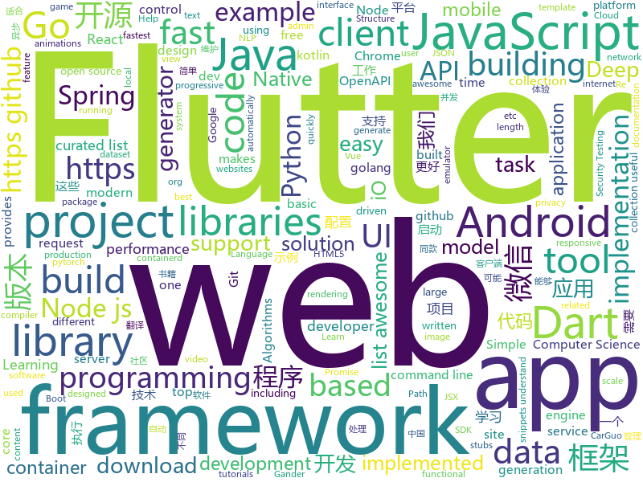

# 2018-11-28
See what the GitHub community is most excited about today.

## python
* [trape](https://github.com/jofpin/trape)(**527 stars today**): People tracker on the Internet: OSINT analysis and research tool.
* [QuickDraw](https://github.com/1991viet/QuickDraw)(**151 stars today**): Implementation of Quickdraw - an online game developed by Google
* [bert](https://github.com/google-research/bert)(**94 stars today**): TensorFlow code and pre-trained models for BERT
* [big-list-of-naughty-strings](https://github.com/minimaxir/big-list-of-naughty-strings)(**102 stars today**): The Big List of Naughty Strings is a list of strings which have a high probability of causing issues when used as user-input data.
* [reaver-pysc2](https://github.com/inoryy/reaver-pysc2)(**92 stars today**): Reaver: StarCraft II Deep Reinforcement Learning Agent. Modular DRL framework. Works with Gym, Atari, and MuJoCo as well.
* [Python](https://github.com/TheAlgorithms/Python)(**83 stars today**): All Algorithms implemented in Python
* [models](https://github.com/tensorflow/models)(**65 stars today**): Models and examples built with TensorFlow
* [trio](https://github.com/python-trio/trio)(**80 stars today**): Trio – Pythonic async I/O for humans and snake people🐍
* [system-design-primer](https://github.com/donnemartin/system-design-primer)(**70 stars today**): Learn how to design large-scale systems. Prep for the system design interview. Includes Anki flashcards.
* [fastMRI](https://github.com/facebookresearch/fastMRI)(**69 stars today**): A large-scale dataset of both raw MRI measurements and clinical MRI images
* [3DDFA](https://github.com/cleardusk/3DDFA)(**66 stars today**): The pytorch improved re-implementation of TPAMI 2017 paper: Face Alignment in Full Pose Range: A 3D Total Solution.
* [tencent-ml-images](https://github.com/Tencent/tencent-ml-images)(**68 stars today**): Largest multi-label image database; ResNet-101 model; 80.73% top-1 acc on ImageNet
* [d2l-en](https://github.com/diveintodeeplearning/d2l-en)(**51 stars today**): Dive into Deep Learning (CV chapters coming soon)
* [keras](https://github.com/keras-team/keras)(**48 stars today**): Deep Learning for humans
* [walle-web](https://github.com/meolu/walle-web)(**52 stars today**): walle - 瓦力 开源项目代码部署平台
* [youtube-dl](https://github.com/rg3/youtube-dl)(**42 stars today**): Command-line program to download videos from YouTube.com and other video sites
* [PySyft](https://github.com/OpenMined/PySyft)(**44 stars today**): A library for encrypted, privacy preserving deep learning
* [awesome-python](https://github.com/vinta/awesome-python)(**41 stars today**): A curated list of awesome Python frameworks, libraries, software and resources
* [public-apis](https://github.com/toddmotto/public-apis)(**38 stars today**): A collective list of public JSON APIs for use in web development.
* [chartify](https://github.com/spotify/chartify)(**38 stars today**): Python library that makes it easy for data scientists to create charts.
* [Python](https://github.com/geekcomputers/Python)(**34 stars today**): My Python Examples
* [flask](https://github.com/pallets/flask)(**34 stars today**): The Python micro framework for building web applications.
* [cpython](https://github.com/python/cpython)(**32 stars today**): The Python programming language
* [bert-as-service](https://github.com/hanxiao/bert-as-service)(**33 stars today**): Mapping a variable-length sentence to a fixed-length vector using BERT model
* [home-assistant](https://github.com/home-assistant/home-assistant)(**32 stars today**): 🏡Open source home automation that puts local control and privacy first

## java
* [litemall](https://github.com/linlinjava/litemall)(**134 stars today**): 又一个小商城。litemall = Spring Boot后端 + Vue管理员前端 + 微信小程序用户前端
* [JavaGuide](https://github.com/Snailclimb/JavaGuide)(**117 stars today**): 【Java学习+面试指南】 一份涵盖大部分Java程序员所需要掌握的核心知识。
* [spring-cloud-alibaba](https://github.com/spring-cloud-incubator/spring-cloud-alibaba)(**58 stars today**): Spring Cloud Alibaba provides a one-stop solution for application development for the distributed solutions of Alibaba middleware.
* [resilience4j](https://github.com/resilience4j/resilience4j)(**56 stars today**): Resilience4j is a fault tolerance library designed for Java8 and functional programming
* [DS4Android](https://github.com/toly1994328/DS4Android)(**55 stars today**): 看得见的数据结构Android版---Show the Data_Structure power by Android View
* [spring-boot](https://github.com/spring-projects/spring-boot)(**43 stars today**): Spring Boot
* [apollo](https://github.com/ctripcorp/apollo)(**45 stars today**): Apollo（阿波罗）是携程框架部门研发的分布式配置中心，能够集中化管理应用不同环境、不同集群的配置，配置修改后能够实时推送到应用端，并且具备规范的权限、流程治理等特性，适用于微服务配置管理场景。2018年开源中国最受欢迎开源软件评选请参与投票 https://www.oschina.net/project/top_cn_2018
* [java-design-patterns](https://github.com/iluwatar/java-design-patterns)(**39 stars today**): Design patterns implemented in Java
* [tutorials](https://github.com/eugenp/tutorials)(**26 stars today**): The "REST With Spring" Course:
* [Gander](https://github.com/Ashok-Varma/Gander)(**43 stars today**): Gander is a simple in-app HTTP inspector for Android OkHttp clients. Gander intercepts and persists all HTTP requests and responses inside your application, and provides a UI for inspecting their content.
* [moshi](https://github.com/square/moshi)(**42 stars today**): A modern JSON library for Kotlin and Java.
* [weixin-java-tools](https://github.com/Wechat-Group/weixin-java-tools)(**37 stars today**): 全能微信Java开发工具包，支持包括微信支付、开放平台、小程序、企业微信/企业号和公众号等的后端开发
* [incubator-dubbo](https://github.com/apache/incubator-dubbo)(**34 stars today**): Apache Dubbo (incubating) is a high-performance, java based, open source RPC framework.
* [thinking-in-spring-boot-samples](https://github.com/mercyblitz/thinking-in-spring-boot-samples)(**39 stars today**): 小马哥书籍《Spring Boot 编程思想》示例工程
* [spring-framework](https://github.com/spring-projects/spring-framework)(**31 stars today**): Spring Framework
* [JCSprout](https://github.com/crossoverJie/JCSprout)(**31 stars today**): 👨‍🎓Java Core Sprout : basic, concurrent, algorithm
* [AndroidAutoSwitcher](https://github.com/Marksss/AndroidAutoSwitcher)(**35 stars today**): AutoSwitchView, a view animating between two items for Android, supports multiple switching animations or you can customize your own strategy of animations. And its child view can be reused.
* [guava](https://github.com/google/guava)(**32 stars today**): Google core libraries for Java
* [HanLP](https://github.com/hankcs/HanLP)(**31 stars today**): 自然语言处理 中文分词 词性标注 命名实体识别 依存句法分析 新词发现 关键词短语提取 自动摘要 文本分类聚类 拼音简繁
* [symphony](https://github.com/b3log/symphony)(**31 stars today**): 🎶一款用 Java 实现的现代化社区（论坛/BBS/社交网络/博客）平台。https://hacpai.com
* [elasticsearch](https://github.com/elastic/elasticsearch)(**24 stars today**): Open Source, Distributed, RESTful Search Engine
* [easyexcel](https://github.com/alibaba/easyexcel)(**30 stars today**): 快速、简单避免OOM的java处理Excel工具
* [netty](https://github.com/netty/netty)(**26 stars today**): Netty project - an event-driven asynchronous network application framework
* [soul](https://github.com/Dromara/soul)(**24 stars today**): 这是一个高性能，异步的响应式的gateway
* [Java](https://github.com/TheAlgorithms/Java)(**20 stars today**): All Algorithms implemented in Java

## unknown
* [http3-explained](https://github.com/bagder/http3-explained)(**255 stars today**): A document describing the HTTP/3 and QUIC protocols
* [CS-Notes](https://github.com/CyC2018/CS-Notes)(**156 stars today**): 📚Computer Science Learning Notes
* [daizhigev20](https://github.com/garychowcmu/daizhigev20)(**151 stars today**): 殆知阁古代文献
* [github-drama](https://github.com/nikolas/github-drama)(**161 stars today**): "locked and limited conversation to collaborators"
* [awesome](https://github.com/sindresorhus/awesome)(**125 stars today**): 😎Curated list of awesome lists
* [gitignore](https://github.com/github/gitignore)(**65 stars today**): A collection of useful .gitignore templates
* [You-Dont-Know-JS](https://github.com/getify/You-Dont-Know-JS)(**58 stars today**): A book series on JavaScript. @YDKJS on twitter.
* [Best-websites-a-programmer-should-visit](https://github.com/sdmg15/Best-websites-a-programmer-should-visit)(**61 stars today**): 🔗Some useful websites for programmers.
* [developer-roadmap](https://github.com/kamranahmedse/developer-roadmap)(**54 stars today**): Roadmap to becoming a web developer in 2018
* [free-programming-books](https://github.com/EbookFoundation/free-programming-books)(**55 stars today**): 📚Freely available programming books
* [coding-interview-university](https://github.com/jwasham/coding-interview-university)(**42 stars today**): A complete computer science study plan to become a software engineer.
* [first-contributions](https://github.com/firstcontributions/first-contributions)(**28 stars today**): 🚀✨Help beginners to contribute to open source projects
* [awesome-vue](https://github.com/vuejs/awesome-vue)(**38 stars today**): 🎉A curated list of awesome things related to Vue.js
* [dc-law-xml](https://github.com/DCCouncil/dc-law-xml)(**37 stars today**): DC Law - statutes and code - in xml format. (project: https://github.com/DCCouncil/dc-law)
* [build-your-own-x](https://github.com/danistefanovic/build-your-own-x)(**35 stars today**): 🤓Build your own (insert technology here)
* [biblioteca-espanol-gratis](https://github.com/rosepac/biblioteca-espanol-gratis)(**27 stars today**): 📚Biblioteca de libros, cursos y recursos para el aprendizaje de la programación y mucho más, 100% gratis en español.
* [aws-devops-essential](https://github.com/awslabs/aws-devops-essential)(**31 stars today**): In few hours, quickly learn how to effectively leverage various AWS services to improve developer productivity and reduce the overall time to market for new product capabilities.
* [git-flight-rules](https://github.com/k88hudson/git-flight-rules)(**32 stars today**): Flight rules for git
* [android-architecture](https://github.com/googlesamples/android-architecture)(**27 stars today**): A collection of samples to discuss and showcase different architectural tools and patterns for Android apps.
* [gold-miner](https://github.com/xitu/gold-miner)(**29 stars today**): 🥇掘金翻译计划，可能是世界最大最好的英译中技术社区，最懂读者和译者的翻译平台：
* [Awesome-pytorch-list](https://github.com/bharathgs/Awesome-pytorch-list)(**27 stars today**): A comprehensive list of pytorch related content on github,such as different models,implementations,helper libraries,tutorials etc.
* [architect-awesome](https://github.com/xingshaocheng/architect-awesome)(**23 stars today**): 后端架构师技术图谱
* [OpenAPI-Specification](https://github.com/OAI/OpenAPI-Specification)(**21 stars today**): The OpenAPI Specification Repository
* [awesome-nodejs](https://github.com/sindresorhus/awesome-nodejs)(**24 stars today**): ⚡️Delightful Node.js packages and resources
* [computer-science](https://github.com/ossu/computer-science)(**24 stars today**): 🎓Path to a free self-taught education in Computer Science!

## javascript
* [learnGitBranching](https://github.com/pcottle/learnGitBranching)(**648 stars today**): An interactive git visualization to challenge and educate!
* [edex-ui](https://github.com/GitSquared/edex-ui)(**443 stars today**): A science fiction terminal emulator designed for large touchscreens that runs on all major OSs.
* [ncc](https://github.com/zeit/ncc)(**425 stars today**): Node.js Compiler Collection
* [progress-estimator](https://github.com/bvaughn/progress-estimator)(**266 stars today**): Logs a progress bar and estimation for how long a Promise will take to complete
* [event-stream](https://github.com/dominictarr/event-stream)(**185 stars today**): EventStream is like functional programming meets IO
* [vue](https://github.com/vuejs/vue)(**160 stars today**): 🖖A progressive, incrementally-adoptable JavaScript framework for building UI on the web.
* [cms.js](https://github.com/chrisdiana/cms.js)(**144 stars today**): Client-Side JavaScript Site Generator
* [react](https://github.com/facebook/react)(**128 stars today**): A declarative, efficient, and flexible JavaScript library for building user interfaces.
* [htm](https://github.com/developit/htm)(**139 stars today**): Hyperscript Tagged Markup: JSX alternative using standard tagged templates, with compiler support.
* [Random-waifu-generater](https://github.com/reed-chan/Random-waifu-generater)(**70 stars today**): Random waifu generator,generate your best waifu
* [javascript-algorithms](https://github.com/trekhleb/javascript-algorithms)(**76 stars today**): 📝Algorithms and data structures implemented in JavaScript with explanations and links to further readings
* [33-js-concepts](https://github.com/leonardomso/33-js-concepts)(**73 stars today**): 📜33 concepts every JavaScript developer should know.
* [axios](https://github.com/axios/axios)(**72 stars today**): Promise based HTTP client for the browser and node.js
* [taro](https://github.com/NervJS/taro)(**68 stars today**): 多端统一开发框架，支持用 React 的开发方式编写一次代码，生成能运行在微信小程序/百度智能小程序/支付宝小程序、H5、React Native 等的应用。 https://taro.js.org/
* [omi](https://github.com/Tencent/omi)(**70 stars today**): Next generation web framework in 4kb JavaScript (Web Components + JSX + Proxy + Store + Path Updating)
* [30-seconds-of-code](https://github.com/30-seconds/30-seconds-of-code)(**67 stars today**): Curated collection of useful JavaScript snippets that you can understand in 30 seconds or less.
* [free-programming-books-zh_CN](https://github.com/justjavac/free-programming-books-zh_CN)(**60 stars today**): 📚免费的计算机编程类中文书籍，欢迎投稿
* [create-react-app](https://github.com/facebook/create-react-app)(**56 stars today**): Set up a modern web app by running one command.
* [gandissect](https://github.com/CSAILVision/gandissect)(**63 stars today**): Analytical tools for visualizing and understanding the neurons of a GAN. https://gandissect.csail.mit.edu/
* [node](https://github.com/nodejs/node)(**54 stars today**): Node.js JavaScript runtime✨🐢🚀✨
* [cytoscape.js](https://github.com/cytoscape/cytoscape.js)(**60 stars today**): Graph theory (network) library for visualisation and analysis
* [nivo](https://github.com/plouc/nivo)(**61 stars today**): nivo provides a rich set of dataviz components, built on top of the awesome d3 and Reactjs libraries
* [carlo](https://github.com/GoogleChromeLabs/carlo)(**58 stars today**): Web rendering surface for Node applications
* [puppeteer](https://github.com/GoogleChrome/puppeteer)(**55 stars today**): Headless Chrome Node API
* [33-js-concepts](https://github.com/stephentian/33-js-concepts)(**54 stars today**): 📜每个 JavaScript 工程师都应懂的33个概念 @leonardomso

## html
* [nginxconfig.io](https://github.com/valentinxxx/nginxconfig.io)(**166 stars today**): ⚙️NGiИX config generator generator on steroids💉
* [ionic](https://github.com/ionic-team/ionic)(**27 stars today**): Build amazing native and progressive web apps with open web technologies. One app running on everything🎉
* [AdminLTE](https://github.com/almasaeed2010/AdminLTE)(**26 stars today**): AdminLTE - Free Premium Admin control Panel Theme Based On Bootstrap 3.x
* [NLP-progress](https://github.com/sebastianruder/NLP-progress)(**26 stars today**): Repository to track the progress in Natural Language Processing (NLP), including the datasets and the current state-of-the-art for the most common NLP tasks.
* [alpha](https://github.com/alibaba/alpha)(**26 stars today**): Alpha是一个基于PERT图构建的Android异步启动框架，它简单，高效，功能完善。 在应用启动的时候，我们通常会有很多工作需要做，为了提高启动速度，我们会尽可能让这些工作并发进行。但这些工作之间可能存在前后依赖的关系，所以我们又需要想办法保证他们执行顺序的正确性。Alpha就是为此而设计的，使用者只需定义好自己的task，并描述它依赖的task，将它添加到Project中。框架会自动并发有序地执行这些task，并将执行的结果抛出来。
* [fastText](https://github.com/facebookresearch/fastText)(**20 stars today**): Library for fast text representation and classification.
* [react-redux](https://github.com/reduxjs/react-redux)(**21 stars today**): Official React bindings for Redux
* [Spoon-Knife](https://github.com/octocat/Spoon-Knife)(****): This repo is for demonstration purposes only.
* [patchwork](https://github.com/jlord/patchwork)(****): All the Git-it Workshop completers!
* [swagger-codegen](https://github.com/swagger-api/swagger-codegen)(**13 stars today**): swagger-codegen contains a template-driven engine to generate documentation, API clients and server stubs in different languages by parsing your OpenAPI / Swagger definition.
* [portainer](https://github.com/portainer/portainer)(**12 stars today**): Simple management UI for Docker
* [TranslatorX](https://github.com/pingfangx/TranslatorX)(**10 stars today**): JetBrains 系列软件汉化包
* [electron-api-demos](https://github.com/electron/electron-api-demos)(**9 stars today**): Explore the Electron APIs
* [solid](https://github.com/solid/solid)(**9 stars today**): Solid - Re-decentralizing the web (project directory)
* [manuals](https://github.com/skr-shop/manuals)(**9 stars today**): Do design No code📖
* [30-seconds-of-css](https://github.com/30-seconds/30-seconds-of-css)(**9 stars today**): A curated collection of useful CSS snippets you can understand in 30 seconds or less.
* [foundation-sites](https://github.com/zurb/foundation-sites)(**8 stars today**): The most advanced responsive front-end framework in the world. Quickly create prototypes and production code for sites that work on any kind of device.
* [EIPs](https://github.com/ethereum/EIPs)(**8 stars today**): The Ethereum Improvement Proposal repository
* [zenbot](https://github.com/DeviaVir/zenbot)(**8 stars today**): Zenbot is a command-line cryptocurrency trading bot using Node.js and MongoDB.
* [excalibur](https://github.com/camelot-dev/excalibur)(**8 stars today**): Excalibur: A web interface to extract tabular data from PDFs
* [speedtest](https://github.com/adolfintel/speedtest)(**7 stars today**): Self-hosted HTML5 Speedtest. Easy setup, examples, configurable, responsive and mobile friendly. Supports PHP, Node, and more.
* [now-github-starter](https://github.com/zeit/now-github-starter)(****): Starter project to demonstrate a project whose pull requests get automatically deployed
* [openapi-generator](https://github.com/OpenAPITools/openapi-generator)(**6 stars today**): OpenAPI Generator allows generation of API client libraries (SDK generation), server stubs, documentation and configuration automatically given an OpenAPI Spec (v2, v3)
* [coreui-free-bootstrap-admin-template](https://github.com/coreui/coreui-free-bootstrap-admin-template)(**7 stars today**): CoreUI is free bootstrap admin template
* [owasp-mstg](https://github.com/OWASP/owasp-mstg)(**7 stars today**): The Mobile Security Testing Guide (MSTG) is a comprehensive manual for mobile app security testing and reverse engineering.

## dart
* [awesome-flutter](https://github.com/Solido/awesome-flutter)(**113 stars today**): An awesome list that curates the best Flutter libraries, tools, tutorials, articles and more.
* [flutter](https://github.com/flutter/flutter)(**85 stars today**): Flutter makes it easy and fast to build beautiful mobile apps.
* [RealRichText](https://github.com/bytedance/RealRichText)(**23 stars today**): A Tricky Solution for Implementing Inline-Image-In-Text Feature in Flutter.
* [plugins](https://github.com/flutter/plugins)(**18 stars today**): Plugins for Flutter, including FlutterFire, maintained by the Flutter team
* [GSYGithubAppFlutter](https://github.com/CarGuo/GSYGithubAppFlutter)(**10 stars today**): 超完整的Flutter项目，功能丰富，适合学习和日常使用。GSYGithubApp系列的优势：我们目前已经拥有Flutter、Weex、ReactNative、kotlin 四个版本。 功能齐全，项目框架内技术涉及面广，完成度高，持续维护，配套文章，适合全面学习，对比参考。跨平台的开源Github客户端App，更好的体验，更丰富的功能，旨在更好的日常管理和维护个人Github，提供更好更方便的驾车体验Σ(￣。￣ﾉ)ﾉ。同款Weex版本 ： https://github.com/CarGuo/GSYGithubAppWeex 、同款React Native版本 ： https://github.com/CarGuo/GSYGithubApp 、原生 kotlin 版本 https://g…
* [dio](https://github.com/flutterchina/dio)(**7 stars today**): A powerful Http client for Dart, which supports Interceptors, FormData, Request Cancellation, File Downloading, Timeout etc.
* [samples](https://github.com/flutter/samples)(**5 stars today**): A collection of Flutter examples and demos.
* [sdk](https://github.com/dart-lang/sdk)(**5 stars today**): The Dart SDK, including the VM, dart2js, core libraries, and more.
* [flutter-mobile](https://github.com/invoiceninja/flutter-mobile)(****): iOS/Android app for Invoice Ninja built with Google Flutter
* [lottie-flutter](https://github.com/dnfield/lottie-flutter)(****): A pure Dart/Flutter implementation of Lottie
* [pub-dartlang-dart](https://github.com/dart-lang/pub-dartlang-dart)(****): The pub.dartlang.org site in Dart
* [chromedeveditor](https://github.com/googlearchive/chromedeveditor)(****): Chrome Dev Editor is a developer tool for building apps on the Chrome platform - Chrome Apps and Web Apps, in JavaScript or Dart. (NO LONGER IN ACTIVE DEVELOPMENT)
* [FlutterExampleApps](https://github.com/iampawan/FlutterExampleApps)(****): [Example APPS] Basic Flutter apps, for flutter devs.
* [Flutter-UI-Kit](https://github.com/iampawan/Flutter-UI-Kit)(****): Flutter app for collection of UI in a UIKit
* [flutter_architecture_samples](https://github.com/brianegan/flutter_architecture_samples)(****): TodoMVC for Flutter
* [flutter-examples](https://github.com/nisrulz/flutter-examples)(****): [Examples] Simple basic isolated apps, for budding flutter devs.
* [inKino](https://github.com/roughike/inKino)(****): A multiplatform Dart movie app with 40% of code sharing between Flutter and the Web.
* [flutter-osc](https://github.com/yubo725/flutter-osc)(****): 基于Google Flutter的开源中国客户端，支持Android和iOS。
* [Flutter-learning](https://github.com/AweiLoveAndroid/Flutter-learning)(****): 🔥👍🌟⭐️⭐️⭐️Flutter安装和配置，Flutter开发遇到的难题，Flutter示例代码和模板，Flutter项目实战，Dart语言学习示例代码。
* [zhihu-flutter](https://github.com/HackSoul/zhihu-flutter)(****): Flutter 高仿知乎 UI，非常漂亮，也非常流畅，flutter build apk 或 flutter build ios 之后更流畅
* [hauberk](https://github.com/munificent/hauberk)(****): A web-based roguelike written in Dart.
* [angular](https://github.com/dart-lang/angular)(****): Fast and productive web framework provided by Dart
* [StageXL](https://github.com/bp74/StageXL)(****): A fast and universal 2D rendering engine for HTML5 and Dart.
* [dart-sass](https://github.com/sass/dart-sass)(****): A Dart implementation of Sass.
* [Flutter-Notebook](https://github.com/OpenFlutter/Flutter-Notebook)(****): 日更的FlutterDemo合集，今天你fu了吗

## go
* [dive](https://github.com/wagoodman/dive)(**1,233 stars today**): A tool for exploring each layer in a docker image
* [goboy](https://github.com/Humpheh/goboy)(**122 stars today**): Multi-platform Nintendo Game Boy Color emulator written in Go
* [mercure](https://github.com/dunglas/mercure)(**105 stars today**): Server-sent live updates: protocol and reference implementation
* [firecracker-containerd](https://github.com/firecracker-microvm/firecracker-containerd)(**99 stars today**): firecracker-containerd enables containerd to manage containers as Firecracker microVMs
* [go](https://github.com/golang/go)(**74 stars today**): The Go programming language
* [terratest](https://github.com/gruntwork-io/terratest)(**68 stars today**): Terratest is a Go library that makes it easier to write automated tests for your infrastructure code.
* [kubernetes](https://github.com/kubernetes/kubernetes)(**57 stars today**): Production-Grade Container Scheduling and Management
* [gin](https://github.com/gin-gonic/gin)(**44 stars today**): Gin is a HTTP web framework written in Go (Golang). It features a Martini-like API with much better performance -- up to 40 times faster. If you need smashing performance, get yourself some Gin.
* [autopprof](https://github.com/rakyll/autopprof)(**45 stars today**): Pprof made easy at development time for Go
* [awesome-go](https://github.com/avelino/awesome-go)(**38 stars today**): A curated list of awesome Go frameworks, libraries and software
* [ipv666](https://github.com/lavalamp-/ipv666)(**36 stars today**): Golang IPv6 address enumeration
* [iris](https://github.com/kataras/iris)(**34 stars today**): The fastest backend community-driven web framework on (THIS) Earth. HTTP/2, MVC and more. Can your favourite web framework do that?👉http://bit.ly/iriscandothat1 or even http://bit.ly/iriscandothat2
* [frp](https://github.com/fatedier/frp)(**33 stars today**): A fast reverse proxy to help you expose a local server behind a NAT or firewall to the internet.
* [helm](https://github.com/helm/helm)(**35 stars today**): The Kubernetes Package Manager
* [istio](https://github.com/istio/istio)(**33 stars today**): Connect, secure, control, and observe services.
* [lantern](https://github.com/getlantern/lantern)(**32 stars today**): 🔴蓝灯最新版本下载 https://github.com/getlantern/download🔴Lantern Latest Download https://github.com/getlantern/download🔴
* [moby](https://github.com/moby/moby)(**27 stars today**): Moby Project - a collaborative project for the container ecosystem to assemble container-based systems
* [gogs](https://github.com/gogs/gogs)(**27 stars today**): Gogs is a painless self-hosted Git service.
* [traefik](https://github.com/containous/traefik)(**27 stars today**): The Cloud Native Edge Router
* [fzf](https://github.com/junegunn/fzf)(**27 stars today**): 🌸A command-line fuzzy finder
* [lorca](https://github.com/zserge/lorca)(**27 stars today**): Build cross-platform modern desktop apps in Go + HTML5
* [echo](https://github.com/labstack/echo)(**26 stars today**): High performance, minimalist Go web framework
* [hugo](https://github.com/gohugoio/hugo)(**24 stars today**): The world’s fastest framework for building websites.
* [evilginx2](https://github.com/kgretzky/evilginx2)(**23 stars today**): Standalone man-in-the-middle attack framework used for phishing login credentials along with session cookies, allowing for the bypass of 2-factor authentication
* [build-web-application-with-golang](https://github.com/astaxie/build-web-application-with-golang)(**23 stars today**): A golang ebook intro how to build a web with golang

## WordCloud

