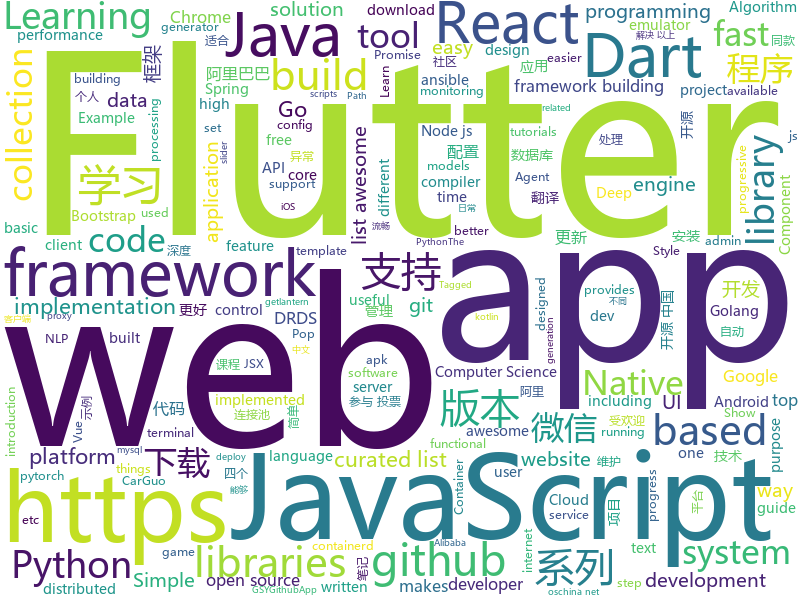

# 2018-11-29
See what the GitHub community is most excited about today.

## python
* [d2l-zh](https://github.com/diveintodeeplearning/d2l-zh)(**422 stars today**): 《动手学深度学习》
* [trape](https://github.com/jofpin/trape)(**394 stars today**): People tracker on the Internet: OSINT analysis and research tool by Jose Pino
* [gandissect](https://github.com/CSAILVision/gandissect)(**337 stars today**): Pytorch-based tools for visualizing and understanding the neurons of a GAN. https://gandissect.csail.mit.edu/
* [d2l-en](https://github.com/diveintodeeplearning/d2l-en)(**250 stars today**): Dive into Deep Learning (CV chapters coming soon)
* [wtfpython-cn](https://github.com/leisurelicht/wtfpython-cn)(**136 stars today**): wtfpython的中文翻译/施工结束/ 能力有限，欢迎帮我改进翻译
* [bert](https://github.com/google-research/bert)(**93 stars today**): TensorFlow code and pre-trained models for BERT
* [models](https://github.com/tensorflow/models)(**71 stars today**): Models and examples built with TensorFlow
* [keras](https://github.com/keras-team/keras)(**61 stars today**): Deep Learning for humans
* [Python](https://github.com/TheAlgorithms/Python)(**59 stars today**): All Algorithms implemented in Python
* [big-list-of-naughty-strings](https://github.com/minimaxir/big-list-of-naughty-strings)(**64 stars today**): The Big List of Naughty Strings is a list of strings which have a high probability of causing issues when used as user-input data.
* [system-design-primer](https://github.com/donnemartin/system-design-primer)(**59 stars today**): Learn how to design large-scale systems. Prep for the system design interview. Includes Anki flashcards.
* [QuickDraw](https://github.com/1991viet/QuickDraw)(**56 stars today**): Implementation of Quickdraw - an online game developed by Google
* [awesome-python](https://github.com/vinta/awesome-python)(**52 stars today**): A curated list of awesome Python frameworks, libraries, software and resources
* [reaver-pysc2](https://github.com/inoryy/reaver-pysc2)(**49 stars today**): Reaver: StarCraft II Deep Reinforcement Learning Agent. Modular DRL framework. Works with Gym, Atari, and MuJoCo as well.
* [public-apis](https://github.com/toddmotto/public-apis)(**43 stars today**): A collective list of public JSON APIs for use in web development.
* [ansible](https://github.com/ansible/ansible)(**35 stars today**): Ansible is a radically simple IT automation platform that makes your applications and systems easier to deploy. Avoid writing scripts or custom code to deploy and update your applications — automate in a language that approaches plain English, using SSH, with no agents to install on remote systems. https://docs.ansible.com/ansible/
* [3DDFA](https://github.com/cleardusk/3DDFA)(**41 stars today**): The pytorch improved re-implementation of TPAMI 2017 paper: Face Alignment in Full Pose Range: A 3D Total Solution.
* [Python](https://github.com/geekcomputers/Python)(**38 stars today**): My Python Examples
* [scikit-learn](https://github.com/scikit-learn/scikit-learn)(**32 stars today**): scikit-learn: machine learning in Python
* [django](https://github.com/django/django)(**30 stars today**): The Web framework for perfectionists with deadlines.
* [dash](https://github.com/plotly/dash)(**38 stars today**): Analytical Web Apps for Python. No JavaScript Required.
* [cpython](https://github.com/python/cpython)(**25 stars today**): The Python programming language
* [requests](https://github.com/requests/requests)(**31 stars today**): Python HTTP Requests for Humans™✨🍰✨
* [flask](https://github.com/pallets/flask)(**33 stars today**): The Python micro framework for building web applications.
* [chartify](https://github.com/spotify/chartify)(**32 stars today**): Python library that makes it easy for data scientists to create charts.

## java
* [JavaGuide](https://github.com/Snailclimb/JavaGuide)(**152 stars today**): 【Java学习+面试指南】 一份涵盖大部分Java程序员所需要掌握的核心知识。
* [litemall](https://github.com/linlinjava/litemall)(**107 stars today**): 又一个小商城。litemall = Spring Boot后端 + Vue管理员前端 + 微信小程序用户前端
* [resilience4j](https://github.com/resilience4j/resilience4j)(**89 stars today**): Resilience4j is a fault tolerance library designed for Java8 and functional programming
* [spring-boot](https://github.com/spring-projects/spring-boot)(**60 stars today**): Spring Boot
* [spring-cloud-alibaba](https://github.com/spring-cloud-incubator/spring-cloud-alibaba)(**60 stars today**): Spring Cloud Alibaba provides a one-stop solution for application development for the distributed solutions of Alibaba middleware.
* [apollo](https://github.com/ctripcorp/apollo)(**51 stars today**): Apollo（阿波罗）是携程框架部门研发的分布式配置中心，能够集中化管理应用不同环境、不同集群的配置，配置修改后能够实时推送到应用端，并且具备规范的权限、流程治理等特性，适用于微服务配置管理场景。2018年开源中国最受欢迎开源软件评选请参与投票 https://www.oschina.net/project/top_cn_2018
* [java-design-patterns](https://github.com/iluwatar/java-design-patterns)(**47 stars today**): Design patterns implemented in Java
* [symphony](https://github.com/b3log/symphony)(**52 stars today**): 🎶一款用 Java 实现的现代化社区（论坛/BBS/社交网络/博客）平台。https://hacpai.com
* [tutorials](https://github.com/eugenp/tutorials)(**28 stars today**): The "REST With Spring" Course:
* [spring-framework](https://github.com/spring-projects/spring-framework)(**37 stars today**): Spring Framework
* [Java](https://github.com/TheAlgorithms/Java)(**41 stars today**): All Algorithms implemented in Java
* [easyexcel](https://github.com/alibaba/easyexcel)(**44 stars today**): 快速、简单避免OOM的java处理Excel工具
* [elasticsearch](https://github.com/elastic/elasticsearch)(**42 stars today**): Open Source, Distributed, RESTful Search Engine
* [DS4Android](https://github.com/toly1994328/DS4Android)(**39 stars today**): 看得见的数据结构Android版---Show the Data_Structure power by Android View
* [hazelcast-jet](https://github.com/hazelcast/hazelcast-jet)(**42 stars today**): A general purpose distributed data processing engine, built on top of Hazelcast.
* [YCUpdateApp](https://github.com/yangchong211/YCUpdateApp)(**41 stars today**): 轻量级版本更新弹窗，弹窗上支持更新进度条，可以设置普通更新或者强制更新。解决8.0以上通知栏不显示问题，解决7.0以上安装apk异常，下载完成则会自动提示安装；下载异常，失败，错误等状态，支持重启下载任务；还支持自定义下载路径。代码量少，调用简单……
* [Reader](https://github.com/GarrettLance/Reader)(**41 stars today**): A reader that is easy to integrate and extend
* [incubator-dubbo](https://github.com/apache/incubator-dubbo)(**32 stars today**): Apache Dubbo (incubating) is a high-performance, java based, open source RPC framework.
* [HanLP](https://github.com/hankcs/HanLP)(**37 stars today**): 自然语言处理 中文分词 词性标注 命名实体识别 依存句法分析 新词发现 关键词短语提取 自动摘要 文本分类聚类 拼音简繁
* [JCSprout](https://github.com/crossoverJie/JCSprout)(**35 stars today**): 👨‍🎓Java Core Sprout : basic, concurrent, algorithm
* [canal](https://github.com/alibaba/canal)(**33 stars today**): 阿里巴巴mysql数据库binlog的增量订阅&消费组件 。阿里云DRDS( https://www.aliyun.com/product/drds )、阿里巴巴TDDL 二级索引、小表复制powerd by canal.
* [guava](https://github.com/google/guava)(**34 stars today**): Google core libraries for Java
* [Sentinel](https://github.com/alibaba/Sentinel)(**29 stars today**): A lightweight flow-control library providing high-available protection and monitoring (高可用防护的流量管理框架)
* [druid](https://github.com/alibaba/druid)(**30 stars today**): 阿里巴巴数据库事业部出品，为监控而生的数据库连接池。2018年开源中国最受欢迎开源软件评选请参与投票 https://www.oschina.net/project/top_cn_2018 阿里云DRDS(https://www.aliyun.com/product/drds )、阿里巴巴TDDL 连接池powered by Druid
* [weixin-java-tools](https://github.com/Wechat-Group/weixin-java-tools)(**28 stars today**): 全能微信Java开发工具包，支持包括微信支付、开放平台、小程序、企业微信/企业号和公众号等的后端开发

## unknown
* [stanford-cs-230-deep-learning](https://github.com/afshinea/stanford-cs-230-deep-learning)(**566 stars today**): VIP cheatsheets for Stanford's CS 230 Deep Learning
* [daizhigev20](https://github.com/garychowcmu/daizhigev20)(**257 stars today**): 殆知阁古代文献
* [CS-Notes](https://github.com/CyC2018/CS-Notes)(**178 stars today**): 📚Computer Science Learning Notes
* [github-drama](https://github.com/nikolas/github-drama)(**182 stars today**): "locked and limited conversation to collaborators"
* [http3-explained](https://github.com/bagder/http3-explained)(**171 stars today**): A document describing the HTTP/3 and QUIC protocols
* [awesome](https://github.com/sindresorhus/awesome)(**146 stars today**): 😎Curated list of awesome lists
* [design-for-developers](https://github.com/sdras/design-for-developers)(**93 stars today**): Design for Developers Workshop
* [gitignore](https://github.com/github/gitignore)(**59 stars today**): A collection of useful .gitignore templates
* [developer-roadmap](https://github.com/kamranahmedse/developer-roadmap)(**69 stars today**): Roadmap to becoming a web developer in 2018
* [Blog](https://github.com/mqyqingfeng/Blog)(**60 stars today**): 冴羽写博客的地方，预计写四个系列：JavaScript深入系列、JavaScript专题系列、ES6系列、React系列。
* [awesome-vue](https://github.com/vuejs/awesome-vue)(**56 stars today**): 🎉A curated list of awesome things related to Vue.js
* [free-programming-books](https://github.com/EbookFoundation/free-programming-books)(**51 stars today**): 📚Freely available programming books
* [architect-awesome](https://github.com/xingshaocheng/architect-awesome)(**43 stars today**): 后端架构师技术图谱
* [build-your-own-x](https://github.com/danistefanovic/build-your-own-x)(**44 stars today**): 🤓Build your own (insert technology here)
* [computer-science](https://github.com/ossu/computer-science)(**40 stars today**): 🎓Path to a free self-taught education in Computer Science!
* [coding-interview-university](https://github.com/jwasham/coding-interview-university)(**34 stars today**): A complete computer science study plan to become a software engineer.
* [china_area_mysql](https://github.com/kakuilan/china_area_mysql)(**35 stars today**): 中国5级行政区域mysql库
* [git-flight-rules](https://github.com/k88hudson/git-flight-rules)(**34 stars today**): Flight rules for git
* [Best-websites-a-programmer-should-visit](https://github.com/sdmg15/Best-websites-a-programmer-should-visit)(**30 stars today**): 🔗Some useful websites for programmers.
* [kubernetes-the-hard-way](https://github.com/kelseyhightower/kubernetes-the-hard-way)(**31 stars today**): Bootstrap Kubernetes the hard way on Google Cloud Platform. No scripts.
* [A-to-Z-Resources-for-Students](https://github.com/dipakkr/A-to-Z-Resources-for-Students)(**29 stars today**): ☑️Curated list of resources for college students Show your❤️by giving a⭐️
* [gold-miner](https://github.com/xitu/gold-miner)(**27 stars today**): 🥇掘金翻译计划，可能是世界最大最好的英译中技术社区，最懂读者和译者的翻译平台：
* [Awesome-pytorch-list](https://github.com/bharathgs/Awesome-pytorch-list)(**26 stars today**): A comprehensive list of pytorch related content on github,such as different models,implementations,helper libraries,tutorials etc.
* [100-Days-Of-ML-Code](https://github.com/Avik-Jain/100-Days-Of-ML-Code)(**24 stars today**): 100 Days of ML Coding
* [awesome-react](https://github.com/enaqx/awesome-react)(**25 stars today**): A collection of awesome things regarding React ecosystem.

## javascript
* [learnGitBranching](https://github.com/pcottle/learnGitBranching)(**431 stars today**): An interactive git visualization to challenge and educate!
* [edex-ui](https://github.com/GitSquared/edex-ui)(**299 stars today**): A science fiction terminal emulator designed for large touchscreens that runs on all major OSs.
* [ncc](https://github.com/zeit/ncc)(**207 stars today**): Node.js Compiler Collection
* [vue](https://github.com/vuejs/vue)(**159 stars today**): 🖖A progressive, incrementally-adoptable JavaScript framework for building UI on the web.
* [thanks](https://github.com/feross/thanks)(**164 stars today**): 🙌Give thanks to the open source maintainers you depend on!✨
* [react](https://github.com/facebook/react)(**140 stars today**): A declarative, efficient, and flexible JavaScript library for building user interfaces.
* [mermaid](https://github.com/knsv/mermaid)(**147 stars today**): Generation of diagram and flowchart from text in a similar manner as markdown
* [33-js-concepts](https://github.com/leonardomso/33-js-concepts)(**121 stars today**): 📜33 concepts every JavaScript developer should know.
* [progress-estimator](https://github.com/bvaughn/progress-estimator)(**116 stars today**): Logs a progress bar and estimation for how long a Promise will take to complete
* [htm](https://github.com/developit/htm)(**77 stars today**): Hyperscript Tagged Markup: JSX alternative using standard tagged templates, with compiler support.
* [event-stream](https://github.com/dominictarr/event-stream)(**71 stars today**): EventStream is like functional programming meets IO
* [create-react-app](https://github.com/facebook/create-react-app)(**64 stars today**): Set up a modern web app by running one command.
* [wsc](https://github.com/21-23/wsc)(**69 stars today**): WebSocket Challenge
* [react-native](https://github.com/facebook/react-native)(**63 stars today**): A framework for building native apps with React.
* [omi](https://github.com/Tencent/omi)(**65 stars today**): Next generation web framework in 4kb JavaScript (Web Components + JSX + Proxy + Store + Path Updating)
* [node](https://github.com/nodejs/node)(**61 stars today**): Node.js JavaScript runtime✨🐢🚀✨
* [puppeteer](https://github.com/GoogleChrome/puppeteer)(**60 stars today**): Headless Chrome Node API
* [30-seconds-of-code](https://github.com/30-seconds/30-seconds-of-code)(**60 stars today**): Curated collection of useful JavaScript snippets that you can understand in 30 seconds or less.
* [axios](https://github.com/axios/axios)(**59 stars today**): Promise based HTTP client for the browser and node.js
* [33-js-concepts](https://github.com/stephentian/33-js-concepts)(**58 stars today**): 📜每个 JavaScript 工程师都应懂的33个概念 @leonardomso
* [free-programming-books-zh_CN](https://github.com/justjavac/free-programming-books-zh_CN)(**58 stars today**): 📚免费的计算机编程类中文书籍，欢迎投稿
* [javascript](https://github.com/airbnb/javascript)(**56 stars today**): JavaScript Style Guide
* [taro](https://github.com/NervJS/taro)(**56 stars today**): 多端统一开发框架，支持用 React 的开发方式编写一次代码，生成能运行在微信小程序/百度智能小程序/支付宝小程序、H5、React Native 等的应用。 https://taro.js.org/
* [nivo](https://github.com/plouc/nivo)(**58 stars today**): nivo provides a rich set of dataviz components, built on top of the awesome d3 and Reactjs libraries
* [ImageRevealHover](https://github.com/codrops/ImageRevealHover)(**58 stars today**): A set of link hover effects that reveal a thumbnail in different creative ways.

## html
* [PaperWallet](https://github.com/XimBlockProject/PaperWallet)(**65 stars today**): PaperWallet
* [nginxconfig.io](https://github.com/valentinxxx/nginxconfig.io)(**82 stars today**): ⚙️NGiИX config generator generator on steroids💉
* [wedding-website](https://github.com/rampatra/wedding-website)(**53 stars today**): Our Wedding Website👫
* [Coursera-ML-AndrewNg-Notes](https://github.com/fengdu78/Coursera-ML-AndrewNg-Notes)(**33 stars today**): 吴恩达老师的机器学习课程个人笔记
* [deeplearning_ai_books](https://github.com/fengdu78/deeplearning_ai_books)(**32 stars today**): deeplearning.ai（吴恩达老师的深度学习课程笔记及资源）
* [NLP-progress](https://github.com/sebastianruder/NLP-progress)(**32 stars today**): Repository to track the progress in Natural Language Processing (NLP), including the datasets and the current state-of-the-art for the most common NLP tasks.
* [AdminLTE](https://github.com/almasaeed2010/AdminLTE)(**23 stars today**): AdminLTE - Free Premium Admin control Panel Theme Based On Bootstrap 3.x
* [patchwork](https://github.com/jlord/patchwork)(****): All the Git-it Workshop completers!
* [ionic](https://github.com/ionic-team/ionic)(**15 stars today**): Build amazing native and progressive web apps with open web technologies. One app running on everything🎉
* [styleguide](https://github.com/google/styleguide)(**15 stars today**): Style guides for Google-originated open-source projects
* [react-redux](https://github.com/reduxjs/react-redux)(**18 stars today**): Official React bindings for Redux
* [Guide-3.0-Penne-](https://github.com/PaaS-TA/Guide-3.0-Penne-)(**18 stars today**): 
* [electron-api-demos](https://github.com/electron/electron-api-demos)(**17 stars today**): Explore the Electron APIs
* [fastText](https://github.com/facebookresearch/fastText)(**16 stars today**): Library for fast text representation and classification.
* [manuals](https://github.com/skr-shop/manuals)(**16 stars today**): Do design No code📖
* [Spoon-Knife](https://github.com/octocat/Spoon-Knife)(****): This repo is for demonstration purposes only.
* [portainer](https://github.com/portainer/portainer)(**11 stars today**): Simple management UI for Docker
* [tiny-slider](https://github.com/ganlanyuan/tiny-slider)(**11 stars today**): Vanilla javascript slider for all purposes.
* [intro.js](https://github.com/usablica/intro.js)(**10 stars today**): A better way for new feature introduction and step-by-step users guide for your website and project.
* [react-app-rewired](https://github.com/timarney/react-app-rewired)(**10 stars today**): Override create-react-app webpack configs without ejecting
* [eatwhat](https://github.com/MetaWeng/eatwhat)(**10 stars today**): 
* [coreui-free-bootstrap-admin-template](https://github.com/coreui/coreui-free-bootstrap-admin-template)(**9 stars today**): CoreUI is free bootstrap admin template
* [javascript-tutorial-en](https://github.com/iliakan/javascript-tutorial-en)(**9 stars today**): Modern JavaScript Tutorial
* [swagger-codegen](https://github.com/swagger-api/swagger-codegen)(**7 stars today**): swagger-codegen contains a template-driven engine to generate documentation, API clients and server stubs in different languages by parsing your OpenAPI / Swagger definition.
* [polymer](https://github.com/Polymer/polymer)(**9 stars today**): Our original Web Component library.

## dart
* [flutter](https://github.com/flutter/flutter)(**95 stars today**): Flutter makes it easy and fast to build beautiful mobile apps.
* [flutter-common-widgets-app](https://github.com/alibaba-paimai-frontend/flutter-common-widgets-app)(**66 stars today**): 
* [RealRichText](https://github.com/bytedance/RealRichText)(**46 stars today**): A Tricky Solution for Implementing Inline-Image-In-Text Feature in Flutter.
* [awesome-flutter](https://github.com/Solido/awesome-flutter)(**43 stars today**): An awesome list that curates the best Flutter libraries, tools, tutorials, articles and more.
* [plugins](https://github.com/flutter/plugins)(**12 stars today**): Plugins for Flutter, including FlutterFire, maintained by the Flutter team
* [GSYGithubAppFlutter](https://github.com/CarGuo/GSYGithubAppFlutter)(**9 stars today**): 超完整的Flutter项目，功能丰富，适合学习和日常使用。GSYGithubApp系列的优势：我们目前已经拥有Flutter、Weex、ReactNative、kotlin 四个版本。 功能齐全，项目框架内技术涉及面广，完成度高，持续维护，配套文章，适合全面学习，对比参考。跨平台的开源Github客户端App，更好的体验，更丰富的功能，旨在更好的日常管理和维护个人Github，提供更好更方便的驾车体验Σ(￣。￣ﾉ)ﾉ。同款Weex版本 ： https://github.com/CarGuo/GSYGithubAppWeex 、同款React Native版本 ： https://github.com/CarGuo/GSYGithubApp 、原生 kotlin 版本 https://g…
* [Flutter-learning](https://github.com/AweiLoveAndroid/Flutter-learning)(**6 stars today**): 🔥👍🌟⭐️⭐️⭐️Flutter安装和配置，Flutter开发遇到的难题，Flutter示例代码和模板，Flutter项目实战，Dart语言学习示例代码。
* [simple_auth](https://github.com/Clancey/simple_auth)(****): The Simplest way to Authenticate in Flutter
* [pageloader](https://github.com/google/pageloader)(****): A framework for creating page objects for in-browser or WebDriver tests.
* [flutter-intro-slider](https://github.com/duytq94/flutter-intro-slider)(****): Simple and configurable app introduction slider for Flutter
* [sample-pop_pop_win](https://github.com/dart-lang/sample-pop_pop_win)(****): "Pop, Pop, Win!" is an implementation of Minesweeper in Dart.
* [chromedeveditor](https://github.com/googlearchive/chromedeveditor)(****): Chrome Dev Editor is a developer tool for building apps on the Chrome platform - Chrome Apps and Web Apps, in JavaScript or Dart. (NO LONGER IN ACTIVE DEVELOPMENT)
* [sdk](https://github.com/dart-lang/sdk)(****): The Dart SDK, including the VM, dart2js, core libraries, and more.
* [FlutterExampleApps](https://github.com/iampawan/FlutterExampleApps)(****): [Example APPS] Basic Flutter apps, for flutter devs.
* [Flutter-UI-Kit](https://github.com/iampawan/Flutter-UI-Kit)(****): Flutter app for collection of UI in a UIKit
* [flutter_architecture_samples](https://github.com/brianegan/flutter_architecture_samples)(****): TodoMVC for Flutter
* [flutter-examples](https://github.com/nisrulz/flutter-examples)(****): [Examples] Simple basic isolated apps, for budding flutter devs.
* [inKino](https://github.com/roughike/inKino)(****): A multiplatform Dart movie app with 40% of code sharing between Flutter and the Web.
* [flutter-osc](https://github.com/yubo725/flutter-osc)(****): 基于Google Flutter的开源中国客户端，支持Android和iOS。
* [dio](https://github.com/flutterchina/dio)(****): A powerful Http client for Dart, which supports Interceptors, FormData, Request Cancellation, File Downloading, Timeout etc.
* [zhihu-flutter](https://github.com/HackSoul/zhihu-flutter)(****): Flutter 高仿知乎 UI，非常漂亮，也非常流畅，flutter build apk 或 flutter build ios 之后更流畅
* [hauberk](https://github.com/munificent/hauberk)(****): A web-based roguelike written in Dart.
* [angular](https://github.com/dart-lang/angular)(****): Fast and productive web framework provided by Dart
* [StageXL](https://github.com/bp74/StageXL)(****): A fast and universal 2D rendering engine for HTML5 and Dart.
* [dart-sass](https://github.com/sass/dart-sass)(****): A Dart implementation of Sass.

## go
* [aminal](https://github.com/liamg/aminal)(**712 stars today**): Golang terminal emulator from scratch
* [dive](https://github.com/wagoodman/dive)(**669 stars today**): A tool for exploring each layer in a docker image
* [firecracker-containerd](https://github.com/firecracker-microvm/firecracker-containerd)(**95 stars today**): firecracker-containerd enables containerd to manage containers as Firecracker microVMs
* [droplets](https://github.com/spy16/droplets)(**85 stars today**): Droplets is a platform for Gophers.
* [mercure](https://github.com/dunglas/mercure)(**76 stars today**): Server-sent live updates: protocol and reference implementation
* [xsshell](https://github.com/raz-varren/xsshell)(**71 stars today**): An XSS reverse shell framework
* [kubernetes](https://github.com/kubernetes/kubernetes)(**56 stars today**): Production-Grade Container Scheduling and Management
* [go](https://github.com/golang/go)(**61 stars today**): The Go programming language
* [awesome-go](https://github.com/avelino/awesome-go)(**53 stars today**): A curated list of awesome Go frameworks, libraries and software
* [goboy](https://github.com/Humpheh/goboy)(**52 stars today**): Multi-platform Nintendo Game Boy Color emulator written in Go
* [gin](https://github.com/gin-gonic/gin)(**46 stars today**): Gin is a HTTP web framework written in Go (Golang). It features a Martini-like API with much better performance -- up to 40 times faster. If you need smashing performance, get yourself some Gin.
* [frp](https://github.com/fatedier/frp)(**40 stars today**): A fast reverse proxy to help you expose a local server behind a NAT or firewall to the internet.
* [lantern](https://github.com/getlantern/lantern)(**40 stars today**): 🔴蓝灯最新版本下载 https://github.com/getlantern/download🔴Lantern Latest Download https://github.com/getlantern/download🔴
* [tinygo](https://github.com/aykevl/tinygo)(**41 stars today**): Go compiler for small devices, based on LLVM.
* [hugo](https://github.com/gohugoio/hugo)(**38 stars today**): The world’s fastest framework for building websites.
* [build-web-application-with-golang](https://github.com/astaxie/build-web-application-with-golang)(**32 stars today**): A golang ebook intro how to build a web with golang
* [terratest](https://github.com/gruntwork-io/terratest)(**34 stars today**): Terratest is a Go library that makes it easier to write automated tests for your infrastructure code.
* [soar](https://github.com/XiaoMi/soar)(**29 stars today**): SQL Optimizer And Rewriter
* [ipv666](https://github.com/lavalamp-/ipv666)(**29 stars today**): Golang IPv6 address enumeration
* [prometheus](https://github.com/prometheus/prometheus)(**29 stars today**): The Prometheus monitoring system and time series database.
* [istio](https://github.com/istio/istio)(**28 stars today**): Connect, secure, control, and observe services.
* [evilginx2](https://github.com/kgretzky/evilginx2)(**28 stars today**): Standalone man-in-the-middle attack framework used for phishing login credentials along with session cookies, allowing for the bypass of 2-factor authentication
* [autopprof](https://github.com/rakyll/autopprof)(**29 stars today**): Pprof made easy at development time for Go
* [traefik](https://github.com/containous/traefik)(**27 stars today**): The Cloud Native Edge Router
* [gogs](https://github.com/gogs/gogs)(**25 stars today**): Gogs is a painless self-hosted Git service.

## WordCloud

