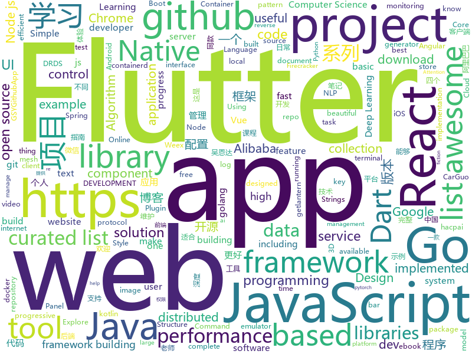

# 2018-11-30
See what the GitHub community is most excited about today.

## python
* [d2l-zh](https://github.com/diveintodeeplearning/d2l-zh)(**494 stars today**): 《动手学深度学习》
* [wtfpython-cn](https://github.com/leisurelicht/wtfpython-cn)(**344 stars today**): wtfpython的中文翻译/施工结束/ 能力有限，欢迎帮我改进翻译
* [trape](https://github.com/jofpin/trape)(**209 stars today**): People tracker on the Internet: OSINT analysis and research tool by Jose Pino
* [gandissect](https://github.com/CSAILVision/gandissect)(**143 stars today**): Pytorch-based tools for visualizing and understanding the neurons of a GAN. https://gandissect.csail.mit.edu/
* [bert](https://github.com/google-research/bert)(**106 stars today**): TensorFlow code and pre-trained models for BERT
* [models](https://github.com/tensorflow/models)(**73 stars today**): Models and examples built with TensorFlow
* [d2l-en](https://github.com/diveintodeeplearning/d2l-en)(**83 stars today**): Dive into Deep Learning (CV chapters coming soon)
* [HelloGitHub](https://github.com/521xueweihan/HelloGitHub)(**87 stars today**): GitHub 上好玩、容易上手的项目，帮你找到编程的乐趣。欢迎推荐、自荐项目，让更多人知道你的项目⭐️
* [awesome-python](https://github.com/vinta/awesome-python)(**67 stars today**): A curated list of awesome Python frameworks, libraries, software and resources
* [CCNet](https://github.com/speedinghzl/CCNet)(**68 stars today**): CCNet: Criss-Cross Attention for Semantic Segmentation
* [Python](https://github.com/TheAlgorithms/Python)(**66 stars today**): All Algorithms implemented in Python
* [system-design-primer](https://github.com/donnemartin/system-design-primer)(**56 stars today**): Learn how to design large-scale systems. Prep for the system design interview. Includes Anki flashcards.
* [partialconv](https://github.com/NVIDIA/partialconv)(**59 stars today**): A New Padding Scheme: Partial Convolution based Padding
* [keras](https://github.com/keras-team/keras)(**41 stars today**): Deep Learning for humans
* [awesome-machine-learning](https://github.com/josephmisiti/awesome-machine-learning)(**42 stars today**): A curated list of awesome Machine Learning frameworks, libraries and software.
* [youtube-dl](https://github.com/rg3/youtube-dl)(**41 stars today**): Command-line program to download videos from YouTube.com and other video sites
* [BERT-BiLSTM-CRF-NER](https://github.com/macanv/BERT-BiLSTM-CRF-NER)(**40 stars today**): Tensorflow solution of NER task Using BiLSTM-CRF model with Google BERT Fine-tuning
* [DeOldify](https://github.com/jantic/DeOldify)(**40 stars today**): A Deep Learning based project for colorizing and restoring old images
* [flask](https://github.com/pallets/flask)(**36 stars today**): The Python micro framework for building web applications.
* [code_collection](https://github.com/Allianzcortex/code_collection)(**39 stars today**): 
* [3DDFA](https://github.com/cleardusk/3DDFA)(**38 stars today**): The pytorch improved re-implementation of TPAMI 2017 paper: Face Alignment in Full Pose Range: A 3D Total Solution.
* [big-list-of-naughty-strings](https://github.com/minimaxir/big-list-of-naughty-strings)(**38 stars today**): The Big List of Naughty Strings is a list of strings which have a high probability of causing issues when used as user-input data.
* [BERT-Classification-Tutorial](https://github.com/Socialbird-AILab/BERT-Classification-Tutorial)(**36 stars today**): 
* [home-assistant](https://github.com/home-assistant/home-assistant)(**30 stars today**): 🏡Open source home automation that puts local control and privacy first
* [django](https://github.com/django/django)(**30 stars today**): The Web framework for perfectionists with deadlines.

## java
* [resilience4j](https://github.com/resilience4j/resilience4j)(**232 stars today**): Resilience4j is a fault tolerance library designed for Java8 and functional programming
* [JavaGuide](https://github.com/Snailclimb/JavaGuide)(**135 stars today**): 【Java学习+面试指南】 一份涵盖大部分Java程序员所需要掌握的核心知识。
* [ArgusAPM](https://github.com/Qihoo360/ArgusAPM)(**130 stars today**): A powerful, comprehensive online application performance management tool for Android
* [AndroidProject](https://github.com/getActivity/AndroidProject)(**73 stars today**): An advanced template project
* [litemall](https://github.com/linlinjava/litemall)(**61 stars today**): 又一个小商城。litemall = Spring Boot后端 + Vue管理员前端 + 微信小程序用户前端
* [java-design-patterns](https://github.com/iluwatar/java-design-patterns)(**47 stars today**): Design patterns implemented in Java
* [spring-boot](https://github.com/spring-projects/spring-boot)(**43 stars today**): Spring Boot
* [symphony](https://github.com/b3log/symphony)(**49 stars today**): 🎶一款用 Java 实现的现代化社区（论坛/BBS/社交网络/博客）平台。https://hacpai.com
* [spring-framework](https://github.com/spring-projects/spring-framework)(**38 stars today**): Spring Framework
* [tutorials](https://github.com/eugenp/tutorials)(**25 stars today**): The "REST With Spring" Course:
* [soul](https://github.com/Dromara/soul)(**39 stars today**): 这是一个高性能，异步的反应式的gateway
* [JCSprout](https://github.com/crossoverJie/JCSprout)(**38 stars today**): 👨‍🎓Java Core Sprout : basic, concurrent, algorithm
* [apollo](https://github.com/ctripcorp/apollo)(**35 stars today**): Apollo（阿波罗）是携程框架部门研发的分布式配置中心，能够集中化管理应用不同环境、不同集群的配置，配置修改后能够实时推送到应用端，并且具备规范的权限、流程治理等特性，适用于微服务配置管理场景。2018年开源中国最受欢迎开源软件评选请参与投票 https://www.oschina.net/project/top_cn_2018
* [spring-cloud-alibaba](https://github.com/spring-cloud-incubator/spring-cloud-alibaba)(**35 stars today**): Spring Cloud Alibaba provides a one-stop solution for application development for the distributed solutions of Alibaba middleware.
* [Sentinel](https://github.com/alibaba/Sentinel)(**30 stars today**): A lightweight flow-control library providing high-available protection and monitoring (高可用防护的流量管理框架)
* [canal](https://github.com/alibaba/canal)(**32 stars today**): 阿里巴巴mysql数据库binlog的增量订阅&消费组件 。阿里云DRDS( https://www.aliyun.com/product/drds )、阿里巴巴TDDL 二级索引、小表复制powerd by canal.
* [easyexcel](https://github.com/alibaba/easyexcel)(**29 stars today**): 快速、简单避免OOM的java处理Excel工具
* [arthas](https://github.com/alibaba/arthas)(**31 stars today**): Alibaba Java Diagnostic Tool Arthas/Alibaba Java诊断利器Arthas
* [Java](https://github.com/TheAlgorithms/Java)(**26 stars today**): All Algorithms implemented in Java
* [elasticsearch](https://github.com/elastic/elasticsearch)(**29 stars today**): Open Source, Distributed, RESTful Search Engine
* [moon-util](https://github.com/xua744531854/moon-util)(**28 stars today**): 这是一个 Java 工具库
* [netty](https://github.com/netty/netty)(**24 stars today**): Netty project - an event-driven asynchronous network application framework
* [incubator-dubbo](https://github.com/apache/incubator-dubbo)(**22 stars today**): Apache Dubbo (incubating) is a high-performance, java based, open source RPC framework.
* [flink](https://github.com/apache/flink)(**25 stars today**): Apache Flink
* [lottie-android](https://github.com/airbnb/lottie-android)(**26 stars today**): Render After Effects animations natively on Android and iOS, Web, and React Native

## unknown
* [stanford-cs-230-deep-learning](https://github.com/afshinea/stanford-cs-230-deep-learning)(**552 stars today**): VIP cheatsheets for Stanford's CS 230 Deep Learning
* [CS-Notes](https://github.com/CyC2018/CS-Notes)(**176 stars today**): 📚Computer Science Learning Notes
* [github-drama](https://github.com/nikolas/github-drama)(**139 stars today**): "locked and limited conversation to collaborators"
* [daizhigev20](https://github.com/garychowcmu/daizhigev20)(**111 stars today**): 殆知阁古代文献
* [awesome](https://github.com/sindresorhus/awesome)(**97 stars today**): 😎Curated list of awesome lists
* [aws-app-mesh-examples](https://github.com/awslabs/aws-app-mesh-examples)(**81 stars today**): AWS App Mesh is a service mesh that you can use with your microservices to manage service to service communication.
* [gitignore](https://github.com/github/gitignore)(**61 stars today**): A collection of useful .gitignore templates
* [developer-roadmap](https://github.com/kamranahmedse/developer-roadmap)(**70 stars today**): Roadmap to becoming a web developer in 2018
* [Blog](https://github.com/mqyqingfeng/Blog)(**66 stars today**): 冴羽写博客的地方，预计写四个系列：JavaScript深入系列、JavaScript专题系列、ES6系列、React系列。
* [http3-explained](https://github.com/bagder/http3-explained)(**57 stars today**): A document describing the HTTP/3 and QUIC protocols
* [free-programming-books](https://github.com/EbookFoundation/free-programming-books)(**51 stars today**): 📚Freely available programming books
* [coding-interview-university](https://github.com/jwasham/coding-interview-university)(**44 stars today**): A complete computer science study plan to become a software engineer.
* [architect-awesome](https://github.com/xingshaocheng/architect-awesome)(**38 stars today**): 后端架构师技术图谱
* [Best-websites-a-programmer-should-visit](https://github.com/sdmg15/Best-websites-a-programmer-should-visit)(**42 stars today**): 🔗Some useful websites for programmers.
* [clash_for_windows_pkg](https://github.com/Fndroid/clash_for_windows_pkg)(**40 stars today**): A Windows GUI for Clash
* [REBL-distro](https://github.com/cognitect-labs/REBL-distro)(**39 stars today**): REBL-distro
* [awesome-vue](https://github.com/vuejs/awesome-vue)(**36 stars today**): 🎉A curated list of awesome things related to Vue.js
* [awesome-for-beginners](https://github.com/MunGell/awesome-for-beginners)(**33 stars today**): A list of awesome beginners-friendly projects.
* [package-maintenance](https://github.com/nodejs/package-maintenance)(**31 stars today**): Repository for work for discussion of helping with maintenance of key packages in the ecosystem.
* [git-flight-rules](https://github.com/k88hudson/git-flight-rules)(**33 stars today**): Flight rules for git
* [computer-science](https://github.com/ossu/computer-science)(**32 stars today**): 🎓Path to a free self-taught education in Computer Science!
* [You-Dont-Know-JS](https://github.com/kujian/You-Dont-Know-JS)(**26 stars today**): You-Dont-Know-JS中文版
* [subaru_starlink_research](https://github.com/sgayou/subaru_starlink_research)(**28 stars today**): Subaru StarLink persistent root code execution.
* [nodebestpractices](https://github.com/i0natan/nodebestpractices)(**27 stars today**): The largest Node.JS best practices list (November 2018)
* [magalix-agent](https://github.com/MagalixCorp/magalix-agent)(**29 stars today**): Magalix agent connect Kubernetes with AI optimization services to improve performance and save money

## javascript
* [learnGitBranching](https://github.com/pcottle/learnGitBranching)(**233 stars today**): An interactive git visualization to challenge and educate!
* [edex-ui](https://github.com/GitSquared/edex-ui)(**229 stars today**): A science fiction terminal emulator designed for large touchscreens that runs on all major OSs.
* [thanks](https://github.com/feross/thanks)(**207 stars today**): 🙌Give thanks to the open source maintainers you depend on!✨
* [33-js-concepts](https://github.com/leonardomso/33-js-concepts)(**201 stars today**): 📜33 concepts every JavaScript developer should know.
* [mermaid](https://github.com/knsv/mermaid)(**199 stars today**): Generation of diagram and flowchart from text in a similar manner as markdown
* [vue](https://github.com/vuejs/vue)(**152 stars today**): 🖖A progressive, incrementally-adoptable JavaScript framework for building UI on the web.
* [ncc](https://github.com/zeit/ncc)(**141 stars today**): Node.js Compiler Collection
* [react](https://github.com/facebook/react)(**123 stars today**): A declarative, efficient, and flexible JavaScript library for building user interfaces.
* [progress-estimator](https://github.com/bvaughn/progress-estimator)(**120 stars today**): Logs a progress bar and estimation for how long a Promise will take to complete
* [30-seconds-of-code](https://github.com/30-seconds/30-seconds-of-code)(**82 stars today**): Curated collection of useful JavaScript snippets that you can understand in 30 seconds or less.
* [learndb](https://github.com/neodon/learndb)(**74 stars today**): Repo with source code to go with lessons on learndb.net
* [axios](https://github.com/axios/axios)(**68 stars today**): Promise based HTTP client for the browser and node.js
* [taro](https://github.com/NervJS/taro)(**64 stars today**): 多端统一开发框架，支持用 React 的开发方式编写一次代码，生成能运行在微信小程序/百度智能小程序/支付宝小程序、H5、React Native 等的应用。 https://taro.js.org/
* [puppeteer](https://github.com/GoogleChrome/puppeteer)(**60 stars today**): Headless Chrome Node API
* [material-ui](https://github.com/mui-org/material-ui)(**55 stars today**): React components that implement Google's Material Design.
* [javascript](https://github.com/airbnb/javascript)(**50 stars today**): JavaScript Style Guide
* [storybook](https://github.com/storybooks/storybook)(**53 stars today**): Interactive UI component dev & test: React, React Native, Vue, Angular, Ember
* [three.js](https://github.com/mrdoob/three.js)(**46 stars today**): JavaScript 3D library.
* [create-react-app](https://github.com/facebook/create-react-app)(**46 stars today**): Set up a modern web app by running one command.
* [react-native](https://github.com/facebook/react-native)(**48 stars today**): A framework for building native apps with React.
* [node](https://github.com/nodejs/node)(**43 stars today**): Node.js JavaScript runtime✨🐢🚀✨
* [whitebophir](https://github.com/lovasoa/whitebophir)(**48 stars today**): Online collaborative Whiteboard in node.js
* [d3](https://github.com/d3/d3)(**45 stars today**): Bring data to life with SVG, Canvas and HTML.📊📈🎉
* [javascript-algorithms](https://github.com/trekhleb/javascript-algorithms)(**44 stars today**): 📝Algorithms and data structures implemented in JavaScript with explanations and links to further readings
* [ProjectVisBug](https://github.com/GoogleChromeLabs/ProjectVisBug)(**47 stars today**): 🎨Make any webpage feel like an artboard with this little extension

## html
* [wedding-website](https://github.com/rampatra/wedding-website)(**427 stars today**): Our Wedding Website👫
* [nginxconfig.io](https://github.com/valentinxxx/nginxconfig.io)(**37 stars today**): ⚙️NGiИX config generator generator on steroids💉
* [AdminLTE](https://github.com/almasaeed2010/AdminLTE)(**24 stars today**): AdminLTE - Free Premium Admin control Panel Theme Based On Bootstrap 3.x
* [ionic](https://github.com/ionic-team/ionic)(**21 stars today**): Build amazing native and progressive web apps with open web technologies. One app running on everything🎉
* [Coursera-ML-AndrewNg-Notes](https://github.com/fengdu78/Coursera-ML-AndrewNg-Notes)(**22 stars today**): 吴恩达老师的机器学习课程个人笔记
* [styleguide](https://github.com/google/styleguide)(**21 stars today**): Style guides for Google-originated open-source projects
* [patchwork](https://github.com/jlord/patchwork)(****): All the Git-it Workshop completers!
* [fastText](https://github.com/facebookresearch/fastText)(**18 stars today**): Library for fast text representation and classification.
* [JavaScript30](https://github.com/wesbos/JavaScript30)(**13 stars today**): 30 Day Vanilla JS Challenge
* [Spoon-Knife](https://github.com/octocat/Spoon-Knife)(****): This repo is for demonstration purposes only.
* [react-redux](https://github.com/reduxjs/react-redux)(**18 stars today**): Official React bindings for Redux
* [NCTF2018](https://github.com/NJUPT-coding-gay/NCTF2018)(**14 stars today**): Official repository of NJUPT CTF 2018
* [NLP-progress](https://github.com/sebastianruder/NLP-progress)(**14 stars today**): Repository to track the progress in Natural Language Processing (NLP), including the datasets and the current state-of-the-art for the most common NLP tasks.
* [deeplearning_ai_books](https://github.com/fengdu78/deeplearning_ai_books)(**12 stars today**): deeplearning.ai（吴恩达老师的深度学习课程笔记及资源）
* [portainer](https://github.com/portainer/portainer)(**15 stars today**): Simple management UI for Docker
* [Blog](https://github.com/ljianshu/Blog)(**14 stars today**): 个人博客及其源代码
* [electron-api-demos](https://github.com/electron/electron-api-demos)(**12 stars today**): Explore the Electron APIs
* [qiubaiying.github.io](https://github.com/qiubaiying/qiubaiying.github.io)(**6 stars today**): BY Blog ->
* [github](https://github.com/phodal/github)(**11 stars today**): GitHub 漫游指南- a Chinese ebook on how to build a good project on Github. Explore the users' behavior. Find some thing interest.
* [now-github-starter](https://github.com/zeit/now-github-starter)(****): Starter project to demonstrate a project whose pull requests get automatically deployed
* [ecma262](https://github.com/tc39/ecma262)(**9 stars today**): Status, process, and documents for ECMA262
* [javascript-tutorial-en](https://github.com/iliakan/javascript-tutorial-en)(**9 stars today**): Modern JavaScript Tutorial
* [scrollpup.js](https://github.com/flouthoc/scrollpup.js)(**9 stars today**): Minimal beautiful bar to show scroll progress. Pure Javascript Plugin.MIT
* [primeng](https://github.com/primefaces/primeng)(**7 stars today**): UI Components for Angular
* [awesome-competitive-programming](https://github.com/lnishan/awesome-competitive-programming)(**8 stars today**): 💎A curated list of awesome Competitive Programming, Algorithm and Data Structure resources

## dart
* [flutter](https://github.com/flutter/flutter)(**96 stars today**): Flutter makes it easy and fast to build beautiful mobile apps.
* [awesome-flutter](https://github.com/Solido/awesome-flutter)(**88 stars today**): An awesome list that curates the best Flutter libraries, tools, tutorials, articles and more.
* [plugins](https://github.com/flutter/plugins)(**19 stars today**): Plugins for Flutter, including FlutterFire, maintained by the Flutter team
* [RealRichText](https://github.com/bytedance/RealRichText)(**20 stars today**): A Tricky Solution for Implementing Inline-Image-In-Text Feature in Flutter.
* [sdk](https://github.com/dart-lang/sdk)(**10 stars today**): The Dart SDK, including the VM, dart2js, core libraries, and more.
* [GSYGithubAppFlutter](https://github.com/CarGuo/GSYGithubAppFlutter)(**9 stars today**): 超完整的Flutter项目，功能丰富，适合学习和日常使用。GSYGithubApp系列的优势：我们目前已经拥有Flutter、Weex、ReactNative、kotlin 四个版本。 功能齐全，项目框架内技术涉及面广，完成度高，持续维护，配套文章，适合全面学习，对比参考。跨平台的开源Github客户端App，更好的体验，更丰富的功能，旨在更好的日常管理和维护个人Github，提供更好更方便的驾车体验Σ(￣。￣ﾉ)ﾉ。同款Weex版本 ： https://github.com/CarGuo/GSYGithubAppWeex 、同款React Native版本 ： https://github.com/CarGuo/GSYGithubApp 、原生 kotlin 版本 https://g…
* [samples](https://github.com/flutter/samples)(**8 stars today**): A collection of Flutter examples and demos.
* [Flutter-learning](https://github.com/AweiLoveAndroid/Flutter-learning)(**8 stars today**): 🔥👍🌟⭐️⭐️⭐️Flutter安装和配置，Flutter开发遇到的难题，Flutter示例代码和模板，Flutter项目实战，Dart语言学习示例代码。
* [flutter_wanandroid](https://github.com/Sky24n/flutter_wanandroid)(**6 stars today**): 一个完整的Flutter项目，BLoC、国际化、启动页、引导页
* [sqflite](https://github.com/tekartik/sqflite)(**5 stars today**): SQLite flutter plugin
* [photo_view](https://github.com/renancaraujo/photo_view)(****): A simple zoomable image widget for Flutter
* [flutter_screen](https://github.com/clovisnicolas/flutter_screen)(****): 
* [mqtt_client](https://github.com/shamblett/mqtt_client)(****): A server side MQTT client for dart
* [flutter_flip_panel](https://github.com/hnvn/flutter_flip_panel)(****): A package for flip panel with built-in animation
* [timeago.dart](https://github.com/andresaraujo/timeago.dart)(****): A library useful for creating fuzzy timestamps. (e.g. "5 minutes ago")
* [website](https://github.com/flutter/website)(****): Flutter web site
* [dart_dev](https://github.com/Workiva/dart_dev)(****): Centralized tooling for Dart projects. Consistent interface across projects. Easily configurable.
* [over_react](https://github.com/Workiva/over_react)(****): A library for building statically-typed React UI components using Dart.
* [chromedeveditor](https://github.com/googlearchive/chromedeveditor)(****): Chrome Dev Editor is a developer tool for building apps on the Chrome platform - Chrome Apps and Web Apps, in JavaScript or Dart. (NO LONGER IN ACTIVE DEVELOPMENT)
* [FlutterExampleApps](https://github.com/iampawan/FlutterExampleApps)(****): [Example APPS] Basic Flutter apps, for flutter devs.
* [Flutter-UI-Kit](https://github.com/iampawan/Flutter-UI-Kit)(****): Flutter app for collection of UI in a UIKit
* [flutter_architecture_samples](https://github.com/brianegan/flutter_architecture_samples)(****): TodoMVC for Flutter
* [flutter-examples](https://github.com/nisrulz/flutter-examples)(****): [Examples] Simple basic isolated apps, for budding flutter devs.
* [inKino](https://github.com/roughike/inKino)(****): A multiplatform Dart movie app with 40% of code sharing between Flutter and the Web.
* [flutter-osc](https://github.com/yubo725/flutter-osc)(****): 基于Google Flutter的开源中国客户端，支持Android和iOS。

## go
* [dive](https://github.com/wagoodman/dive)(**390 stars today**): A tool for exploring each layer in a docker image
* [aminal](https://github.com/liamg/aminal)(**289 stars today**): Golang terminal emulator from scratch
* [go](https://github.com/golang/go)(**81 stars today**): The Go programming language
* [kubernetes](https://github.com/kubernetes/kubernetes)(**67 stars today**): Production-Grade Container Scheduling and Management
* [circuit](https://github.com/cep21/circuit)(**59 stars today**): An efficient and feature complete Hystrix like Go implementation of the circuit breaker pattern.
* [pipe](https://github.com/b3log/pipe)(**55 stars today**): 🎷一款小而美的 Go 博客平台。https://hacpai.com/tag/pipe
* [istio](https://github.com/istio/istio)(**49 stars today**): Connect, secure, control, and observe services.
* [mercure](https://github.com/dunglas/mercure)(**52 stars today**): Server-sent live updates: protocol and reference implementation
* [gin](https://github.com/gin-gonic/gin)(**49 stars today**): Gin is a HTTP web framework written in Go (Golang). It features a Martini-like API with much better performance -- up to 40 times faster. If you need smashing performance, get yourself some Gin.
* [awesome-go](https://github.com/avelino/awesome-go)(**44 stars today**): A curated list of awesome Go frameworks, libraries and software
* [xsshell](https://github.com/raz-varren/xsshell)(**45 stars today**): An XSS reverse shell framework
* [frp](https://github.com/fatedier/frp)(**44 stars today**): A fast reverse proxy to help you expose a local server behind a NAT or firewall to the internet.
* [soar](https://github.com/XiaoMi/soar)(**39 stars today**): SQL Optimizer And Rewriter
* [droplets](https://github.com/spy16/droplets)(**39 stars today**): Droplets is a platform for Gophers.
* [hugo](https://github.com/gohugoio/hugo)(**38 stars today**): The world’s fastest framework for building websites.
* [firecracker-containerd](https://github.com/firecracker-microvm/firecracker-containerd)(**38 stars today**): firecracker-containerd enables containerd to manage containers as Firecracker microVMs
* [traefik](https://github.com/containous/traefik)(**33 stars today**): The Cloud Native Edge Router
* [etcd](https://github.com/etcd-io/etcd)(**31 stars today**): Distributed reliable key-value store for the most critical data of a distributed system
* [vdl](https://github.com/vipshop/vdl)(**30 stars today**): A distributed log store based on raft
* [beego](https://github.com/astaxie/beego)(**26 stars today**): beego is an open-source, high-performance web framework for the Go programming language.
* [lantern](https://github.com/getlantern/lantern)(**27 stars today**): 🔴蓝灯最新版本下载 https://github.com/getlantern/download🔴Lantern Latest Download https://github.com/getlantern/download🔴
* [objectbox-go](https://github.com/objectbox/objectbox-go)(**29 stars today**): ObjectBox Go - persisting your Go structs/objects superfast and simple
* [prometheus](https://github.com/prometheus/prometheus)(**25 stars today**): The Prometheus monitoring system and time series database.
* [terratest](https://github.com/gruntwork-io/terratest)(**27 stars today**): Terratest is a Go library that makes it easier to write automated tests for your infrastructure code.
* [build-web-application-with-golang](https://github.com/astaxie/build-web-application-with-golang)(**23 stars today**): A golang ebook intro how to build a web with golang

## WordCloud

