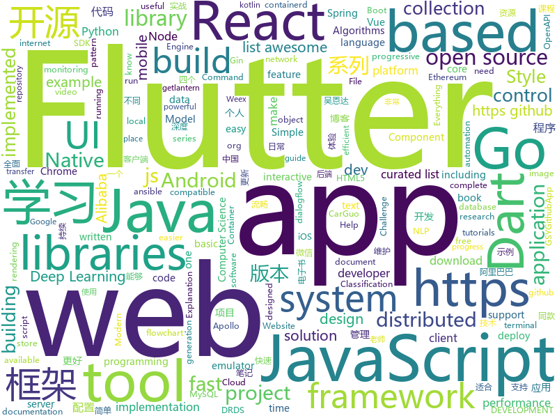

# 2018-12-01
See what the GitHub community is most excited about today.

## python
* [wtfpython-cn](https://github.com/leisurelicht/wtfpython-cn)(**676 stars today**): wtfpython的中文翻译/施工结束/ 能力有限，欢迎帮我改进翻译
* [d2l-zh](https://github.com/diveintodeeplearning/d2l-zh)(**299 stars today**): 《动手学深度学习》
* [trape](https://github.com/jofpin/trape)(**133 stars today**): People tracker on the Internet: OSINT analysis and research tool by Jose Pino
* [q](https://github.com/harelba/q)(**101 stars today**): q - Run SQL directly on CSV or TSV files
* [bert](https://github.com/google-research/bert)(**80 stars today**): TensorFlow code and pre-trained models for BERT
* [Python](https://github.com/TheAlgorithms/Python)(**77 stars today**): All Algorithms implemented in Python
* [models](https://github.com/tensorflow/models)(**67 stars today**): Models and examples built with TensorFlow
* [fritz-style-transfer](https://github.com/fritzlabs/fritz-style-transfer)(**71 stars today**): Train and deploy real-time artistic style transfer in mobile apps with Fritz Style Transfer.
* [awesome-python](https://github.com/vinta/awesome-python)(**64 stars today**): A curated list of awesome Python frameworks, libraries, software and resources
* [system-design-primer](https://github.com/donnemartin/system-design-primer)(**51 stars today**): Learn how to design large-scale systems. Prep for the system design interview. Includes Anki flashcards.
* [DeOldify](https://github.com/jantic/DeOldify)(**54 stars today**): A Deep Learning based project for colorizing and restoring old images
* [home-assistant](https://github.com/home-assistant/home-assistant)(**47 stars today**): 🏡Open source home automation that puts local control and privacy first
* [gandissect](https://github.com/CSAILVision/gandissect)(**50 stars today**): Pytorch-based tools for visualizing and understanding the neurons of a GAN. https://gandissect.csail.mit.edu/
* [idamagicstrings](https://github.com/joxeankoret/idamagicstrings)(**49 stars today**): An IDA Python script to extract information from string constants.
* [d2l-en](https://github.com/diveintodeeplearning/d2l-en)(**45 stars today**): Dive into Deep Learning (CV chapters coming soon)
* [keras](https://github.com/keras-team/keras)(**41 stars today**): Deep Learning for humans
* [partialconv](https://github.com/NVIDIA/partialconv)(**43 stars today**): A New Padding Scheme: Partial Convolution based Padding
* [3DDFA](https://github.com/cleardusk/3DDFA)(**43 stars today**): The pytorch improved re-implementation of TPAMI 2017 paper: Face Alignment in Full Pose Range: A 3D Total Solution.
* [cs224n-learning-camp](https://github.com/learning511/cs224n-learning-camp)(**35 stars today**): 
* [dash](https://github.com/plotly/dash)(**42 stars today**): Analytical Web Apps for Python. No JavaScript Required.
* [EEG-Explanation-model](https://github.com/OpenXAIProject/EEG-Explanation-model)(**31 stars today**): Classification and Explanation Model of Brain Signal based on Deep Learning Model
* [CCNet](https://github.com/speedinghzl/CCNet)(**40 stars today**): CCNet: Criss-Cross Attention for Semantic Segmentation
* [ansible](https://github.com/ansible/ansible)(**33 stars today**): Ansible is a radically simple IT automation platform that makes your applications and systems easier to deploy. Avoid writing scripts or custom code to deploy and update your applications — automate in a language that approaches plain English, using SSH, with no agents to install on remote systems. https://docs.ansible.com/ansible/
* [youtube-dl](https://github.com/rg3/youtube-dl)(**35 stars today**): Command-line program to download videos from YouTube.com and other video sites
* [Python](https://github.com/geekcomputers/Python)(**34 stars today**): My Python Examples

## java
* [resilience4j](https://github.com/resilience4j/resilience4j)(**256 stars today**): Resilience4j is a fault tolerance library designed for Java8 and functional programming
* [JavaGuide](https://github.com/Snailclimb/JavaGuide)(**164 stars today**): 【Java学习+面试指南】 一份涵盖大部分Java程序员所需要掌握的核心知识。
* [arthas](https://github.com/alibaba/arthas)(**174 stars today**): Alibaba Java Diagnostic Tool Arthas/Alibaba Java诊断利器Arthas
* [ArgusAPM](https://github.com/Qihoo360/ArgusAPM)(**97 stars today**): Powerful, comprehensive (Android) application performance management platform
* [Android-ZBLibrary](https://github.com/TommyLemon/Android-ZBLibrary)(**82 stars today**): 🔥Android MVP快速开发框架，做国内 「Demo最全面」「注释最详细」「使用最简单」「代码最严谨」的Android开源UI框架
* [interviews](https://github.com/kdn251/interviews)(**53 stars today**): Everything you need to know to get the job.
* [spring-cloud-alibaba](https://github.com/spring-cloud-incubator/spring-cloud-alibaba)(**57 stars today**): Spring Cloud Alibaba provides a one-stop solution for application development for the distributed solutions of Alibaba middleware.
* [Java](https://github.com/TheAlgorithms/Java)(**57 stars today**): All Algorithms implemented in Java
* [symphony](https://github.com/b3log/symphony)(**51 stars today**): 🎶一款用 Java 实现的现代化社区（论坛/BBS/社交网络/博客）平台。https://hacpai.com
* [litemall](https://github.com/linlinjava/litemall)(**42 stars today**): 又一个小商城。litemall = Spring Boot后端 + Vue管理员前端 + 微信小程序用户前端
* [tutorials](https://github.com/eugenp/tutorials)(**31 stars today**): The "REST With Spring" Course:
* [java-design-patterns](https://github.com/iluwatar/java-design-patterns)(**39 stars today**): Design patterns implemented in Java
* [JCSprout](https://github.com/crossoverJie/JCSprout)(**37 stars today**): 👨‍🎓Java Core Sprout : basic, concurrent, algorithm
* [spring-boot](https://github.com/spring-projects/spring-boot)(**40 stars today**): Spring Boot
* [easyexcel](https://github.com/alibaba/easyexcel)(**41 stars today**): 快速、简单避免OOM的java处理Excel工具
* [Sentinel](https://github.com/alibaba/Sentinel)(**42 stars today**): A lightweight flow-control library providing high-available protection and monitoring (高可用防护的流量管理框架)
* [apollo](https://github.com/ctripcorp/apollo)(**37 stars today**): Apollo（阿波罗）是携程框架部门研发的分布式配置中心，能够集中化管理应用不同环境、不同集群的配置，配置修改后能够实时推送到应用端，并且具备规范的权限、流程治理等特性，适用于微服务配置管理场景。2018年开源中国最受欢迎开源软件评选请参与投票 https://www.oschina.net/project/top_cn_2018
* [AndroidProject](https://github.com/getActivity/AndroidProject)(**42 stars today**): An advanced template project
* [spring-framework](https://github.com/spring-projects/spring-framework)(**32 stars today**): Spring Framework
* [netty](https://github.com/netty/netty)(**35 stars today**): Netty project - an event-driven asynchronous network application framework
* [guava](https://github.com/google/guava)(**32 stars today**): Google core libraries for Java
* [soul](https://github.com/Dromara/soul)(**31 stars today**): 这是一个高性能，异步的反应式的gateway
* [canal](https://github.com/alibaba/canal)(**27 stars today**): 阿里巴巴mysql数据库binlog的增量订阅&消费组件 。阿里云DRDS( https://www.aliyun.com/product/drds )、阿里巴巴TDDL 二级索引、小表复制powerd by canal.
* [elasticsearch](https://github.com/elastic/elasticsearch)(**25 stars today**): Open Source, Distributed, RESTful Search Engine
* [AndroidUtilCode](https://github.com/Blankj/AndroidUtilCode)(**28 stars today**): 🔥Android developers should collect the following utils(updating).

## unknown
* [stanford-cs-230-deep-learning](https://github.com/afshinea/stanford-cs-230-deep-learning)(**315 stars today**): VIP cheatsheets for Stanford's CS 230 Deep Learning
* [fuzz.txt](https://github.com/Bo0oM/fuzz.txt)(**157 stars today**): Potentially dangerous files
* [CS-Notes](https://github.com/CyC2018/CS-Notes)(**81 stars today**): 📚Computer Science Learning Notes
* [guides](https://github.com/mayfrost/guides)(**89 stars today**): Looking for a guide? You came to the right place. Here you can find documentation for a variety of topics I research to make complex computing easier. For comments go to the IRC channel #nfo at the Rizon network.
* [awesome](https://github.com/sindresorhus/awesome)(**74 stars today**): 😎Curated list of awesome lists
* [haoel.github.io](https://github.com/haoel/haoel.github.io)(**68 stars today**): 
* [gitignore](https://github.com/github/gitignore)(**57 stars today**): A collection of useful .gitignore templates
* [You-Dont-Know-JS](https://github.com/getify/You-Dont-Know-JS)(**58 stars today**): A book series on JavaScript. @YDKJS on twitter.
* [AZTEC](https://github.com/AztecProtocol/AZTEC)(**60 stars today**): Public repository for the AZTEC protocol
* [Xiaomi_Kernel_OpenSource](https://github.com/MiCode/Xiaomi_Kernel_OpenSource)(**47 stars today**): Xiaomi Mobile Phone Kernel OpenSource
* [free-programming-books](https://github.com/EbookFoundation/free-programming-books)(**53 stars today**): 📚Freely available programming books
* [Blog](https://github.com/mqyqingfeng/Blog)(**50 stars today**): 冴羽写博客的地方，预计写四个系列：JavaScript深入系列、JavaScript专题系列、ES6系列、React系列。
* [REBL-distro](https://github.com/cognitect-labs/REBL-distro)(**52 stars today**): REBL-distro
* [awesome-vue](https://github.com/vuejs/awesome-vue)(**46 stars today**): 🎉A curated list of awesome things related to Vue.js
* [kindle_free_books](https://github.com/crazyandcoder/kindle_free_books)(**46 stars today**): 免费的Kindle电子书资源，不定期更新...
* [developer-roadmap](https://github.com/kamranahmedse/developer-roadmap)(**44 stars today**): Roadmap to becoming a web developer in 2018
* [project-based-learning](https://github.com/tuvtran/project-based-learning)(**37 stars today**): Curated list of project-based tutorials
* [architect-awesome](https://github.com/xingshaocheng/architect-awesome)(**31 stars today**): 后端架构师技术图谱
* [daizhigev20](https://github.com/garychowcmu/daizhigev20)(**31 stars today**): 殆知阁古代文献
* [http3-explained](https://github.com/bagder/http3-explained)(**31 stars today**): A document describing the HTTP/3 and QUIC protocols
* [coding-interview-university](https://github.com/jwasham/coding-interview-university)(**27 stars today**): A complete computer science study plan to become a software engineer.
* [build-your-own-x](https://github.com/danistefanovic/build-your-own-x)(**29 stars today**): 🤓Build your own (insert technology here)
* [mml-book.github.io](https://github.com/mml-book/mml-book.github.io)(**25 stars today**): Companion webpage to the book "Mathematics For Machine Learning"
* [first-contributions](https://github.com/firstcontributions/first-contributions)(**14 stars today**): 🚀✨Help beginners to contribute to open source projects
* [computer-science](https://github.com/ossu/computer-science)(**24 stars today**): 🎓Path to a free self-taught education in Computer Science!

## javascript
* [learnGitBranching](https://github.com/pcottle/learnGitBranching)(**203 stars today**): An interactive git visualization to challenge and educate!
* [edex-ui](https://github.com/GitSquared/edex-ui)(**199 stars today**): A science fiction terminal emulator designed for large touchscreens that runs on all major OSs.
* [progress-estimator](https://github.com/bvaughn/progress-estimator)(**186 stars today**): Logs a progress bar and estimation for how long a Promise will take to complete
* [mermaid](https://github.com/knsv/mermaid)(**175 stars today**): Generation of diagram and flowchart from text in a similar manner as markdown
* [vue](https://github.com/vuejs/vue)(**142 stars today**): 🖖A progressive, incrementally-adoptable JavaScript framework for building UI on the web.
* [SIMD-Visualiser](https://github.com/piotte13/SIMD-Visualiser)(**148 stars today**): A tool to graphically visualize SIMD code
* [tabulator](https://github.com/olifolkerd/tabulator)(**132 stars today**): Interactive Tables and Data Grids for JavaScript
* [spectrum](https://github.com/withspectrum/spectrum)(**104 stars today**): Simple, powerful online communities.
* [thanks](https://github.com/feross/thanks)(**102 stars today**): 🙌Give thanks to the open source maintainers you depend on!✨
* [react](https://github.com/facebook/react)(**90 stars today**): A declarative, efficient, and flexible JavaScript library for building user interfaces.
* [bypass-paywalls-firefox](https://github.com/iamadamdev/bypass-paywalls-firefox)(**96 stars today**): Bypass Paywalls for Firefox
* [create-react-app](https://github.com/facebook/create-react-app)(**78 stars today**): Set up a modern web app by running one command.
* [33-js-concepts](https://github.com/leonardomso/33-js-concepts)(**87 stars today**): 📜33 concepts every JavaScript developer should know.
* [taro](https://github.com/NervJS/taro)(**80 stars today**): 多端统一开发框架，支持用 React 的开发方式编写一次代码，生成能运行在微信小程序/百度智能小程序/支付宝小程序、H5、React Native 等的应用。 https://taro.js.org/
* [carlo](https://github.com/GoogleChromeLabs/carlo)(**83 stars today**): Web rendering surface for Node applications
* [puppeteer](https://github.com/GoogleChrome/puppeteer)(**78 stars today**): Headless Chrome Node API
* [ncc](https://github.com/zeit/ncc)(**80 stars today**): Node.js Compiler Collection
* [react-apollo-hooks](https://github.com/trojanowski/react-apollo-hooks)(**70 stars today**): Use Apollo Client as React hooks
* [30-seconds-of-code](https://github.com/30-seconds/30-seconds-of-code)(**62 stars today**): Curated collection of useful JavaScript snippets that you can understand in 30 seconds or less.
* [javascript-algorithms](https://github.com/trekhleb/javascript-algorithms)(**57 stars today**): 📝Algorithms and data structures implemented in JavaScript with explanations and links to further readings
* [javascript](https://github.com/airbnb/javascript)(**50 stars today**): JavaScript Style Guide
* [node](https://github.com/nodejs/node)(**48 stars today**): Node.js JavaScript runtime✨🐢🚀✨
* [storybook](https://github.com/storybooks/storybook)(**55 stars today**): Interactive UI component dev & test: React, React Native, Vue, Angular, Ember
* [axios](https://github.com/axios/axios)(**50 stars today**): Promise based HTTP client for the browser and node.js
* [GoJS](https://github.com/NorthwoodsSoftware/GoJS)(**46 stars today**): JavaScript diagramming library for interactive flowcharts, org charts, design tools, planning tools, visual languages.

## html
* [wedding-website](https://github.com/rampatra/wedding-website)(**141 stars today**): Our Wedding Website👫
* [AdminLTE](https://github.com/almasaeed2010/AdminLTE)(**24 stars today**): AdminLTE - Free Premium Admin control Panel Theme Based On Bootstrap 3.x
* [Coursera-ML-AndrewNg-Notes](https://github.com/fengdu78/Coursera-ML-AndrewNg-Notes)(**21 stars today**): 吴恩达老师的机器学习课程个人笔记
* [flutter-in-action](https://github.com/flutterchina/flutter-in-action)(**26 stars today**): 《Flutter实战》电子书
* [NLP-progress](https://github.com/sebastianruder/NLP-progress)(**25 stars today**): Repository to track the progress in Natural Language Processing (NLP), including the datasets and the current state-of-the-art for the most common NLP tasks.
* [ionic](https://github.com/ionic-team/ionic)(**19 stars today**): Build amazing native and progressive web apps with open web technologies. One app running on everything🎉
* [styleguide](https://github.com/google/styleguide)(**17 stars today**): Style guides for Google-originated open-source projects
* [Spoon-Knife](https://github.com/octocat/Spoon-Knife)(****): This repo is for demonstration purposes only.
* [JavaScript30](https://github.com/wesbos/JavaScript30)(**8 stars today**): 30 Day Vanilla JS Challenge
* [Blog](https://github.com/ljianshu/Blog)(**11 stars today**): 个人博客及其源代码
* [polymer](https://github.com/Polymer/polymer)(**13 stars today**): Our original Web Component library.
* [portainer](https://github.com/portainer/portainer)(**11 stars today**): Simple management UI for Docker
* [fastText](https://github.com/facebookresearch/fastText)(**12 stars today**): Library for fast text representation and classification.
* [openapi-generator](https://github.com/OpenAPITools/openapi-generator)(**9 stars today**): OpenAPI Generator allows generation of API client libraries (SDK generation), server stubs, documentation and configuration automatically given an OpenAPI Spec (v2, v3)
* [javascript-tutorial-en](https://github.com/iliakan/javascript-tutorial-en)(**11 stars today**): Modern JavaScript Tutorial
* [primeng](https://github.com/primefaces/primeng)(**9 stars today**): UI Components for Angular
* [EIPs](https://github.com/ethereum/EIPs)(**10 stars today**): The Ethereum Improvement Proposal repository
* [console.love](https://github.com/maeligg/console.love)(**10 stars today**): A collection of funny, quirky and lovely console messages from around the web
* [react-redux](https://github.com/reduxjs/react-redux)(**9 stars today**): Official React bindings for Redux
* [home](https://github.com/apachecn/home)(**9 stars today**): ApacheCN 开源组织
* [deeplearning_ai_books](https://github.com/fengdu78/deeplearning_ai_books)(**8 stars today**): deeplearning.ai（吴恩达老师的深度学习课程笔记及资源）
* [ecma262](https://github.com/tc39/ecma262)(**9 stars today**): Status, process, and documents for ECMA262
* [electron-api-demos](https://github.com/electron/electron-api-demos)(**9 stars today**): Explore the Electron APIs
* [speedtest](https://github.com/adolfintel/speedtest)(**7 stars today**): Self-hosted HTML5 Speedtest. Easy setup, examples, configurable, responsive and mobile friendly. Supports PHP, Node, and more.
* [ctf-wiki](https://github.com/ctf-wiki/ctf-wiki)(**8 stars today**): CTF Wiki Online

## dart
* [flutter](https://github.com/flutter/flutter)(**74 stars today**): Flutter makes it easy and fast to build beautiful mobile apps.
* [awesome-flutter](https://github.com/Solido/awesome-flutter)(**50 stars today**): An awesome list that curates the best Flutter libraries, tools, tutorials, articles and more.
* [RealRichText](https://github.com/bytedance/RealRichText)(**15 stars today**): A Tricky Solution for Implementing Inline-Image-In-Text Feature in Flutter.
* [plugins](https://github.com/flutter/plugins)(**10 stars today**): Plugins for Flutter, including FlutterFire, maintained by the Flutter team
* [GSYGithubAppFlutter](https://github.com/CarGuo/GSYGithubAppFlutter)(**9 stars today**): 超完整的Flutter项目，功能丰富，适合学习和日常使用。GSYGithubApp系列的优势：我们目前已经拥有Flutter、Weex、ReactNative、kotlin 四个版本。 功能齐全，项目框架内技术涉及面广，完成度高，持续维护，配套文章，适合全面学习，对比参考。跨平台的开源Github客户端App，更好的体验，更丰富的功能，旨在更好的日常管理和维护个人Github，提供更好更方便的驾车体验Σ(￣。￣ﾉ)ﾉ。同款Weex版本 ： https://github.com/CarGuo/GSYGithubAppWeex 、同款React Native版本 ： https://github.com/CarGuo/GSYGithubApp 、原生 kotlin 版本 https://g…
* [scoped_model](https://github.com/brianegan/scoped_model)(**6 stars today**): A Widget that passes a Reactive Model to all of it's children
* [sdk](https://github.com/dart-lang/sdk)(**6 stars today**): The Dart SDK, including the VM, dart2js, core libraries, and more.
* [sqflite](https://github.com/tekartik/sqflite)(**6 stars today**): SQLite flutter plugin
* [flutter](https://github.com/Nealyang/flutter)(**5 stars today**): study flutter,持续更新中...
* [flutter_dialogflow](https://github.com/VictorRancesCode/flutter_dialogflow)(****): Flutter package for makes it easy to integrate dialogflow and support dialogflow v2
* [rethinkdb](https://github.com/billysometimes/rethinkdb)(****): dart driver for rethinkDB
* [chromedeveditor](https://github.com/googlearchive/chromedeveditor)(****): Chrome Dev Editor is a developer tool for building apps on the Chrome platform - Chrome Apps and Web Apps, in JavaScript or Dart. (NO LONGER IN ACTIVE DEVELOPMENT)
* [FlutterExampleApps](https://github.com/iampawan/FlutterExampleApps)(****): [Example APPS] Basic Flutter apps, for flutter devs.
* [Flutter-UI-Kit](https://github.com/iampawan/Flutter-UI-Kit)(****): Flutter app for collection of UI in a UIKit
* [flutter_architecture_samples](https://github.com/brianegan/flutter_architecture_samples)(****): TodoMVC for Flutter
* [flutter-examples](https://github.com/nisrulz/flutter-examples)(****): [Examples] Simple basic isolated apps, for budding flutter devs.
* [inKino](https://github.com/roughike/inKino)(****): A multiplatform Dart movie app with 40% of code sharing between Flutter and the Web.
* [flutter-osc](https://github.com/yubo725/flutter-osc)(****): 基于Google Flutter的开源中国客户端，支持Android和iOS。
* [dio](https://github.com/flutterchina/dio)(****): A powerful Http client for Dart, which supports Interceptors, FormData, Request Cancellation, File Downloading, Timeout etc.
* [Flutter-learning](https://github.com/AweiLoveAndroid/Flutter-learning)(****): 🔥👍🌟⭐️⭐️⭐️Flutter安装和配置，Flutter开发遇到的难题，Flutter示例代码和模板，Flutter项目实战，Dart语言学习示例代码。
* [zhihu-flutter](https://github.com/HackSoul/zhihu-flutter)(****): Flutter 高仿知乎 UI，非常漂亮，也非常流畅，flutter build apk 或 flutter build ios 之后更流畅
* [hauberk](https://github.com/munificent/hauberk)(****): A web-based roguelike written in Dart.
* [angular](https://github.com/dart-lang/angular)(****): Fast and productive web framework provided by Dart
* [StageXL](https://github.com/bp74/StageXL)(****): A fast and universal 2D rendering engine for HTML5 and Dart.
* [Flutter-Notebook](https://github.com/OpenFlutter/Flutter-Notebook)(****): 日更的FlutterDemo合集，今天你fu了吗

## go
* [dive](https://github.com/wagoodman/dive)(**314 stars today**): A tool for exploring each layer in a docker image
* [objectbox-go](https://github.com/objectbox/objectbox-go)(**183 stars today**): ObjectBox Go - persisting your Go structs/objects superfast and simple
* [aminal](https://github.com/liamg/aminal)(**160 stars today**): Golang terminal emulator from scratch
* [go](https://github.com/golang/go)(**97 stars today**): The Go programming language
* [kubernetes](https://github.com/kubernetes/kubernetes)(**64 stars today**): Production-Grade Container Scheduling and Management
* [awesome-go](https://github.com/avelino/awesome-go)(**60 stars today**): A curated list of awesome Go frameworks, libraries and software
* [vdl](https://github.com/vipshop/vdl)(**56 stars today**): A distributed log store based on raft
* [frp](https://github.com/fatedier/frp)(**52 stars today**): A fast reverse proxy to help you expose a local server behind a NAT or firewall to the internet.
* [istio](https://github.com/istio/istio)(**43 stars today**): Connect, secure, control, and observe services.
* [fixed](https://github.com/robaho/fixed)(**44 stars today**): high performance fixed decimal place math library for Go
* [websocket](https://github.com/gorilla/websocket)(**42 stars today**): A WebSocket implementation for Go.
* [gin](https://github.com/gin-gonic/gin)(**38 stars today**): Gin is a HTTP web framework written in Go (Golang). It features a Martini-like API with much better performance -- up to 40 times faster. If you need smashing performance, get yourself some Gin.
* [circuit](https://github.com/cep21/circuit)(**36 stars today**): An efficient and feature complete Hystrix like Go implementation of the circuit breaker pattern.
* [build-web-application-with-golang](https://github.com/astaxie/build-web-application-with-golang)(**29 stars today**): A golang ebook intro how to build a web with golang
* [goboy](https://github.com/Humpheh/goboy)(**33 stars today**): Multi-platform Nintendo Game Boy Color emulator written in Go
* [prometheus](https://github.com/prometheus/prometheus)(**28 stars today**): The Prometheus monitoring system and time series database.
* [minio](https://github.com/minio/minio)(**31 stars today**): Minio is an open source object storage server compatible with Amazon S3 APIs
* [soar](https://github.com/XiaoMi/soar)(**30 stars today**): SQL Optimizer And Rewriter
* [etcd](https://github.com/etcd-io/etcd)(**29 stars today**): Distributed reliable key-value store for the most critical data of a distributed system
* [lantern](https://github.com/getlantern/lantern)(**27 stars today**): 🔴蓝灯最新版本下载 https://github.com/getlantern/download🔴Lantern Latest Download https://github.com/getlantern/download🔴
* [tidb](https://github.com/pingcap/tidb)(**27 stars today**): TiDB is a distributed HTAP database compatible with the MySQL protocol
* [go-ethereum](https://github.com/ethereum/go-ethereum)(**24 stars today**): Official Go implementation of the Ethereum protocol
* [firecracker-containerd](https://github.com/firecracker-microvm/firecracker-containerd)(**30 stars today**): firecracker-containerd enables containerd to manage containers as Firecracker microVMs
* [traefik](https://github.com/containous/traefik)(**29 stars today**): The Cloud Native Edge Router
* [hugo](https://github.com/gohugoio/hugo)(**28 stars today**): The world’s fastest framework for building websites.

## WordCloud

