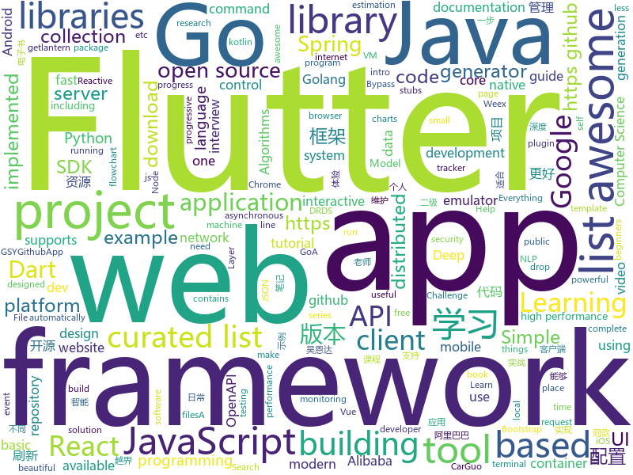

# 2018-12-02
See what the GitHub community is most excited about today.

## python
* [wtfpython-cn](https://github.com/leisurelicht/wtfpython-cn)(**292 stars today**): wtfpython的中文翻译/施工结束/ 能力有限，欢迎帮我改进翻译
* [d2l-zh](https://github.com/diveintodeeplearning/d2l-zh)(**106 stars today**): 《动手学深度学习》
* [einops](https://github.com/arogozhnikov/einops)(**68 stars today**): Deep learning operations rethinked (supports tf, pytorch, chainer, gluon and others)
* [models](https://github.com/tensorflow/models)(**44 stars today**): Models and examples built with TensorFlow
* [trape](https://github.com/jofpin/trape)(**47 stars today**): People tracker on the Internet: OSINT analysis and research tool by Jose Pino
* [DeOldify](https://github.com/jantic/DeOldify)(**49 stars today**): A Deep Learning based project for colorizing and restoring old images
* [bert](https://github.com/google-research/bert)(**40 stars today**): TensorFlow code and pre-trained models for BERT
* [Python](https://github.com/TheAlgorithms/Python)(**37 stars today**): All Algorithms implemented in Python
* [public-apis](https://github.com/toddmotto/public-apis)(**37 stars today**): A collective list of public JSON APIs for use in web development.
* [system-design-primer](https://github.com/donnemartin/system-design-primer)(**37 stars today**): Learn how to design large-scale systems. Prep for the system design interview. Includes Anki flashcards.
* [q](https://github.com/harelba/q)(**40 stars today**): q - Run SQL directly on CSV or TSV files
* [awesome-python](https://github.com/vinta/awesome-python)(**33 stars today**): A curated list of awesome Python frameworks, libraries, software and resources
* [youtube-dl](https://github.com/rg3/youtube-dl)(**29 stars today**): Command-line program to download videos from YouTube.com and other video sites
* [home-assistant](https://github.com/home-assistant/home-assistant)(**26 stars today**): 🏡Open source home automation that puts local control and privacy first
* [keras](https://github.com/keras-team/keras)(**25 stars today**): Deep Learning for humans
* [responder](https://github.com/kennethreitz/responder)(**28 stars today**): a familiar HTTP Service Framework for Python
* [VideoPose3D](https://github.com/facebookresearch/VideoPose3D)(**26 stars today**): Efficient 3D human pose estimation in video using 2D keypoint trajectories
* [flask](https://github.com/pallets/flask)(**23 stars today**): The Python micro framework for building web applications.
* [scikit-learn](https://github.com/scikit-learn/scikit-learn)(**19 stars today**): scikit-learn: machine learning in Python
* [django](https://github.com/django/django)(**17 stars today**): The Web framework for perfectionists with deadlines.
* [cpython](https://github.com/python/cpython)(**16 stars today**): The Python programming language
* [awesome-algorithm](https://github.com/apachecn/awesome-algorithm)(**19 stars today**): Leetcode 题解 (跟随思路一步一步撸出代码) 及经典算法实现
* [TensorFlow-Course](https://github.com/open-source-for-science/TensorFlow-Course)(**20 stars today**): Simple and ready-to-use tutorials for TensorFlow
* [face_recognition](https://github.com/ageitgey/face_recognition)(**19 stars today**): The world's simplest facial recognition api for Python and the command line
* [CodingInterviews](https://github.com/jayshah19949596/CodingInterviews)(**20 stars today**): This repository contains coding interviews that I have encountered in company interviews

## java
* [JavaGuide](https://github.com/Snailclimb/JavaGuide)(**86 stars today**): 【Java学习+面试指南】 一份涵盖大部分Java程序员所需要掌握的核心知识。
* [resilience4j](https://github.com/resilience4j/resilience4j)(**63 stars today**): Resilience4j is a fault tolerance library designed for Java8 and functional programming
* [arthas](https://github.com/alibaba/arthas)(**61 stars today**): Alibaba Java Diagnostic Tool Arthas/Alibaba Java诊断利器Arthas
* [Java](https://github.com/TheAlgorithms/Java)(**42 stars today**): All Algorithms implemented in Java
* [java-design-patterns](https://github.com/iluwatar/java-design-patterns)(**35 stars today**): Design patterns implemented in Java
* [symphony](https://github.com/b3log/symphony)(**31 stars today**): 🎶一款用 Java 实现的现代化社区（论坛/BBS/社交网络/博客）平台。https://hacpai.com
* [tutorials](https://github.com/eugenp/tutorials)(**17 stars today**): The "REST With Spring" Course:
* [spring-cloud-alibaba](https://github.com/spring-cloud-incubator/spring-cloud-alibaba)(**29 stars today**): Spring Cloud Alibaba provides a one-stop solution for application development for the distributed solutions of Alibaba middleware.
* [litemall](https://github.com/linlinjava/litemall)(**27 stars today**): 又一个小商城。litemall = Spring Boot后端 + Vue管理员前端 + 微信小程序用户前端
* [interviews](https://github.com/kdn251/interviews)(**24 stars today**): Everything you need to know to get the job.
* [spring-boot](https://github.com/spring-projects/spring-boot)(**23 stars today**): Spring Boot
* [Sentinel](https://github.com/alibaba/Sentinel)(**21 stars today**): A lightweight flow-control library providing high-available protection and monitoring (高可用防护的流量管理框架)
* [spring-framework](https://github.com/spring-projects/spring-framework)(**17 stars today**): Spring Framework
* [JCSprout](https://github.com/crossoverJie/JCSprout)(**16 stars today**): 👨‍🎓Java Core Sprout : basic, concurrent, algorithm
* [elasticsearch](https://github.com/elastic/elasticsearch)(**15 stars today**): Open Source, Distributed, RESTful Search Engine
* [incubator-dubbo](https://github.com/apache/incubator-dubbo)(**16 stars today**): Apache Dubbo (incubating) is a high-performance, java based, open source RPC framework.
* [netty](https://github.com/netty/netty)(**15 stars today**): Netty project - an event-driven asynchronous network application framework
* [RxJava](https://github.com/ReactiveX/RxJava)(**16 stars today**): RxJava – Reactive Extensions for the JVM – a library for composing asynchronous and event-based programs using observable sequences for the Java VM.
* [apollo](https://github.com/ctripcorp/apollo)(**15 stars today**): Apollo（阿波罗）是携程框架部门研发的分布式配置中心，能够集中化管理应用不同环境、不同集群的配置，配置修改后能够实时推送到应用端，并且具备规范的权限、流程治理等特性，适用于微服务配置管理场景。
* [guava](https://github.com/google/guava)(**13 stars today**): Google core libraries for Java
* [flink](https://github.com/apache/flink)(**15 stars today**): Apache Flink
* [canal](https://github.com/alibaba/canal)(**13 stars today**): 阿里巴巴mysql数据库binlog的增量订阅&消费组件 。阿里云DRDS( https://www.aliyun.com/product/drds )、阿里巴巴TDDL 二级索引、小表复制powerd by canal.
* [okhttp](https://github.com/square/okhttp)(**13 stars today**): An HTTP+HTTP/2 client for Android and Java applications.
* [SmartRefreshLayout](https://github.com/scwang90/SmartRefreshLayout)(**13 stars today**): 🔥下拉刷新、上拉加载、二级刷新、淘宝二楼、RefreshLayout、OverScroll，Android智能下拉刷新框架，支持越界回弹、越界拖动，具有极强的扩展性，集成了几十种炫酷的Header和 Footer。
* [easyexcel](https://github.com/alibaba/easyexcel)(**12 stars today**): 快速、简单避免OOM的java处理Excel工具

## unknown
* [kindle_free_books](https://github.com/crazyandcoder/kindle_free_books)(**136 stars today**): 免费的Kindle电子书资源，不定期更新...
* [stanford-cs-230-deep-learning](https://github.com/afshinea/stanford-cs-230-deep-learning)(**129 stars today**): VIP cheatsheets for Stanford's CS 230 Deep Learning
* [fuzz.txt](https://github.com/Bo0oM/fuzz.txt)(**97 stars today**): Potentially dangerous files
* [i-am-chinese-the-dragonfly-must-go-on](https://github.com/ithinco/i-am-chinese-the-dragonfly-must-go-on)(**71 stars today**): A response to “We are Google employees, Google must drop DragonFly”
* [CS-Notes](https://github.com/CyC2018/CS-Notes)(**44 stars today**): 📚Computer Science Learning Notes
* [gitignore](https://github.com/github/gitignore)(**41 stars today**): A collection of useful .gitignore templates
* [free-programming-books](https://github.com/EbookFoundation/free-programming-books)(**46 stars today**): 📚Freely available programming books
* [developer-roadmap](https://github.com/kamranahmedse/developer-roadmap)(**40 stars today**): Roadmap to becoming a web developer in 2018
* [You-Dont-Know-JS](https://github.com/getify/You-Dont-Know-JS)(**33 stars today**): A book series on JavaScript. @YDKJS on twitter.
* [awesome](https://github.com/sindresorhus/awesome)(**31 stars today**): 😎Curated list of awesome lists
* [project-based-learning](https://github.com/tuvtran/project-based-learning)(**28 stars today**): Curated list of project-based tutorials
* [AZTEC](https://github.com/AztecProtocol/AZTEC)(**31 stars today**): Public repository for the AZTEC protocol
* [awesome-actions](https://github.com/sdras/awesome-actions)(**30 stars today**): A curated list of awesome actions to use on GitHub
* [computer-science](https://github.com/ossu/computer-science)(**26 stars today**): 🎓Path to a free self-taught education in Computer Science!
* [mml-book.github.io](https://github.com/mml-book/mml-book.github.io)(**21 stars today**): Companion webpage to the book "Mathematics For Machine Learning"
* [first-contributions](https://github.com/firstcontributions/first-contributions)(**11 stars today**): 🚀✨Help beginners to contribute to open source projects
* [new-pac](https://github.com/Alvin9999/new-pac)(**23 stars today**): 
* [awesome-vue](https://github.com/vuejs/awesome-vue)(**19 stars today**): 🎉A curated list of awesome things related to Vue.js
* [awesome-for-beginners](https://github.com/MunGell/awesome-for-beginners)(**20 stars today**): A list of awesome beginners-friendly projects.
* [trackerslist](https://github.com/ngosang/trackerslist)(**18 stars today**): An updated list of public BitTorrent trackers
* [awesome-layers](https://github.com/mthenw/awesome-layers)(**19 stars today**): λ A curated list of awesome AWS Lambda Layers.
* [daizhigev20](https://github.com/garychowcmu/daizhigev20)(**16 stars today**): 殆知阁古代文献
* [guides](https://github.com/mayfrost/guides)(**19 stars today**): Looking for a guide? You came to the right place. Here you can find documentation for a variety of topics I research to make complex computing easier. For comments go to the IRC channel #nfo at the Rizon network.
* [coding-interview-university](https://github.com/jwasham/coding-interview-university)(**16 stars today**): A complete computer science study plan to become a software engineer.
* [awesome-cpp](https://github.com/fffaraz/awesome-cpp)(**18 stars today**): A curated list of awesome C++ (or C) frameworks, libraries, resources, and shiny things. Inspired by awesome-... stuff.

## javascript
* [spectrum](https://github.com/withspectrum/spectrum)(**163 stars today**): Simple, powerful online communities.
* [tabulator](https://github.com/olifolkerd/tabulator)(**141 stars today**): Interactive Tables and Data Grids for JavaScript
* [learnGitBranching](https://github.com/pcottle/learnGitBranching)(**114 stars today**): An interactive git visualization to challenge and educate!
* [edex-ui](https://github.com/GitSquared/edex-ui)(**91 stars today**): A science fiction terminal emulator designed for large touchscreens that runs on all major OSs.
* [overreacted.io](https://github.com/gaearon/overreacted.io)(**90 stars today**): ignore me
* [SIMD-Visualiser](https://github.com/piotte13/SIMD-Visualiser)(**84 stars today**): A tool to graphically visualize SIMD code
* [progress-estimator](https://github.com/bvaughn/progress-estimator)(**86 stars today**): Logs a progress bar and estimation for how long a Promise will take to complete
* [vue](https://github.com/vuejs/vue)(**68 stars today**): 🖖A progressive, incrementally-adoptable JavaScript framework for building UI on the web.
* [ncc](https://github.com/zeit/ncc)(**57 stars today**): Node.js Compiler Collection
* [programmers-introduction-to-mathematics](https://github.com/pim-book/programmers-introduction-to-mathematics)(**52 stars today**): Code for A Programmer's Introduction to Mathematics
* [react](https://github.com/facebook/react)(**46 stars today**): A declarative, efficient, and flexible JavaScript library for building user interfaces.
* [create-react-app](https://github.com/facebook/create-react-app)(**43 stars today**): Set up a modern web app by running one command.
* [mermaid](https://github.com/knsv/mermaid)(**48 stars today**): Generation of diagram and flowchart from text in a similar manner as markdown
* [next.js](https://github.com/zeit/next.js)(**44 stars today**): The React Framework
* [30-seconds-of-code](https://github.com/30-seconds/30-seconds-of-code)(**40 stars today**): Curated collection of useful JavaScript snippets that you can understand in 30 seconds or less.
* [bypass-paywalls-firefox](https://github.com/iamadamdev/bypass-paywalls-firefox)(**42 stars today**): Bypass Paywalls for Firefox
* [telegram-react](https://github.com/evgeny-nadymov/telegram-react)(**39 stars today**): 
* [axios](https://github.com/axios/axios)(**35 stars today**): Promise based HTTP client for the browser and node.js
* [gatsby](https://github.com/gatsbyjs/gatsby)(**35 stars today**): Build blazing fast, modern apps and websites with React
* [javascript-algorithms](https://github.com/trekhleb/javascript-algorithms)(**30 stars today**): 📝Algorithms and data structures implemented in JavaScript with explanations and links to further readings
* [try](https://github.com/BrunnerLivio/try)(**33 stars today**): 📦Quickly try out NPM packages inside a container
* [Sortable](https://github.com/RubaXa/Sortable)(**32 stars today**): Sortable — is a JavaScript library for reorderable drag-and-drop lists on modern browsers and touch devices. No jQuery. Supports Meteor, AngularJS, React, Polymer, Knockout and any CSS library, e.g. Bootstrap.
* [react-native](https://github.com/facebook/react-native)(**28 stars today**): A framework for building native apps with React.
* [prettier](https://github.com/prettier/prettier)(**30 stars today**): Prettier is an opinionated code formatter.
* [GoJS](https://github.com/NorthwoodsSoftware/GoJS)(**30 stars today**): JavaScript diagramming library for interactive flowcharts, org charts, design tools, planning tools, visual languages.

## html
* [wedding-website](https://github.com/rampatra/wedding-website)(**30 stars today**): Our Wedding Website👫
* [nginxconfig.io](https://github.com/valentinxxx/nginxconfig.io)(**22 stars today**): ⚙️NGiИX config generator generator on steroids💉
* [JavaScript30](https://github.com/wesbos/JavaScript30)(**13 stars today**): 30 Day Vanilla JS Challenge
* [Coursera-ML-AndrewNg-Notes](https://github.com/fengdu78/Coursera-ML-AndrewNg-Notes)(**12 stars today**): 吴恩达老师的机器学习课程个人笔记
* [AdminLTE](https://github.com/almasaeed2010/AdminLTE)(**12 stars today**): AdminLTE - Free Premium Admin control Panel Theme Based On Bootstrap 3.x
* [deeplearning_ai_books](https://github.com/fengdu78/deeplearning_ai_books)(**12 stars today**): deeplearning.ai（吴恩达老师的深度学习课程笔记及资源）
* [styleguide](https://github.com/google/styleguide)(**11 stars today**): Style guides for Google-originated open-source projects
* [es-howto](https://github.com/TimothyGu/es-howto)(**11 stars today**): How to read the ECMAScript specification (ECMA-262)
* [NLP-progress](https://github.com/sebastianruder/NLP-progress)(**9 stars today**): Repository to track the progress in Natural Language Processing (NLP), including the datasets and the current state-of-the-art for the most common NLP tasks.
* [owasp-mstg](https://github.com/OWASP/owasp-mstg)(**10 stars today**): The Mobile Security Testing Guide (MSTG) is a comprehensive manual for mobile app security testing and reverse engineering.
* [simple-icons](https://github.com/simple-icons/simple-icons)(**9 stars today**): SVG icons for popular brands
* [ionic](https://github.com/ionic-team/ionic)(**7 stars today**): Build amazing native and progressive web apps with open web technologies. One app running on everything🎉
* [Spoon-Knife](https://github.com/octocat/Spoon-Knife)(****): This repo is for demonstration purposes only.
* [primeng](https://github.com/primefaces/primeng)(**7 stars today**): UI Components for Angular
* [now-github-starter](https://github.com/zeit/now-github-starter)(****): Starter project to demonstrate a project whose pull requests get automatically deployed
* [flutter-in-action](https://github.com/flutterchina/flutter-in-action)(**6 stars today**): 《Flutter实战》电子书
* [react-redux](https://github.com/reduxjs/react-redux)(**6 stars today**): Official React bindings for Redux
* [portainer](https://github.com/portainer/portainer)(**6 stars today**): Simple management UI for Docker
* [electron-api-demos](https://github.com/electron/electron-api-demos)(**5 stars today**): Explore the Electron APIs
* [ecma262](https://github.com/tc39/ecma262)(**5 stars today**): Status, process, and documents for ECMA262
* [fluxion](https://github.com/FluxionNetwork/fluxion)(**5 stars today**): Fluxion is a remake of linset by vk496 with less bugs and enhanced functionality.
* [openapi-generator](https://github.com/OpenAPITools/openapi-generator)(**5 stars today**): OpenAPI Generator allows generation of API client libraries (SDK generation), server stubs, documentation and configuration automatically given an OpenAPI Spec (v2, v3)
* [home](https://github.com/apachecn/home)(**5 stars today**): ApacheCN 开源组织
* [fonts](https://github.com/google/fonts)(**5 stars today**): Font files available from Google Fonts
* [swagger-codegen](https://github.com/swagger-api/swagger-codegen)(**5 stars today**): swagger-codegen contains a template-driven engine to generate documentation, API clients and server stubs in different languages by parsing your OpenAPI / Swagger definition.

## dart
* [flutter](https://github.com/flutter/flutter)(**54 stars today**): Flutter makes it easy and fast to build beautiful mobile apps.
* [awesome-flutter](https://github.com/Solido/awesome-flutter)(**16 stars today**): An awesome list that curates the best Flutter libraries, tools, tutorials, articles and more.
* [plugins](https://github.com/flutter/plugins)(**11 stars today**): Plugins for Flutter, including FlutterFire, maintained by the Flutter team
* [scoped_model](https://github.com/brianegan/scoped_model)(**7 stars today**): A Widget that passes a Reactive Model to all of it's children
* [samples](https://github.com/flutter/samples)(**6 stars today**): A collection of Flutter examples and demos.
* [GSYGithubAppFlutter](https://github.com/CarGuo/GSYGithubAppFlutter)(**5 stars today**): 超完整的Flutter项目，功能丰富，适合学习和日常使用。GSYGithubApp系列的优势：我们目前已经拥有Flutter、Weex、ReactNative、kotlin 四个版本。 功能齐全，项目框架内技术涉及面广，完成度高，持续维护，配套文章，适合全面学习，对比参考。跨平台的开源Github客户端App，更好的体验，更丰富的功能，旨在更好的日常管理和维护个人Github，提供更好更方便的驾车体验Σ(￣。￣ﾉ)ﾉ。同款Weex版本 ： https://github.com/CarGuo/GSYGithubAppWeex 、同款React Native版本 ： https://github.com/CarGuo/GSYGithubApp 、原生 kotlin 版本 https://g…
* [fluwx](https://github.com/OpenFlutter/fluwx)(****): Flutter版微信SDK.WeChat SDK for flutter.
* [jaguar_serializer](https://github.com/Jaguar-dart/jaguar_serializer)(****): Format (JSON, XML, protobuf, mongodb, etc) and platform (server, client) agnostic serialization framework
* [Youtube-Tutorials](https://github.com/RobertBrunhage/Youtube-Tutorials)(****): 
* [fcharts](https://github.com/thekeenant/fcharts)(****): 📊[wip] Create beautiful, responsive, animated charts using a simple and intuitive API.
* [SplashScreenFlutterPackage](https://github.com/KarimMohamed2005/SplashScreenFlutterPackage)(****): A small splash screen package used to easily add an intro to any Flutter application.
* [xtimer-flutter-app](https://github.com/pedromassango/xtimer-flutter-app)(****): Flutter timer app
* [flutter-redux-starter](https://github.com/hillelcoren/flutter-redux-starter)(****): Starter project and code generator for Flutter/Redux
* [flutter-geolocator](https://github.com/BaseflowIT/flutter-geolocator)(****): Android and iOS Geolocation plugin for Flutter
* [sqflite](https://github.com/tekartik/sqflite)(****): SQLite flutter plugin
* [chromedeveditor](https://github.com/googlearchive/chromedeveditor)(****): Chrome Dev Editor is a developer tool for building apps on the Chrome platform - Chrome Apps and Web Apps, in JavaScript or Dart. (NO LONGER IN ACTIVE DEVELOPMENT)
* [sdk](https://github.com/dart-lang/sdk)(****): The Dart SDK, including the VM, dart2js, core libraries, and more.
* [FlutterExampleApps](https://github.com/iampawan/FlutterExampleApps)(****): [Example APPS] Basic Flutter apps, for flutter devs.
* [Flutter-UI-Kit](https://github.com/iampawan/Flutter-UI-Kit)(****): Flutter app for collection of UI in a UIKit
* [flutter_architecture_samples](https://github.com/brianegan/flutter_architecture_samples)(****): TodoMVC for Flutter
* [flutter-examples](https://github.com/nisrulz/flutter-examples)(****): [Examples] Simple basic isolated apps, for budding flutter devs.
* [inKino](https://github.com/roughike/inKino)(****): A multiplatform Dart movie app with 40% of code sharing between Flutter and the Web.
* [flutter-osc](https://github.com/yubo725/flutter-osc)(****): 基于Google Flutter的开源中国客户端，支持Android和iOS。
* [dio](https://github.com/flutterchina/dio)(****): A powerful Http client for Dart, which supports Interceptors, FormData, Request Cancellation, File Downloading, Timeout etc.
* [Flutter-learning](https://github.com/AweiLoveAndroid/Flutter-learning)(****): 🔥👍🌟⭐️⭐️⭐️Flutter安装和配置，Flutter开发遇到的难题，Flutter示例代码和模板，Flutter项目实战，Dart语言学习示例代码。

## go
* [dive](https://github.com/wagoodman/dive)(**126 stars today**): A tool for exploring each layer in a docker image
* [objectbox-go](https://github.com/objectbox/objectbox-go)(**117 stars today**): ObjectBox Go - persisting your Go structs/objects superfast and simple
* [pdftilecut](https://github.com/oxplot/pdftilecut)(**103 stars today**): pdftilecut lets you sub-divide a PDF page(s) into smaller pages so you can print them on small form printers.
* [aminal](https://github.com/liamg/aminal)(**65 stars today**): Golang terminal emulator from scratch
* [go](https://github.com/golang/go)(**48 stars today**): The Go programming language
* [websocket](https://github.com/gorilla/websocket)(**49 stars today**): A WebSocket implementation for Go.
* [goboy](https://github.com/Humpheh/goboy)(**40 stars today**): Multi-platform Nintendo Game Boy Color emulator written in Go
* [frp](https://github.com/fatedier/frp)(**33 stars today**): A fast reverse proxy to help you expose a local server behind a NAT or firewall to the internet.
* [kubernetes](https://github.com/kubernetes/kubernetes)(**27 stars today**): Production-Grade Container Scheduling and Management
* [fastcache](https://github.com/VictoriaMetrics/fastcache)(**31 stars today**): Fast thread-safe inmemory cache for big number of entries in Go
* [awesome-go](https://github.com/avelino/awesome-go)(**30 stars today**): A curated list of awesome Go frameworks, libraries and software
* [build](https://github.com/TeaWeb/build)(**27 stars today**): TeaWeb是集静态资源、缓存、代理、统计、监控于一体的可视化智能WebServer。
* [go-mega](https://github.com/bonfy/go-mega)(**23 stars today**): ✨🤟✨Go-Mega Tutorial for Go Web Develop | Demo: https://go-mega.herokuapp.com
* [sourcegraph](https://github.com/sourcegraph/sourcegraph)(**23 stars today**): Code search and intelligence, self-hosted and scalable
* [gin](https://github.com/gin-gonic/gin)(**21 stars today**): Gin is a HTTP web framework written in Go (Golang). It features a Martini-like API with much better performance -- up to 40 times faster. If you need smashing performance, get yourself some Gin.
* [build-web-application-with-golang](https://github.com/astaxie/build-web-application-with-golang)(**19 stars today**): A golang ebook intro how to build a web with golang
* [hugo](https://github.com/gohugoio/hugo)(**19 stars today**): The world’s fastest framework for building websites.
* [v2ray-core](https://github.com/v2ray/v2ray-core)(**17 stars today**): A platform for building proxies to bypass network restrictions.
* [fzf](https://github.com/junegunn/fzf)(**17 stars today**): 🌸A command-line fuzzy finder
* [lantern](https://github.com/getlantern/lantern)(**17 stars today**): 🔴蓝灯最新版本下载 https://github.com/getlantern/download🔴Lantern Latest Download https://github.com/getlantern/download🔴
* [fixed](https://github.com/robaho/fixed)(**17 stars today**): high performance fixed decimal place math library for Go
* [prometheus](https://github.com/prometheus/prometheus)(**16 stars today**): The Prometheus monitoring system and time series database.
* [etcd](https://github.com/etcd-io/etcd)(**15 stars today**): Distributed reliable key-value store for the most critical data of a distributed system
* [moby](https://github.com/moby/moby)(**13 stars today**): Moby Project - a collaborative project for the container ecosystem to assemble container-based systems
* [beego](https://github.com/astaxie/beego)(**12 stars today**): beego is an open-source, high-performance web framework for the Go programming language.

## WordCloud

