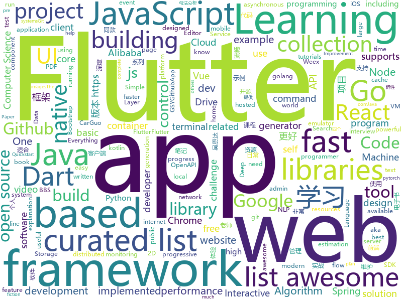

# 2018-12-03
See what the GitHub community is most excited about today.

## python
* [wtfpython-cn](https://github.com/leisurelicht/wtfpython-cn)(**163 stars today**): wtfpython的中文翻译/施工结束/ 能力有限，欢迎帮我改进翻译
* [d2l-zh](https://github.com/diveintodeeplearning/d2l-zh)(**78 stars today**): 《动手学深度学习》
* [responder](https://github.com/kennethreitz/responder)(**77 stars today**): a familiar HTTP Service Framework for Python
* [models](https://github.com/tensorflow/models)(**45 stars today**): Models and examples built with TensorFlow
* [bert](https://github.com/google-research/bert)(**50 stars today**): TensorFlow code and pre-trained models for BERT
* [termtosvg](https://github.com/nbedos/termtosvg)(**54 stars today**): Record terminal sessions as SVG animations
* [system-design-primer](https://github.com/donnemartin/system-design-primer)(**45 stars today**): Learn how to design large-scale systems. Prep for the system design interview. Includes Anki flashcards.
* [public-apis](https://github.com/toddmotto/public-apis)(**46 stars today**): A collective list of public JSON APIs for use in web development.
* [trape](https://github.com/jofpin/trape)(**46 stars today**): People tracker on the Internet: OSINT analysis and research tool by Jose Pino
* [Python](https://github.com/TheAlgorithms/Python)(**37 stars today**): All Algorithms implemented in Python
* [youtube-dl](https://github.com/rg3/youtube-dl)(**37 stars today**): Command-line program to download videos from YouTube.com and other video sites
* [VideoPose3D](https://github.com/facebookresearch/VideoPose3D)(**33 stars today**): Efficient 3D human pose estimation in video using 2D keypoint trajectories
* [keras](https://github.com/keras-team/keras)(**29 stars today**): Deep Learning for humans
* [awesome-python](https://github.com/vinta/awesome-python)(**28 stars today**): A curated list of awesome Python frameworks, libraries, software and resources
* [home-assistant](https://github.com/home-assistant/home-assistant)(**25 stars today**): 🏡Open source home automation that puts local control and privacy first
* [einops](https://github.com/arogozhnikov/einops)(**32 stars today**): Deep learning operations rethinked (supports tf, pytorch, chainer, gluon and others)
* [scikit-learn](https://github.com/scikit-learn/scikit-learn)(**25 stars today**): scikit-learn: machine learning in Python
* [ascii-canvas](https://github.com/vanyakosmos/ascii-canvas)(**28 stars today**): 
* [dash](https://github.com/plotly/dash)(**24 stars today**): Analytical Web Apps for Python. No JavaScript Required.
* [face_recognition](https://github.com/ageitgey/face_recognition)(**17 stars today**): The world's simplest facial recognition api for Python and the command line
* [s-tui](https://github.com/amanusk/s-tui)(**23 stars today**): Terminal based CPU stress and monitoring utility
* [DeOldify](https://github.com/jantic/DeOldify)(**23 stars today**): A Deep Learning based project for colorizing and restoring old images
* [django](https://github.com/django/django)(**19 stars today**): The Web framework for perfectionists with deadlines.
* [awesome-machine-learning](https://github.com/josephmisiti/awesome-machine-learning)(**19 stars today**): A curated list of awesome Machine Learning frameworks, libraries and software.
* [back2future.pytorch](https://github.com/anuragranj/back2future.pytorch)(**22 stars today**): Unsupervised Learning of Multi-Frame Optical Flow with Occlusions

## java
* [JavaGuide](https://github.com/Snailclimb/JavaGuide)(**87 stars today**): 【Java学习+面试指南】 一份涵盖大部分Java程序员所需要掌握的核心知识。
* [Java](https://github.com/TheAlgorithms/Java)(**39 stars today**): All Algorithms implemented in Java
* [spring-boot](https://github.com/spring-projects/spring-boot)(**32 stars today**): Spring Boot
* [java-design-patterns](https://github.com/iluwatar/java-design-patterns)(**34 stars today**): Design patterns implemented in Java
* [arthas](https://github.com/alibaba/arthas)(**30 stars today**): Alibaba Java Diagnostic Tool Arthas/Alibaba Java诊断利器Arthas
* [resilience4j](https://github.com/resilience4j/resilience4j)(**26 stars today**): Resilience4j is a fault tolerance library designed for Java8 and functional programming
* [tutorials](https://github.com/eugenp/tutorials)(**17 stars today**): The "REST With Spring" Course:
* [interviews](https://github.com/kdn251/interviews)(**20 stars today**): Everything you need to know to get the job.
* [litemall](https://github.com/linlinjava/litemall)(**19 stars today**): 又一个小商城。litemall = Spring Boot后端 + Vue管理员前端 + 微信小程序用户前端
* [RxJava](https://github.com/ReactiveX/RxJava)(**20 stars today**): RxJava – Reactive Extensions for the JVM – a library for composing asynchronous and event-based programs using observable sequences for the Java VM.
* [elasticsearch](https://github.com/elastic/elasticsearch)(**19 stars today**): Open Source, Distributed, RESTful Search Engine
* [spring-framework](https://github.com/spring-projects/spring-framework)(**12 stars today**): Spring Framework
* [JCSprout](https://github.com/crossoverJie/JCSprout)(**17 stars today**): 👨‍🎓Java Core Sprout : basic, concurrent, algorithm
* [symphony](https://github.com/b3log/symphony)(**17 stars today**): 🎶一款用 Java 实现的现代化社区（论坛/BBS/社交网络/博客）平台。https://hacpai.com
* [JSG](https://github.com/keith-turner/JSG)(**19 stars today**): Java Stack Trace Grouper
* [Sentinel](https://github.com/alibaba/Sentinel)(**16 stars today**): A lightweight flow-control library providing high-available protection and monitoring (高可用防护的流量管理框架)
* [spring-cloud-alibaba](https://github.com/spring-cloud-incubator/spring-cloud-alibaba)(**16 stars today**): Spring Cloud Alibaba provides a one-stop solution for application development for the distributed solutions of Alibaba middleware.
* [incubator-dubbo](https://github.com/apache/incubator-dubbo)(**13 stars today**): Apache Dubbo (incubating) is a high-performance, java based, open source RPC framework.
* [HanLP](https://github.com/hankcs/HanLP)(**16 stars today**): 自然语言处理 中文分词 词性标注 命名实体识别 依存句法分析 新词发现 关键词短语提取 自动摘要 文本分类聚类 拼音简繁
* [graal](https://github.com/oracle/graal)(**16 stars today**): GraalVM: Run Programs Faster Anywhere🚀
* [netty](https://github.com/netty/netty)(**14 stars today**): Netty project - an event-driven asynchronous network application framework
* [guava](https://github.com/google/guava)(**13 stars today**): Google core libraries for Java
* [react-native-camera](https://github.com/react-native-community/react-native-camera)(**13 stars today**): A Camera component for React Native. Also supports barcode scanning!
* [blade](https://github.com/lets-blade/blade)(**13 stars today**): 🚀Lightning fast and elegant mvc framework for Java8
* [flink](https://github.com/apache/flink)(**13 stars today**): Apache Flink

## unknown
* [CS-Notes](https://github.com/CyC2018/CS-Notes)(**327 stars today**): 📚Computer Science Learning Notes
* [i-am-chinese-the-dragonfly-must-go-on](https://github.com/ithinco/i-am-chinese-the-dragonfly-must-go-on)(**313 stars today**): A response to “We are Google employees, Google must drop DragonFly”
* [stanford-cs-230-deep-learning](https://github.com/afshinea/stanford-cs-230-deep-learning)(**104 stars today**): VIP cheatsheets for Stanford's CS 230 Deep Learning
* [kindle_free_books](https://github.com/crazyandcoder/kindle_free_books)(**79 stars today**): 免费的Kindle电子书资源，不定期更新...
* [developer-roadmap](https://github.com/kamranahmedse/developer-roadmap)(**60 stars today**): Roadmap to becoming a web developer in 2018
* [awesome](https://github.com/sindresorhus/awesome)(**57 stars today**): 😎Curated list of awesome lists
* [gitignore](https://github.com/github/gitignore)(**37 stars today**): A collection of useful .gitignore templates
* [ng-china-2018](https://github.com/ngChina/ng-china-2018)(**41 stars today**): ngChina 2018 conference
* [free-programming-books](https://github.com/EbookFoundation/free-programming-books)(**36 stars today**): 📚Freely available programming books
* [You-Dont-Know-JS](https://github.com/getify/You-Dont-Know-JS)(**34 stars today**): A book series on JavaScript. @YDKJS on twitter.
* [awesome-advent-of-code](https://github.com/Bogdanp/awesome-advent-of-code)(**24 stars today**): A collection of awesome resources related to the yearly Advent of Code challenge.
* [awesome-vue](https://github.com/vuejs/awesome-vue)(**35 stars today**): 🎉A curated list of awesome things related to Vue.js
* [coding-interview-university](https://github.com/jwasham/coding-interview-university)(**27 stars today**): A complete computer science study plan to become a software engineer.
* [mml-book.github.io](https://github.com/mml-book/mml-book.github.io)(**21 stars today**): Companion webpage to the book "Mathematics For Machine Learning"
* [awesome-actions](https://github.com/sdras/awesome-actions)(**22 stars today**): A curated list of awesome actions to use on GitHub
* [awesome-education](https://github.com/wowlusitong/awesome-education)(**21 stars today**): 学生福利-收集支持教育优惠的软件与服务
* [trackerslist](https://github.com/ngosang/trackerslist)(**21 stars today**): An updated list of public BitTorrent trackers
* [project-based-learning](https://github.com/tuvtran/project-based-learning)(**19 stars today**): Curated list of project-based tutorials
* [computer-science](https://github.com/ossu/computer-science)(**19 stars today**): 🎓Path to a free self-taught education in Computer Science!
* [design-patterns-for-humans](https://github.com/kamranahmedse/design-patterns-for-humans)(**20 stars today**): An ultra-simplified explanation to design patterns
* [nodebestpractices](https://github.com/i0natan/nodebestpractices)(**19 stars today**): The largest Node.JS best practices list (November 2018)
* [new-pac](https://github.com/Alvin9999/new-pac)(**20 stars today**): 
* [Lifelong-Learning-Paper-List](https://github.com/floodsung/Lifelong-Learning-Paper-List)(**20 stars today**): Lifelong/Continual Learning Paper List
* [awesome-falsehood](https://github.com/kdeldycke/awesome-falsehood)(**19 stars today**): 💊Curated list of falsehoods programmers believe in.
* [awesome-layers](https://github.com/mthenw/awesome-layers)(**18 stars today**): λ A curated list of awesome AWS Lambda Layers.

## javascript
* [programmers-introduction-to-mathematics](https://github.com/pim-book/programmers-introduction-to-mathematics)(**310 stars today**): Code for A Programmer's Introduction to Mathematics
* [spectrum](https://github.com/withspectrum/spectrum)(**127 stars today**): Simple, powerful online communities.
* [learnGitBranching](https://github.com/pcottle/learnGitBranching)(**113 stars today**): An interactive git visualization to challenge and educate!
* [tabulator](https://github.com/olifolkerd/tabulator)(**105 stars today**): Interactive Tables and Data Grids for JavaScript
* [edex-ui](https://github.com/GitSquared/edex-ui)(**88 stars today**): A science fiction terminal emulator designed for large touchscreens that runs on all major OSs.
* [vue](https://github.com/vuejs/vue)(**70 stars today**): 🖖A progressive, incrementally-adoptable JavaScript framework for building UI on the web.
* [progress-estimator](https://github.com/bvaughn/progress-estimator)(**72 stars today**): Logs a progress bar and estimation for how long a Promise will take to complete
* [overreacted.io](https://github.com/gaearon/overreacted.io)(**65 stars today**): ignore me
* [30-seconds-of-code](https://github.com/30-seconds/30-seconds-of-code)(**59 stars today**): Curated collection of useful JavaScript snippets that you can understand in 30 seconds or less.
* [gg](https://github.com/Good-Old-Downloads/gg)(**37 stars today**): 
* [react](https://github.com/facebook/react)(**46 stars today**): A declarative, efficient, and flexible JavaScript library for building user interfaces.
* [javascript-algorithms](https://github.com/trekhleb/javascript-algorithms)(**42 stars today**): 📝Algorithms and data structures implemented in JavaScript with explanations and links to further readings
* [javascript](https://github.com/airbnb/javascript)(**45 stars today**): JavaScript Style Guide
* [create-react-app](https://github.com/facebook/create-react-app)(**39 stars today**): Set up a modern web app by running one command.
* [next.js](https://github.com/zeit/next.js)(**41 stars today**): The React Framework
* [axios](https://github.com/axios/axios)(**35 stars today**): Promise based HTTP client for the browser and node.js
* [ncc](https://github.com/zeit/ncc)(**34 stars today**): Node.js Compiler Collection
* [33-js-concepts](https://github.com/leonardomso/33-js-concepts)(**31 stars today**): 📜33 concepts every JavaScript developer should know.
* [node](https://github.com/nodejs/node)(**27 stars today**): Node.js JavaScript runtime✨🐢🚀✨
* [storybook](https://github.com/storybooks/storybook)(**32 stars today**): Interactive UI component dev & test: React, React Native, Vue, Angular, Ember
* [Instagram](https://github.com/zhoushaw/Instagram)(**31 stars today**): A web-app with some feature like Instagram!!😉📸😊
* [try](https://github.com/BrunnerLivio/try)(**33 stars today**): 📦Quickly try out NPM packages inside a container
* [gatsby](https://github.com/gatsbyjs/gatsby)(**29 stars today**): Build blazing fast, modern apps and websites with React
* [puppeteer](https://github.com/GoogleChrome/puppeteer)(**29 stars today**): Headless Chrome Node API
* [react-native](https://github.com/facebook/react-native)(**26 stars today**): A framework for building native apps with React.

## html
* [nginxconfig.io](https://github.com/valentinxxx/nginxconfig.io)(**89 stars today**): ⚙️NGiИX config generator generator on steroids💉
* [fastText](https://github.com/facebookresearch/fastText)(**18 stars today**): Library for fast text representation and classification.
* [Coursera-ML-AndrewNg-Notes](https://github.com/fengdu78/Coursera-ML-AndrewNg-Notes)(**14 stars today**): 吴恩达老师的机器学习课程个人笔记
* [Front-end-Developer-Interview-Questions](https://github.com/h5bp/Front-end-Developer-Interview-Questions)(**15 stars today**): A list of helpful front-end related questions you can use to interview potential candidates, test yourself or completely ignore.
* [JavaScript30](https://github.com/wesbos/JavaScript30)(**8 stars today**): 30 Day Vanilla JS Challenge
* [AdminLTE](https://github.com/almasaeed2010/AdminLTE)(**12 stars today**): AdminLTE - Free Premium Admin control Panel Theme Based On Bootstrap 3.x
* [NLP-progress](https://github.com/sebastianruder/NLP-progress)(**13 stars today**): Repository to track the progress in Natural Language Processing (NLP), including the datasets and the current state-of-the-art for the most common NLP tasks.
* [wedding-website](https://github.com/rampatra/wedding-website)(**11 stars today**): Our Wedding Website👫
* [EIPs](https://github.com/ethereum/EIPs)(**12 stars today**): The Ethereum Improvement Proposal repository
* [deeplearning_ai_books](https://github.com/fengdu78/deeplearning_ai_books)(**10 stars today**): deeplearning.ai（吴恩达老师的深度学习课程笔记及资源）
* [Spoon-Knife](https://github.com/octocat/Spoon-Knife)(****): This repo is for demonstration purposes only.
* [TranslatorX](https://github.com/pingfangx/TranslatorX)(**11 stars today**): JetBrains 系列软件汉化包
* [ionic](https://github.com/ionic-team/ionic)(**9 stars today**): Build amazing native and progressive web apps with open web technologies. One app running on everything🎉
* [portainer](https://github.com/portainer/portainer)(**10 stars today**): Simple management UI for Docker
* [styleguide](https://github.com/google/styleguide)(**8 stars today**): Style guides for Google-originated open-source projects
* [larabbs](https://github.com/HubQin/larabbs)(**8 stars today**): 使用 Laravel 框架搭建的BBS
* [flutter-in-action](https://github.com/flutterchina/flutter-in-action)(**6 stars today**): 《Flutter实战》电子书
* [csswg-drafts](https://github.com/w3c/csswg-drafts)(**7 stars today**): CSS Working Group Editor Drafts
* [simple-icons](https://github.com/simple-icons/simple-icons)(**6 stars today**): SVG icons for popular brands
* [coreui-free-bootstrap-admin-template](https://github.com/coreui/coreui-free-bootstrap-admin-template)(**6 stars today**): CoreUI is free bootstrap admin template
* [pdf2htmlEX](https://github.com/coolwanglu/pdf2htmlEX)(**6 stars today**): Convert PDF to HTML without losing text or format.
* [openapi-generator](https://github.com/OpenAPITools/openapi-generator)(**6 stars today**): OpenAPI Generator allows generation of API client libraries (SDK generation), server stubs, documentation and configuration automatically given an OpenAPI Spec (v2, v3)
* [es-howto](https://github.com/TimothyGu/es-howto)(**6 stars today**): How to read the ECMAScript specification (ECMA-262)
* [beta.rust-lang.org](https://github.com/rust-lang/beta.rust-lang.org)(**5 stars today**): the home of the new rust website - now in beta!
* [quickstart-js](https://github.com/firebase/quickstart-js)(**5 stars today**): Firebase Quickstart Samples for Web

## dart
* [flutter](https://github.com/flutter/flutter)(**60 stars today**): Flutter makes it easy and fast to build beautiful mobile apps.
* [flutter_ui_challenge_planets_app](https://github.com/rvamsikrishna/flutter_ui_challenge_planets_app)(**39 stars today**): A flutter ui challenge .... building a planets app
* [awesome-flutter](https://github.com/Solido/awesome-flutter)(**22 stars today**): An awesome list that curates the best Flutter libraries, tools, tutorials, articles and more.
* [plugins](https://github.com/flutter/plugins)(**16 stars today**): Plugins for Flutter, including FlutterFire, maintained by the Flutter team
* [samples](https://github.com/flutter/samples)(**8 stars today**): A collection of Flutter examples and demos.
* [GSYGithubAppFlutter](https://github.com/CarGuo/GSYGithubAppFlutter)(**8 stars today**): 超完整的Flutter项目，功能丰富，适合学习和日常使用。GSYGithubApp系列的优势：我们目前已经拥有Flutter、Weex、ReactNative、kotlin 四个版本。 功能齐全，项目框架内技术涉及面广，完成度高，持续维护，配套文章，适合全面学习，对比参考。跨平台的开源Github客户端App，更好的体验，更丰富的功能，旨在更好的日常管理和维护个人Github，提供更好更方便的驾车体验Σ(￣。￣ﾉ)ﾉ。同款Weex版本 ： https://github.com/CarGuo/GSYGithubAppWeex 、同款React Native版本 ： https://github.com/CarGuo/GSYGithubApp 、原生 kotlin 版本 https://g…
* [website](https://github.com/flutter/website)(****): Flutter web site
* [udacity-course](https://github.com/flutter/udacity-course)(****): Build native mobile apps with Flutter
* [flutter-samples](https://github.com/diegoveloper/flutter-samples)(****): Flutter Samples
* [flutter_cache_manager](https://github.com/renefloor/flutter_cache_manager)(****): Generic cache manager for flutter
* [chromedeveditor](https://github.com/googlearchive/chromedeveditor)(****): Chrome Dev Editor is a developer tool for building apps on the Chrome platform - Chrome Apps and Web Apps, in JavaScript or Dart. (NO LONGER IN ACTIVE DEVELOPMENT)
* [sdk](https://github.com/dart-lang/sdk)(****): The Dart SDK, including the VM, dart2js, core libraries, and more.
* [FlutterExampleApps](https://github.com/iampawan/FlutterExampleApps)(****): [Example APPS] Basic Flutter apps, for flutter devs.
* [flutter_architecture_samples](https://github.com/brianegan/flutter_architecture_samples)(****): TodoMVC for Flutter
* [Flutter-UI-Kit](https://github.com/iampawan/Flutter-UI-Kit)(****): Flutter app for collection of UI in a UIKit
* [flutter-examples](https://github.com/nisrulz/flutter-examples)(****): [Examples] Simple basic isolated apps, for budding flutter devs.
* [inKino](https://github.com/roughike/inKino)(****): A multiplatform Dart movie app with 40% of code sharing between Flutter and the Web.
* [flutter-osc](https://github.com/yubo725/flutter-osc)(****): 基于Google Flutter的开源中国客户端，支持Android和iOS。
* [dio](https://github.com/flutterchina/dio)(****): A powerful Http client for Dart, which supports Interceptors, FormData, Request Cancellation, File Downloading, Timeout etc.
* [Flutter-learning](https://github.com/AweiLoveAndroid/Flutter-learning)(****): 🔥👍🌟⭐️⭐️⭐️Flutter安装和配置，Flutter开发遇到的难题，Flutter示例代码和模板，Flutter项目实战，Dart语言学习示例代码。
* [zhihu-flutter](https://github.com/HackSoul/zhihu-flutter)(****): Flutter 高仿知乎 UI，非常漂亮，也非常流畅，flutter build apk 或 flutter build ios 之后更流畅
* [hauberk](https://github.com/munificent/hauberk)(****): A web-based roguelike written in Dart.
* [angular](https://github.com/dart-lang/angular)(****): Fast and productive web framework provided by Dart
* [StageXL](https://github.com/bp74/StageXL)(****): A fast and universal 2D rendering engine for HTML5 and Dart.
* [Flutter-Notebook](https://github.com/OpenFlutter/Flutter-Notebook)(****): 日更的FlutterDemo合集，今天你fu了吗

## go
* [dive](https://github.com/wagoodman/dive)(**189 stars today**): A tool for exploring each layer in a docker image
* [pdftilecut](https://github.com/oxplot/pdftilecut)(**66 stars today**): pdftilecut lets you sub-divide a PDF page(s) into smaller pages so you can print them on small form printers.
* [wire](https://github.com/google/wire)(**62 stars today**): Compile-time Dependency Injection for Go
* [go](https://github.com/golang/go)(**48 stars today**): The Go programming language
* [websocket](https://github.com/gorilla/websocket)(**33 stars today**): A WebSocket implementation for Go.
* [kubernetes](https://github.com/kubernetes/kubernetes)(**27 stars today**): Production-Grade Container Scheduling and Management
* [aminal](https://github.com/liamg/aminal)(**30 stars today**): Golang terminal emulator from scratch
* [objectbox-go](https://github.com/objectbox/objectbox-go)(**29 stars today**): ObjectBox Go - persisting your Go structs/objects superfast and simple
* [frp](https://github.com/fatedier/frp)(**25 stars today**): A fast reverse proxy to help you expose a local server behind a NAT or firewall to the internet.
* [sourcegraph](https://github.com/sourcegraph/sourcegraph)(**26 stars today**): Code search and intelligence, self-hosted and scalable
* [hugo](https://github.com/gohugoio/hugo)(**24 stars today**): The world’s fastest framework for building websites.
* [awesome-go](https://github.com/avelino/awesome-go)(**21 stars today**): A curated list of awesome Go frameworks, libraries and software
* [istio](https://github.com/istio/istio)(**19 stars today**): Connect, secure, control, and observe services.
* [fastcache](https://github.com/VictoriaMetrics/fastcache)(**19 stars today**): Fast thread-safe inmemory cache for big number of entries in Go
* [v2ray-core](https://github.com/v2ray/v2ray-core)(**17 stars today**): A platform for building proxies to bypass network restrictions.
* [sso](https://github.com/buzzfeed/sso)(**18 stars today**): sso, aka S.S.Octopus, aka octoboi, is a single sign-on solution for securing internal services
* [build-web-application-with-golang](https://github.com/astaxie/build-web-application-with-golang)(**16 stars today**): A golang ebook intro how to build a web with golang
* [installer](https://github.com/openshift/installer)(**17 stars today**): Install an OpenShift cluster
* [beego](https://github.com/astaxie/beego)(**15 stars today**): beego is an open-source, high-performance web framework for the Go programming language.
* [fzf](https://github.com/junegunn/fzf)(**16 stars today**): 🌸A command-line fuzzy finder
* [rclone](https://github.com/ncw/rclone)(**16 stars today**): "rsync for cloud storage" - Google Drive, Amazon Drive, S3, Dropbox, Backblaze B2, One Drive, Swift, Hubic, Cloudfiles, Google Cloud Storage, Yandex Files
* [moby](https://github.com/moby/moby)(**14 stars today**): Moby Project - a collaborative project for the container ecosystem to assemble container-based systems
* [gitea](https://github.com/go-gitea/gitea)(**14 stars today**): Git with a cup of tea, painless self-hosted git service
* [gin](https://github.com/gin-gonic/gin)(**14 stars today**): Gin is a HTTP web framework written in Go (Golang). It features a Martini-like API with much better performance -- up to 40 times faster. If you need smashing performance, get yourself some Gin.
* [skaffold](https://github.com/GoogleContainerTools/skaffold)(**14 stars today**): Easy and Repeatable Kubernetes Development

## WordCloud

