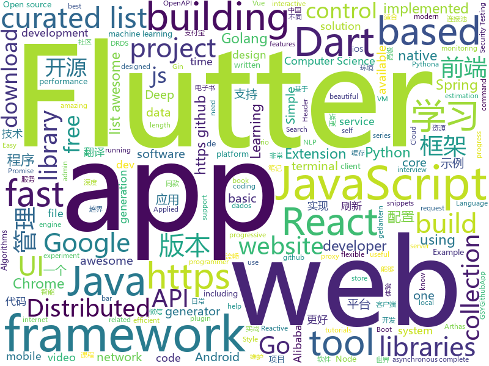

# 2018-12-04
See what the GitHub community is most excited about today.

## python
* [wtfpython-cn](https://github.com/leisurelicht/wtfpython-cn)(**270 stars today**): wtfpython的中文翻译/施工结束/ 能力有限，欢迎帮我改进翻译
* [wtfpython](https://github.com/satwikkansal/wtfpython)(**209 stars today**): A collection of surprising Python snippets and lesser-known features.
* [public-apis](https://github.com/toddmotto/public-apis)(**140 stars today**): A collective list of free APIs for use in software and web development.
* [optuna](https://github.com/pfnet/optuna)(**129 stars today**): A hyperparameter optimization framework
* [d2l-zh](https://github.com/diveintodeeplearning/d2l-zh)(**118 stars today**): 《动手学深度学习》
* [models](https://github.com/tensorflow/models)(**80 stars today**): Models and examples built with TensorFlow
* [bert](https://github.com/google-research/bert)(**84 stars today**): TensorFlow code and pre-trained models for BERT
* [lambdo](https://github.com/asavinov/lambdo)(**71 stars today**): Feature engineering and machine learning: together at last!
* [Python](https://github.com/TheAlgorithms/Python)(**54 stars today**): All Algorithms implemented in Python
* [responder](https://github.com/kennethreitz/responder)(**62 stars today**): a familiar HTTP Service Framework for Python
* [Horizon](https://github.com/facebookresearch/Horizon)(**54 stars today**): A platform for Applied Reinforcement Learning (Applied RL)
* [termtosvg](https://github.com/nbedos/termtosvg)(**54 stars today**): Record terminal sessions as SVG animations
* [DeOldify](https://github.com/jantic/DeOldify)(**49 stars today**): A Deep Learning based project for colorizing and restoring old images
* [system-design-primer](https://github.com/donnemartin/system-design-primer)(**49 stars today**): Learn how to design large-scale systems. Prep for the system design interview. Includes Anki flashcards.
* [trape](https://github.com/jofpin/trape)(**50 stars today**): People tracker on the Internet: OSINT analysis and research tool by Jose Pino
* [awesome-python](https://github.com/vinta/awesome-python)(**44 stars today**): A curated list of awesome Python frameworks, libraries, software and resources
* [face_recognition](https://github.com/ageitgey/face_recognition)(**38 stars today**): The world's simplest facial recognition api for Python and the command line
* [gandissect](https://github.com/CSAILVision/gandissect)(**44 stars today**): Pytorch-based tools for visualizing and understanding the neurons of a GAN. https://gandissect.csail.mit.edu/
* [bert-as-service](https://github.com/hanxiao/bert-as-service)(**39 stars today**): Mapping a variable-length sentence to a fixed-length vector using BERT model
* [VideoPose3D](https://github.com/facebookresearch/VideoPose3D)(**40 stars today**): Efficient 3D human pose estimation in video using 2D keypoint trajectories
* [youtube-dl](https://github.com/rg3/youtube-dl)(**37 stars today**): Command-line program to download videos from YouTube.com and other video sites
* [trixi](https://github.com/MIC-DKFZ/trixi)(**41 stars today**): Manage your machine learning experiments with trixi - modular, reproducible, high fashion. An experiment infrastructure optimized for PyTorch, but flexible enough to work for your framework and your tastes.
* [keras](https://github.com/keras-team/keras)(**34 stars today**): Deep Learning for humans
* [home-assistant](https://github.com/home-assistant/home-assistant)(**33 stars today**): 🏡Open source home automation that puts local control and privacy first
* [Python](https://github.com/geekcomputers/Python)(**36 stars today**): My Python Examples

## java
* [arthas](https://github.com/alibaba/arthas)(**228 stars today**): Alibaba Java Diagnostic Tool Arthas/Alibaba Java诊断利器Arthas
* [JavaGuide](https://github.com/Snailclimb/JavaGuide)(**153 stars today**): 【Java学习+面试指南】 一份涵盖大部分Java程序员所需要掌握的核心知识。
* [thinking-in-spring-boot-samples](https://github.com/mercyblitz/thinking-in-spring-boot-samples)(**119 stars today**): 小马哥书籍《Spring Boot 编程思想》示例工程
* [java-design-patterns](https://github.com/iluwatar/java-design-patterns)(**69 stars today**): Design patterns implemented in Java
* [litemall](https://github.com/linlinjava/litemall)(**62 stars today**): 又一个小商城。litemall = Spring Boot后端 + Vue管理员前端 + 微信小程序用户前端
* [symphony](https://github.com/b3log/symphony)(**67 stars today**): 🎶一款用 Java 实现的现代化社区（论坛/BBS/社交网络/博客）平台。https://hacpai.com
* [spring-boot](https://github.com/spring-projects/spring-boot)(**54 stars today**): Spring Boot
* [Sentinel](https://github.com/alibaba/Sentinel)(**52 stars today**): A lightweight flow-control library providing high-available protection and monitoring (高可用防护的流量管理框架)
* [Java](https://github.com/TheAlgorithms/Java)(**44 stars today**): All Algorithms implemented in Java
* [resilience4j](https://github.com/resilience4j/resilience4j)(**47 stars today**): Resilience4j is a fault tolerance library designed for Java8 and functional programming
* [interviews](https://github.com/kdn251/interviews)(**42 stars today**): Everything you need to know to get the job.
* [spring-framework](https://github.com/spring-projects/spring-framework)(**36 stars today**): Spring Framework
* [JCSprout](https://github.com/crossoverJie/JCSprout)(**33 stars today**): 👨‍🎓Java Core Sprout : basic, concurrent, algorithm
* [guava](https://github.com/google/guava)(**40 stars today**): Google core libraries for Java
* [AutoLoadCache](https://github.com/qiujiayu/AutoLoadCache)(**38 stars today**): AutoLoadCache 是基于AOP+Annotation等技术实现的高效的缓存管理解决方案，实现缓存与业务逻辑的解耦，并增加异步刷新及“拿来主义机制”，以适应高并发环境下的使用。
* [elasticsearch](https://github.com/elastic/elasticsearch)(**34 stars today**): Open Source, Distributed, RESTful Search Engine
* [spring-cloud-alibaba](https://github.com/spring-cloud-incubator/spring-cloud-alibaba)(**36 stars today**): Spring Cloud Alibaba provides a one-stop solution for application development for the distributed solutions of Alibaba middleware.
* [AppUpdate](https://github.com/azhon/AppUpdate)(**37 stars today**): 一个简单、轻量、可随意定制 的Android版本更新库🚀
* [HanLP](https://github.com/hankcs/HanLP)(**32 stars today**): 自然语言处理 中文分词 词性标注 命名实体识别 依存句法分析 新词发现 关键词短语提取 自动摘要 文本分类聚类 拼音简繁
* [apollo](https://github.com/ctripcorp/apollo)(**28 stars today**): Apollo（阿波罗）是携程框架部门研发的分布式配置中心，能够集中化管理应用不同环境、不同集群的配置，配置修改后能够实时推送到应用端，并且具备规范的权限、流程治理等特性，适用于微服务配置管理场景。
* [druid](https://github.com/alibaba/druid)(**28 stars today**): 阿里巴巴数据库事业部出品，为监控而生的数据库连接池。2018年开源中国最受欢迎开源软件评选请参与投票 https://www.oschina.net/project/top_cn_2018 阿里云DRDS(https://www.aliyun.com/product/drds )、阿里巴巴TDDL 连接池powered by Druid
* [netty](https://github.com/netty/netty)(**27 stars today**): Netty project - an event-driven asynchronous network application framework
* [SmartRefreshLayout](https://github.com/scwang90/SmartRefreshLayout)(**27 stars today**): 🔥下拉刷新、上拉加载、二级刷新、淘宝二楼、RefreshLayout、OverScroll，Android智能下拉刷新框架，支持越界回弹、越界拖动，具有极强的扩展性，集成了几十种炫酷的Header和 Footer。
* [tutorials](https://github.com/eugenp/tutorials)(**17 stars today**): The "REST With Spring" Course:
* [RxJava](https://github.com/ReactiveX/RxJava)(**23 stars today**): RxJava – Reactive Extensions for the JVM – a library for composing asynchronous and event-based programs using observable sequences for the Java VM.

## unknown
* [i-am-chinese-the-dragonfly-must-go-on](https://github.com/ithinco/i-am-chinese-the-dragonfly-must-go-on)(**684 stars today**): A response to “We are Google employees, Google must drop DragonFly”
* [CS-Notes](https://github.com/CyC2018/CS-Notes)(**365 stars today**): 📚Computer Science Learning Notes
* [kindle_free_books](https://github.com/crazyandcoder/kindle_free_books)(**166 stars today**): 免费的Kindle电子书资源，不定期更新...
* [stanford-cs-230-deep-learning](https://github.com/afshinea/stanford-cs-230-deep-learning)(**143 stars today**): VIP cheatsheets for Stanford's CS 230 Deep Learning
* [webannoyances](https://github.com/yourduskquibbles/webannoyances)(**101 stars today**): Fix and remove annoying web elements such as sticky headers, floating boxes, dickbars, social share bars and other distracting elements.
* [blog](https://github.com/yygmind/blog)(**85 stars today**): 我是木易杨，网易高级前端工程师，跟着我每周重点攻克一个前端面试重难点。接下来让我带你走进高级前端的世界，在进阶的路上，共勉！
* [google-cloud-4-words](https://github.com/gregsramblings/google-cloud-4-words)(**79 stars today**): The Google Cloud Developer's Cheat Sheet
* [awesome](https://github.com/sindresorhus/awesome)(**73 stars today**): 😎Curated list of awesome lists
* [gitignore](https://github.com/github/gitignore)(**52 stars today**): A collection of useful .gitignore templates
* [You-Dont-Know-JS](https://github.com/getify/You-Dont-Know-JS)(**63 stars today**): A book series on JavaScript. @YDKJS on twitter.
* [developer-roadmap](https://github.com/kamranahmedse/developer-roadmap)(**62 stars today**): Roadmap to becoming a web developer in 2018
* [coding-interview-university](https://github.com/jwasham/coding-interview-university)(**57 stars today**): A complete computer science study plan to become a software engineer.
* [free-programming-books](https://github.com/EbookFoundation/free-programming-books)(**53 stars today**): 📚Freely available programming books
* [ng-china-2018](https://github.com/ngChina/ng-china-2018)(**47 stars today**): ngChina 2018 conference
* [awesome-vue](https://github.com/vuejs/awesome-vue)(**44 stars today**): 🎉A curated list of awesome things related to Vue.js
* [fuzz.txt](https://github.com/Bo0oM/fuzz.txt)(**37 stars today**): Potentially dangerous files
* [nodebestpractices](https://github.com/i0natan/nodebestpractices)(**36 stars today**): The largest Node.JS best practices list (November 2018)
* [awesome-osint](https://github.com/jivoi/awesome-osint)(**33 stars today**): 😱A curated list of amazingly awesome OSINT
* [mml-book.github.io](https://github.com/mml-book/mml-book.github.io)(**29 stars today**): Companion webpage to the book "Mathematics For Machine Learning"
* [gold-miner](https://github.com/xitu/gold-miner)(**30 stars today**): 🥇掘金翻译计划，可能是世界最大最好的英译中技术社区，最懂读者和译者的翻译平台：
* [awesome-falsehood](https://github.com/kdeldycke/awesome-falsehood)(**33 stars today**): 💊Curated list of falsehoods programmers believe in.
* [project-based-learning](https://github.com/tuvtran/project-based-learning)(**31 stars today**): Curated list of project-based tutorials
* [datascience-pizza](https://github.com/leportella/datascience-pizza)(**30 stars today**): 🍕Repositório para juntar informações sobre materiais de estudo em análise de dados e áreas afins, empresas que trabalham com dados e dicionário de conceitos
* [computer-science](https://github.com/ossu/computer-science)(**31 stars today**): 🎓Path to a free self-taught education in Computer Science!
* [awesome-react](https://github.com/enaqx/awesome-react)(**29 stars today**): A collection of awesome things regarding React ecosystem.

## javascript
* [overreacted.io](https://github.com/gaearon/overreacted.io)(**574 stars today**): Personal blog by Dan Abramov.
* [programmers-introduction-to-mathematics](https://github.com/pim-book/programmers-introduction-to-mathematics)(**388 stars today**): Code for A Programmer's Introduction to Mathematics
* [learnGitBranching](https://github.com/pcottle/learnGitBranching)(**178 stars today**): An interactive git visualization to challenge and educate!
* [tabulator](https://github.com/olifolkerd/tabulator)(**152 stars today**): Interactive Tables and Data Grids for JavaScript
* [vue](https://github.com/vuejs/vue)(**126 stars today**): 🖖A progressive, incrementally-adoptable JavaScript framework for building UI on the web.
* [uBlock](https://github.com/gorhill/uBlock)(**131 stars today**): uBlock Origin - An efficient blocker for Chromium and Firefox. Fast and lean.
* [react](https://github.com/facebook/react)(**99 stars today**): A declarative, efficient, and flexible JavaScript library for building user interfaces.
* [spectrum](https://github.com/withspectrum/spectrum)(**102 stars today**): Simple, powerful online communities.
* [forgJs](https://github.com/oussamahamdaoui/forgJs)(**98 stars today**): ForgJs is a javascript lightweight object validator. Go check the Quick start section and start coding with love
* [edex-ui](https://github.com/GitSquared/edex-ui)(**98 stars today**): A science fiction terminal emulator designed for large touchscreens that runs on all major OSs.
* [omi](https://github.com/Tencent/omi)(**92 stars today**): Next generation web framework in 4kb JavaScript (Web Components + JSX + Proxy + Store + Path Updating), Easy to MVVM.
* [progress-estimator](https://github.com/bvaughn/progress-estimator)(**85 stars today**): Logs a progress bar and estimation for how long a Promise will take to complete
* [33-js-concepts](https://github.com/leonardomso/33-js-concepts)(**75 stars today**): 📜33 concepts every JavaScript developer should know.
* [create-react-app](https://github.com/facebook/create-react-app)(**68 stars today**): Set up a modern web app by running one command.
* [next.js](https://github.com/zeit/next.js)(**66 stars today**): The React Framework
* [gatsby](https://github.com/gatsbyjs/gatsby)(**60 stars today**): Build blazing fast, modern apps and websites with React
* [taro](https://github.com/NervJS/taro)(**60 stars today**): 多端统一开发框架，支持用 React 的开发方式编写一次代码，生成能运行在微信小程序/百度智能小程序/支付宝小程序、H5、React Native 等的应用。 https://taro.js.org/
* [anti-paywall](https://github.com/nextgens/anti-paywall)(**60 stars today**): A browser extension that maximizes the chances of bypassing paywalls
* [node](https://github.com/nodejs/node)(**53 stars today**): Node.js JavaScript runtime✨🐢🚀✨
* [javascript](https://github.com/airbnb/javascript)(**54 stars today**): JavaScript Style Guide
* [puppeteer](https://github.com/GoogleChrome/puppeteer)(**60 stars today**): Headless Chrome Node API
* [javascript-algorithms](https://github.com/trekhleb/javascript-algorithms)(**53 stars today**): 📝Algorithms and data structures implemented in JavaScript with explanations and links to further readings
* [30-seconds-of-code](https://github.com/30-seconds/30-seconds-of-code)(**52 stars today**): Curated collection of useful JavaScript snippets that you can understand in 30 seconds or less.
* [axios](https://github.com/axios/axios)(**56 stars today**): Promise based HTTP client for the browser and node.js
* [react-native](https://github.com/facebook/react-native)(**48 stars today**): A framework for building native apps with React.

## html
* [nginxconfig.io](https://github.com/valentinxxx/nginxconfig.io)(**209 stars today**): ⚙️NGiИX config generator generator on steroids💉
* [styleguide](https://github.com/google/styleguide)(**22 stars today**): Style guides for Google-originated open-source projects
* [AdminLTE](https://github.com/almasaeed2010/AdminLTE)(**17 stars today**): AdminLTE - Free Premium Admin control Panel Theme Based On Bootstrap 3.x
* [owasp-mstg](https://github.com/OWASP/owasp-mstg)(**19 stars today**): The Mobile Security Testing Guide (MSTG) is a comprehensive manual for mobile app security testing and reverse engineering.
* [wedding-website](https://github.com/rampatra/wedding-website)(**20 stars today**): Our Wedding Website👫
* [JavaScript30](https://github.com/wesbos/JavaScript30)(**11 stars today**): 30 Day Vanilla JS Challenge
* [NLP-progress](https://github.com/sebastianruder/NLP-progress)(**18 stars today**): Repository to track the progress in Natural Language Processing (NLP), including the datasets and the current state-of-the-art for the most common NLP tasks.
* [deeplearning_ai_books](https://github.com/fengdu78/deeplearning_ai_books)(**14 stars today**): deeplearning.ai（吴恩达老师的深度学习课程笔记及资源）
* [portainer](https://github.com/portainer/portainer)(**16 stars today**): Simple management UI for Docker
* [fastText](https://github.com/facebookresearch/fastText)(**17 stars today**): Library for fast text representation and classification.
* [Coursera-ML-AndrewNg-Notes](https://github.com/fengdu78/Coursera-ML-AndrewNg-Notes)(**13 stars today**): 吴恩达老师的机器学习课程个人笔记
* [ionic](https://github.com/ionic-team/ionic)(**12 stars today**): Build amazing native and progressive web apps with open web technologies. One app running on everything🎉
* [Spoon-Knife](https://github.com/octocat/Spoon-Knife)(****): This repo is for demonstration purposes only.
* [flutter-in-action](https://github.com/flutterchina/flutter-in-action)(**12 stars today**): 《Flutter实战》电子书
* [fonts](https://github.com/google/fonts)(**11 stars today**): Font files available from Google Fonts
* [react-redux](https://github.com/reduxjs/react-redux)(**11 stars today**): Official React bindings for Redux
* [Front-end-Developer-Interview-Questions](https://github.com/h5bp/Front-end-Developer-Interview-Questions)(**11 stars today**): A list of helpful front-end related questions you can use to interview potential candidates, test yourself or completely ignore.
* [hugo-academic](https://github.com/gcushen/hugo-academic)(**9 stars today**): The website designer for Hugo. Build and deploy a beautiful website in minutes🚀
* [openapi-generator](https://github.com/OpenAPITools/openapi-generator)(**10 stars today**): OpenAPI Generator allows generation of API client libraries (SDK generation), server stubs, documentation and configuration automatically given an OpenAPI Spec (v2, v3)
* [now-github-starter](https://github.com/zeit/now-github-starter)(****): Starter project to demonstrate a project whose pull requests get automatically deployed
* [TranslatorX](https://github.com/pingfangx/TranslatorX)(**10 stars today**): JetBrains 系列软件汉化包
* [meilix-generator](https://github.com/fossasia/meilix-generator)(**9 stars today**): WebApp for generating a custom ISO image based on Meilix http://meilix.org
* [2019.fossasia.org](https://github.com/fossasia/2019.fossasia.org)(**9 stars today**): FOSSASIA Summit 2019 https://2019.fossasia.org
* [blockchain](https://github.com/Azure-Samples/blockchain)(**8 stars today**): Azure Blockchain Content and Samples
* [coreui-free-bootstrap-admin-template](https://github.com/coreui/coreui-free-bootstrap-admin-template)(**8 stars today**): CoreUI is free bootstrap admin template

## dart
* [flutter](https://github.com/flutter/flutter)(**98 stars today**): Flutter makes it easy and fast to build beautiful mobile apps.
* [flutter_ui_challenge_planets_app](https://github.com/rvamsikrishna/flutter_ui_challenge_planets_app)(**53 stars today**): A flutter ui challenge .... building a planets app
* [awesome-flutter](https://github.com/Solido/awesome-flutter)(**48 stars today**): An awesome list that curates the best Flutter libraries, tools, tutorials, articles and more.
* [GSYGithubAppFlutter](https://github.com/CarGuo/GSYGithubAppFlutter)(**13 stars today**): 超完整的Flutter项目，功能丰富，适合学习和日常使用。GSYGithubApp系列的优势：我们目前已经拥有Flutter、Weex、ReactNative、kotlin 四个版本。 功能齐全，项目框架内技术涉及面广，完成度高，持续维护，配套文章，适合全面学习，对比参考。跨平台的开源Github客户端App，更好的体验，更丰富的功能，旨在更好的日常管理和维护个人Github，提供更好更方便的驾车体验Σ(￣。￣ﾉ)ﾉ。同款Weex版本 ： https://github.com/CarGuo/GSYGithubAppWeex 、同款React Native版本 ： https://github.com/CarGuo/GSYGithubApp 、原生 kotlin 版本 https://g…
* [plugins](https://github.com/flutter/plugins)(**10 stars today**): Plugins for Flutter, including FlutterFire, maintained by the Flutter team
* [FlutterUI](https://github.com/yumi0629/FlutterUI)(**6 stars today**): For help building amazing UI with Flutter.
* [flutter_native_map](https://github.com/xclud/flutter_native_map)(****): 
* [audioplayer](https://github.com/rxlabz/audioplayer)(****): A flutter plugin to play audio files ( ObjC/Java )
* [chromedeveditor](https://github.com/googlearchive/chromedeveditor)(****): Chrome Dev Editor is a developer tool for building apps on the Chrome platform - Chrome Apps and Web Apps, in JavaScript or Dart. (NO LONGER IN ACTIVE DEVELOPMENT)
* [sdk](https://github.com/dart-lang/sdk)(****): The Dart SDK, including the VM, dart2js, core libraries, and more.
* [FlutterExampleApps](https://github.com/iampawan/FlutterExampleApps)(****): [Example APPS] Basic Flutter apps, for flutter devs.
* [flutter_architecture_samples](https://github.com/brianegan/flutter_architecture_samples)(****): TodoMVC for Flutter
* [Flutter-UI-Kit](https://github.com/iampawan/Flutter-UI-Kit)(****): Flutter app for collection of UI in a UIKit
* [flutter-examples](https://github.com/nisrulz/flutter-examples)(****): [Examples] Simple basic isolated apps, for budding flutter devs.
* [inKino](https://github.com/roughike/inKino)(****): A multiplatform Dart movie app with 40% of code sharing between Flutter and the Web.
* [flutter-osc](https://github.com/yubo725/flutter-osc)(****): 基于Google Flutter的开源中国客户端，支持Android和iOS。
* [dio](https://github.com/flutterchina/dio)(****): A powerful Http client for Dart, which supports Interceptors, FormData, Request Cancellation, File Downloading, Timeout etc.
* [Flutter-learning](https://github.com/AweiLoveAndroid/Flutter-learning)(****): 🔥👍🌟⭐️⭐️⭐️Flutter安装和配置，Flutter开发遇到的难题，Flutter示例代码和模板，Flutter项目实战，Dart语言学习示例代码。
* [zhihu-flutter](https://github.com/HackSoul/zhihu-flutter)(****): Flutter 高仿知乎 UI，非常漂亮，也非常流畅，flutter build apk 或 flutter build ios 之后更流畅
* [hauberk](https://github.com/munificent/hauberk)(****): A web-based roguelike written in Dart.
* [angular](https://github.com/dart-lang/angular)(****): Fast and productive web framework provided by Dart
* [Flutter-Notebook](https://github.com/OpenFlutter/Flutter-Notebook)(****): 日更的FlutterDemo合集，今天你fu了吗
* [StageXL](https://github.com/bp74/StageXL)(****): A fast and universal 2D rendering engine for HTML5 and Dart.
* [dart-sass](https://github.com/sass/dart-sass)(****): The reference implementation of Sass, written in Dart.
* [rxdart](https://github.com/ReactiveX/rxdart)(****): The Reactive Extensions for Dart

## go
* [dive](https://github.com/wagoodman/dive)(**366 stars today**): A tool for exploring each layer in a docker image
* [Ethr](https://github.com/Microsoft/Ethr)(**123 stars today**): Ethr is a Network Performance Measurement Tool for TCP, UDP & HTTP.
* [skycfg](https://github.com/stripe/skycfg)(**82 stars today**): Skycfg is an extension library for the Starlark language that adds support for constructing Protocol Buffer messages.
* [wire](https://github.com/google/wire)(**76 stars today**): Compile-time Dependency Injection for Go
* [go](https://github.com/golang/go)(**67 stars today**): The Go programming language
* [kubernetes](https://github.com/kubernetes/kubernetes)(**54 stars today**): Production-Grade Container Scheduling and Management
* [cngrok](https://github.com/ssstk/cngrok)(**57 stars today**): 支付宝 红包码 收割机，frp、ngrok内网穿透服务管理平台
* [abbreviate](https://github.com/dnnrly/abbreviate)(**60 stars today**): Shorten your strings using common abbreviations
* [websocket](https://github.com/gorilla/websocket)(**58 stars today**): A WebSocket implementation for Go.
* [build-web-application-with-golang](https://github.com/astaxie/build-web-application-with-golang)(**39 stars today**): A golang ebook intro how to build a web with golang
* [awesome-go](https://github.com/avelino/awesome-go)(**42 stars today**): A curated list of awesome Go frameworks, libraries and software
* [prometheus](https://github.com/prometheus/prometheus)(**40 stars today**): The Prometheus monitoring system and time series database.
* [aminal](https://github.com/liamg/aminal)(**41 stars today**): Golang terminal emulator from scratch
* [frp](https://github.com/fatedier/frp)(**36 stars today**): A fast reverse proxy to help you expose a local server behind a NAT or firewall to the internet.
* [gin](https://github.com/gin-gonic/gin)(**37 stars today**): Gin is a HTTP web framework written in Go (Golang). It features a Martini-like API with much better performance -- up to 40 times faster. If you need smashing performance, get yourself some Gin.
* [v2ray-core](https://github.com/v2ray/v2ray-core)(**30 stars today**): A platform for building proxies to bypass network restrictions.
* [aster](https://github.com/henrylee2cn/aster)(**33 stars today**): Golang coding efficiency engine.
* [hugo](https://github.com/gohugoio/hugo)(**31 stars today**): The world’s fastest framework for building websites.
* [sso](https://github.com/buzzfeed/sso)(**31 stars today**): sso, aka S.S.Octopus, aka octoboi, is a single sign-on solution for securing internal services
* [lantern](https://github.com/getlantern/lantern)(**27 stars today**): 🔴蓝灯最新版本下载 https://github.com/getlantern/download🔴Lantern Latest Download https://github.com/getlantern/download🔴
* [jaeger](https://github.com/jaegertracing/jaeger)(**23 stars today**): CNCF Jaeger, a Distributed Tracing System
* [istio](https://github.com/istio/istio)(**22 stars today**): Connect, secure, control, and observe services.
* [etcd](https://github.com/etcd-io/etcd)(**23 stars today**): Distributed reliable key-value store for the most critical data of a distributed system
* [skaffold](https://github.com/GoogleContainerTools/skaffold)(**22 stars today**): Easy and Repeatable Kubernetes Development
* [sourcegraph](https://github.com/sourcegraph/sourcegraph)(**23 stars today**): Code search and intelligence, self-hosted and scalable

## WordCloud

