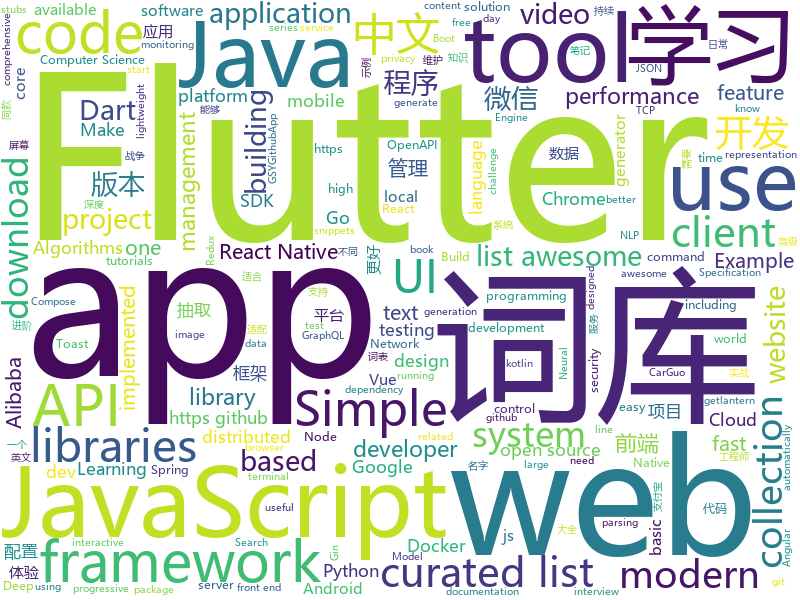

# 2018-12-06
See what the GitHub community is most excited about today.

## python
* [wtfpython](https://github.com/satwikkansal/wtfpython)(**340 stars today**): A collection of surprising Python snippets and lesser-known features.
* [wtfpython-cn](https://github.com/leisurelicht/wtfpython-cn)(**260 stars today**): wtfpython的中文翻译/施工结束/ 能力有限，欢迎帮我改进翻译
* [video-to-ascii](https://github.com/joelibaceta/video-to-ascii)(**196 stars today**): It is a simple python package to play videos in the terminal using characters as pixels
* [lianjia-scrawler](https://github.com/XuefengHuang/lianjia-scrawler)(**128 stars today**): 链家二手房租房在线数据，存量房交易服务平台数据，详细数据分析教程
* [code2vec](https://github.com/tech-srl/code2vec)(**112 stars today**): TensorFlow code for the neural network presented in the paper: "code2vec: Learning Distributed Representations of Code"
* [PySyft](https://github.com/OpenMined/PySyft)(**101 stars today**): A library for encrypted, privacy preserving deep learning
* [models](https://github.com/tensorflow/models)(**76 stars today**): Models and examples built with TensorFlow
* [bert](https://github.com/google-research/bert)(**90 stars today**): TensorFlow code and pre-trained models for BERT
* [d2l-zh](https://github.com/diveintodeeplearning/d2l-zh)(**80 stars today**): 《动手学深度学习》
* [ThunderDNS](https://github.com/fbkcs/ThunderDNS)(**75 stars today**): This tool can forward TCP traffic over DNS protocol. Non-compile clients + socks5 support.
* [awesome-python](https://github.com/vinta/awesome-python)(**68 stars today**): A curated list of awesome Python frameworks, libraries, software and resources
* [public-apis](https://github.com/toddmotto/public-apis)(**62 stars today**): A collective list of free APIs for use in software and web development.
* [keras](https://github.com/keras-team/keras)(**45 stars today**): Deep Learning for humans
* [funNLP](https://github.com/fighting41love/funNLP)(**50 stars today**): 中英文敏感词、语言检测、中外手机/电话归属地/运营商查询、名字推断性别、手机号抽取、身份证抽取、邮箱抽取、中日文人名库、中文缩写库、拆字词典、词汇情感值、停用词、反动词表、暴恐词表、繁简体转换、英文模拟中文发音、汪峰歌词生成器、职业名称词库、同义词库、反义词库、否定词库、汽车品牌&零件词库、时间抽取、连续英文切割、中文词向量大全、公司名字大全、古诗词库、IT词库、财经词库、成语词库、地名词库、历史名人词库、诗词词库、医学词库、饮食词库、法律词库、汽车词库、动物词库、中文聊天语料、中文谣言数据。
* [Python](https://github.com/TheAlgorithms/Python)(**45 stars today**): All Algorithms implemented in Python
* [poetry](https://github.com/sdispater/poetry)(**49 stars today**): Python dependency management and packaging made easy.
* [vid2vid](https://github.com/NVIDIA/vid2vid)(**44 stars today**): Pytorch implementation of our method for high-resolution (e.g. 2048x1024) photorealistic video-to-video translation.
* [uds](https://github.com/stewartmcgown/uds)(**41 stars today**): Unlimited Drive Storage by splitting binary files into base64
* [optuna](https://github.com/pfnet/optuna)(**42 stars today**): A hyperparameter optimization framework
* [system-design-primer](https://github.com/donnemartin/system-design-primer)(**38 stars today**): Learn how to design large-scale systems. Prep for the system design interview. Includes Anki flashcards.
* [TensorFlow-Course](https://github.com/open-source-for-science/TensorFlow-Course)(**36 stars today**): Simple and ready-to-use tutorials for TensorFlow
* [face_recognition](https://github.com/ageitgey/face_recognition)(**34 stars today**): The world's simplest facial recognition api for Python and the command line
* [youtube-dl](https://github.com/rg3/youtube-dl)(**34 stars today**): Command-line program to download videos from YouTube.com and other video sites
* [aclpwn.py](https://github.com/fox-it/aclpwn.py)(**36 stars today**): Active Directory ACL exploitation with BloodHound
* [home-assistant](https://github.com/home-assistant/home-assistant)(**31 stars today**): 🏡Open source home automation that puts local control and privacy first

## java
* [JavaGuide](https://github.com/Snailclimb/JavaGuide)(**153 stars today**): 【Java学习+面试指南】 一份涵盖大部分Java程序员所需要掌握的核心知识。
* [JAViewer](https://github.com/SplashCodes/JAViewer)(**96 stars today**): 更优雅的驾车体验
* [arthas](https://github.com/alibaba/arthas)(**82 stars today**): Alibaba Java Diagnostic Tool Arthas/Alibaba Java诊断利器Arthas
* [spring-boot](https://github.com/spring-projects/spring-boot)(**55 stars today**): Spring Boot
* [litemall](https://github.com/linlinjava/litemall)(**52 stars today**): 又一个小商城。litemall = Spring Boot后端 + Vue管理员前端 + 微信小程序用户前端
* [tutorials](https://github.com/eugenp/tutorials)(**36 stars today**): The "REST With Spring" Course:
* [java-design-patterns](https://github.com/iluwatar/java-design-patterns)(**51 stars today**): Design patterns implemented in Java
* [interviews](https://github.com/kdn251/interviews)(**46 stars today**): Everything you need to know to get the job.
* [symphony](https://github.com/b3log/symphony)(**45 stars today**): 🎶一款用 Java 实现的现代化社区（论坛/BBS/社交网络/博客）平台。https://hacpai.com
* [JCSprout](https://github.com/crossoverJie/JCSprout)(**41 stars today**): 👨‍🎓Java Core Sprout : basic, concurrent, algorithm
* [elasticsearch](https://github.com/elastic/elasticsearch)(**37 stars today**): Open Source, Distributed, RESTful Search Engine
* [DToast](https://github.com/Dovar66/DToast)(**41 stars today**): 同学，你的系统Toast可能需要修复一下！自定义Toast，解决系统Toast存在的问题
* [ArgusAPM](https://github.com/Qihoo360/ArgusAPM)(**38 stars today**): Powerful, comprehensive (Android) application performance management platform. 360移动性能监控平台
* [spring-framework](https://github.com/spring-projects/spring-framework)(**29 stars today**): Spring Framework
* [resilience4j](https://github.com/resilience4j/resilience4j)(**39 stars today**): Resilience4j is a fault tolerance library designed for Java8 and functional programming
* [guava](https://github.com/google/guava)(**35 stars today**): Google core libraries for Java
* [apollo](https://github.com/ctripcorp/apollo)(**32 stars today**): Apollo（阿波罗）是携程框架部门研发的分布式配置中心，能够集中化管理应用不同环境、不同集群的配置，配置修改后能够实时推送到应用端，并且具备规范的权限、流程治理等特性，适用于微服务配置管理场景。
* [incubator-dubbo](https://github.com/apache/incubator-dubbo)(**26 stars today**): Apache Dubbo (incubating) is a high-performance, java based, open source RPC framework.
* [Sentinel](https://github.com/alibaba/Sentinel)(**26 stars today**): A lightweight flow-control library providing high-available protection and monitoring (高可用防护的流量管理框架)
* [Java](https://github.com/TheAlgorithms/Java)(**26 stars today**): All Algorithms implemented in Java
* [spring-cloud-alibaba](https://github.com/spring-cloud-incubator/spring-cloud-alibaba)(**25 stars today**): Spring Cloud Alibaba provides a one-stop solution for application development for the distributed solutions of Alibaba middleware.
* [AndroidUtilCode](https://github.com/Blankj/AndroidUtilCode)(**24 stars today**): 🔥Android developers should collect the following utils(updating).
* [Todo](https://github.com/xujiaji/Todo)(**29 stars today**): 简洁清爽的Todo清单工具，MVP+okhttp3+retrofit+gson，Api来自玩Android
* [weixin-java-tools](https://github.com/Wechat-Group/weixin-java-tools)(**24 stars today**): 全能微信Java开发工具包，支持包括微信支付、开放平台、小程序、企业微信/企业号和公众号等的后端开发
* [flink](https://github.com/apache/flink)(**24 stars today**): Apache Flink

## unknown
* [awesome-styleguides](https://github.com/streamich/awesome-styleguides)(**191 stars today**): A curated list of UI styleguides —😎💄
* [CS-Notes](https://github.com/CyC2018/CS-Notes)(**156 stars today**): 📚Computer Science Learning Notes
* [awesome-dart-zh](https://github.com/chai2010/awesome-dart-zh)(**130 stars today**): Dart/Flutter资料精选中文版
* [portabletext](https://github.com/portabletext/portabletext)(**131 stars today**): Portable Text is a JSON based rich text specification for modern content editing platforms.
* [i-am-chinese-the-dragonfly-must-go-on](https://github.com/ithinco/i-am-chinese-the-dragonfly-must-go-on)(**100 stars today**): A response to “We are Google employees, Google must drop DragonFly”
* [developer-roadmap](https://github.com/kamranahmedse/developer-roadmap)(**89 stars today**): Roadmap to becoming a web developer in 2018
* [You-Dont-Know-JS](https://github.com/getify/You-Dont-Know-JS)(**79 stars today**): A book series on JavaScript. @YDKJS on twitter.
* [cnab-spec](https://github.com/deislabs/cnab-spec)(**69 stars today**): Cloud Native Application Bundle Specification
* [awesome](https://github.com/sindresorhus/awesome)(**67 stars today**): 😎Curated list of awesome lists
* [gitignore](https://github.com/github/gitignore)(**47 stars today**): A collection of useful .gitignore templates
* [coding-interview-university](https://github.com/jwasham/coding-interview-university)(**55 stars today**): A complete computer science study plan to become a software engineer.
* [vulns](https://github.com/hannob/vulns)(**62 stars today**): Named vulnerabilities and their practical impact
* [The-Economist](https://github.com/nailperry-zd/The-Economist)(**57 stars today**): The Economist 经济学人，持续更新
* [awesome-design-systems](https://github.com/alexpate/awesome-design-systems)(**52 stars today**): 💅🏻⚒A collection of awesome design systems
* [free-programming-books](https://github.com/EbookFoundation/free-programming-books)(**48 stars today**): 📚Freely available programming books
* [hackingLibrary](https://github.com/MyselfExplorer/hackingLibrary)(**43 stars today**): ‪APT,‬ ‪Cyber warfare,‬ ‪Penetration testing,‬ ‪Zero-day,Exploiting,‬ Privilege-Escalation,browser-security‪,Spyware,Malwres evade anti-virus detection,‬ ‪Rookit CYPTER,‬ ‪Antiviruses Bypassing-av,‬ ‪WORMS,Sandbox-Escape,‬ ‪Memory-injection,‬ ‪Ethical,Gray,White,RedTeam,Cheat Sheet‬...
* [blog](https://github.com/yygmind/blog)(**48 stars today**): 我是木易杨，网易高级前端工程师，跟着我每周重点攻克一个前端面试重难点。接下来让我带你走进高级前端的世界，在进阶的路上，共勉！
* [advanced-java](https://github.com/doocs/advanced-java)(**40 stars today**): 😮互联网 Java 工程师进阶知识完全扫盲
* [things-you-can-do-in-a-web-worker](https://github.com/deebloo/things-you-can-do-in-a-web-worker)(**46 stars today**): A list of available functionality and use cases for web workers
* [awesome-vue](https://github.com/vuejs/awesome-vue)(**40 stars today**): 🎉A curated list of awesome things related to Vue.js
* [project-based-learning](https://github.com/tuvtran/project-based-learning)(**38 stars today**): Curated list of project-based tutorials
* [DevopsWiki](https://github.com/Leo-G/DevopsWiki)(**40 stars today**): A wiki of Devops Tools, Tutorials and Scripts
* [awesome-actions](https://github.com/sdras/awesome-actions)(**39 stars today**): A curated list of awesome actions to use on GitHub
* [google-cloud-4-words](https://github.com/gregsramblings/google-cloud-4-words)(**39 stars today**): The Google Cloud Developer's Cheat Sheet
* [computer-science](https://github.com/ossu/computer-science)(**31 stars today**): 🎓Path to a free self-taught education in Computer Science!

## javascript
* [screenshoteer](https://github.com/vladocar/screenshoteer)(**300 stars today**): Make website screenshots and mobile emulations from the command line.
* [overreacted.io](https://github.com/gaearon/overreacted.io)(**213 stars today**): Personal blog by Dan Abramov.
* [vue](https://github.com/vuejs/vue)(**132 stars today**): 🖖A progressive, incrementally-adoptable JavaScript framework for building UI on the web.
* [programmers-introduction-to-mathematics](https://github.com/pim-book/programmers-introduction-to-mathematics)(**127 stars today**): Code for A Programmer's Introduction to Mathematics
* [30-seconds-of-code](https://github.com/30-seconds/30-seconds-of-code)(**93 stars today**): Curated collection of useful JavaScript snippets that you can understand in 30 seconds or less.
* [react](https://github.com/facebook/react)(**84 stars today**): A declarative, efficient, and flexible JavaScript library for building user interfaces.
* [forgJs](https://github.com/oussamahamdaoui/forgJs)(**90 stars today**): ForgJs is a javascript lightweight object validator. Go check the Quick start section and start coding with love
* [yorlang](https://github.com/anoniscoding/yorlang)(**81 stars today**): A programming language with yoruba language construct
* [create-react-app](https://github.com/facebook/create-react-app)(**71 stars today**): Set up a modern web app by running one command.
* [now-examples](https://github.com/zeit/now-examples)(**74 stars today**): Examples of Now deployments you can use
* [free-programming-books-zh_CN](https://github.com/justjavac/free-programming-books-zh_CN)(**67 stars today**): 📚免费的计算机编程类中文书籍，欢迎投稿
* [puppeteer](https://github.com/GoogleChrome/puppeteer)(**67 stars today**): Headless Chrome Node API
* [algorithm-visualizer](https://github.com/algorithm-visualizer/algorithm-visualizer)(**66 stars today**): 🎆Interactive Online Platform that Visualizes Algorithms from Code
* [learnGitBranching](https://github.com/pcottle/learnGitBranching)(**65 stars today**): An interactive git visualization to challenge and educate!
* [javascript](https://github.com/airbnb/javascript)(**62 stars today**): JavaScript Style Guide
* [edex-ui](https://github.com/GitSquared/edex-ui)(**67 stars today**): A science fiction terminal emulator designed for large touchscreens that runs on all major OSs.
* [axios](https://github.com/axios/axios)(**60 stars today**): Promise based HTTP client for the browser and node.js
* [taro](https://github.com/NervJS/taro)(**52 stars today**): 多端统一开发框架，支持用 React 的开发方式编写一次代码，生成能运行在微信小程序/百度智能小程序/支付宝小程序、H5、React Native 等的应用。 https://taro.js.org/
* [carlo](https://github.com/GoogleChromeLabs/carlo)(**54 stars today**): Web rendering surface for Node applications
* [storybook](https://github.com/storybooks/storybook)(**50 stars today**): Interactive UI component dev & test: React, React Native, Vue, Angular, Ember
* [react-native-typing-animation](https://github.com/watadarkstar/react-native-typing-animation)(**52 stars today**): 💬A typing animation for your React Native chat app based on simple trigonometry to create better loaders.
* [gatsby](https://github.com/gatsbyjs/gatsby)(**44 stars today**): Build blazing fast, modern apps and websites with React
* [three.js](https://github.com/mrdoob/three.js)(**41 stars today**): JavaScript 3D library.
* [33-js-concepts](https://github.com/leonardomso/33-js-concepts)(**48 stars today**): 📜33 concepts every JavaScript developer should know.
* [javascript-algorithms](https://github.com/trekhleb/javascript-algorithms)(**42 stars today**): 📝Algorithms and data structures implemented in JavaScript with explanations and links to further readings

## html
* [flutter-in-action](https://github.com/flutterchina/flutter-in-action)(**72 stars today**): 《Flutter实战》电子书
* [react-redux](https://github.com/reduxjs/react-redux)(**69 stars today**): Official React bindings for Redux
* [nginxconfig.io](https://github.com/valentinxxx/nginxconfig.io)(**59 stars today**): ⚙️NGiИX config generator generator on steroids💉
* [wedding-website](https://github.com/rampatra/wedding-website)(**33 stars today**): Our Wedding Website👫
* [javascript-tutorial-en](https://github.com/iliakan/javascript-tutorial-en)(**22 stars today**): Modern JavaScript Tutorial
* [immutablewebapps.github.io](https://github.com/ImmutableWebApps/immutablewebapps.github.io)(**24 stars today**): Public website: immutablewebapps.org
* [styleguide](https://github.com/google/styleguide)(**19 stars today**): Style guides for Google-originated open-source projects
* [Coursera-ML-AndrewNg-Notes](https://github.com/fengdu78/Coursera-ML-AndrewNg-Notes)(**18 stars today**): 吴恩达老师的机器学习课程个人笔记
* [Spoon-Knife](https://github.com/octocat/Spoon-Knife)(****): This repo is for demonstration purposes only.
* [JavaScript30](https://github.com/wesbos/JavaScript30)(**12 stars today**): 30 Day Vanilla JS Challenge
* [fastText](https://github.com/facebookresearch/fastText)(**16 stars today**): Library for fast text representation and classification.
* [ionic](https://github.com/ionic-team/ionic)(**12 stars today**): Build amazing native and progressive web apps with open web technologies. One app running on everything🎉
* [try_git](https://github.com/windyzj/try_git)(****): 
* [Front-end-Developer-Interview-Questions](https://github.com/h5bp/Front-end-Developer-Interview-Questions)(**13 stars today**): A list of helpful front-end related questions you can use to interview potential candidates, test yourself or completely ignore.
* [portainer](https://github.com/portainer/portainer)(**13 stars today**): Simple management UI for Docker
* [swagger-codegen](https://github.com/swagger-api/swagger-codegen)(**10 stars today**): swagger-codegen contains a template-driven engine to generate documentation, API clients and server stubs in different languages by parsing your OpenAPI / Swagger definition.
* [NLP-progress](https://github.com/sebastianruder/NLP-progress)(**9 stars today**): Repository to track the progress in Natural Language Processing (NLP), including the datasets and the current state-of-the-art for the most common NLP tasks.
* [now-github-starter](https://github.com/zeit/now-github-starter)(****): Starter project to demonstrate a project whose pull requests get automatically deployed
* [redux-starter-kit](https://github.com/reduxjs/redux-starter-kit)(**10 stars today**): A simple set of tools to make using Redux easier
* [patchwork](https://github.com/jlord/patchwork)(****): All the Git-it Workshop completers!
* [owasp-mstg](https://github.com/OWASP/owasp-mstg)(**8 stars today**): The Mobile Security Testing Guide (MSTG) is a comprehensive manual for mobile app security testing and reverse engineering.
* [nndl.github.io](https://github.com/nndl/nndl.github.io)(**8 stars today**): 《神经网络与深度学习》 Neural Network and Deep Learning
* [blockchain](https://github.com/Azure-Samples/blockchain)(**8 stars today**): Azure Blockchain Content and Samples
* [foundation-sites](https://github.com/zurb/foundation-sites)(**7 stars today**): The most advanced responsive front-end framework in the world. Quickly create prototypes and production code for sites that work on any kind of device.
* [openapi-generator](https://github.com/OpenAPITools/openapi-generator)(**5 stars today**): OpenAPI Generator allows generation of API client libraries (SDK generation), server stubs, documentation and configuration automatically given an OpenAPI Spec (v2, v3)

## dart
* [flutter](https://github.com/flutter/flutter)(**861 stars today**): Flutter makes it easy and fast to build beautiful mobile apps.
* [awesome-flutter](https://github.com/Solido/awesome-flutter)(**119 stars today**): An awesome list that curates the best Flutter libraries, tools, tutorials, articles and more.
* [Flare-Flutter](https://github.com/2d-inc/Flare-Flutter)(**103 stars today**): 
* [plugins](https://github.com/flutter/plugins)(**59 stars today**): Plugins for Flutter, including FlutterFire, maintained by the Flutter team
* [GSYGithubAppFlutter](https://github.com/CarGuo/GSYGithubAppFlutter)(**59 stars today**): 超完整的Flutter项目，功能丰富，适合学习和日常使用。GSYGithubApp系列的优势：我们目前已经拥有Flutter、Weex、ReactNative、kotlin 四个版本。 功能齐全，项目框架内技术涉及面广，完成度高，持续维护，配套文章，适合全面学习，对比参考。跨平台的开源Github客户端App，更好的体验，更丰富的功能，旨在更好的日常管理和维护个人Github，提供更好更方便的驾车体验Σ(￣。￣ﾉ)ﾉ。同款Weex版本 ： https://github.com/CarGuo/GSYGithubAppWeex 、同款React Native版本 ： https://github.com/CarGuo/GSYGithubApp 、原生 kotlin 版本 https://g…
* [sdk](https://github.com/dart-lang/sdk)(**27 stars today**): The Dart SDK, including the VM, dart2js, core libraries, and more.
* [Flutter-learning](https://github.com/AweiLoveAndroid/Flutter-learning)(**24 stars today**): 🔥👍🌟⭐️⭐️⭐️Flutter安装和配置，Flutter开发遇到的难题，Flutter示例代码和模板，Flutter项目实战，Dart语言学习示例代码。
* [Flutter-UI-Kit](https://github.com/iampawan/Flutter-UI-Kit)(**16 stars today**): Flutter app for collection of UI in a UIKit
* [head-first-dart-book](https://github.com/chai2010/head-first-dart-book)(**15 stars today**): 📚Dart学习笔记(在战争中学习战争)(开发中...)
* [RealRichText](https://github.com/bytedance/RealRichText)(**11 stars today**): A Tricky Solution for Implementing Inline-Image-In-Text Feature in Flutter.
* [flutter_ui_challenge_planets_app](https://github.com/rvamsikrishna/flutter_ui_challenge_planets_app)(**8 stars today**): A flutter ui challenge .... building a planets app
* [graphql-flutter](https://github.com/zino-app/graphql-flutter)(**9 stars today**): A GraphQL client for Flutter, bringing all the features from a modern GraphQL client to one easy to use package.
* [flutter_ScreenUtil](https://github.com/OpenFlutter/flutter_ScreenUtil)(**7 stars today**): flutter 屏幕适配 ，字体适配，获取屏幕信息
* [fluwx](https://github.com/OpenFlutter/fluwx)(**6 stars today**): Flutter版微信SDK.WeChat SDK for flutter.
* [scoped_model](https://github.com/brianegan/scoped_model)(**5 stars today**): A Widget that passes a Reactive Model to all of it's children
* [FlutterPlayground](https://github.com/ibhavikmakwana/FlutterPlayground)(**5 stars today**): Playground app for Flutter
* [dart-scissors](https://github.com/google/dart-scissors)(****): sCiSSors: smarter resources for Angular(1,2) apps: CSS pruner & bidirectionalizer, Sass runner, image optimizer, locale permutations
* [grinder.dart](https://github.com/google/grinder.dart)(****): Dart workflows, automated.
* [flutter_google_places](https://github.com/lejard-h/flutter_google_places)(****): 
* [json_serializable](https://github.com/dart-lang/json_serializable)(****): Generates utilities to aid in serializing to/from JSON.
* [chromedeveditor](https://github.com/googlearchive/chromedeveditor)(****): Chrome Dev Editor is a developer tool for building apps on the Chrome platform - Chrome Apps and Web Apps, in JavaScript or Dart. (NO LONGER IN ACTIVE DEVELOPMENT)
* [FlutterExampleApps](https://github.com/iampawan/FlutterExampleApps)(****): [Example APPS] Basic Flutter apps, for flutter devs.
* [flutter_architecture_samples](https://github.com/brianegan/flutter_architecture_samples)(****): TodoMVC for Flutter
* [flutter-examples](https://github.com/nisrulz/flutter-examples)(****): [Examples] Simple basic isolated apps, for budding flutter devs.
* [inKino](https://github.com/roughike/inKino)(****): A multiplatform Dart movie app with 40% of code sharing between Flutter and the Web.

## go
* [Ethr](https://github.com/Microsoft/Ethr)(**432 stars today**): Ethr is a Network Performance Measurement Tool for TCP, UDP & HTTP.
* [crossplane](https://github.com/crossplaneio/crossplane)(**285 stars today**): An Open Source Multicloud Control Plane
* [dive](https://github.com/wagoodman/dive)(**206 stars today**): A tool for exploring each layer in a docker image
* [micro-s3-grpc](https://github.com/lxlxw/micro-s3-grpc)(**117 stars today**): This project is an upload and download micro service of Amazon S3 and KS3.
* [sourcegraph](https://github.com/sourcegraph/sourcegraph)(**120 stars today**): Code search and intelligence, self-hosted and scalable
* [compose-on-kubernetes](https://github.com/docker/compose-on-kubernetes)(**112 stars today**): Deploy applications described in Compose onto Kubernetes clusters
* [kubernetes](https://github.com/kubernetes/kubernetes)(**97 stars today**): Production-Grade Container Scheduling and Management
* [sops](https://github.com/mozilla/sops)(**76 stars today**): Secrets management stinks, use some sops!
* [go](https://github.com/golang/go)(**59 stars today**): The Go programming language
* [duffle](https://github.com/deislabs/duffle)(**56 stars today**): CNAB installer
* [cngrok](https://github.com/ssstk/cngrok)(**42 stars today**): 支付宝 红包码 收割机，frp、ngrok内网穿透服务管理平台
* [gin](https://github.com/gin-gonic/gin)(**43 stars today**): Gin is a HTTP web framework written in Go (Golang). It features a Martini-like API with much better performance -- up to 40 times faster. If you need smashing performance, get yourself some Gin.
* [go-sniffer](https://github.com/40t/go-sniffer)(**42 stars today**): 🔎Sniffing and parsing mysql,redis,http,mongodb etc protocol. 抓包截取项目中的数据库请求并解析成相应的语句。
* [frp](https://github.com/fatedier/frp)(**40 stars today**): A fast reverse proxy to help you expose a local server behind a NAT or firewall to the internet.
* [awesome-go](https://github.com/avelino/awesome-go)(**41 stars today**): A curated list of awesome Go frameworks, libraries and software
* [wire](https://github.com/google/wire)(**39 stars today**): Compile-time Dependency Injection for Go
* [pipelines](https://github.com/kubeflow/pipelines)(**34 stars today**): Machine Learning Pipelines for Kubeflow
* [kind](https://github.com/kubernetes-sigs/kind)(**35 stars today**): Kubernetes IN Docker - local clusters for testing Kubernetes
* [hugo](https://github.com/gohugoio/hugo)(**34 stars today**): The world’s fastest framework for building websites.
* [app](https://github.com/docker/app)(**32 stars today**): Make your Docker Compose applications reusable, and share them on Docker Hub
* [traefik](https://github.com/containous/traefik)(**32 stars today**): The Cloud Native Edge Router
* [vault](https://github.com/hashicorp/vault)(**31 stars today**): A tool for secrets management, encryption as a service, and privileged access management
* [etcd](https://github.com/etcd-io/etcd)(**30 stars today**): Distributed reliable key-value store for the most critical data of a distributed system
* [lantern](https://github.com/getlantern/lantern)(**30 stars today**): 🔴蓝灯最新版本下载 https://github.com/getlantern/download🔴Lantern Latest Download https://github.com/getlantern/download🔴
* [prometheus](https://github.com/prometheus/prometheus)(**27 stars today**): The Prometheus monitoring system and time series database.

## WordCloud

