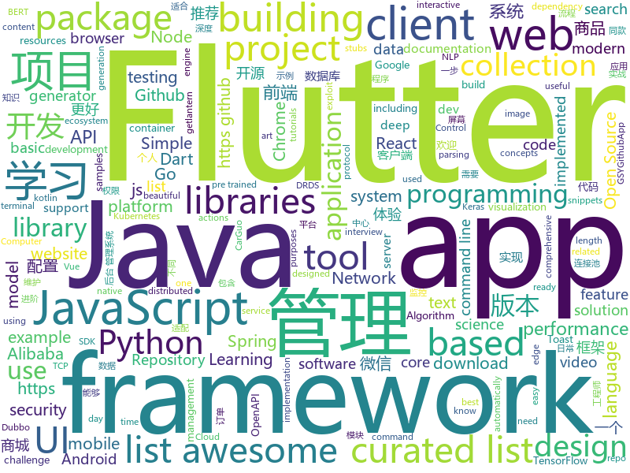

# 2018-12-07
See what the GitHub community is most excited about today.

## python
* [wtfpython](https://github.com/satwikkansal/wtfpython)(**289 stars today**): A collection of surprising Python snippets and lesser-known features.
* [wtfpython-cn](https://github.com/leisurelicht/wtfpython-cn)(**240 stars today**): wtfpython的中文翻译/施工结束/ 能力有限，欢迎帮我改进翻译
* [video-to-ascii](https://github.com/joelibaceta/video-to-ascii)(**129 stars today**): It is a simple python package to play videos in the terminal using characters as pixels
* [ranking](https://github.com/tensorflow/ranking)(**126 stars today**): Learning to Rank in TensorFlow
* [poetry](https://github.com/sdispater/poetry)(**116 stars today**): Python dependency management and packaging made easy.
* [TensorFlow-Course](https://github.com/open-source-for-science/TensorFlow-Course)(**95 stars today**): Simple and ready-to-use tutorials for TensorFlow
* [models](https://github.com/tensorflow/models)(**65 stars today**): Models and examples built with TensorFlow
* [HelloGitHub](https://github.com/521xueweihan/HelloGitHub)(**83 stars today**): GitHub 上好玩、容易上手的项目，帮你找到编程的乐趣。欢迎推荐、自荐项目，让更多人知道你的项目⭐️
* [bert](https://github.com/google-research/bert)(**72 stars today**): TensorFlow code and pre-trained models for BERT
* [lianjia-scrawler](https://github.com/XuefengHuang/lianjia-scrawler)(**76 stars today**): 链家二手房租房在线数据，存量房交易服务平台数据，详细数据分析教程
* [system-design-primer](https://github.com/donnemartin/system-design-primer)(**69 stars today**): Learn how to design large-scale systems. Prep for the system design interview. Includes Anki flashcards.
* [Python](https://github.com/TheAlgorithms/Python)(**57 stars today**): All Algorithms implemented in Python
* [bert-as-service](https://github.com/hanxiao/bert-as-service)(**58 stars today**): Mapping a variable-length sentence to a fixed-length vector using BERT model
* [keras](https://github.com/keras-team/keras)(**44 stars today**): Deep Learning for humans
* [awesome-python](https://github.com/vinta/awesome-python)(**51 stars today**): A curated list of awesome Python frameworks, libraries, software and resources
* [d2l-zh](https://github.com/diveintodeeplearning/d2l-zh)(**47 stars today**): 《动手学深度学习》
* [Python](https://github.com/geekcomputers/Python)(**48 stars today**): My Python Examples
* [ThunderDNS](https://github.com/fbkcs/ThunderDNS)(**51 stars today**): This tool can forward TCP traffic over DNS protocol. Non-compile clients + socks5 support.
* [image-super-resolution](https://github.com/idealo/image-super-resolution)(**52 stars today**): Keras implementation of the Residual Dense Network for super scaling images.
* [youtube-dl](https://github.com/rg3/youtube-dl)(**47 stars today**): Command-line program to download videos from YouTube.com and other video sites
* [public-apis](https://github.com/toddmotto/public-apis)(**42 stars today**): A collective list of free APIs for use in software and web development.
* [awesome-algorithm](https://github.com/apachecn/awesome-algorithm)(**37 stars today**): Leetcode 题解 (跟随思路一步一步撸出代码) 及经典算法实现
* [django](https://github.com/django/django)(**31 stars today**): The Web framework for perfectionists with deadlines.
* [face_recognition](https://github.com/ageitgey/face_recognition)(**31 stars today**): The world's simplest facial recognition api for Python and the command line
* [cpython](https://github.com/python/cpython)(**29 stars today**): The Python programming language

## java
* [JAViewer](https://github.com/SplashCodes/JAViewer)(**301 stars today**): 更优雅的驾车体验
* [JavaGuide](https://github.com/Snailclimb/JavaGuide)(**159 stars today**): 【Java学习+面试指南】 一份涵盖大部分Java程序员所需要掌握的核心知识。
* [litemall](https://github.com/linlinjava/litemall)(**78 stars today**): 又一个小商城。litemall = Spring Boot后端 + Vue管理员前端 + 微信小程序用户前端
* [arthas](https://github.com/alibaba/arthas)(**77 stars today**): Alibaba Java Diagnostic Tool Arthas/Alibaba Java诊断利器Arthas
* [spring-boot](https://github.com/spring-projects/spring-boot)(**62 stars today**): Spring Boot
* [ArgusAPM](https://github.com/Qihoo360/ArgusAPM)(**66 stars today**): Powerful, comprehensive (Android) application performance management platform. 360移动性能监控平台
* [java-design-patterns](https://github.com/iluwatar/java-design-patterns)(**57 stars today**): Design patterns implemented in Java
* [tutorials](https://github.com/eugenp/tutorials)(**48 stars today**): The "REST With Spring" Course:
* [interviews](https://github.com/kdn251/interviews)(**58 stars today**): Everything you need to know to get the job.
* [mall](https://github.com/macrozheng/mall)(**49 stars today**): mall项目是一套电商系统，包括前台商城系统及后台管理系统，基于SpringBoot+MyBatis实现。 前台商城系统包含首页门户、商品推荐、商品搜索、商品展示、购物车、订单流程、会员中心、客户服务、帮助中心等模块。 后台管理系统包含商品管理、订单管理、会员管理、促销管理、运营管理、内容管理、统计报表、财务管理、权限管理、设置等模块。
* [JCSprout](https://github.com/crossoverJie/JCSprout)(**52 stars today**): 👨‍🎓Java Core Sprout : basic, concurrent, algorithm
* [symphony](https://github.com/b3log/symphony)(**52 stars today**): 🎶一款用 Java 实现的现代化社区（论坛/BBS/社交网络/博客）平台。https://hacpai.com
* [apollo](https://github.com/ctripcorp/apollo)(**39 stars today**): Apollo（阿波罗）是携程框架部门研发的分布式配置中心，能够集中化管理应用不同环境、不同集群的配置，配置修改后能够实时推送到应用端，并且具备规范的权限、流程治理等特性，适用于微服务配置管理场景。
* [spring-cloud-alibaba](https://github.com/spring-cloud-incubator/spring-cloud-alibaba)(**38 stars today**): Spring Cloud Alibaba provides a one-stop solution for application development for the distributed solutions of Alibaba middleware.
* [incubator-dubbo](https://github.com/apache/incubator-dubbo)(**29 stars today**): Apache Dubbo (incubating) is a high-performance, java based, open source RPC framework.
* [elasticsearch](https://github.com/elastic/elasticsearch)(**33 stars today**): Open Source, Distributed, RESTful Search Engine
* [Java](https://github.com/TheAlgorithms/Java)(**31 stars today**): All Algorithms implemented in Java
* [SugarAdapter](https://github.com/zhihu/SugarAdapter)(**34 stars today**): Make RecyclerView.Adapter Great Again!
* [spring-framework](https://github.com/spring-projects/spring-framework)(**26 stars today**): Spring Framework
* [guava](https://github.com/google/guava)(**28 stars today**): Google core libraries for Java
* [DToast](https://github.com/Dovar66/DToast)(**31 stars today**): 同学，你的系统Toast可能需要修复一下！自定义Toast，解决系统Toast存在的问题
* [resilience4j](https://github.com/resilience4j/resilience4j)(**30 stars today**): Resilience4j is a fault tolerance library designed for Java8 and functional programming
* [weixin-java-tools](https://github.com/Wechat-Group/weixin-java-tools)(**25 stars today**): 全能微信Java开发工具包，支持包括微信支付、开放平台、小程序、企业微信/企业号和公众号等的后端开发
* [okhttp](https://github.com/square/okhttp)(**26 stars today**): An HTTP+HTTP/2 client for Android and Java applications.
* [druid](https://github.com/alibaba/druid)(**22 stars today**): 阿里巴巴数据库事业部出品，为监控而生的数据库连接池。2018年开源中国最受欢迎开源软件评选请参与投票 https://www.oschina.net/project/top_cn_2018 阿里云DRDS(https://www.aliyun.com/product/drds )、阿里巴巴TDDL 连接池powered by Druid

## unknown
* [awesome-styleguides](https://github.com/streamich/awesome-styleguides)(**215 stars today**): A curated list of UI styleguides —😎💄
* [portabletext](https://github.com/portabletext/portabletext)(**179 stars today**): Portable Text is a JSON based rich text specification for modern content editing platforms.
* [CS-Notes](https://github.com/CyC2018/CS-Notes)(**133 stars today**): 📚Computer Science Learning Notes
* [MSEdge](https://github.com/MicrosoftEdge/MSEdge)(**131 stars today**): Microsoft Edge
* [advanced-java](https://github.com/doocs/advanced-java)(**101 stars today**): 😮互联网 Java 工程师进阶知识完全扫盲
* [Windows-RCE-exploits](https://github.com/smgorelik/Windows-RCE-exploits)(**98 stars today**): The exploit samples database is a repository for **RCE** (remote code execution) exploits and Proof-of-Concepts for **WINDOWS**, the samples are uploaded for education purposes for red and blue teams.
* [awesome](https://github.com/sindresorhus/awesome)(**97 stars today**): 😎Curated list of awesome lists
* [blog](https://github.com/yygmind/blog)(**83 stars today**): 我是木易杨，网易高级前端工程师，跟着我每周重点攻克一个前端面试重难点。接下来让我带你走进高级前端的世界，在进阶的路上，共勉！
* [vulns](https://github.com/hannob/vulns)(**83 stars today**): Named vulnerabilities and their practical impact
* [You-Dont-Know-JS](https://github.com/getify/You-Dont-Know-JS)(**69 stars today**): A book series on JavaScript. @YDKJS on twitter.
* [gitignore](https://github.com/github/gitignore)(**45 stars today**): A collection of useful .gitignore templates
* [coding-interview-university](https://github.com/jwasham/coding-interview-university)(**50 stars today**): A complete computer science study plan to become a software engineer.
* [gitme](https://github.com/flutterchina/gitme)(**60 stars today**): Flutter开发的一款Github客户端。 A Github client APP developed with Flutter, and It both supports Android and iOS.
* [free-programming-books](https://github.com/EbookFoundation/free-programming-books)(**49 stars today**): 📚Freely available programming books
* [awesome-dart-zh](https://github.com/chai2010/awesome-dart-zh)(**53 stars today**): Dart/Flutter资料精选中文版
* [awesome-taro](https://github.com/NervJS/awesome-taro)(**43 stars today**): 多端统一开发框架 Taro 优秀学习资源汇总
* [awesome-vue](https://github.com/vuejs/awesome-vue)(**36 stars today**): 🎉A curated list of awesome things related to Vue.js
* [project-based-learning](https://github.com/tuvtran/project-based-learning)(**35 stars today**): Curated list of project-based tutorials
* [awesome-model-compression-and-acceleration](https://github.com/sun254/awesome-model-compression-and-acceleration)(**31 stars today**): a list of awesome papers on deep model ompression and acceleration
* [hackingLibrary](https://github.com/MyselfExplorer/hackingLibrary)(**29 stars today**): ‪APT,‬ ‪Cyber warfare,‬ ‪Penetration testing,‬ ‪Zero-day,Exploiting,‬ Privilege-Escalation,browser-security‪,Spyware,Malwres evade anti-virus detection,‬ ‪Rookit CYPTER,‬ ‪Antiviruses Bypassing-av,‬ ‪WORMS,Sandbox-Escape,‬ ‪Memory-injection,‬ ‪Ethical,Gray,White,RedTeam,Cheat Sheet‬...
* [package-maintenance](https://github.com/nodejs/package-maintenance)(**27 stars today**): Repository for work for discussion of helping with maintenance of key packages in the ecosystem.
* [awesome-actions](https://github.com/sdras/awesome-actions)(**30 stars today**): A curated list of awesome actions to use on GitHub
* [i-am-chinese-the-dragonfly-must-go-on](https://github.com/ithinco/i-am-chinese-the-dragonfly-must-go-on)(**30 stars today**): A response to “We are Google employees, Google must drop DragonFly”
* [awesome-dubbo](https://github.com/dubbo/awesome-dubbo)(**27 stars today**): Dubbo resources collection
* [nodebestpractices](https://github.com/i0natan/nodebestpractices)(**25 stars today**): The largest Node.JS best practices list (November 2018)

## javascript
* [ncc](https://github.com/zeit/ncc)(**275 stars today**): Node.js Compiler Collection
* [screenshoteer](https://github.com/vladocar/screenshoteer)(**182 stars today**): Make website screenshots and mobile emulations from the command line.
* [vue](https://github.com/vuejs/vue)(**160 stars today**): 🖖A progressive, incrementally-adoptable JavaScript framework for building UI on the web.
* [chrome-aws-lambda](https://github.com/alixaxel/chrome-aws-lambda)(**151 stars today**): Chromium Binary for AWS Lambda
* [overreacted.io](https://github.com/gaearon/overreacted.io)(**102 stars today**): Personal blog by Dan Abramov.
* [react](https://github.com/facebook/react)(**92 stars today**): A declarative, efficient, and flexible JavaScript library for building user interfaces.
* [yorlang](https://github.com/anoniscoding/yorlang)(**82 stars today**): A programming language with yoruba language construct
* [30-seconds-of-code](https://github.com/30-seconds/30-seconds-of-code)(**78 stars today**): Curated collection of useful JavaScript snippets that you can understand in 30 seconds or less.
* [slate](https://github.com/lord/slate)(**72 stars today**): Beautiful static documentation for your API
* [now-examples](https://github.com/zeit/now-examples)(**73 stars today**): Examples of Now deployments you can use
* [free-programming-books-zh_CN](https://github.com/justjavac/free-programming-books-zh_CN)(**67 stars today**): 📚免费的计算机编程类中文书籍，欢迎投稿
* [33-js-concepts](https://github.com/leonardomso/33-js-concepts)(**66 stars today**): 📜33 concepts every JavaScript developer should know.
* [puppeteer](https://github.com/GoogleChrome/puppeteer)(**63 stars today**): Headless Chrome Node API
* [rats-search](https://github.com/DEgITx/rats-search)(**61 stars today**): BitTorrent P2P multi-platform search engine for Desktop and Web servers with integrated torrent client.
* [three.js](https://github.com/mrdoob/three.js)(**57 stars today**): JavaScript 3D library.
* [edex-ui](https://github.com/GitSquared/edex-ui)(**60 stars today**): A science fiction terminal emulator designed for large touchscreens that runs on all major OSs.
* [next.js](https://github.com/zeit/next.js)(**49 stars today**): The React Framework
* [tensorspace](https://github.com/tensorspace-team/tensorspace)(**51 stars today**): Neural network 3D visualization framework, build interactive and intuitive model in browsers, support pre-trained deep learning models from TensorFlow, Keras, TensorFlow.js
* [create-react-app](https://github.com/facebook/create-react-app)(**42 stars today**): Set up a modern web app by running one command.
* [d3](https://github.com/d3/d3)(**46 stars today**): Bring data to life with SVG, Canvas and HTML.📊📈🎉
* [programmers-introduction-to-mathematics](https://github.com/pim-book/programmers-introduction-to-mathematics)(**48 stars today**): Code for A Programmer's Introduction to Mathematics
* [react-native](https://github.com/facebook/react-native)(**45 stars today**): A framework for building native apps with React.
* [learnGitBranching](https://github.com/pcottle/learnGitBranching)(**47 stars today**): An interactive git visualization to challenge and educate!
* [axios](https://github.com/axios/axios)(**46 stars today**): Promise based HTTP client for the browser and node.js
* [node](https://github.com/nodejs/node)(**44 stars today**): Node.js JavaScript runtime✨🐢🚀✨

## html
* [design-blocks](https://github.com/froala/design-blocks)(**83 stars today**): A set of 170+ Bootstrap based design blocks ready to be used to create clean modern websites.
* [flutter-in-action](https://github.com/flutterchina/flutter-in-action)(**52 stars today**): 《Flutter实战》电子书
* [nginxconfig.io](https://github.com/valentinxxx/nginxconfig.io)(**40 stars today**): ⚙️NGiИX config generator generator on steroids💉
* [react-redux](https://github.com/reduxjs/react-redux)(**37 stars today**): Official React bindings for Redux
* [Coursera-ML-AndrewNg-Notes](https://github.com/fengdu78/Coursera-ML-AndrewNg-Notes)(**25 stars today**): 吴恩达老师的机器学习课程个人笔记
* [NLP-progress](https://github.com/sebastianruder/NLP-progress)(**22 stars today**): Repository to track the progress in Natural Language Processing (NLP), including the datasets and the current state-of-the-art for the most common NLP tasks.
* [blockchain](https://github.com/Azure-Samples/blockchain)(**22 stars today**): Azure Blockchain Content and Samples
* [styleguide](https://github.com/google/styleguide)(**20 stars today**): Style guides for Google-originated open-source projects
* [wedding-website](https://github.com/rampatra/wedding-website)(**22 stars today**): Our Wedding Website👫
* [fastText](https://github.com/facebookresearch/fastText)(**18 stars today**): Library for fast text representation and classification.
* [swagger-codegen](https://github.com/swagger-api/swagger-codegen)(**14 stars today**): swagger-codegen contains a template-driven engine to generate documentation, API clients and server stubs in different languages by parsing your OpenAPI / Swagger definition.
* [JavaScript30](https://github.com/wesbos/JavaScript30)(**7 stars today**): 30 Day Vanilla JS Challenge
* [awesome-creative-coding](https://github.com/terkelg/awesome-creative-coding)(**13 stars today**): 🎨Creative Coding: Generative Art, Data visualization, Interaction Design, Resources.
* [openapi-generator](https://github.com/OpenAPITools/openapi-generator)(**13 stars today**): OpenAPI Generator allows generation of API client libraries (SDK generation), server stubs, documentation and configuration automatically given an OpenAPI Spec (v2, v3)
* [Front-end-Developer-Interview-Questions](https://github.com/h5bp/Front-end-Developer-Interview-Questions)(**12 stars today**): A list of helpful front-end related questions you can use to interview potential candidates, test yourself or completely ignore.
* [Spoon-Knife](https://github.com/octocat/Spoon-Knife)(****): This repo is for demonstration purposes only.
* [owasp-mstg](https://github.com/OWASP/owasp-mstg)(**11 stars today**): The Mobile Security Testing Guide (MSTG) is a comprehensive manual for mobile app security testing and reverse engineering.
* [nndl.github.io](https://github.com/nndl/nndl.github.io)(**11 stars today**): 《神经网络与深度学习》 Neural Network and Deep Learning
* [learning-area](https://github.com/mdn/learning-area)(**5 stars today**): Github repo for the MDN Learning Area.
* [portainer](https://github.com/portainer/portainer)(**9 stars today**): Simple management UI for Docker
* [proposal-optional-chaining](https://github.com/tc39/proposal-optional-chaining)(**9 stars today**): 
* [now-github-starter](https://github.com/zeit/now-github-starter)(****): Starter project to demonstrate a project whose pull requests get automatically deployed
* [quickstart-js](https://github.com/firebase/quickstart-js)(**6 stars today**): Firebase Quickstart Samples for Web
* [javascript-tutorial-en](https://github.com/iliakan/javascript-tutorial-en)(**7 stars today**): Modern JavaScript Tutorial
* [GTFOBins.github.io](https://github.com/GTFOBins/GTFOBins.github.io)(**8 stars today**): Curated list of Unix binaries that can be exploited to bypass system security restrictions

## dart
* [flutter](https://github.com/flutter/flutter)(**728 stars today**): Flutter makes it easy and fast to build beautiful mobile apps.
* [awesome-flutter](https://github.com/Solido/awesome-flutter)(**108 stars today**): An awesome list that curates the best Flutter libraries, tools, tutorials, articles and more.
* [Flare-Flutter](https://github.com/2d-inc/Flare-Flutter)(**42 stars today**): 
* [GSYGithubAppFlutter](https://github.com/CarGuo/GSYGithubAppFlutter)(**41 stars today**): 超完整的Flutter项目，功能丰富，适合学习和日常使用。GSYGithubApp系列的优势：我们目前已经拥有Flutter、Weex、ReactNative、kotlin 四个版本。 功能齐全，项目框架内技术涉及面广，完成度高，持续维护，配套文章，适合全面学习，对比参考。跨平台的开源Github客户端App，更好的体验，更丰富的功能，旨在更好的日常管理和维护个人Github，提供更好更方便的驾车体验Σ(￣。￣ﾉ)ﾉ。同款Weex版本 ： https://github.com/CarGuo/GSYGithubAppWeex 、同款React Native版本 ： https://github.com/CarGuo/GSYGithubApp 、原生 kotlin 版本 https://g…
* [FlutterUI](https://github.com/yumi0629/FlutterUI)(**40 stars today**): For help building amazing UI with Flutter.
* [RealRichText](https://github.com/bytedance/RealRichText)(**37 stars today**): A Tricky Solution for Implementing Inline-Image-In-Text Feature in Flutter.
* [plugins](https://github.com/flutter/plugins)(**34 stars today**): Plugins for Flutter, including FlutterFire, maintained by the Flutter team
* [samples](https://github.com/flutter/samples)(**25 stars today**): A collection of Flutter examples and demos.
* [Flutter-UI-Kit](https://github.com/iampawan/Flutter-UI-Kit)(**18 stars today**): Flutter app for collection of UI in a UIKit
* [Flutter-learning](https://github.com/AweiLoveAndroid/Flutter-learning)(**12 stars today**): 🔥👍🌟⭐️⭐️⭐️Flutter安装和配置，Flutter开发遇到的难题，Flutter示例代码和模板，Flutter项目实战，Dart语言学习示例代码。
* [website](https://github.com/flutter/website)(**9 stars today**): Flutter web site
* [flutter_ui_challenge_planets_app](https://github.com/rvamsikrishna/flutter_ui_challenge_planets_app)(**7 stars today**): A flutter ui challenge .... building a planets app
* [amap_base_flutter](https://github.com/yohom/amap_base_flutter)(**7 stars today**): 高德地图&导航flutter插件 基于AndroidView和UiKitView，可以嵌入Widget树中。
* [flutter_ScreenUtil](https://github.com/OpenFlutter/flutter_ScreenUtil)(**6 stars today**): flutter 屏幕适配 ，字体适配，获取屏幕信息
* [sdk](https://github.com/dart-lang/sdk)(**6 stars today**): The Dart SDK, including the VM, dart2js, core libraries, and more.
* [flutter_slidable](https://github.com/letsar/flutter_slidable)(**6 stars today**): A Flutter implementation of slidable list item with directional slide actions.
* [oauth2](https://github.com/dart-lang/oauth2)(****): An OAuth2 client library for Dart.
* [weight_tracker](https://github.com/MSzalek-Mobile/weight_tracker)(****): 
* [SplashScreenFlutterPackage](https://github.com/KarimMohamed2005/SplashScreenFlutterPackage)(****): A small splash screen package used to easily add an intro to any Flutter application.
* [flutter-mapbox-gl](https://github.com/mapbox/flutter-mapbox-gl)(****): A Mapbox GL flutter package for creating custom maps
* [ZhihuDailyPurifyByFlutter](https://github.com/zhujian1989/ZhihuDailyPurifyByFlutter)(****): 做一个知乎日报的flutter版（用了mvp，但是个人不推荐)
* [chromedeveditor](https://github.com/googlearchive/chromedeveditor)(****): Chrome Dev Editor is a developer tool for building apps on the Chrome platform - Chrome Apps and Web Apps, in JavaScript or Dart. (NO LONGER IN ACTIVE DEVELOPMENT)
* [FlutterExampleApps](https://github.com/iampawan/FlutterExampleApps)(****): [Example APPS] Basic Flutter apps, for flutter devs.
* [flutter_architecture_samples](https://github.com/brianegan/flutter_architecture_samples)(****): TodoMVC for Flutter
* [flutter-examples](https://github.com/nisrulz/flutter-examples)(****): [Examples] Simple basic isolated apps, for budding flutter devs.

## go
* [Ethr](https://github.com/Microsoft/Ethr)(**356 stars today**): Ethr is a Network Performance Measurement Tool for TCP, UDP & HTTP.
* [dive](https://github.com/wagoodman/dive)(**187 stars today**): A tool for exploring each layer in a docker image
* [compose-on-kubernetes](https://github.com/docker/compose-on-kubernetes)(**190 stars today**): Deploy applications described in Compose onto Kubernetes clusters
* [sourcegraph](https://github.com/sourcegraph/sourcegraph)(**189 stars today**): Code search and intelligence, self-hosted and scalable
* [crossplane](https://github.com/crossplaneio/crossplane)(**136 stars today**): An Open Source Multicloud Control Plane
* [ff](https://github.com/peterbourgon/ff)(**127 stars today**): Flags-first package for configuration
* [kubernetes](https://github.com/kubernetes/kubernetes)(**69 stars today**): Production-Grade Container Scheduling and Management
* [go](https://github.com/golang/go)(**60 stars today**): The Go programming language
* [cve-2018-1002105](https://github.com/gravitational/cve-2018-1002105)(**64 stars today**): Test utility for cve-2018-1002105
* [kind](https://github.com/kubernetes-sigs/kind)(**50 stars today**): Kubernetes IN Docker - local clusters for testing Kubernetes
* [baur](https://github.com/simplesurance/baur)(**47 stars today**): baur manages builds and artifacts in mono repositories
* [openedge](https://github.com/baidu/openedge)(**45 stars today**): Extend cloud computing, data and service seamlessly to edge devices.
* [lantern](https://github.com/getlantern/lantern)(**41 stars today**): 🔴蓝灯最新版本下载 https://github.com/getlantern/download🔴Lantern Latest Download https://github.com/getlantern/download🔴
* [awesome-go](https://github.com/avelino/awesome-go)(**42 stars today**): A curated list of awesome Go frameworks, libraries and software
* [wire](https://github.com/google/wire)(**42 stars today**): Compile-time Dependency Injection for Go
* [git-bug](https://github.com/MichaelMure/git-bug)(**36 stars today**): Distributed bug tracker embedded in Git
* [moby](https://github.com/moby/moby)(**32 stars today**): Moby Project - a collaborative project for the container ecosystem to assemble container-based systems
* [go-sniffer](https://github.com/40t/go-sniffer)(**34 stars today**): 🔎Sniffing and parsing mysql,redis,http,mongodb etc protocol. 抓包截取项目中的数据库请求并解析成相应的语句。
* [BaiduPCS-Go](https://github.com/iikira/BaiduPCS-Go)(**33 stars today**): 百度网盘客户端 - Go语言编写
* [istio](https://github.com/istio/istio)(**29 stars today**): Connect, secure, control, and observe services.
* [gin](https://github.com/gin-gonic/gin)(**31 stars today**): Gin is a HTTP web framework written in Go (Golang). It features a Martini-like API with much better performance -- up to 40 times faster. If you need smashing performance, get yourself some Gin.
* [helm](https://github.com/helm/helm)(**30 stars today**): The Kubernetes Package Manager
* [duffle](https://github.com/deislabs/duffle)(**28 stars today**): CNAB installer
* [hugo](https://github.com/gohugoio/hugo)(**28 stars today**): The world’s fastest framework for building websites.
* [fzf](https://github.com/junegunn/fzf)(**29 stars today**): 🌸A command-line fuzzy finder

## WordCloud

