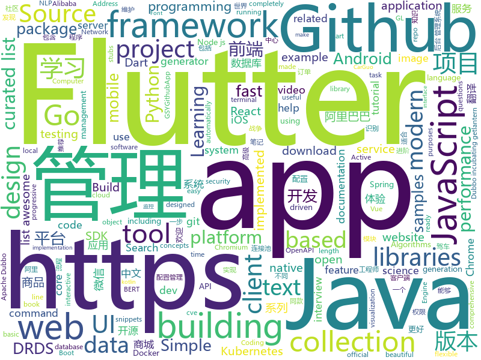

# 2018-12-08
See what the GitHub community is most excited about today.

## python
* [wtfpython](https://github.com/satwikkansal/wtfpython)(**304 stars today**): A collection of surprising Python snippets and lesser-known features.
* [wtfpython-cn](https://github.com/leisurelicht/wtfpython-cn)(**219 stars today**): wtfpython的中文翻译/施工结束/ 能力有限，欢迎帮我改进翻译
* [ranking](https://github.com/tensorflow/ranking)(**161 stars today**): Learning to Rank in TensorFlow
* [redash](https://github.com/getredash/redash)(**118 stars today**): Make Your Company Data Driven. Connect to any data source, easily visualize, dashboard and share your data.
* [bert](https://github.com/google-research/bert)(**82 stars today**): TensorFlow code and pre-trained models for BERT
* [tldr](https://github.com/tldr-pages/tldr)(**81 stars today**): 📚Simplified and community-driven man pages
* [models](https://github.com/tensorflow/models)(**55 stars today**): Models and examples built with TensorFlow
* [VON](https://github.com/junyanz/VON)(**73 stars today**): Learning to synthesize 3D textured objects with GANs.
* [pyod](https://github.com/yzhao062/pyod)(**65 stars today**): A Python Toolkit for Scalable Outlier Detection (Anomaly Detection)
* [bert-as-service](https://github.com/hanxiao/bert-as-service)(**67 stars today**): Mapping a variable-length sentence to a fixed-length vector using BERT model
* [HelloGitHub](https://github.com/521xueweihan/HelloGitHub)(**63 stars today**): GitHub 上好玩、容易上手的项目，帮你找到编程的乐趣。欢迎推荐、自荐项目，让更多人知道你的项目⭐️
* [awesome-python](https://github.com/vinta/awesome-python)(**56 stars today**): A curated list of awesome Python frameworks, libraries, software and resources
* [video-to-ascii](https://github.com/joelibaceta/video-to-ascii)(**58 stars today**): It is a simple python package to play videos in the terminal using characters as pixels
* [image-super-resolution](https://github.com/idealo/image-super-resolution)(**55 stars today**): Keras implementation of the Residual Dense Network for super scaling images.
* [TensorFlow-Course](https://github.com/open-source-for-science/TensorFlow-Course)(**49 stars today**): Simple and ready-to-use tutorials for TensorFlow
* [system-design-primer](https://github.com/donnemartin/system-design-primer)(**48 stars today**): Learn how to design large-scale systems. Prep for the system design interview. Includes Anki flashcards.
* [youtube-dl](https://github.com/rg3/youtube-dl)(**48 stars today**): Command-line program to download videos from YouTube.com and other video sites
* [poc_CVE-2018-1002105](https://github.com/evict/poc_CVE-2018-1002105)(**47 stars today**): PoC for CVE-2018-1002105.
* [aclpwn.py](https://github.com/fox-it/aclpwn.py)(**49 stars today**): Active Directory ACL exploitation with BloodHound
* [keras](https://github.com/keras-team/keras)(**37 stars today**): Deep Learning for humans
* [Python](https://github.com/TheAlgorithms/Python)(**39 stars today**): All Algorithms implemented in Python
* [django](https://github.com/django/django)(**37 stars today**): The Web framework for perfectionists with deadlines.
* [ProxylessNAS](https://github.com/MIT-HAN-LAB/ProxylessNAS)(**40 stars today**): ProxylessNAS: Direct Neural Architecture Search on Target Task and Hardware. https://arxiv.org/abs/1812.00332
* [cpython](https://github.com/python/cpython)(**28 stars today**): The Python programming language
* [ChineseAddress_OCR](https://github.com/Walleclipse/ChineseAddress_OCR)(**34 stars today**): Photographing Chinese-Address OCR implemented using CTPN+CTC+Address Correction. 拍照文档中文地址文字识别。

## java
* [JAViewer](https://github.com/SplashCodes/JAViewer)(**237 stars today**): 更优雅的驾车体验
* [JavaGuide](https://github.com/Snailclimb/JavaGuide)(**172 stars today**): 【Java学习+面试指南】 一份涵盖大部分Java程序员所需要掌握的核心知识。
* [ArgusAPM](https://github.com/Qihoo360/ArgusAPM)(**144 stars today**): Powerful, comprehensive (Android) application performance management platform. 360移动性能监控平台
* [apollo](https://github.com/ctripcorp/apollo)(**128 stars today**): Apollo（阿波罗）是携程框架部门研发的分布式配置中心，能够集中化管理应用不同环境、不同集群的配置，配置修改后能够实时推送到应用端，并且具备规范的权限、流程治理等特性，适用于微服务配置管理场景。
* [mall](https://github.com/macrozheng/mall)(**85 stars today**): mall项目是一套电商系统，包括前台商城系统及后台管理系统，基于SpringBoot+MyBatis实现。 前台商城系统包含首页门户、商品推荐、商品搜索、商品展示、购物车、订单流程、会员中心、客户服务、帮助中心等模块。 后台管理系统包含商品管理、订单管理、会员管理、促销管理、运营管理、内容管理、统计报表、财务管理、权限管理、设置等模块。
* [incubator-dubbo](https://github.com/apache/incubator-dubbo)(**74 stars today**): Apache Dubbo (incubating) is a high-performance, java based, open source RPC framework.
* [arthas](https://github.com/alibaba/arthas)(**72 stars today**): Alibaba Java Diagnostic Tool Arthas/Alibaba Java诊断利器Arthas
* [incubator-dubbo-spring-boot-project](https://github.com/apache/incubator-dubbo-spring-boot-project)(**63 stars today**): Spring Boot Project for Apache Dubbo (Incubating)
* [symphony](https://github.com/b3log/symphony)(**59 stars today**): 🎶一款用 Java 实现的现代化社区（论坛/BBS/社交网络/博客）平台。https://hacpai.com
* [spring-boot](https://github.com/spring-projects/spring-boot)(**47 stars today**): Spring Boot
* [tutorials](https://github.com/eugenp/tutorials)(**26 stars today**): The "REST With Spring" Course:
* [litemall](https://github.com/linlinjava/litemall)(**43 stars today**): 又一个小商城。litemall = Spring Boot后端 + Vue管理员前端 + 微信小程序用户前端
* [java-design-patterns](https://github.com/iluwatar/java-design-patterns)(**40 stars today**): Design patterns implemented in Java
* [guava](https://github.com/google/guava)(**41 stars today**): Google core libraries for Java
* [nacos](https://github.com/alibaba/nacos)(**36 stars today**): an easy-to-use dynamic service discovery, configuration and service management platform for building cloud native applications(更易于构建云原生应用的动态服务发现、配置管理和服务管理平台)
* [spring-framework](https://github.com/spring-projects/spring-framework)(**29 stars today**): Spring Framework
* [elasticsearch](https://github.com/elastic/elasticsearch)(**30 stars today**): Open Source, Distributed, RESTful Search Engine
* [JCSprout](https://github.com/crossoverJie/JCSprout)(**29 stars today**): 👨‍🎓Java Core Sprout : basic, concurrent, algorithm
* [Java](https://github.com/TheAlgorithms/Java)(**26 stars today**): All Algorithms implemented in Java
* [canal](https://github.com/alibaba/canal)(**26 stars today**): 阿里巴巴mysql数据库binlog的增量订阅&消费组件 。阿里云DRDS( https://www.aliyun.com/product/drds )、阿里巴巴TDDL 二级索引、小表复制powerd by canal.
* [druid](https://github.com/alibaba/druid)(**25 stars today**): 阿里巴巴数据库事业部出品，为监控而生的数据库连接池。2018年开源中国最受欢迎开源软件评选请参与投票 https://www.oschina.net/project/top_cn_2018 阿里云DRDS(https://www.aliyun.com/product/drds )、阿里巴巴TDDL 连接池powered by Druid
* [flink](https://github.com/apache/flink)(**22 stars today**): Apache Flink
* [weixin-java-tools](https://github.com/Wechat-Group/weixin-java-tools)(**23 stars today**): 全能微信Java开发工具包，支持包括微信支付、开放平台、小程序、企业微信/企业号和公众号等的后端开发
* [HanLP](https://github.com/hankcs/HanLP)(**25 stars today**): 自然语言处理 中文分词 词性标注 命名实体识别 依存句法分析 新词发现 关键词短语提取 自动摘要 文本分类聚类 拼音简繁
* [okhttp](https://github.com/square/okhttp)(**22 stars today**): An HTTP+HTTP/2 client for Android and Java applications.

## unknown
* [MSEdge](https://github.com/MicrosoftEdge/MSEdge)(**823 stars today**): Microsoft Edge
* [CS-Notes](https://github.com/CyC2018/CS-Notes)(**448 stars today**): 📚Computer Science Learning Notes
* [awesome-styleguides](https://github.com/streamich/awesome-styleguides)(**167 stars today**): A curated list of UI styleguides —😎💄
* [eeeeeeeeeeeeeeeeeeeeeeeeeeeeeeeeeeeeeeeeeeeeeeeeeeeeeeeeeeeeeeeeeeeeeeeeeeeeeeeeeeeeeeeeeeeeeeeeeeee](https://github.com/eeeeeeeeeeeeeeeeeeeeeeeeeeeeeeee/eeeeeeeeeeeeeeeeeeeeeeeeeeeeeeeeeeeeeeeeeeeeeeeeeeeeeeeeeeeeeeeeeeeeeeeeeeeeeeeeeeeeeeeeeeeeeeeeeeee)(**140 stars today**): eeeeeeeeeeeeeeeeeeeeeeeeeeeeeeeeeeeeeeeeeeeeeeeeeeeeeeeeeeeeeeeeeeeeeeeeeeeeeeeeeeeeeeeeeeeeeeeeeeeeeeeeeeeeeeeeeeeeeeeeeeeeeeeeeeeeeeeeeeeeeeeeeeeeeeeeeeeeeeeeeeeeeeeeeeeeeeeeeeeeeeeeeeeeeeeeeeeeeeeeeeeeeeeeeeeeeeeeeeeeeeeeeeeeeeeeeeeeeeeeeeeeeeeeeeeeeeeeeeeeeeeeeeeeeeeeeeeeeeeeeeeeeeeeeeeeeeeeeeeeeeeeeeeeeeeeeeeeeeeeeeeeeeeeeeeeeeeeeeeeeeeeeee…
* [blog](https://github.com/yygmind/blog)(**74 stars today**): 我是木易杨，网易高级前端工程师，跟着我每周重点攻克一个前端面试重难点。接下来让我带你走进高级前端的世界，在进阶的路上，共勉！
* [book](https://github.com/rustwasm/book)(**65 stars today**): The Rust and WebAssembly Book
* [awesome](https://github.com/sindresorhus/awesome)(**60 stars today**): 😎Curated list of awesome lists
* [gitignore](https://github.com/github/gitignore)(**43 stars today**): A collection of useful .gitignore templates
* [Windows-RCE-exploits](https://github.com/smgorelik/Windows-RCE-exploits)(**49 stars today**): The exploit samples database is a repository for **RCE** (remote code execution) exploits and Proof-of-Concepts for **WINDOWS**, the samples are uploaded for education purposes for red and blue teams.
* [vmware-exploitation](https://github.com/xairy/vmware-exploitation)(**46 stars today**): A bunch of links related to VMware escape exploits
* [coding-interview-university](https://github.com/jwasham/coding-interview-university)(**40 stars today**): A complete computer science study plan to become a software engineer.
* [free-programming-books](https://github.com/EbookFoundation/free-programming-books)(**35 stars today**): 📚Freely available programming books
* [awesome-vue](https://github.com/vuejs/awesome-vue)(**39 stars today**): 🎉A curated list of awesome things related to Vue.js
* [chromium](https://github.com/chromium/chromium)(**34 stars today**): The official GitHub mirror of the Chromium source
* [Awesome_APIs](https://github.com/TonnyL/Awesome_APIs)(**35 stars today**): A collection of APIs
* [portabletext](https://github.com/portabletext/portabletext)(**37 stars today**): Portable Text is a JSON based rich text specification for modern content editing platforms.
* [advanced-java](https://github.com/doocs/advanced-java)(**32 stars today**): 😮互联网 Java 工程师进阶知识完全扫盲
* [gold-miner](https://github.com/xitu/gold-miner)(**33 stars today**): 🥇掘金翻译计划，可能是世界最大最好的英译中技术社区，最懂读者和译者的翻译平台：
* [android-architecture](https://github.com/googlesamples/android-architecture)(**30 stars today**): A collection of samples to discuss and showcase different architectural tools and patterns for Android apps.
* [Cheatsheet-God](https://github.com/OlivierLaflamme/Cheatsheet-God)(**27 stars today**): Penetration Testing / OSCP Biggest Reference Bank / Cheatsheet
* [project-based-learning](https://github.com/tuvtran/project-based-learning)(**24 stars today**): Curated list of project-based tutorials
* [TailwindTraders](https://github.com/Microsoft/TailwindTraders)(**25 stars today**): Tailwind Traders Demo
* [iOSDevNotesAndInterviews](https://github.com/DevDragonLi/iOSDevNotesAndInterviews)(**21 stars today**): 🚴iOS interview questions,git, dev notes, and more
* [gitme](https://github.com/flutterchina/gitme)(**24 stars today**): Flutter开发的一款Github客户端。 A Github client APP developed with Flutter, and It both supports Android and iOS.
* [Projects](https://github.com/karan/Projects)(**21 stars today**): 📃A list of practical projects that anyone can solve in any programming language.

## javascript
* [puppeteer](https://github.com/GoogleChrome/puppeteer)(**270 stars today**): Headless Chrome Node API
* [screenshoteer](https://github.com/vladocar/screenshoteer)(**165 stars today**): Make website screenshots and mobile emulations from the command line.
* [ncc](https://github.com/zeit/ncc)(**155 stars today**): Node.js Compiler Collection
* [vue](https://github.com/vuejs/vue)(**138 stars today**): 🖖A progressive, incrementally-adoptable JavaScript framework for building UI on the web.
* [WebKit-RegEx-Exploit](https://github.com/LinusHenze/WebKit-RegEx-Exploit)(**100 stars today**): 
* [edex-ui](https://github.com/GitSquared/edex-ui)(**92 stars today**): A science fiction terminal emulator designed for large touchscreens that runs on all major OSs.
* [chrome-aws-lambda](https://github.com/alixaxel/chrome-aws-lambda)(**87 stars today**): Chromium Binary for AWS Lambda
* [react](https://github.com/facebook/react)(**67 stars today**): A declarative, efficient, and flexible JavaScript library for building user interfaces.
* [30-seconds-of-code](https://github.com/30-seconds/30-seconds-of-code)(**72 stars today**): Curated collection of useful JavaScript snippets that you can understand in 30 seconds or less.
* [forgJs](https://github.com/oussamahamdaoui/forgJs)(**70 stars today**): ForgJs is a javascript lightweight object validator. Go check the Quick start section and start coding with love
* [axios](https://github.com/axios/axios)(**67 stars today**): Promise based HTTP client for the browser and node.js
* [33-js-concepts](https://github.com/leonardomso/33-js-concepts)(**64 stars today**): 📜33 concepts every JavaScript developer should know.
* [free-programming-books-zh_CN](https://github.com/justjavac/free-programming-books-zh_CN)(**57 stars today**): 📚免费的计算机编程类中文书籍，欢迎投稿
* [overreacted.io](https://github.com/gaearon/overreacted.io)(**59 stars today**): Personal blog by Dan Abramov.
* [learnGitBranching](https://github.com/pcottle/learnGitBranching)(**55 stars today**): An interactive git visualization to challenge and educate!
* [create-react-app](https://github.com/facebook/create-react-app)(**53 stars today**): Set up a modern web app by running one command.
* [jsPDF](https://github.com/MrRio/jsPDF)(**56 stars today**): Client-side JavaScript PDF generation for everyone.
* [node](https://github.com/nodejs/node)(**50 stars today**): Node.js JavaScript runtime✨🐢🚀✨
* [algorithm-visualizer](https://github.com/algorithm-visualizer/algorithm-visualizer)(**55 stars today**): 🎆Interactive Online Platform that Visualizes Algorithms from Code
* [three.js](https://github.com/mrdoob/three.js)(**49 stars today**): JavaScript 3D library.
* [slate](https://github.com/lord/slate)(**46 stars today**): Beautiful static documentation for your API
* [slate](https://github.com/ianstormtaylor/slate)(**50 stars today**): A completely customizable framework for building rich text editors.
* [gatsby](https://github.com/gatsbyjs/gatsby)(**47 stars today**): Build blazing fast, modern apps and websites with React
* [react-native](https://github.com/facebook/react-native)(**41 stars today**): A framework for building native apps with React.
* [next.js](https://github.com/zeit/next.js)(**42 stars today**): The React Framework

## html
* [design-blocks](https://github.com/froala/design-blocks)(**98 stars today**): A set of 170+ Bootstrap based design blocks ready to be used to create clean modern websites.
* [flutter-in-action](https://github.com/flutterchina/flutter-in-action)(**40 stars today**): 《Flutter实战》电子书
* [styleguide](https://github.com/google/styleguide)(**25 stars today**): Style guides for Google-originated open-source projects
* [fastText](https://github.com/facebookresearch/fastText)(**25 stars today**): Library for fast text representation and classification.
* [nginxconfig.io](https://github.com/valentinxxx/nginxconfig.io)(**24 stars today**): ⚙️NGiИX config generator generator on steroids💉
* [react-redux](https://github.com/reduxjs/react-redux)(**18 stars today**): Official React bindings for Redux
* [NLP-progress](https://github.com/sebastianruder/NLP-progress)(**19 stars today**): Repository to track the progress in Natural Language Processing (NLP), including the datasets and the current state-of-the-art for the most common NLP tasks.
* [ionic](https://github.com/ionic-team/ionic)(**12 stars today**): Build amazing native and progressive web apps with open web technologies. One app running on everything🎉
* [GOD-GOG](https://github.com/DarkWorld25/GOD-GOG)(**13 stars today**): 
* [Coursera-ML-AndrewNg-Notes](https://github.com/fengdu78/Coursera-ML-AndrewNg-Notes)(**8 stars today**): 吴恩达老师的机器学习课程个人笔记
* [wedding-website](https://github.com/rampatra/wedding-website)(**11 stars today**): Our Wedding Website👫
* [Spoon-Knife](https://github.com/octocat/Spoon-Knife)(****): This repo is for demonstration purposes only.
* [now-github-starter](https://github.com/zeit/now-github-starter)(****): Starter project to demonstrate a project whose pull requests get automatically deployed
* [openapi-generator](https://github.com/OpenAPITools/openapi-generator)(**11 stars today**): OpenAPI Generator allows generation of API client libraries (SDK generation), server stubs, documentation and configuration automatically given an OpenAPI Spec (v2, v3)
* [portainer](https://github.com/portainer/portainer)(**10 stars today**): Simple management UI for Docker
* [JavaScript30](https://github.com/wesbos/JavaScript30)(**7 stars today**): 30 Day Vanilla JS Challenge
* [Front-end-Developer-Interview-Questions](https://github.com/h5bp/Front-end-Developer-Interview-Questions)(**9 stars today**): A list of helpful front-end related questions you can use to interview potential candidates, test yourself or completely ignore.
* [learning-area](https://github.com/mdn/learning-area)(**5 stars today**): Github repo for the MDN Learning Area.
* [fonts](https://github.com/google/fonts)(**9 stars today**): Font files available from Google Fonts
* [awesome-creative-coding](https://github.com/terkelg/awesome-creative-coding)(**8 stars today**): 🎨Creative Coding: Generative Art, Data visualization, Interaction Design, Resources.
* [javascript-tutorial-en](https://github.com/iliakan/javascript-tutorial-en)(**7 stars today**): Modern JavaScript Tutorial
* [MyArticles](https://github.com/zhengmin1989/MyArticles)(**6 stars today**): 蒸米的文章（iOS冰与火之歌系列，一步一步学ROP系列，安卓动态调试七种武器系列等）
* [owasp-mstg](https://github.com/OWASP/owasp-mstg)(**7 stars today**): The Mobile Security Testing Guide (MSTG) is a comprehensive manual for mobile app security testing and reverse engineering.
* [swagger-codegen](https://github.com/swagger-api/swagger-codegen)(**6 stars today**): swagger-codegen contains a template-driven engine to generate documentation, API clients and server stubs in different languages by parsing your OpenAPI / Swagger definition.
* [quickstart-js](https://github.com/firebase/quickstart-js)(**5 stars today**): Firebase Quickstart Samples for Web

## dart
* [flutter](https://github.com/flutter/flutter)(**464 stars today**): Flutter makes it easy and fast to build beautiful mobile apps.
* [awesome-flutter](https://github.com/Solido/awesome-flutter)(**141 stars today**): An awesome list that curates the best Flutter libraries, tools, tutorials, articles and more.
* [GSYGithubAppFlutter](https://github.com/CarGuo/GSYGithubAppFlutter)(**27 stars today**): 超完整的Flutter项目，功能丰富，适合学习和日常使用。GSYGithubApp系列的优势：我们目前已经拥有Flutter、Weex、ReactNative、kotlin 四个版本。 功能齐全，项目框架内技术涉及面广，完成度高，持续维护，配套文章，适合全面学习，对比参考。跨平台的开源Github客户端App，更好的体验，更丰富的功能，旨在更好的日常管理和维护个人Github，提供更好更方便的驾车体验Σ(￣。￣ﾉ)ﾉ。同款Weex版本 ： https://github.com/CarGuo/GSYGithubAppWeex 、同款React Native版本 ： https://github.com/CarGuo/GSYGithubApp 、原生 kotlin 版本 https://g…
* [plugins](https://github.com/flutter/plugins)(**22 stars today**): Plugins for Flutter, including FlutterFire, maintained by the Flutter team
* [Flare-Flutter](https://github.com/2d-inc/Flare-Flutter)(**25 stars today**): 
* [flutter_layout](https://github.com/nb312/flutter_layout)(**19 stars today**): Layout of the flutter example.such as Row,Comlun,listview,Just for learning.
* [flutter_architecture_samples](https://github.com/brianegan/flutter_architecture_samples)(**16 stars today**): TodoMVC for Flutter
* [FlutterUI](https://github.com/yumi0629/FlutterUI)(**17 stars today**): For help building amazing UI with Flutter.
* [samples](https://github.com/flutter/samples)(**15 stars today**): A collection of Flutter examples and demos.
* [flutter-examples](https://github.com/nisrulz/flutter-examples)(**10 stars today**): [Examples] Simple basic isolated apps, for budding flutter devs.
* [sdk](https://github.com/dart-lang/sdk)(**11 stars today**): The Dart SDK, including the VM, dart2js, core libraries, and more.
* [Flutter-UI-Kit](https://github.com/iampawan/Flutter-UI-Kit)(**11 stars today**): Flutter app for collection of UI in a UIKit
* [RealRichText](https://github.com/bytedance/RealRichText)(**9 stars today**): A Tricky Solution for Implementing Inline-Image-In-Text Feature in Flutter.
* [fluwx](https://github.com/OpenFlutter/fluwx)(**8 stars today**): Flutter版微信SDK.WeChat SDK for flutter.
* [flutter_study](https://github.com/luhenchang/flutter_study)(**6 stars today**): 三天学会Flutter
* [head-first-dart-book](https://github.com/chai2010/head-first-dart-book)(**6 stars today**): 📚Dart学习笔记(在战争中学习战争)(开发中...)
* [flutter_ui_challenge_planets_app](https://github.com/rvamsikrishna/flutter_ui_challenge_planets_app)(**5 stars today**): A flutter ui challenge .... building a planets app
* [website](https://github.com/flutter/website)(****): Flutter web site
* [angular](https://github.com/dart-lang/angular)(****): Fast and productive web framework provided by Dart
* [menu_flutter](https://github.com/braulio94/menu_flutter)(****): 🍝restaurant menu app made with flutter inspired by this design https://goo.gl/jChLBV
* [material-components-flutter-codelabs](https://github.com/material-components/material-components-flutter-codelabs)(****): Codelabs for Material Components for Flutter (MDC-Flutter)
* [audio_recorder](https://github.com/ZaraclaJ/audio_recorder)(****): 
* [bmi_calculator](https://github.com/MarcinusX/bmi_calculator)(****): BMI Calculator app designed by Johny Vino
* [flutter-mapbox-gl](https://github.com/mapbox/flutter-mapbox-gl)(****): A Mapbox GL flutter package for creating custom maps
* [chromedeveditor](https://github.com/googlearchive/chromedeveditor)(****): Chrome Dev Editor is a developer tool for building apps on the Chrome platform - Chrome Apps and Web Apps, in JavaScript or Dart. (NO LONGER IN ACTIVE DEVELOPMENT)

## go
* [Ethr](https://github.com/Microsoft/Ethr)(**405 stars today**): Ethr is a Network Performance Measurement Tool for TCP, UDP & HTTP.
* [dive](https://github.com/wagoodman/dive)(**137 stars today**): A tool for exploring each layer in a docker image
* [compose-on-kubernetes](https://github.com/docker/compose-on-kubernetes)(**122 stars today**): Deploy applications described in Compose onto Kubernetes clusters
* [openedge](https://github.com/baidu/openedge)(**85 stars today**): Extend cloud computing, data and service seamlessly to edge devices.
* [ff](https://github.com/peterbourgon/ff)(**85 stars today**): Flags-first package for configuration
* [kubernetes](https://github.com/kubernetes/kubernetes)(**66 stars today**): Production-Grade Container Scheduling and Management
* [go](https://github.com/golang/go)(**62 stars today**): The Go programming language
* [sourcegraph](https://github.com/sourcegraph/sourcegraph)(**61 stars today**): Code search and intelligence, self-hosted and scalable
* [makisu](https://github.com/uber/makisu)(**61 stars today**): Fast and flexible Docker image building tool, works in unprivileged containerized environments like Mesos and Kubernetes.
* [gin](https://github.com/gin-gonic/gin)(**52 stars today**): Gin is a HTTP web framework written in Go (Golang). It features a Martini-like API with much better performance -- up to 40 times faster. If you need smashing performance, get yourself some Gin.
* [faas](https://github.com/openfaas/faas)(**48 stars today**): OpenFaaS - Serverless Functions Made Simple
* [awesome-go](https://github.com/avelino/awesome-go)(**44 stars today**): A curated list of awesome Go frameworks, libraries and software
* [frp](https://github.com/fatedier/frp)(**37 stars today**): A fast reverse proxy to help you expose a local server behind a NAT or firewall to the internet.
* [kind](https://github.com/kubernetes-sigs/kind)(**40 stars today**): Kubernetes IN Docker - local clusters for testing Kubernetes
* [istio](https://github.com/istio/istio)(**38 stars today**): Connect, secure, control, and observe services.
* [go-consistent](https://github.com/Quasilyte/go-consistent)(**38 stars today**): Source code analyzer that helps you to make your Go programs more consistent.
* [helm](https://github.com/helm/helm)(**34 stars today**): The Kubernetes Package Manager
* [crossplane](https://github.com/crossplaneio/crossplane)(**36 stars today**): An Open Source Multicloud Control Plane
* [lantern](https://github.com/getlantern/lantern)(**33 stars today**): 🔴蓝灯最新版本下载 https://github.com/getlantern/download🔴Lantern Latest Download https://github.com/getlantern/download🔴
* [prometheus](https://github.com/prometheus/prometheus)(**32 stars today**): The Prometheus monitoring system and time series database.
* [websocket](https://github.com/gorilla/websocket)(**31 stars today**): A WebSocket implementation for Go.
* [baur](https://github.com/simplesurance/baur)(**32 stars today**): baur manages builds and artifacts in mono repositories
* [mongo-go-driver](https://github.com/mongodb/mongo-go-driver)(**30 stars today**): The Go driver for MongoDB
* [cve-2018-1002105](https://github.com/gravitational/cve-2018-1002105)(**30 stars today**): Test utility for cve-2018-1002105
* [gitbase](https://github.com/src-d/gitbase)(**31 stars today**): SQL interface to Git repositories, written in Go. https://docs.sourced.tech/gitbase

## WordCloud

