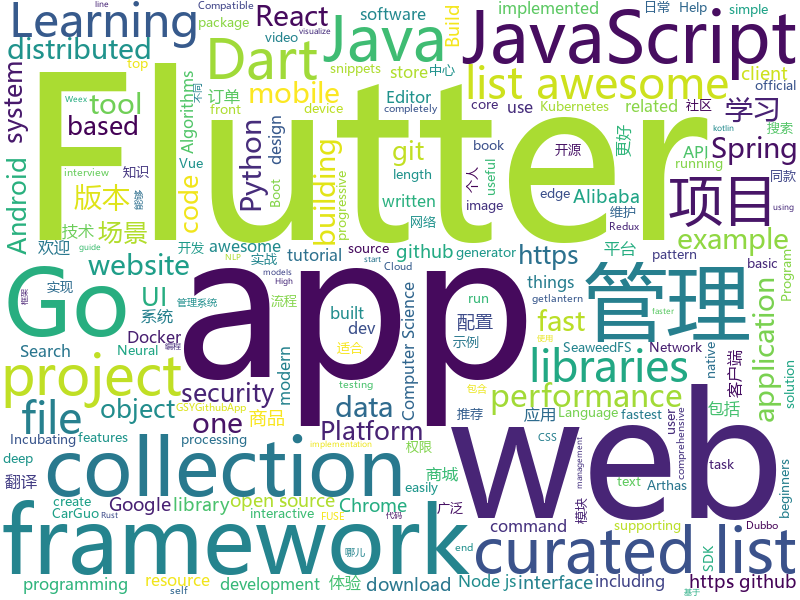

# 2018-12-09
See what the GitHub community is most excited about today.

## python
* [jax](https://github.com/google/jax)(**436 stars today**): GPU- and TPU-backed NumPy with differentiation and JIT compilation.
* [wtfpython](https://github.com/satwikkansal/wtfpython)(**200 stars today**): A collection of surprising Python snippets and lesser-known features.
* [dgl](https://github.com/dmlc/dgl)(**174 stars today**): Python package built to ease deep learning on graph, on top of existing DL frameworks.
* [loguru](https://github.com/Delgan/loguru)(**128 stars today**): Python logging made (stupidly) simple
* [loss-landscape](https://github.com/tomgoldstein/loss-landscape)(**112 stars today**): Code for visualizing the loss landscape of neural nets
* [wtfpython-cn](https://github.com/leisurelicht/wtfpython-cn)(**64 stars today**): wtfpython的中文翻译/施工结束/ 能力有限，欢迎帮我改进翻译
* [models](https://github.com/tensorflow/models)(**38 stars today**): Models and examples built with TensorFlow
* [django-sspanel](https://github.com/Ehco1996/django-sspanel)(**48 stars today**): 用diango开发的全新的shadowsocks网络面板
* [ranking](https://github.com/tensorflow/ranking)(**43 stars today**): Learning to Rank in TensorFlow
* [DNOISE](https://github.com/grantwilk/DNOISE)(**43 stars today**): 
* [bert](https://github.com/google-research/bert)(**39 stars today**): TensorFlow code and pre-trained models for BERT
* [system-design-primer](https://github.com/donnemartin/system-design-primer)(**35 stars today**): Learn how to design large-scale systems. Prep for the system design interview. Includes Anki flashcards.
* [tldr](https://github.com/tldr-pages/tldr)(**37 stars today**): 📚Simplified and community-driven man pages
* [meshroom](https://github.com/alicevision/meshroom)(**36 stars today**): 3D Reconstruction Software
* [ProxylessNAS](https://github.com/MIT-HAN-LAB/ProxylessNAS)(**33 stars today**): ProxylessNAS: Direct Neural Architecture Search on Target Task and Hardware. https://arxiv.org/abs/1812.00332
* [Python](https://github.com/TheAlgorithms/Python)(**31 stars today**): All Algorithms implemented in Python
* [keras](https://github.com/keras-team/keras)(**28 stars today**): Deep Learning for humans
* [redash](https://github.com/getredash/redash)(**32 stars today**): Make Your Company Data Driven. Connect to any data source, easily visualize, dashboard and share your data.
* [youtube-dl](https://github.com/rg3/youtube-dl)(**31 stars today**): Command-line program to download videos from YouTube.com and other video sites
* [DeOldify](https://github.com/jantic/DeOldify)(**29 stars today**): A Deep Learning based project for colorizing and restoring old images
* [VON](https://github.com/junyanz/VON)(**31 stars today**): Learning to synthesize 3D textured objects with GANs.
* [poc_CVE-2018-1002105](https://github.com/evict/poc_CVE-2018-1002105)(**28 stars today**): PoC for CVE-2018-1002105.
* [HelloGitHub](https://github.com/521xueweihan/HelloGitHub)(**27 stars today**): GitHub 上好玩、容易上手的项目，帮你找到编程的乐趣。欢迎推荐、自荐项目，让更多人知道你的项目⭐️
* [awesome-python](https://github.com/vinta/awesome-python)(**22 stars today**): A curated list of awesome Python frameworks, libraries, software and resources
* [bert-as-service](https://github.com/hanxiao/bert-as-service)(**25 stars today**): Mapping a variable-length sentence to a fixed-length vector using BERT model

## java
* [qmq](https://github.com/qunarcorp/qmq)(**140 stars today**): QMQ是去哪儿网内部广泛使用的消息中间件，自2012年诞生以来在去哪儿网所有业务场景中广泛的应用，包括跟交易息息相关的订单场景； 也包括报价搜索等高吞吐量场景。
* [tech-weekly](https://github.com/mercyblitz/tech-weekly)(**121 stars today**): 「小马哥技术周报」
* [JavaGuide](https://github.com/Snailclimb/JavaGuide)(**90 stars today**): 【Java学习+面试指南】 一份涵盖大部分Java程序员所需要掌握的核心知识。
* [JAViewer](https://github.com/SplashCodes/JAViewer)(**78 stars today**): 更优雅的驾车体验
* [mall](https://github.com/macrozheng/mall)(**38 stars today**): mall项目是一套电商系统，包括前台商城系统及后台管理系统，基于SpringBoot+MyBatis实现。 前台商城系统包含首页门户、商品推荐、商品搜索、商品展示、购物车、订单流程、会员中心、客户服务、帮助中心等模块。 后台管理系统包含商品管理、订单管理、会员管理、促销管理、运营管理、内容管理、统计报表、财务管理、权限管理、设置等模块。
* [apollo](https://github.com/ctripcorp/apollo)(**26 stars today**): Apollo（阿波罗）是携程框架部门研发的分布式配置中心，能够集中化管理应用不同环境、不同集群的配置，配置修改后能够实时推送到应用端，并且具备规范的权限、流程治理等特性，适用于微服务配置管理场景。
* [spring-framework](https://github.com/spring-projects/spring-framework)(**18 stars today**): Spring Framework
* [java-design-patterns](https://github.com/iluwatar/java-design-patterns)(**22 stars today**): Design patterns implemented in Java
* [incubator-dubbo](https://github.com/apache/incubator-dubbo)(**21 stars today**): Apache Dubbo (incubating) is a high-performance, java based, open source RPC framework.
* [ArgusAPM](https://github.com/Qihoo360/ArgusAPM)(**25 stars today**): Powerful, comprehensive (Android) application performance management platform. 360移动性能监控平台
* [arthas](https://github.com/alibaba/arthas)(**24 stars today**): Alibaba Java Diagnostic Tool Arthas/Alibaba Java诊断利器Arthas
* [symphony](https://github.com/b3log/symphony)(**22 stars today**): 🎶一款用 Java 实现的现代化社区（论坛/BBS/社交网络/博客）平台。https://hacpai.com
* [tutorials](https://github.com/eugenp/tutorials)(**11 stars today**): The "REST With Spring" Course:
* [litemall](https://github.com/linlinjava/litemall)(**18 stars today**): 又一个小商城。litemall = Spring Boot后端 + Vue管理员前端 + 微信小程序用户前端
* [spring-boot](https://github.com/spring-projects/spring-boot)(**16 stars today**): Spring Boot
* [elasticsearch](https://github.com/elastic/elasticsearch)(**19 stars today**): Open Source, Distributed, RESTful Search Engine
* [Java](https://github.com/TheAlgorithms/Java)(**17 stars today**): All Algorithms implemented in Java
* [spring-cloud-alibaba](https://github.com/spring-cloud-incubator/spring-cloud-alibaba)(**15 stars today**): Spring Cloud Alibaba provides a one-stop solution for application development for the distributed solutions of Alibaba middleware.
* [guava](https://github.com/google/guava)(**13 stars today**): Google core libraries for Java
* [graal](https://github.com/oracle/graal)(**15 stars today**): GraalVM: Run Programs Faster Anywhere🚀
* [AndroidReview](https://github.com/huannan/AndroidReview)(**15 stars today**): 小楠总的Android面试复习
* [flink](https://github.com/apache/flink)(**13 stars today**): Apache Flink
* [event-sourcing-microservices-basics](https://github.com/kbastani/event-sourcing-microservices-basics)(**14 stars today**): Learn how to deploy a social network that uses event sourcing with Kubernetes and Docker Stacks
* [okhttp](https://github.com/square/okhttp)(**13 stars today**): An HTTP+HTTP/2 client for Android and Java applications.
* [incubator-dubbo-spring-boot-project](https://github.com/apache/incubator-dubbo-spring-boot-project)(**13 stars today**): Spring Boot Project for Apache Dubbo (Incubating)

## unknown
* [MSEdge](https://github.com/MicrosoftEdge/MSEdge)(**282 stars today**): Microsoft Edge
* [CS-Notes](https://github.com/CyC2018/CS-Notes)(**137 stars today**): 📚Computer Science Learning Notes
* [You-Dont-Know-JS](https://github.com/getify/You-Dont-Know-JS)(**48 stars today**): A book series on JavaScript. @YDKJS on twitter.
* [gitignore](https://github.com/github/gitignore)(**37 stars today**): A collection of useful .gitignore templates
* [awesome-styleguides](https://github.com/streamich/awesome-styleguides)(**48 stars today**): A curated list of UI styleguides —😎💄
* [free-programming-books](https://github.com/EbookFoundation/free-programming-books)(**39 stars today**): 📚Freely available programming books
* [awesome](https://github.com/sindresorhus/awesome)(**36 stars today**): 😎Curated list of awesome lists
* [coding-interview-university](https://github.com/jwasham/coding-interview-university)(**34 stars today**): A complete computer science study plan to become a software engineer.
* [awesome-casestudy](https://github.com/luruke/awesome-casestudy)(**37 stars today**): 📕Curated list of technical case studies around WebGL and creative development
* [awesome-vue](https://github.com/vuejs/awesome-vue)(**32 stars today**): 🎉A curated list of awesome things related to Vue.js
* [project-based-learning](https://github.com/tuvtran/project-based-learning)(**27 stars today**): Curated list of project-based tutorials
* [computer-science](https://github.com/ossu/computer-science)(**22 stars today**): 🎓Path to a free self-taught education in Computer Science!
* [Projects](https://github.com/karan/Projects)(**18 stars today**): 📃A list of practical projects that anyone can solve in any programming language.
* [Awesome_APIs](https://github.com/TonnyL/Awesome_APIs)(**19 stars today**): A collection of APIs
* [awesome-docker](https://github.com/veggiemonk/awesome-docker)(**19 stars today**): 🐳A curated list of Docker resources and projects
* [first-contributions](https://github.com/firstcontributions/first-contributions)(**9 stars today**): 🚀✨Help beginners to contribute to open source projects
* [awesome-cpp](https://github.com/fffaraz/awesome-cpp)(**17 stars today**): A curated list of awesome C++ (or C) frameworks, libraries, resources, and shiny things. Inspired by awesome-... stuff.
* [gfwlist](https://github.com/gfwlist/gfwlist)(**14 stars today**): The one and only one gfwlist here
* [awesome-react](https://github.com/enaqx/awesome-react)(**16 stars today**): A collection of awesome things regarding React ecosystem.
* [chromium](https://github.com/chromium/chromium)(**14 stars today**): The official GitHub mirror of the Chromium source
* [book](https://github.com/rustwasm/book)(**16 stars today**): The Rust and WebAssembly Book
* [awesome-for-beginners](https://github.com/MunGell/awesome-for-beginners)(**15 stars today**): A list of awesome beginners-friendly projects.
* [advanced-java](https://github.com/doocs/advanced-java)(**14 stars today**): 😮互联网 Java 工程师进阶知识完全扫盲
* [react-redux-links](https://github.com/markerikson/react-redux-links)(**14 stars today**): Curated tutorial and resource links I've collected on React, Redux, ES6, and more
* [gold-miner](https://github.com/xitu/gold-miner)(**13 stars today**): 🥇掘金翻译计划，可能是世界最大最好的英译中技术社区，最懂读者和译者的翻译平台：

## javascript
* [jsPDF](https://github.com/MrRio/jsPDF)(**306 stars today**): Client-side JavaScript PDF generation for everyone.
* [puppeteer](https://github.com/GoogleChrome/puppeteer)(**109 stars today**): Headless Chrome Node API
* [vue](https://github.com/vuejs/vue)(**89 stars today**): 🖖A progressive, incrementally-adoptable JavaScript framework for building UI on the web.
* [forgJs](https://github.com/oussamahamdaoui/forgJs)(**82 stars today**): ForgJs is a javascript lightweight object validator. Go check the Quick start section and start coding with love
* [screenshoteer](https://github.com/vladocar/screenshoteer)(**73 stars today**): Make website screenshots and mobile emulations from the command line.
* [sharp](https://github.com/lovell/sharp)(**71 stars today**): High performance Node.js image processing, the fastest module to resize JPEG, PNG, WebP and TIFF images. Uses the libvips library.
* [react](https://github.com/facebook/react)(**50 stars today**): A declarative, efficient, and flexible JavaScript library for building user interfaces.
* [30-seconds-of-code](https://github.com/30-seconds/30-seconds-of-code)(**53 stars today**): Curated collection of useful JavaScript snippets that you can understand in 30 seconds or less.
* [edex-ui](https://github.com/GitSquared/edex-ui)(**56 stars today**): A science fiction terminal emulator designed for large touchscreens that runs on all major OSs.
* [WebKit-RegEx-Exploit](https://github.com/LinusHenze/WebKit-RegEx-Exploit)(**49 stars today**): 
* [ncc](https://github.com/zeit/ncc)(**54 stars today**): Node.js Compiler Collection
* [create-react-app](https://github.com/facebook/create-react-app)(**44 stars today**): Set up a modern web app by running one command.
* [algorithm-visualizer](https://github.com/algorithm-visualizer/algorithm-visualizer)(**45 stars today**): 🎆Interactive Online Platform that Visualizes Algorithms from Code
* [free-programming-books-zh_CN](https://github.com/justjavac/free-programming-books-zh_CN)(**34 stars today**): 📚免费的计算机编程类中文书籍，欢迎投稿
* [slate](https://github.com/ianstormtaylor/slate)(**39 stars today**): A completely customizable framework for building rich text editors.
* [overreacted.io](https://github.com/gaearon/overreacted.io)(**37 stars today**): Personal blog by Dan Abramov.
* [tui.editor](https://github.com/nhnent/tui.editor)(**36 stars today**): 🍞📝Markdown WYSIWYG Editor. GFM Standard + Chart & UML Extensible.
* [gatsby](https://github.com/gatsbyjs/gatsby)(**32 stars today**): Build blazing fast, modern apps and websites with React
* [cloudworker](https://github.com/dollarshaveclub/cloudworker)(**35 stars today**): Run Cloudflare Worker scripts locally
* [next.js](https://github.com/zeit/next.js)(**32 stars today**): The React Framework
* [programmers-introduction-to-mathematics](https://github.com/pim-book/programmers-introduction-to-mathematics)(**33 stars today**): Code for A Programmer's Introduction to Mathematics
* [chrome-aws-lambda](https://github.com/alixaxel/chrome-aws-lambda)(**33 stars today**): Chromium Binary for AWS Lambda
* [learnGitBranching](https://github.com/pcottle/learnGitBranching)(**30 stars today**): An interactive git visualization to challenge and educate!
* [node](https://github.com/nodejs/node)(**28 stars today**): Node.js JavaScript runtime✨🐢🚀✨
* [javascript-drones](https://github.com/wesbos/javascript-drones)(**27 stars today**): 

## html
* [design-blocks](https://github.com/froala/design-blocks)(**40 stars today**): A set of 170+ Bootstrap based design blocks ready to be used to create clean modern websites.
* [nginxconfig.io](https://github.com/valentinxxx/nginxconfig.io)(**26 stars today**): ⚙️NGiИX config generator generator on steroids💉
* [Coursera-ML-AndrewNg-Notes](https://github.com/fengdu78/Coursera-ML-AndrewNg-Notes)(**15 stars today**): 吴恩达老师的机器学习课程个人笔记
* [flutter-in-action](https://github.com/flutterchina/flutter-in-action)(**14 stars today**): 《Flutter实战》电子书
* [Front-end-Developer-Interview-Questions](https://github.com/h5bp/Front-end-Developer-Interview-Questions)(**13 stars today**): A list of helpful front-end related questions you can use to interview potential candidates, test yourself or completely ignore.
* [react-redux](https://github.com/reduxjs/react-redux)(**10 stars today**): Official React bindings for Redux
* [fastText](https://github.com/facebookresearch/fastText)(**9 stars today**): Library for fast text representation and classification.
* [ionic](https://github.com/ionic-team/ionic)(**8 stars today**): Build amazing native and progressive web apps with open web technologies. One app running on everything🎉
* [Spoon-Knife](https://github.com/octocat/Spoon-Knife)(****): This repo is for demonstration purposes only.
* [ctf-wiki](https://github.com/ctf-wiki/ctf-wiki)(**7 stars today**): CTF Wiki Online
* [NLP-progress](https://github.com/sebastianruder/NLP-progress)(**7 stars today**): Repository to track the progress in Natural Language Processing (NLP), including the datasets and the current state-of-the-art for the most common NLP tasks.
* [owasp-mstg](https://github.com/OWASP/owasp-mstg)(**6 stars today**): The Mobile Security Testing Guide (MSTG) is a comprehensive manual for mobile app security testing and reverse engineering.
* [styleguide](https://github.com/google/styleguide)(**6 stars today**): Style guides for Google-originated open-source projects
* [polymer](https://github.com/Polymer/polymer)(**7 stars today**): Our original Web Component library.
* [wedding-website](https://github.com/rampatra/wedding-website)(**5 stars today**): Our Wedding Website👫
* [security_whitepapers](https://github.com/bl4de/security_whitepapers)(**6 stars today**): Collection of misc IT Security related whitepapers, presentations, slides - hacking, bug bounty, web application security, XSS, CSRF, SQLi
* [www.rust-lang.org](https://github.com/rust-lang/www.rust-lang.org)(**5 stars today**): the home of the Rust website
* [CSS-file-icons](https://github.com/colorswall/CSS-file-icons)(**6 stars today**): Pure CSS icons for popular file extensions
* [portainer](https://github.com/portainer/portainer)(**5 stars today**): Simple management UI for Docker
* [quickstart-js](https://github.com/firebase/quickstart-js)(**5 stars today**): Firebase Quickstart Samples for Web
* [milligram](https://github.com/milligram/milligram)(**5 stars today**): A minimalist CSS framework.
* [foundation-sites](https://github.com/zurb/foundation-sites)(**5 stars today**): The most advanced responsive front-end framework in the world. Quickly create prototypes and production code for sites that work on any kind of device.
* [ecma262](https://github.com/tc39/ecma262)(**5 stars today**): Status, process, and documents for ECMA262
* [solid](https://github.com/solid/solid)(**5 stars today**): Solid - Re-decentralizing the web (project directory)
* [patchwork](https://github.com/jlord/patchwork)(****): All the Git-it Workshop completers!

## dart
* [flutter](https://github.com/flutter/flutter)(**247 stars today**): Flutter makes it easy and fast to build beautiful mobile apps.
* [awesome-flutter](https://github.com/Solido/awesome-flutter)(**107 stars today**): An awesome list that curates the best Flutter libraries, tools, tutorials, articles and more.
* [samples](https://github.com/flutter/samples)(**20 stars today**): A collection of Flutter examples and demos.
* [plugins](https://github.com/flutter/plugins)(**16 stars today**): Plugins for Flutter, including FlutterFire, maintained by the Flutter team
* [flutter-examples](https://github.com/nisrulz/flutter-examples)(**14 stars today**): [Examples] Simple basic isolated apps, for budding flutter devs.
* [Flutter-UI-Kit](https://github.com/iampawan/Flutter-UI-Kit)(**14 stars today**): Flutter app for collection of UI in a UIKit
* [flutter_architecture_samples](https://github.com/brianegan/flutter_architecture_samples)(**11 stars today**): TodoMVC for Flutter
* [Flare-Flutter](https://github.com/2d-inc/Flare-Flutter)(**11 stars today**): 
* [sdk](https://github.com/dart-lang/sdk)(**11 stars today**): The Dart SDK, including the VM, dart2js, core libraries, and more.
* [GSYGithubAppFlutter](https://github.com/CarGuo/GSYGithubAppFlutter)(**11 stars today**): 超完整的Flutter项目，功能丰富，适合学习和日常使用。GSYGithubApp系列的优势：我们目前已经拥有Flutter、Weex、ReactNative、kotlin 四个版本。 功能齐全，项目框架内技术涉及面广，完成度高，持续维护，配套文章，适合全面学习，对比参考。跨平台的开源Github客户端App，更好的体验，更丰富的功能，旨在更好的日常管理和维护个人Github，提供更好更方便的驾车体验Σ(￣。￣ﾉ)ﾉ。同款Weex版本 ： https://github.com/CarGuo/GSYGithubAppWeex 、同款React Native版本 ： https://github.com/CarGuo/GSYGithubApp 、原生 kotlin 版本 https://g…
* [charts](https://github.com/google/charts)(**7 stars today**): 
* [dio](https://github.com/flutterchina/dio)(**5 stars today**): A powerful Http client for Dart, which supports Interceptors, FormData, Request Cancellation, File Downloading, Timeout etc.
* [flutter_layout](https://github.com/nb312/flutter_layout)(**5 stars today**): Layout of the flutter example.such as Row,Comlun,listview,Just for learning.
* [built_redux](https://github.com/davidmarne/built_redux)(****): an implementation of redux written in dart that enforces immutability
* [CineReel](https://github.com/kserko/CineReel)(****): A TMDB client built with Flutter using the BLoC pattern. This app is my way of learning Flutter, so take what you see here with a grain of salt
* [flutter_cache_manager](https://github.com/renefloor/flutter_cache_manager)(****): Generic cache manager for flutter
* [common_utils](https://github.com/Sky24n/common_utils)(****): Dart common utils library.Platforms: Flutter, web, other.
* [modern_charts](https://github.com/jolleekin/modern_charts)(****): 
* [amazon-cognito-identity-dart](https://github.com/jonsaw/amazon-cognito-identity-dart)(****): Unofficial Amazon Cognito Identity Provider Dart SDK, to easily add user sign-up and sign-in to your mobile and web apps with AWS.
* [flutter_news](https://github.com/RafaelBarbosatec/flutter_news)(****): 
* [chromedeveditor](https://github.com/googlearchive/chromedeveditor)(****): Chrome Dev Editor is a developer tool for building apps on the Chrome platform - Chrome Apps and Web Apps, in JavaScript or Dart. (NO LONGER IN ACTIVE DEVELOPMENT)
* [FlutterExampleApps](https://github.com/iampawan/FlutterExampleApps)(****): [Example APPS] Basic Flutter apps, for flutter devs.
* [inKino](https://github.com/roughike/inKino)(****): A multiplatform Dart movie app with 40% of code sharing between Flutter and the Web.
* [Flutter-learning](https://github.com/AweiLoveAndroid/Flutter-learning)(****): 🔥👍🌟⭐️⭐️⭐️Flutter安装和配置，Flutter开发遇到的难题，Flutter示例代码和模板，Flutter项目实战，Dart语言学习示例代码。
* [flutter-osc](https://github.com/yubo725/flutter-osc)(****): 基于Google Flutter的开源中国客户端，支持Android和iOS。

## go
* [Ethr](https://github.com/Microsoft/Ethr)(**192 stars today**): Ethr is a Network Performance Measurement Tool for TCP, UDP & HTTP.
* [dive](https://github.com/wagoodman/dive)(**61 stars today**): A tool for exploring each layer in a docker image
* [openedge](https://github.com/baidu/openedge)(**47 stars today**): Extend cloud computing, data and service seamlessly to edge devices.
* [seaweedfs](https://github.com/chrislusf/seaweedfs)(**43 stars today**): SeaweedFS is a simple and highly scalable distributed file system. There are two objectives: to store billions of files! to serve the files fast! SeaweedFS implements an object store with O(1) disk seek and an optional Filer with POSIX interface, supporting FUSE mount, supporting Hadoop Compatible File System.
* [go](https://github.com/golang/go)(**35 stars today**): The Go programming language
* [compose-on-kubernetes](https://github.com/docker/compose-on-kubernetes)(**38 stars today**): Deploy applications described in Compose onto Kubernetes clusters
* [kubernetes](https://github.com/kubernetes/kubernetes)(**28 stars today**): Production-Grade Container Scheduling and Management
* [sourcegraph](https://github.com/sourcegraph/sourcegraph)(**32 stars today**): Code search and intelligence, self-hosted and scalable
* [frp](https://github.com/fatedier/frp)(**28 stars today**): A fast reverse proxy to help you expose a local server behind a NAT or firewall to the internet.
* [baur](https://github.com/simplesurance/baur)(**30 stars today**): baur manages builds and artifacts in mono repositories
* [hugo](https://github.com/gohugoio/hugo)(**24 stars today**): The world’s fastest framework for building websites.
* [awesome-go](https://github.com/avelino/awesome-go)(**23 stars today**): A curated list of awesome Go frameworks, libraries and software
* [BaiduPCS-Go](https://github.com/iikira/BaiduPCS-Go)(**22 stars today**): 百度网盘客户端 - Go语言编写
* [websocket](https://github.com/gorilla/websocket)(**22 stars today**): A WebSocket implementation for Go.
* [starlight](https://github.com/starlight-go/starlight)(**23 stars today**): a go wrapper for google's starlark embedded python language
* [mongo-go-driver](https://github.com/mongodb/mongo-go-driver)(**22 stars today**): The Go driver for MongoDB
* [crossplane](https://github.com/crossplaneio/crossplane)(**22 stars today**): An Open Source Multicloud Control Plane
* [objectbox-go](https://github.com/objectbox/objectbox-go)(**20 stars today**): ObjectBox Go - persisting your Go structs/objects superfast and simple
* [etcd](https://github.com/etcd-io/etcd)(**17 stars today**): Distributed reliable key-value store for the most critical data of a distributed system
* [gitbase](https://github.com/src-d/gitbase)(**18 stars today**): SQL interface to Git repositories, written in Go. https://docs.sourced.tech/gitbase
* [gin](https://github.com/gin-gonic/gin)(**17 stars today**): Gin is a HTTP web framework written in Go (Golang). It features a Martini-like API with much better performance -- up to 40 times faster. If you need smashing performance, get yourself some Gin.
* [lantern](https://github.com/getlantern/lantern)(**14 stars today**): 🔴蓝灯最新版本下载 https://github.com/getlantern/download🔴Lantern Latest Download https://github.com/getlantern/download🔴
* [tidb](https://github.com/pingcap/tidb)(**13 stars today**): TiDB is a distributed HTAP database compatible with the MySQL protocol
* [ff](https://github.com/peterbourgon/ff)(**16 stars today**): Flags-first package for configuration
* [brig](https://github.com/sahib/brig)(**15 stars today**): File synchronization on top of ipfs with git like interface and FUSE filesystem

## WordCloud

