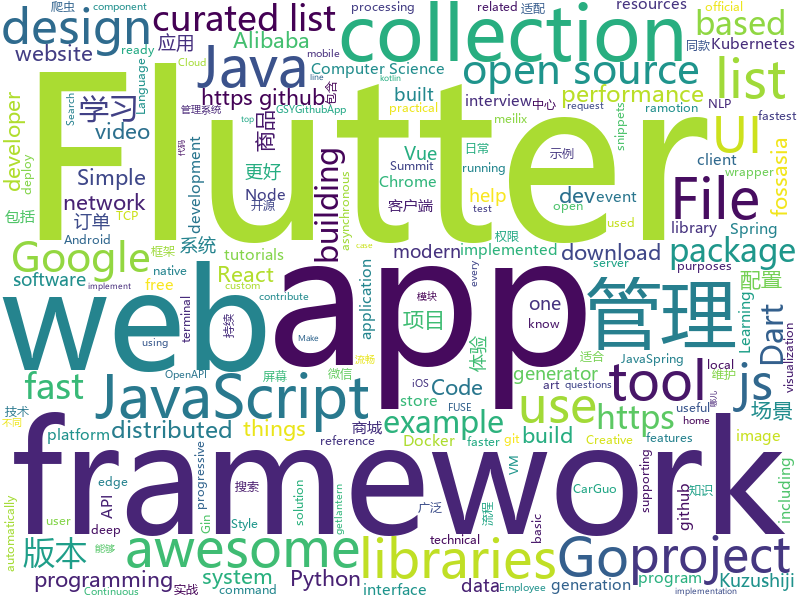

# 2018-12-10
See what the GitHub community is most excited about today.

## python
* [jax](https://github.com/google/jax)(**409 stars today**): GPU- and TPU-backed NumPy with differentiation and JIT compilation.
* [loguru](https://github.com/Delgan/loguru)(**386 stars today**): Python logging made (stupidly) simple
* [wtfpython](https://github.com/satwikkansal/wtfpython)(**138 stars today**): A collection of surprising Python snippets and lesser-known features.
* [loss-landscape](https://github.com/tomgoldstein/loss-landscape)(**84 stars today**): Code for visualizing the loss landscape of neural nets
* [weixin_crawler](https://github.com/wonderfulsuccess/weixin_crawler)(**73 stars today**): 高效微信公众号历史文章和阅读数据爬虫powered by scrapy
* [dgl](https://github.com/dmlc/dgl)(**70 stars today**): Python package built to ease deep learning on graph, on top of existing DL frameworks.
* [TensorFlow-Course](https://github.com/open-source-for-science/TensorFlow-Course)(**71 stars today**): Simple and ready-to-use tutorials for TensorFlow
* [youtube-dl](https://github.com/rg3/youtube-dl)(**53 stars today**): Command-line program to download videos from YouTube.com and other video sites
* [models](https://github.com/tensorflow/models)(**31 stars today**): Models and examples built with TensorFlow
* [system-design-primer](https://github.com/donnemartin/system-design-primer)(**40 stars today**): Learn how to design large-scale systems. Prep for the system design interview. Includes Anki flashcards.
* [kmnist](https://github.com/rois-codh/kmnist)(**43 stars today**): Repository for Kuzushiji-MNIST, Kuzushiji-49, and Kuzushiji-Kanji
* [SSD](https://github.com/lufficc/SSD)(**43 stars today**): High quality, fast, modular reference implementation of SSD in PyTorch 1.0
* [Python](https://github.com/TheAlgorithms/Python)(**36 stars today**): All Algorithms implemented in Python
* [wtfpython-cn](https://github.com/leisurelicht/wtfpython-cn)(**38 stars today**): wtfpython的中文翻译/施工结束/ 能力有限，欢迎帮我改进翻译
* [DNOISE](https://github.com/grantwilk/DNOISE)(**34 stars today**): 
* [keras](https://github.com/keras-team/keras)(**28 stars today**): Deep Learning for humans
* [d2l-zh](https://github.com/diveintodeeplearning/d2l-zh)(**29 stars today**): 《动手学深度学习》
* [shadowsocks](https://github.com/shadowsocks/shadowsocks)(**27 stars today**): 
* [django](https://github.com/django/django)(**26 stars today**): The Web framework for perfectionists with deadlines.
* [meshroom](https://github.com/alicevision/meshroom)(**29 stars today**): 3D Reconstruction Software
* [tldr](https://github.com/tldr-pages/tldr)(**28 stars today**): 📚Simplified and community-driven man pages
* [public-apis](https://github.com/toddmotto/public-apis)(**26 stars today**): A collective list of free APIs for use in software and web development.
* [bert](https://github.com/google-research/bert)(**24 stars today**): TensorFlow code and pre-trained models for BERT
* [home-assistant](https://github.com/home-assistant/home-assistant)(**23 stars today**): 🏡Open source home automation that puts local control and privacy first
* [cpython](https://github.com/python/cpython)(**21 stars today**): The Python programming language

## java
* [qmq](https://github.com/qunarcorp/qmq)(**119 stars today**): QMQ是去哪儿网内部广泛使用的消息中间件，自2012年诞生以来在去哪儿网所有业务场景中广泛的应用，包括跟交易息息相关的订单场景； 也包括报价搜索等高吞吐量场景。
* [JavaGuide](https://github.com/Snailclimb/JavaGuide)(**94 stars today**): 【Java学习+面试指南】 一份涵盖大部分Java程序员所需要掌握的核心知识。
* [tech-weekly](https://github.com/mercyblitz/tech-weekly)(**72 stars today**): 「小马哥技术周报」
* [JAViewer](https://github.com/SplashCodes/JAViewer)(**46 stars today**): 更优雅的驾车体验
* [arthas](https://github.com/alibaba/arthas)(**39 stars today**): Alibaba Java Diagnostic Tool Arthas/Alibaba Java诊断利器Arthas
* [mall](https://github.com/macrozheng/mall)(**36 stars today**): mall项目是一套电商系统，包括前台商城系统及后台管理系统，基于SpringBoot+MyBatis实现。 前台商城系统包含首页门户、商品推荐、商品搜索、商品展示、购物车、订单流程、会员中心、客户服务、帮助中心等模块。 后台管理系统包含商品管理、订单管理、会员管理、促销管理、运营管理、内容管理、统计报表、财务管理、权限管理、设置等模块。
* [spring-boot](https://github.com/spring-projects/spring-boot)(**29 stars today**): Spring Boot
* [tutorials](https://github.com/eugenp/tutorials)(**25 stars today**): The "REST With Spring" Course:
* [symphony](https://github.com/b3log/symphony)(**25 stars today**): 🎶一款用 Java 实现的现代化社区（论坛/BBS/社交网络/博客）平台。https://hacpai.com
* [java-design-patterns](https://github.com/iluwatar/java-design-patterns)(**21 stars today**): Design patterns implemented in Java
* [spring-framework](https://github.com/spring-projects/spring-framework)(**21 stars today**): Spring Framework
* [elasticsearch](https://github.com/elastic/elasticsearch)(**21 stars today**): Open Source, Distributed, RESTful Search Engine
* [Java](https://github.com/TheAlgorithms/Java)(**18 stars today**): All Algorithms implemented in Java
* [spring-cloud-alibaba](https://github.com/spring-cloud-incubator/spring-cloud-alibaba)(**17 stars today**): Spring Cloud Alibaba provides a one-stop solution for application development for the distributed solutions of Alibaba middleware.
* [android-ui-animation-components-and-libraries](https://github.com/Ramotion/android-ui-animation-components-and-libraries)(**18 stars today**): Android UI libraries, components and animations by @Ramotion - https://dev.ramotion.com/gthbr
* [litemall](https://github.com/linlinjava/litemall)(**14 stars today**): 又一个小商城。litemall = Spring Boot后端 + Vue管理员前端 + 微信小程序用户前端
* [graal](https://github.com/oracle/graal)(**17 stars today**): GraalVM: Run Programs Faster Anywhere🚀
* [RxJava](https://github.com/ReactiveX/RxJava)(**15 stars today**): RxJava – Reactive Extensions for the JVM – a library for composing asynchronous and event-based programs using observable sequences for the Java VM.
* [incubator-dubbo](https://github.com/apache/incubator-dubbo)(**12 stars today**): Apache Dubbo (incubating) is a high-performance, java based, open source RPC framework.
* [netty](https://github.com/netty/netty)(**14 stars today**): Netty project - an event-driven asynchronous network application framework
* [kafka](https://github.com/apache/kafka)(**14 stars today**): Mirror of Apache Kafka
* [apollo](https://github.com/ctripcorp/apollo)(**13 stars today**): Apollo（阿波罗）是携程框架部门研发的分布式配置中心，能够集中化管理应用不同环境、不同集群的配置，配置修改后能够实时推送到应用端，并且具备规范的权限、流程治理等特性，适用于微服务配置管理场景。
* [jerryWebSpider](https://github.com/jrhu05/jerryWebSpider)(**12 stars today**): web爬虫合集
* [event-sourcing-microservices-basics](https://github.com/kbastani/event-sourcing-microservices-basics)(**13 stars today**): Learn how to deploy a social network that uses event sourcing with Kubernetes and Docker Stacks
* [mybatis-3](https://github.com/mybatis/mybatis-3)(**10 stars today**): MyBatis SQL mapper framework for Java

## unknown
* [MSEdge](https://github.com/MicrosoftEdge/MSEdge)(**136 stars today**): Microsoft Edge
* [CS-Notes](https://github.com/CyC2018/CS-Notes)(**115 stars today**): 📚Computer Science Learning Notes
* [You-Dont-Know-JS](https://github.com/getify/You-Dont-Know-JS)(**43 stars today**): A book series on JavaScript. @YDKJS on twitter.
* [gitignore](https://github.com/github/gitignore)(**27 stars today**): A collection of useful .gitignore templates
* [free-programming-books](https://github.com/EbookFoundation/free-programming-books)(**35 stars today**): 📚Freely available programming books
* [The-Economist](https://github.com/nailperry-zd/The-Economist)(**37 stars today**): The Economist 经济学人，持续更新
* [Cheatsheet-God](https://github.com/OlivierLaflamme/Cheatsheet-God)(**30 stars today**): Penetration Testing / OSCP Biggest Reference Bank / Cheatsheet
* [awesome-vue](https://github.com/vuejs/awesome-vue)(**24 stars today**): 🎉A curated list of awesome things related to Vue.js
* [pentest-guide](https://github.com/Voorivex/pentest-guide)(**23 stars today**): Penetration tests cases, resources and guidelines.
* [Projects](https://github.com/karan/Projects)(**22 stars today**): 📃A list of practical projects that anyone can solve in any programming language.
* [project-based-learning](https://github.com/tuvtran/project-based-learning)(**21 stars today**): Curated list of project-based tutorials
* [first-contributions](https://github.com/firstcontributions/first-contributions)(**10 stars today**): 🚀✨Help beginners to contribute to open source projects
* [practical-fm](https://github.com/ligurio/practical-fm)(**21 stars today**): A gently curated list of companies using verification formal methods in industry
* [computer-science](https://github.com/ossu/computer-science)(**20 stars today**): 🎓Path to a free self-taught education in Computer Science!
* [vulns](https://github.com/hannob/vulns)(**20 stars today**): Named vulnerabilities and their practical impact
* [advanced-java](https://github.com/doocs/advanced-java)(**17 stars today**): 😮互联网 Java 工程师进阶知识完全扫盲
* [every-programmer-should-know](https://github.com/mtdvio/every-programmer-should-know)(**20 stars today**): A collection of (mostly) technical things every software developer should know
* [awesome-casestudy](https://github.com/luruke/awesome-casestudy)(**18 stars today**): 📕Curated list of technical case studies around WebGL and creative development
* [Awesome_APIs](https://github.com/TonnyL/Awesome_APIs)(**17 stars today**): A collection of APIs
* [awesome-interview-questions](https://github.com/MaximAbramchuck/awesome-interview-questions)(**15 stars today**): A curated awesome list of lists of interview questions. Feel free to contribute!🎓
* [handbook](https://github.com/basecamp/handbook)(**15 stars today**): Basecamp Employee Handbook
* [chromium](https://github.com/chromium/chromium)(**13 stars today**): The official GitHub mirror of the Chromium source
* [awesome-react](https://github.com/enaqx/awesome-react)(**15 stars today**): A collection of awesome things regarding React ecosystem.
* [awesome-cpp](https://github.com/fffaraz/awesome-cpp)(**14 stars today**): A curated list of awesome C++ (or C) frameworks, libraries, resources, and shiny things. Inspired by awesome-... stuff.
* [i-am-chinese-the-dragonfly-must-go-on](https://github.com/ithinco/i-am-chinese-the-dragonfly-must-go-on)(**14 stars today**): A response to “We are Google employees, Google must drop DragonFly”

## javascript
* [jsPDF](https://github.com/MrRio/jsPDF)(**277 stars today**): Client-side JavaScript PDF generation for everyone.
* [sharp](https://github.com/lovell/sharp)(**129 stars today**): High performance Node.js image processing, the fastest module to resize JPEG, PNG, WebP and TIFF images. Uses the libvips library.
* [vue](https://github.com/vuejs/vue)(**71 stars today**): 🖖A progressive, incrementally-adoptable JavaScript framework for building UI on the web.
* [overreacted.io](https://github.com/gaearon/overreacted.io)(**69 stars today**): Personal blog by Dan Abramov.
* [learnGitBranching](https://github.com/pcottle/learnGitBranching)(**64 stars today**): An interactive git visualization to challenge and educate!
* [puppeteer](https://github.com/GoogleChrome/puppeteer)(**57 stars today**): Headless Chrome Node API
* [react](https://github.com/facebook/react)(**48 stars today**): A declarative, efficient, and flexible JavaScript library for building user interfaces.
* [edex-ui](https://github.com/GitSquared/edex-ui)(**50 stars today**): A science fiction terminal emulator designed for large touchscreens that runs on all major OSs.
* [gatsby](https://github.com/gatsbyjs/gatsby)(**47 stars today**): Build blazing fast, modern apps and websites with React
* [30-seconds-of-code](https://github.com/30-seconds/30-seconds-of-code)(**45 stars today**): Curated collection of useful JavaScript snippets that you can understand in 30 seconds or less.
* [screenshoteer](https://github.com/vladocar/screenshoteer)(**44 stars today**): Make website screenshots and mobile emulations from the command line.
* [33-js-concepts](https://github.com/leonardomso/33-js-concepts)(**42 stars today**): 📜33 concepts every JavaScript developer should know.
* [programmers-introduction-to-mathematics](https://github.com/pim-book/programmers-introduction-to-mathematics)(**38 stars today**): Code for A Programmer's Introduction to Mathematics
* [tui.editor](https://github.com/nhnent/tui.editor)(**38 stars today**): 🍞📝Markdown WYSIWYG Editor. GFM Standard + Chart & UML Extensible.
* [video.js](https://github.com/videojs/video.js)(**35 stars today**): Video.js - open source HTML5 & Flash video player
* [create-react-app](https://github.com/facebook/create-react-app)(**29 stars today**): Set up a modern web app by running one command.
* [qov](https://github.com/chunqiuyiyu/qov)(**34 stars today**): The terminal presentation tool.
* [nuxt.js](https://github.com/nuxt/nuxt.js)(**32 stars today**): The Vue.js Developers Framework
* [javascript](https://github.com/airbnb/javascript)(**30 stars today**): JavaScript Style Guide
* [awesome-ui-component-library](https://github.com/anubhavsrivastava/awesome-ui-component-library)(**32 stars today**): Curated list of framework component libraries for UI styles/toolkit
* [node](https://github.com/nodejs/node)(**28 stars today**): Node.js JavaScript runtime✨🐢🚀✨
* [alp-fail](https://github.com/terencehuynh/alp-fail)(**5 stars today**): #aabill
* [next.js](https://github.com/zeit/next.js)(**26 stars today**): The React Framework
* [ant-design-pro](https://github.com/ant-design/ant-design-pro)(**25 stars today**): 👨🏻‍💻👩🏻‍💻 Use Ant Design like a Pro!
* [omdb-graphql-wrapper](https://github.com/xxczaki/omdb-graphql-wrapper)(**29 stars today**): 🚀GraphQL wrapper for the OMDb API

## html
* [NLP-progress](https://github.com/sebastianruder/NLP-progress)(**70 stars today**): Repository to track the progress in Natural Language Processing (NLP), including the datasets and the current state-of-the-art for the most common NLP tasks.
* [nginxconfig.io](https://github.com/valentinxxx/nginxconfig.io)(**22 stars today**): ⚙️NGiИX config generator generator on steroids💉
* [design-blocks](https://github.com/froala/design-blocks)(**20 stars today**): A set of 170+ Bootstrap based design blocks ready to be used to create clean modern websites.
* [flutter-in-action](https://github.com/flutterchina/flutter-in-action)(**11 stars today**): 《Flutter实战》电子书
* [Front-end-Developer-Interview-Questions](https://github.com/h5bp/Front-end-Developer-Interview-Questions)(**12 stars today**): A list of helpful front-end related questions you can use to interview potential candidates, test yourself or completely ignore.
* [react-redux](https://github.com/reduxjs/react-redux)(**12 stars today**): Official React bindings for Redux
* [ionic](https://github.com/ionic-team/ionic)(**10 stars today**): Build amazing native and progressive web apps with open web technologies. One app running on everything🎉
* [portainer](https://github.com/portainer/portainer)(**9 stars today**): Simple management UI for Docker
* [Spoon-Knife](https://github.com/octocat/Spoon-Knife)(****): This repo is for demonstration purposes only.
* [JavaScript30](https://github.com/wesbos/JavaScript30)(**6 stars today**): 30 Day Vanilla JS Challenge
* [now-github-starter](https://github.com/zeit/now-github-starter)(****): Starter project to demonstrate a project whose pull requests get automatically deployed
* [styleguide](https://github.com/google/styleguide)(**7 stars today**): Style guides for Google-originated open-source projects
* [awesome-creative-coding](https://github.com/terkelg/awesome-creative-coding)(**6 stars today**): 🎨Creative Coding: Generative Art, Data visualization, Interaction Design, Resources.
* [openapi-generator](https://github.com/OpenAPITools/openapi-generator)(**6 stars today**): OpenAPI Generator allows generation of API client libraries (SDK generation), server stubs, documentation and configuration automatically given an OpenAPI Spec (v2, v3)
* [2018.fossasia.org](https://github.com/fossasia/2018.fossasia.org)(**6 stars today**): FOSSASIA Summit 2018 https://2018.fossasia.org
* [meilix-generator](https://github.com/fossasia/meilix-generator)(**6 stars today**): WebApp for generating a custom ISO image based on Meilix http://meilix.org
* [fastText](https://github.com/facebookresearch/fastText)(**6 stars today**): Library for fast text representation and classification.
* [2019.fossasia.org](https://github.com/fossasia/2019.fossasia.org)(**6 stars today**): FOSSASIA Summit 2019 https://2019.fossasia.org
* [fonts](https://github.com/google/fonts)(**5 stars today**): Font files available from Google Fonts
* [ecma262](https://github.com/tc39/ecma262)(**5 stars today**): Status, process, and documents for ECMA262
* [tiny-slider](https://github.com/ganlanyuan/tiny-slider)(**5 stars today**): Vanilla javascript slider for all purposes.
* [proposal-hashbang](https://github.com/tc39/proposal-hashbang)(**5 stars today**): #! for JS
* [home-assistant.io](https://github.com/home-assistant/home-assistant.io)(****): 📘Home Assistant User documentation
* [node-js-getting-started](https://github.com/heroku/node-js-getting-started)(****): Getting Started with Node on Heroku
* [cs-exams](https://github.com/nating/cs-exams)(****): Examination preparation material for Computer Science students at Trinity College Dublin.

## dart
* [flutter](https://github.com/flutter/flutter)(**186 stars today**): Flutter makes it easy and fast to build beautiful mobile apps.
* [awesome-flutter](https://github.com/Solido/awesome-flutter)(**99 stars today**): An awesome list that curates the best Flutter libraries, tools, tutorials, articles and more.
* [plugins](https://github.com/flutter/plugins)(**20 stars today**): Plugins for Flutter, including FlutterFire, maintained by the Flutter team
* [Flare-Flutter](https://github.com/2d-inc/Flare-Flutter)(**19 stars today**): 
* [flutter-writting-prompt](https://github.com/Vanethos/flutter-writting-prompt)(**18 stars today**): Flutter example app used to show Writing Prompts to the user
* [samples](https://github.com/flutter/samples)(**13 stars today**): A collection of Flutter examples and demos.
* [flutter-examples](https://github.com/nisrulz/flutter-examples)(**10 stars today**): [Examples] Simple basic isolated apps, for budding flutter devs.
* [dio](https://github.com/flutterchina/dio)(**9 stars today**): A powerful Http client for Dart, which supports Interceptors, FormData, Request Cancellation, File Downloading, Timeout etc.
* [Flutter-UI-Kit](https://github.com/iampawan/Flutter-UI-Kit)(**9 stars today**): Flutter app for collection of UI in a UIKit
* [sdk](https://github.com/dart-lang/sdk)(**9 stars today**): The Dart SDK, including the VM, dart2js, core libraries, and more.
* [flutter_architecture_samples](https://github.com/brianegan/flutter_architecture_samples)(**8 stars today**): TodoMVC for Flutter
* [GSYGithubAppFlutter](https://github.com/CarGuo/GSYGithubAppFlutter)(**8 stars today**): 超完整的Flutter项目，功能丰富，适合学习和日常使用。GSYGithubApp系列的优势：我们目前已经拥有Flutter、Weex、ReactNative、kotlin 四个版本。 功能齐全，项目框架内技术涉及面广，完成度高，持续维护，配套文章，适合全面学习，对比参考。跨平台的开源Github客户端App，更好的体验，更丰富的功能，旨在更好的日常管理和维护个人Github，提供更好更方便的驾车体验Σ(￣。￣ﾉ)ﾉ。同款Weex版本 ： https://github.com/CarGuo/GSYGithubAppWeex 、同款React Native版本 ： https://github.com/CarGuo/GSYGithubApp 、原生 kotlin 版本 https://g…
* [bloc](https://github.com/felangel/bloc)(**7 stars today**): A collection of packages that help implement the BLoC design pattern
* [flutter-developers](https://github.com/lukepighetti/flutter-developers)(**7 stars today**): A showcase app for Flutter Developers
* [flame](https://github.com/luanpotter/flame)(**5 stars today**): A minimalist Flutter game engine
* [flutter_ScreenUtil](https://github.com/OpenFlutter/flutter_ScreenUtil)(**5 stars today**): flutter 屏幕适配 ，字体适配，获取屏幕信息
* [website](https://github.com/flutter/website)(****): Flutter web site
* [flutter-mapbox-gl](https://github.com/mapbox/flutter-mapbox-gl)(****): A Mapbox GL flutter package for creating custom maps
* [flutter_screen](https://github.com/clovisnicolas/flutter_screen)(****): 
* [chromedeveditor](https://github.com/googlearchive/chromedeveditor)(****): Chrome Dev Editor is a developer tool for building apps on the Chrome platform - Chrome Apps and Web Apps, in JavaScript or Dart. (NO LONGER IN ACTIVE DEVELOPMENT)
* [FlutterExampleApps](https://github.com/iampawan/FlutterExampleApps)(****): [Example APPS] Basic Flutter apps, for flutter devs.
* [inKino](https://github.com/roughike/inKino)(****): A multiplatform Dart movie app with 40% of code sharing between Flutter and the Web.
* [Flutter-learning](https://github.com/AweiLoveAndroid/Flutter-learning)(****): 🔥👍🌟⭐️⭐️⭐️Flutter安装和配置，Flutter开发遇到的难题，Flutter示例代码和模板，Flutter项目实战，Dart语言学习示例代码。
* [flutter-osc](https://github.com/yubo725/flutter-osc)(****): 基于Google Flutter的开源中国客户端，支持Android和iOS。
* [zhihu-flutter](https://github.com/HackSoul/zhihu-flutter)(****): Flutter 高仿知乎 UI，非常漂亮，也非常流畅，flutter build apk 或 flutter build ios 之后更流畅

## go
* [Ethr](https://github.com/Microsoft/Ethr)(**142 stars today**): Ethr is a Network Performance Measurement Tool for TCP, UDP & HTTP.
* [dive](https://github.com/wagoodman/dive)(**51 stars today**): A tool for exploring each layer in a docker image
* [go](https://github.com/golang/go)(**47 stars today**): The Go programming language
* [v2ray-core](https://github.com/v2ray/v2ray-core)(**38 stars today**): A platform for building proxies to bypass network restrictions.
* [kubernetes](https://github.com/kubernetes/kubernetes)(**33 stars today**): Production-Grade Container Scheduling and Management
* [openedge](https://github.com/baidu/openedge)(**31 stars today**): Extend cloud computing, data and service seamlessly to edge devices.
* [compose-on-kubernetes](https://github.com/docker/compose-on-kubernetes)(**29 stars today**): Deploy applications described in Compose onto Kubernetes clusters
* [frp](https://github.com/fatedier/frp)(**27 stars today**): A fast reverse proxy to help you expose a local server behind a NAT or firewall to the internet.
* [brig](https://github.com/sahib/brig)(**28 stars today**): File synchronization on top of ipfs with git like interface and FUSE filesystem
* [awesome-go](https://github.com/avelino/awesome-go)(**26 stars today**): A curated list of awesome Go frameworks, libraries and software
* [ff](https://github.com/peterbourgon/ff)(**27 stars today**): Flags-first package for configuration
* [hugo](https://github.com/gohugoio/hugo)(**25 stars today**): The world’s fastest framework for building websites.
* [BaiduPCS-Go](https://github.com/iikira/BaiduPCS-Go)(**25 stars today**): 百度网盘客户端 - Go语言编写
* [lantern](https://github.com/getlantern/lantern)(**22 stars today**): 🔴蓝灯最新版本下载 https://github.com/getlantern/download🔴Lantern Latest Download https://github.com/getlantern/download🔴
* [starlight](https://github.com/starlight-go/starlight)(**23 stars today**): a go wrapper for google's starlark embedded python language
* [lemonade](https://github.com/lemonade-command/lemonade)(**21 stars today**): Lemonade is a remote utility tool. (copy, paste and open browser) over TCP.
* [etcd](https://github.com/etcd-io/etcd)(**20 stars today**): Distributed reliable key-value store for the most critical data of a distributed system
* [mongo-go-driver](https://github.com/mongodb/mongo-go-driver)(**20 stars today**): The Go driver for MongoDB
* [sourcegraph](https://github.com/sourcegraph/sourcegraph)(**20 stars today**): Code search and intelligence, self-hosted and scalable
* [websocket](https://github.com/gorilla/websocket)(**18 stars today**): A WebSocket implementation for Go.
* [syncthing](https://github.com/syncthing/syncthing)(**17 stars today**): Open Source Continuous File Synchronization
* [drone](https://github.com/drone/drone)(**17 stars today**): Drone is a Continuous Delivery platform built on Docker, written in Go
* [helm](https://github.com/helm/helm)(**15 stars today**): The Kubernetes Package Manager
* [seaweedfs](https://github.com/chrislusf/seaweedfs)(**15 stars today**): SeaweedFS is a simple and highly scalable distributed file system. There are two objectives: to store billions of files! to serve the files fast! SeaweedFS implements an object store with O(1) disk seek and an optional Filer with POSIX interface, supporting FUSE mount, supporting Hadoop Compatible File System.
* [gin](https://github.com/gin-gonic/gin)(**15 stars today**): Gin is a HTTP web framework written in Go (Golang). It features a Martini-like API with much better performance -- up to 40 times faster. If you need smashing performance, get yourself some Gin.

## WordCloud

