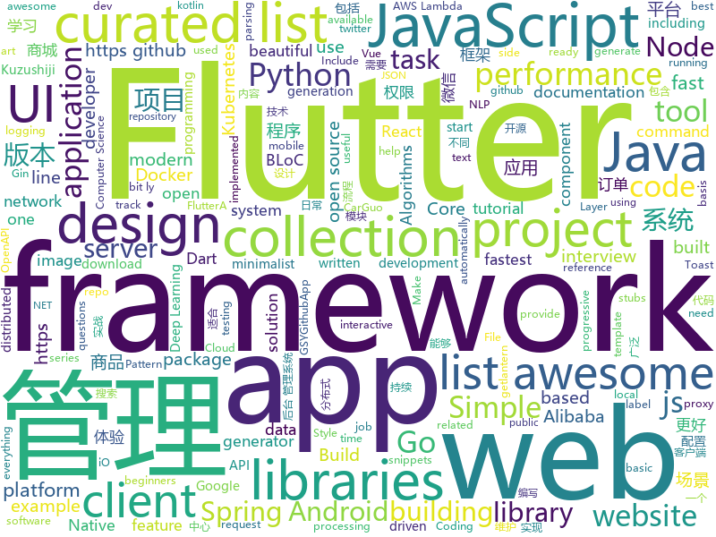

# 2018-12-11
See what the GitHub community is most excited about today.

## python
* [loguru](https://github.com/Delgan/loguru)(**418 stars today**): Python logging made (stupidly) simple
* [jax](https://github.com/google/jax)(**306 stars today**): GPU- and TPU-backed NumPy with differentiation and JIT compilation.
* [walle-web](https://github.com/meolu/walle-web)(**288 stars today**): walle - 瓦力 开源项目代码部署平台
* [wtfpython](https://github.com/satwikkansal/wtfpython)(**208 stars today**): A collection of surprising Python snippets and lesser-known features.
* [weixin_crawler](https://github.com/wonderfulsuccess/weixin_crawler)(**181 stars today**): 高效微信公众号历史文章和阅读数据爬虫powered by scrapy
* [wtfpython-cn](https://github.com/leisurelicht/wtfpython-cn)(**115 stars today**): wtfpython的中文翻译/施工结束/ 能力有限，欢迎帮我改进翻译
* [models](https://github.com/tensorflow/models)(**72 stars today**): Models and examples built with TensorFlow
* [pytorch-tutorial](https://github.com/yunjey/pytorch-tutorial)(**76 stars today**): PyTorch Tutorial for Deep Learning Researchers
* [bert](https://github.com/google-research/bert)(**78 stars today**): TensorFlow code and pre-trained models for BERT
* [dgl](https://github.com/dmlc/dgl)(**66 stars today**): Python package built to ease deep learning on graph, on top of existing DL frameworks.
* [TensorFlow-Course](https://github.com/open-source-for-science/TensorFlow-Course)(**63 stars today**): Simple and ready-to-use tutorials for TensorFlow
* [PySyft](https://github.com/OpenMined/PySyft)(**64 stars today**): A library for encrypted, privacy preserving deep learning
* [SSD](https://github.com/lufficc/SSD)(**63 stars today**): High quality, fast, modular reference implementation of SSD in PyTorch 1.0
* [bash-lambda-layer](https://github.com/gkrizek/bash-lambda-layer)(**63 stars today**): Run Bash scripts in AWS Lambda via Layers
* [Varken](https://github.com/Boerderij/Varken)(**58 stars today**): Standalone command-line utility to aggregate data from the Plex ecosystem into InfluxDB
* [awesome-python](https://github.com/vinta/awesome-python)(**56 stars today**): A curated list of awesome Python frameworks, libraries, software and resources
* [system-design-primer](https://github.com/donnemartin/system-design-primer)(**54 stars today**): Learn how to design large-scale systems. Prep for the system design interview. Includes Anki flashcards.
* [faceswap](https://github.com/deepfakes/faceswap)(**48 stars today**): Non official project based on original /r/Deepfakes thread. Many thanks to him!
* [wtfiswronghere](https://github.com/qxf2/wtfiswronghere)(**51 stars today**): A collection of simple errors that beginners are likely to hit when they start writing Python.
* [keras](https://github.com/keras-team/keras)(**48 stars today**): Deep Learning for humans
* [loss-landscape](https://github.com/tomgoldstein/loss-landscape)(**52 stars today**): Code for visualizing the loss landscape of neural nets
* [shadowsocks](https://github.com/shadowsocks/shadowsocks)(**45 stars today**): 
* [Python](https://github.com/TheAlgorithms/Python)(**47 stars today**): All Algorithms implemented in Python
* [kmnist](https://github.com/rois-codh/kmnist)(**45 stars today**): Repository for Kuzushiji-MNIST, Kuzushiji-49, and Kuzushiji-Kanji
* [secure](https://github.com/cakinney/secure)(**44 stars today**): Secure🔒headers and cookies for Python web frameworks

## java
* [JavaGuide](https://github.com/Snailclimb/JavaGuide)(**216 stars today**): 【Java学习+面试指南】 一份涵盖大部分Java程序员所需要掌握的核心知识。
* [qmq](https://github.com/qunarcorp/qmq)(**160 stars today**): QMQ是去哪儿网内部广泛使用的消息中间件，自2012年诞生以来在去哪儿网所有业务场景中广泛的应用，包括跟交易息息相关的订单场景； 也包括报价搜索等高吞吐量场景。
* [tech-weekly](https://github.com/mercyblitz/tech-weekly)(**122 stars today**): 「小马哥技术周报」
* [arthas](https://github.com/alibaba/arthas)(**82 stars today**): Alibaba Java Diagnostic Tool Arthas/Alibaba Java诊断利器Arthas
* [mall](https://github.com/macrozheng/mall)(**71 stars today**): mall项目是一套电商系统，包括前台商城系统及后台管理系统，基于SpringBoot+MyBatis实现。 前台商城系统包含首页门户、商品推荐、商品搜索、商品展示、购物车、订单流程、会员中心、客户服务、帮助中心等模块。 后台管理系统包含商品管理、订单管理、会员管理、促销管理、运营管理、内容管理、统计报表、财务管理、权限管理、设置等模块。
* [JAViewer](https://github.com/SplashCodes/JAViewer)(**67 stars today**): 更优雅的驾车体验
* [spring-boot](https://github.com/spring-projects/spring-boot)(**58 stars today**): Spring Boot
* [tutorials](https://github.com/eugenp/tutorials)(**35 stars today**): The "REST With Spring" Course:
* [litemall](https://github.com/linlinjava/litemall)(**48 stars today**): 又一个小商城。litemall = Spring Boot后端 + Vue管理员前端 + 微信小程序用户前端
* [android-ui-animation-components-and-libraries](https://github.com/Ramotion/android-ui-animation-components-and-libraries)(**50 stars today**): Android UI libraries, components and animations by @Ramotion - https://dev.ramotion.com/gthbr
* [incubator-dubbo](https://github.com/apache/incubator-dubbo)(**38 stars today**): Apache Dubbo (incubating) is a high-performance, java based, open source RPC framework.
* [apollo](https://github.com/ctripcorp/apollo)(**38 stars today**): Apollo（阿波罗）是携程框架部门研发的分布式配置中心，能够集中化管理应用不同环境、不同集群的配置，配置修改后能够实时推送到应用端，并且具备规范的权限、流程治理等特性，适用于微服务配置管理场景。
* [symphony](https://github.com/b3log/symphony)(**37 stars today**): 🎶一款用 Java 实现的现代化社区（论坛/BBS/社交网络/博客）平台。https://hacpai.com
* [spring-framework](https://github.com/spring-projects/spring-framework)(**28 stars today**): Spring Framework
* [DToast](https://github.com/Dovar66/DToast)(**36 stars today**): 同学，你的系统Toast可能需要修复一下！Fix Your Android Toast!
* [JCSprout](https://github.com/crossoverJie/JCSprout)(**34 stars today**): 👨‍🎓Java Core Sprout : basic, concurrent, algorithm
* [Java](https://github.com/TheAlgorithms/Java)(**32 stars today**): All Algorithms implemented in Java
* [elasticsearch](https://github.com/elastic/elasticsearch)(**31 stars today**): Open Source, Distributed, RESTful Search Engine
* [okhttp](https://github.com/square/okhttp)(**32 stars today**): An HTTP+HTTP/2 client for Android and Java applications.
* [spring-cloud-alibaba](https://github.com/spring-cloud-incubator/spring-cloud-alibaba)(**29 stars today**): Spring Cloud Alibaba provides a one-stop solution for application development for the distributed solutions of Alibaba middleware.
* [ArgusAPM](https://github.com/Qihoo360/ArgusAPM)(**30 stars today**): Powerful, comprehensive (Android) application performance management platform. 360移动性能监控平台
* [guava](https://github.com/google/guava)(**24 stars today**): Google core libraries for Java
* [rocketmq-spring](https://github.com/apache/rocketmq-spring)(**24 stars today**): Apache RocketMQ Spring Integration
* [xxl-job](https://github.com/xuxueli/xxl-job)(**24 stars today**): A lightweight distributed task scheduling framework.（分布式任务调度平台XXL-JOB）
* [netty](https://github.com/netty/netty)(**20 stars today**): Netty project - an event-driven asynchronous network application framework

## unknown
* [CS-Notes](https://github.com/CyC2018/CS-Notes)(**166 stars today**): 📚Computer Science Learning Notes
* [MSEdge](https://github.com/MicrosoftEdge/MSEdge)(**132 stars today**): Microsoft Edge
* [You-Dont-Know-JS](https://github.com/getify/You-Dont-Know-JS)(**66 stars today**): A book series on JavaScript. @YDKJS on twitter.
* [Cheatsheet-God](https://github.com/OlivierLaflamme/Cheatsheet-God)(**63 stars today**): Penetration Testing / OSCP Biggest Reference Bank / Cheatsheet
* [nodebestpractices](https://github.com/i0natan/nodebestpractices)(**66 stars today**): The largest Node.JS best practices list (November 2018)
* [developer-roadmap](https://github.com/kamranahmedse/developer-roadmap)(**60 stars today**): Roadmap to becoming a web developer in 2018
* [gitignore](https://github.com/github/gitignore)(**44 stars today**): A collection of useful .gitignore templates
* [awesome](https://github.com/sindresorhus/awesome)(**55 stars today**): 😎Curated list of awesome lists
* [FAQGURU](https://github.com/FAQGURU/FAQGURU)(**57 stars today**): A list of interview questions. This repository is everything you need to prepare for your technical interview.🎒🚀🎉
* [free-programming-books](https://github.com/EbookFoundation/free-programming-books)(**50 stars today**): 📚Freely available programming books
* [The-Economist](https://github.com/nailperry-zd/The-Economist)(**53 stars today**): The Economist 经济学人，持续更新
* [Awesome-Red-Teaming](https://github.com/yeyintminthuhtut/Awesome-Red-Teaming)(**51 stars today**): List of Awesome Red Teaming Resources
* [practical-fm](https://github.com/ligurio/practical-fm)(**33 stars today**): A gently curated list of companies using verification formal methods in industry
* [awesome-layers](https://github.com/mthenw/awesome-layers)(**31 stars today**): λ A curated list of awesome AWS Lambda Layers.
* [awesome-sysadmin](https://github.com/n1trux/awesome-sysadmin)(**29 stars today**): A curated list of amazingly awesome open source sysadmin resources.
* [awesome-vue](https://github.com/vuejs/awesome-vue)(**27 stars today**): 🎉A curated list of awesome things related to Vue.js
* [frida-all-in-one](https://github.com/hookmaster/frida-all-in-one)(**28 stars today**): 《FRIDA操作手册》by @hluwa @r0ysue
* [vulns](https://github.com/hannob/vulns)(**27 stars today**): Named vulnerabilities and their practical impact
* [awesome-public-datasets](https://github.com/awesomedata/awesome-public-datasets)(**24 stars today**): A topic-centric list of HQ open datasets in public domains. PR ☛☛☛
* [web-tweeps](https://github.com/iRaul/web-tweeps)(**24 stars today**): A curated list of developers / designers / artists on twitter.⚡️
* [computer-science](https://github.com/ossu/computer-science)(**21 stars today**): 🎓Path to a free self-taught education in Computer Science!
* [you-dont-know-js](https://github.com/muzqi/you-dont-know-js)(**22 stars today**): 你不知道的 javascript 读书笔记
* [Ecosystem-Job-Openings](https://github.com/Department-of-Decentralization/Ecosystem-Job-Openings)(**18 stars today**): Please post your job openings here, include contact details. We will be happy to spread the word.
* [awesome-for-beginners](https://github.com/MunGell/awesome-for-beginners)(**21 stars today**): A list of awesome beginners-friendly projects.
* [Python-programming-exercises](https://github.com/zhiwehu/Python-programming-exercises)(**20 stars today**): 100+ Python challenging programming exercises

## javascript
* [jsPDF](https://github.com/MrRio/jsPDF)(**566 stars today**): Client-side JavaScript PDF generation for everyone.
* [sharp](https://github.com/lovell/sharp)(**274 stars today**): High performance Node.js image processing, the fastest module to resize JPEG, PNG, WebP and TIFF images. Uses the libvips library.
* [open-location-code](https://github.com/google/open-location-code)(**244 stars today**): Open Location Code is a library to generate short codes that can be used like street addresses, for places where street addresses don't exist.
* [forgJs](https://github.com/oussamahamdaoui/forgJs)(**162 stars today**): ForgJs is a javascript lightweight object validator. Go check the Quick start section and start coding with love
* [learnGitBranching](https://github.com/pcottle/learnGitBranching)(**145 stars today**): An interactive git visualization to challenge and educate!
* [vue](https://github.com/vuejs/vue)(**120 stars today**): 🖖A progressive, incrementally-adoptable JavaScript framework for building UI on the web.
* [react](https://github.com/facebook/react)(**98 stars today**): A declarative, efficient, and flexible JavaScript library for building user interfaces.
* [gatsby](https://github.com/gatsbyjs/gatsby)(**93 stars today**): Build blazing fast, modern apps and websites with React
* [overreacted.io](https://github.com/gaearon/overreacted.io)(**83 stars today**): Personal blog by Dan Abramov.
* [puppeteer](https://github.com/GoogleChrome/puppeteer)(**78 stars today**): Headless Chrome Node API
* [create-react-app](https://github.com/facebook/create-react-app)(**75 stars today**): Set up a modern web app by running one command.
* [30-seconds-of-code](https://github.com/30-seconds/30-seconds-of-code)(**79 stars today**): Curated collection of useful JavaScript snippets that you can understand in 30 seconds or less.
* [screenshoteer](https://github.com/vladocar/screenshoteer)(**77 stars today**): Make website screenshots and mobile emulations from the command line.
* [programmers-introduction-to-mathematics](https://github.com/pim-book/programmers-introduction-to-mathematics)(**68 stars today**): Code for A Programmer's Introduction to Mathematics
* [algorithm-visualizer](https://github.com/algorithm-visualizer/algorithm-visualizer)(**64 stars today**): 🎆Interactive Online Platform that Visualizes Algorithms from Code
* [awesome-ui-component-library](https://github.com/anubhavsrivastava/awesome-ui-component-library)(**68 stars today**): Curated list of framework component libraries for UI styles/toolkit
* [nbtutor](https://github.com/lgpage/nbtutor)(**64 stars today**): Visualize Python code execution (line-by-line) in Jupyter Notebook cells.
* [tui.editor](https://github.com/nhnent/tui.editor)(**63 stars today**): 🍞📝Markdown WYSIWYG Editor. GFM Standard + Chart & UML Extensible.
* [33-js-concepts](https://github.com/leonardomso/33-js-concepts)(**59 stars today**): 📜33 concepts every JavaScript developer should know.
* [33-js-concepts](https://github.com/stephentian/33-js-concepts)(**55 stars today**): 📜每个 JavaScript 工程师都应懂的33个概念 @leonardomso
* [taro](https://github.com/NervJS/taro)(**54 stars today**): 多端统一开发框架，支持用 React 的开发方式编写一次代码，生成能运行在微信小程序/百度智能小程序/支付宝小程序、H5、React Native 等的应用。 https://taro.js.org/
* [axios](https://github.com/axios/axios)(**55 stars today**): Promise based HTTP client for the browser and node.js
* [qov](https://github.com/chunqiuyiyu/qov)(**57 stars today**): The terminal presentation tool.
* [ncc](https://github.com/zeit/ncc)(**54 stars today**): Node.js Compiler Collection
* [ant-design-pro](https://github.com/ant-design/ant-design-pro)(**47 stars today**): 👨🏻‍💻👩🏻‍💻 Use Ant Design like a Pro!

## html
* [NLP-progress](https://github.com/sebastianruder/NLP-progress)(**50 stars today**): Repository to track the progress in Natural Language Processing (NLP), including the datasets and the current state-of-the-art for the most common NLP tasks.
* [design-blocks](https://github.com/froala/design-blocks)(**35 stars today**): A set of 170+ Bootstrap based design blocks ready to be used to create clean modern websites.
* [flutter-in-action](https://github.com/flutterchina/flutter-in-action)(**32 stars today**): 《Flutter实战》电子书
* [nginxconfig.io](https://github.com/valentinxxx/nginxconfig.io)(**31 stars today**): ⚙️NGiИX config generator generator on steroids💉
* [styleguide](https://github.com/google/styleguide)(**24 stars today**): Style guides for Google-originated open-source projects
* [ionic](https://github.com/ionic-team/ionic)(**16 stars today**): Build amazing native and progressive web apps with open web technologies. One app running on everything🎉
* [Spoon-Knife](https://github.com/octocat/Spoon-Knife)(****): This repo is for demonstration purposes only.
* [Front-end-Developer-Interview-Questions](https://github.com/h5bp/Front-end-Developer-Interview-Questions)(**17 stars today**): A list of helpful front-end related questions you can use to interview potential candidates, test yourself or completely ignore.
* [JavaScript30](https://github.com/wesbos/JavaScript30)(**10 stars today**): 30 Day Vanilla JS Challenge
* [fastText](https://github.com/facebookresearch/fastText)(**14 stars today**): Library for fast text representation and classification.
* [Czar.Cms](https://github.com/yilezhu/Czar.Cms)(**11 stars today**): .NET Core实战项目之CMS系列教程的源码，精简而又功能丰富的权限设计，内容管理设计让你轻松搭建一个ASP.NET Core2.1的网站系统
* [portainer](https://github.com/portainer/portainer)(**12 stars today**): Simple management UI for Docker
* [awesome-creative-coding](https://github.com/terkelg/awesome-creative-coding)(**12 stars today**): 🎨Creative Coding: Generative Art, Data visualization, Interaction Design, Resources.
* [beautiful-jekyll](https://github.com/daattali/beautiful-jekyll)(**5 stars today**): ✨Build a beautiful and simple website in literally minutes. Demo at http://deanattali.com/beautiful-jekyll
* [manuals](https://github.com/skr-shop/manuals)(**8 stars today**): Do design No code📖
* [website](https://github.com/kubernetes/website)(**7 stars today**): Kubernetes website and documentation repo:
* [swagger-codegen](https://github.com/swagger-api/swagger-codegen)(**8 stars today**): swagger-codegen contains a template-driven engine to generate documentation, API clients and server stubs in different languages by parsing your OpenAPI / Swagger definition.
* [now-github-starter](https://github.com/zeit/now-github-starter)(****): Starter project to demonstrate a project whose pull requests get automatically deployed
* [milligram](https://github.com/milligram/milligram)(**8 stars today**): A minimalist CSS framework.
* [primeng](https://github.com/primefaces/primeng)(**6 stars today**): UI Components for Angular
* [openapi-generator](https://github.com/OpenAPITools/openapi-generator)(**7 stars today**): OpenAPI Generator allows generation of API client libraries (SDK generation), server stubs, documentation and configuration automatically given an OpenAPI Spec (v2, v3)
* [proposal-class-fields](https://github.com/tc39/proposal-class-fields)(**8 stars today**): Orthogonally-informed combination of public and private fields proposals
* [requests-html](https://github.com/kennethreitz/requests-html)(**7 stars today**): Pythonic HTML Parsing for Humans™
* [scikit-learn-doc-zh](https://github.com/apachecn/scikit-learn-doc-zh)(**7 stars today**): 📖[译] scikit-learn（sklearn） 中文文档
* [fonts](https://github.com/google/fonts)(**7 stars today**): Font files available from Google Fonts

## dart
* [flutter](https://github.com/flutter/flutter)(**295 stars today**): Flutter makes it easy and fast to build beautiful mobile apps.
* [awesome-flutter](https://github.com/Solido/awesome-flutter)(**212 stars today**): An awesome list that curates the best Flutter libraries, tools, tutorials, articles and more.
* [GSYGithubAppFlutter](https://github.com/CarGuo/GSYGithubAppFlutter)(**37 stars today**): 超完整的Flutter项目，功能丰富，适合学习和日常使用。GSYGithubApp系列的优势：我们目前已经拥有Flutter、Weex、ReactNative、kotlin 四个版本。 功能齐全，项目框架内技术涉及面广，完成度高，持续维护，配套文章，适合全面学习，对比参考。跨平台的开源Github客户端App，更好的体验，更丰富的功能，旨在更好的日常管理和维护个人Github，提供更好更方便的驾车体验Σ(￣。￣ﾉ)ﾉ。同款Weex版本 ： https://github.com/CarGuo/GSYGithubAppWeex 、同款React Native版本 ： https://github.com/CarGuo/GSYGithubApp 、原生 kotlin 版本 https://g…
* [plugins](https://github.com/flutter/plugins)(**29 stars today**): Plugins for Flutter, including FlutterFire, maintained by the Flutter team
* [dio](https://github.com/flutterchina/dio)(**22 stars today**): A powerful Http client for Dart, which supports Interceptors, FormData, Request Cancellation, File Downloading, Timeout etc.
* [samples](https://github.com/flutter/samples)(**18 stars today**): A collection of Flutter examples and demos.
* [deer](https://github.com/aleksanderwozniak/deer)(**18 stars today**): Minimalist Flutter Todo App, built using BLoC pattern
* [Flare-Flutter](https://github.com/2d-inc/Flare-Flutter)(**17 stars today**): 
* [flutter-examples](https://github.com/nisrulz/flutter-examples)(**15 stars today**): [Examples] Simple basic isolated apps, for budding flutter devs.
* [Flutter-UI-Kit](https://github.com/iampawan/Flutter-UI-Kit)(**14 stars today**): Flutter app for collection of UI in a UIKit
* [sdk](https://github.com/dart-lang/sdk)(**11 stars today**): The Dart SDK, including the VM, dart2js, core libraries, and more.
* [website](https://github.com/flutter/website)(**6 stars today**): Flutter web site
* [flutter_ui_challenge_planets_app](https://github.com/rvamsikrishna/flutter_ui_challenge_planets_app)(**7 stars today**): A flutter ui challenge .... building a planets app
* [WhatTodo](https://github.com/burhanrashid52/WhatTodo)(**6 stars today**): A Simple Todo app design in Flutter to keep track of your task on daily basis. Its build on BLoC Pattern. You can add a project, labels, and due-date to your task also you can sort your task on the basis of project, label, and dates
* [bloc](https://github.com/felangel/bloc)(**7 stars today**): A collection of packages that help implement the BLoC design pattern
* [flutter_layout](https://github.com/nb312/flutter_layout)(**7 stars today**): Layout of the flutter example.such as Row,Comlun,listview,Just for learning.
* [flutter_architecture_samples](https://github.com/brianegan/flutter_architecture_samples)(**5 stars today**): TodoMVC for Flutter
* [RealRichText](https://github.com/bytedance/RealRichText)(**5 stars today**): A Tricky Solution for Implementing Inline-Image-In-Text Feature in Flutter.
* [flutter-developers](https://github.com/lukepighetti/flutter-developers)(**5 stars today**): A showcase app for Flutter Developers
* [flutter_study](https://github.com/luhenchang/flutter_study)(**5 stars today**): 三天学会Flutter
* [rxdart](https://github.com/ReactiveX/rxdart)(**5 stars today**): The Reactive Extensions for Dart
* [flame](https://github.com/luanpotter/flame)(**5 stars today**): A minimalist Flutter game engine
* [Flutter4GitLab](https://github.com/stefanJi/Flutter4GitLab)(**5 stars today**): A GitLab client by Flutter.
* [rapido-flutter](https://github.com/rapido-mobile/rapido-flutter)(**5 stars today**): Library for RAD development in Flutter
* [sentry](https://github.com/flutter/sentry)(****): A pure Dart Sentry.io client.

## go
* [Ethr](https://github.com/Microsoft/Ethr)(**259 stars today**): Ethr is a Network Performance Measurement Tool for TCP, UDP & HTTP.
* [dive](https://github.com/wagoodman/dive)(**193 stars today**): A tool for exploring each layer in a docker image
* [kubernetes](https://github.com/kubernetes/kubernetes)(**70 stars today**): Production-Grade Container Scheduling and Management
* [go](https://github.com/golang/go)(**58 stars today**): The Go programming language
* [jl](https://github.com/koenbollen/jl)(**62 stars today**): jl — JSON Logs, a development tool for working with structured JSON logging.
* [mongo-go-driver](https://github.com/mongodb/mongo-go-driver)(**59 stars today**): The Go driver for MongoDB
* [rendora](https://github.com/rendora/rendora)(**60 stars today**): A dynamic renderer to provide zero-conf server-side rendering to web crawlers in order to effortlessly improve SEO for modern javascript websites
* [roadrunner](https://github.com/spiral/roadrunner)(**50 stars today**): High-performance PHP application server, load-balancer and process manager written in Golang
* [compose-on-kubernetes](https://github.com/docker/compose-on-kubernetes)(**46 stars today**): Deploy applications described in Compose onto Kubernetes clusters
* [frp](https://github.com/fatedier/frp)(**42 stars today**): A fast reverse proxy to help you expose a local server behind a NAT or firewall to the internet.
* [awesome-go](https://github.com/avelino/awesome-go)(**41 stars today**): A curated list of awesome Go frameworks, libraries and software
* [v2ray-core](https://github.com/v2ray/v2ray-core)(**40 stars today**): A platform for building proxies to bypass network restrictions.
* [crossplane](https://github.com/crossplaneio/crossplane)(**42 stars today**): An Open Source Multicloud Control Plane
* [BaiduPCS-Go](https://github.com/iikira/BaiduPCS-Go)(**36 stars today**): 百度网盘客户端 - Go语言编写
* [lantern](https://github.com/getlantern/lantern)(**35 stars today**): 🔴蓝灯最新版本下载 https://github.com/getlantern/download🔴Lantern Latest Download https://github.com/getlantern/download🔴
* [drone](https://github.com/drone/drone)(**32 stars today**): Drone is a Continuous Delivery platform built on Docker, written in Go
* [ff](https://github.com/peterbourgon/ff)(**33 stars today**): Flags-first package for configuration
* [openedge](https://github.com/baidu/openedge)(**29 stars today**): Extend cloud computing, data and service seamlessly to edge devices.
* [kind](https://github.com/kubernetes-sigs/kind)(**31 stars today**): Kubernetes IN Docker - local clusters for testing Kubernetes
* [prometheus](https://github.com/prometheus/prometheus)(**30 stars today**): The Prometheus monitoring system and time series database.
* [iris](https://github.com/kataras/iris)(**30 stars today**): The fastest backend community-driven web framework on (THIS) Earth. HTTP/2, MVC and more. Can your favourite web framework do that?👉http://bit.ly/iriscandothat1 or even http://bit.ly/iriscandothat2
* [helm](https://github.com/helm/helm)(**25 stars today**): The Kubernetes Package Manager
* [hugo](https://github.com/gohugoio/hugo)(**26 stars today**): The world’s fastest framework for building websites.
* [gin](https://github.com/gin-gonic/gin)(**25 stars today**): Gin is a HTTP web framework written in Go (Golang). It features a Martini-like API with much better performance -- up to 40 times faster. If you need smashing performance, get yourself some Gin.
* [brook](https://github.com/txthinking/brook)(**25 stars today**): Brook is a cross-platform(Linux/MacOS/Windows/Android/iOS) proxy/vpn software

## WordCloud

