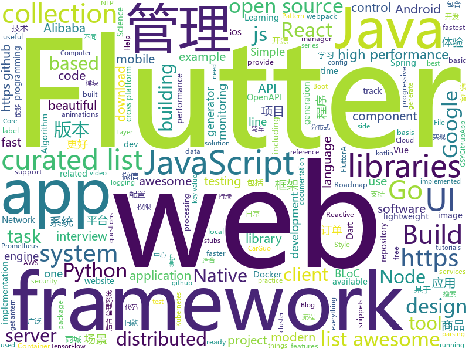

# 2018-12-12
See what the GitHub community is most excited about today.

## python
* [eeeeeeeeeeeeeeeeeeeeeeeeeeeeeeeeeeeeeeeeeeeeeeeeeeeeeeeeeeeeeeeeeeeeeeeeeeeeeeeeeeeeeeeeeeeeeeeeeeee](https://github.com/eeeeeeeeeeeeeeeeeeeeeeeeeeeeeeee/eeeeeeeeeeeeeeeeeeeeeeeeeeeeeeeeeeeeeeeeeeeeeeeeeeeeeeeeeeeeeeeeeeeeeeeeeeeeeeeeeeeeeeeeeeeeeeeeeeee)(**371 stars today**): eeeeeeeeeeeeeeeeeeeeeeeeeeeeeeeeeeeeeeeeeeeeeeeeeeeeeeeeeeeeeeeeeeeee
* [loguru](https://github.com/Delgan/loguru)(**378 stars today**): Python logging made (stupidly) simple
* [jax](https://github.com/google/jax)(**353 stars today**): GPU- and TPU-backed NumPy with differentiation and JIT compilation.
* [weixin_crawler](https://github.com/wonderfulsuccess/weixin_crawler)(**242 stars today**): 高效微信公众号历史文章和阅读数据爬虫powered by scrapy
* [wtfpython](https://github.com/satwikkansal/wtfpython)(**207 stars today**): A collection of surprising Python snippets and lesser-known features.
* [walle-web](https://github.com/meolu/walle-web)(**135 stars today**): walle - 瓦力 开源项目代码部署平台
* [wtfpython-cn](https://github.com/leisurelicht/wtfpython-cn)(**127 stars today**): wtfpython的中文翻译/施工结束/ 能力有限，欢迎帮我改进翻译
* [google-research](https://github.com/google-research/google-research)(**112 stars today**): Google AI Research
* [system-design-primer](https://github.com/donnemartin/system-design-primer)(**90 stars today**): Learn how to design large-scale systems. Prep for the system design interview. Includes Anki flashcards.
* [bert](https://github.com/google-research/bert)(**83 stars today**): TensorFlow code and pre-trained models for BERT
* [models](https://github.com/tensorflow/models)(**57 stars today**): Models and examples built with TensorFlow
* [public-apis](https://github.com/toddmotto/public-apis)(**60 stars today**): A collective list of free APIs for use in software and web development.
* [awesome-python](https://github.com/vinta/awesome-python)(**57 stars today**): A curated list of awesome Python frameworks, libraries, software and resources
* [diyHue](https://github.com/diyhue/diyHue)(**59 stars today**): Main diyHue software repo
* [Python](https://github.com/TheAlgorithms/Python)(**52 stars today**): All Algorithms implemented in Python
* [keras](https://github.com/keras-team/keras)(**49 stars today**): Deep Learning for humans
* [TensorFlow-Course](https://github.com/osforscience/TensorFlow-Course)(**53 stars today**): Simple and ready-to-use tutorials for TensorFlow
* [home-assistant](https://github.com/home-assistant/home-assistant)(**49 stars today**): 🏡Open source home automation that puts local control and privacy first
* [secure](https://github.com/cakinney/secure)(**46 stars today**): Secure🔒headers and cookies for Python web frameworks
* [youtube-dl](https://github.com/rg3/youtube-dl)(**43 stars today**): Command-line program to download videos from YouTube.com and other video sites
* [flask](https://github.com/pallets/flask)(**38 stars today**): The Python micro framework for building web applications.
* [faceswap](https://github.com/deepfakes/faceswap)(**37 stars today**): Non official project based on original /r/Deepfakes thread. Many thanks to him!
* [sentry](https://github.com/getsentry/sentry)(**40 stars today**): Sentry is cross-platform application monitoring, with a focus on error reporting.
* [image-super-resolution](https://github.com/idealo/image-super-resolution)(**39 stars today**): Keras implementation of the Residual Dense Network for super scaling images.
* [SSD](https://github.com/lufficc/SSD)(**37 stars today**): High quality, fast, modular reference implementation of SSD in PyTorch 1.0

## java
* [JavaGuide](https://github.com/Snailclimb/JavaGuide)(**345 stars today**): 【Java学习+面试指南】 一份涵盖大部分Java程序员所需要掌握的核心知识。
* [qmq](https://github.com/qunarcorp/qmq)(**97 stars today**): QMQ是去哪儿网内部广泛使用的消息中间件，自2012年诞生以来在去哪儿网所有业务场景中广泛的应用，包括跟交易息息相关的订单场景； 也包括报价搜索等高吞吐量场景。
* [mall](https://github.com/macrozheng/mall)(**76 stars today**): mall项目是一套电商系统，包括前台商城系统及后台管理系统，基于SpringBoot+MyBatis实现。 前台商城系统包含首页门户、商品推荐、商品搜索、商品展示、购物车、订单流程、会员中心、客户服务、帮助中心等模块。 后台管理系统包含商品管理、订单管理、会员管理、促销管理、运营管理、内容管理、统计报表、财务管理、权限管理、设置等模块。
* [arthas](https://github.com/alibaba/arthas)(**72 stars today**): Alibaba Java Diagnostic Tool Arthas/Alibaba Java诊断利器Arthas
* [spring-boot](https://github.com/spring-projects/spring-boot)(**62 stars today**): Spring Boot
* [tech-weekly](https://github.com/mercyblitz/tech-weekly)(**71 stars today**): 「小马哥技术周报」
* [tutorials](https://github.com/eugenp/tutorials)(**44 stars today**): The "REST With Spring" Course:
* [JCSprout](https://github.com/crossoverJie/JCSprout)(**61 stars today**): 👨‍🎓Java Core Sprout : basic, concurrent, algorithm
* [symphony](https://github.com/b3log/symphony)(**60 stars today**): 🎶一款用 Java 实现的现代化社区（论坛/BBS/社交网络/博客）平台。https://hacpai.com
* [litemall](https://github.com/linlinjava/litemall)(**53 stars today**): 又一个小商城。litemall = Spring Boot后端 + Vue管理员前端 + 微信小程序用户前端
* [spring-cloud-alibaba](https://github.com/spring-cloud-incubator/spring-cloud-alibaba)(**53 stars today**): Spring Cloud Alibaba provides a one-stop solution for application development for the distributed solutions of Alibaba middleware.
* [QMUI_Android](https://github.com/Tencent/QMUI_Android)(**49 stars today**): 提高 Android UI 开发效率的 UI 库
* [incubator-dubbo](https://github.com/apache/incubator-dubbo)(**41 stars today**): Apache Dubbo (incubating) is a high-performance, java based, open source RPC framework.
* [sofa-ark](https://github.com/alipay/sofa-ark)(**22 stars today**): SOFAArk is a light-weight，java based classloader isolation framework.
* [android-ui-animation-components-and-libraries](https://github.com/Ramotion/android-ui-animation-components-and-libraries)(**41 stars today**): Android UI libraries, components and animations by @Ramotion - https://dev.ramotion.com/gthbr
* [solo](https://github.com/b3log/solo)(**37 stars today**): 🎸一款小而美的 Java 博客系统。https://hacpai.com/tag/solo
* [elasticsearch](https://github.com/elastic/elasticsearch)(**33 stars today**): Open Source, Distributed, RESTful Search Engine
* [apollo](https://github.com/ctripcorp/apollo)(**33 stars today**): Apollo（阿波罗）是携程框架部门研发的分布式配置中心，能够集中化管理应用不同环境、不同集群的配置，配置修改后能够实时推送到应用端，并且具备规范的权限、流程治理等特性，适用于微服务配置管理场景。
* [kiritoDB](https://github.com/lexburner/kiritoDB)(**36 stars today**): a high performance key-value engine implementation using JAVA, support get, set, range. (during PolarDB race competition)
* [JAViewer](https://github.com/SplashCodes/JAViewer)(**36 stars today**): 更优雅的驾车体验
* [Sentinel](https://github.com/alibaba/Sentinel)(**31 stars today**): A lightweight flow-control library providing high-available protection and monitoring (高可用防护的流量管理框架)
* [Java](https://github.com/TheAlgorithms/Java)(**30 stars today**): All Algorithms implemented in Java
* [spring-framework](https://github.com/spring-projects/spring-framework)(**26 stars today**): Spring Framework
* [xxl-job](https://github.com/xuxueli/xxl-job)(**28 stars today**): A lightweight distributed task scheduling framework.（分布式任务调度平台XXL-JOB）
* [zipkin](https://github.com/openzipkin/zipkin)(**28 stars today**): Zipkin is a distributed tracing system

## unknown
* [CS-Notes](https://github.com/CyC2018/CS-Notes)(**142 stars today**): 📚Computer Science Learning Notes
* [FAQGURU](https://github.com/FAQGURU/FAQGURU)(**115 stars today**): A list of interview questions. This repository is everything you need to prepare for your technical interview.🎒🚀🎉
* [developer-roadmap](https://github.com/kamranahmedse/developer-roadmap)(**87 stars today**): Roadmap to becoming a web developer in 2018
* [Cheatsheet-God](https://github.com/OlivierLaflamme/Cheatsheet-God)(**86 stars today**): Penetration Testing / OSCP Biggest Reference Bank / Cheatsheet
* [awesome](https://github.com/sindresorhus/awesome)(**76 stars today**): 😎Curated list of awesome lists
* [You-Dont-Know-JS](https://github.com/getify/You-Dont-Know-JS)(**62 stars today**): A book series on JavaScript. @YDKJS on twitter.
* [gitignore](https://github.com/github/gitignore)(**47 stars today**): A collection of useful .gitignore templates
* [MSEdge](https://github.com/MicrosoftEdge/MSEdge)(**67 stars today**): Microsoft Edge
* [awesome-sentence-embedding](https://github.com/Separius/awesome-sentence-embedding)(**63 stars today**): A curated list of sentence embedding models
* [free-programming-books](https://github.com/EbookFoundation/free-programming-books)(**52 stars today**): 📚Freely available programming books
* [containers-roadmap](https://github.com/aws/containers-roadmap)(**56 stars today**): This is the public roadmap for AWS container services (ECS, ECR, Fargate, and EKS).
* [awesome-vue](https://github.com/vuejs/awesome-vue)(**51 stars today**): 🎉A curated list of awesome things related to Vue.js
* [nodebestpractices](https://github.com/i0natan/nodebestpractices)(**49 stars today**): The largest Node.JS best practices list (November 2018)
* [frida-all-in-one](https://github.com/hookmaster/frida-all-in-one)(**44 stars today**): 《FRIDA操作手册》by @hluwa @r0ysue
* [Awesome-Red-Teaming](https://github.com/yeyintminthuhtut/Awesome-Red-Teaming)(**38 stars today**): List of Awesome Red Teaming Resources
* [vmware-exploitation](https://github.com/xairy/vmware-exploitation)(**34 stars today**): A bunch of links related to VMware escape exploits
* [git-flight-rules](https://github.com/k88hudson/git-flight-rules)(**27 stars today**): Flight rules for git
* [The-Economist](https://github.com/nailperry-zd/The-Economist)(**31 stars today**): The Economist 经济学人，持续更新
* [awesome-design-systems](https://github.com/alexpate/awesome-design-systems)(**31 stars today**): 💅🏻⚒A collection of awesome design systems
* [weekly](https://github.com/ruanyf/weekly)(**29 stars today**): 技术分享周刊，每周五发布
* [computer-science](https://github.com/ossu/computer-science)(**28 stars today**): 🎓Path to a free self-taught education in Computer Science!
* [first-contributions](https://github.com/firstcontributions/first-contributions)(**12 stars today**): 🚀✨Help beginners to contribute to open source projects
* [kubernetes-the-hard-way](https://github.com/kelseyhightower/kubernetes-the-hard-way)(**26 stars today**): Bootstrap Kubernetes the hard way on Google Cloud Platform. No scripts.
* [awesome-cpp](https://github.com/fffaraz/awesome-cpp)(**25 stars today**): A curated list of awesome C++ (or C) frameworks, libraries, resources, and shiny things. Inspired by awesome-... stuff.
* [awesome-layers](https://github.com/mthenw/awesome-layers)(**25 stars today**): λ A curated list of awesome AWS Lambda Layers.

## javascript
* [jsPDF](https://github.com/MrRio/jsPDF)(**477 stars today**): Client-side JavaScript PDF generation for everyone.
* [quicklink](https://github.com/GoogleChromeLabs/quicklink)(**345 stars today**): ⚡️Faster subsequent page-loads by prefetching in-viewport links during idle time
* [open-location-code](https://github.com/google/open-location-code)(**252 stars today**): Open Location Code is a library to generate short codes that can be used like street addresses, for places where street addresses don't exist.
* [sharp](https://github.com/lovell/sharp)(**165 stars today**): High performance Node.js image processing, the fastest module to resize JPEG, PNG, WebP and TIFF images. Uses the libvips library.
* [forgJs](https://github.com/oussamahamdaoui/forgJs)(**162 stars today**): ForgJs is a javascript lightweight object validator. Go check the Quick start section and start coding with love
* [vue](https://github.com/vuejs/vue)(**134 stars today**): 🖖A progressive, incrementally-adoptable JavaScript framework for building UI on the web.
* [mpx](https://github.com/didi/mpx)(**134 stars today**): An enhanced miniprogram framework with data reactivity and deep optimizition.
* [learnGitBranching](https://github.com/pcottle/learnGitBranching)(**105 stars today**): An interactive git visualization to challenge and educate!
* [awesome-ui-component-library](https://github.com/anubhavsrivastava/awesome-ui-component-library)(**92 stars today**): Curated list of framework component libraries for UI styles/toolkit
* [30-seconds-of-code](https://github.com/30-seconds/30-seconds-of-code)(**82 stars today**): Curated collection of useful JavaScript snippets that you can understand in 30 seconds or less.
* [react](https://github.com/facebook/react)(**80 stars today**): A declarative, efficient, and flexible JavaScript library for building user interfaces.
* [gatsby](https://github.com/gatsbyjs/gatsby)(**67 stars today**): Build blazing fast, modern apps and websites with React
* [axios](https://github.com/axios/axios)(**62 stars today**): Promise based HTTP client for the browser and node.js
* [storybook](https://github.com/storybooks/storybook)(**61 stars today**): Interactive UI component dev & test: React, React Native, Vue, Angular, Ember
* [create-react-app](https://github.com/facebook/create-react-app)(**54 stars today**): Set up a modern web app by running one command.
* [33-js-concepts](https://github.com/leonardomso/33-js-concepts)(**58 stars today**): 📜33 concepts every JavaScript developer should know.
* [puppeteer](https://github.com/GoogleChrome/puppeteer)(**58 stars today**): Headless Chrome Node API
* [node](https://github.com/nodejs/node)(**52 stars today**): Node.js JavaScript runtime✨🐢🚀✨
* [taro](https://github.com/NervJS/taro)(**54 stars today**): 多端统一开发框架，支持用 React 的开发方式编写一次代码，生成能运行在微信小程序/百度智能小程序/支付宝小程序、H5、React Native 等的应用。 https://taro.js.org/
* [tui.editor](https://github.com/nhnent/tui.editor)(**51 stars today**): 🍞📝Markdown WYSIWYG Editor. GFM Standard + Chart & UML Extensible.
* [overreacted.io](https://github.com/gaearon/overreacted.io)(**50 stars today**): Personal blog by Dan Abramov.
* [nbtutor](https://github.com/lgpage/nbtutor)(**48 stars today**): Visualize Python code execution (line-by-line) in Jupyter Notebook cells.
* [edex-ui](https://github.com/GitSquared/edex-ui)(**45 stars today**): A science fiction terminal emulator designed for large touchscreens that runs on all major OSs.
* [size-plugin](https://github.com/GoogleChromeLabs/size-plugin)(**47 stars today**): Track compressed Webpack asset sizes over time.
* [ncc](https://github.com/zeit/ncc)(**43 stars today**): Node.js Compiler Collection

## html
* [flutter-in-action](https://github.com/flutterchina/flutter-in-action)(**32 stars today**): 《Flutter实战》电子书
* [Front-end-Developer-Interview-Questions](https://github.com/h5bp/Front-end-Developer-Interview-Questions)(**32 stars today**): A list of helpful front-end related questions you can use to interview potential candidates, test yourself or completely ignore.
* [nginxconfig.io](https://github.com/valentinxxx/nginxconfig.io)(**30 stars today**): ⚙️NGiИX config generator generator on steroids💉
* [NLP-progress](https://github.com/sebastianruder/NLP-progress)(**29 stars today**): Repository to track the progress in Natural Language Processing (NLP), including the datasets and the current state-of-the-art for the most common NLP tasks.
* [design-blocks](https://github.com/froala/design-blocks)(**26 stars today**): A set of 170+ Bootstrap based design blocks ready to be used to create clean modern websites.
* [styleguide](https://github.com/google/styleguide)(**23 stars today**): Style guides for Google-originated open-source projects
* [portainer](https://github.com/portainer/portainer)(**21 stars today**): Simple management UI for Docker
* [Spoon-Knife](https://github.com/octocat/Spoon-Knife)(****): This repo is for demonstration purposes only.
* [JavaScript30](https://github.com/wesbos/JavaScript30)(**11 stars today**): 30 Day Vanilla JS Challenge
* [qiubaiying.github.io](https://github.com/qiubaiying/qiubaiying.github.io)(**7 stars today**): BY Blog ->
* [ionic](https://github.com/ionic-team/ionic)(**11 stars today**): Build amazing native and progressive web apps with open web technologies. One app running on everything🎉
* [change-password-url](https://github.com/WICG/change-password-url)(**13 stars today**): 
* [swagger-codegen](https://github.com/swagger-api/swagger-codegen)(**10 stars today**): swagger-codegen contains a template-driven engine to generate documentation, API clients and server stubs in different languages by parsing your OpenAPI / Swagger definition.
* [solid](https://github.com/solid/solid)(**9 stars today**): Solid - Re-decentralizing the web (project directory)
* [owasp-mstg](https://github.com/OWASP/owasp-mstg)(**8 stars today**): The Mobile Security Testing Guide (MSTG) is a comprehensive manual for mobile app security testing and reverse engineering.
* [beautiful-jekyll](https://github.com/daattali/beautiful-jekyll)(**5 stars today**): ✨Build a beautiful and simple website in literally minutes. Demo at http://deanattali.com/beautiful-jekyll
* [react-app-rewired](https://github.com/timarney/react-app-rewired)(**9 stars today**): Override create-react-app webpack configs without ejecting
* [ai-deadlines](https://github.com/abhshkdz/ai-deadlines)(**8 stars today**): ⏰AI conference deadline countdowns
* [keep-a-changelog](https://github.com/olivierlacan/keep-a-changelog)(**6 stars today**): If you build software, keep a changelog.
* [openapi-generator](https://github.com/OpenAPITools/openapi-generator)(**7 stars today**): OpenAPI Generator allows generation of API client libraries (SDK generation), server stubs, documentation and configuration automatically given an OpenAPI Spec (v2, v3)
* [fonts](https://github.com/google/fonts)(**7 stars today**): Font files available from Google Fonts
* [primeng](https://github.com/primefaces/primeng)(**6 stars today**): UI Components for Angular
* [EIPs](https://github.com/ethereum/EIPs)(**7 stars today**): The Ethereum Improvement Proposal repository
* [java-getting-started](https://github.com/heroku/java-getting-started)(****): Getting Started with Java on Heroku
* [requests-html](https://github.com/kennethreitz/requests-html)(**7 stars today**): Pythonic HTML Parsing for Humans™

## dart
* [flutter](https://github.com/flutter/flutter)(**315 stars today**): Flutter makes it easy and fast to build beautiful mobile apps.
* [awesome-flutter](https://github.com/Solido/awesome-flutter)(**156 stars today**): An awesome list that curates the best Flutter libraries, tools, tutorials, articles and more.
* [plugins](https://github.com/flutter/plugins)(**25 stars today**): Plugins for Flutter, including FlutterFire, maintained by the Flutter team
* [GSYGithubAppFlutter](https://github.com/CarGuo/GSYGithubAppFlutter)(**25 stars today**): 超完整的Flutter项目，功能丰富，适合学习和日常使用。GSYGithubApp系列的优势：我们目前已经拥有Flutter、Weex、ReactNative、kotlin 四个版本。 功能齐全，项目框架内技术涉及面广，完成度高，持续维护，配套文章，适合全面学习，对比参考。跨平台的开源Github客户端App，更好的体验，更丰富的功能，旨在更好的日常管理和维护个人Github，提供更好更方便的驾车体验Σ(￣。￣ﾉ)ﾉ。同款Weex版本 ： https://github.com/CarGuo/GSYGithubAppWeex 、同款React Native版本 ： https://github.com/CarGuo/GSYGithubApp 、原生 kotlin 版本 https://g…
* [samples](https://github.com/flutter/samples)(**19 stars today**): A collection of Flutter examples and demos.
* [flutter-examples](https://github.com/nisrulz/flutter-examples)(**15 stars today**): [Examples] Simple basic isolated apps, for budding flutter devs.
* [dio](https://github.com/flutterchina/dio)(**15 stars today**): A powerful Http client for Dart, which supports Interceptors, FormData, Request Cancellation, File Downloading, Timeout etc.
* [flutter_architecture_samples](https://github.com/brianegan/flutter_architecture_samples)(**13 stars today**): TodoMVC for Flutter
* [Flare-Flutter](https://github.com/2d-inc/Flare-Flutter)(**13 stars today**): 
* [WhatTodo](https://github.com/burhanrashid52/WhatTodo)(**12 stars today**): A Simple Todo app design in Flutter to keep track of your task on daily basis. Its build on BLoC Pattern. You can add a project, labels, and due-date to your task also you can sort your task on the basis of project, label, and dates
* [deer](https://github.com/aleksanderwozniak/deer)(**9 stars today**): Minimalist Flutter Todo App, built using BLoC pattern
* [rxdart](https://github.com/ReactiveX/rxdart)(**9 stars today**): The Reactive Extensions for Dart
* [folding_cell](https://github.com/faob-dev/folding_cell)(**9 stars today**): Flutter FoldingCell widget
* [sdk](https://github.com/dart-lang/sdk)(**7 stars today**): The Dart SDK, including the VM, dart2js, core libraries, and more.
* [flutter_layout](https://github.com/nb312/flutter_layout)(**7 stars today**): Layout of the flutter example.such as Row,Comlun,listview,Just for learning.
* [flame](https://github.com/luanpotter/flame)(**6 stars today**): A minimalist Flutter game engine
* [flutter_study](https://github.com/luhenchang/flutter_study)(**5 stars today**): 三天学会Flutter
* [flutter_ui_challenge_planets_app](https://github.com/rvamsikrishna/flutter_ui_challenge_planets_app)(**5 stars today**): A flutter ui challenge .... building a planets app
* [flutter-osc](https://github.com/yubo725/flutter-osc)(**6 stars today**): 基于Google Flutter的开源中国客户端，支持Android和iOS。
* [state_experiments](https://github.com/filiph/state_experiments)(**5 stars today**): Companion repository to the "Build reactive mobile apps in Flutter" talk
* [bloc](https://github.com/felangel/bloc)(**5 stars today**): A collection of packages that help implement the BLoC design pattern
* [amap_base_flutter](https://github.com/yohom/amap_base_flutter)(**5 stars today**): 高德地图Flutter插件 基于AndroidView和UiKitView，可以嵌入Widget树中。
* [PokemonApp](https://github.com/iampawan/PokemonApp)(****): Pokemon App with animations and beautiful UI
* [pub](https://github.com/dart-lang/pub)(****): The package manager for Dart
* [site-www](https://github.com/dart-lang/site-www)(****): Source for Dart website

## go
* [certmagic](https://github.com/mholt/certmagic)(**525 stars today**): Automatic HTTPS for any Go program: fully-managed TLS certificate issuance and renewal
* [docker_practice](https://github.com/yeasy/docker_practice)(**249 stars today**): Learn and understand Docker technologies, with real DevOps practice!
* [Ethr](https://github.com/Microsoft/Ethr)(**221 stars today**): Ethr is a Network Performance Measurement Tool for TCP, UDP & HTTP.
* [rendora](https://github.com/rendora/rendora)(**209 stars today**): A dynamic renderer to provide zero-conf server-side rendering to web crawlers in order to effortlessly improve SEO for modern javascript websites
* [dive](https://github.com/wagoodman/dive)(**143 stars today**): A tool for exploring each layer in a docker image
* [kubernetes](https://github.com/kubernetes/kubernetes)(**66 stars today**): Production-Grade Container Scheduling and Management
* [loki](https://github.com/grafana/loki)(**111 stars today**): Like Prometheus, but for logs.
* [kind](https://github.com/kubernetes-sigs/kind)(**90 stars today**): Kubernetes IN Docker - local clusters for testing Kubernetes
* [gin](https://github.com/gin-gonic/gin)(**51 stars today**): Gin is a HTTP web framework written in Go (Golang). It features a Martini-like API with much better performance -- up to 40 times faster. If you need smashing performance, get yourself some Gin.
* [v2ray-core](https://github.com/v2ray/v2ray-core)(**49 stars today**): A platform for building proxies to bypass network restrictions.
* [roadrunner](https://github.com/spiral/roadrunner)(**49 stars today**): High-performance PHP application server, load-balancer and process manager written in Golang
* [go](https://github.com/golang/go)(**45 stars today**): The Go programming language
* [lantern](https://github.com/getlantern/lantern)(**42 stars today**): 🔴蓝灯最新版本下载 https://github.com/getlantern/download🔴Lantern Latest Download https://github.com/getlantern/download🔴
* [istio](https://github.com/istio/istio)(**43 stars today**): Connect, secure, control, and observe services.
* [awesome-go](https://github.com/avelino/awesome-go)(**39 stars today**): A curated list of awesome Go frameworks, libraries and software
* [shipper](https://github.com/bookingcom/shipper)(**41 stars today**): Kubernetes native multi-cluster canary or blue-green rollouts
* [starlight](https://github.com/starlight-go/starlight)(**40 stars today**): a go wrapper for google's starlark embedded python language
* [prometheus](https://github.com/prometheus/prometheus)(**34 stars today**): The Prometheus monitoring system and time series database.
* [crossplane](https://github.com/crossplaneio/crossplane)(**37 stars today**): An Open Source Multicloud Control Plane
* [jl](https://github.com/koenbollen/jl)(**36 stars today**): jl — JSON Logs, a development tool for working with structured JSON logging.
* [iris](https://github.com/kataras/iris)(**33 stars today**): The fastest backend community-driven web framework on (THIS) Earth. HTTP/2, MVC and more. Can your favourite web framework do that?👉http://bit.ly/iriscandothat1 or even http://bit.ly/iriscandothat2
* [beego](https://github.com/astaxie/beego)(**30 stars today**): beego is an open-source, high-performance web framework for the Go programming language.
* [caddy](https://github.com/mholt/caddy)(**33 stars today**): Fast, cross-platform HTTP/2 web server with automatic HTTPS
* [brook](https://github.com/txthinking/brook)(**30 stars today**): Brook is a cross-platform(Linux/MacOS/Windows/Android/iOS) proxy/vpn software
* [etcd](https://github.com/etcd-io/etcd)(**30 stars today**): Distributed reliable key-value store for the most critical data of a distributed system

## WordCloud

