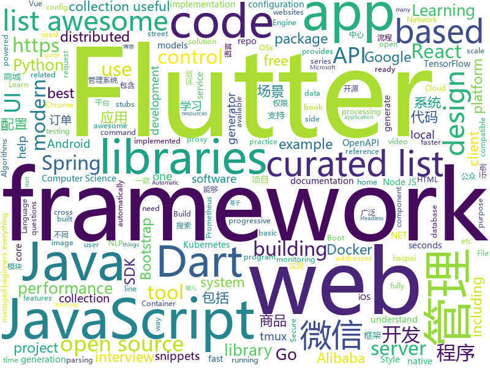

# 2018-12-13
See what the GitHub community is most excited about today.

## python
* [eeeeeeeeeeeeeeeeeeeeeeeeeeeeeeeeeeeeeeeeeeeeeeeeeeeeeeeeeeeeeeeeeeeeeeeeeeeeeeeeeeeeeeeeeeeeeeeeeeee](https://github.com/eeeeeeeeeeeeeeeeeeeeeeeeeeeeeeee/eeeeeeeeeeeeeeeeeeeeeeeeeeeeeeeeeeeeeeeeeeeeeeeeeeeeeeeeeeeeeeeeeeeeeeeeeeeeeeeeeeeeeeeeeeeeeeeeeeee)(**881 stars today**): eeeeeeeeeeeeeeeeeeeeeeeeeeeeeeeeeeeeeeeeeeeeeeeeeeeeeeeeeeeeeeeeeeeee
* [loguru](https://github.com/Delgan/loguru)(**226 stars today**): Python logging made (stupidly) simple
* [google-research](https://github.com/google-research/google-research)(**186 stars today**): Google AI Research
* [dgl](https://github.com/dmlc/dgl)(**184 stars today**): Python package built to ease deep learning on graph, on top of existing DL frameworks.
* [jax](https://github.com/google/jax)(**180 stars today**): GPU- and TPU-backed NumPy with differentiation and JIT compilation.
* [wtfpython](https://github.com/satwikkansal/wtfpython)(**166 stars today**): A collection of surprising Python snippets and lesser-known features.
* [wtfpython-cn](https://github.com/leisurelicht/wtfpython-cn)(**90 stars today**): wtfpython的中文翻译/施工结束/ 能力有限，欢迎帮我改进翻译
* [models](https://github.com/tensorflow/models)(**64 stars today**): Models and examples built with TensorFlow
* [weixin_crawler](https://github.com/wonderfulsuccess/weixin_crawler)(**76 stars today**): 高效微信公众号历史文章和阅读数据爬虫powered by scrapy
* [system-design-primer](https://github.com/donnemartin/system-design-primer)(**68 stars today**): Learn how to design large-scale systems. Prep for the system design interview. Includes Anki flashcards.
* [bert](https://github.com/google-research/bert)(**66 stars today**): TensorFlow code and pre-trained models for BERT
* [public-apis](https://github.com/toddmotto/public-apis)(**55 stars today**): A collective list of free APIs for use in software and web development.
* [Python](https://github.com/TheAlgorithms/Python)(**54 stars today**): All Algorithms implemented in Python
* [30-seconds-of-python-code](https://github.com/kriadmin/30-seconds-of-python-code)(**53 stars today**): Python implementation of 30-seconds-of-code
* [TensorFlow-Course](https://github.com/osforscience/TensorFlow-Course)(**43 stars today**): Simple and ready-to-use tutorials for TensorFlow
* [keras](https://github.com/keras-team/keras)(**42 stars today**): Deep Learning for humans
* [awesome-python](https://github.com/vinta/awesome-python)(**43 stars today**): A curated list of awesome Python frameworks, libraries, software and resources
* [d2l-zh](https://github.com/diveintodeeplearning/d2l-zh)(**40 stars today**): 《动手学深度学习》
* [flask](https://github.com/pallets/flask)(**38 stars today**): The Python micro framework for building web applications.
* [home-assistant](https://github.com/home-assistant/home-assistant)(**32 stars today**): 🏡Open source home automation that puts local control and privacy first
* [youtube-dl](https://github.com/rg3/youtube-dl)(**34 stars today**): Command-line program to download videos from YouTube.com and other video sites
* [walle-web](https://github.com/meolu/walle-web)(**31 stars today**): walle - 瓦力 开源项目代码部署平台
* [secure](https://github.com/cakinney/secure)(**33 stars today**): Secure🔒headers and cookies for Python web frameworks
* [partial_conv-Tensorflow](https://github.com/taki0112/partial_conv-Tensorflow)(**33 stars today**): Simple Tensorflow implementation of "Partial Convolution based Padding" (partialconv)
* [pampy](https://github.com/santinic/pampy)(**32 stars today**): Pampy: The Pattern Matching for Python you always dreamed of.

## java
* [incubator-dubbo](https://github.com/apache/incubator-dubbo)(**225 stars today**): Apache Dubbo (incubating) is a high-performance, java based, open source RPC framework.
* [JavaGuide](https://github.com/Snailclimb/JavaGuide)(**185 stars today**): 【Java学习+面试指南】 一份涵盖大部分Java程序员所需要掌握的核心知识。
* [QMUI_Android](https://github.com/Tencent/QMUI_Android)(**157 stars today**): 提高 Android UI 开发效率的 UI 库
* [arthas](https://github.com/alibaba/arthas)(**81 stars today**): Alibaba Java Diagnostic Tool Arthas/Alibaba Java诊断利器Arthas
* [qmq](https://github.com/qunarcorp/qmq)(**76 stars today**): QMQ是去哪儿网内部广泛使用的消息中间件，自2012年诞生以来在去哪儿网所有业务场景中广泛的应用，包括跟交易息息相关的订单场景； 也包括报价搜索等高吞吐量场景。
* [sofa-ark](https://github.com/alipay/sofa-ark)(**57 stars today**): SOFAArk is a light-weight，java based classloader isolation framework.
* [mall](https://github.com/macrozheng/mall)(**62 stars today**): mall项目是一套电商系统，包括前台商城系统及后台管理系统，基于SpringBoot+MyBatis实现。 前台商城系统包含首页门户、商品推荐、商品搜索、商品展示、购物车、订单流程、会员中心、客户服务、帮助中心等模块。 后台管理系统包含商品管理、订单管理、会员管理、促销管理、运营管理、内容管理、统计报表、财务管理、权限管理、设置等模块。
* [JCSprout](https://github.com/crossoverJie/JCSprout)(**61 stars today**): 👨‍🎓Java Core Sprout : basic, concurrent, algorithm
* [spring-boot](https://github.com/spring-projects/spring-boot)(**55 stars today**): Spring Boot
* [tutorials](https://github.com/eugenp/tutorials)(**31 stars today**): The "REST With Spring" Course:
* [elasticsearch](https://github.com/elastic/elasticsearch)(**40 stars today**): Open Source, Distributed, RESTful Search Engine
* [symphony](https://github.com/b3log/symphony)(**41 stars today**): 🎶一款用 Java 实现的现代化社区（论坛/BBS/社交网络/博客）平台。https://hacpai.com
* [JAViewer](https://github.com/SplashCodes/JAViewer)(**41 stars today**): 更优雅的驾车体验
* [apollo](https://github.com/ctripcorp/apollo)(**36 stars today**): Apollo（阿波罗）是携程框架部门研发的分布式配置中心，能够集中化管理应用不同环境、不同集群的配置，配置修改后能够实时推送到应用端，并且具备规范的权限、流程治理等特性，适用于微服务配置管理场景。
* [Java](https://github.com/TheAlgorithms/Java)(**37 stars today**): All Algorithms implemented in Java
* [sofa-boot](https://github.com/alipay/sofa-boot)(**29 stars today**): SOFABoot is a framework that enhances Spring Boot and fully compatible with it, provides readiness check, class isolation, etc.
* [tech-weekly](https://github.com/mercyblitz/tech-weekly)(**38 stars today**): 「小马哥技术周报」
* [spring-framework](https://github.com/spring-projects/spring-framework)(**27 stars today**): Spring Framework
* [Leaf](https://github.com/Meituan-Dianping/Leaf)(**33 stars today**): Distributed ID Generate Service
* [litemall](https://github.com/linlinjava/litemall)(**28 stars today**): 又一个小商城。litemall = Spring Boot后端 + Vue管理员前端 + 微信小程序用户前端
* [spring-cloud-alibaba](https://github.com/spring-cloud-incubator/spring-cloud-alibaba)(**29 stars today**): Spring Cloud Alibaba provides a one-stop solution for application development for the distributed solutions of Alibaba middleware.
* [solo](https://github.com/b3log/solo)(**29 stars today**): 🎸一款小而美的 Java 博客系统。https://hacpai.com/tag/solo
* [weixin-java-tools](https://github.com/Wechat-Group/weixin-java-tools)(**25 stars today**): 全能微信Java开发工具包，支持包括微信支付、开放平台、小程序、企业微信/企业号和公众号等的后端开发
* [Sentinel](https://github.com/alibaba/Sentinel)(**26 stars today**): A lightweight flow-control library providing high-available protection and monitoring (高可用防护的流量管理框架)
* [guava](https://github.com/google/guava)(**23 stars today**): Google core libraries for Java

## unknown
* [containers-roadmap](https://github.com/aws/containers-roadmap)(**291 stars today**): This is the public roadmap for AWS container services (ECS, ECR, Fargate, and EKS).
* [How-to-Grow-Neat-Software-Architecture-out-of-Jupyter-Notebooks](https://github.com/guillaume-chevalier/How-to-Grow-Neat-Software-Architecture-out-of-Jupyter-Notebooks)(**224 stars today**): Growing the code out of your notebooks - the right way.
* [pwc](https://github.com/zziz/pwc)(**189 stars today**): Papers with code. Sorted by stars. Updated weekly.
* [MSEdge](https://github.com/MicrosoftEdge/MSEdge)(**139 stars today**): Microsoft Edge
* [FAQGURU](https://github.com/FAQGURU/FAQGURU)(**103 stars today**): A list of interview questions. This repository is everything you need to prepare for your technical interview.🎒🚀🎉
* [awesome-sentence-embedding](https://github.com/Separius/awesome-sentence-embedding)(**92 stars today**): A curated list of pretrained sentence(and word) embedding models
* [CS-Notes](https://github.com/CyC2018/CS-Notes)(**80 stars today**): 📚Computer Science Learning Notes
* [acterlimitthenyoushouldprobablylowerwhatthemaximumcharacterlimitis](https://github.com/Ifyoudonotwantpeopleusingthemaximumchar/acterlimitthenyoushouldprobablylowerwhatthemaximumcharacterlimitis)(**84 stars today**): In honor of e98e
* [Cheatsheet-God](https://github.com/OlivierLaflamme/Cheatsheet-God)(**65 stars today**): Penetration Testing / OSCP Biggest Reference Bank / Cheatsheet
* [gitignore](https://github.com/github/gitignore)(**53 stars today**): A collection of useful .gitignore templates
* [developer-roadmap](https://github.com/kamranahmedse/developer-roadmap)(**65 stars today**): Roadmap to becoming a web developer in 2018
* [You-Dont-Know-JS](https://github.com/getify/You-Dont-Know-JS)(**58 stars today**): A book series on JavaScript. @YDKJS on twitter.
* [free-programming-books](https://github.com/EbookFoundation/free-programming-books)(**62 stars today**): 📚Freely available programming books
* [awesome](https://github.com/sindresorhus/awesome)(**58 stars today**): 😎Curated list of awesome lists
* [30-seconds-of-react](https://github.com/30-seconds/30-seconds-of-react)(**46 stars today**): Curated collection of useful React snippets that you can understand in 30 seconds or less.
* [youtube-br-desenvolvimento](https://github.com/carolcodes/youtube-br-desenvolvimento)(**43 stars today**): Repositório de canais no Youtube BR sobre desenvolvimento
* [awesome-cpp](https://github.com/fffaraz/awesome-cpp)(**32 stars today**): A curated list of awesome C++ (or C) frameworks, libraries, resources, and shiny things. Inspired by awesome-... stuff.
* [nodebestpractices](https://github.com/i0natan/nodebestpractices)(**29 stars today**): The largest Node.JS best practices list (November 2018)
* [awesome-for-beginners](https://github.com/MunGell/awesome-for-beginners)(**28 stars today**): A list of awesome beginners-friendly projects.
* [awesome-vue](https://github.com/vuejs/awesome-vue)(**27 stars today**): 🎉A curated list of awesome things related to Vue.js
* [coding-interview-university](https://github.com/jwasham/coding-interview-university)(**24 stars today**): A complete computer science study plan to become a software engineer.
* [first-contributions](https://github.com/firstcontributions/first-contributions)(**13 stars today**): 🚀✨Help beginners to contribute to open source projects
* [kubernetes-the-hard-way](https://github.com/kelseyhightower/kubernetes-the-hard-way)(**23 stars today**): Bootstrap Kubernetes the hard way on Google Cloud Platform. No scripts.
* [.tmux](https://github.com/gpakosz/.tmux)(**25 stars today**): 🇫🇷Oh My Tmux! My pretty + versatile tmux configuration that just works (imho the best tmux configuration)
* [computer-science](https://github.com/ossu/computer-science)(**21 stars today**): 🎓Path to a free self-taught education in Computer Science!

## javascript
* [quicklink](https://github.com/GoogleChromeLabs/quicklink)(**462 stars today**): ⚡️Faster subsequent page-loads by prefetching in-viewport links during idle time
* [jsPDF](https://github.com/MrRio/jsPDF)(**306 stars today**): Client-side JavaScript PDF generation for everyone.
* [mpx](https://github.com/didi/mpx)(**249 stars today**): An enhanced miniprogram framework with data reactivity and deep optimizition.
* [Debucsser](https://github.com/lucagez/Debucsser)(**226 stars today**): CSS debugging tool with an unpronounceable name
* [forgJs](https://github.com/oussamahamdaoui/forgJs)(**173 stars today**): ForgJs is a javascript lightweight object validator. Go check the Quick start section and start coding with love
* [30-seconds-of-code](https://github.com/30-seconds/30-seconds-of-code)(**140 stars today**): Curated collection of useful JavaScript snippets that you can understand in 30 seconds or less.
* [vue](https://github.com/vuejs/vue)(**133 stars today**): 🖖A progressive, incrementally-adoptable JavaScript framework for building UI on the web.
* [react](https://github.com/facebook/react)(**93 stars today**): A declarative, efficient, and flexible JavaScript library for building user interfaces.
* [cz-cli](https://github.com/commitizen/cz-cli)(**89 stars today**): The commitizen command line utility.
* [bootstrap-material-design](https://github.com/mdbootstrap/bootstrap-material-design)(**87 stars today**): Material Design for Bootstrap - Powerful and free UI KIT for Bootstrap 4
* [sharp](https://github.com/lovell/sharp)(**81 stars today**): High performance Node.js image processing, the fastest module to resize JPEG, PNG, WebP and TIFF images. Uses the libvips library.
* [puppeteer](https://github.com/GoogleChrome/puppeteer)(**72 stars today**): Headless Chrome Node API
* [33-js-concepts](https://github.com/leonardomso/33-js-concepts)(**66 stars today**): 📜33 concepts every JavaScript developer should know.
* [open-location-code](https://github.com/google/open-location-code)(**67 stars today**): Open Location Code is a library to generate short codes that can be used like street addresses, for places where street addresses don't exist.
* [gatsby](https://github.com/gatsbyjs/gatsby)(**62 stars today**): Build blazing fast, modern apps and websites with React
* [axios](https://github.com/axios/axios)(**59 stars today**): Promise based HTTP client for the browser and node.js
* [taro](https://github.com/NervJS/taro)(**58 stars today**): 多端统一开发框架，支持用 React 的开发方式编写一次代码，生成能运行在微信小程序/百度智能小程序/支付宝小程序、H5、React Native 等的应用。 https://taro.js.org/
* [edex-ui](https://github.com/GitSquared/edex-ui)(**58 stars today**): A science fiction terminal emulator designed for large touchscreens that runs on all major OSs.
* [learnGitBranching](https://github.com/pcottle/learnGitBranching)(**52 stars today**): An interactive git visualization to challenge and educate!
* [javascript](https://github.com/airbnb/javascript)(**50 stars today**): JavaScript Style Guide
* [create-react-app](https://github.com/facebook/create-react-app)(**44 stars today**): Set up a modern web app by running one command.
* [awesome-ui-component-library](https://github.com/anubhavsrivastava/awesome-ui-component-library)(**51 stars today**): Curated list of framework component libraries for UI styles/toolkit
* [react-native](https://github.com/facebook/react-native)(**44 stars today**): A framework for building native apps with React.
* [three.js](https://github.com/mrdoob/three.js)(**41 stars today**): JavaScript 3D library.
* [ant-design-pro](https://github.com/ant-design/ant-design-pro)(**39 stars today**): 👨🏻‍💻👩🏻‍💻 Use Ant Design like a Pro!

## html
* [nginxconfig.io](https://github.com/valentinxxx/nginxconfig.io)(**37 stars today**): ⚙️NGiИX config generator generator on steroids💉
* [Front-end-Developer-Interview-Questions](https://github.com/h5bp/Front-end-Developer-Interview-Questions)(**32 stars today**): A list of helpful front-end related questions you can use to interview potential candidates, test yourself or completely ignore.
* [flutter-in-action](https://github.com/flutterchina/flutter-in-action)(**28 stars today**): 《Flutter实战》电子书
* [Spoon-Knife](https://github.com/octocat/Spoon-Knife)(****): This repo is for demonstration purposes only.
* [styleguide](https://github.com/google/styleguide)(**22 stars today**): Style guides for Google-originated open-source projects
* [NLP-progress](https://github.com/sebastianruder/NLP-progress)(**22 stars today**): Repository to track the progress in Natural Language Processing (NLP), including the datasets and the current state-of-the-art for the most common NLP tasks.
* [JavaScript30](https://github.com/wesbos/JavaScript30)(**17 stars today**): 30 Day Vanilla JS Challenge
* [ionic](https://github.com/ionic-team/ionic)(**16 stars today**): Build amazing native and progressive web apps with open web technologies. One app running on everything🎉
* [javascript-tutorial-en](https://github.com/iliakan/javascript-tutorial-en)(**15 stars today**): Modern JavaScript Tutorial
* [qiubaiying.github.io](https://github.com/qiubaiying/qiubaiying.github.io)(**8 stars today**): BY Blog ->
* [AdminLTE](https://github.com/almasaeed2010/AdminLTE)(**13 stars today**): AdminLTE - Free Premium Admin control Panel Theme Based On Bootstrap 3.x
* [now-github-starter](https://github.com/zeit/now-github-starter)(****): Starter project to demonstrate a project whose pull requests get automatically deployed
* [swagger-codegen](https://github.com/swagger-api/swagger-codegen)(**11 stars today**): swagger-codegen contains a template-driven engine to generate documentation, API clients and server stubs in different languages by parsing your OpenAPI / Swagger definition.
* [design-blocks](https://github.com/froala/design-blocks)(**12 stars today**): A set of 170+ Bootstrap based design blocks ready to be used to create clean modern websites.
* [unpackaged.el](https://github.com/alphapapa/unpackaged.el)(**12 stars today**): A collection of useful Emacs Lisp code that isn't substantial enough to be packaged
* [portainer](https://github.com/portainer/portainer)(**10 stars today**): Simple management UI for Docker
* [trpl-zh-cn](https://github.com/KaiserY/trpl-zh-cn)(**10 stars today**): Rust 程序设计语言（第二版）
* [openapi-generator](https://github.com/OpenAPITools/openapi-generator)(**10 stars today**): OpenAPI Generator allows generation of API client libraries (SDK generation), server stubs, documentation and configuration automatically given an OpenAPI Spec (v2, v3)
* [scikit-learn-doc-zh](https://github.com/apachecn/scikit-learn-doc-zh)(**9 stars today**): 📖[译] scikit-learn（sklearn） 中文文档
* [smart-contract-best-practices](https://github.com/ConsenSys/smart-contract-best-practices)(**9 stars today**): A guide to smart contract security best practices
* [dotnet](https://github.com/Microsoft/dotnet)(**8 stars today**): This repo is the official home of .NET on GitHub. It's a great starting point to find many .NET OSS projects from Microsoft and the community, including many that are part of the .NET Foundation.
* [expressjs.com](https://github.com/expressjs/expressjs.com)(**8 stars today**): 
* [react-app-rewired](https://github.com/timarney/react-app-rewired)(**8 stars today**): Override create-react-app webpack configs without ejecting
* [learning-area](https://github.com/mdn/learning-area)(**5 stars today**): Github repo for the MDN Learning Area.
* [requests-html](https://github.com/kennethreitz/requests-html)(**7 stars today**): Pythonic HTML Parsing for Humans™

## dart
* [flutter](https://github.com/flutter/flutter)(**241 stars today**): Flutter makes it easy and fast to build beautiful mobile apps.
* [awesome-flutter](https://github.com/Solido/awesome-flutter)(**125 stars today**): An awesome list that curates the best Flutter libraries, tools, tutorials, articles and more.
* [plugins](https://github.com/flutter/plugins)(**26 stars today**): Plugins for Flutter, including FlutterFire, maintained by the Flutter team
* [flutter-examples](https://github.com/nisrulz/flutter-examples)(**21 stars today**): [Examples] Simple basic isolated apps, for budding flutter devs.
* [dio](https://github.com/flutterchina/dio)(**21 stars today**): A powerful Http client for Dart, which supports Interceptors, FormData, Request Cancellation, File Downloading, Timeout etc.
* [samples](https://github.com/flutter/samples)(**18 stars today**): A collection of Flutter examples and demos.
* [inKino](https://github.com/roughike/inKino)(**15 stars today**): A multiplatform Dart movie app with 40% of code sharing between Flutter and the Web.
* [Flutter-learning](https://github.com/AweiLoveAndroid/Flutter-learning)(**14 stars today**): 🔥👍🌟⭐️⭐️⭐️Flutter安装和配置，Flutter开发遇到的难题，Flutter示例代码和模板，Flutter项目实战，Dart语言学习示例代码。
* [flutter_architecture_samples](https://github.com/brianegan/flutter_architecture_samples)(**13 stars today**): TodoMVC for Flutter
* [sdk](https://github.com/dart-lang/sdk)(**10 stars today**): The Dart SDK, including the VM, dart2js, core libraries, and more.
* [flutter_layout](https://github.com/nb312/flutter_layout)(**7 stars today**): Layout of the flutter example.such as Row,Comlun,listview,Just for learning.
* [Flare-Flutter](https://github.com/2d-inc/Flare-Flutter)(**7 stars today**): 
* [flutter-osc](https://github.com/yubo725/flutter-osc)(**7 stars today**): 基于Google Flutter的开源中国客户端，支持Android和iOS。
* [rxdart](https://github.com/ReactiveX/rxdart)(**7 stars today**): The Reactive Extensions for Dart
* [functional_widget](https://github.com/rrousselGit/functional_widget)(**7 stars today**): 
* [bloc](https://github.com/felangel/bloc)(**6 stars today**): A collection of packages that help implement the BLoC design pattern
* [flame](https://github.com/luanpotter/flame)(**6 stars today**): A minimalist Flutter game engine
* [folding_cell](https://github.com/faob-dev/folding_cell)(**6 stars today**): Flutter FoldingCell widget
* [fluwx](https://github.com/OpenFlutter/fluwx)(**5 stars today**): Flutter版微信SDK.WeChat SDK for flutter.
* [dart-sass](https://github.com/sass/dart-sass)(**5 stars today**): The reference implementation of Sass, written in Dart.
* [hn_app](https://github.com/filiph/hn_app)(****): The HN reader app developed live on The Boring Flutter Development Show
* [angular_cli](https://github.com/google/angular_cli)(****): 
* [file.dart](https://github.com/google/file.dart)(****): A generic file system abstraction for Dart.
* [CountryCodePicker](https://github.com/Salvatore-Giordano/CountryCodePicker)(****): A flutter package for showing a country code selector.
* [site-www](https://github.com/dart-lang/site-www)(****): Source for Dart website

## go
* [loki](https://github.com/grafana/loki)(**1,209 stars today**): Like Prometheus, but for logs.
* [docker_practice](https://github.com/yeasy/docker_practice)(**282 stars today**): Learn and understand Docker technologies, with real DevOps practice!
* [certmagic](https://github.com/mholt/certmagic)(**263 stars today**): Automatic HTTPS for any Go program: fully-managed TLS certificate issuance and renewal
* [ethr](https://github.com/Microsoft/ethr)(**208 stars today**): Ethr is a Network Performance Measurement Tool for TCP, UDP & HTTP.
* [rendora](https://github.com/rendora/rendora)(**112 stars today**): dynamic server-side rendering using headless Chrome to effortlessly solve the SEO problem for modern javascript websites
* [kubernetes](https://github.com/kubernetes/kubernetes)(**80 stars today**): Production-Grade Container Scheduling and Management
* [dive](https://github.com/wagoodman/dive)(**84 stars today**): A tool for exploring each layer in a docker image
* [go](https://github.com/golang/go)(**64 stars today**): The Go programming language
* [etcd](https://github.com/etcd-io/etcd)(**49 stars today**): Distributed reliable key-value store for the most critical data of a distributed system
* [frp](https://github.com/fatedier/frp)(**48 stars today**): A fast reverse proxy to help you expose a local server behind a NAT or firewall to the internet.
* [kind](https://github.com/kubernetes-sigs/kind)(**48 stars today**): Kubernetes IN Docker - local clusters for testing Kubernetes
* [gotenberg](https://github.com/thecodingmachine/gotenberg)(**47 stars today**): A Docker-powered stateless API for converting HTML, Markdown and Office documents to PDF
* [gin](https://github.com/gin-gonic/gin)(**40 stars today**): Gin is a HTTP web framework written in Go (Golang). It features a Martini-like API with much better performance -- up to 40 times faster. If you need smashing performance, get yourself some Gin.
* [istio](https://github.com/istio/istio)(**38 stars today**): Connect, secure, control, and observe services.
* [crossplane](https://github.com/crossplaneio/crossplane)(**38 stars today**): An Open Source Multicloud Control Plane
* [prometheus](https://github.com/prometheus/prometheus)(**32 stars today**): The Prometheus monitoring system and time series database.
* [docs](https://github.com/knative/docs)(**35 stars today**): User documentation for Knative components
* [osiris](https://github.com/deislabs/osiris)(**33 stars today**): A general purpose, scale-to-zero component for Kubernetes
* [v2ray-core](https://github.com/v2ray/v2ray-core)(**29 stars today**): A platform for building proxies to bypass network restrictions.
* [helm](https://github.com/helm/helm)(**26 stars today**): The Kubernetes Package Manager
* [awesome-go](https://github.com/avelino/awesome-go)(**27 stars today**): A curated list of awesome Go frameworks, libraries and software
* [brook](https://github.com/txthinking/brook)(**28 stars today**): Brook is a cross-platform(Linux/MacOS/Windows/Android/iOS) proxy/vpn software
* [tidb](https://github.com/pingcap/tidb)(**25 stars today**): TiDB is a distributed HTAP database compatible with the MySQL protocol
* [domain-list-community](https://github.com/v2ray/domain-list-community)(**24 stars today**): Community managed domain list
* [caddy](https://github.com/mholt/caddy)(**24 stars today**): Fast, cross-platform HTTP/2 web server with automatic HTTPS

## WordCloud

