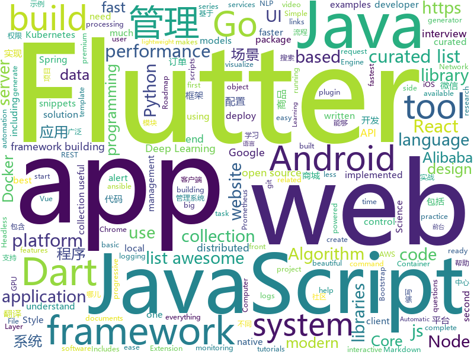

# 2018-12-14
See what the GitHub community is most excited about today.

## python
* [eeeeeeeeeeeeeeeeeeeeeeeeeeeeeeeeeeeeeeeeeeeeeeeeeeeeeeeeeeeeeeeeeeeeeeeeeeeeeeeeeeeeeeeeeeeeeeeeeeee](https://github.com/eeeeeeeeeeeeeeeeeeeeeeeeeeeeeeee/eeeeeeeeeeeeeeeeeeeeeeeeeeeeeeeeeeeeeeeeeeeeeeeeeeeeeeeeeeeeeeeeeeeeeeeeeeeeeeeeeeeeeeeeeeeeeeeeeeee)(**644 stars today**): eeeeeeeeeeeeeeeeeeeeeeeeeeeeeeeeeeeeeeeeeeeeeeeeeeeeeeeeeeeeeeeeeeeee
* [dgl](https://github.com/dmlc/dgl)(**254 stars today**): Python package built to ease deep learning on graph, on top of existing DL frameworks.
* [loguru](https://github.com/Delgan/loguru)(**172 stars today**): Python logging made (stupidly) simple
* [google-research](https://github.com/google-research/google-research)(**129 stars today**): Google AI Research
* [wtfpython](https://github.com/satwikkansal/wtfpython)(**109 stars today**): A collection of surprising Python snippets and lesser-known features.
* [jax](https://github.com/google/jax)(**108 stars today**): GPU- and TPU-backed NumPy with differentiation and JIT compilation.
* [models](https://github.com/tensorflow/models)(**53 stars today**): Models and examples built with TensorFlow
* [bert](https://github.com/google-research/bert)(**66 stars today**): TensorFlow code and pre-trained models for BERT
* [system-design-primer](https://github.com/donnemartin/system-design-primer)(**62 stars today**): Learn how to design large-scale systems. Prep for the system design interview. Includes Anki flashcards.
* [weixin_crawler](https://github.com/wonderfulsuccess/weixin_crawler)(**58 stars today**): 高效微信公众号历史文章和阅读数据爬虫powered by scrapy
* [flare-emu](https://github.com/fireeye/flare-emu)(**61 stars today**): 
* [wtfpython-cn](https://github.com/leisurelicht/wtfpython-cn)(**48 stars today**): wtfpython的中文翻译/施工结束/ 能力有限，欢迎帮我改进翻译
* [comixify](https://github.com/maciej3031/comixify)(**43 stars today**): End-to-end solution that transforms input video into a comic in just a few seconds
* [TensorFlow-Course](https://github.com/osforscience/TensorFlow-Course)(**40 stars today**): Simple and ready-to-use tutorials for TensorFlow
* [Python](https://github.com/TheAlgorithms/Python)(**37 stars today**): All Algorithms implemented in Python
* [ansible](https://github.com/ansible/ansible)(**35 stars today**): Ansible is a radically simple IT automation platform that makes your applications and systems easier to deploy. Avoid writing scripts or custom code to deploy and update your applications — automate in a language that approaches plain English, using SSH, with no agents to install on remote systems. https://docs.ansible.com/ansible/
* [keras](https://github.com/keras-team/keras)(**31 stars today**): Deep Learning for humans
* [awesome-python](https://github.com/vinta/awesome-python)(**36 stars today**): A curated list of awesome Python frameworks, libraries, software and resources
* [pytorch_geometric](https://github.com/rusty1s/pytorch_geometric)(**38 stars today**): Geometric Deep Learning Extension Library for PyTorch
* [vaex](https://github.com/vaexio/vaex)(**38 stars today**): Out-of-Core DataFrames for Python, visualize and explore big tabular data at a billion rows per second.
* [scikit-learn](https://github.com/scikit-learn/scikit-learn)(**30 stars today**): scikit-learn: machine learning in Python
* [mindsdb](https://github.com/mindsdb/mindsdb)(**35 stars today**): Framework to streamline use of neural networks
* [Detectron](https://github.com/facebookresearch/Detectron)(**33 stars today**): FAIR's research platform for object detection research, implementing popular algorithms like Mask R-CNN and RetinaNet.
* [cpython](https://github.com/python/cpython)(**27 stars today**): The Python programming language
* [home-assistant](https://github.com/home-assistant/home-assistant)(**32 stars today**): 🏡Open source home automation that puts local control and privacy first

## java
* [miaosha](https://github.com/qiurunze123/miaosha)(**173 stars today**): 😮😮秒杀系统设计与实现.互联网工程师进阶与分析🙋🐓
* [JavaGuide](https://github.com/Snailclimb/JavaGuide)(**148 stars today**): 【Java学习+面试指南】 一份涵盖大部分Java程序员所需要掌握的核心知识。
* [QMUI_Android](https://github.com/Tencent/QMUI_Android)(**113 stars today**): 提高 Android UI 开发效率的 UI 库
* [arthas](https://github.com/alibaba/arthas)(**65 stars today**): Alibaba Java Diagnostic Tool Arthas/Alibaba Java诊断利器Arthas
* [spring-boot](https://github.com/spring-projects/spring-boot)(**46 stars today**): Spring Boot
* [tutorials](https://github.com/eugenp/tutorials)(**35 stars today**): The "REST With Spring" Course:
* [apollo](https://github.com/ctripcorp/apollo)(**45 stars today**): Apollo（阿波罗）是携程框架部门研发的分布式配置中心，能够集中化管理应用不同环境、不同集群的配置，配置修改后能够实时推送到应用端，并且具备规范的权限、流程治理等特性，适用于微服务配置管理场景。
* [mall](https://github.com/macrozheng/mall)(**41 stars today**): mall项目是一套电商系统，包括前台商城系统及后台管理系统，基于SpringBoot+MyBatis实现。 前台商城系统包含首页门户、商品推荐、商品搜索、商品展示、购物车、订单流程、会员中心、客户服务、帮助中心等模块。 后台管理系统包含商品管理、订单管理、会员管理、促销管理、运营管理、内容管理、统计报表、财务管理、权限管理、设置等模块。
* [deeplearning4j](https://github.com/deeplearning4j/deeplearning4j)(**41 stars today**): Deeplearning4j, ND4J, DataVec and more - deep learning & linear algebra for Java/Scala with GPUs + Spark - From Skymind
* [incubator-dubbo](https://github.com/apache/incubator-dubbo)(**34 stars today**): Apache Dubbo (incubating) is a high-performance, java based, open source RPC framework.
* [elasticsearch](https://github.com/elastic/elasticsearch)(**34 stars today**): Open Source, Distributed, RESTful Search Engine
* [spring-framework](https://github.com/spring-projects/spring-framework)(**30 stars today**): Spring Framework
* [ArgusAPM](https://github.com/Qihoo360/ArgusAPM)(**37 stars today**): Powerful, comprehensive (Android) application performance management platform. 360移动性能监控平台
* [qmq](https://github.com/qunarcorp/qmq)(**34 stars today**): QMQ是去哪儿网内部广泛使用的消息中间件，自2012年诞生以来在去哪儿网所有业务场景中广泛的应用，包括跟交易息息相关的订单场景； 也包括报价搜索等高吞吐量场景。
* [JCSprout](https://github.com/crossoverJie/JCSprout)(**34 stars today**): 👨‍🎓Java Core Sprout : basic, concurrent, algorithm
* [symphony](https://github.com/b3log/symphony)(**36 stars today**): 🎶一款用 Java 实现的现代化社区（论坛/BBS/社交网络/博客）平台。https://hacpai.com
* [Leaf](https://github.com/Meituan-Dianping/Leaf)(**35 stars today**): Distributed ID Generate Service
* [Java](https://github.com/TheAlgorithms/Java)(**32 stars today**): All Algorithms implemented in Java
* [SwipeSpinnerWidget](https://github.com/DarkionAvey/SwipeSpinnerWidget)(**35 stars today**): [Android] A spinner utilizing recycler view to achieve faster scrolling
* [ARouter](https://github.com/alibaba/ARouter)(**32 stars today**): 💪A framework for assisting in the renovation of Android componentization (帮助 Android App 进行组件化改造的路由框架)
* [AndroidUtilCode](https://github.com/Blankj/AndroidUtilCode)(**30 stars today**): 🔥Android developers should collect the following utils(updating).
* [JAViewer](https://github.com/SplashCodes/JAViewer)(**29 stars today**): 更优雅的驾车体验
* [guava](https://github.com/google/guava)(**30 stars today**): Google core libraries for Java
* [litemall](https://github.com/linlinjava/litemall)(**22 stars today**): 又一个小商城。litemall = Spring Boot后端 + Vue管理员前端 + 微信小程序用户前端
* [spring-cloud-alibaba](https://github.com/spring-cloud-incubator/spring-cloud-alibaba)(**21 stars today**): Spring Cloud Alibaba provides a one-stop solution for application development for the distributed solutions of Alibaba middleware.

## unknown
* [pwc](https://github.com/zziz/pwc)(**184 stars today**): Papers with code. Sorted by stars. Updated weekly.
* [How-to-Grow-Neat-Software-Architecture-out-of-Jupyter-Notebooks](https://github.com/guillaume-chevalier/How-to-Grow-Neat-Software-Architecture-out-of-Jupyter-Notebooks)(**118 stars today**): Growing the code out of your notebooks - the right way.
* [containers-roadmap](https://github.com/aws/containers-roadmap)(**117 stars today**): This is the public roadmap for AWS container services (ECS, ECR, Fargate, and EKS).
* [coding-interview-university](https://github.com/jwasham/coding-interview-university)(**89 stars today**): A complete computer science study plan to become a software engineer.
* [CS-Notes](https://github.com/CyC2018/CS-Notes)(**74 stars today**): 📚Computer Science Learning Notes
* [react-typescript-cheatsheet](https://github.com/sw-yx/react-typescript-cheatsheet)(**72 stars today**): a cheatsheet for react users using typescript with react for the first (or nth!) time
* [FAQGURU](https://github.com/FAQGURU/FAQGURU)(**69 stars today**): A list of interview questions. This repository is everything you need to prepare for your technical interview.🎒🚀🎉
* [gitignore](https://github.com/github/gitignore)(**50 stars today**): A collection of useful .gitignore templates
* [resources](https://github.com/tunnckoCore/resources)(**64 stars today**): 📖Huge curated collection of links of Tech, Science, Conferences, Videos and much more resources from everyday surfing.⭐️Since October 21, 2017.
* [developer-roadmap](https://github.com/kamranahmedse/developer-roadmap)(**59 stars today**): Roadmap to becoming a web developer in 2018
* [You-Dont-Know-JS](https://github.com/getify/You-Dont-Know-JS)(**62 stars today**): A book series on JavaScript. @YDKJS on twitter.
* [awesome](https://github.com/sindresorhus/awesome)(**60 stars today**): 😎Curated list of awesome lists
* [nodebestpractices](https://github.com/i0natan/nodebestpractices)(**59 stars today**): The largest Node.JS best practices list (November 2018)
* [awesome-sentence-embedding](https://github.com/Separius/awesome-sentence-embedding)(**57 stars today**): A curated list of pretrained sentence(and word) embedding models
* [awesome-layers](https://github.com/mthenw/awesome-layers)(**56 stars today**): λ A curated list of awesome AWS Lambda Layers.
* [MSEdge](https://github.com/MicrosoftEdge/MSEdge)(**54 stars today**): Microsoft Edge
* [free-programming-books](https://github.com/EbookFoundation/free-programming-books)(**44 stars today**): 📚Freely available programming books
* [youtube-br-desenvolvimento](https://github.com/carolcodes/youtube-br-desenvolvimento)(**46 stars today**): Repositório de canais no Youtube BR sobre desenvolvimento
* [awesome-vue](https://github.com/vuejs/awesome-vue)(**37 stars today**): 🎉A curated list of awesome things related to Vue.js
* [async-book](https://github.com/rust-lang/async-book)(**34 stars today**): Asynchronous Programming in Rust
* [gold-miner](https://github.com/xitu/gold-miner)(**30 stars today**): 🥇掘金翻译计划，可能是世界最大最好的英译中技术社区，最懂读者和译者的翻译平台：
* [KubeCon-North-America-2018](https://github.com/warmchang/KubeCon-North-America-2018)(**27 stars today**): KubeCon-CloudNativeCon-North-America-2018's slides.
* [indie-tools](https://github.com/shalvah/indie-tools)(**25 stars today**): Tools for Indie hackers. You don't need a big budget to build stuff!
* [30-seconds-of-react](https://github.com/30-seconds/30-seconds-of-react)(**27 stars today**): Curated collection of useful React snippets that you can understand in 30 seconds or less.
* [goQuality-dev-contents](https://github.com/Integerous/goQuality-dev-contents)(**27 stars today**): { 고퀄리티⚡️개발 컨텐츠 모음 }

## javascript
* [quicklink](https://github.com/GoogleChromeLabs/quicklink)(**980 stars today**): ⚡️Faster subsequent page-loads by prefetching in-viewport links during idle time
* [jsPDF](https://github.com/MrRio/jsPDF)(**183 stars today**): Client-side JavaScript PDF generation for everyone.
* [vue](https://github.com/vuejs/vue)(**147 stars today**): 🖖A progressive, incrementally-adoptable JavaScript framework for building UI on the web.
* [30-seconds-of-code](https://github.com/30-seconds/30-seconds-of-code)(**151 stars today**): Curated collection of useful JavaScript snippets that you can understand in 30 seconds or less.
* [Debucsser](https://github.com/lucagez/Debucsser)(**140 stars today**): CSS debugging tool with an unpronounceable name
* [react](https://github.com/facebook/react)(**94 stars today**): A declarative, efficient, and flexible JavaScript library for building user interfaces.
* [algorithm-visualizer](https://github.com/algorithm-visualizer/algorithm-visualizer)(**101 stars today**): 🎆Interactive Online Platform that Visualizes Algorithms from Code
* [mpx](https://github.com/didi/mpx)(**92 stars today**): An enhanced miniprogram framework with data reactivity and deep optimizition.
* [forgJs](https://github.com/oussamahamdaoui/forgJs)(**80 stars today**): ForgJs is a javascript lightweight object validator. Go check the Quick start section and start coding with love
* [sharp](https://github.com/lovell/sharp)(**78 stars today**): High performance Node.js image processing, the fastest module to resize JPEG, PNG, WebP and TIFF images. Uses the libvips library.
* [learnGitBranching](https://github.com/pcottle/learnGitBranching)(**72 stars today**): An interactive git visualization to challenge and educate!
* [overreacted.io](https://github.com/gaearon/overreacted.io)(**70 stars today**): Personal blog by Dan Abramov.
* [puppeteer](https://github.com/GoogleChrome/puppeteer)(**64 stars today**): Headless Chrome Node API
* [create-react-app](https://github.com/facebook/create-react-app)(**62 stars today**): Set up a modern web app by running one command.
* [33-js-concepts](https://github.com/leonardomso/33-js-concepts)(**66 stars today**): 📜33 concepts every JavaScript developer should know.
* [three.js](https://github.com/mrdoob/three.js)(**56 stars today**): JavaScript 3D library.
* [hiring-without-whiteboards](https://github.com/poteto/hiring-without-whiteboards)(**65 stars today**): ⭐️Companies that don't have a broken hiring process
* [cz-cli](https://github.com/commitizen/cz-cli)(**62 stars today**): The commitizen command line utility.
* [taro](https://github.com/NervJS/taro)(**51 stars today**): 多端统一开发框架，支持用 React 的开发方式编写一次代码，生成能运行在微信小程序/百度智能小程序/支付宝小程序、H5、React Native 等的应用。 https://taro.js.org/
* [gatsby](https://github.com/gatsbyjs/gatsby)(**50 stars today**): Build blazing fast, modern apps and websites with React
* [axios](https://github.com/axios/axios)(**51 stars today**): Promise based HTTP client for the browser and node.js
* [javascript](https://github.com/airbnb/javascript)(**49 stars today**): JavaScript Style Guide
* [react-native](https://github.com/facebook/react-native)(**48 stars today**): A framework for building native apps with React.
* [node](https://github.com/nodejs/node)(**43 stars today**): Node.js JavaScript runtime✨🐢🚀✨
* [anime](https://github.com/juliangarnier/anime)(**46 stars today**): JavaScript Animation Engine

## html
* [nginxconfig.io](https://github.com/valentinxxx/nginxconfig.io)(**31 stars today**): ⚙️NGiИX config generator generator on steroids💉
* [Front-end-Developer-Interview-Questions](https://github.com/h5bp/Front-end-Developer-Interview-Questions)(**24 stars today**): A list of helpful front-end related questions you can use to interview potential candidates, test yourself or completely ignore.
* [ionic](https://github.com/ionic-team/ionic)(**18 stars today**): Build amazing native and progressive web apps with open web technologies. One app running on everything🎉
* [flutter-in-action](https://github.com/flutterchina/flutter-in-action)(**18 stars today**): 《Flutter实战》电子书
* [frida-all-in-one](https://github.com/hookmaster/frida-all-in-one)(**19 stars today**): 《FRIDA操作手册》by @hluwa @r0ysue
* [NLP-progress](https://github.com/sebastianruder/NLP-progress)(**17 stars today**): Repository to track the progress in Natural Language Processing (NLP), including the datasets and the current state-of-the-art for the most common NLP tasks.
* [AdminLTE](https://github.com/almasaeed2010/AdminLTE)(**13 stars today**): AdminLTE - Free Premium Admin control Panel Theme Based On Bootstrap 3.x
* [design-blocks](https://github.com/froala/design-blocks)(**19 stars today**): A set of 170+ Bootstrap based design blocks ready to be used to create clean modern websites.
* [styleguide](https://github.com/google/styleguide)(**13 stars today**): Style guides for Google-originated open-source projects
* [JavaScript30](https://github.com/wesbos/JavaScript30)(**8 stars today**): 30 Day Vanilla JS Challenge
* [patchwork](https://github.com/jlord/patchwork)(****): All the Git-it Workshop completers!
* [Spoon-Knife](https://github.com/octocat/Spoon-Knife)(****): This repo is for demonstration purposes only.
* [now-github-starter](https://github.com/zeit/now-github-starter)(****): Starter project to demonstrate a project whose pull requests get automatically deployed
* [fonts](https://github.com/google/fonts)(**10 stars today**): Font files available from Google Fonts
* [swagger-codegen](https://github.com/swagger-api/swagger-codegen)(**9 stars today**): swagger-codegen contains a template-driven engine to generate documentation, API clients and server stubs in different languages by parsing your OpenAPI / Swagger definition.
* [ionicons](https://github.com/ionic-team/ionicons)(**10 stars today**): The premium icon font for Ionic Framework and web apps everywhere
* [dawn](https://github.com/alibaba/dawn)(**10 stars today**): 🌅Dawn is a lightweight task management and build tool for front-end and nodejs.
* [primeng](https://github.com/primefaces/primeng)(**9 stars today**): UI Components for Angular
* [ecma262](https://github.com/tc39/ecma262)(**9 stars today**): Status, process, and documents for ECMA262
* [terminal_markdown_viewer](https://github.com/axiros/terminal_markdown_viewer)(**8 stars today**): Styled Terminal Markdown Viewer
* [2019.fossasia.org](https://github.com/fossasia/2019.fossasia.org)(**8 stars today**): FOSSASIA Summit 2019 https://2019.fossasia.org
* [portainer](https://github.com/portainer/portainer)(**7 stars today**): Simple management UI for Docker
* [hugo-academic](https://github.com/gcushen/hugo-academic)(**7 stars today**): The website designer for Hugo. Build and deploy a beautiful website in minutes🚀
* [DetectionLab](https://github.com/clong/DetectionLab)(**7 stars today**): Vagrant & Packer scripts to build a lab environment complete with security tooling and logging best practices
* [change-password-url](https://github.com/WICG/change-password-url)(**7 stars today**): 

## dart
* [flutter](https://github.com/flutter/flutter)(**262 stars today**): Flutter makes it easy and fast to build beautiful mobile apps.
* [awesome-flutter](https://github.com/Solido/awesome-flutter)(**110 stars today**): An awesome list that curates the best Flutter libraries, tools, tutorials, articles and more.
* [dio](https://github.com/flutterchina/dio)(**32 stars today**): A powerful Http client for Dart, which supports Interceptors, FormData, Request Cancellation, File Downloading, Timeout etc.
* [plugins](https://github.com/flutter/plugins)(**19 stars today**): Plugins for Flutter, including FlutterFire, maintained by the Flutter team
* [quiet-flutter](https://github.com/boyan01/quiet-flutter)(**21 stars today**): a flutter music player app
* [flutter-examples](https://github.com/nisrulz/flutter-examples)(**12 stars today**): [Examples] Simple basic isolated apps, for budding flutter devs.
* [bloc](https://github.com/felangel/bloc)(**12 stars today**): A collection of packages that help implement the BLoC design pattern
* [samples](https://github.com/flutter/samples)(**11 stars today**): A collection of Flutter examples and demos.
* [aqueduct](https://github.com/stablekernel/aqueduct)(**9 stars today**): Dart HTTP server framework for building REST APIs. Includes PostgreSQL ORM and OAuth2 provider.
* [rxdart](https://github.com/ReactiveX/rxdart)(**8 stars today**): The Reactive Extensions for Dart
* [inKino](https://github.com/roughike/inKino)(**7 stars today**): A multiplatform Dart movie app with 40% of code sharing between Flutter and the Web.
* [flutter-osc](https://github.com/yubo725/flutter-osc)(**7 stars today**): 基于Google Flutter的开源中国客户端，支持Android和iOS。
* [sdk](https://github.com/dart-lang/sdk)(**6 stars today**): The Dart SDK, including the VM, dart2js, core libraries, and more.
* [flutter_architecture_samples](https://github.com/brianegan/flutter_architecture_samples)(**6 stars today**): TodoMVC for Flutter
* [language](https://github.com/dart-lang/language)(**6 stars today**): 
* [Flutter-learning](https://github.com/AweiLoveAndroid/Flutter-learning)(**5 stars today**): 🔥👍🌟⭐️⭐️⭐️Flutter安装和配置，Flutter开发遇到的难题，Flutter示例代码和模板，Flutter项目实战，Dart语言学习示例代码。
* [angular](https://github.com/dart-lang/angular)(**5 stars today**): Fast and productive web framework provided by Dart
* [flutter_study](https://github.com/luhenchang/flutter_study)(**5 stars today**): 三天学会Flutter
* [flutter-developers](https://github.com/lukepighetti/flutter-developers)(**5 stars today**): A showcase app for Flutter Developers
* [hauberk](https://github.com/munificent/hauberk)(**5 stars today**): A web-based roguelike written in Dart.
* [Flare-Flutter](https://github.com/2d-inc/Flare-Flutter)(**5 stars today**): 
* [rflutter_alert](https://github.com/RatelHub/rflutter_alert)(**5 stars today**): RFlutter Alert is super customizable and easy-to-use alert/popup dialog library for Flutter. You may create reusable alert styles or add buttons as much as you want with ease.
* [site-www](https://github.com/dart-lang/site-www)(****): Source for Dart website
* [built_redux](https://github.com/davidmarne/built_redux)(****): an implementation of redux written in dart that enforces immutability
* [flutter-nfc-reader](https://github.com/matteocrippa/flutter-nfc-reader)(****): Flutter NFC reader plugin for iOS and Android

## go
* [loki](https://github.com/grafana/loki)(**929 stars today**): Like Prometheus, but for logs.
* [certmagic](https://github.com/mholt/certmagic)(**231 stars today**): Automatic HTTPS for any Go program: fully-managed TLS certificate issuance and renewal
* [docker_practice](https://github.com/yeasy/docker_practice)(**166 stars today**): Learn and understand Docker technologies, with real DevOps practice!
* [gotenberg](https://github.com/thecodingmachine/gotenberg)(**156 stars today**): A Docker-powered stateless API for converting HTML, Markdown and Office documents to PDF
* [rendora](https://github.com/rendora/rendora)(**102 stars today**): dynamic server-side rendering using headless Chrome to effortlessly solve the SEO problem for modern javascript websites
* [dive](https://github.com/wagoodman/dive)(**95 stars today**): A tool for exploring each layer in a docker image
* [ethr](https://github.com/Microsoft/ethr)(**93 stars today**): Ethr is a Network Performance Measurement Tool for TCP, UDP & HTTP.
* [kubernetes](https://github.com/kubernetes/kubernetes)(**74 stars today**): Production-Grade Container Scheduling and Management
* [go](https://github.com/golang/go)(**75 stars today**): The Go programming language
* [prometheus](https://github.com/prometheus/prometheus)(**43 stars today**): The Prometheus monitoring system and time series database.
* [awesome-go](https://github.com/avelino/awesome-go)(**39 stars today**): A curated list of awesome Go frameworks, libraries and software
* [frp](https://github.com/fatedier/frp)(**38 stars today**): A fast reverse proxy to help you expose a local server behind a NAT or firewall to the internet.
* [etcd](https://github.com/etcd-io/etcd)(**36 stars today**): Distributed reliable key-value store for the most critical data of a distributed system
* [BaiduPCS-Go](https://github.com/iikira/BaiduPCS-Go)(**38 stars today**): 百度网盘客户端 - Go语言编写
* [helm](https://github.com/helm/helm)(**33 stars today**): The Kubernetes Package Manager
* [gin](https://github.com/gin-gonic/gin)(**32 stars today**): Gin is a HTTP web framework written in Go (Golang). It features a Martini-like API with much better performance -- up to 40 times faster. If you need smashing performance, get yourself some Gin.
* [mtail](https://github.com/google/mtail)(**35 stars today**): extract whitebox monitoring data from application logs for collection in a timeseries database
* [starlark-go](https://github.com/google/starlark-go)(**35 stars today**): Starlark in Go: the Starlark configuration language, implemented in Go
* [istio](https://github.com/istio/istio)(**30 stars today**): Connect, secure, control, and observe services.
* [hugo](https://github.com/gohugoio/hugo)(**30 stars today**): The world’s fastest framework for building websites.
* [v2ray-core](https://github.com/v2ray/v2ray-core)(**25 stars today**): A platform for building proxies to bypass network restrictions.
* [kind](https://github.com/kubernetes-sigs/kind)(**28 stars today**): Kubernetes IN Docker - local clusters for testing Kubernetes
* [caddy](https://github.com/mholt/caddy)(**26 stars today**): Fast, cross-platform HTTP/2 web server with automatic HTTPS
* [installer](https://github.com/openshift/installer)(**24 stars today**): Install an OpenShift cluster
* [minikube](https://github.com/kubernetes/minikube)(**23 stars today**): Run Kubernetes locally

## WordCloud

