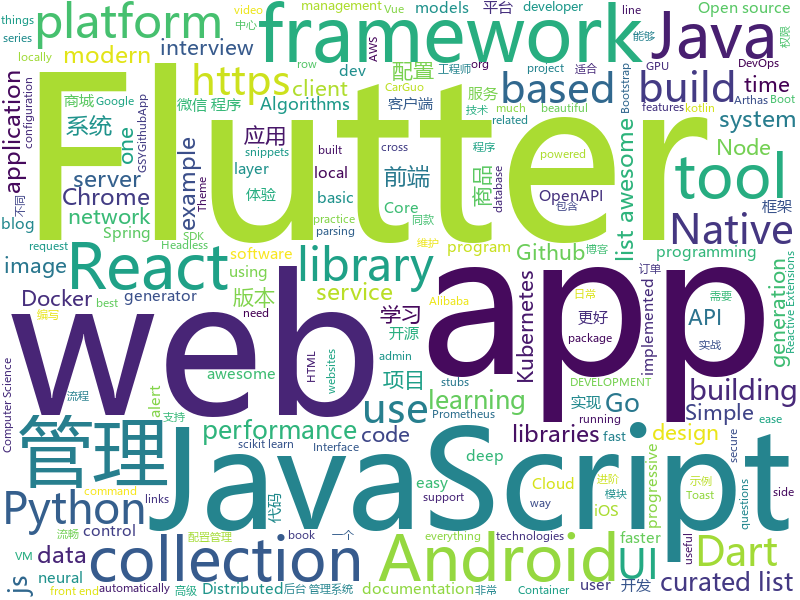

# 2018-12-15
See what the GitHub community is most excited about today.

## python
* [pytext](https://github.com/facebookresearch/pytext)(**642 stars today**): A natural language modeling framework based on PyTorch
* [eeeeeeeeeeeeeeeeeeeeeeeeeeeeeeeeeeeeeeeeeeeeeeeeeeeeeeeeeeeeeeeeeeeeeeeeeeeeeeeeeeeeeeeeeeeeeeeeeeee](https://github.com/eeeeeeeeeeeeeeeeeeeeeeeeeeeeeeee/eeeeeeeeeeeeeeeeeeeeeeeeeeeeeeeeeeeeeeeeeeeeeeeeeeeeeeeeeeeeeeeeeeeeeeeeeeeeeeeeeeeeeeeeeeeeeeeeeeee)(**547 stars today**): eeeeeeeeeeeeeeeeeeeeeeeeeeeeeeeeeeeeeeeeeeeeeeeeeeeeeeeeeeeeeeeeeeeee
* [vaex](https://github.com/vaexio/vaex)(**193 stars today**): Out-of-Core DataFrames for Python, visualize and explore big tabular data at a billion rows per second.
* [loguru](https://github.com/Delgan/loguru)(**167 stars today**): Python logging made (stupidly) simple
* [jax](https://github.com/google/jax)(**96 stars today**): GPU- and TPU-backed NumPy with differentiation and JIT compilation.
* [dgl](https://github.com/dmlc/dgl)(**94 stars today**): Python package built to ease deep learning on graph, on top of existing DL frameworks.
* [torchdiffeq](https://github.com/rtqichen/torchdiffeq)(**94 stars today**): Differentiable ODE solvers with full GPU support and O(1)-memory backpropagation.
* [bert](https://github.com/google-research/bert)(**77 stars today**): TensorFlow code and pre-trained models for BERT
* [wtfpython-cn](https://github.com/leisurelicht/wtfpython-cn)(**63 stars today**): wtfpython的中文翻译/施工结束/ 能力有限，欢迎帮我改进翻译
* [models](https://github.com/tensorflow/models)(**51 stars today**): Models and examples built with TensorFlow
* [mindsdb](https://github.com/mindsdb/mindsdb)(**60 stars today**): Framework to streamline use of neural networks
* [wtfpython](https://github.com/satwikkansal/wtfpython)(**57 stars today**): A collection of surprising Python snippets and lesser-known features.
* [awesome-python](https://github.com/vinta/awesome-python)(**50 stars today**): A curated list of awesome Python frameworks, libraries, software and resources
* [google-research](https://github.com/google-research/google-research)(**51 stars today**): Google AI Research
* [deepvariant](https://github.com/google/deepvariant)(**40 stars today**): DeepVariant is an analysis pipeline that uses a deep neural network to call genetic variants from next-generation DNA sequencing data.
* [home-assistant](https://github.com/home-assistant/home-assistant)(**36 stars today**): 🏡Open source home automation that puts local control and privacy first
* [Python](https://github.com/TheAlgorithms/Python)(**34 stars today**): All Algorithms implemented in Python
* [weixin_crawler](https://github.com/wonderfulsuccess/weixin_crawler)(**34 stars today**): 高效微信公众号历史文章和阅读数据爬虫powered by scrapy
* [system-design-primer](https://github.com/donnemartin/system-design-primer)(**31 stars today**): Learn how to design large-scale systems. Prep for the system design interview. Includes Anki flashcards.
* [cpython](https://github.com/python/cpython)(**29 stars today**): The Python programming language
* [keras](https://github.com/keras-team/keras)(**30 stars today**): Deep Learning for humans
* [youtube-dl](https://github.com/rg3/youtube-dl)(**35 stars today**): Command-line program to download videos from YouTube.com and other video sites
* [loss-landscape](https://github.com/tomgoldstein/loss-landscape)(**35 stars today**): Code for visualizing the loss landscape of neural nets
* [maskrcnn-benchmark](https://github.com/facebookresearch/maskrcnn-benchmark)(**29 stars today**): Fast, modular reference implementation of Instance Segmentation and Object Detection algorithms in PyTorch.
* [scikit-learn](https://github.com/scikit-learn/scikit-learn)(**25 stars today**): scikit-learn: machine learning in Python

## java
* [miaosha](https://github.com/qiurunze123/miaosha)(**506 stars today**): 😮😮秒杀系统设计与实现.互联网工程师进阶与分析🙋🐓
* [JavaGuide](https://github.com/Snailclimb/JavaGuide)(**176 stars today**): 【Java学习+面试指南】 一份涵盖大部分Java程序员所需要掌握的核心知识。
* [tutorials](https://github.com/eugenp/tutorials)(**58 stars today**): The "REST With Spring" Course:
* [arthas](https://github.com/alibaba/arthas)(**59 stars today**): Alibaba Java Diagnostic Tool Arthas/Alibaba Java诊断利器Arthas
* [QMUI_Android](https://github.com/Tencent/QMUI_Android)(**61 stars today**): 提高 Android UI 开发效率的 UI 库
* [apollo](https://github.com/ctripcorp/apollo)(**57 stars today**): Apollo（阿波罗）是携程框架部门研发的分布式配置中心，能够集中化管理应用不同环境、不同集群的配置，配置修改后能够实时推送到应用端，并且具备规范的权限、流程治理等特性，适用于微服务配置管理场景。
* [spring-boot](https://github.com/spring-projects/spring-boot)(**39 stars today**): Spring Boot
* [JCSprout](https://github.com/crossoverJie/JCSprout)(**48 stars today**): 👨‍🎓Java Core Sprout : basic, concurrent, algorithm
* [ArgusAPM](https://github.com/Qihoo360/ArgusAPM)(**51 stars today**): Powerful, comprehensive (Android) application performance management platform. 360移动性能监控平台
* [symphony](https://github.com/b3log/symphony)(**49 stars today**): 🎶一款用 Java 实现的现代化社区（论坛/BBS/社交网络/博客）平台。https://hacpai.com
* [incubator-dubbo](https://github.com/apache/incubator-dubbo)(**42 stars today**): Apache Dubbo (incubating) is a high-performance, java based, open source RPC framework.
* [resilience4j](https://github.com/resilience4j/resilience4j)(**41 stars today**): Resilience4j is a fault tolerance library designed for Java8 and functional programming
* [deeplearning4j](https://github.com/deeplearning4j/deeplearning4j)(**37 stars today**): Deeplearning4j, ND4J, DataVec and more - deep learning & linear algebra for Java/Scala with GPUs + Spark - From Skymind
* [litemall](https://github.com/linlinjava/litemall)(**33 stars today**): 又一个小商城。litemall = Spring Boot后端 + Vue管理员前端 + 微信小程序用户前端
* [Java](https://github.com/TheAlgorithms/Java)(**34 stars today**): All Algorithms implemented in Java
* [spring-framework](https://github.com/spring-projects/spring-framework)(**26 stars today**): Spring Framework
* [nacos](https://github.com/alibaba/nacos)(**35 stars today**): an easy-to-use dynamic service discovery, configuration and service management platform for building cloud native applications(更易于构建云原生应用的动态服务发现、配置管理和服务管理平台)
* [SwipeSpinnerWidget](https://github.com/DarkionAvey/SwipeSpinnerWidget)(**37 stars today**): [Android] A spinner utilizing recycler view to achieve faster scrolling
* [mall](https://github.com/macrozheng/mall)(**32 stars today**): mall项目是一套电商系统，包括前台商城系统及后台管理系统，基于SpringBoot+MyBatis实现。 前台商城系统包含首页门户、商品推荐、商品搜索、商品展示、购物车、订单流程、会员中心、客户服务、帮助中心等模块。 后台管理系统包含商品管理、订单管理、会员管理、促销管理、运营管理、内容管理、统计报表、财务管理、权限管理、设置等模块。
* [JAViewer](https://github.com/SplashCodes/JAViewer)(**29 stars today**): 更优雅的驾车体验
* [elasticsearch](https://github.com/elastic/elasticsearch)(**27 stars today**): Open Source, Distributed, RESTful Search Engine
* [LoginUI-Android](https://github.com/Shashank02051997/LoginUI-Android)(**29 stars today**): Login User Interface in android with innovative, beautiful and creative background😊😊😉
* [RxJava](https://github.com/ReactiveX/RxJava)(**29 stars today**): RxJava – Reactive Extensions for the JVM – a library for composing asynchronous and event-based programs using observable sequences for the Java VM.
* [glide](https://github.com/bumptech/glide)(**27 stars today**): An image loading and caching library for Android focused on smooth scrolling
* [DToast](https://github.com/Dovar66/DToast)(**26 stars today**): 同学，你的系统Toast可能需要修复一下！Fix Your Android Toast!

## unknown
* [the-book-of-secret-knowledge](https://github.com/trimstray/the-book-of-secret-knowledge)(**244 stars today**): 💫A collection of awesome lists, manuals, blogs, hacks, one-liners, cli/web tools and more. For SysOps, DevOps, Pentesters and Security Researchers.
* [FAQGURU](https://github.com/FAQGURU/FAQGURU)(**177 stars today**): A list of interview questions. This repository is everything you need to prepare for your technical interview.🎒🚀🎉
* [pwc](https://github.com/zziz/pwc)(**93 stars today**): Papers with code. Sorted by stars. Updated weekly.
* [react-typescript-cheatsheet](https://github.com/sw-yx/react-typescript-cheatsheet)(**93 stars today**): a cheatsheet for react users using typescript with react for the first (or nth!) time
* [coding-interview-university](https://github.com/jwasham/coding-interview-university)(**81 stars today**): A complete computer science study plan to become a software engineer.
* [CS-Notes](https://github.com/CyC2018/CS-Notes)(**67 stars today**): 📚Computer Science Learning Notes
* [You-Dont-Know-JS](https://github.com/getify/You-Dont-Know-JS)(**61 stars today**): A book series on JavaScript. @YDKJS on twitter.
* [nodebestpractices](https://github.com/i0natan/nodebestpractices)(**63 stars today**): The largest Node.JS best practices list (November 2018)
* [gitignore](https://github.com/github/gitignore)(**44 stars today**): A collection of useful .gitignore templates
* [developer-roadmap](https://github.com/kamranahmedse/developer-roadmap)(**46 stars today**): Roadmap to becoming a web developer in 2018
* [awesome](https://github.com/sindresorhus/awesome)(**46 stars today**): 😎Curated list of awesome lists
* [awesome-sentence-embedding](https://github.com/Separius/awesome-sentence-embedding)(**48 stars today**): A curated list of pretrained sentence(and word) embedding models
* [free-programming-books](https://github.com/EbookFoundation/free-programming-books)(**39 stars today**): 📚Freely available programming books
* [awesome-vue](https://github.com/vuejs/awesome-vue)(**38 stars today**): 🎉A curated list of awesome things related to Vue.js
* [awesome-layers](https://github.com/mthenw/awesome-layers)(**37 stars today**): λ A curated list of awesome AWS Lambda Layers.
* [rust-guide](https://github.com/ANSSI-FR/rust-guide)(**32 stars today**): Recommendations for secure applications development with Rust
* [DarthSidious-Chinese](https://github.com/crazywa1ker/DarthSidious-Chinese)(**32 stars today**): DarthSidious 中文版
* [How-to-Grow-Neat-Software-Architecture-out-of-Jupyter-Notebooks](https://github.com/guillaume-chevalier/How-to-Grow-Neat-Software-Architecture-out-of-Jupyter-Notebooks)(**32 stars today**): Growing the code out of your notebooks - the right way.
* [android-architecture](https://github.com/googlesamples/android-architecture)(**25 stars today**): A collection of samples to discuss and showcase different architectural tools and patterns for Android apps.
* [containers-roadmap](https://github.com/aws/containers-roadmap)(**29 stars today**): This is the public roadmap for AWS container services (ECS, ECR, Fargate, and EKS).
* [blog](https://github.com/yygmind/blog)(**26 stars today**): 我是木易杨，网易高级前端工程师，跟着我每周重点攻克一个前端面试重难点。接下来让我带你走进高级前端的世界，在进阶的路上，共勉！
* [MSEdge](https://github.com/MicrosoftEdge/MSEdge)(**26 stars today**): Microsoft Edge
* [kubernetes-the-hard-way](https://github.com/kelseyhightower/kubernetes-the-hard-way)(**24 stars today**): Bootstrap Kubernetes the hard way on Google Cloud Platform. No scripts.
* [weekly](https://github.com/ruanyf/weekly)(**24 stars today**): 技术分享周刊，每周五发布
* [awesome-react](https://github.com/enaqx/awesome-react)(**21 stars today**): A collection of awesome things regarding React ecosystem.

## javascript
* [quicklink](https://github.com/GoogleChromeLabs/quicklink)(**731 stars today**): ⚡️Faster subsequent page-loads by prefetching in-viewport links during idle time
* [33-js-concepts](https://github.com/leonardomso/33-js-concepts)(**500 stars today**): 📜33 concepts every JavaScript developer should know.
* [30-seconds-of-code](https://github.com/30-seconds/30-seconds-of-code)(**184 stars today**): Curated collection of useful JavaScript snippets that you can understand in 30 seconds or less.
* [javascript-algorithms](https://github.com/trekhleb/javascript-algorithms)(**167 stars today**): 📝Algorithms and data structures implemented in JavaScript with explanations and links to further readings
* [jsPDF](https://github.com/MrRio/jsPDF)(**161 stars today**): Client-side JavaScript PDF generation for everyone.
* [vue](https://github.com/vuejs/vue)(**128 stars today**): 🖖A progressive, incrementally-adoptable JavaScript framework for building UI on the web.
* [learnGitBranching](https://github.com/pcottle/learnGitBranching)(**129 stars today**): An interactive git visualization to challenge and educate!
* [Debucsser](https://github.com/lucagez/Debucsser)(**109 stars today**): CSS debugging tool with an unpronounceable name
* [sharp](https://github.com/lovell/sharp)(**102 stars today**): High performance Node.js image processing, the fastest module to resize JPEG, PNG, WebP and TIFF images. Uses the libvips library.
* [react](https://github.com/facebook/react)(**87 stars today**): A declarative, efficient, and flexible JavaScript library for building user interfaces.
* [WeHalo](https://github.com/aquanlerou/WeHalo)(**88 stars today**): WeHalo 简约风 的微信小程序版博客✨
* [create-react-app](https://github.com/facebook/create-react-app)(**64 stars today**): Set up a modern web app by running one command.
* [three.js](https://github.com/mrdoob/three.js)(**58 stars today**): JavaScript 3D library.
* [overreacted.io](https://github.com/gaearon/overreacted.io)(**66 stars today**): Personal blog by Dan Abramov.
* [taro](https://github.com/NervJS/taro)(**59 stars today**): 多端统一开发框架，支持用 React 的开发方式编写一次代码，生成能运行在微信小程序/百度智能小程序/支付宝小程序、H5、React Native 等的应用。 https://taro.js.org/
* [gatsby](https://github.com/gatsbyjs/gatsby)(**52 stars today**): Build blazing fast, modern apps and websites with React
* [slate](https://github.com/lord/slate)(**44 stars today**): Beautiful static documentation for your API
* [axios](https://github.com/axios/axios)(**50 stars today**): Promise based HTTP client for the browser and node.js
* [react-native](https://github.com/facebook/react-native)(**46 stars today**): A framework for building native apps with React.
* [writefreely](https://github.com/writeas/writefreely)(**50 stars today**): A simple, federated blogging platform.
* [arg](https://github.com/zeit/arg)(**50 stars today**): Simple argument parsing
* [awesome-selfhosted](https://github.com/Kickball/awesome-selfhosted)(**46 stars today**): This is a list of Free Software network services and web applications which can be hosted locally. Selfhosting is the process of locally hosting and managing applications instead of renting from SaaS providers.
* [puppeteer](https://github.com/GoogleChrome/puppeteer)(**42 stars today**): Headless Chrome Node API
* [next.js](https://github.com/zeit/next.js)(**43 stars today**): The React Framework
* [ant-design-pro](https://github.com/ant-design/ant-design-pro)(**37 stars today**): 👨🏻‍💻👩🏻‍💻 Use Ant Design like a Pro!

## html
* [nginxconfig.io](https://github.com/valentinxxx/nginxconfig.io)(**98 stars today**): ⚙️NGiИX config generator generator on steroids💉
* [Front-end-Developer-Interview-Questions](https://github.com/h5bp/Front-end-Developer-Interview-Questions)(**21 stars today**): A list of helpful front-end related questions you can use to interview potential candidates, test yourself or completely ignore.
* [flutter-in-action](https://github.com/flutterchina/flutter-in-action)(**15 stars today**): 《Flutter实战》电子书
* [AdminLTE](https://github.com/almasaeed2010/AdminLTE)(**14 stars today**): AdminLTE - Free Premium Admin control Panel Theme Based On Bootstrap 3.x
* [JavaScript30](https://github.com/wesbos/JavaScript30)(**10 stars today**): 30 Day Vanilla JS Challenge
* [design-blocks](https://github.com/froala/design-blocks)(**13 stars today**): A set of 170+ Bootstrap based design blocks ready to be used to create clean modern websites.
* [qiubaiying.github.io](https://github.com/qiubaiying/qiubaiying.github.io)(**6 stars today**): BY Blog ->
* [Spoon-Knife](https://github.com/octocat/Spoon-Knife)(****): This repo is for demonstration purposes only.
* [ionic](https://github.com/ionic-team/ionic)(**7 stars today**): Build amazing native and progressive web apps with open web technologies. One app running on everything🎉
* [capacitor](https://github.com/ionic-team/capacitor)(**10 stars today**): Build cross-platform Native Progressive Web Apps for iOS, Android, and the web⚡️
* [javascript-tutorial-en](https://github.com/iliakan/javascript-tutorial-en)(**8 stars today**): Modern JavaScript Tutorial
* [swagger-codegen](https://github.com/swagger-api/swagger-codegen)(**8 stars today**): swagger-codegen contains a template-driven engine to generate documentation, API clients and server stubs in different languages by parsing your OpenAPI / Swagger definition.
* [Moon](https://github.com/TaylanTatli/Moon)(**5 stars today**): Moon is a minimal, one column jekyll theme.
* [css-houdini-drafts](https://github.com/w3c/css-houdini-drafts)(**8 stars today**): Mirror of https://hg.css-houdini.org/drafts
* [frida-all-in-one](https://github.com/hookmaster/frida-all-in-one)(**8 stars today**): 《FRIDA操作手册》by @hluwa @r0ysue
* [now-github-starter](https://github.com/zeit/now-github-starter)(****): Starter project to demonstrate a project whose pull requests get automatically deployed
* [react-naive-book](https://github.com/huzidaha/react-naive-book)(**6 stars today**): 开源、免费、专业、简单的 React.js 在线教程
* [change-password-url](https://github.com/WICG/change-password-url)(**6 stars today**): 
* [portainer](https://github.com/portainer/portainer)(**6 stars today**): Simple management UI for Docker
* [polymer](https://github.com/Polymer/polymer)(**6 stars today**): Our original Web Component library.
* [ng-alain](https://github.com/ng-alain/ng-alain)(**6 stars today**): ng-zorro-antd admin panel front-end framework
* [scikit-learn-doc-zh](https://github.com/apachecn/scikit-learn-doc-zh)(**6 stars today**): 📖[译] scikit-learn（sklearn） 中文文档
* [openapi-generator](https://github.com/OpenAPITools/openapi-generator)(**5 stars today**): OpenAPI Generator allows generation of API client libraries (SDK generation), server stubs, documentation and configuration automatically given an OpenAPI Spec (v2, v3)
* [requests-html](https://github.com/kennethreitz/requests-html)(**5 stars today**): Pythonic HTML Parsing for Humans™
* [primeng](https://github.com/primefaces/primeng)(**5 stars today**): UI Components for Angular

## dart
* [flutter](https://github.com/flutter/flutter)(**204 stars today**): Flutter makes it easy and fast to build beautiful mobile apps.
* [awesome-flutter](https://github.com/Solido/awesome-flutter)(**89 stars today**): An awesome list that curates the best Flutter libraries, tools, tutorials, articles and more.
* [quiet-flutter](https://github.com/boyan01/quiet-flutter)(**31 stars today**): a flutter music player app
* [plugins](https://github.com/flutter/plugins)(**18 stars today**): Plugins for Flutter, including FlutterFire, maintained by the Flutter team
* [dio](https://github.com/flutterchina/dio)(**23 stars today**): A powerful Http client for Dart, which supports Interceptors, FormData, Request Cancellation, File Downloading, Timeout etc.
* [flutter_layout](https://github.com/nb312/flutter_layout)(**15 stars today**): Layout of the flutter example.such as Row,Comlun,listview,Just for learning.
* [Flutter-learning](https://github.com/AweiLoveAndroid/Flutter-learning)(**13 stars today**): 🔥👍🌟⭐️⭐️⭐️Flutter安装和配置，Flutter开发遇到的难题，Flutter示例代码和模板，Flutter项目实战，Dart语言学习示例代码。
* [samples](https://github.com/flutter/samples)(**12 stars today**): A collection of Flutter examples and demos.
* [inKino](https://github.com/roughike/inKino)(**8 stars today**): A multiplatform Dart movie app with 40% of code sharing between Flutter and the Web.
* [rxdart](https://github.com/ReactiveX/rxdart)(**7 stars today**): The Reactive Extensions for Dart
* [rflutter_alert](https://github.com/RatelHub/rflutter_alert)(**7 stars today**): RFlutter Alert is super customizable and easy-to-use alert/popup dialog library for Flutter. You may create reusable alert styles or add buttons as much as you want with ease.
* [inject.dart](https://github.com/google/inject.dart)(**6 stars today**): Compile-time dependency injection for Dart and Flutter
* [flutter_cached_network_image](https://github.com/renefloor/flutter_cached_network_image)(**6 stars today**): Download, cache and show images in a flutter app
* [sdk](https://github.com/dart-lang/sdk)(**5 stars today**): The Dart SDK, including the VM, dart2js, core libraries, and more.
* [functional_widget](https://github.com/rrousselGit/functional_widget)(**5 stars today**): 
* [Flare-Flutter](https://github.com/2d-inc/Flare-Flutter)(****): 
* [chromedeveditor](https://github.com/googlearchive/chromedeveditor)(****): Chrome Dev Editor is a developer tool for building apps on the Chrome platform - Chrome Apps and Web Apps, in JavaScript or Dart. (NO LONGER IN ACTIVE DEVELOPMENT)
* [GSYGithubAppFlutter](https://github.com/CarGuo/GSYGithubAppFlutter)(****): 超完整的Flutter项目，功能丰富，适合学习和日常使用。GSYGithubApp系列的优势：我们目前已经拥有Flutter、Weex、ReactNative、kotlin 四个版本。 功能齐全，项目框架内技术涉及面广，完成度高，持续维护，配套文章，适合全面学习，对比参考。跨平台的开源Github客户端App，更好的体验，更丰富的功能，旨在更好的日常管理和维护个人Github，提供更好更方便的驾车体验Σ(￣。￣ﾉ)ﾉ。同款Weex版本 ： https://github.com/CarGuo/GSYGithubAppWeex 、同款React Native版本 ： https://github.com/CarGuo/GSYGithubApp 、原生 kotlin 版本 https://g…
* [FlutterExampleApps](https://github.com/iampawan/FlutterExampleApps)(****): [Example APPS] Basic Flutter apps, for flutter devs.
* [flutter-examples](https://github.com/nisrulz/flutter-examples)(****): [Examples] Simple basic isolated apps, for budding flutter devs.
* [flutter_architecture_samples](https://github.com/brianegan/flutter_architecture_samples)(****): TodoMVC for Flutter
* [Flutter-UI-Kit](https://github.com/iampawan/Flutter-UI-Kit)(****): Flutter app for collection of UI in a UIKit
* [flutter-osc](https://github.com/yubo725/flutter-osc)(****): 基于Google Flutter的开源中国客户端，支持Android和iOS。
* [zhihu-flutter](https://github.com/HackSoul/zhihu-flutter)(****): Flutter 高仿知乎 UI，非常漂亮，也非常流畅，flutter build apk 或 flutter build ios 之后更流畅
* [hauberk](https://github.com/munificent/hauberk)(****): A web-based roguelike written in Dart.

## go
* [loki](https://github.com/grafana/loki)(**439 stars today**): Like Prometheus, but for logs.
* [gotenberg](https://github.com/thecodingmachine/gotenberg)(**182 stars today**): A Docker-powered stateless API for converting HTML, Markdown and Office documents to PDF
* [certmagic](https://github.com/mholt/certmagic)(**131 stars today**): Automatic HTTPS for any Go program: fully-managed TLS certificate issuance and renewal
* [BaiduPCS-Go](https://github.com/iikira/BaiduPCS-Go)(**109 stars today**): 百度网盘客户端 - Go语言编写
* [rendora](https://github.com/rendora/rendora)(**87 stars today**): dynamic server-side rendering using headless Chrome to effortlessly solve the SEO problem for modern javascript websites
* [docker_practice](https://github.com/yeasy/docker_practice)(**84 stars today**): Learn and understand Docker technologies, with real DevOps practice!
* [kubernetes](https://github.com/kubernetes/kubernetes)(**52 stars today**): Production-Grade Container Scheduling and Management
* [vitess](https://github.com/vitessio/vitess)(**57 stars today**): Vitess is a database clustering system for horizontal scaling of MySQL.
* [go](https://github.com/golang/go)(**53 stars today**): The Go programming language
* [db](https://github.com/upper/db)(**51 stars today**): Productive data access layer for Go.
* [dive](https://github.com/wagoodman/dive)(**48 stars today**): A tool for exploring each layer in a docker image
* [istio](https://github.com/istio/istio)(**40 stars today**): Connect, secure, control, and observe services.
* [frp](https://github.com/fatedier/frp)(**38 stars today**): A fast reverse proxy to help you expose a local server behind a NAT or firewall to the internet.
* [ethr](https://github.com/Microsoft/ethr)(**40 stars today**): Ethr is a Network Performance Measurement Tool for TCP, UDP & HTTP.
* [awesome-go](https://github.com/avelino/awesome-go)(**37 stars today**): A curated list of awesome Go frameworks, libraries and software
* [build-web-application-with-golang](https://github.com/astaxie/build-web-application-with-golang)(**31 stars today**): A golang ebook intro how to build a web with golang
* [traefik](https://github.com/containous/traefik)(**31 stars today**): The Cloud Native Edge Router
* [v2ray-core](https://github.com/v2ray/v2ray-core)(**31 stars today**): A platform for building proxies to bypass network restrictions.
* [kind](https://github.com/kubernetes-sigs/kind)(**29 stars today**): Kubernetes IN Docker - local clusters for testing Kubernetes
* [fzf](https://github.com/junegunn/fzf)(**27 stars today**): 🌸A command-line fuzzy finder
* [gin](https://github.com/gin-gonic/gin)(**25 stars today**): Gin is a HTTP web framework written in Go (Golang). It features a Martini-like API with much better performance -- up to 40 times faster. If you need smashing performance, get yourself some Gin.
* [helm](https://github.com/helm/helm)(**22 stars today**): The Kubernetes Package Manager
* [caddy](https://github.com/mholt/caddy)(**24 stars today**): Fast, cross-platform HTTP/2 web server with automatic HTTPS
* [prometheus](https://github.com/prometheus/prometheus)(**21 stars today**): The Prometheus monitoring system and time series database.
* [etcd](https://github.com/etcd-io/etcd)(**21 stars today**): Distributed reliable key-value store for the most critical data of a distributed system

## WordCloud

