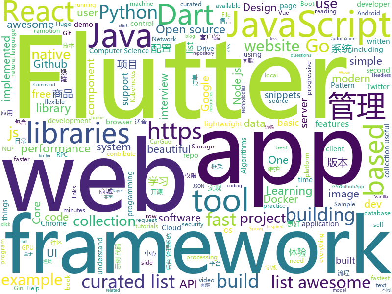

# 2018-12-17
See what the GitHub community is most excited about today.

## python
* [pytext](https://github.com/facebookresearch/pytext)(**435 stars today**): A natural language modeling framework based on PyTorch
* [eeeeeeeeeeeeeeeeeeeeeeeeeeeeeeeeeeeeeeeeeeeeeeeeeeeeeeeeeeeeeeeeeeeeeeeeeeeeeeeeeeeeeeeeeeeeeeeeeeee](https://github.com/eeeeeeeeeeeeeeeeeeeeeeeeeeeeeeee/eeeeeeeeeeeeeeeeeeeeeeeeeeeeeeeeeeeeeeeeeeeeeeeeeeeeeeeeeeeeeeeeeeeeeeeeeeeeeeeeeeeeeeeeeeeeeeeeeeee)(**280 stars today**): eeeeeeeeeeeeeeeeeeeeeeeeeeeeeeeeeeeeeeeeeeeeeeeeeeeeeeeeeeeeeeeeeeeee
* [pampy](https://github.com/santinic/pampy)(**93 stars today**): Pampy: The Pattern Matching for Python you always dreamed of.
* [wtfpython-cn](https://github.com/leisurelicht/wtfpython-cn)(**67 stars today**): wtfpython的中文翻译/施工结束/ 能力有限，欢迎帮我改进翻译
* [jax](https://github.com/google/jax)(**62 stars today**): GPU- and TPU-backed NumPy with differentiation and JIT compilation.
* [wtfpython](https://github.com/satwikkansal/wtfpython)(**56 stars today**): A collection of surprising Python snippets and lesser-known features.
* [home-assistant](https://github.com/home-assistant/home-assistant)(**39 stars today**): 🏡Open source home automation that puts local control and privacy first
* [models](https://github.com/tensorflow/models)(**34 stars today**): Models and examples built with TensorFlow
* [openvpn-at-home](https://github.com/ezaquarii/openvpn-at-home)(**43 stars today**): 1-click, self-hosted OpenVPN deployment and management app.
* [bert](https://github.com/google-research/bert)(**40 stars today**): TensorFlow code and pre-trained models for BERT
* [awesome-python](https://github.com/vinta/awesome-python)(**39 stars today**): A curated list of awesome Python frameworks, libraries, software and resources
* [vaex](https://github.com/vaexio/vaex)(**40 stars today**): Out-of-Core DataFrames for Python, visualize and explore big tabular data at a billion rows per second.
* [loguru](https://github.com/Delgan/loguru)(**37 stars today**): Python logging made (stupidly) simple
* [system-design-primer](https://github.com/donnemartin/system-design-primer)(**34 stars today**): Learn how to design large-scale systems. Prep for the system design interview. Includes Anki flashcards.
* [torchdiffeq](https://github.com/rtqichen/torchdiffeq)(**35 stars today**): Differentiable ODE solvers with full GPU support and O(1)-memory backpropagation.
* [keras](https://github.com/keras-team/keras)(**27 stars today**): Deep Learning for humans
* [Python](https://github.com/TheAlgorithms/Python)(**26 stars today**): All Algorithms implemented in Python
* [twint](https://github.com/twintproject/twint)(**28 stars today**): An advanced Twitter scraping & OSINT tool written in Python that doesn't use Twitter's API, allowing you to scrape a user's followers, following, Tweets and more while evading most API limitations.
* [youtube-dl](https://github.com/rg3/youtube-dl)(**24 stars today**): Command-line program to download videos from YouTube.com and other video sites
* [pysheeet](https://github.com/crazyguitar/pysheeet)(**24 stars today**): Python Cheat Sheet
* [scikit-learn](https://github.com/scikit-learn/scikit-learn)(**23 stars today**): scikit-learn: machine learning in Python
* [awesome-machine-learning](https://github.com/josephmisiti/awesome-machine-learning)(**20 stars today**): A curated list of awesome Machine Learning frameworks, libraries and software.
* [flask](https://github.com/pallets/flask)(**21 stars today**): The Python micro framework for building web applications.
* [public-apis](https://github.com/toddmotto/public-apis)(**20 stars today**): A collective list of free APIs for use in software and web development.
* [django](https://github.com/django/django)(**17 stars today**): The Web framework for perfectionists with deadlines.

## java
* [mall](https://github.com/macrozheng/mall)(**126 stars today**): mall项目是一套电商系统，包括前台商城系统及后台管理系统，基于SpringBoot+MyBatis实现。 前台商城系统包含首页门户、商品推荐、商品搜索、商品展示、购物车、订单流程、会员中心、客户服务、帮助中心等模块。 后台管理系统包含商品管理、订单管理、会员管理、促销管理、运营管理、内容管理、统计报表、财务管理、权限管理、设置等模块。
* [Dank](https://github.com/saket/Dank)(**143 stars today**): Here lies the greatest Reddit app that was never released
* [miaosha](https://github.com/qiurunze123/miaosha)(**127 stars today**): 😮😮秒杀系统设计与实现.互联网工程师进阶与分析🙋🐓
* [JavaGuide](https://github.com/Snailclimb/JavaGuide)(**77 stars today**): 【Java学习+面试指南】 一份涵盖大部分Java程序员所需要掌握的核心知识。
* [java-design-patterns](https://github.com/iluwatar/java-design-patterns)(**60 stars today**): Design patterns implemented in Java
* [Java](https://github.com/TheAlgorithms/Java)(**35 stars today**): All Algorithms implemented in Java
* [symphony](https://github.com/b3log/symphony)(**30 stars today**): 🎶一款用 Java 实现的现代化社区（论坛/BBS/社交网络/博客）平台。https://hacpai.com
* [elasticsearch](https://github.com/elastic/elasticsearch)(**30 stars today**): Open Source, Distributed, RESTful Search Engine
* [arthas](https://github.com/alibaba/arthas)(**28 stars today**): Alibaba Java Diagnostic Tool Arthas/Alibaba Java诊断利器Arthas
* [tutorials](https://github.com/eugenp/tutorials)(**17 stars today**): The "REST With Spring" Course:
* [JCSprout](https://github.com/crossoverJie/JCSprout)(**21 stars today**): 👨‍🎓Java Core Sprout : basic, concurrent, algorithm
* [spring-boot](https://github.com/spring-projects/spring-boot)(**21 stars today**): Spring Boot
* [litemall](https://github.com/linlinjava/litemall)(**20 stars today**): 又一个小商城。litemall = Spring Boot后端 + Vue管理员前端 + 微信小程序用户前端
* [incubator-dubbo](https://github.com/apache/incubator-dubbo)(**17 stars today**): Apache Dubbo (incubating) is a high-performance, java based, open source RPC framework.
* [android-ui-animation-components-and-libraries](https://github.com/Ramotion/android-ui-animation-components-and-libraries)(**16 stars today**): Android UI libraries, components and animations by @Ramotion - https://dev.ramotion.com/gthbr
* [spring-framework](https://github.com/spring-projects/spring-framework)(**11 stars today**): Spring Framework
* [dbeaver](https://github.com/dbeaver/dbeaver)(**14 stars today**): Free universal database tool and SQL client
* [JAViewer](https://github.com/SplashCodes/JAViewer)(**14 stars today**): 更优雅的驾车体验
* [java8-tutorial](https://github.com/winterbe/java8-tutorial)(**12 stars today**): Modern Java - A Guide to Java 8
* [fastjson](https://github.com/alibaba/fastjson)(**12 stars today**): 🚄A fast JSON parser/generator for Java
* [guava](https://github.com/google/guava)(**12 stars today**): Google core libraries for Java
* [jenkins](https://github.com/jenkinsci/jenkins)(**12 stars today**): Jenkins automation server
* [HanLP](https://github.com/hankcs/HanLP)(**11 stars today**): 自然语言处理 中文分词 词性标注 命名实体识别 依存句法分析 新词发现 关键词短语提取 自动摘要 文本分类聚类 拼音简繁
* [apollo](https://github.com/ctripcorp/apollo)(**10 stars today**): Apollo（阿波罗）是携程框架部门研发的分布式配置中心，能够集中化管理应用不同环境、不同集群的配置，配置修改后能够实时推送到应用端，并且具备规范的权限、流程治理等特性，适用于微服务配置管理场景。
* [jadx](https://github.com/skylot/jadx)(**12 stars today**): Dex to Java decompiler

## unknown
* [the-book-of-secret-knowledge](https://github.com/trimstray/the-book-of-secret-knowledge)(**423 stars today**): 💫A collection of awesome lists, manuals, blogs, hacks, one-liners, cli/web tools and more. For SysOps, DevOps, Pentesters and Security Researchers.
* [FAQGURU](https://github.com/FAQGURU/FAQGURU)(**175 stars today**): A list of interview questions. This repository is everything you need to prepare for your technical interview.🎒🚀🎉
* [coding-interview-university](https://github.com/jwasham/coding-interview-university)(**90 stars today**): A complete computer science study plan to become a software engineer.
* [policies](https://github.com/basecamp/policies)(**75 stars today**): Basecamp policies, terms, and legal. Share them; reuse them; contribute to them.
* [CS-Notes](https://github.com/CyC2018/CS-Notes)(**49 stars today**): 📚Computer Science Learning Notes
* [You-Dont-Know-JS](https://github.com/getify/You-Dont-Know-JS)(**43 stars today**): A book series on JavaScript. @YDKJS on twitter.
* [gitignore](https://github.com/github/gitignore)(**33 stars today**): A collection of useful .gitignore templates
* [awesome](https://github.com/sindresorhus/awesome)(**35 stars today**): 😎Curated list of awesome lists
* [developer-roadmap](https://github.com/kamranahmedse/developer-roadmap)(**34 stars today**): Roadmap to becoming a web developer in 2018
* [nodebestpractices](https://github.com/i0natan/nodebestpractices)(**34 stars today**): The largest Node.JS best practices list (November 2018)
* [free-programming-books](https://github.com/EbookFoundation/free-programming-books)(**26 stars today**): 📚Freely available programming books
* [hosts](https://github.com/googlehosts/hosts)(**20 stars today**): 镜像：https://coding.net/u/scaffrey/p/hosts/git
* [project-based-learning](https://github.com/tuvtran/project-based-learning)(**21 stars today**): Curated list of project-based tutorials
* [awesome-vue](https://github.com/vuejs/awesome-vue)(**20 stars today**): 🎉A curated list of awesome things related to Vue.js
* [awesome-react](https://github.com/enaqx/awesome-react)(**18 stars today**): A collection of awesome things regarding React ecosystem.
* [pwc](https://github.com/zziz/pwc)(**18 stars today**): Papers with code. Sorted by stars. Updated weekly.
* [model-based-papers](https://github.com/danfeiX/model-based-papers)(**16 stars today**): My reading list for model-based control
* [first-contributions](https://github.com/firstcontributions/first-contributions)(**9 stars today**): 🚀✨Help beginners to contribute to open source projects
* [goQuality-dev-contents](https://github.com/Integerous/goQuality-dev-contents)(**17 stars today**): { 고퀄리티⚡️개발 컨텐츠 모음 }
* [gold-miner](https://github.com/xitu/gold-miner)(**15 stars today**): 🥇掘金翻译计划，可能是世界最大最好的英译中技术社区，最懂读者和译者的翻译平台：
* [awesome-cpp](https://github.com/fffaraz/awesome-cpp)(**15 stars today**): A curated list of awesome C++ (or C) frameworks, libraries, resources, and shiny things. Inspired by awesome-... stuff.
* [react-typescript-cheatsheet](https://github.com/sw-yx/react-typescript-cheatsheet)(**14 stars today**): a cheatsheet for react users using typescript with react for the first (or nth!) time
* [computer-science](https://github.com/ossu/computer-science)(**13 stars today**): 🎓Path to a free self-taught education in Computer Science!
* [rust-guide](https://github.com/ANSSI-FR/rust-guide)(**12 stars today**): Recommendations for secure applications development with Rust
* [awesome-docker](https://github.com/veggiemonk/awesome-docker)(**12 stars today**): 🐳A curated list of Docker resources and projects

## javascript
* [react-jsonschema-form](https://github.com/mozilla-services/react-jsonschema-form)(**208 stars today**): A React component for building Web forms from JSON Schema.
* [33-js-concepts](https://github.com/leonardomso/33-js-concepts)(**151 stars today**): 📜33 concepts every JavaScript developer should know.
* [quicklink](https://github.com/GoogleChromeLabs/quicklink)(**148 stars today**): ⚡️Faster subsequent page-loads by prefetching in-viewport links during idle time
* [javascript-algorithms](https://github.com/trekhleb/javascript-algorithms)(**100 stars today**): 📝Algorithms and data structures implemented in JavaScript with explanations and links to further readings
* [vue](https://github.com/vuejs/vue)(**81 stars today**): 🖖A progressive, incrementally-adoptable JavaScript framework for building UI on the web.
* [30-seconds-of-code](https://github.com/30-seconds/30-seconds-of-code)(**79 stars today**): Curated collection of useful JavaScript snippets that you can understand in 30 seconds or less.
* [arg](https://github.com/zeit/arg)(**68 stars today**): Simple argument parsing
* [create-react-app](https://github.com/facebook/create-react-app)(**51 stars today**): Set up a modern web app by running one command.
* [react](https://github.com/facebook/react)(**44 stars today**): A declarative, efficient, and flexible JavaScript library for building user interfaces.
* [forgJs](https://github.com/oussamahamdaoui/forgJs)(**46 stars today**): ForgJs is a javascript lightweight object validator. Go check the Quick start section and start coding with love
* [next](https://github.com/alibaba-fusion/next)(**44 stars today**): A configurable component library for web built on React.
* [axios](https://github.com/axios/axios)(**41 stars today**): Promise based HTTP client for the browser and node.js
* [tabulator](https://github.com/olifolkerd/tabulator)(**40 stars today**): Interactive Tables and Data Grids for JavaScript
* [Debucsser](https://github.com/lucagez/Debucsser)(**37 stars today**): CSS debugging tool with an unpronounceable name
* [Glider.js](https://github.com/NickPiscitelli/Glider.js)(**37 stars today**): A fast, lightweight, dependency free, native scrolling carousel alternative!
* [strapi](https://github.com/strapi/strapi)(**33 stars today**): 🚀Open source Node.js Headless CMS to easily build customisable APIs
* [jsPDF](https://github.com/MrRio/jsPDF)(**33 stars today**): Client-side JavaScript PDF generation for everyone.
* [material-ui](https://github.com/mui-org/material-ui)(**30 stars today**): React components that implement Google's Material Design.
* [next.js](https://github.com/zeit/next.js)(**26 stars today**): The React Framework
* [sharp](https://github.com/lovell/sharp)(**29 stars today**): High performance Node.js image processing, the fastest module to resize JPEG, PNG, WebP and TIFF images. Uses the libvips library.
* [node](https://github.com/nodejs/node)(**21 stars today**): Node.js JavaScript runtime✨🐢🚀✨
* [pampy.js](https://github.com/santinic/pampy.js)(**28 stars today**): Pampy.js: Pattern Matching for JavaScript
* [gatsby](https://github.com/gatsbyjs/gatsby)(**24 stars today**): Build blazing fast, modern apps and websites with React
* [public-ip-cli](https://github.com/sindresorhus/public-ip-cli)(**26 stars today**): Get your public IP address
* [vue-sails-example](https://github.com/ndabAP/vue-sails-example)(**25 stars today**): Vue.js with Sails.js example project with many features

## html
* [frida-all-in-one](https://github.com/hookmaster/frida-all-in-one)(**16 stars today**): 《FRIDA操作手册》by @hluwa @r0ysue
* [JavaScript30](https://github.com/wesbos/JavaScript30)(**12 stars today**): 30 Day Vanilla JS Challenge
* [fastText](https://github.com/facebookresearch/fastText)(**14 stars today**): Library for fast text representation and classification.
* [programming-principles](https://github.com/webpro/programming-principles)(**14 stars today**): Categorized overview of Programming Principles & Patterns
* [GTFOBins.github.io](https://github.com/GTFOBins/GTFOBins.github.io)(**13 stars today**): Curated list of Unix binaries that can be exploited to bypass system security restrictions
* [NLP-progress](https://github.com/sebastianruder/NLP-progress)(**9 stars today**): Repository to track the progress in Natural Language Processing (NLP), including the datasets and the current state-of-the-art for the most common NLP tasks.
* [ionic](https://github.com/ionic-team/ionic)(**6 stars today**): Build amazing native and progressive web apps with open web technologies. One app running on everything🎉
* [yall.js](https://github.com/malchata/yall.js)(**10 stars today**): A fast, flexible, and small image lazy loader!
* [textasdata](https://github.com/cbail/textasdata)(**10 stars today**): This is a repo for a class on Text as Data
* [javascript-tutorial-en](https://github.com/iliakan/javascript-tutorial-en)(**8 stars today**): Modern JavaScript Tutorial
* [Front-end-Developer-Interview-Questions](https://github.com/h5bp/Front-end-Developer-Interview-Questions)(**8 stars today**): A list of helpful front-end related questions you can use to interview potential candidates, test yourself or completely ignore.
* [flutter-in-action](https://github.com/flutterchina/flutter-in-action)(**7 stars today**): 《Flutter实战》电子书
* [Spoon-Knife](https://github.com/octocat/Spoon-Knife)(****): This repo is for demonstration purposes only.
* [now-github-starter](https://github.com/zeit/now-github-starter)(****): Starter project to demonstrate a project whose pull requests get automatically deployed
* [AdminLTE](https://github.com/almasaeed2010/AdminLTE)(**6 stars today**): AdminLTE - Free Premium Admin control Panel Theme Based On Bootstrap 3.x
* [hugo-academic](https://github.com/gcushen/hugo-academic)(**5 stars today**): The website designer for Hugo. Build and deploy a beautiful website in minutes🚀
* [beautiful-jekyll](https://github.com/daattali/beautiful-jekyll)(****): ✨Build a beautiful and simple website in literally minutes. Demo at http://deanattali.com/beautiful-jekyll
* [30-seconds-of-css](https://github.com/30-seconds/30-seconds-of-css)(**6 stars today**): A curated collection of useful CSS snippets you can understand in 30 seconds or less.
* [rellax](https://github.com/dixonandmoe/rellax)(**6 stars today**): Lightweight, vanilla javascript parallax library
* [fastclick](https://github.com/ftlabs/fastclick)(**5 stars today**): Polyfill to remove click delays on browsers with touch UIs
* [EIPs](https://github.com/ethereum/EIPs)(**5 stars today**): The Ethereum Improvement Proposal repository
* [cstate](https://github.com/cstate/cstate)(**5 stars today**): 🔥Open source static status page. Uses hyperfast Golang & Hugo, minimal JS, super light HTML/CSS, customizable, outstanding browser support (IE8+). Live demo available at linked website.
* [home-assistant.io](https://github.com/home-assistant/home-assistant.io)(****): 📘Home Assistant User documentation
* [patchwork](https://github.com/jlord/patchwork)(****): All the Git-it Workshop completers!
* [course-git-blog-project](https://github.com/udacity/course-git-blog-project)(****): Sample repo of a blog for the Git course

## dart
* [flutter](https://github.com/flutter/flutter)(**81 stars today**): Flutter makes it easy and fast to build beautiful mobile apps.
* [awesome-flutter](https://github.com/Solido/awesome-flutter)(**65 stars today**): An awesome list that curates the best Flutter libraries, tools, tutorials, articles and more.
* [plugins](https://github.com/flutter/plugins)(**18 stars today**): Plugins for Flutter, including FlutterFire, maintained by the Flutter team
* [flutter_layout](https://github.com/nb312/flutter_layout)(**10 stars today**): Layout of the flutter example.such as Row,Comlun,listview,Just for learning.
* [samples](https://github.com/flutter/samples)(**9 stars today**): A collection of Flutter examples and demos.
* [Flutter-Notebook](https://github.com/OpenFlutter/Flutter-Notebook)(**8 stars today**): 日更的FlutterDemo合集，今天你fu了吗
* [Flutter-learning](https://github.com/AweiLoveAndroid/Flutter-learning)(**8 stars today**): 🔥👍🌟⭐️⭐️⭐️Flutter安装和配置，Flutter开发遇到的难题，Flutter示例代码和模板，Flutter项目实战，Dart语言学习示例代码。
* [Flutter-UI-Kit](https://github.com/iampawan/Flutter-UI-Kit)(**6 stars today**): Flutter app for collection of UI in a UIKit
* [TheGorgeousLogin](https://github.com/huextrat/TheGorgeousLogin)(**6 stars today**): Login page built with @flutter😍
* [Flare-Flutter](https://github.com/2d-inc/Flare-Flutter)(**6 stars today**): 
* [sdk](https://github.com/dart-lang/sdk)(**5 stars today**): The Dart SDK, including the VM, dart2js, core libraries, and more.
* [angel](https://github.com/angel-dart/angel)(****): A batteries-included, full-stack Web server framework for Dart. (Application boilerplate)
* [dart-tutorials-samples](https://github.com/dart-lang/dart-tutorials-samples)(****): Sample code for "A Game of Darts" tutorial
* [flutter_picker](https://github.com/yangyxd/flutter_picker)(****): Flutter picker plugin
* [mockito](https://github.com/dart-lang/mockito)(****): Mockito-inspired mock library for Dart
* [chromedeveditor](https://github.com/googlearchive/chromedeveditor)(****): Chrome Dev Editor is a developer tool for building apps on the Chrome platform - Chrome Apps and Web Apps, in JavaScript or Dart. (NO LONGER IN ACTIVE DEVELOPMENT)
* [GSYGithubAppFlutter](https://github.com/CarGuo/GSYGithubAppFlutter)(****): 超完整的Flutter项目，功能丰富，适合学习和日常使用。GSYGithubApp系列的优势：我们目前已经拥有Flutter、Weex、ReactNative、kotlin 四个版本。 功能齐全，项目框架内技术涉及面广，完成度高，持续维护，配套文章，适合全面学习，对比参考。跨平台的开源Github客户端App，更好的体验，更丰富的功能，旨在更好的日常管理和维护个人Github，提供更好更方便的驾车体验Σ(￣。￣ﾉ)ﾉ。同款Weex版本 ： https://github.com/CarGuo/GSYGithubAppWeex 、同款React Native版本 ： https://github.com/CarGuo/GSYGithubApp 、原生 kotlin 版本 https://g…
* [FlutterExampleApps](https://github.com/iampawan/FlutterExampleApps)(****): [Example APPS] Basic Flutter apps, for flutter devs.
* [flutter-examples](https://github.com/nisrulz/flutter-examples)(****): [Examples] Simple basic isolated apps, for budding flutter devs.
* [flutter_architecture_samples](https://github.com/brianegan/flutter_architecture_samples)(****): TodoMVC for Flutter
* [dio](https://github.com/flutterchina/dio)(****): A powerful Http client for Dart, which supports Interceptors, FormData, Request Cancellation, File Downloading, Timeout etc.
* [inKino](https://github.com/roughike/inKino)(****): A multiplatform Dart movie app with 40% of code sharing between Flutter and the Web.
* [flutter-osc](https://github.com/yubo725/flutter-osc)(****): 基于Google Flutter的开源中国客户端，支持Android和iOS。
* [zhihu-flutter](https://github.com/HackSoul/zhihu-flutter)(****): Flutter 高仿知乎 UI，非常漂亮，也非常流畅，flutter build apk 或 flutter build ios 之后更流畅
* [hauberk](https://github.com/munificent/hauberk)(****): A web-based roguelike written in Dart.

## go
* [loki](https://github.com/grafana/loki)(**140 stars today**): Like Prometheus, but for logs.
* [vegeta](https://github.com/tsenart/vegeta)(**49 stars today**): HTTP load testing tool and library. It's over 9000!
* [kubernetes](https://github.com/kubernetes/kubernetes)(**41 stars today**): Production-Grade Container Scheduling and Management
* [gotenberg](https://github.com/thecodingmachine/gotenberg)(**45 stars today**): A Docker-powered stateless API for converting HTML, Markdown and Office documents to PDF
* [rendora](https://github.com/rendora/rendora)(**41 stars today**): dynamic server-side rendering using headless Chrome to effortlessly solve the SEO problem for modern javascript websites
* [dive](https://github.com/wagoodman/dive)(**39 stars today**): A tool for exploring each layer in a docker image
* [BaiduPCS-Go](https://github.com/iikira/BaiduPCS-Go)(**32 stars today**): 百度网盘客户端 - Go语言编写
* [certmagic](https://github.com/mholt/certmagic)(**32 stars today**): Automatic HTTPS for any Go program: fully-managed TLS certificate issuance and renewal
* [ethr](https://github.com/Microsoft/ethr)(**30 stars today**): Ethr is a Network Performance Measurement Tool for TCP, UDP & HTTP.
* [go](https://github.com/golang/go)(**27 stars today**): The Go programming language
* [awesome-go](https://github.com/avelino/awesome-go)(**25 stars today**): A curated list of awesome Go frameworks, libraries and software
* [syncthing](https://github.com/syncthing/syncthing)(**24 stars today**): Open Source Continuous File Synchronization
* [docker_practice](https://github.com/yeasy/docker_practice)(**24 stars today**): Learn and understand Docker technologies, with real DevOps practice!
* [v2ray-core](https://github.com/v2ray/v2ray-core)(**23 stars today**): A platform for building proxies to bypass network restrictions.
* [frp](https://github.com/fatedier/frp)(**20 stars today**): A fast reverse proxy to help you expose a local server behind a NAT or firewall to the internet.
* [db](https://github.com/upper/db)(**20 stars today**): Productive data access layer for Go.
* [rclone](https://github.com/ncw/rclone)(**20 stars today**): "rsync for cloud storage" - Google Drive, Amazon Drive, S3, Dropbox, Backblaze B2, One Drive, Swift, Hubic, Cloudfiles, Google Cloud Storage, Yandex Files
* [traefik](https://github.com/containous/traefik)(**19 stars today**): The Cloud Native Edge Router
* [twirp](https://github.com/twitchtv/twirp)(**19 stars today**): A simple RPC framework with protobuf service definitions
* [vitess](https://github.com/vitessio/vitess)(**18 stars today**): Vitess is a database clustering system for horizontal scaling of MySQL.
* [helm](https://github.com/helm/helm)(**16 stars today**): The Kubernetes Package Manager
* [shipper](https://github.com/bookingcom/shipper)(**18 stars today**): Kubernetes native multi-cluster canary or blue-green rollouts using Helm
* [minikube](https://github.com/kubernetes/minikube)(**17 stars today**): Run Kubernetes locally
* [hugo](https://github.com/gohugoio/hugo)(**15 stars today**): The world’s fastest framework for building websites.
* [gin](https://github.com/gin-gonic/gin)(**15 stars today**): Gin is a HTTP web framework written in Go (Golang). It features a Martini-like API with much better performance -- up to 40 times faster. If you need smashing performance, get yourself some Gin.

## WordCloud

