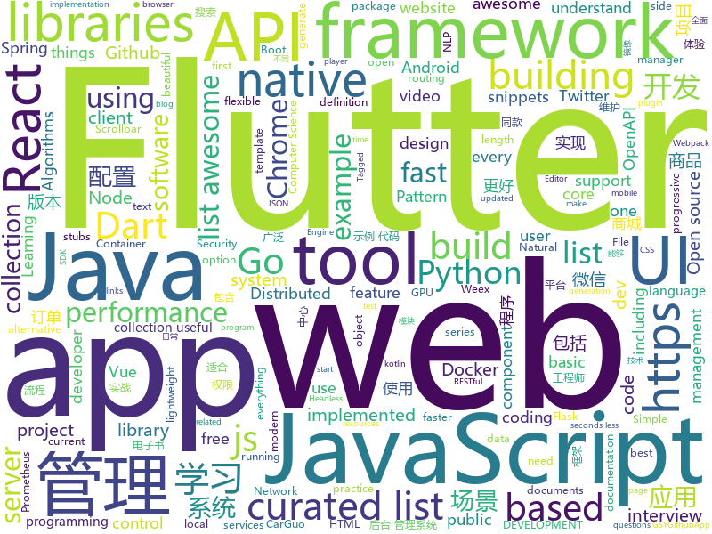

# 2018-12-18
See what the GitHub community is most excited about today.

## python
* [pytext](https://github.com/facebookresearch/pytext)(**517 stars today**): A natural language modeling framework based on PyTorch
* [pampy](https://github.com/santinic/pampy)(**427 stars today**): Pampy: The Pattern Matching for Python you always dreamed of.
* [eeeeeeeeeeeeeeeeeeeeeeeeeeeeeeeeeeeeeeeeeeeeeeeeeeeeeeeeeeeeeeeeeeeeeeeeeeeeeeeeeeeeeeeeeeeeeeeeeeee](https://github.com/eeeeeeeeeeeeeeeeeeeeeeeeeeeeeeee/eeeeeeeeeeeeeeeeeeeeeeeeeeeeeeeeeeeeeeeeeeeeeeeeeeeeeeeeeeeeeeeeeeeeeeeeeeeeeeeeeeeeeeeeeeeeeeeeeeee)(**345 stars today**): eeeeeeeeeeeeeeeeeeeeeeeeeeeeeeeeeeeeeeeeeeeeeeeeeeeeeeeeeeeeeeeeeeeee
* [vpn-at-home](https://github.com/ezaquarii/vpn-at-home)(**156 stars today**): 1-click, self-hosted OpenVPN deployment and management app.
* [jax](https://github.com/google/jax)(**121 stars today**): GPU- and TPU-backed NumPy with differentiation and JIT compilation.
* [bert](https://github.com/google-research/bert)(**76 stars today**): TensorFlow code and pre-trained models for BERT
* [wtfpython-cn](https://github.com/leisurelicht/wtfpython-cn)(**78 stars today**): wtfpython的中文翻译/施工结束/ 能力有限，欢迎帮我改进翻译
* [models](https://github.com/tensorflow/models)(**56 stars today**): Models and examples built with TensorFlow
* [loguru](https://github.com/Delgan/loguru)(**77 stars today**): Python logging made (stupidly) simple
* [system-design-primer](https://github.com/donnemartin/system-design-primer)(**61 stars today**): Learn how to design large-scale systems. Prep for the system design interview. Includes Anki flashcards.
* [Python](https://github.com/TheAlgorithms/Python)(**55 stars today**): All Algorithms implemented in Python
* [bert-as-service](https://github.com/hanxiao/bert-as-service)(**57 stars today**): Mapping a variable-length sentence to a fixed-length vector using BERT model
* [wtfpython](https://github.com/satwikkansal/wtfpython)(**57 stars today**): A collection of surprising Python snippets and lesser-known features.
* [twint](https://github.com/twintproject/twint)(**51 stars today**): An advanced Twitter scraping & OSINT tool written in Python that doesn't use Twitter's API, allowing you to scrape a user's followers, following, Tweets and more while evading most API limitations.
* [SubDomainizer](https://github.com/nsonaniya2010/SubDomainizer)(**47 stars today**): A tool to find subdomains and interesting things hidden inside and external Javascript files of page.
* [keras](https://github.com/keras-team/keras)(**42 stars today**): Deep Learning for humans
* [Mask_RCNN](https://github.com/matterport/Mask_RCNN)(**41 stars today**): Mask R-CNN for object detection and instance segmentation on Keras and TensorFlow
* [black](https://github.com/ambv/black)(**43 stars today**): The uncompromising Python code formatter
* [torchdiffeq](https://github.com/rtqichen/torchdiffeq)(**45 stars today**): Differentiable ODE solvers with full GPU support and O(1)-memory backpropagation.
* [awesome-python](https://github.com/vinta/awesome-python)(**39 stars today**): A curated list of awesome Python frameworks, libraries, software and resources
* [youtube-dl](https://github.com/rg3/youtube-dl)(**38 stars today**): Command-line program to download videos from YouTube.com and other video sites
* [public-apis](https://github.com/toddmotto/public-apis)(**38 stars today**): A collective list of free APIs for use in software and web development.
* [django](https://github.com/django/django)(**31 stars today**): The Web framework for perfectionists with deadlines.
* [home-assistant](https://github.com/home-assistant/home-assistant)(**30 stars today**): 🏡Open source home automation that puts local control and privacy first
* [d2l-zh](https://github.com/diveintodeeplearning/d2l-zh)(**33 stars today**): 《动手学深度学习》

## java
* [mall](https://github.com/macrozheng/mall)(**512 stars today**): mall项目是一套电商系统，包括前台商城系统及后台管理系统，基于SpringBoot+MyBatis实现。 前台商城系统包含首页门户、商品推荐、商品搜索、商品展示、购物车、订单流程、会员中心、客户服务、帮助中心等模块。 后台管理系统包含商品管理、订单管理、会员管理、促销管理、运营管理、内容管理、统计报表、财务管理、权限管理、设置等模块。
* [miaosha](https://github.com/qiurunze123/miaosha)(**380 stars today**): 😮😮秒杀系统设计与实现.互联网工程师进阶与分析🙋🐓
* [JavaGuide](https://github.com/Snailclimb/JavaGuide)(**170 stars today**): 【Java学习+面试指南】 一份涵盖大部分Java程序员所需要掌握的核心知识。
* [Dank](https://github.com/saket/Dank)(**143 stars today**): Here lies the greatest Reddit app that was never released
* [ArgusAPM](https://github.com/Qihoo360/ArgusAPM)(**81 stars today**): Powerful, comprehensive (Android) application performance management platform. 360移动性能监控平台
* [qmq](https://github.com/qunarcorp/qmq)(**76 stars today**): QMQ是去哪儿网内部广泛使用的消息中间件，自2012年诞生以来在去哪儿网所有业务场景中广泛的应用，包括跟交易息息相关的订单场景； 也包括报价搜索等高吞吐量场景。
* [java-design-patterns](https://github.com/iluwatar/java-design-patterns)(**62 stars today**): Design patterns implemented in Java
* [JCSprout](https://github.com/crossoverJie/JCSprout)(**53 stars today**): 👨‍🎓Java Core Sprout : basic, concurrent, algorithm
* [arthas](https://github.com/alibaba/arthas)(**52 stars today**): Alibaba Java Diagnostic Tool Arthas/Alibaba Java诊断利器Arthas
* [spring-boot](https://github.com/spring-projects/spring-boot)(**45 stars today**): Spring Boot
* [QMUI_Android](https://github.com/Tencent/QMUI_Android)(**50 stars today**): 提高 Android UI 开发效率的 UI 库
* [tutorials](https://github.com/eugenp/tutorials)(**30 stars today**): The "REST With Spring" Course:
* [elasticsearch](https://github.com/elastic/elasticsearch)(**43 stars today**): Open Source, Distributed, RESTful Search Engine
* [symphony](https://github.com/b3log/symphony)(**44 stars today**): 🎶一款用 Java 实现的现代化社区（论坛/BBS/社交网络/博客）平台。https://hacpai.com
* [java8-tutorial](https://github.com/winterbe/java8-tutorial)(**35 stars today**): Modern Java - A Guide to Java 8
* [incubator-dubbo](https://github.com/apache/incubator-dubbo)(**33 stars today**): Apache Dubbo (incubating) is a high-performance, java based, open source RPC framework.
* [android-ui-animation-components-and-libraries](https://github.com/Ramotion/android-ui-animation-components-and-libraries)(**41 stars today**): Android UI libraries, components and animations by @Ramotion - https://dev.ramotion.com/gthbr
* [litemall](https://github.com/linlinjava/litemall)(**36 stars today**): 又一个小商城。litemall = Spring Boot后端 + Vue管理员前端 + 微信小程序用户前端
* [Java](https://github.com/TheAlgorithms/Java)(**33 stars today**): All Algorithms implemented in Java
* [apollo](https://github.com/ctripcorp/apollo)(**31 stars today**): Apollo（阿波罗）是携程框架部门研发的分布式配置中心，能够集中化管理应用不同环境、不同集群的配置，配置修改后能够实时推送到应用端，并且具备规范的权限、流程治理等特性，适用于微服务配置管理场景。
* [spring-framework](https://github.com/spring-projects/spring-framework)(**23 stars today**): Spring Framework
* [jadx](https://github.com/skylot/jadx)(**27 stars today**): Dex to Java decompiler
* [weixin-java-tools](https://github.com/Wechat-Group/weixin-java-tools)(**27 stars today**): 全能微信Java开发工具包，支持包括微信支付、开放平台、小程序、企业微信/企业号和公众号等的后端开发
* [fastjson](https://github.com/alibaba/fastjson)(**27 stars today**): 🚄A fast JSON parser/generator for Java
* [guava](https://github.com/google/guava)(**25 stars today**): Google core libraries for Java

## unknown
* [the-book-of-secret-knowledge](https://github.com/trimstray/the-book-of-secret-knowledge)(**1,240 stars today**): 💫A collection of awesome lists, manuals, blogs, hacks, one-liners, cli/web tools and more. Especially for System and Network Administrators, DevOps, Pentesters or Security Researchers.
* [FAQGURU](https://github.com/FAQGURU/FAQGURU)(**217 stars today**): A list of interview questions. This repository is everything you need to prepare for your technical interview.🎒🚀🎉
* [coding-interview-university](https://github.com/jwasham/coding-interview-university)(**129 stars today**): A complete computer science study plan to become a software engineer.
* [trackerslist](https://github.com/ngosang/trackerslist)(**89 stars today**): An updated list of public BitTorrent trackers
* [awesome-php-security](https://github.com/guardrailsio/awesome-php-security)(**82 stars today**): Awesome PHP Security Resources
* [CS-Notes](https://github.com/CyC2018/CS-Notes)(**63 stars today**): 📚Computer Science Learning Notes
* [gitignore](https://github.com/github/gitignore)(**50 stars today**): A collection of useful .gitignore templates
* [policies](https://github.com/basecamp/policies)(**69 stars today**): Basecamp policies, terms, and legal. Share them; reuse them; contribute to them.
* [awesome](https://github.com/sindresorhus/awesome)(**65 stars today**): 😎Curated list of awesome lists
* [You-Dont-Know-JS](https://github.com/getify/You-Dont-Know-JS)(**57 stars today**): A book series on JavaScript. @YDKJS on twitter.
* [free-programming-books](https://github.com/EbookFoundation/free-programming-books)(**54 stars today**): 📚Freely available programming books
* [nodebestpractices](https://github.com/i0natan/nodebestpractices)(**60 stars today**): The largest Node.JS best practices list (November 2018)
* [awesome-vue](https://github.com/vuejs/awesome-vue)(**48 stars today**): 🎉A curated list of awesome things related to Vue.js
* [developer-roadmap](https://github.com/kamranahmedse/developer-roadmap)(**44 stars today**): Roadmap to becoming a web developer in 2018
* [awesome-styleguides](https://github.com/streamich/awesome-styleguides)(**37 stars today**): A curated list of UI styleguides —😎💄
* [hosts](https://github.com/googlehosts/hosts)(**30 stars today**): 镜像：https://coding.net/u/scaffrey/p/hosts/git
* [weekly](https://github.com/ruanyf/weekly)(**36 stars today**): 技术分享周刊，每周五发布
* [goQuality-dev-contents](https://github.com/Integerous/goQuality-dev-contents)(**33 stars today**): { 고퀄리티⚡️개발 컨텐츠 모음 }
* [react-typescript-cheatsheet](https://github.com/sw-yx/react-typescript-cheatsheet)(**34 stars today**): a cheatsheet for react users using typescript with react for the first (or nth!) time
* [containers-roadmap](https://github.com/aws/containers-roadmap)(**32 stars today**): This is the public roadmap for AWS container services (ECS, ECR, Fargate, and EKS).
* [awesome-cpp](https://github.com/fffaraz/awesome-cpp)(**28 stars today**): A curated list of awesome C++ (or C) frameworks, libraries, resources, and shiny things. Inspired by awesome-... stuff.
* [awesome-public-datasets](https://github.com/awesomedata/awesome-public-datasets)(**25 stars today**): A topic-centric list of HQ open datasets in public domains. PR ☛☛☛
* [flask-tutorial](https://github.com/greyli/flask-tutorial)(**25 stars today**): Flask 入门教程：使用 Python 和 Flask 开发你的第一个 Web 程序
* [pwc](https://github.com/zziz/pwc)(**23 stars today**): Papers with code. Sorted by stars. Updated weekly.
* [project-based-learning](https://github.com/tuvtran/project-based-learning)(**21 stars today**): Curated list of project-based tutorials

## javascript
* [react-jsonschema-form](https://github.com/mozilla-services/react-jsonschema-form)(**366 stars today**): A React component for building Web forms from JSON Schema.
* [quicklink](https://github.com/GoogleChromeLabs/quicklink)(**314 stars today**): ⚡️Faster subsequent page-loads by prefetching in-viewport links during idle time
* [vue-go-example](https://github.com/ndabAP/vue-go-example)(**284 stars today**): Vue.js and Go example project
* [33-js-concepts](https://github.com/leonardomso/33-js-concepts)(**213 stars today**): 📜33 concepts every JavaScript developer should know.
* [javascript-algorithms](https://github.com/trekhleb/javascript-algorithms)(**142 stars today**): 📝Algorithms and data structures implemented in JavaScript with explanations and links to further readings
* [pampy.js](https://github.com/santinic/pampy.js)(**123 stars today**): Pampy.js: Pattern Matching for JavaScript
* [vue](https://github.com/vuejs/vue)(**111 stars today**): 🖖A progressive, incrementally-adoptable JavaScript framework for building UI on the web.
* [30-seconds-of-code](https://github.com/30-seconds/30-seconds-of-code)(**111 stars today**): Curated collection of useful JavaScript snippets that you can understand in 30 seconds or less.
* [react](https://github.com/facebook/react)(**87 stars today**): A declarative, efficient, and flexible JavaScript library for building user interfaces.
* [create-react-app](https://github.com/facebook/create-react-app)(**68 stars today**): Set up a modern web app by running one command.
* [axios](https://github.com/axios/axios)(**65 stars today**): Promise based HTTP client for the browser and node.js
* [puppeteer](https://github.com/GoogleChrome/puppeteer)(**57 stars today**): Headless Chrome Node API
* [forgJs](https://github.com/oussamahamdaoui/forgJs)(**58 stars today**): ForgJs is a javascript lightweight object validator. Go check the Quick start section and start coding with love
* [eruda](https://github.com/liriliri/eruda)(**55 stars today**): Console for mobile browsers
* [arg](https://github.com/zeit/arg)(**53 stars today**): Simple argument parsing
* [Glider.js](https://github.com/NickPiscitelli/Glider.js)(**52 stars today**): A fast, lightweight, dependency free, native scrolling carousel alternative!
* [Debucsser](https://github.com/lucagez/Debucsser)(**52 stars today**): CSS debugging tool with an unpronounceable name
* [emotion](https://github.com/emotion-js/emotion)(**49 stars today**): style as a function of state
* [react-native](https://github.com/facebook/react-native)(**45 stars today**): A framework for building native apps with React.
* [next.js](https://github.com/zeit/next.js)(**43 stars today**): The React Framework
* [33-js-concepts](https://github.com/stephentian/33-js-concepts)(**43 stars today**): 📜每个 JavaScript 工程师都应懂的33个概念 @leonardomso
* [node](https://github.com/nodejs/node)(**38 stars today**): Node.js JavaScript runtime✨🐢🚀✨
* [storybook](https://github.com/storybooks/storybook)(**41 stars today**): Interactive UI component dev & test: React, React Native, Vue, Angular, Ember
* [strapi](https://github.com/strapi/strapi)(**41 stars today**): 🚀Open source Node.js Headless CMS to easily build customisable APIs
* [htm](https://github.com/developit/htm)(**42 stars today**): Hyperscript Tagged Markup: JSX alternative using standard tagged templates, with compiler support.

## html
* [AdminLTE](https://github.com/almasaeed2010/AdminLTE)(**26 stars today**): AdminLTE - Free Premium Admin control Panel Theme Based On Bootstrap 3.x
* [flutter-in-action](https://github.com/flutterchina/flutter-in-action)(**24 stars today**): 《Flutter实战》电子书
* [30-seconds-of-css](https://github.com/30-seconds/30-seconds-of-css)(**21 stars today**): A curated collection of useful CSS snippets you can understand in 30 seconds or less.
* [dive-into-webpack](https://github.com/gwuhaolin/dive-into-webpack)(**20 stars today**): 全面的Webpack教程《深入浅出Webpack》电子书
* [Front-end-Developer-Interview-Questions](https://github.com/h5bp/Front-end-Developer-Interview-Questions)(**19 stars today**): A list of helpful front-end related questions you can use to interview potential candidates, test yourself or completely ignore.
* [fastText](https://github.com/facebookresearch/fastText)(**17 stars today**): Library for fast text representation and classification.
* [frida-all-in-one](https://github.com/hookmaster/frida-all-in-one)(**18 stars today**): 《FRIDA操作手册》by @hluwa @r0ysue
* [NLP-progress](https://github.com/sebastianruder/NLP-progress)(**18 stars today**): Repository to track the progress in Natural Language Processing (NLP), including the datasets and the current state-of-the-art for the most common NLP tasks.
* [ionic](https://github.com/ionic-team/ionic)(**11 stars today**): Build amazing native and progressive web apps with open web technologies. One app running on everything🎉
* [VulCloud](https://github.com/phantom0301/VulCloud)(**15 stars today**): A Simple Web-UI for Vulhub (Docker) / 便捷的漏洞镜像管理部署Web应用
* [JavaScript30](https://github.com/wesbos/JavaScript30)(**8 stars today**): 30 Day Vanilla JS Challenge
* [Spoon-Knife](https://github.com/octocat/Spoon-Knife)(****): This repo is for demonstration purposes only.
* [proxylist](https://github.com/fate0/proxylist)(**11 stars today**): proxylist, generate by fate0/getproxy project in every 15 minute
* [swagger-codegen](https://github.com/swagger-api/swagger-codegen)(**8 stars today**): swagger-codegen contains a template-driven engine to generate documentation, API clients and server stubs in different languages by parsing your OpenAPI / Swagger definition.
* [portainer](https://github.com/portainer/portainer)(**9 stars today**): Simple management UI for Docker
* [frontend-tech-list](https://github.com/alienzhou/frontend-tech-list)(**9 stars today**): a frontend tech list for developers
* [keep-a-changelog](https://github.com/olivierlacan/keep-a-changelog)(**8 stars today**): If you build software, keep a changelog.
* [programming-principles](https://github.com/webpro/programming-principles)(**9 stars today**): Categorized overview of Programming Principles & Patterns
* [wysiwyg-editor](https://github.com/froala/wysiwyg-editor)(**7 stars today**): A beautifully designed WYSIWYG HTML Editor based on HTML5.
* [openapi-generator](https://github.com/OpenAPITools/openapi-generator)(**7 stars today**): OpenAPI Generator allows generation of API client libraries (SDK generation), server stubs, documentation and configuration automatically given an OpenAPI Spec (v2, v3)
* [worthdoingbadly.com](https://github.com/zhuowei/worthdoingbadly.com)(**5 stars today**): My blog where I make a new coding project every Thursday.
* [hugo-academic](https://github.com/gcushen/hugo-academic)(**6 stars today**): The website designer for Hugo. Build and deploy a beautiful website in minutes🚀
* [ecma262](https://github.com/tc39/ecma262)(**7 stars today**): Status, process, and documents for ECMA262
* [screenfull.js](https://github.com/sindresorhus/screenfull.js)(**7 stars today**): Simple wrapper for cross-browser usage of the JavaScript Fullscreen API
* [feature-engineering-for-ml-zh](https://github.com/apachecn/feature-engineering-for-ml-zh)(**5 stars today**): 📖[译] 面向机器学习的特征工程

## dart
* [flutter](https://github.com/flutter/flutter)(**161 stars today**): Flutter makes it easy and fast to build beautiful mobile apps.
* [awesome-flutter](https://github.com/Solido/awesome-flutter)(**127 stars today**): An awesome list that curates the best Flutter libraries, tools, tutorials, articles and more.
* [Flutter-learning](https://github.com/AweiLoveAndroid/Flutter-learning)(**28 stars today**): 🔥👍🌟⭐️⭐️⭐️Flutter安装和配置，Flutter开发遇到的难题，Flutter示例代码和模板，Flutter项目实战，Dart语言学习示例代码。
* [plugins](https://github.com/flutter/plugins)(**22 stars today**): Plugins for Flutter, including FlutterFire, maintained by the Flutter team
* [samples](https://github.com/flutter/samples)(**21 stars today**): A collection of Flutter examples and demos.
* [Flutter-Notebook](https://github.com/OpenFlutter/Flutter-Notebook)(**20 stars today**): 日更的FlutterDemo合集，今天你fu了吗
* [dio](https://github.com/flutterchina/dio)(**15 stars today**): A powerful Http client for Dart, which supports Interceptors, FormData, Request Cancellation, File Downloading, Timeout etc.
* [quiet-flutter](https://github.com/boyan01/quiet-flutter)(**14 stars today**): a flutter music player app
* [flutter_layout](https://github.com/nb312/flutter_layout)(**12 stars today**): Layout of the flutter example.such as Row,Comlun,listview,Just for learning.
* [Flutter-UI-Kit](https://github.com/iampawan/Flutter-UI-Kit)(**8 stars today**): Flutter app for collection of UI in a UIKit
* [fluro](https://github.com/theyakka/fluro)(**8 stars today**): Fluro is a Flutter routing library that adds flexible routing options like wildcards, named parameters and clear route definitions.
* [sdk](https://github.com/dart-lang/sdk)(**8 stars today**): The Dart SDK, including the VM, dart2js, core libraries, and more.
* [inKino](https://github.com/roughike/inKino)(**6 stars today**): A multiplatform Dart movie app with 40% of code sharing between Flutter and the Web.
* [RealRichText](https://github.com/bytedance/RealRichText)(**5 stars today**): A Tricky Solution for Implementing Inline-Image-In-Text Feature in Flutter.
* [website](https://github.com/flutter/website)(****): Flutter web site
* [pub](https://github.com/dart-lang/pub)(****): The package manager for Dart
* [coverflow](https://github.com/efortuna/coverflow)(****): a basic coverflow implementation in Flutter
* [flutter_cache_manager](https://github.com/renefloor/flutter_cache_manager)(****): Generic cache manager for flutter
* [flutter-draggable-scrollbar](https://github.com/fluttercommunity/flutter-draggable-scrollbar)(****): Draggable Scrollbar - A scrollbar that can be dragged for quickly navigation through a vertical list. Additional option is showing label next to scrollthumb with information about current item. Maintainer: @marica27
* [flutter_blue](https://github.com/pauldemarco/flutter_blue)(****): Bluetooth plugin for Flutter
* [chewie](https://github.com/brianegan/chewie)(****): The video player for Flutter with a heart of gold
* [rpc](https://github.com/dart-lang/rpc)(****): RPC package for building server-side RESTful Dart APIs.
* [chromedeveditor](https://github.com/googlearchive/chromedeveditor)(****): Chrome Dev Editor is a developer tool for building apps on the Chrome platform - Chrome Apps and Web Apps, in JavaScript or Dart. (NO LONGER IN ACTIVE DEVELOPMENT)
* [GSYGithubAppFlutter](https://github.com/CarGuo/GSYGithubAppFlutter)(****): 超完整的Flutter项目，功能丰富，适合学习和日常使用。GSYGithubApp系列的优势：我们目前已经拥有Flutter、Weex、ReactNative、kotlin 四个版本。 功能齐全，项目框架内技术涉及面广，完成度高，持续维护，配套文章，适合全面学习，对比参考。跨平台的开源Github客户端App，更好的体验，更丰富的功能，旨在更好的日常管理和维护个人Github，提供更好更方便的驾车体验Σ(￣。￣ﾉ)ﾉ。同款Weex版本 ： https://github.com/CarGuo/GSYGithubAppWeex 、同款React Native版本 ： https://github.com/CarGuo/GSYGithubApp 、原生 kotlin 版本 https://g…
* [FlutterExampleApps](https://github.com/iampawan/FlutterExampleApps)(****): [Example APPS] Basic Flutter apps, for flutter devs.

## go
* [loki](https://github.com/grafana/loki)(**277 stars today**): Like Prometheus, but for logs.
* [rendora](https://github.com/rendora/rendora)(**101 stars today**): dynamic server-side rendering using headless Chrome to effortlessly solve the SEO problem for modern javascript websites
* [vegeta](https://github.com/tsenart/vegeta)(**72 stars today**): HTTP load testing tool and library. It's over 9000!
* [dive](https://github.com/wagoodman/dive)(**69 stars today**): A tool for exploring each layer in a docker image
* [ethr](https://github.com/Microsoft/ethr)(**59 stars today**): Ethr is a Network Performance Measurement Tool for TCP, UDP & HTTP.
* [go](https://github.com/golang/go)(**57 stars today**): The Go programming language
* [furious](https://github.com/liamg/furious)(**61 stars today**): Golang IP/port scanner with SYN (stealth) scanning and device manufacturer identification
* [PlatON-Go](https://github.com/PlatONnetwork/PlatON-Go)(**47 stars today**): Golang implementation of the PlatON protocol
* [docker_practice](https://github.com/yeasy/docker_practice)(**50 stars today**): Learn and understand Docker technologies, with real DevOps practice!
* [kubernetes](https://github.com/kubernetes/kubernetes)(**44 stars today**): Production-Grade Container Scheduling and Management
* [gin](https://github.com/gin-gonic/gin)(**49 stars today**): Gin is a HTTP web framework written in Go (Golang). It features a Martini-like API with much better performance -- up to 40 times faster. If you need smashing performance, get yourself some Gin.
* [hugo](https://github.com/gohugoio/hugo)(**46 stars today**): The world’s fastest framework for building websites.
* [certmagic](https://github.com/mholt/certmagic)(**45 stars today**): Automatic HTTPS for any Go program: fully-managed TLS certificate issuance and renewal
* [frp](https://github.com/fatedier/frp)(**43 stars today**): A fast reverse proxy to help you expose a local server behind a NAT or firewall to the internet.
* [awesome-go](https://github.com/avelino/awesome-go)(**43 stars today**): A curated list of awesome Go frameworks, libraries and software
* [traefik](https://github.com/containous/traefik)(**40 stars today**): The Cloud Native Edge Router
* [gotenberg](https://github.com/thecodingmachine/gotenberg)(**37 stars today**): A Docker-powered stateless API for converting HTML, Markdown and Office documents to PDF
* [build-web-application-with-golang](https://github.com/astaxie/build-web-application-with-golang)(**33 stars today**): A golang ebook intro how to build a web with golang
* [shipper](https://github.com/bookingcom/shipper)(**35 stars today**): Kubernetes native multi-cluster canary or blue-green rollouts using Helm
* [cli](https://github.com/kubedb/cli)(**31 stars today**): KubeDB CLI
* [soar](https://github.com/XiaoMi/soar)(**29 stars today**): SQL Optimizer And Rewriter
* [istio](https://github.com/istio/istio)(**28 stars today**): Connect, secure, control, and observe services.
* [etcd](https://github.com/etcd-io/etcd)(**27 stars today**): Distributed reliable key-value store for the most critical data of a distributed system
* [minikube](https://github.com/kubernetes/minikube)(**27 stars today**): Run Kubernetes locally
* [prometheus](https://github.com/prometheus/prometheus)(**26 stars today**): The Prometheus monitoring system and time series database.

## WordCloud

