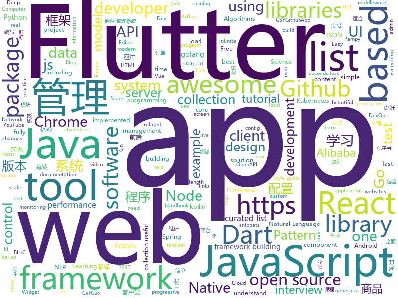

# 2018-12-20
See what the GitHub community is most excited about today.

## python
* [opsmop](https://github.com/opsmop/opsmop)(**262 stars today**): Next generation config management and app deployment
* [pytext](https://github.com/facebookresearch/pytext)(**200 stars today**): A natural language modeling framework based on PyTorch
* [vpn-at-home](https://github.com/ezaquarii/vpn-at-home)(**97 stars today**): 1-click, self-hosted OpenVPN deployment and management app.
* [bert](https://github.com/google-research/bert)(**76 stars today**): TensorFlow code and pre-trained models for BERT
* [awesome-python-applications](https://github.com/mahmoud/awesome-python-applications)(**75 stars today**): 💿Free software that works great, which also happens to be open-source Python.
* [pampy](https://github.com/santinic/pampy)(**71 stars today**): Pampy: The Pattern Matching for Python you always dreamed of.
* [keras](https://github.com/keras-team/keras)(**58 stars today**): Deep Learning for humans
* [3D-SDN](https://github.com/ysymyth/3D-SDN)(**60 stars today**): [NeurIPS 2018] 3D-Aware Scene Manipulation via Inverse Graphics
* [system-design-primer](https://github.com/donnemartin/system-design-primer)(**58 stars today**): Learn how to design large-scale systems. Prep for the system design interview. Includes Anki flashcards.
* [models](https://github.com/tensorflow/models)(**42 stars today**): Models and examples built with TensorFlow
* [flair](https://github.com/zalandoresearch/flair)(**53 stars today**): A very simple framework for state-of-the-art Natural Language Processing (NLP)
* [Mask_RCNN](https://github.com/matterport/Mask_RCNN)(**48 stars today**): Mask R-CNN for object detection and instance segmentation on Keras and TensorFlow
* [algorithms](https://github.com/keon/algorithms)(**50 stars today**): Minimal examples of data structures and algorithms in Python
* [Python](https://github.com/TheAlgorithms/Python)(**46 stars today**): All Algorithms implemented in Python
* [youtube-dl](https://github.com/rg3/youtube-dl)(**46 stars today**): Command-line program to download videos from YouTube.com and other video sites
* [awesome-python](https://github.com/vinta/awesome-python)(**44 stars today**): A curated list of awesome Python frameworks, libraries, software and resources
* [loguru](https://github.com/Delgan/loguru)(**48 stars today**): Python logging made (stupidly) simple
* [bert-as-service](https://github.com/hanxiao/bert-as-service)(**44 stars today**): Mapping a variable-length sentence to a fixed-length vector using BERT model
* [home-assistant](https://github.com/home-assistant/home-assistant)(**42 stars today**): 🏡Open source home automation that puts local control and privacy first
* [wtfpython-cn](https://github.com/leisurelicht/wtfpython-cn)(**39 stars today**): wtfpython的中文翻译/施工结束/ 能力有限，欢迎帮我改进翻译
* [scikit-learn](https://github.com/scikit-learn/scikit-learn)(**30 stars today**): scikit-learn: machine learning in Python
* [DeepCreamPy](https://github.com/deeppomf/DeepCreamPy)(**38 stars today**): Decensoring Hentai with Deep Neural Networks
* [public-apis](https://github.com/toddmotto/public-apis)(**38 stars today**): A collective list of free APIs for use in software and web development.
* [mu](https://github.com/Microsoft/mu)(**36 stars today**): Project mu Documentation
* [flask](https://github.com/pallets/flask)(****): The Python micro framework for building web applications.

## java
* [mall](https://github.com/macrozheng/mall)(**250 stars today**): mall项目是一套电商系统，包括前台商城系统及后台管理系统，基于SpringBoot+MyBatis实现。 前台商城系统包含首页门户、商品推荐、商品搜索、商品展示、购物车、订单流程、会员中心、客户服务、帮助中心等模块。 后台管理系统包含商品管理、订单管理、会员管理、促销管理、运营管理、内容管理、统计报表、财务管理、权限管理、设置等模块。
* [JavaGuide](https://github.com/Snailclimb/JavaGuide)(**163 stars today**): 【Java学习+面试指南】 一份涵盖大部分Java程序员所需要掌握的核心知识。
* [miaosha](https://github.com/qiurunze123/miaosha)(**155 stars today**): 😮😮秒杀系统设计与实现.互联网工程师进阶与分析🙋🐓
* [guava](https://github.com/google/guava)(**84 stars today**): Google core libraries for Java
* [easyexcel](https://github.com/alibaba/easyexcel)(**74 stars today**): 快速、简单避免OOM的java处理Excel工具
* [APIJSON](https://github.com/TommyLemon/APIJSON)(**63 stars today**): 🚀后端接口和文档自动化，前端(客户端) 定制返回JSON的数据和结构！
* [MeiWidgetView](https://github.com/HpWens/MeiWidgetView)(**57 stars today**): 一款汇总了郭霖，鸿洋，以及自己平时收集的自定义控件集合库
* [QMUI_Android](https://github.com/Tencent/QMUI_Android)(**55 stars today**): 提高 Android UI 开发效率的 UI 库
* [spring-boot](https://github.com/spring-projects/spring-boot)(**43 stars today**): Spring Boot
* [spring-framework](https://github.com/spring-projects/spring-framework)(**42 stars today**): Spring Framework
* [tutorials](https://github.com/eugenp/tutorials)(**36 stars today**): The "REST With Spring" Course:
* [Sentinel](https://github.com/alibaba/Sentinel)(**43 stars today**): A lightweight flow-control library providing high-available protection and monitoring (高可用防护的流量管理框架)
* [java-design-patterns](https://github.com/iluwatar/java-design-patterns)(**41 stars today**): Design patterns implemented in Java
* [symphony](https://github.com/b3log/symphony)(**41 stars today**): 🎶一款用 Java 实现的现代化社区（论坛/BBS/社交网络/博客）平台。https://hacpai.com
* [litemall](https://github.com/linlinjava/litemall)(**37 stars today**): 又一个小商城。litemall = Spring Boot后端 + Vue管理员前端 + 微信小程序用户前端
* [AndroidUtilCode](https://github.com/Blankj/AndroidUtilCode)(**33 stars today**): 🔥Android developers should collect the following utils(updating).
* [elasticsearch](https://github.com/elastic/elasticsearch)(**32 stars today**): Open Source, Distributed, RESTful Search Engine
* [BasePopup](https://github.com/razerdp/BasePopup)(**37 stars today**): // 打造通用的popupwindow
* [incubator-dubbo](https://github.com/apache/incubator-dubbo)(**30 stars today**): Apache Dubbo (incubating) is a high-performance, java based, open source RPC framework.
* [arthas](https://github.com/alibaba/arthas)(**32 stars today**): Alibaba Java Diagnostic Tool Arthas/Alibaba Java诊断利器Arthas
* [JCSprout](https://github.com/crossoverJie/JCSprout)(**29 stars today**): 👨‍🎓Java Core Sprout : basic, concurrent, algorithm
* [apollo](https://github.com/ctripcorp/apollo)(**29 stars today**): Apollo（阿波罗）是携程框架部门研发的分布式配置中心，能够集中化管理应用不同环境、不同集群的配置，配置修改后能够实时推送到应用端，并且具备规范的权限、流程治理等特性，适用于微服务配置管理场景。
* [pravega](https://github.com/pravega/pravega)(**31 stars today**): Pravega - Streaming as a new software defined storage primitive
* [spring-cloud-alibaba](https://github.com/spring-cloud-incubator/spring-cloud-alibaba)(**28 stars today**): Spring Cloud Alibaba provides a one-stop solution for application development for the distributed solutions of Alibaba middleware.
* [JAViewer](https://github.com/SplashCodes/JAViewer)(**28 stars today**): 更优雅的驾车体验

## unknown
* [the-book-of-secret-knowledge](https://github.com/trimstray/the-book-of-secret-knowledge)(**948 stars today**): 💫A collection of awesome lists, manuals, blogs, hacks, one-liners, cli/web tools and more. Especially for System and Network Administrators, DevOps, Pentesters or Security Researchers.
* [FAQGURU](https://github.com/FAQGURU/FAQGURU)(**439 stars today**): 🎒🚀🎉A list of interview questions. This repository is everything you need to prepare for your technical interview.
* [guide-to-kotlin](https://github.com/Zhuinden/guide-to-kotlin)(**149 stars today**): This tutorial assumes all you know is Java, but you want to learn Kotlin.
* [QConShanghai2018](https://github.com/QConChina/QConShanghai2018)(**109 stars today**): QCon上海2018 幻灯片
* [You-Dont-Know-JS](https://github.com/getify/You-Dont-Know-JS)(**79 stars today**): A book series on JavaScript. @YDKJS on twitter.
* [CS-Notes](https://github.com/CyC2018/CS-Notes)(**66 stars today**): 📚Computer Science Learning Notes
* [trackerslist](https://github.com/ngosang/trackerslist)(**79 stars today**): An updated list of public BitTorrent trackers
* [gitignore](https://github.com/github/gitignore)(**61 stars today**): A collection of useful .gitignore templates
* [coding-interview-university](https://github.com/jwasham/coding-interview-university)(**64 stars today**): A complete computer science study plan to become a software engineer.
* [awesome](https://github.com/sindresorhus/awesome)(**55 stars today**): 😎Curated list of awesome lists
* [free-programming-books](https://github.com/EbookFoundation/free-programming-books)(**51 stars today**): 📚Freely available programming books
* [Data_Science_Interview_Guide](https://github.com/llSourcell/Data_Science_Interview_Guide)(**43 stars today**): These are the tips for "5 Steps to Pass Data Science Interviews" By Siraj Raval on Youtube
* [awesome-vue](https://github.com/vuejs/awesome-vue)(**37 stars today**): 🎉A curated list of awesome things related to Vue.js
* [awesome-php-security](https://github.com/guardrailsio/awesome-php-security)(**38 stars today**): Awesome PHP Security Resources🕶🐘🔐
* [hosts](https://github.com/googlehosts/hosts)(**30 stars today**): 镜像：https://coding.net/u/scaffrey/p/hosts/git
* [Awesome-model-compression-and-acceleration](https://github.com/memoiry/Awesome-model-compression-and-acceleration)(**35 stars today**): 
* [OpenAPI-Specification](https://github.com/OAI/OpenAPI-Specification)(**33 stars today**): The OpenAPI Specification Repository
* [project-based-learning](https://github.com/tuvtran/project-based-learning)(**32 stars today**): Curated list of project-based tutorials
* [goQuality-dev-contents](https://github.com/Integerous/goQuality-dev-contents)(**29 stars today**): { 고퀄리티⚡️개발 컨텐츠 모음 }
* [Awesome-pytorch-list](https://github.com/bharathgs/Awesome-pytorch-list)(**28 stars today**): A comprehensive list of pytorch related content on github,such as different models,implementations,helper libraries,tutorials etc.
* [proposal-javascript-standard-library](https://github.com/tc39/proposal-javascript-standard-library)(**28 stars today**): 
* [awesome-nodejs](https://github.com/sindresorhus/awesome-nodejs)(**23 stars today**): ⚡️Delightful Node.js packages and resources
* [archlive](https://github.com/adi1090x/archlive)(**23 stars today**): An Awesome Fully Functional Custom Arch Linux Based Live OS
* [gold-miner](https://github.com/xitu/gold-miner)(**21 stars today**): 🥇掘金翻译计划，可能是世界最大最好的英译中技术社区，最懂读者和译者的翻译平台：
* [react-handbook](https://github.com/flaviocopes/react-handbook)(**21 stars today**): The React Handbook content

## javascript
* [quicklink](https://github.com/GoogleChromeLabs/quicklink)(**229 stars today**): ⚡️Faster subsequent page-loads by prefetching in-viewport links during idle time
* [rallax.js](https://github.com/ChrisCavs/rallax.js)(**226 stars today**): Dead simple parallax scrolling.
* [carbon](https://github.com/dawnlabs/carbon)(**177 stars today**): 🎨Create and share beautiful images of your source code
* [nodebestpractices](https://github.com/i0natan/nodebestpractices)(**169 stars today**): The largest Node.JS best practices list (November 2018)
* [vue](https://github.com/vuejs/vue)(**135 stars today**): 🖖A progressive, incrementally-adoptable JavaScript framework for building UI on the web.
* [ieturk](https://github.com/Varal7/ieturk)(**144 stars today**): Intuitive Annotation Tool for Information / Named Entity Recognition using localturk / Amazon Mechanical Turk
* [33-js-concepts](https://github.com/leonardomso/33-js-concepts)(**124 stars today**): 📜33 concepts every JavaScript developer should know.
* [react-developer-roadmap](https://github.com/adam-golab/react-developer-roadmap)(**125 stars today**): Roadmap to becoming a React developer in 2018
* [coolqlcool](https://github.com/dinubs/coolqlcool)(**126 stars today**): Nextjs server to query websites with GraphQL
* [react](https://github.com/facebook/react)(**108 stars today**): A declarative, efficient, and flexible JavaScript library for building user interfaces.
* [javascript-algorithms](https://github.com/trekhleb/javascript-algorithms)(**101 stars today**): 📝Algorithms and data structures implemented in JavaScript with explanations and links to further readings
* [omi](https://github.com/Tencent/omi)(**87 stars today**): Next generation web framework using web components with omio fallback(IE8+) in 4kb JavaScript. Easy to MVVM.
* [Github-Monitor](https://github.com/VKSRC/Github-Monitor)(**83 stars today**): Github Sensitive Information Leakage Monitor(Github信息泄漏监控系统)
* [taro](https://github.com/NervJS/taro)(**71 stars today**): 多端统一开发框架，支持用 React 的开发方式编写一次代码，生成能运行在微信小程序/百度智能小程序/支付宝小程序、H5、React Native 等的应用。 https://taro.js.org/
* [30-seconds-of-code](https://github.com/30-seconds/30-seconds-of-code)(**70 stars today**): Curated collection of useful JavaScript snippets that you can understand in 30 seconds or less.
* [learnGitBranching](https://github.com/pcottle/learnGitBranching)(**66 stars today**): An interactive git visualization to challenge and educate!
* [eruda](https://github.com/liriliri/eruda)(**66 stars today**): Console for mobile browsers
* [react-jsonschema-form](https://github.com/mozilla-services/react-jsonschema-form)(**65 stars today**): A React component for building Web forms from JSON Schema.
* [create-react-app](https://github.com/facebook/create-react-app)(**49 stars today**): Set up a modern web app by running one command.
* [axios](https://github.com/axios/axios)(**56 stars today**): Promise based HTTP client for the browser and node.js
* [puppeteer](https://github.com/GoogleChrome/puppeteer)(**58 stars today**): Headless Chrome Node API
* [react-native](https://github.com/facebook/react-native)(**46 stars today**): A framework for building native apps with React.
* [pampy.js](https://github.com/santinic/pampy.js)(**51 stars today**): Pampy.js: Pattern Matching for JavaScript
* [d3](https://github.com/d3/d3)(**43 stars today**): Bring data to life with SVG, Canvas and HTML.📊📈🎉
* [javascript](https://github.com/airbnb/javascript)(**42 stars today**): JavaScript Style Guide

## html
* [flutter-in-action](https://github.com/flutterchina/flutter-in-action)(**98 stars today**): 《Flutter实战》电子书
* [styleguide](https://github.com/google/styleguide)(**26 stars today**): Style guides for Google-originated open-source projects
* [Coursera-ML-AndrewNg-Notes](https://github.com/fengdu78/Coursera-ML-AndrewNg-Notes)(**23 stars today**): 吴恩达老师的机器学习课程个人笔记
* [fastText](https://github.com/facebookresearch/fastText)(**26 stars today**): Library for fast text representation and classification.
* [deeplearning_ai_books](https://github.com/fengdu78/deeplearning_ai_books)(**21 stars today**): deeplearning.ai（吴恩达老师的深度学习课程笔记及资源）
* [nginxconfig.io](https://github.com/valentinxxx/nginxconfig.io)(**26 stars today**): ⚙️NGiИX config generator generator on steroids💉
* [AdminLTE](https://github.com/almasaeed2010/AdminLTE)(**17 stars today**): AdminLTE - Free Premium Admin control Panel Theme Based On Bootstrap 3.x
* [portainer](https://github.com/portainer/portainer)(**20 stars today**): Simple management UI for Docker
* [how-dat-works](https://github.com/vtduncan/how-dat-works)(**19 stars today**): Protocol documentation for Dat
* [ionic](https://github.com/ionic-team/ionic)(**14 stars today**): Build amazing native and progressive web apps with open web technologies. One app running on everything🎉
* [textasdata](https://github.com/cbail/textasdata)(**16 stars today**): This is a repo for a class on Text as Data
* [JavaScript30](https://github.com/wesbos/JavaScript30)(**11 stars today**): 30 Day Vanilla JS Challenge
* [NLP-progress](https://github.com/sebastianruder/NLP-progress)(**14 stars today**): Repository to track the progress in Natural Language Processing (NLP), including the datasets and the current state-of-the-art for the most common NLP tasks.
* [30-seconds-of-css](https://github.com/30-seconds/30-seconds-of-css)(**14 stars today**): A curated collection of useful CSS snippets you can understand in 30 seconds or less.
* [Spoon-Knife](https://github.com/octocat/Spoon-Knife)(****): This repo is for demonstration purposes only.
* [frida-all-in-one](https://github.com/hookmaster/frida-all-in-one)(**12 stars today**): 《FRIDA操作手册》by @hluwa @r0ysue
* [qiubaiying.github.io](https://github.com/qiubaiying/qiubaiying.github.io)(**5 stars today**): BY Blog ->
* [emacs-package-dev-handbook](https://github.com/alphapapa/emacs-package-dev-handbook)(**12 stars today**): An Emacs package development handbook. Built with Emacs, by Emacs package developers, for Emacs package developers.
* [wysiwyg-editor](https://github.com/froala/wysiwyg-editor)(**11 stars today**): A beautifully designed WYSIWYG HTML Editor based on HTML5.
* [infinity-css-grid](https://github.com/vladocar/infinity-css-grid)(**11 stars today**): Fluid Flex Solution for making infinite grid columns.
* [dive-into-webpack](https://github.com/gwuhaolin/dive-into-webpack)(**10 stars today**): 全面的Webpack教程《深入浅出Webpack》电子书
* [swagger-codegen](https://github.com/swagger-api/swagger-codegen)(**9 stars today**): swagger-codegen contains a template-driven engine to generate documentation, API clients and server stubs in different languages by parsing your OpenAPI / Swagger definition.
* [ng-alain](https://github.com/ng-alain/ng-alain)(**8 stars today**): ng-zorro-antd admin panel front-end framework
* [mxgraph](https://github.com/jgraph/mxgraph)(**8 stars today**): mxGraph is a fully client side JavaScript diagramming library
* [primeng](https://github.com/primefaces/primeng)(**8 stars today**): UI Components for Angular

## dart
* [flutter](https://github.com/flutter/flutter)(**170 stars today**): Flutter makes it easy and fast to build beautiful mobile apps.
* [awesome-flutter](https://github.com/Solido/awesome-flutter)(**60 stars today**): An awesome list that curates the best Flutter libraries, tools, tutorials, articles and more.
* [plugins](https://github.com/flutter/plugins)(**23 stars today**): Plugins for Flutter, including FlutterFire, maintained by the Flutter team
* [samples](https://github.com/flutter/samples)(**20 stars today**): A collection of Flutter examples and demos.
* [dio](https://github.com/flutterchina/dio)(**20 stars today**): A powerful Http client for Dart, which supports Interceptors, FormData, Request Cancellation, File Downloading, Timeout etc.
* [bloc](https://github.com/felangel/bloc)(**14 stars today**): A collection of packages that help implement the BLoC design pattern
* [Flutter-Notebook](https://github.com/OpenFlutter/Flutter-Notebook)(**14 stars today**): 日更的FlutterDemo合集，今天你fu了吗
* [Flutter-UI-Kit](https://github.com/iampawan/Flutter-UI-Kit)(**11 stars today**): Flutter app for collection of UI in a UIKit
* [movie_android_flutter](https://github.com/florent37/movie_android_flutter)(**11 stars today**): A sample movie app, developed on flutter, then on android
* [flutter_architecture_samples](https://github.com/brianegan/flutter_architecture_samples)(**9 stars today**): TodoMVC for Flutter
* [quiet-flutter](https://github.com/boyan01/quiet-flutter)(**8 stars today**): a flutter music player app
* [flutter_swiper](https://github.com/best-flutter/flutter_swiper)(**7 stars today**): The best swiper for flutter , with multiple layouts, infinite loop. Compatible with Android & iOS.
* [sdk](https://github.com/dart-lang/sdk)(**6 stars today**): The Dart SDK, including the VM, dart2js, core libraries, and more.
* [wave](https://github.com/i-protoss/wave)(**5 stars today**): Widget for displaying waves with custom color, duration, floating and blur effects.
* [rxdart](https://github.com/ReactiveX/rxdart)(**6 stars today**): The Reactive Extensions for Dart
* [flutter_pagewise](https://github.com/AbdulRahmanAlHamali/flutter_pagewise)(**6 stars today**): A library for widgets that load their content one page (or batch) at a time.
* [flutter_ScreenUtil](https://github.com/OpenFlutter/flutter_ScreenUtil)(**5 stars today**): Flutter screen adaptation, font adaptation, get screen information
* [dart_redux_epics](https://github.com/brianegan/dart_redux_epics)(****): Redux.dart middleware for handling actions using Dart Streams
* [flashcards](https://github.com/tenhobi/flashcards)(****): FIT CTU · BI-SP1 · BI-SP2 · B172 · B181 – software team project
* [blocs](https://github.com/boeledi/blocs)(****): Reactive Programming - BLoC - Practical Use Cases and Patterns
* [DRAW](https://github.com/draw-dev/DRAW)(****): DRAW: The Dart Reddit API Wrapper
* [test](https://github.com/dart-lang/test)(****): A library for writing unit tests in Dart.
* [chromedeveditor](https://github.com/googlearchive/chromedeveditor)(****): Chrome Dev Editor is a developer tool for building apps on the Chrome platform - Chrome Apps and Web Apps, in JavaScript or Dart. (NO LONGER IN ACTIVE DEVELOPMENT)
* [GSYGithubAppFlutter](https://github.com/CarGuo/GSYGithubAppFlutter)(****): 超完整的Flutter项目，功能丰富，适合学习和日常使用。GSYGithubApp系列的优势：我们目前已经拥有Flutter、Weex、ReactNative、kotlin 四个版本。 功能齐全，项目框架内技术涉及面广，完成度高，持续维护，配套文章，适合全面学习，对比参考。跨平台的开源Github客户端App，更好的体验，更丰富的功能，旨在更好的日常管理和维护个人Github，提供更好更方便的驾车体验Σ(￣。￣ﾉ)ﾉ。同款Weex版本 ： https://github.com/CarGuo/GSYGithubAppWeex 、同款React Native版本 ： https://github.com/CarGuo/GSYGithubApp 、原生 kotlin 版本 https://g…
* [FlutterExampleApps](https://github.com/iampawan/FlutterExampleApps)(****): [Example APPS] Basic Flutter apps, for flutter devs.

## go
* [goldpinger](https://github.com/bloomberg/goldpinger)(**285 stars today**): Debugging tool for Kubernetes which tests and displays connectivity between nodes in the cluster.
* [exp-httpclient](https://github.com/bradfitz/exp-httpclient)(**215 stars today**): experimental new HTTP client API for #golang (WIP)
* [loki](https://github.com/grafana/loki)(**133 stars today**): Like Prometheus, but for logs.
* [go](https://github.com/golang/go)(**60 stars today**): The Go programming language
* [dive](https://github.com/wagoodman/dive)(**59 stars today**): A tool for exploring each layer in a docker image
* [kubernetes](https://github.com/kubernetes/kubernetes)(**51 stars today**): Production-Grade Container Scheduling and Management
* [awesome-go](https://github.com/avelino/awesome-go)(**41 stars today**): A curated list of awesome Go frameworks, libraries and software
* [frp](https://github.com/fatedier/frp)(**39 stars today**): A fast reverse proxy to help you expose a local server behind a NAT or firewall to the internet.
* [rendora](https://github.com/rendora/rendora)(**42 stars today**): dynamic server-side rendering using headless Chrome to effortlessly solve the SEO problem for modern javascript websites
* [certmagic](https://github.com/mholt/certmagic)(**41 stars today**): Automatic HTTPS for any Go program: fully-managed TLS certificate issuance and renewal
* [BaiduPCS-Go](https://github.com/iikira/BaiduPCS-Go)(**36 stars today**): 百度网盘客户端 - Go语言编写
* [istio](https://github.com/istio/istio)(**33 stars today**): Connect, secure, control, and observe services.
* [helm](https://github.com/helm/helm)(**30 stars today**): The Kubernetes Package Manager
* [docker_practice](https://github.com/yeasy/docker_practice)(**32 stars today**): Learn and understand Docker technologies, with real DevOps practice!
* [gin](https://github.com/gin-gonic/gin)(**32 stars today**): Gin is a HTTP web framework written in Go (Golang). It features a Martini-like API with much better performance -- up to 40 times faster. If you need smashing performance, get yourself some Gin.
* [poster-generater](https://github.com/qbhy/poster-generater)(**30 stars today**): ⚡⚡⚡海报生成器. 只需要一个简单的 json 配置即可生成你需要的海报...
* [tabby](https://github.com/cheynewallace/tabby)(**31 stars today**): A tiny library for super simple Golang tables
* [traefik](https://github.com/containous/traefik)(**30 stars today**): The Cloud Native Edge Router
* [hugo](https://github.com/gohugoio/hugo)(**27 stars today**): The world’s fastest framework for building websites.
* [prometheus](https://github.com/prometheus/prometheus)(**27 stars today**): The Prometheus monitoring system and time series database.
* [build-web-application-with-golang](https://github.com/astaxie/build-web-application-with-golang)(**22 stars today**): A golang ebook intro how to build a web with golang
* [vegeta](https://github.com/tsenart/vegeta)(**25 stars today**): HTTP load testing tool and library. It's over 9000!
* [goreplay](https://github.com/buger/goreplay)(**25 stars today**): GoReplay is an open-source tool for capturing and replaying live HTTP traffic into a test environment in order to continuously test your system with real data. It can be used to increase confidence in code deployments, configuration changes and infrastructure changes.
* [ethr](https://github.com/Microsoft/ethr)(**24 stars today**): Ethr is a Network Performance Measurement Tool for TCP, UDP & HTTP.
* [serving](https://github.com/knative/serving)(**24 stars today**): Kubernetes-based, scale-to-zero, request-driven compute

## WordCloud

