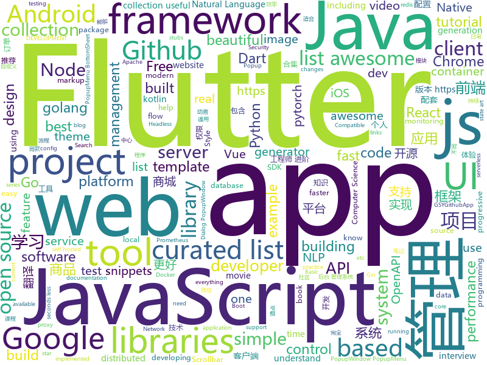

# 2018-12-22
See what the GitHub community is most excited about today.

## python
* [awesome-python-applications](https://github.com/mahmoud/awesome-python-applications)(**1,001 stars today**): 💿Free software that works great, which also happens to be open-source Python.
* [nevergrad](https://github.com/facebookresearch/nevergrad)(**577 stars today**): A Python toolbox for performing gradient-free optimization
* [HelloGitHub](https://github.com/521xueweihan/HelloGitHub)(**397 stars today**): GitHub 上好玩、容易上手的项目，帮你找到编程的乐趣。欢迎推荐、自荐项目，让更多人知道你的项目⭐️
* [pytext](https://github.com/facebookresearch/pytext)(**156 stars today**): A natural language modeling framework based on PyTorch
* [PyTorch_Tutorial](https://github.com/tensor-yu/PyTorch_Tutorial)(**135 stars today**): 《Pytorch模型训练实用教程》中配套代码
* [Deep-Feature-video](https://github.com/BitconFeng/Deep-Feature-video)(**121 stars today**): Deep Feature Flow for Video Recognition
* [Movoo](https://github.com/Alex-teach/Movoo)(**103 stars today**): A social platform for movie share
* [faceTracking](https://github.com/samuel-code/faceTracking)(**99 stars today**): this is my blog pages
* [flair](https://github.com/zalandoresearch/flair)(**77 stars today**): A very simple framework for state-of-the-art Natural Language Processing (NLP)
* [bert](https://github.com/google-research/bert)(**68 stars today**): TensorFlow code and pre-trained models for BERT
* [wtfpython](https://github.com/satwikkansal/wtfpython)(**63 stars today**): A collection of surprising Python snippets and lesser-known features.
* [awesome-python](https://github.com/vinta/awesome-python)(**61 stars today**): A curated list of awesome Python frameworks, libraries, software and resources
* [models](https://github.com/tensorflow/models)(**42 stars today**): Models and examples built with TensorFlow
* [opsmop](https://github.com/opsmop/opsmop)(**56 stars today**): Next generation config management and app deployment
* [q](https://github.com/harelba/q)(**54 stars today**): q - Run SQL directly on CSV or TSV files
* [system-design-primer](https://github.com/donnemartin/system-design-primer)(**51 stars today**): Learn how to design large-scale systems. Prep for the system design interview. Includes Anki flashcards.
* [youtube-dl](https://github.com/rg3/youtube-dl)(**49 stars today**): Command-line program to download videos from YouTube.com and other video sites
* [DeepFocus](https://github.com/facebookresearch/DeepFocus)(**49 stars today**): DeepFocus: Learned Image Synthesis for Computational Displays
* [keras](https://github.com/keras-team/keras)(**40 stars today**): Deep Learning for humans
* [wtfpython-cn](https://github.com/leisurelicht/wtfpython-cn)(**39 stars today**): wtfpython的中文翻译/施工结束/ 能力有限，欢迎帮我改进翻译
* [public-apis](https://github.com/toddmotto/public-apis)(**40 stars today**): A collective list of free APIs for use in software and web development.
* [XX-Net](https://github.com/XX-net/XX-Net)(**33 stars today**): a web proxy tool
* [bertviz](https://github.com/jessevig/bertviz)(**34 stars today**): Tool for visualizing BERT's attention
* [home-assistant](https://github.com/home-assistant/home-assistant)(**32 stars today**): 🏡Open source home automation that puts local control and privacy first
* [vpn-at-home](https://github.com/ezaquarii/vpn-at-home)(**34 stars today**): 1-click, self-hosted OpenVPN deployment and management app.

## java
* [mall](https://github.com/macrozheng/mall)(**302 stars today**): mall项目是一套电商系统，包括前台商城系统及后台管理系统，基于SpringBoot+MyBatis实现。 前台商城系统包含首页门户、商品推荐、商品搜索、商品展示、购物车、订单流程、会员中心、客户服务、帮助中心等模块。 后台管理系统包含商品管理、订单管理、会员管理、促销管理、运营管理、内容管理、统计报表、财务管理、权限管理、设置等模块。
* [XPopup](https://github.com/li-xiaojun/XPopup)(**131 stars today**): 🔥功能强大，UI简洁，交互优雅的通用弹窗！可以替代Dialog，PopupWindow，PopupMenu，BottomSheet，DrawerLayout等组件，自带十几种效果良好的动画， 支持完全的UI和动画自定义！(Powerful and Beautiful Popup，can absolutely replace Dialog，PopupWindow，PopupMenu，BottomSheet，DrawerLayout. With built-in animators , very easy to custom Popup View.)
* [JavaGuide](https://github.com/Snailclimb/JavaGuide)(**113 stars today**): 【Java学习+面试指南】 一份涵盖大部分Java程序员所需要掌握的核心知识。
* [AndroidProject](https://github.com/getActivity/AndroidProject)(**105 stars today**): An advanced template project
* [miaosha](https://github.com/qiurunze123/miaosha)(**106 stars today**): 😮😮秒杀系统设计与实现.互联网工程师进阶与分析🙋🐓
* [advanced-java](https://github.com/doocs/advanced-java)(**92 stars today**): 😮互联网 Java 工程师进阶知识完全扫盲
* [APIJSON](https://github.com/TommyLemon/APIJSON)(**73 stars today**): 🚀后端接口和文档自动化，前端(客户端) 定制返回JSON的数据和结构！
* [arthas](https://github.com/alibaba/arthas)(**58 stars today**): Alibaba Java Diagnostic Tool Arthas/Alibaba Java诊断利器Arthas
* [elasticsearch](https://github.com/elastic/elasticsearch)(**49 stars today**): Open Source, Distributed, RESTful Search Engine
* [java-design-patterns](https://github.com/iluwatar/java-design-patterns)(**46 stars today**): Design patterns implemented in Java
* [easyexcel](https://github.com/alibaba/easyexcel)(**47 stars today**): 快速、简单避免OOM的java处理Excel工具
* [apollo](https://github.com/ctripcorp/apollo)(**38 stars today**): Apollo（阿波罗）是携程框架部门研发的分布式配置中心，能够集中化管理应用不同环境、不同集群的配置，配置修改后能够实时推送到应用端，并且具备规范的权限、流程治理等特性，适用于微服务配置管理场景。
* [tutorials](https://github.com/eugenp/tutorials)(**28 stars today**): The "REST With Spring" Course:
* [flink](https://github.com/apache/flink)(**41 stars today**): Apache Flink
* [spring-boot](https://github.com/spring-projects/spring-boot)(**30 stars today**): Spring Boot
* [BasePopup](https://github.com/razerdp/BasePopup)(**39 stars today**): // 打造通用的popupwindow
* [ArgusAPM](https://github.com/Qihoo360/ArgusAPM)(**38 stars today**): Powerful, comprehensive (Android) application performance management platform. 360移动性能监控平台
* [MeiWidgetView](https://github.com/HpWens/MeiWidgetView)(**37 stars today**): 一款汇总了郭霖，鸿洋，以及自己平时收集的自定义控件集合库
* [incubator-dubbo](https://github.com/apache/incubator-dubbo)(**30 stars today**): Apache Dubbo (incubating) is a high-performance, java based, open source RPC framework.
* [symphony](https://github.com/b3log/symphony)(**29 stars today**): 🎶一款用 Java 实现的现代化社区（论坛/BBS/社交网络/博客）平台。https://hacpai.com
* [AndroidUtilCode](https://github.com/Blankj/AndroidUtilCode)(**29 stars today**): 🔥Android developers should collect the following utils(updating).
* [guava](https://github.com/google/guava)(**29 stars today**): Google core libraries for Java
* [litemall](https://github.com/linlinjava/litemall)(**26 stars today**): 又一个小商城。litemall = Spring Boot后端 + Vue管理员前端 + 微信小程序用户前端
* [QMUI_Android](https://github.com/Tencent/QMUI_Android)(**26 stars today**): 提高 Android UI 开发效率的 UI 库
* [Sentinel](https://github.com/alibaba/Sentinel)(**28 stars today**): A lightweight flow-control library providing high-available protection and monitoring (高可用防护的流量管理框架)

## unknown
* [FAQGURU](https://github.com/FAQGURU/FAQGURU)(**524 stars today**): 🎒🚀🎉A list of interview questions. This repository is everything you need to prepare for your technical interview.
* [the-book-of-secret-knowledge](https://github.com/trimstray/the-book-of-secret-knowledge)(**507 stars today**): 💫A collection of awesome lists, manuals, blogs, hacks, one-liners, cli/web tools and more. Especially for System and Network Administrators, DevOps, Pentesters or Security Researchers.
* [Chinese-Podcasts](https://github.com/alaskasquirrel/Chinese-Podcasts)(**217 stars today**): 中文播客：Tech, VC, Life, Movie, Design...
* [flink-forward-china-2018](https://github.com/flink-china/flink-forward-china-2018)(**137 stars today**): Flink Forward China 2018 Slides
* [guide-to-kotlin](https://github.com/Zhuinden/guide-to-kotlin)(**75 stars today**): This tutorial assumes all you know is Java, but you want to learn Kotlin.
* [CS-Notes](https://github.com/CyC2018/CS-Notes)(**64 stars today**): 📚Computer Science Learning Notes
* [gitignore](https://github.com/github/gitignore)(**52 stars today**): A collection of useful .gitignore templates
* [paper-gestalt](https://github.com/vt-vl-lab/paper-gestalt)(**66 stars today**): Deep Paper Gestalt
* [google-cloud-4-words](https://github.com/gregsramblings/google-cloud-4-words)(**57 stars today**): The Google Cloud Developer's Cheat Sheet
* [awesome](https://github.com/sindresorhus/awesome)(**54 stars today**): 😎Curated list of awesome lists
* [coding-interview-university](https://github.com/jwasham/coding-interview-university)(**47 stars today**): A complete computer science study plan to become a software engineer.
* [You-Dont-Know-JS](https://github.com/getify/You-Dont-Know-JS)(**45 stars today**): A book series on JavaScript. @YDKJS on twitter.
* [free-programming-books](https://github.com/EbookFoundation/free-programming-books)(**35 stars today**): 📚Freely available programming books
* [awesome-vue](https://github.com/vuejs/awesome-vue)(**35 stars today**): 🎉A curated list of awesome things related to Vue.js
* [hosts](https://github.com/googlehosts/hosts)(**30 stars today**): 镜像：https://coding.net/u/scaffrey/p/hosts/git
* [awesome-actions](https://github.com/sdras/awesome-actions)(**35 stars today**): A curated list of awesome actions to use on GitHub
* [trackerslist](https://github.com/ngosang/trackerslist)(**31 stars today**): An updated list of public BitTorrent trackers
* [Awesome-pytorch-list](https://github.com/bharathgs/Awesome-pytorch-list)(**29 stars today**): A comprehensive list of pytorch related content on github,such as different models,implementations,helper libraries,tutorials etc.
* [QConShanghai2018](https://github.com/QConChina/QConShanghai2018)(**26 stars today**): QCon上海2018 幻灯片
* [awesome-php-security](https://github.com/guardrailsio/awesome-php-security)(**27 stars today**): Awesome PHP Security Resources🕶🐘🔐
* [project-based-learning](https://github.com/tuvtran/project-based-learning)(**25 stars today**): Curated list of project-based tutorials
* [awesome-serverless](https://github.com/anaibol/awesome-serverless)(**26 stars today**): ☁️A curated list of awesome services, solutions and resources for serverless / nobackend applications.
* [proposal-javascript-standard-library](https://github.com/tc39/proposal-javascript-standard-library)(**24 stars today**): 
* [IntelliJ-IDEA-Tutorial](https://github.com/judasn/IntelliJ-IDEA-Tutorial)(**18 stars today**): IntelliJ IDEA 简体中文专题教程
* [gold-miner](https://github.com/xitu/gold-miner)(**20 stars today**): 🥇掘金翻译计划，可能是世界最大最好的英译中技术社区，最懂读者和译者的翻译平台：

## javascript
* [nodebestpractices](https://github.com/i0natan/nodebestpractices)(**510 stars today**): The largest Node.JS best practices list (November 2018)
* [htm](https://github.com/developit/htm)(**382 stars today**): Hyperscript Tagged Markup: JSX alternative using standard tagged templates, with compiler support.
* [quicklink](https://github.com/GoogleChromeLabs/quicklink)(**136 stars today**): ⚡️Faster subsequent page-loads by prefetching in-viewport links during idle time
* [javascript-algorithms](https://github.com/trekhleb/javascript-algorithms)(**128 stars today**): 📝Algorithms and data structures implemented in JavaScript with explanations and links to further readings
* [vue](https://github.com/vuejs/vue)(**119 stars today**): 🖖Vue.js is a progressive, incrementally-adoptable JavaScript framework for building UI on the web.
* [33-js-concepts](https://github.com/leonardomso/33-js-concepts)(**116 stars today**): 📜33 concepts every JavaScript developer should know.
* [react-developer-roadmap](https://github.com/adam-golab/react-developer-roadmap)(**115 stars today**): Roadmap to becoming a React developer in 2018
* [react](https://github.com/facebook/react)(**102 stars today**): A declarative, efficient, and flexible JavaScript library for building user interfaces.
* [strapi](https://github.com/strapi/strapi)(**109 stars today**): 🚀Open source Node.js Headless CMS to easily build customisable APIs
* [bitandbang](https://github.com/bnb/bitandbang)(**62 stars today**): My npm card🤗
* [coolqlcool](https://github.com/dinubs/coolqlcool)(**94 stars today**): Nextjs server to query websites with GraphQL
* [rallax.js](https://github.com/ChrisCavs/rallax.js)(**86 stars today**): Dead simple parallax scrolling.
* [30-seconds-of-code](https://github.com/30-seconds/30-seconds-of-code)(**69 stars today**): Curated collection of useful JavaScript snippets that you can understand in 30 seconds or less.
* [create-react-app](https://github.com/facebook/create-react-app)(**56 stars today**): Set up a modern web app by running one command.
* [Blog](https://github.com/ljianshu/Blog)(**60 stars today**): 一起学前端，个人博客合集，喜欢的请点 star，想订阅请点 watch
* [Picas](https://github.com/djyde/Picas)(**63 stars today**): Generate Project Logo with Google Fonts
* [puppeteer](https://github.com/GoogleChrome/puppeteer)(**53 stars today**): Headless Chrome Node API
* [axios](https://github.com/axios/axios)(**53 stars today**): Promise based HTTP client for the browser and node.js
* [ice](https://github.com/alibaba/ice)(**50 stars today**): 🚀飞冰 - 让前端开发简单而友好，海量可复用物料，配套桌面工具极速构建前端应用，效率提升 100%
* [javascript](https://github.com/airbnb/javascript)(**46 stars today**): JavaScript Style Guide
* [three.js](https://github.com/mrdoob/three.js)(**41 stars today**): JavaScript 3D library.
* [taro](https://github.com/NervJS/taro)(**44 stars today**): 多端统一开发框架，支持用 React 的开发方式编写一次代码，生成能运行在微信/百度/支付宝/字节跳动小程序、H5、React Native 等的应用。 https://taro.js.org/
* [cubejs-client](https://github.com/statsbotco/cubejs-client)(**43 stars today**): 📊Serverless Analytics Framework
* [carbon](https://github.com/dawnlabs/carbon)(**43 stars today**): 🎨Create and share beautiful images of your source code
* [node](https://github.com/nodejs/node)(**38 stars today**): Node.js JavaScript runtime✨🐢🚀✨

## html
* [codelf](https://github.com/unbug/codelf)(**283 stars today**): Best GitHub stars, repositories tagger and organizer. Search over projects from Github, Bitbucket, Google Code, Codeplex, Sourceforge, Fedora Project, GitLab to find real-world usage variable names
* [flutter-in-action](https://github.com/flutterchina/flutter-in-action)(**33 stars today**): 《Flutter实战》电子书
* [deeplearning_ai_books](https://github.com/fengdu78/deeplearning_ai_books)(**19 stars today**): deeplearning.ai（吴恩达老师的深度学习课程笔记及资源）
* [Coursera-ML-AndrewNg-Notes](https://github.com/fengdu78/Coursera-ML-AndrewNg-Notes)(**17 stars today**): 吴恩达老师的机器学习课程个人笔记
* [AdminLTE](https://github.com/almasaeed2010/AdminLTE)(**19 stars today**): AdminLTE - Free Premium Admin control Panel Theme Based On Bootstrap 3.x
* [ionic](https://github.com/ionic-team/ionic)(**18 stars today**): Build amazing native and progressive web apps with open web technologies. One app running on everything🎉
* [nginxconfig.io](https://github.com/valentinxxx/nginxconfig.io)(**19 stars today**): ⚙️NGiИX config generator generator on steroids💉
* [fastText](https://github.com/facebookresearch/fastText)(**15 stars today**): Library for fast text representation and classification.
* [styleguide](https://github.com/google/styleguide)(**13 stars today**): Style guides for Google-originated open-source projects
* [javascript-tutorial-ja](https://github.com/KenjiI/javascript-tutorial-ja)(**14 stars today**): 現代の JavaScript チュートリアル
* [30-seconds-of-css](https://github.com/30-seconds/30-seconds-of-css)(**14 stars today**): A curated collection of useful CSS snippets you can understand in 30 seconds or less.
* [slate](https://github.com/Shopify/slate)(**13 stars today**): Slate is a toolkit for developing Shopify themes. It's designed to assist your workflow and speed up the process of developing, testing, and deploying themes.
* [openapi-generator](https://github.com/OpenAPITools/openapi-generator)(**12 stars today**): OpenAPI Generator allows generation of API client libraries (SDK generation), server stubs, documentation and configuration automatically given an OpenAPI Spec (v2, v3)
* [NLP-progress](https://github.com/sebastianruder/NLP-progress)(**11 stars today**): Repository to track the progress in Natural Language Processing (NLP), including the datasets and the current state-of-the-art for the most common NLP tasks.
* [JavaScript30](https://github.com/wesbos/JavaScript30)(**7 stars today**): 30 Day Vanilla JS Challenge
* [Spoon-Knife](https://github.com/octocat/Spoon-Knife)(****): This repo is for demonstration purposes only.
* [InteractiveLandscape](https://github.com/ma77os/InteractiveLandscape)(**11 stars today**): An exploration of an animated interactive landscape built with three.js.
* [frontend-tech-list](https://github.com/alienzhou/frontend-tech-list)(**9 stars today**): a frontend tech list for developers
* [javascript-tutorial-en](https://github.com/iliakan/javascript-tutorial-en)(**9 stars today**): Modern JavaScript Tutorial
* [ImageOptim](https://github.com/ImageOptim/ImageOptim)(**10 stars today**): GUI image optimizer for Mac
* [accessible-html-content-patterns](https://github.com/ericwbailey/accessible-html-content-patterns)(**10 stars today**): ♿️The full HTML5 Doctor Element Index as well as common markup patterns for quick reference.
* [portainer](https://github.com/portainer/portainer)(**9 stars today**): Simple management UI for Docker
* [hugo-academic](https://github.com/gcushen/hugo-academic)(**8 stars today**): The website designer for Hugo. Build and deploy a beautiful website in minutes🚀
* [swagger-codegen](https://github.com/swagger-api/swagger-codegen)(**7 stars today**): swagger-codegen contains a template-driven engine to generate documentation, API clients and server stubs in different languages by parsing your OpenAPI / Swagger definition.
* [home](https://github.com/apachecn/home)(**8 stars today**): ApacheCN 开源组织

## dart
* [flutter](https://github.com/flutter/flutter)(**169 stars today**): Flutter makes it easy and fast to build beautiful mobile apps.
* [awesome-flutter](https://github.com/Solido/awesome-flutter)(**93 stars today**): An awesome list that curates the best Flutter libraries, tools, tutorials, articles and more.
* [GSYGithubAppFlutter](https://github.com/CarGuo/GSYGithubAppFlutter)(**23 stars today**): 超完整的Flutter项目，功能丰富，适合学习和日常使用。GSYGithubApp系列的优势：我们目前已经拥有Flutter、Weex、ReactNative、kotlin 四个版本。 功能齐全，项目框架内技术涉及面广，完成度高，持续维护，配套文章，适合全面学习，对比参考。跨平台的开源Github客户端App，更好的体验，更丰富的功能，旨在更好的日常管理和维护个人Github，提供更好更方便的驾车体验Σ(￣。￣ﾉ)ﾉ。同款Weex版本 ： https://github.com/CarGuo/GSYGithubAppWeex 、同款React Native版本 ： https://github.com/CarGuo/GSYGithubApp 、原生 kotlin 版本 https://g…
* [plugins](https://github.com/flutter/plugins)(**21 stars today**): Plugins for Flutter, including FlutterFire, maintained by the Flutter team
* [dio](https://github.com/flutterchina/dio)(**15 stars today**): A powerful Http client for Dart, which supports Interceptors, FormData, Request Cancellation, File Downloading, Timeout etc.
* [Flutter-UI-Kit](https://github.com/iampawan/Flutter-UI-Kit)(**12 stars today**): Flutter app for collection of UI in a UIKit
* [Flutter-Notebook](https://github.com/OpenFlutter/Flutter-Notebook)(**11 stars today**): 日更的FlutterDemo合集，今天你fu了吗
* [bloc](https://github.com/felangel/bloc)(**12 stars today**): A collection of packages that help implement the BLoC design pattern
* [samples](https://github.com/flutter/samples)(**10 stars today**): A collection of Flutter examples and demos.
* [flutter_hooks](https://github.com/rrousselGit/flutter_hooks)(**10 stars today**): 
* [flutter_swiper](https://github.com/best-flutter/flutter_swiper)(**7 stars today**): The best swiper for flutter , with multiple layouts, infinite loop. Compatible with Android & iOS.
* [recipeapp](https://github.com/SnakeyHips/recipeapp)(**8 stars today**): Recipe App UI template using Flutter.
* [flutter_architecture_samples](https://github.com/brianegan/flutter_architecture_samples)(**6 stars today**): TodoMVC for Flutter
* [flutter-osc](https://github.com/yubo725/flutter-osc)(**5 stars today**): 基于Google Flutter的开源中国客户端，支持Android和iOS。
* [inKino](https://github.com/roughike/inKino)(**5 stars today**): A multiplatform Dart movie app with 40% of code sharing between Flutter and the Web.
* [FlutterCinematic](https://github.com/aaronoe/FlutterCinematic)(****): Flutter clone of my "Cinematic" App
* [website](https://github.com/flutter/website)(****): Flutter web site
* [flutter-draggable-scrollbar](https://github.com/fluttercommunity/flutter-draggable-scrollbar)(****): Draggable Scrollbar - A scrollbar that can be dragged for quickly navigation through a vertical list. Additional option is showing label next to scrollthumb with information about current item. Maintainer: @marica27
* [flutter](https://github.com/Nealyang/flutter)(****): study flutter,持续更新中...
* [weight_tracker](https://github.com/MSzalek-Mobile/weight_tracker)(****): 
* [flutter-mobile](https://github.com/invoiceninja/flutter-mobile)(****): iOS/Android app for Invoice Ninja built with Google Flutter
* [chromedeveditor](https://github.com/googlearchive/chromedeveditor)(****): Chrome Dev Editor is a developer tool for building apps on the Chrome platform - Chrome Apps and Web Apps, in JavaScript or Dart. (NO LONGER IN ACTIVE DEVELOPMENT)
* [sdk](https://github.com/dart-lang/sdk)(****): The Dart SDK, including the VM, dart2js, core libraries, and more.
* [FlutterExampleApps](https://github.com/iampawan/FlutterExampleApps)(****): [Example APPS] Basic Flutter apps, for flutter devs.
* [flutter-examples](https://github.com/nisrulz/flutter-examples)(****): [Examples] Simple basic isolated apps, for budding flutter devs.

## go
* [torus](https://github.com/MilenMT/torus)(**127 stars today**): Torus - distributed storage system
* [loki](https://github.com/grafana/loki)(**80 stars today**): Like Prometheus, but for logs.
* [goreplay](https://github.com/buger/goreplay)(**72 stars today**): GoReplay is an open-source tool for capturing and replaying live HTTP traffic into a test environment in order to continuously test your system with real data. It can be used to increase confidence in code deployments, configuration changes and infrastructure changes.
* [goldpinger](https://github.com/bloomberg/goldpinger)(**71 stars today**): Debugging tool for Kubernetes which tests and displays connectivity between nodes in the cluster.
* [redix](https://github.com/alash3al/redix)(**70 stars today**): a very fast persistent pure key - value store, that uses the same redis protocol
* [redispipe](https://github.com/joomcode/redispipe)(**66 stars today**): High-throughput Redis client for Go with implicit pipelining
* [kubernetes](https://github.com/kubernetes/kubernetes)(**54 stars today**): Production-Grade Container Scheduling and Management
* [go](https://github.com/golang/go)(**56 stars today**): The Go programming language
* [dive](https://github.com/wagoodman/dive)(**43 stars today**): A tool for exploring each layer in a docker image
* [awesome-go](https://github.com/avelino/awesome-go)(**40 stars today**): A curated list of awesome Go frameworks, libraries and software
* [frp](https://github.com/fatedier/frp)(**37 stars today**): A fast reverse proxy to help you expose a local server behind a NAT or firewall to the internet.
* [exp-httpclient](https://github.com/bradfitz/exp-httpclient)(**37 stars today**): experimental new HTTP client API for #golang (WIP)
* [gin](https://github.com/gin-gonic/gin)(**34 stars today**): Gin is a HTTP web framework written in Go (Golang). It features a Martini-like API with much better performance -- up to 40 times faster. If you need smashing performance, get yourself some Gin.
* [rendora](https://github.com/rendora/rendora)(**33 stars today**): dynamic server-side rendering using headless Chrome to effortlessly solve the SEO problem for modern javascript websites
* [istio](https://github.com/istio/istio)(**31 stars today**): Connect, secure, control, and observe services.
* [prometheus](https://github.com/prometheus/prometheus)(**32 stars today**): The Prometheus monitoring system and time series database.
* [build-web-application-with-golang](https://github.com/astaxie/build-web-application-with-golang)(**30 stars today**): A golang ebook intro how to build a web with golang
* [tabby](https://github.com/cheynewallace/tabby)(**33 stars today**): A tiny library for super simple Golang tables
* [gogs](https://github.com/gogs/gogs)(**31 stars today**): Gogs is a painless self-hosted Git service.
* [helm](https://github.com/helm/helm)(**29 stars today**): The Kubernetes Package Manager
* [docker_practice](https://github.com/yeasy/docker_practice)(**25 stars today**): Learn and understand Docker technologies, with real DevOps practice!
* [v2ray-core](https://github.com/v2ray/v2ray-core)(**23 stars today**): A platform for building proxies to bypass network restrictions.
* [moby](https://github.com/moby/moby)(**22 stars today**): Moby Project - a collaborative project for the container ecosystem to assemble container-based systems
* [tidb](https://github.com/pingcap/tidb)(**20 stars today**): TiDB is a distributed HTAP database compatible with the MySQL protocol
* [vegeta](https://github.com/tsenart/vegeta)(**22 stars today**): HTTP load testing tool and library. It's over 9000!

## WordCloud

