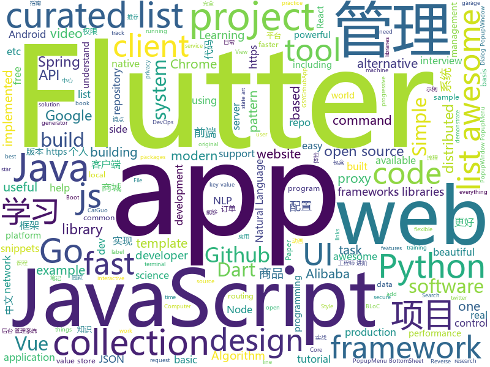

# 2018-12-23
See what the GitHub community is most excited about today.

## python
* [awesome-python-applications](https://github.com/mahmoud/awesome-python-applications)(**570 stars today**): 💿Free software that works great, and also happens to be open-source Python.
* [nevergrad](https://github.com/facebookresearch/nevergrad)(**259 stars today**): A Python toolbox for performing gradient-free optimization
* [HelloGitHub](https://github.com/521xueweihan/HelloGitHub)(**246 stars today**): GitHub 上好玩、容易上手的项目，帮你找到编程的乐趣。欢迎推荐、自荐项目，让更多人知道你的项目⭐️
* [tools](https://github.com/ghost123gg/tools)(**165 stars today**): A Python Crawler Framework
* [privacy](https://github.com/tensorflow/privacy)(**95 stars today**): Library for training machine learning models with privacy for training data
* [pytext](https://github.com/facebookresearch/pytext)(**79 stars today**): A natural language modeling framework based on PyTorch
* [flair](https://github.com/zalandoresearch/flair)(**76 stars today**): A very simple framework for state-of-the-art Natural Language Processing (NLP)
* [youtube-dl](https://github.com/rg3/youtube-dl)(**43 stars today**): Command-line program to download videos from YouTube.com and other video sites
* [awesome-python](https://github.com/vinta/awesome-python)(**45 stars today**): A curated list of awesome Python frameworks, libraries, software and resources
* [TensorFlow-Object-Detection-on-the-Raspberry-Pi](https://github.com/EdjeElectronics/TensorFlow-Object-Detection-on-the-Raspberry-Pi)(**37 stars today**): A tutorial showing how to set up TensorFlow's Object Detection API on the Raspberry Pi
* [models](https://github.com/tensorflow/models)(**31 stars today**): Models and examples built with TensorFlow
* [PyTorch_Tutorial](https://github.com/tensor-yu/PyTorch_Tutorial)(**35 stars today**): 《Pytorch模型训练实用教程》中配套代码
* [keras](https://github.com/keras-team/keras)(**34 stars today**): Deep Learning for humans
* [bert](https://github.com/google-research/bert)(**35 stars today**): TensorFlow code and pre-trained models for BERT
* [system-design-primer](https://github.com/donnemartin/system-design-primer)(**31 stars today**): Learn how to design large-scale systems. Prep for the system design interview. Includes Anki flashcards.
* [public-apis](https://github.com/toddmotto/public-apis)(**30 stars today**): A collective list of free APIs for use in software and web development.
* [awesome-machine-learning](https://github.com/josephmisiti/awesome-machine-learning)(**27 stars today**): A curated list of awesome Machine Learning frameworks, libraries and software.
* [face_recognition](https://github.com/ageitgey/face_recognition)(**26 stars today**): The world's simplest facial recognition api for Python and the command line
* [wtfpython](https://github.com/satwikkansal/wtfpython)(**30 stars today**): A collection of surprising Python snippets and lesser-known features.
* [httpie](https://github.com/jakubroztocil/httpie)(**28 stars today**): As easy as httpie /aitch-tee-tee-pie/ 🥧 Modern command line HTTP client – user-friendly curl alternative with intuitive UI, JSON support, syntax highlighting, wget-like downloads, extensions, etc. https://twitter.com/clihttp
* [Python](https://github.com/TheAlgorithms/Python)(**23 stars today**): All Algorithms implemented in Python
* [cpython](https://github.com/python/cpython)(**17 stars today**): The Python programming language
* [home-assistant](https://github.com/home-assistant/home-assistant)(**21 stars today**): 🏡Open source home automation that puts local control and privacy first
* [XX-Net](https://github.com/XX-net/XX-Net)(**23 stars today**): a web proxy tool
* [faceswap](https://github.com/deepfakes/faceswap)(**18 stars today**): Non official project based on original /r/Deepfakes thread. Many thanks to him!

## java
* [advanced-java](https://github.com/doocs/advanced-java)(**156 stars today**): 😮互联网 Java 工程师进阶知识完全扫盲
* [mall](https://github.com/macrozheng/mall)(**108 stars today**): mall项目是一套电商系统，包括前台商城系统及后台管理系统，基于SpringBoot+MyBatis实现。 前台商城系统包含首页门户、商品推荐、商品搜索、商品展示、购物车、订单流程、会员中心、客户服务、帮助中心等模块。 后台管理系统包含商品管理、订单管理、会员管理、促销管理、运营管理、内容管理、统计报表、财务管理、权限管理、设置等模块。
* [JavaGuide](https://github.com/Snailclimb/JavaGuide)(**54 stars today**): 【Java学习+面试指南】 一份涵盖大部分Java程序员所需要掌握的核心知识。
* [XPopup](https://github.com/li-xiaojun/XPopup)(**51 stars today**): 🔥功能强大，UI简洁，交互优雅的通用弹窗！可以替代Dialog，PopupWindow，PopupMenu，BottomSheet，DrawerLayout等组件，自带十几种效果良好的动画， 支持完全的UI和动画自定义！(Powerful and Beautiful Popup，can absolutely replace Dialog，PopupWindow，PopupMenu，BottomSheet，DrawerLayout. With built-in animators , very easy to custom Popup View.)
* [arthas](https://github.com/alibaba/arthas)(**37 stars today**): Alibaba Java Diagnostic Tool Arthas/Alibaba Java诊断利器Arthas
* [ArgusAPM](https://github.com/Qihoo360/ArgusAPM)(**34 stars today**): Powerful, comprehensive (Android) application performance management platform. 360移动性能监控平台
* [spring-boot](https://github.com/spring-projects/spring-boot)(**24 stars today**): Spring Boot
* [symphony](https://github.com/b3log/symphony)(**27 stars today**): 🎶一款用 Java 实现的现代化社区（论坛/BBS/社交网络/博客）平台。https://hacpai.com
* [tutorials](https://github.com/eugenp/tutorials)(**18 stars today**): The "REST With Spring" Course:
* [AndroidProject](https://github.com/getActivity/AndroidProject)(**25 stars today**): An advanced template project
* [java-design-patterns](https://github.com/iluwatar/java-design-patterns)(**23 stars today**): Design patterns implemented in Java
* [miaosha](https://github.com/qiurunze123/miaosha)(**22 stars today**): 😮😮秒杀系统设计与实现.互联网工程师进阶与分析🙋🐓
* [spring-framework](https://github.com/spring-projects/spring-framework)(**19 stars today**): Spring Framework
* [elasticsearch](https://github.com/elastic/elasticsearch)(**20 stars today**): Open Source, Distributed, RESTful Search Engine
* [Java](https://github.com/TheAlgorithms/Java)(**20 stars today**): All Algorithms implemented in Java
* [kafka](https://github.com/apache/kafka)(**20 stars today**): Mirror of Apache Kafka
* [easyexcel](https://github.com/alibaba/easyexcel)(**17 stars today**): 快速、简单避免OOM的java处理Excel工具
* [JCSprout](https://github.com/crossoverJie/JCSprout)(**14 stars today**): 👨‍🎓Java Core Sprout : basic, concurrent, algorithm
* [APIJSON](https://github.com/TommyLemon/APIJSON)(**16 stars today**): 🚀后端接口和文档自动化，前端(客户端) 定制返回JSON的数据和结构！
* [spring-cloud-alibaba](https://github.com/spring-cloud-incubator/spring-cloud-alibaba)(**15 stars today**): Spring Cloud Alibaba provides a one-stop solution for application development for the distributed solutions of Alibaba middleware.
* [retrofit](https://github.com/square/retrofit)(**16 stars today**): Type-safe HTTP client for Android and Java by Square, Inc.
* [Sentinel](https://github.com/alibaba/Sentinel)(**13 stars today**): A lightweight flow-control library providing high-available protection and monitoring (高可用防护的流量管理框架)
* [flink](https://github.com/apache/flink)(**12 stars today**): Apache Flink
* [apollo](https://github.com/ctripcorp/apollo)(**12 stars today**): Apollo（阿波罗）是携程框架部门研发的分布式配置中心，能够集中化管理应用不同环境、不同集群的配置，配置修改后能够实时推送到应用端，并且具备规范的权限、流程治理等特性，适用于微服务配置管理场景。
* [litemall](https://github.com/linlinjava/litemall)(**13 stars today**): 又一个小商城。litemall = Spring Boot后端 + Vue管理员前端 + 微信小程序用户前端

## unknown
* [the-book-of-secret-knowledge](https://github.com/trimstray/the-book-of-secret-knowledge)(**242 stars today**): 💫A collection of awesome lists, manuals, blogs, hacks, one-liners, cli/web tools and more. Especially for System and Network Administrators, DevOps, Pentesters or Security Researchers.
* [FAQGURU](https://github.com/FAQGURU/FAQGURU)(**133 stars today**): 🎒🚀🎉A list of interview questions. This repository is everything you need to prepare for your technical interview.
* [Chinese-Podcasts](https://github.com/alaskasquirrel/Chinese-Podcasts)(**92 stars today**): 中文播客：Tech, VC, Life, Movie, Design...
* [CS-Notes](https://github.com/CyC2018/CS-Notes)(**46 stars today**): 📚Computer Science Learning Notes
* [gitignore](https://github.com/github/gitignore)(**36 stars today**): A collection of useful .gitignore templates
* [free-programming-books](https://github.com/EbookFoundation/free-programming-books)(**42 stars today**): 📚Freely available programming books
* [paper-gestalt](https://github.com/vt-vl-lab/paper-gestalt)(**38 stars today**): Deep Paper Gestalt
* [You-Dont-Know-JS](https://github.com/getify/You-Dont-Know-JS)(**35 stars today**): A book series on JavaScript. @YDKJS on twitter.
* [trackerslist](https://github.com/ngosang/trackerslist)(**33 stars today**): An updated list of public BitTorrent trackers
* [DarthSidious-Chinese](https://github.com/crazywa1ker/DarthSidious-Chinese)(**34 stars today**): DarthSidious 中文版
* [coding-interview-university](https://github.com/jwasham/coding-interview-university)(**27 stars today**): A complete computer science study plan to become a software engineer.
* [awesome](https://github.com/sindresorhus/awesome)(**29 stars today**): 😎Curated list of awesome lists
* [hosts](https://github.com/googlehosts/hosts)(**24 stars today**): 镜像：https://coding.net/u/scaffrey/p/hosts/git
* [front-end-summary](https://github.com/fairyly/front-end-summary)(**24 stars today**): summary
* [awesome-crypto-trackers](https://github.com/denisnazarov/awesome-crypto-trackers)(**22 stars today**): A curated list of crypto project trackers and analytics dashboards.
* [awesome-vue](https://github.com/vuejs/awesome-vue)(**23 stars today**): 🎉A curated list of awesome things related to Vue.js
* [project-based-learning](https://github.com/tuvtran/project-based-learning)(**17 stars today**): Curated list of project-based tutorials
* [changelog-v5](https://github.com/webpack/changelog-v5)(**18 stars today**): Temporary repo for the changelog for webpack 5
* [awesome-public-datasets](https://github.com/awesomedata/awesome-public-datasets)(**15 stars today**): A topic-centric list of HQ open datasets in public domains. PR ☛☛☛
* [flink-forward-china-2018](https://github.com/flink-china/flink-forward-china-2018)(**13 stars today**): Flink Forward China 2018 Slides
* [awesome-laravel](https://github.com/chiraggude/awesome-laravel)(**13 stars today**): A curated list of bookmarks, packages, tutorials, videos and other cool resources from the Laravel ecosystem
* [first-contributions](https://github.com/firstcontributions/first-contributions)(**5 stars today**): 🚀✨Help beginners to contribute to open source projects
* [proposals](https://github.com/tc39/proposals)(**15 stars today**): Tracking ECMAScript Proposals
* [awesome-cpp](https://github.com/fffaraz/awesome-cpp)(**14 stars today**): A curated list of awesome C++ (or C) frameworks, libraries, resources, and shiny things. Inspired by awesome-... stuff.
* [proposal-javascript-standard-library](https://github.com/tc39/proposal-javascript-standard-library)(**14 stars today**): 

## javascript
* [nodebestpractices](https://github.com/i0natan/nodebestpractices)(**184 stars today**): The largest Node.JS best practices list (November 2018)
* [Boostnote](https://github.com/BoostIO/Boostnote)(**150 stars today**): A markdown editor for developers on Mac, Windows and Linux.
* [htm](https://github.com/developit/htm)(**143 stars today**): Hyperscript Tagged Markup: JSX alternative using standard tagged templates, with compiler support.
* [33-js-concepts](https://github.com/leonardomso/33-js-concepts)(**132 stars today**): 📜33 concepts every JavaScript developer should know.
* [vue](https://github.com/vuejs/vue)(**85 stars today**): 🖖Vue.js is a progressive, incrementally-adoptable JavaScript framework for building UI on the web.
* [swc](https://github.com/swc-project/swc)(**82 stars today**): Super-fast alternative for babel
* [javascript-algorithms](https://github.com/trekhleb/javascript-algorithms)(**77 stars today**): 📝Algorithms and data structures implemented in JavaScript with explanations and links to further readings
* [react](https://github.com/facebook/react)(**62 stars today**): A declarative, efficient, and flexible JavaScript library for building user interfaces.
* [strapi](https://github.com/strapi/strapi)(**55 stars today**): 🚀Open source Node.js Headless CMS to easily build customisable APIs
* [30-seconds-of-code](https://github.com/30-seconds/30-seconds-of-code)(**50 stars today**): Curated collection of useful JavaScript snippets that you can understand in 30 seconds or less.
* [edex-ui](https://github.com/GitSquared/edex-ui)(**49 stars today**): A science fiction terminal emulator designed for large touchscreens that runs on all major OSs.
* [create-react-app](https://github.com/facebook/create-react-app)(**39 stars today**): Set up a modern web app by running one command.
* [quicklink](https://github.com/GoogleChromeLabs/quicklink)(**40 stars today**): ⚡️Faster subsequent page-loads by prefetching in-viewport links during idle time
* [spline-research](https://github.com/raphlinus/spline-research)(**39 stars today**): A repository for research code, papers, interactive visualizers, etc., for spline research
* [webtorrent](https://github.com/webtorrent/webtorrent)(**36 stars today**): ⚡️Streaming torrent client for the web
* [Picas](https://github.com/djyde/Picas)(**36 stars today**): Generate Project Logo with Google Fonts
* [vue-html](https://github.com/egoist/vue-html)(**36 stars today**): An alternative to Vue template and Vue JSX
* [bitandbang](https://github.com/bnb/bitandbang)(**26 stars today**): My npm card🤗
* [javascript](https://github.com/airbnb/javascript)(**32 stars today**): JavaScript Style Guide
* [react-developer-roadmap](https://github.com/adam-golab/react-developer-roadmap)(**32 stars today**): Roadmap to becoming a React developer in 2018
* [next.js](https://github.com/zeit/next.js)(**31 stars today**): The React Framework
* [node](https://github.com/nodejs/node)(**28 stars today**): Node.js JavaScript runtime✨🐢🚀✨
* [Blog](https://github.com/ljianshu/Blog)(**28 stars today**): 一起学前端，个人博客合集，喜欢的请点 star，想订阅请点 watch
* [coolqlcool](https://github.com/dinubs/coolqlcool)(**28 stars today**): Nextjs server to query websites with GraphQL
* [gatsby](https://github.com/gatsbyjs/gatsby)(**25 stars today**): Build blazing fast, modern apps and websites with React

## html
* [codelf](https://github.com/unbug/codelf)(**102 stars today**): Best GitHub stars, repositories tagger and organizer. Search over projects from Github, Bitbucket, Google Code, Codeplex, Sourceforge, Fedora Project, GitLab to find real-world usage variable names
* [next-boilerplate](https://github.com/pankod/next-boilerplate)(**38 stars today**): A well-structured production ready Next.js boilerplate with Typescript, Redux, Express.js, Sass, Css, EnvConfig, Reverse Proxy, Bundle Analyzer.
* [flutter-in-action](https://github.com/flutterchina/flutter-in-action)(**18 stars today**): 《Flutter实战》电子书
* [JavaScript30](https://github.com/wesbos/JavaScript30)(**8 stars today**): 30 Day Vanilla JS Challenge
* [Coursera-ML-AndrewNg-Notes](https://github.com/fengdu78/Coursera-ML-AndrewNg-Notes)(**14 stars today**): 吴恩达老师的机器学习课程个人笔记
* [pitstop](https://github.com/EdwinVW/pitstop)(**14 stars today**): This repo contains a sample application based on a Garage Management System for PitStop - a fictitious garage. The primary goal of this sample is to demonstrate several Web-Scale Architecture concepts like: Microservices, CQRS, Event Sourcing, Domain Driven Design (DDD), Eventual Consistency.
* [proposal-pipeline-operator](https://github.com/tc39/proposal-pipeline-operator)(**14 stars today**): A proposal for adding the simple-but-useful pipeline operator to JavaScript.
* [deeplearning_ai_books](https://github.com/fengdu78/deeplearning_ai_books)(**11 stars today**): deeplearning.ai（吴恩达老师的深度学习课程笔记及资源）
* [NLP-progress](https://github.com/sebastianruder/NLP-progress)(**10 stars today**): Repository to track the progress in Natural Language Processing (NLP), including the datasets and the current state-of-the-art for the most common NLP tasks.
* [fastText](https://github.com/facebookresearch/fastText)(**10 stars today**): Library for fast text representation and classification.
* [styleguide](https://github.com/google/styleguide)(**9 stars today**): Style guides for Google-originated open-source projects
* [ionic](https://github.com/ionic-team/ionic)(**8 stars today**): Build amazing native and progressive web apps with open web technologies. One app running on everything🎉
* [accessible-html-content-patterns](https://github.com/ericwbailey/accessible-html-content-patterns)(**9 stars today**): ♿️The full HTML5 Doctor Element Index as well as common markup patterns for quick reference.
* [Spoon-Knife](https://github.com/octocat/Spoon-Knife)(****): This repo is for demonstration purposes only.
* [javascript-tutorial-ja](https://github.com/KenjiI/javascript-tutorial-ja)(**6 stars today**): 現代の JavaScript チュートリアル
* [polymer](https://github.com/Polymer/polymer)(**7 stars today**): Our original Web Component library.
* [fonts](https://github.com/google/fonts)(**6 stars today**): Font files available from Google Fonts
* [nginxconfig.io](https://github.com/valentinxxx/nginxconfig.io)(**6 stars today**): ⚙️NGiИX config generator generator on steroids💉
* [30-seconds-of-css](https://github.com/30-seconds/30-seconds-of-css)(**6 stars today**): A curated collection of useful CSS snippets you can understand in 30 seconds or less.
* [now-github-starter](https://github.com/zeit/now-github-starter)(****): Starter project to demonstrate a project whose pull requests get automatically deployed
* [foundation-sites](https://github.com/zurb/foundation-sites)(**6 stars today**): The most advanced responsive front-end framework in the world. Quickly create prototypes and production code for sites that work on any kind of device.
* [hugo-academic](https://github.com/gcushen/hugo-academic)(**6 stars today**): The website designer for Hugo. Build and deploy a beautiful website in minutes🚀
* [node-ytdl-core](https://github.com/fent/node-ytdl-core)(**6 stars today**): YouTube video downloader in javascript.
* [portainer](https://github.com/portainer/portainer)(**5 stars today**): Simple management UI for Docker
* [craftinginterpreters](https://github.com/munificent/craftinginterpreters)(**5 stars today**): Repository for the book "Crafting Interpreters"

## dart
* [flutter](https://github.com/flutter/flutter)(**92 stars today**): Flutter makes it easy and fast to build beautiful mobile apps.
* [awesome-flutter](https://github.com/Solido/awesome-flutter)(**53 stars today**): An awesome list that curates the best Flutter libraries, tools, tutorials, articles and more.
* [plugins](https://github.com/flutter/plugins)(**18 stars today**): Plugins for Flutter, including FlutterFire, maintained by the Flutter team
* [bloc](https://github.com/felangel/bloc)(**13 stars today**): A collection of packages that help implement the BLoC design pattern
* [GSYGithubAppFlutter](https://github.com/CarGuo/GSYGithubAppFlutter)(**10 stars today**): 超完整的Flutter项目，功能丰富，适合学习和日常使用。GSYGithubApp系列的优势：我们目前已经拥有Flutter、Weex、ReactNative、kotlin 四个版本。 功能齐全，项目框架内技术涉及面广，完成度高，持续维护，配套文章，适合全面学习，对比参考。跨平台的开源Github客户端App，更好的体验，更丰富的功能，旨在更好的日常管理和维护个人Github，提供更好更方便的驾车体验Σ(￣。￣ﾉ)ﾉ。同款Weex版本 ： https://github.com/CarGuo/GSYGithubAppWeex 、同款React Native版本 ： https://github.com/CarGuo/GSYGithubApp 、原生 kotlin 版本 https://g…
* [hydrated](https://github.com/lukepighetti/hydrated)(**10 stars today**): 🚰A BehaviorSubject for Flutter with auto-persist and async hydrate
* [flutter_architecture_samples](https://github.com/brianegan/flutter_architecture_samples)(**9 stars today**): TodoMVC for Flutter
* [flutter_catalog](https://github.com/X-Wei/flutter_catalog)(**8 stars today**): An app showcasing Flutter components, with side-by-side source code view.
* [dio](https://github.com/flutterchina/dio)(**8 stars today**): A powerful Http client for Dart, which supports Interceptors, FormData, Request Cancellation, File Downloading, Timeout etc.
* [flutter_hooks](https://github.com/rrousselGit/flutter_hooks)(**8 stars today**): 
* [fluro](https://github.com/theyakka/fluro)(**7 stars today**): Fluro is a Flutter routing library that adds flexible routing options like wildcards, named parameters and clear route definitions.
* [samples](https://github.com/flutter/samples)(**5 stars today**): A collection of Flutter examples and demos.
* [sdk](https://github.com/dart-lang/sdk)(**5 stars today**): The Dart SDK, including the VM, dart2js, core libraries, and more.
* [Flare-Flutter](https://github.com/2d-inc/Flare-Flutter)(**5 stars today**): 
* [udacity-course](https://github.com/flutter/udacity-course)(****): Build native mobile apps with Flutter
* [flutter-mobile](https://github.com/invoiceninja/flutter-mobile)(****): iOS/Android app for Invoice Ninja built with Google Flutter
* [json_serializable](https://github.com/dart-lang/json_serializable)(****): Generates utilities to aid in serializing to/from JSON.
* [WhatTodo](https://github.com/burhanrashid52/WhatTodo)(****): A Simple Todo app design in Flutter to keep track of your task on daily basis. Its build on BLoC Pattern. You can add a project, labels, and due-date to your task also you can sort your task on the basis of project, label, and dates
* [memechat](https://github.com/efortuna/memechat)(****): playing with flutter
* [inKino](https://github.com/roughike/inKino)(****): A multiplatform Dart movie app with 40% of code sharing between Flutter and the Web.
* [chromedeveditor](https://github.com/googlearchive/chromedeveditor)(****): Chrome Dev Editor is a developer tool for building apps on the Chrome platform - Chrome Apps and Web Apps, in JavaScript or Dart. (NO LONGER IN ACTIVE DEVELOPMENT)
* [FlutterExampleApps](https://github.com/iampawan/FlutterExampleApps)(****): [Example APPS] Basic Flutter apps, for flutter devs.
* [flutter-examples](https://github.com/nisrulz/flutter-examples)(****): [Examples] Simple basic isolated apps, for budding flutter devs.
* [Flutter-UI-Kit](https://github.com/iampawan/Flutter-UI-Kit)(****): Flutter app for collection of UI in a UIKit
* [Flutter-learning](https://github.com/AweiLoveAndroid/Flutter-learning)(****): 🔥👍🌟⭐️⭐️⭐️Flutter安装和配置，Flutter开发遇到的难题，Flutter示例代码和模板，Flutter项目实战，Dart语言学习示例代码。

## go
* [netcap](https://github.com/dreadl0ck/netcap)(**123 stars today**): A framework for secure and scalable network traffic analysis
* [redix](https://github.com/alash3al/redix)(**72 stars today**): a persistent real-time key-value store, with the same redis protocol with powerful features
* [gogs](https://github.com/gogs/gogs)(**45 stars today**): Gogs is a painless self-hosted Git service.
* [tldr](https://github.com/isacikgoz/tldr)(**37 stars today**): fast and interactive tldr client written with go
* [goldpinger](https://github.com/bloomberg/goldpinger)(**35 stars today**): Debugging tool for Kubernetes which tests and displays connectivity between nodes in the cluster.
* [go](https://github.com/golang/go)(**27 stars today**): The Go programming language
* [greact](https://github.com/gernest/greact)(**30 stars today**): like preact, but for go with wasm
* [loki](https://github.com/grafana/loki)(**28 stars today**): Like Prometheus, but for logs.
* [kubernetes](https://github.com/kubernetes/kubernetes)(**24 stars today**): Production-Grade Container Scheduling and Management
* [dive](https://github.com/wagoodman/dive)(**26 stars today**): A tool for exploring each layer in a docker image
* [frp](https://github.com/fatedier/frp)(**23 stars today**): A fast reverse proxy to help you expose a local server behind a NAT or firewall to the internet.
* [rendora](https://github.com/rendora/rendora)(**24 stars today**): dynamic server-side rendering using headless Chrome to effortlessly solve the SEO problem for modern javascript websites
* [dnsproxy](https://github.com/AdguardTeam/dnsproxy)(**23 stars today**): Simple DNS proxy with DoH, DoT, and DNSCrypt support
* [gin](https://github.com/gin-gonic/gin)(**20 stars today**): Gin is a HTTP web framework written in Go (Golang). It features a Martini-like API with much better performance -- up to 40 times faster. If you need smashing performance, get yourself some Gin.
* [BaiduPCS-Go](https://github.com/iikira/BaiduPCS-Go)(**19 stars today**): 百度网盘客户端 - Go语言编写
* [gotty](https://github.com/yudai/gotty)(**20 stars today**): Share your terminal as a web application
* [kubectl-trace](https://github.com/fntlnz/kubectl-trace)(**20 stars today**): Schedule bpftrace programs on your kubernetes cluster using the kubectl
* [awesome-go](https://github.com/avelino/awesome-go)(**19 stars today**): A curated list of awesome Go frameworks, libraries and software
* [v2ray-core](https://github.com/v2ray/v2ray-core)(**19 stars today**): A platform for building proxies to bypass network restrictions.
* [etcd](https://github.com/etcd-io/etcd)(**16 stars today**): Distributed reliable key-value store for the most critical data of a distributed system
* [docker_practice](https://github.com/yeasy/docker_practice)(**15 stars today**): Learn and understand Docker technologies, with real DevOps practice!
* [torus](https://github.com/MilenMT/torus)(**16 stars today**): Torus - distributed storage system
* [the-way-to-go_ZH_CN](https://github.com/Unknwon/the-way-to-go_ZH_CN)(**14 stars today**): 《The Way to Go》中文译本，中文正式名《Go 入门指南》
* [istio](https://github.com/istio/istio)(**13 stars today**): Connect, secure, control, and observe services.
* [exp-httpclient](https://github.com/bradfitz/exp-httpclient)(**15 stars today**): experimental new HTTP client API for #golang (WIP)

## WordCloud

