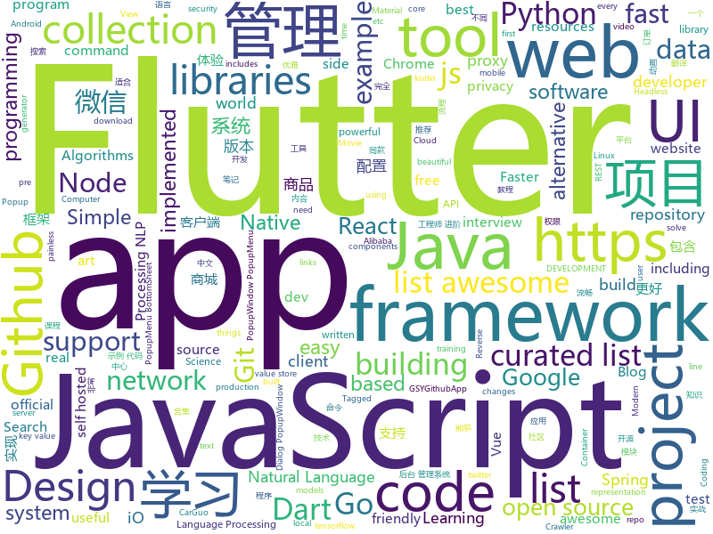

# 2018-12-24
See what the GitHub community is most excited about today.

## python
* [awesome-python-applications](https://github.com/mahmoud/awesome-python-applications)(**277 stars today**): 💿Free software that works great, and also happens to be open-source Python.
* [tools](https://github.com/ghost123gg/tools)(**174 stars today**): A Python Crawler Framework
* [HelloGitHub](https://github.com/521xueweihan/HelloGitHub)(**137 stars today**): GitHub 上好玩、容易上手的项目，帮你找到编程的乐趣。欢迎推荐、自荐项目，让更多人知道你的项目⭐️
* [nevergrad](https://github.com/facebookresearch/nevergrad)(**119 stars today**): A Python toolbox for performing gradient-free optimization
* [torchdiffeq](https://github.com/rtqichen/torchdiffeq)(**58 stars today**): Differentiable ODE solvers with full GPU support and O(1)-memory backpropagation.
* [bert](https://github.com/google-research/bert)(**48 stars today**): TensorFlow code and pre-trained models for BERT
* [pytext](https://github.com/facebookresearch/pytext)(**49 stars today**): A natural language modeling framework based on PyTorch
* [flair](https://github.com/zalandoresearch/flair)(**42 stars today**): A very simple framework for state-of-the-art Natural Language Processing (NLP)
* [youtube-dl](https://github.com/rg3/youtube-dl)(**37 stars today**): Command-line program to download videos from YouTube.com and other video sites
* [privacy](https://github.com/tensorflow/privacy)(**40 stars today**): Library for training machine learning models with privacy for training data
* [models](https://github.com/tensorflow/models)(**31 stars today**): Models and examples built with TensorFlow
* [wenzheng](https://github.com/chenghuige/wenzheng)(**29 stars today**): ai challenger 2018细粒度情感分类第一名解决方案,统一使用tensorflow和pytorch的一个框架
* [awesome-python](https://github.com/vinta/awesome-python)(**31 stars today**): A curated list of awesome Python frameworks, libraries, software and resources
* [httpie](https://github.com/jakubroztocil/httpie)(**30 stars today**): As easy as httpie /aitch-tee-tee-pie/ 🥧 Modern command line HTTP client – user-friendly curl alternative with intuitive UI, JSON support, syntax highlighting, wget-like downloads, extensions, etc. https://twitter.com/clihttp
* [system-design-primer](https://github.com/donnemartin/system-design-primer)(**26 stars today**): Learn how to design large-scale systems. Prep for the system design interview. Includes Anki flashcards.
* [reddit_utils](https://github.com/roman-ku/reddit_utils)(**26 stars today**): A collection of reddit utility scripts organized as a web app — includes the ability to search through your saved posts
* [keras](https://github.com/keras-team/keras)(**22 stars today**): Deep Learning for humans
* [faceswap](https://github.com/deepfakes/faceswap)(**24 stars today**): Non official project based on original /r/Deepfakes thread. Many thanks to him!
* [wikipedia2vec](https://github.com/wikipedia2vec/wikipedia2vec)(**25 stars today**): A tool for learning vector representations of words and entities from Wikipedia
* [cpython](https://github.com/python/cpython)(**20 stars today**): The Python programming language
* [XX-Net](https://github.com/XX-net/XX-Net)(**21 stars today**): a web proxy tool
* [Python](https://github.com/TheAlgorithms/Python)(**22 stars today**): All Algorithms implemented in Python
* [face_recognition](https://github.com/ageitgey/face_recognition)(**21 stars today**): The world's simplest facial recognition api for Python and the command line
* [public-apis](https://github.com/toddmotto/public-apis)(**21 stars today**): A collective list of free APIs for use in software and web development.
* [home-assistant](https://github.com/home-assistant/home-assistant)(**16 stars today**): 🏡Open source home automation that puts local control and privacy first

## java
* [advanced-java](https://github.com/doocs/advanced-java)(**192 stars today**): 😮互联网 Java 工程师进阶知识完全扫盲
* [mall](https://github.com/macrozheng/mall)(**102 stars today**): mall项目是一套电商系统，包括前台商城系统及后台管理系统，基于SpringBoot+MyBatis实现。 前台商城系统包含首页门户、商品推荐、商品搜索、商品展示、购物车、订单流程、会员中心、客户服务、帮助中心等模块。 后台管理系统包含商品管理、订单管理、会员管理、促销管理、运营管理、内容管理、统计报表、财务管理、权限管理、设置等模块。
* [website](https://github.com/risk-first/website)(**65 stars today**): Risk-First Analysis Framework
* [JavaGuide](https://github.com/Snailclimb/JavaGuide)(**38 stars today**): 【Java学习+面试指南】 一份涵盖大部分Java程序员所需要掌握的核心知识。
* [jerryWebSpider](https://github.com/jrhu05/jerryWebSpider)(**38 stars today**): web爬虫合集
* [java-design-patterns](https://github.com/iluwatar/java-design-patterns)(**30 stars today**): Design patterns implemented in Java
* [miaosha](https://github.com/qiurunze123/miaosha)(**34 stars today**): 😮😮秒杀系统设计与实现.互联网工程师进阶与分析🙋🐓
* [spring-boot](https://github.com/spring-projects/spring-boot)(**25 stars today**): Spring Boot
* [elasticsearch](https://github.com/elastic/elasticsearch)(**23 stars today**): Open Source, Distributed, RESTful Search Engine
* [XPopup](https://github.com/li-xiaojun/XPopup)(**24 stars today**): 🔥功能强大，UI简洁，交互优雅的通用弹窗！可以替代Dialog，PopupWindow，PopupMenu，BottomSheet，DrawerLayout等组件，自带十几种效果良好的动画， 支持完全的UI和动画自定义！(Powerful and Beautiful Popup，can absolutely replace Dialog，PopupWindow，PopupMenu，BottomSheet，DrawerLayout. With built-in animators , very easy to custom Popup View.)
* [Java](https://github.com/TheAlgorithms/Java)(**22 stars today**): All Algorithms implemented in Java
* [easyexcel](https://github.com/alibaba/easyexcel)(**21 stars today**): 快速、简单避免OOM的java处理Excel工具
* [symphony](https://github.com/b3log/symphony)(**20 stars today**): 🎶一款用 Java 实现的现代化社区（论坛/BBS/社交网络/博客）平台。https://hacpai.com
* [tutorials](https://github.com/eugenp/tutorials)(**12 stars today**): The "REST With Spring" Course:
* [WxJava](https://github.com/Wechat-Group/WxJava)(**17 stars today**): WxJava （微信Java SDK），支持包括微信支付、开放平台、小程序、企业微信/企业号和公众号等的后端开发
* [arthas](https://github.com/alibaba/arthas)(**16 stars today**): Alibaba Java Diagnostic Tool Arthas/Alibaba Java诊断利器Arthas
* [guava](https://github.com/google/guava)(**14 stars today**): Google core libraries for Java
* [spring-framework](https://github.com/spring-projects/spring-framework)(**13 stars today**): Spring Framework
* [litemall](https://github.com/linlinjava/litemall)(**14 stars today**): 又一个小商城。litemall = Spring Boot后端 + Vue管理员前端 + 微信小程序用户前端
* [flink](https://github.com/apache/flink)(**11 stars today**): Apache Flink
* [apollo](https://github.com/ctripcorp/apollo)(**12 stars today**): Apollo（阿波罗）是携程框架部门研发的分布式配置中心，能够集中化管理应用不同环境、不同集群的配置，配置修改后能够实时推送到应用端，并且具备规范的权限、流程治理等特性，适用于微服务配置管理场景。
* [SpringCloudLearning](https://github.com/forezp/SpringCloudLearning)(**10 stars today**): 《史上最简单的Spring Cloud教程源码》
* [netty](https://github.com/netty/netty)(**10 stars today**): Netty project - an event-driven asynchronous network application framework
* [graal](https://github.com/oracle/graal)(**12 stars today**): GraalVM: Run Programs Faster Anywhere🚀
* [JAViewer](https://github.com/SplashCodes/JAViewer)(**11 stars today**): 更优雅的驾车体验

## unknown
* [ds-cheatsheets](https://github.com/FavioVazquez/ds-cheatsheets)(**868 stars today**): List of Data Science Cheatsheets to rule the world
* [the-book-of-secret-knowledge](https://github.com/trimstray/the-book-of-secret-knowledge)(**316 stars today**): 💫A collection of awesome lists, manuals, blogs, hacks, one-liners, cli/web tools and more. Especially for System and Network Administrators, DevOps, Pentesters or Security Researchers.
* [FAQGURU](https://github.com/FAQGURU/FAQGURU)(**94 stars today**): 🎒🚀🎉A list of interview questions. This repository is everything you need to prepare for your technical interview.
* [CS-Notes](https://github.com/CyC2018/CS-Notes)(**31 stars today**): 📚Computer Science Learning Notes
* [gitignore](https://github.com/github/gitignore)(**27 stars today**): A collection of useful .gitignore templates
* [You-Dont-Know-JS](https://github.com/getify/You-Dont-Know-JS)(**30 stars today**): A book series on JavaScript. @YDKJS on twitter.
* [awesome](https://github.com/sindresorhus/awesome)(**32 stars today**): 😎Curated list of awesome lists
* [Chinese-Podcasts](https://github.com/alaskasquirrel/Chinese-Podcasts)(**32 stars today**): 中文播客：Tech, VC, Life, Movie, Design...
* [free-programming-books](https://github.com/EbookFoundation/free-programming-books)(**27 stars today**): 📚Freely available programming books
* [coding-interview-university](https://github.com/jwasham/coding-interview-university)(**26 stars today**): A complete computer science study plan to become a software engineer.
* [hosts](https://github.com/googlehosts/hosts)(**26 stars today**): 镜像：https://coding.net/u/scaffrey/p/hosts/git
* [Introspected-REST](https://github.com/vasilakisfil/Introspected-REST)(**27 stars today**): An alternative to REST and GraphQL
* [project-based-learning](https://github.com/tuvtran/project-based-learning)(**24 stars today**): Curated list of project-based tutorials
* [trackerslist](https://github.com/ngosang/trackerslist)(**23 stars today**): An updated list of public BitTorrent trackers
* [paper-gestalt](https://github.com/vt-vl-lab/paper-gestalt)(**20 stars today**): Deep Paper Gestalt
* [awesome-vue](https://github.com/vuejs/awesome-vue)(**18 stars today**): 🎉A curated list of awesome things related to Vue.js
* [DarthSidious-Chinese](https://github.com/crazywa1ker/DarthSidious-Chinese)(**15 stars today**): DarthSidious 中文版
* [chromium](https://github.com/chromium/chromium)(**14 stars today**): The official GitHub mirror of the Chromium source
* [awesome-nlp](https://github.com/keon/awesome-nlp)(**14 stars today**): 📖A curated list of resources dedicated to Natural Language Processing (NLP)
* [awesome-for-beginners](https://github.com/MunGell/awesome-for-beginners)(**12 stars today**): A list of awesome beginners-friendly projects.
* [awesome-cpp](https://github.com/fffaraz/awesome-cpp)(**12 stars today**): A curated list of awesome C++ (or C) frameworks, libraries, resources, and shiny things. Inspired by awesome-... stuff.
* [front-end-summary](https://github.com/fairyly/front-end-summary)(**11 stars today**): summary
* [gold-miner](https://github.com/xitu/gold-miner)(**11 stars today**): 🥇掘金翻译计划，可能是世界最大最好的英译中技术社区，最懂读者和译者的翻译平台：
* [IntelliJ-IDEA-Tutorial](https://github.com/judasn/IntelliJ-IDEA-Tutorial)(**10 stars today**): IntelliJ IDEA 简体中文专题教程
* [Projects](https://github.com/karan/Projects)(**11 stars today**): 📃A list of practical projects that anyone can solve in any programming language.

## javascript
* [swc](https://github.com/swc-project/swc)(**657 stars today**): Super-fast alternative for babel
* [Boostnote](https://github.com/BoostIO/Boostnote)(**191 stars today**): A markdown editor for developers on Mac, Windows and Linux.
* [nodebestpractices](https://github.com/i0natan/nodebestpractices)(**147 stars today**): The largest Node.JS best practices list (November 2018)
* [react-developer-roadmap](https://github.com/adam-golab/react-developer-roadmap)(**146 stars today**): Roadmap to becoming a React developer in 2018
* [Librefox](https://github.com/intika/Librefox)(**135 stars today**): Librefox, patches for mainstream Firefox for an enforced privacy and security
* [33-js-concepts](https://github.com/leonardomso/33-js-concepts)(**93 stars today**): 📜33 concepts every JavaScript developer should know.
* [react](https://github.com/facebook/react)(**67 stars today**): A declarative, efficient, and flexible JavaScript library for building user interfaces.
* [vue](https://github.com/vuejs/vue)(**66 stars today**): 🖖Vue.js is a progressive, incrementally-adoptable JavaScript framework for building UI on the web.
* [chat-wall-node](https://github.com/leesipeng/chat-wall-node)(**69 stars today**): 微信上墙 年会抽奖/签到/弹幕 服务端+pc
* [htm](https://github.com/developit/htm)(**55 stars today**): Hyperscript Tagged Markup: JSX alternative using standard tagged templates, with compiler support.
* [taiko-web](https://github.com/bui/taiko-web)(**50 stars today**): Taiko no Tatsujin simulator
* [brain.js](https://github.com/BrainJS/brain.js)(**49 stars today**): 🤖Neural networks in JavaScript
* [javascript-algorithms](https://github.com/trekhleb/javascript-algorithms)(**40 stars today**): 📝Algorithms and data structures implemented in JavaScript with explanations and links to further readings
* [webtorrent](https://github.com/webtorrent/webtorrent)(**41 stars today**): ⚡️Streaming torrent client for the web
* [strapi](https://github.com/strapi/strapi)(**40 stars today**): 🚀Open source Node.js Headless CMS to easily build customisable APIs
* [react-native](https://github.com/facebook/react-native)(**39 stars today**): A framework for building native apps with React.
* [Picas](https://github.com/djyde/Picas)(**39 stars today**): Generate Project Logo with Google Fonts
* [30-seconds-of-code](https://github.com/30-seconds/30-seconds-of-code)(**34 stars today**): Curated collection of useful JavaScript snippets that you can understand in 30 seconds or less.
* [fre](https://github.com/132yse/fre)(**38 stars today**): 🐱Fast 1kb JavaScript library reactive and no combile.
* [quicklink](https://github.com/GoogleChromeLabs/quicklink)(**36 stars today**): ⚡️Faster subsequent page-loads by prefetching in-viewport links during idle time
* [material-ui](https://github.com/mui-org/material-ui)(**28 stars today**): React components that implement Google's Material Design.
* [next.js](https://github.com/zeit/next.js)(**29 stars today**): The React Framework
* [js-types](https://github.com/sindresorhus/js-types)(**31 stars today**): List of JavaScript types
* [free-programming-books-zh_CN](https://github.com/justjavac/free-programming-books-zh_CN)(**27 stars today**): 📚免费的计算机编程类中文书籍，欢迎投稿
* [node](https://github.com/nodejs/node)(**29 stars today**): Node.js JavaScript runtime✨🐢🚀✨

## html
* [codelf](https://github.com/unbug/codelf)(**109 stars today**): Best GitHub stars, repositories tagger and organizer. Search over projects from Github, Bitbucket, Google Code, Codeplex, Sourceforge, Fedora Project, GitLab to find real-world usage variable names
* [next-boilerplate](https://github.com/pankod/next-boilerplate)(**18 stars today**): A well-structured production ready Next.js boilerplate with Typescript, Redux, Express.js, Sass, Css, EnvConfig, Reverse Proxy, Bundle Analyzer.
* [flutter-in-action](https://github.com/flutterchina/flutter-in-action)(**16 stars today**): 《Flutter实战》电子书
* [Coursera-ML-AndrewNg-Notes](https://github.com/fengdu78/Coursera-ML-AndrewNg-Notes)(**12 stars today**): 吴恩达老师的机器学习课程个人笔记
* [frontend-tech-list](https://github.com/alienzhou/frontend-tech-list)(**15 stars today**): a frontend tech list for developers
* [deeplearning_ai_books](https://github.com/fengdu78/deeplearning_ai_books)(**10 stars today**): deeplearning.ai（吴恩达老师的深度学习课程笔记及资源）
* [NLP-progress](https://github.com/sebastianruder/NLP-progress)(**11 stars today**): Repository to track the progress in Natural Language Processing (NLP), including the datasets and the current state-of-the-art for the most common NLP tasks.
* [2life](https://github.com/oh-bear/2life)(**11 stars today**): 💌双生：遇见另一半的美好：）（React Native）
* [fastText](https://github.com/facebookresearch/fastText)(**10 stars today**): Library for fast text representation and classification.
* [try_git](https://github.com/windyzj/try_git)(****): 
* [nginxconfig.io](https://github.com/valentinxxx/nginxconfig.io)(**8 stars today**): ⚙️NGiИX config generator generator on steroids💉
* [styleguide](https://github.com/google/styleguide)(**7 stars today**): Style guides for Google-originated open-source projects
* [Spoon-Knife](https://github.com/octocat/Spoon-Knife)(****): This repo is for demonstration purposes only.
* [awesome-creative-coding](https://github.com/terkelg/awesome-creative-coding)(**7 stars today**): 🎨Creative Coding: Generative Art, Data visualization, Interaction Design, Resources.
* [portainer](https://github.com/portainer/portainer)(**6 stars today**): Simple management UI for Docker
* [linux-command](https://github.com/jaywcjlove/linux-command)(**5 stars today**): Linux命令大全搜索工具，内容包含Linux命令手册、详解、学习、搜集。https://git.io/linux
* [javascript-tutorial-en](https://github.com/iliakan/javascript-tutorial-en)(**5 stars today**): Modern JavaScript Tutorial
* [Iosevka](https://github.com/be5invis/Iosevka)(**5 stars today**): Slender typeface for code, from code.
* [proposal-pipeline-operator](https://github.com/tc39/proposal-pipeline-operator)(**5 stars today**): A proposal for adding the simple-but-useful pipeline operator to JavaScript.
* [speedtest](https://github.com/adolfintel/speedtest)(**5 stars today**): Self-hosted HTML5 Speedtest. Easy setup, examples, configurable, responsive and mobile friendly. Supports PHP, Node, and more.
* [patchwork](https://github.com/jlord/patchwork)(****): All the Git-it Workshop completers!
* [mzlogin.github.io](https://github.com/mzlogin/mzlogin.github.io)(****): 🙊My Blog / Jekyll Themes
* [website](https://github.com/kubernetes/website)(****): Kubernetes website and documentation repo:
* [website-copy](https://github.com/exercism/website-copy)(****): A repository for exercism's website's copy
* [startbootstrap-clean-blog-jekyll](https://github.com/BlackrockDigital/startbootstrap-clean-blog-jekyll)(****): A Jekyll version of the Clean Blog theme by Start Bootstrap

## dart
* [flutter](https://github.com/flutter/flutter)(**83 stars today**): Flutter makes it easy and fast to build beautiful mobile apps.
* [awesome-flutter](https://github.com/Solido/awesome-flutter)(**51 stars today**): An awesome list that curates the best Flutter libraries, tools, tutorials, articles and more.
* [flutter_ui_shopping](https://github.com/nb312/flutter_ui_shopping)(**29 stars today**): This is an app about UI.
* [flutter_catalog](https://github.com/X-Wei/flutter_catalog)(**33 stars today**): An app showcasing Flutter components, with side-by-side source code view.
* [flutter_fitness_tracker_app_UI](https://github.com/serdarpolat/flutter_fitness_tracker_app_UI)(**12 stars today**): 
* [GSYGithubAppFlutter](https://github.com/CarGuo/GSYGithubAppFlutter)(**11 stars today**): 超完整的Flutter项目，功能丰富，适合学习和日常使用。GSYGithubApp系列的优势：我们目前已经拥有Flutter、Weex、ReactNative、kotlin 四个版本。 功能齐全，项目框架内技术涉及面广，完成度高，持续维护，配套文章，适合全面学习，对比参考。跨平台的开源Github客户端App，更好的体验，更丰富的功能，旨在更好的日常管理和维护个人Github，提供更好更方便的驾车体验Σ(￣。￣ﾉ)ﾉ。同款Weex版本 ： https://github.com/CarGuo/GSYGithubAppWeex 、同款React Native版本 ： https://github.com/CarGuo/GSYGithubApp 、原生 kotlin 版本 https://g…
* [plugins](https://github.com/flutter/plugins)(**10 stars today**): Plugins for Flutter, including FlutterFire, maintained by the Flutter team
* [samples](https://github.com/flutter/samples)(**7 stars today**): A collection of Flutter examples and demos.
* [flutter_architecture_samples](https://github.com/brianegan/flutter_architecture_samples)(**8 stars today**): TodoMVC for Flutter
* [sdk](https://github.com/dart-lang/sdk)(**7 stars today**): The Dart SDK, including the VM, dart2js, core libraries, and more.
* [dio](https://github.com/flutterchina/dio)(**7 stars today**): A powerful Http client for Dart, which supports Interceptors, FormData, Request Cancellation, File Downloading, Timeout etc.
* [hydrated](https://github.com/lukepighetti/hydrated)(**7 stars today**): 🚰A BehaviorSubject for Flutter with auto-persist and async hydrate
* [Flutter-Notebook](https://github.com/OpenFlutter/Flutter-Notebook)(**6 stars today**): 日更的FlutterDemo合集，今天你fu了吗
* [kamino](https://github.com/ApolloTVofficial/kamino)(****): The official Kamino (iOS and Android app) repository for ApolloTV.
* [IntroViews-Flutter](https://github.com/aagarwal1012/IntroViews-Flutter)(****): ☀️A Flutter package for some material design app intro screens with some cool animations.
* [flutter_tts](https://github.com/dlutton/flutter_tts)(****): Flutter Text to Speech package
* [chromedeveditor](https://github.com/googlearchive/chromedeveditor)(****): Chrome Dev Editor is a developer tool for building apps on the Chrome platform - Chrome Apps and Web Apps, in JavaScript or Dart. (NO LONGER IN ACTIVE DEVELOPMENT)
* [FlutterExampleApps](https://github.com/iampawan/FlutterExampleApps)(****): [Example APPS] Basic Flutter apps, for flutter devs.
* [flutter-examples](https://github.com/nisrulz/flutter-examples)(****): [Examples] Simple basic isolated apps, for budding flutter devs.
* [Flutter-UI-Kit](https://github.com/iampawan/Flutter-UI-Kit)(****): Flutter app for collection of UI in a UIKit
* [Flutter-learning](https://github.com/AweiLoveAndroid/Flutter-learning)(****): 🔥👍🌟⭐️⭐️⭐️Flutter安装和配置，Flutter开发遇到的难题，Flutter示例代码和模板，Flutter项目实战，Dart语言学习示例代码。
* [inKino](https://github.com/roughike/inKino)(****): A multiplatform Dart movie app with 40% of code sharing between Flutter and the Web.
* [flutter-osc](https://github.com/yubo725/flutter-osc)(****): 基于Google Flutter的开源中国客户端，支持Android和iOS。
* [zhihu-flutter](https://github.com/HackSoul/zhihu-flutter)(****): Flutter 高仿知乎 UI，非常漂亮，也非常流畅，flutter build apk 或 flutter build ios 之后更流畅
* [hauberk](https://github.com/munificent/hauberk)(****): A web-based roguelike written in Dart.

## go
* [netcap](https://github.com/dreadl0ck/netcap)(**269 stars today**): A framework for secure and scalable network traffic analysis
* [redix](https://github.com/alash3al/redix)(**164 stars today**): a persistent real-time key-value store, with the same redis protocol with powerful features
* [tldr](https://github.com/isacikgoz/tldr)(**50 stars today**): fast and interactive tldr client written with go
* [greact](https://github.com/gernest/greact)(**40 stars today**): like preact, but for go with wasm
* [go](https://github.com/golang/go)(**32 stars today**): The Go programming language
* [loki](https://github.com/grafana/loki)(**30 stars today**): Like Prometheus, but for logs.
* [kubernetes](https://github.com/kubernetes/kubernetes)(**26 stars today**): Production-Grade Container Scheduling and Management
* [awesome-go](https://github.com/avelino/awesome-go)(**26 stars today**): A curated list of awesome Go frameworks, libraries and software
* [goldpinger](https://github.com/bloomberg/goldpinger)(**28 stars today**): Debugging tool for Kubernetes which tests and displays connectivity between nodes in the cluster.
* [gogs](https://github.com/gogs/gogs)(**27 stars today**): Gogs is a painless self-hosted Git service.
* [rendora](https://github.com/rendora/rendora)(**27 stars today**): dynamic server-side rendering using headless Chrome to effortlessly solve the SEO problem for modern javascript websites
* [dnsproxy](https://github.com/AdguardTeam/dnsproxy)(**23 stars today**): Simple DNS proxy with DoH, DoT, and DNSCrypt support
* [kubectl-debug](https://github.com/aylei/kubectl-debug)(**23 stars today**): Debug your pod by a new container with every troubleshooting tools pre-installed
* [BaiduPCS-Go](https://github.com/iikira/BaiduPCS-Go)(**22 stars today**): 百度网盘客户端 - Go语言编写
* [gitea](https://github.com/go-gitea/gitea)(**20 stars today**): Git with a cup of tea, painless self-hosted git service
* [hugo](https://github.com/gohugoio/hugo)(**20 stars today**): The world’s fastest framework for building websites.
* [traefik](https://github.com/containous/traefik)(**19 stars today**): The Cloud Native Edge Router
* [frp](https://github.com/fatedier/frp)(**19 stars today**): A fast reverse proxy to help you expose a local server behind a NAT or firewall to the internet.
* [certmagic](https://github.com/mholt/certmagic)(**17 stars today**): Automatic HTTPS for any Go program: fully-managed TLS certificate issuance and renewal
* [gin](https://github.com/gin-gonic/gin)(**18 stars today**): Gin is a HTTP web framework written in Go (Golang). It features a Martini-like API with much better performance -- up to 40 times faster. If you need smashing performance, get yourself some Gin.
* [v2ray-core](https://github.com/v2ray/v2ray-core)(**14 stars today**): A platform for building proxies to bypass network restrictions.
* [gotty](https://github.com/yudai/gotty)(**17 stars today**): Share your terminal as a web application
* [colly](https://github.com/gocolly/colly)(**17 stars today**): Elegant Scraper and Crawler Framework for Golang
* [etcd](https://github.com/etcd-io/etcd)(**16 stars today**): Distributed reliable key-value store for the most critical data of a distributed system
* [goreplay](https://github.com/buger/goreplay)(**15 stars today**): GoReplay is an open-source tool for capturing and replaying live HTTP traffic into a test environment in order to continuously test your system with real data. It can be used to increase confidence in code deployments, configuration changes and infrastructure changes.

## WordCloud

