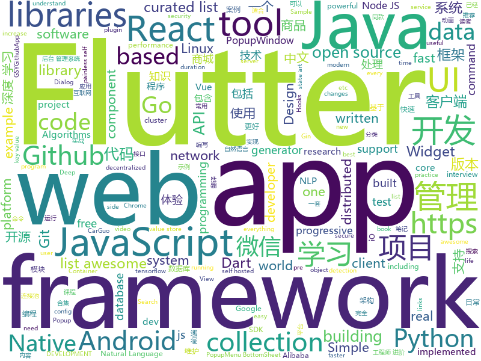

# 2018-12-25
See what the GitHub community is most excited about today.

## python
* [awesome-python-applications](https://github.com/mahmoud/awesome-python-applications)(**382 stars today**): 💿Free software that works great, and also happens to be open-source Python.
* [HelloGitHub](https://github.com/521xueweihan/HelloGitHub)(**230 stars today**): GitHub 上好玩、容易上手的项目，帮你找到编程的乐趣。欢迎推荐、自荐项目，让更多人知道你的项目⭐️
* [nevergrad](https://github.com/facebookresearch/nevergrad)(**103 stars today**): A Python toolbox for performing gradient-free optimization
* [tools](https://github.com/ghost123gg/tools)(**106 stars today**): A Python Crawler Framework
* [pytext](https://github.com/facebookresearch/pytext)(**89 stars today**): A natural language modeling framework based on PyTorch
* [models](https://github.com/tensorflow/models)(**64 stars today**): Models and examples built with TensorFlow
* [torchdiffeq](https://github.com/rtqichen/torchdiffeq)(**71 stars today**): Differentiable ODE solvers with full GPU support and O(1)-memory backpropagation.
* [bert](https://github.com/google-research/bert)(**59 stars today**): TensorFlow code and pre-trained models for BERT
* [walle-web](https://github.com/meolu/walle-web)(**63 stars today**): walle - 瓦力 开源项目代码部署平台
* [keras](https://github.com/keras-team/keras)(**52 stars today**): Deep Learning for humans
* [system-design-primer](https://github.com/donnemartin/system-design-primer)(**55 stars today**): Learn how to design large-scale systems. Prep for the system design interview. Includes Anki flashcards.
* [flair](https://github.com/zalandoresearch/flair)(**53 stars today**): A very simple framework for state-of-the-art Natural Language Processing (NLP)
* [wenzheng](https://github.com/chenghuige/wenzheng)(**44 stars today**): ai challenger 2018细粒度情感分类第一名解决方案,统一使用tensorflow和pytorch的一个框架
* [XSStrike](https://github.com/s0md3v/XSStrike)(**37 stars today**): Most advanced XSS detection suite.
* [Python](https://github.com/TheAlgorithms/Python)(**37 stars today**): All Algorithms implemented in Python
* [awesome-python](https://github.com/vinta/awesome-python)(**38 stars today**): A curated list of awesome Python frameworks, libraries, software and resources
* [bocadillo](https://github.com/bocadilloproject/bocadillo)(**35 stars today**): 🥙A modern Python web framework filled with asynchronous salsa
* [face_recognition](https://github.com/ageitgey/face_recognition)(**30 stars today**): The world's simplest facial recognition api for Python and the command line
* [imagepy](https://github.com/Image-Py/imagepy)(**31 stars today**): Image process framework based on plugin like imagej, it is esay to glue with scipy.ndimage, scikit-image, opencv, simpleitk, mayavi...and any libraries based on numpy
* [d2l-zh](https://github.com/diveintodeeplearning/d2l-zh)(**27 stars today**): 《动手学深度学习》，英文版即伯克利深度学习（STAT 157，2019春）教材。面向中文读者、能运行、可讨论。
* [Detectron](https://github.com/facebookresearch/Detectron)(**27 stars today**): FAIR's research platform for object detection research, implementing popular algorithms like Mask R-CNN and RetinaNet.
* [youtube-dl](https://github.com/rg3/youtube-dl)(**26 stars today**): Command-line program to download videos from YouTube.com and other video sites
* [AiLearning](https://github.com/apachecn/AiLearning)(**25 stars today**): AiLearning: 机器学习 - MachineLearning - ML、深度学习 - DeepLearning - DL、自然语言处理 NLP
* [public-apis](https://github.com/toddmotto/public-apis)(**28 stars today**): A collective list of free APIs for use in software and web development.
* [crossCobra](https://github.com/morten1982/crossCobra)(**28 stars today**): Python IDE using PyQt5

## java
* [advanced-java](https://github.com/doocs/advanced-java)(**454 stars today**): 😮互联网 Java 工程师进阶知识完全扫盲
* [mall](https://github.com/macrozheng/mall)(**199 stars today**): mall项目是一套电商系统，包括前台商城系统及后台管理系统，基于SpringBoot+MyBatis实现。 前台商城系统包含首页门户、商品推荐、商品搜索、商品展示、购物车、订单流程、会员中心、客户服务、帮助中心等模块。 后台管理系统包含商品管理、订单管理、会员管理、促销管理、运营管理、内容管理、统计报表、财务管理、权限管理、设置等模块。
* [BasePopup](https://github.com/razerdp/BasePopup)(**188 stars today**): 亲，还在为PopupWindow烦恼吗？不如试试BasePopup，你会爱上他的~
* [JavaGuide](https://github.com/Snailclimb/JavaGuide)(**119 stars today**): 【Java学习+面试指南】 一份涵盖大部分Java程序员所需要掌握的核心知识。
* [XPopup](https://github.com/li-xiaojun/XPopup)(**75 stars today**): 🔥功能强大，UI简洁，交互优雅的通用弹窗！可以替代Dialog，PopupWindow，PopupMenu，BottomSheet，DrawerLayout等组件，自带十几种效果良好的动画， 支持完全的UI和动画自定义！(Powerful and Beautiful Popup，can absolutely replace Dialog，PopupWindow，PopupMenu，BottomSheet，DrawerLayout. With built-in animators , very easy to custom Popup View.)
* [miaosha](https://github.com/qiurunze123/miaosha)(**60 stars today**): 😮😮秒杀系统设计与实现.互联网工程师进阶与分析🙋🐓
* [arthas](https://github.com/alibaba/arthas)(**49 stars today**): Alibaba Java Diagnostic Tool Arthas/Alibaba Java诊断利器Arthas
* [spring-boot](https://github.com/spring-projects/spring-boot)(**41 stars today**): Spring Boot
* [WxJava](https://github.com/Wechat-Group/WxJava)(**44 stars today**): WxJava （微信开发 Java SDK），支持包括微信支付、开放平台、小程序、企业微信/企业号和公众号等的后端开发
* [MVVMHabit](https://github.com/goldze/MVVMHabit)(**45 stars today**): 👕基于谷歌最新AAC架构，MVVM设计模式的一套快速开发库，整合Okhttp+RxJava+Retrofit+Glide等主流模块，满足日常开发需求。使用该框架可以快速开发一个高质量、易维护的Android应用。
* [litemall](https://github.com/linlinjava/litemall)(**41 stars today**): 又一个小商城。litemall = Spring Boot后端 + Vue管理员前端 + 微信小程序用户前端
* [jerryWebSpider](https://github.com/jrhu05/jerryWebSpider)(**42 stars today**): web爬虫合集
* [easyexcel](https://github.com/alibaba/easyexcel)(**37 stars today**): 快速、简单避免OOM的java处理Excel工具
* [elasticsearch](https://github.com/elastic/elasticsearch)(**35 stars today**): Open Source, Distributed, RESTful Search Engine
* [HanLP](https://github.com/hankcs/HanLP)(**37 stars today**): 自然语言处理 中文分词 词性标注 命名实体识别 依存句法分析 新词发现 关键词短语提取 自动摘要 文本分类聚类 拼音简繁
* [x7](https://github.com/x-ream/x7)(**40 stars today**): 
* [tutorials](https://github.com/eugenp/tutorials)(**24 stars today**): The "REST With Spring" Course:
* [APIJSON](https://github.com/TommyLemon/APIJSON)(**33 stars today**): 🚀后端接口和文档自动化，前端(客户端) 定制返回JSON的数据和结构！
* [incubator-dubbo](https://github.com/apache/incubator-dubbo)(**25 stars today**): Apache Dubbo (incubating) is a high-performance, java based, open source RPC framework.
* [brpc-java](https://github.com/baidu/brpc-java)(**29 stars today**): Java implementation for Baidu RPC
* [spring-framework](https://github.com/spring-projects/spring-framework)(**23 stars today**): Spring Framework
* [QMUI_Android](https://github.com/Tencent/QMUI_Android)(**26 stars today**): 提高 Android UI 开发效率的 UI 库
* [java-design-patterns](https://github.com/iluwatar/java-design-patterns)(**26 stars today**): Design patterns implemented in Java
* [druid](https://github.com/alibaba/druid)(**28 stars today**): 阿里巴巴数据库事业部出品，为监控而生的数据库连接池。阿里云Data Lake Analytics(https://www.aliyun.com/product/datalakeanalytics )、DRDS、TDDL 连接池powered by Druid
* [guava](https://github.com/google/guava)(**24 stars today**): Google core libraries for Java

## unknown
* [ds-cheatsheets](https://github.com/FavioVazquez/ds-cheatsheets)(**529 stars today**): List of Data Science Cheatsheets to rule the world
* [the-book-of-secret-knowledge](https://github.com/trimstray/the-book-of-secret-knowledge)(**380 stars today**): 💫A collection of awesome lists, manuals, blogs, hacks, one-liners, cli/web tools and more. Especially for System and Network Administrators, DevOps, Pentesters or Security Researchers.
* [CS-Notes](https://github.com/CyC2018/CS-Notes)(**116 stars today**): 📚Computer Science Learning Notes
* [FAQGURU](https://github.com/FAQGURU/FAQGURU)(**83 stars today**): 🎒🚀🎉A list of interview questions. This repository is everything you need to prepare for your technical interview.
* [Chinese-Podcasts](https://github.com/alaskasquirrel/Chinese-Podcasts)(**61 stars today**): 中文播客：Tech, VC, Life, Movie, Design...
* [gitignore](https://github.com/github/gitignore)(**49 stars today**): A collection of useful .gitignore templates
* [You-Dont-Know-JS](https://github.com/getify/You-Dont-Know-JS)(**41 stars today**): A book series on JavaScript. @YDKJS on twitter.
* [DarthSidious-Chinese](https://github.com/crazywa1ker/DarthSidious-Chinese)(**42 stars today**): DarthSidious 中文版
* [technology-talk](https://github.com/aalansehaiyang/technology-talk)(**35 stars today**): 汇总java生态圈常用技术框架、开源中间件，系统架构、项目管理、经典架构案例、数据库、常用三方库、线上运维等知识
* [paper-gestalt](https://github.com/vt-vl-lab/paper-gestalt)(**37 stars today**): Deep Paper Gestalt
* [front-end-summary](https://github.com/fairyly/front-end-summary)(**33 stars today**): summary
* [awesome](https://github.com/sindresorhus/awesome)(**35 stars today**): 😎Curated list of awesome lists
* [project-based-learning](https://github.com/tuvtran/project-based-learning)(**28 stars today**): Curated list of project-based tutorials
* [free-programming-books](https://github.com/EbookFoundation/free-programming-books)(**29 stars today**): 📚Freely available programming books
* [hosts](https://github.com/googlehosts/hosts)(**22 stars today**): 镜像：https://coding.net/u/scaffrey/p/hosts/git
* [proposals](https://github.com/tc39/proposals)(**28 stars today**): Tracking ECMAScript Proposals
* [clusterdata](https://github.com/alibaba/clusterdata)(**25 stars today**): cluster data collected from production clusters in Alibaba for cluster management research
* [awesome-vue](https://github.com/vuejs/awesome-vue)(**24 stars today**): 🎉A curated list of awesome things related to Vue.js
* [3y](https://github.com/ZhongFuCheng3y/3y)(**21 stars today**): 3y文章导航
* [Reddit.NET](https://github.com/sirkris/Reddit.NET)(**21 stars today**): A Reddit API library for .NET Core with OAuth support. Written in C#.
* [android-architecture](https://github.com/googlesamples/android-architecture)(**19 stars today**): A collection of samples to discuss and showcase different architectural tools and patterns for Android apps.
* [trackerslist](https://github.com/ngosang/trackerslist)(**18 stars today**): An updated list of public BitTorrent trackers
* [gold-miner](https://github.com/xitu/gold-miner)(**18 stars today**): 🥇掘金翻译计划，可能是世界最大最好的英译中技术社区，最懂读者和译者的翻译平台：
* [flink-forward-china-2018](https://github.com/flink-china/flink-forward-china-2018)(**16 stars today**): Flink Forward China 2018 Slides
* [awesome-java](https://github.com/akullpp/awesome-java)(**18 stars today**): A curated list of awesome frameworks, libraries and software for the Java programming language.

## javascript
* [swc](https://github.com/swc-project/swc)(**742 stars today**): Super-fast alternative for babel
* [Magic-Grid](https://github.com/e-oj/Magic-Grid)(**416 stars today**): A simple, lightweight Javascript library for dynamic grid layouts.
* [orbit-db](https://github.com/orbitdb/orbit-db)(**398 stars today**): Peer-to-Peer Databases for the Decentralized Web
* [autoComplete.js](https://github.com/TarekRaafat/autoComplete.js)(**236 stars today**): Simple autocomplete pure vanilla Javascript library.
* [Boostnote](https://github.com/BoostIO/Boostnote)(**210 stars today**): A markdown editor for developers on Mac, Windows and Linux.
* [nodebestpractices](https://github.com/i0natan/nodebestpractices)(**183 stars today**): The largest Node.JS best practices list (November 2018)
* [Librefox](https://github.com/intika/Librefox)(**182 stars today**): Librefox, patching Firefox for an enforced privacy and security
* [react-developer-roadmap](https://github.com/adam-golab/react-developer-roadmap)(**160 stars today**): Roadmap to becoming a React developer in 2018
* [vue](https://github.com/vuejs/vue)(**91 stars today**): 🖖Vue.js is a progressive, incrementally-adoptable JavaScript framework for building UI on the web.
* [brain.js](https://github.com/BrainJS/brain.js)(**97 stars today**): 🤖Neural networks in JavaScript
* [33-js-concepts](https://github.com/leonardomso/33-js-concepts)(**84 stars today**): 📜33 concepts every JavaScript developer should know.
* [react](https://github.com/facebook/react)(**72 stars today**): A declarative, efficient, and flexible JavaScript library for building user interfaces.
* [gun](https://github.com/amark/gun)(**70 stars today**): A realtime, decentralized, offline-first, mutable graph database engine.
* [javascript-algorithms](https://github.com/trekhleb/javascript-algorithms)(**66 stars today**): 📝Algorithms and data structures implemented in JavaScript with explanations and links to further readings
* [free-programming-books-zh_CN](https://github.com/justjavac/free-programming-books-zh_CN)(**53 stars today**): 📚免费的计算机编程类中文书籍，欢迎投稿
* [30-seconds-of-code](https://github.com/30-seconds/30-seconds-of-code)(**53 stars today**): Curated collection of useful JavaScript snippets that you can understand in 30 seconds or less.
* [create-react-app](https://github.com/facebook/create-react-app)(**49 stars today**): Set up a modern web app by running one command.
* [next](https://github.com/alibaba-fusion/next)(**55 stars today**): A configurable component library for web built on React.
* [taro](https://github.com/NervJS/taro)(**50 stars today**): 多端统一开发框架，支持用 React 的开发方式编写一次代码，生成能运行在微信/百度/支付宝/字节跳动小程序、H5、React Native 等的应用。 https://taro.js.org/
* [strapi](https://github.com/strapi/strapi)(**50 stars today**): 🚀Open source Node.js Headless CMS to easily build customisable APIs
* [axios](https://github.com/axios/axios)(**45 stars today**): Promise based HTTP client for the browser and node.js
* [chat-wall-node](https://github.com/leesipeng/chat-wall-node)(**43 stars today**): 微信上墙 年会抽奖/签到/弹幕 服务端+pc
* [react-native](https://github.com/facebook/react-native)(**40 stars today**): A framework for building native apps with React.
* [quicklink](https://github.com/GoogleChromeLabs/quicklink)(**42 stars today**): ⚡️Faster subsequent page-loads by prefetching in-viewport links during idle time
* [taiko-web](https://github.com/bui/taiko-web)(**38 stars today**): Taiko no Tatsujin simulator

## html
* [codelf](https://github.com/unbug/codelf)(**213 stars today**): Best GitHub stars, repositories tagger and organizer. Search over projects from Github, Bitbucket, Google Code, Codeplex, Sourceforge, Fedora Project, GitLab to find real-world usage variable names
* [iA-Fonts](https://github.com/iaolo/iA-Fonts)(**43 stars today**): 
* [flutter-in-action](https://github.com/flutterchina/flutter-in-action)(**35 stars today**): 《Flutter实战》电子书
* [Coursera-ML-AndrewNg-Notes](https://github.com/fengdu78/Coursera-ML-AndrewNg-Notes)(**19 stars today**): 吴恩达老师的机器学习课程个人笔记
* [NLP-progress](https://github.com/sebastianruder/NLP-progress)(**17 stars today**): Repository to track the progress in Natural Language Processing (NLP), including the datasets and the current state-of-the-art for the most common NLP tasks.
* [deeplearning_ai_books](https://github.com/fengdu78/deeplearning_ai_books)(**16 stars today**): deeplearning.ai（吴恩达老师的深度学习课程笔记及资源）
* [2life](https://github.com/oh-bear/2life)(**17 stars today**): 💌双生：遇见另一半的美好：）（React Native）
* [styleguide](https://github.com/google/styleguide)(**17 stars today**): Style guides for Google-originated open-source projects
* [fastText](https://github.com/facebookresearch/fastText)(**17 stars today**): Library for fast text representation and classification.
* [LIVEBOX-0DAY](https://github.com/zadewg/LIVEBOX-0DAY)(**12 stars today**): Arcadyan ARV7519RW22-A-L T VR9 1.2 Multiple security vulnerabilities affecting latest firmware release on ORANGE Livebox modems.
* [nginxconfig.io](https://github.com/valentinxxx/nginxconfig.io)(**11 stars today**): ⚙️NGiИX config generator generator on steroids💉
* [openapi-generator](https://github.com/OpenAPITools/openapi-generator)(**9 stars today**): OpenAPI Generator allows generation of API client libraries (SDK generation), server stubs, documentation and configuration automatically given an OpenAPI Spec (v2, v3)
* [JavaScript30](https://github.com/wesbos/JavaScript30)(**6 stars today**): 30 Day Vanilla JS Challenge
* [ionic](https://github.com/ionic-team/ionic)(**6 stars today**): Build amazing native and progressive web apps with open web technologies. One app running on everything🎉
* [portainer](https://github.com/portainer/portainer)(**9 stars today**): Simple management UI for Docker
* [javascript-tutorial-en](https://github.com/iliakan/javascript-tutorial-en)(**8 stars today**): Modern JavaScript Tutorial
* [Spoon-Knife](https://github.com/octocat/Spoon-Knife)(****): This repo is for demonstration purposes only.
* [linux-command](https://github.com/jaywcjlove/linux-command)(**6 stars today**): Linux命令大全搜索工具，内容包含Linux命令手册、详解、学习、搜集。https://git.io/linux
* [coding-interview](https://github.com/doocs/coding-interview)(**6 stars today**): 😀代码面试题集，包括剑指 Offer、编程之美等。
* [flag-icon-css](https://github.com/lipis/flag-icon-css)(**6 stars today**): 🎏A collection of all country flags in SVG — plus the CSS for easier integration
* [react-app-rewired](https://github.com/timarney/react-app-rewired)(**6 stars today**): Override create-react-app webpack configs without ejecting
* [capacitor](https://github.com/ionic-team/capacitor)(**6 stars today**): Build cross-platform Native Progressive Web Apps for iOS, Android, and the web⚡️
* [patchwork](https://github.com/jlord/patchwork)(****): All the Git-it Workshop completers!
* [turndown](https://github.com/domchristie/turndown)(**5 stars today**): 🛏An HTML to Markdown converter written in JavaScript
* [ctf-wiki](https://github.com/ctf-wiki/ctf-wiki)(**5 stars today**): CTF Wiki Online

## dart
* [flutter](https://github.com/flutter/flutter)(**114 stars today**): Flutter makes it easy and fast to build beautiful mobile apps.
* [awesome-flutter](https://github.com/Solido/awesome-flutter)(**83 stars today**): An awesome list that curates the best Flutter libraries, tools, tutorials, articles and more.
* [FlutterExampleApps](https://github.com/iampawan/FlutterExampleApps)(**31 stars today**): [Example APPS] Basic Flutter apps, for flutter devs.
* [plugins](https://github.com/flutter/plugins)(**22 stars today**): Plugins for Flutter, including FlutterFire, maintained by the Flutter team
* [GSYGithubAppFlutter](https://github.com/CarGuo/GSYGithubAppFlutter)(**23 stars today**): 超完整的Flutter项目，功能丰富，适合学习和日常使用。GSYGithubApp系列的优势：我们目前已经拥有Flutter、Weex、ReactNative、kotlin 四个版本。 功能齐全，项目框架内技术涉及面广，完成度高，持续维护，配套文章，适合全面学习，对比参考。跨平台的开源Github客户端App，更好的体验，更丰富的功能，旨在更好的日常管理和维护个人Github，提供更好更方便的驾车体验Σ(￣。￣ﾉ)ﾉ。同款Weex版本 ： https://github.com/CarGuo/GSYGithubAppWeex 、同款React Native版本 ： https://github.com/CarGuo/GSYGithubApp 、原生 kotlin 版本 https://g…
* [flutter_architecture_samples](https://github.com/brianegan/flutter_architecture_samples)(**19 stars today**): TodoMVC for Flutter
* [flutter_catalog](https://github.com/X-Wei/flutter_catalog)(**18 stars today**): An app showcasing Flutter components, with side-by-side source code view.
* [Flutter-Notebook](https://github.com/OpenFlutter/Flutter-Notebook)(**16 stars today**): 日更的FlutterDemo合集，今天你fu了吗
* [flutter-ui-nice](https://github.com/nb312/flutter-ui-nice)(**12 stars today**): This is an app about UI.
* [flutter_hooks](https://github.com/rrousselGit/flutter_hooks)(**12 stars today**): A flutter implementation of React hooks. Hooks are a new kind of object that manages a Widget life-cycles. They exists for one reason: increase the code sharing between widgets and as a complete replacement for StatefulWidget.
* [ycflutter](https://github.com/yangchong211/ycflutter)(**10 stars today**): flutter学习案例，接口使用玩Android开放的api，作为新手入门训练代码案例，耗时大概4个月【业余时间】，已经完成了基本的功能。努力打造一个体验好的flutter版本的玩android客户端！
* [dio](https://github.com/flutterchina/dio)(**9 stars today**): A powerful Http client for Dart, which supports Interceptors, FormData, Request Cancellation, File Downloading, Timeout etc.
* [hydrated](https://github.com/lukepighetti/hydrated)(**9 stars today**): 🚰A BehaviorSubject for Flutter with auto-persist and async hydrate
* [samples](https://github.com/flutter/samples)(**8 stars today**): A collection of Flutter examples and demos.
* [wave](https://github.com/i-protoss/wave)(**8 stars today**): Widget for displaying waves with custom color, duration, floating and blur effects.
* [flutter-osc](https://github.com/yubo725/flutter-osc)(**6 stars today**): 基于Google Flutter的开源中国客户端，支持Android和iOS。
* [flutter_pulltorefresh](https://github.com/peng8350/flutter_pulltorefresh)(**5 stars today**): a widget provided to the flutter scroll component drop-down refresh and pull up load.
* [sdk](https://github.com/dart-lang/sdk)(**5 stars today**): The Dart SDK, including the VM, dart2js, core libraries, and more.
* [material-components-flutter-codelabs](https://github.com/material-components/material-components-flutter-codelabs)(****): Codelabs for Material Components for Flutter (MDC-Flutter)
* [flutter_duration_picker](https://github.com/cdharris/flutter_duration_picker)(****): A Flutter Widget for allowing a user to pick a duration (e.g. 5mins, 1h 30mins, etc)
* [dart-tutorials-samples](https://github.com/dart-lang/dart-tutorials-samples)(****): Sample code for "A Game of Darts" tutorial
* [chromedeveditor](https://github.com/googlearchive/chromedeveditor)(****): Chrome Dev Editor is a developer tool for building apps on the Chrome platform - Chrome Apps and Web Apps, in JavaScript or Dart. (NO LONGER IN ACTIVE DEVELOPMENT)
* [flutter-examples](https://github.com/nisrulz/flutter-examples)(****): [Examples] Simple basic isolated apps, for budding flutter devs.
* [Flutter-UI-Kit](https://github.com/iampawan/Flutter-UI-Kit)(****): Flutter app for collection of UI in a UIKit
* [Flutter-learning](https://github.com/AweiLoveAndroid/Flutter-learning)(****): 🔥👍🌟⭐️⭐️⭐️Flutter安装和配置，Flutter开发遇到的难题，Flutter示例代码和模板，Flutter项目实战，Dart语言学习示例代码。

## go
* [netcap](https://github.com/dreadl0ck/netcap)(**243 stars today**): A framework for secure and scalable network traffic analysis
* [redix](https://github.com/alash3al/redix)(**81 stars today**): a persistent real-time key-value store, with the same redis protocol with powerful features
* [tldr](https://github.com/isacikgoz/tldr)(**73 stars today**): fast and interactive tldr client written with go
* [kubectl-debug](https://github.com/aylei/kubectl-debug)(**63 stars today**): Debug your pod by a new container with every troubleshooting tools pre-installed
* [kubernetes](https://github.com/kubernetes/kubernetes)(**45 stars today**): Production-Grade Container Scheduling and Management
* [dive](https://github.com/wagoodman/dive)(**48 stars today**): A tool for exploring each layer in a docker image
* [loki](https://github.com/grafana/loki)(**45 stars today**): Like Prometheus, but for logs.
* [go](https://github.com/golang/go)(**45 stars today**): The Go programming language
* [goreplay](https://github.com/buger/goreplay)(**33 stars today**): GoReplay is an open-source tool for capturing and replaying live HTTP traffic into a test environment in order to continuously test your system with real data. It can be used to increase confidence in code deployments, configuration changes and infrastructure changes.
* [greact](https://github.com/gernest/greact)(**33 stars today**): like preact, but for go with wasm
* [frp](https://github.com/fatedier/frp)(**31 stars today**): A fast reverse proxy to help you expose a local server behind a NAT or firewall to the internet.
* [BaiduPCS-Go](https://github.com/iikira/BaiduPCS-Go)(**29 stars today**): 百度网盘客户端 - Go语言编写
* [goldpinger](https://github.com/bloomberg/goldpinger)(**31 stars today**): Debugging tool for Kubernetes which tests and displays connectivity between nodes in the cluster.
* [awesome-go](https://github.com/avelino/awesome-go)(**29 stars today**): A curated list of awesome Go frameworks, libraries and software
* [docker_practice](https://github.com/yeasy/docker_practice)(**27 stars today**): Learn and understand Docker technologies, with real DevOps practice!
* [etcd](https://github.com/etcd-io/etcd)(**25 stars today**): Distributed reliable key-value store for the most critical data of a distributed system
* [gotty](https://github.com/yudai/gotty)(**26 stars today**): Share your terminal as a web application
* [gogs](https://github.com/gogs/gogs)(**24 stars today**): Gogs is a painless self-hosted Git service.
* [hugo](https://github.com/gohugoio/hugo)(**26 stars today**): The world’s fastest framework for building websites.
* [istio](https://github.com/istio/istio)(**24 stars today**): Connect, secure, control, and observe services.
* [gin](https://github.com/gin-gonic/gin)(**24 stars today**): Gin is a HTTP web framework written in Go (Golang). It features a Martini-like API with much better performance -- up to 40 times faster. If you need smashing performance, get yourself some Gin.
* [v2ray-core](https://github.com/v2ray/v2ray-core)(**22 stars today**): A platform for building proxies to bypass network restrictions.
* [gitea](https://github.com/go-gitea/gitea)(**23 stars today**): Git with a cup of tea, painless self-hosted git service
* [certmagic](https://github.com/mholt/certmagic)(**22 stars today**): Automatic HTTPS for any Go program: fully-managed TLS certificate issuance and renewal
* [tidb](https://github.com/pingcap/tidb)(**18 stars today**): TiDB is a distributed HTAP database compatible with the MySQL protocol

## WordCloud

