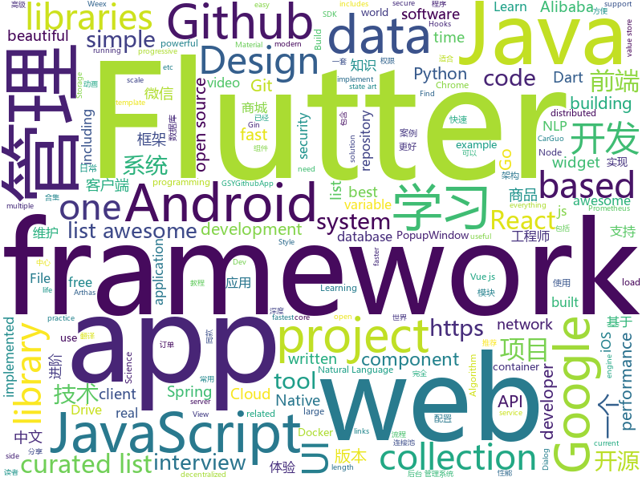

# 2018-12-26
See what the GitHub community is most excited about today.

## python
* [awesome-python-applications](https://github.com/mahmoud/awesome-python-applications)(**364 stars today**): 💿Free software that works great, and also happens to be open-source Python.
* [HelloGitHub](https://github.com/521xueweihan/HelloGitHub)(**218 stars today**): 分享 GitHub 上有趣、入门级的开源项目，帮你找到编程的乐趣。欢迎推荐、自荐项目，让更多人知道你的项目⭐️
* [sherlock](https://github.com/sdushantha/sherlock)(**174 stars today**): 🔎Find usernames across over 75 social networks
* [mars](https://github.com/mars-project/mars)(**112 stars today**): Mars is a tensor-based unified framework for large-scale data computation.
* [tetris_mcts](https://github.com/hrpan/tetris_mcts)(**105 stars today**): MCTS project for Tetris
* [pytext](https://github.com/facebookresearch/pytext)(**87 stars today**): A natural language modeling framework based on PyTorch
* [tools](https://github.com/ghost123gg/tools)(**85 stars today**): A Python Crawler Framework
* [bert](https://github.com/google-research/bert)(**66 stars today**): TensorFlow code and pre-trained models for BERT
* [models](https://github.com/tensorflow/models)(**51 stars today**): Models and examples built with TensorFlow
* [awesome-python](https://github.com/vinta/awesome-python)(**55 stars today**): A curated list of awesome Python frameworks, libraries, software and resources
* [torchdiffeq](https://github.com/rtqichen/torchdiffeq)(**46 stars today**): Differentiable ODE solvers with full GPU support and O(1)-memory backpropagation.
* [system-design-primer](https://github.com/donnemartin/system-design-primer)(**41 stars today**): Learn how to design large-scale systems. Prep for the system design interview. Includes Anki flashcards.
* [Python](https://github.com/TheAlgorithms/Python)(**36 stars today**): All Algorithms implemented in Python
* [youtube-dl](https://github.com/rg3/youtube-dl)(**40 stars today**): Command-line program to download videos from YouTube.com and other video sites
* [keras](https://github.com/keras-team/keras)(**35 stars today**): Deep Learning for humans
* [nevergrad](https://github.com/facebookresearch/nevergrad)(**41 stars today**): A Python toolbox for performing gradient-free optimization
* [flair](https://github.com/zalandoresearch/flair)(**37 stars today**): A very simple framework for state-of-the-art Natural Language Processing (NLP)
* [public-apis](https://github.com/toddmotto/public-apis)(**29 stars today**): A collective list of free APIs for use in software and web development.
* [XSStrike](https://github.com/s0md3v/XSStrike)(**30 stars today**): Most advanced XSS detection suite.
* [d2l-zh](https://github.com/diveintodeeplearning/d2l-zh)(**26 stars today**): 《动手学深度学习》，英文版即伯克利深度学习（STAT 157，2019春）教材。面向中文读者、能运行、可讨论。
* [faceswap](https://github.com/deepfakes/faceswap)(**27 stars today**): Non official project based on original /r/Deepfakes thread. Many thanks to him!
* [flask](https://github.com/pallets/flask)(**23 stars today**): The Python micro framework for building web applications.
* [django](https://github.com/django/django)(**20 stars today**): The Web framework for perfectionists with deadlines.
* [bert-as-service](https://github.com/hanxiao/bert-as-service)(**25 stars today**): Mapping a variable-length sentence to a fixed-length vector using BERT model
* [scikit-learn](https://github.com/scikit-learn/scikit-learn)(**19 stars today**): scikit-learn: machine learning in Python

## java
* [matrix](https://github.com/Tencent/matrix)(**1,066 stars today**): Matrix is a plugin style, no-intrusion APM system developed by WeChat.
* [advanced-java](https://github.com/doocs/advanced-java)(**507 stars today**): 😮互联网 Java 工程师进阶知识完全扫盲
* [mall](https://github.com/macrozheng/mall)(**154 stars today**): mall项目是一套电商系统，包括前台商城系统及后台管理系统，基于SpringBoot+MyBatis实现。 前台商城系统包含首页门户、商品推荐、商品搜索、商品展示、购物车、订单流程、会员中心、客户服务、帮助中心等模块。 后台管理系统包含商品管理、订单管理、会员管理、促销管理、运营管理、内容管理、统计报表、财务管理、权限管理、设置等模块。
* [JavaGuide](https://github.com/Snailclimb/JavaGuide)(**146 stars today**): 【Java学习+面试指南】 一份涵盖大部分Java程序员所需要掌握的核心知识。
* [x7](https://github.com/x-ream/x7)(**156 stars today**): 
* [BasePopup](https://github.com/razerdp/BasePopup)(**79 stars today**): 亲，还在为PopupWindow烦恼吗？不如试试BasePopup，你会爱上他的~
* [java-design-patterns](https://github.com/iluwatar/java-design-patterns)(**65 stars today**): Design patterns implemented in Java
* [miaosha](https://github.com/qiurunze123/miaosha)(**65 stars today**): 😮😮秒杀系统设计与实现.互联网工程师进阶与分析🙋🐓
* [QMUI_Android](https://github.com/Tencent/QMUI_Android)(**63 stars today**): 提高 Android UI 开发效率的 UI 库
* [apollo](https://github.com/ctripcorp/apollo)(**49 stars today**): Apollo（阿波罗）是携程框架部门研发的分布式配置中心，能够集中化管理应用不同环境、不同集群的配置，配置修改后能够实时推送到应用端，并且具备规范的权限、流程治理等特性，适用于微服务配置管理场景。
* [arthas](https://github.com/alibaba/arthas)(**48 stars today**): Alibaba Java Diagnostic Tool Arthas/Alibaba Java诊断利器Arthas
* [easyexcel](https://github.com/alibaba/easyexcel)(**47 stars today**): 快速、简单避免OOM的java处理Excel工具
* [XPopup](https://github.com/li-xiaojun/XPopup)(**45 stars today**): 🔥功能强大，UI简洁，交互优雅的通用弹窗！可以替代Dialog，PopupWindow，PopupMenu，BottomSheet，DrawerLayout等组件，自带十几种效果良好的动画， 支持完全的UI和动画自定义！(Powerful and Beautiful Popup，can absolutely replace Dialog，PopupWindow，PopupMenu，BottomSheet，DrawerLayout. With built-in animators , very easy to custom Popup View.)
* [WxJava](https://github.com/Wechat-Group/WxJava)(**40 stars today**): WxJava （微信开发 Java SDK），支持包括微信支付、开放平台、小程序、企业微信/企业号和公众号等的后端开发
* [MVVMHabit](https://github.com/goldze/MVVMHabit)(**41 stars today**): 👕基于谷歌最新AAC架构，MVVM设计模式的一套快速开发库，整合Okhttp+RxJava+Retrofit+Glide等主流模块，满足日常开发需求。使用该框架可以快速开发一个高质量、易维护的Android应用。
* [litemall](https://github.com/linlinjava/litemall)(**35 stars today**): 又一个小商城。litemall = Spring Boot后端 + Vue管理员前端 + 微信小程序用户前端
* [elasticsearch](https://github.com/elastic/elasticsearch)(**34 stars today**): Open Source, Distributed, RESTful Search Engine
* [guava](https://github.com/google/guava)(**34 stars today**): Google core libraries for Java
* [QPM](https://github.com/ZhuoKeTeam/QPM)(**37 stars today**): 质量性能监控组件，方便查看当前 APP 的性能。
* [spring-boot](https://github.com/spring-projects/spring-boot)(**25 stars today**): Spring Boot
* [jerryWebSpider](https://github.com/jrhu05/jerryWebSpider)(**32 stars today**): web爬虫合集
* [DoraemonKit](https://github.com/didi/DoraemonKit)(**31 stars today**): A full-featured APP ( iOS & Android ) development assistant. You deserve it.
* [spring-cloud-alibaba](https://github.com/spring-cloud-incubator/spring-cloud-alibaba)(**31 stars today**): Spring Cloud Alibaba provides a one-stop solution for application development for the distributed solutions of Alibaba middleware.
* [tutorials](https://github.com/eugenp/tutorials)(**21 stars today**): The "REST With Spring" Course:
* [druid](https://github.com/alibaba/druid)(**27 stars today**): 阿里巴巴数据库事业部出品，为监控而生的数据库连接池。阿里云Data Lake Analytics(https://www.aliyun.com/product/datalakeanalytics )、DRDS、TDDL 连接池powered by Druid

## unknown
* [ds-cheatsheets](https://github.com/FavioVazquez/ds-cheatsheets)(**344 stars today**): List of Data Science Cheatsheets to rule the world
* [the-book-of-secret-knowledge](https://github.com/trimstray/the-book-of-secret-knowledge)(**344 stars today**): 💫A collection of awesome lists, manuals, blogs, hacks, one-liners, cli/web tools and more. Especially for System and Network Administrators, DevOps, Pentesters or Security Researchers.
* [CS-Notes](https://github.com/CyC2018/CS-Notes)(**79 stars today**): 📚Computer Science Learning Notes
* [FAQGURU](https://github.com/FAQGURU/FAQGURU)(**85 stars today**): 🎒🚀🎉A list of interview questions. This repository is everything you need to prepare for your technical interview.
* [gitignore](https://github.com/github/gitignore)(**46 stars today**): A collection of useful .gitignore templates
* [free-programming-books](https://github.com/EbookFoundation/free-programming-books)(**33 stars today**): 📚Freely available programming books
* [awesome-vue](https://github.com/vuejs/awesome-vue)(**34 stars today**): 🎉A curated list of awesome things related to Vue.js
* [awesome](https://github.com/sindresorhus/awesome)(**32 stars today**): 😎Curated list of awesome lists
* [hosts](https://github.com/googlehosts/hosts)(**24 stars today**): 镜像：https://coding.net/u/scaffrey/p/hosts/git
* [gold-miner](https://github.com/xitu/gold-miner)(**27 stars today**): 🥇掘金翻译计划，可能是世界最大最好的英译中技术社区，最懂读者和译者的翻译平台：
* [project-based-learning](https://github.com/tuvtran/project-based-learning)(**27 stars today**): Curated list of project-based tutorials
* [docker-book](https://github.com/itmuch/docker-book)(**23 stars today**): Docker与Kubernetes开源书
* [Chinese-Podcasts](https://github.com/alaskasquirrel/Chinese-Podcasts)(**24 stars today**): 中文播客：Tech, VC, Life, Movie, Design...
* [paper-gestalt](https://github.com/vt-vl-lab/paper-gestalt)(**23 stars today**): Deep Paper Gestalt
* [trackerslist](https://github.com/ngosang/trackerslist)(**22 stars today**): An updated list of public BitTorrent trackers
* [IntelliJ-IDEA-Tutorial](https://github.com/judasn/IntelliJ-IDEA-Tutorial)(**20 stars today**): IntelliJ IDEA 简体中文专题教程
* [technology-talk](https://github.com/aalansehaiyang/technology-talk)(**21 stars today**): 汇总java生态圈常用技术框架、开源中间件，系统架构、项目管理、经典架构案例、数据库、常用三方库、线上运维等知识
* [DarthSidious-Chinese](https://github.com/crazywa1ker/DarthSidious-Chinese)(**21 stars today**): DarthSidious 中文版
* [GNNPapers](https://github.com/thunlp/GNNPapers)(**21 stars today**): 
* [awesome-public-datasets](https://github.com/awesomedata/awesome-public-datasets)(**19 stars today**): A topic-centric list of HQ open datasets in public domains. PR ☛☛☛
* [awesome-cpp](https://github.com/fffaraz/awesome-cpp)(**18 stars today**): A curated list of awesome C++ (or C) frameworks, libraries, resources, and shiny things. Inspired by awesome-... stuff.
* [weekly](https://github.com/ruanyf/weekly)(**18 stars today**): 技术分享周刊，每周五发布
* [CS-Interview-Knowledge-Map](https://github.com/InterviewMap/CS-Interview-Knowledge-Map)(**16 stars today**): Build the best interview map. The current content includes JS, network, browser related, performance optimization, security, framework, Git, data structure, algorithm, etc.
* [git-recipes](https://github.com/geeeeeeeeek/git-recipes)(**15 stars today**): 🥡 Git recipes in Chinese by Zhongyi Tong. 高质量的Git中文教程.
* [blog](https://github.com/yygmind/blog)(**17 stars today**): 我是木易杨，网易高级前端工程师，跟着我每周重点攻克一个前端面试重难点。接下来让我带你走进高级前端的世界，在进阶的路上，共勉！

## javascript
* [swc](https://github.com/swc-project/swc)(**340 stars today**): Super-fast alternative for babel written in rust
* [Magic-Grid](https://github.com/e-oj/Magic-Grid)(**231 stars today**): A simple, lightweight Javascript library for dynamic grid layouts.
* [next](https://github.com/alibaba-fusion/next)(**226 stars today**): A configurable component library for web built on React.
* [nodebestpractices](https://github.com/i0natan/nodebestpractices)(**186 stars today**): The largest Node.JS best practices list (November 2018)
* [orbit-db](https://github.com/orbitdb/orbit-db)(**143 stars today**): Peer-to-Peer Databases for the Decentralized Web
* [autoComplete.js](https://github.com/TarekRaafat/autoComplete.js)(**139 stars today**): Simple autocomplete pure vanilla Javascript library.
* [Librefox](https://github.com/intika/Librefox)(**130 stars today**): Librefox, patching Firefox for an enforced privacy and security
* [Boostnote](https://github.com/BoostIO/Boostnote)(**115 stars today**): A markdown editor for developers on Mac, Windows and Linux.
* [vue](https://github.com/vuejs/vue)(**101 stars today**): 🖖Vue.js is a progressive, incrementally-adoptable JavaScript framework for building UI on the web.
* [ant-design-pro](https://github.com/ant-design/ant-design-pro)(**80 stars today**): 👨🏻‍💻👩🏻‍💻 Use Ant Design like a Pro!
* [react](https://github.com/facebook/react)(**70 stars today**): A declarative, efficient, and flexible JavaScript library for building user interfaces.
* [react-developer-roadmap](https://github.com/adam-golab/react-developer-roadmap)(**65 stars today**): Roadmap to becoming a React developer in 2018
* [brain.js](https://github.com/BrainJS/brain.js)(**67 stars today**): 🤖Neural networks in JavaScript
* [30-seconds-of-code](https://github.com/30-seconds/30-seconds-of-code)(**52 stars today**): Curated collection of useful JavaScript snippets that you can understand in 30 seconds or less.
* [javascript-algorithms](https://github.com/trekhleb/javascript-algorithms)(**49 stars today**): 📝Algorithms and data structures implemented in JavaScript with explanations and links to further readings
* [material-ui](https://github.com/mui-org/material-ui)(**47 stars today**): React components that implement Google's Material Design.
* [quicklink](https://github.com/GoogleChromeLabs/quicklink)(**54 stars today**): ⚡️Faster subsequent page-loads by prefetching in-viewport links during idle time
* [33-js-concepts](https://github.com/leonardomso/33-js-concepts)(**51 stars today**): 📜33 concepts every JavaScript developer should know.
* [free-programming-books-zh_CN](https://github.com/justjavac/free-programming-books-zh_CN)(**47 stars today**): 📚免费的计算机编程类中文书籍，欢迎投稿
* [edex-ui](https://github.com/GitSquared/edex-ui)(**50 stars today**): A science fiction terminal emulator designed for large touchscreens that runs on all major OSs.
* [create-react-app](https://github.com/facebook/create-react-app)(**45 stars today**): Set up a modern web app by running one command.
* [gun](https://github.com/amark/gun)(**50 stars today**): A realtime, decentralized, offline-first, mutable graph database engine.
* [puppeteer](https://github.com/GoogleChrome/puppeteer)(**41 stars today**): Headless Chrome Node API
* [vuetify](https://github.com/vuetifyjs/vuetify)(**40 stars today**): 🐲Material Component Framework for Vue.js 2
* [axios](https://github.com/axios/axios)(**38 stars today**): Promise based HTTP client for the browser and node.js

## html
* [wiv.js](https://github.com/jjkaufman/wiv.js)(**142 stars today**): A library for a more wiggly div
* [codelf](https://github.com/unbug/codelf)(**129 stars today**): Best GitHub stars, repositories tagger and organizer. Search over projects from Github, Bitbucket, Google Code, Codeplex, Sourceforge, Fedora Project, GitLab to find real-world usage variable names
* [iA-Fonts](https://github.com/iaolo/iA-Fonts)(**49 stars today**): Free variable writing fonts from iA
* [Characters_of_the_Three_Kingdoms](https://github.com/myvin/Characters_of_the_Three_Kingdoms)(**27 stars today**): 😄Characters_of_the_Three_Kingdoms - 三国人物结构化数据
* [flutter-in-action](https://github.com/flutterchina/flutter-in-action)(**21 stars today**): 《Flutter实战》电子书
* [qianduan-yule-club](https://github.com/YongHaoWu/qianduan-yule-club)(**18 stars today**): 前端娱乐圈大事记 http://qianduanyule.club/
* [styleguide](https://github.com/google/styleguide)(**14 stars today**): Style guides for Google-originated open-source projects
* [Front-end-Developer-Interview-Questions](https://github.com/h5bp/Front-end-Developer-Interview-Questions)(**12 stars today**): A list of helpful front-end related questions you can use to interview potential candidates, test yourself or completely ignore.
* [ionic](https://github.com/ionic-team/ionic)(**11 stars today**): Build amazing native and progressive web apps with open web technologies. One app running on everything🎉
* [LIVEBOX-0DAY](https://github.com/zadewg/LIVEBOX-0DAY)(**13 stars today**): Arcadyan ARV7519RW22-A-L T VR9 1.2 Multiple security vulnerabilities affecting latest firmware release on ORANGE Livebox modems.
* [fastText](https://github.com/facebookresearch/fastText)(**12 stars today**): Library for fast text representation and classification.
* [NLP-progress](https://github.com/sebastianruder/NLP-progress)(**11 stars today**): Repository to track the progress in Natural Language Processing (NLP), including the datasets and the current state-of-the-art for the most common NLP tasks.
* [portainer](https://github.com/portainer/portainer)(**10 stars today**): Simple management UI for Docker
* [java-bible](https://github.com/biezhi/java-bible)(**10 stars today**): 🍌我的技术摘要
* [ctf-wiki](https://github.com/ctf-wiki/ctf-wiki)(**9 stars today**): CTF Wiki Online
* [the-power-of-prolog](https://github.com/triska/the-power-of-prolog)(**9 stars today**): Introduction to modern Prolog
* [JavaScript30](https://github.com/wesbos/JavaScript30)(**6 stars today**): 30 Day Vanilla JS Challenge
* [react-app-rewired](https://github.com/timarney/react-app-rewired)(**7 stars today**): Override create-react-app webpack configs without ejecting
* [2life](https://github.com/oh-bear/2life)(**7 stars today**): 💌双生：遇见另一半的美好：）（React Native）
* [fonts](https://github.com/google/fonts)(**7 stars today**): Font files available from Google Fonts
* [swagger-codegen](https://github.com/swagger-api/swagger-codegen)(**5 stars today**): swagger-codegen contains a template-driven engine to generate documentation, API clients and server stubs in different languages by parsing your OpenAPI / Swagger definition.
* [ckeditor-dev](https://github.com/ckeditor/ckeditor-dev)(**6 stars today**): The development repository of CKEditor 4.
* [glTF](https://github.com/KhronosGroup/glTF)(**6 stars today**): glTF – Runtime 3D Asset Delivery
* [Spoon-Knife](https://github.com/octocat/Spoon-Knife)(****): This repo is for demonstration purposes only.
* [flag-icon-css](https://github.com/lipis/flag-icon-css)(**5 stars today**): 🎏A collection of all country flags in SVG — plus the CSS for easier integration

## dart
* [flutter](https://github.com/flutter/flutter)(**123 stars today**): Flutter makes it easy and fast to build beautiful mobile apps.
* [awesome-flutter](https://github.com/Solido/awesome-flutter)(**46 stars today**): An awesome list that curates the best Flutter libraries, tools, tutorials, articles and more.
* [Flutter-Notebook](https://github.com/OpenFlutter/Flutter-Notebook)(**27 stars today**): 日更的FlutterDemo合集，今天你fu了吗
* [GSYGithubAppFlutter](https://github.com/CarGuo/GSYGithubAppFlutter)(**25 stars today**): 超完整的Flutter项目，功能丰富，适合学习和日常使用。GSYGithubApp系列的优势：我们目前已经拥有Flutter、Weex、ReactNative、kotlin 四个版本。 功能齐全，项目框架内技术涉及面广，完成度高，持续维护，配套文章，适合全面学习，对比参考。跨平台的开源Github客户端App，更好的体验，更丰富的功能，旨在更好的日常管理和维护个人Github，提供更好更方便的驾车体验Σ(￣。￣ﾉ)ﾉ。同款Weex版本 ： https://github.com/CarGuo/GSYGithubAppWeex 、同款React Native版本 ： https://github.com/CarGuo/GSYGithubApp 、原生 kotlin 版本 https://g…
* [wechat_clone_flutter](https://github.com/iosyaowei/wechat_clone_flutter)(**17 stars today**): flutter 学习 demo
* [flutter-ui-nice](https://github.com/nb312/flutter-ui-nice)(**15 stars today**): More than 100 beautiful pages in this beautiful app and more than 45 developers has contributed to it.
* [FlutterExampleApps](https://github.com/iampawan/FlutterExampleApps)(**16 stars today**): [Example APPS] Basic Flutter apps, for flutter devs.
* [dio](https://github.com/flutterchina/dio)(**17 stars today**): A powerful Http client for Dart, which supports Interceptors, FormData, Request Cancellation, File Downloading, Timeout etc.
* [plugins](https://github.com/flutter/plugins)(**15 stars today**): Plugins for Flutter, including FlutterFire, maintained by the Flutter team
* [flutter_hooks](https://github.com/rrousselGit/flutter_hooks)(**10 stars today**): A flutter implementation of React hooks. Hooks are a new kind of object that manages a Widget life-cycles. They exists for one reason: increase the code sharing between widgets and as a complete replacement for StatefulWidget.
* [flutter-osc](https://github.com/yubo725/flutter-osc)(**9 stars today**): 基于Google Flutter的开源中国客户端，支持Android和iOS。
* [Flare-Flutter](https://github.com/2d-inc/Flare-Flutter)(**9 stars today**): 
* [flutter_easyrefresh](https://github.com/xuelongqy/flutter_easyrefresh)(**9 stars today**): A widget provided to the flutter scroll component drop-down refresh and pull up load.
* [ycflutter](https://github.com/yangchong211/ycflutter)(**8 stars today**): flutter学习案例，接口使用玩Android开放的api，作为新手入门训练代码案例，耗时大概4个月【业余时间】，已经完成了基本的功能。努力打造一个体验好的flutter版本的玩android客户端！
* [annotation_route](https://github.com/alibaba-flutter/annotation_route)(**7 stars today**): 一个以注解方式实现的路由映射解决方案
* [samples](https://github.com/flutter/samples)(**6 stars today**): A collection of Flutter examples and demos.
* [bloc](https://github.com/felangel/bloc)(**6 stars today**): A collection of packages that help implement the BLoC design pattern
* [flutter_swiper](https://github.com/best-flutter/flutter_swiper)(**6 stars today**): The best swiper for flutter , with multiple layouts, infinite loop. Compatible with Android & iOS.
* [sdk](https://github.com/dart-lang/sdk)(**5 stars today**): The Dart SDK, including the VM, dart2js, core libraries, and more.
* [flutter_catalog](https://github.com/X-Wei/flutter_catalog)(**5 stars today**): An app showcasing Flutter components, with side-by-side source code view.
* [simple_auth](https://github.com/Clancey/simple_auth)(****): The Simplest way to Authenticate in Flutter
* [photo_view](https://github.com/renancaraujo/photo_view)(****): 📸A simple zoomable image widget for Flutter
* [site-www](https://github.com/dart-lang/site-www)(****): Source for Dart website
* [chromedeveditor](https://github.com/googlearchive/chromedeveditor)(****): Chrome Dev Editor is a developer tool for building apps on the Chrome platform - Chrome Apps and Web Apps, in JavaScript or Dart. (NO LONGER IN ACTIVE DEVELOPMENT)
* [flutter_architecture_samples](https://github.com/brianegan/flutter_architecture_samples)(****): TodoMVC for Flutter

## go
* [netcap](https://github.com/dreadl0ck/netcap)(**122 stars today**): A framework for secure and scalable network traffic analysis
* [txqr](https://github.com/divan/txqr)(**72 stars today**): Transfer data via animated QR codes
* [rclone](https://github.com/ncw/rclone)(**68 stars today**): "rsync for cloud storage" - Google Drive, Amazon Drive, S3, Dropbox, Backblaze B2, One Drive, Swift, Hubic, Cloudfiles, Google Cloud Storage, Yandex Files
* [go](https://github.com/golang/go)(**48 stars today**): The Go programming language
* [roadrunner](https://github.com/spiral/roadrunner)(**48 stars today**): High-performance PHP application server, load-balancer and process manager written in Golang
* [kubernetes](https://github.com/kubernetes/kubernetes)(**41 stars today**): Production-Grade Container Scheduling and Management
* [loki](https://github.com/grafana/loki)(**43 stars today**): Like Prometheus, but for logs.
* [gin](https://github.com/gin-gonic/gin)(**42 stars today**): Gin is a HTTP web framework written in Go (Golang). It features a Martini-like API with much better performance -- up to 40 times faster. If you need smashing performance, get yourself some Gin.
* [redix](https://github.com/alash3al/redix)(**39 stars today**): a persistent real-time key-value store, with the same redis protocol with powerful features
* [awesome-go](https://github.com/avelino/awesome-go)(**36 stars today**): A curated list of awesome Go frameworks, libraries and software
* [BaiduPCS-Go](https://github.com/iikira/BaiduPCS-Go)(**31 stars today**): 百度网盘客户端 - Go语言编写
* [prometheus](https://github.com/prometheus/prometheus)(**31 stars today**): The Prometheus monitoring system and time series database.
* [syncthing](https://github.com/syncthing/syncthing)(**31 stars today**): Open Source Continuous File Synchronization
* [hugo](https://github.com/gohugoio/hugo)(**29 stars today**): The world’s fastest framework for building websites.
* [dive](https://github.com/wagoodman/dive)(**31 stars today**): A tool for exploring each layer in a docker image
* [gogs](https://github.com/gogs/gogs)(**26 stars today**): Gogs is a painless self-hosted Git service.
* [tldr](https://github.com/isacikgoz/tldr)(**28 stars today**): fast and interactive tldr client written with go
* [moby](https://github.com/moby/moby)(**25 stars today**): Moby Project - a collaborative project for the container ecosystem to assemble container-based systems
* [etcd](https://github.com/etcd-io/etcd)(**23 stars today**): Distributed reliable key-value store for the most critical data of a distributed system
* [istio](https://github.com/istio/istio)(**24 stars today**): Connect, secure, control, and observe services.
* [docker_practice](https://github.com/yeasy/docker_practice)(**23 stars today**): Learn and understand Docker technologies, with real DevOps practice!
* [beego](https://github.com/astaxie/beego)(**20 stars today**): beego is an open-source, high-performance web framework for the Go programming language.
* [traefik](https://github.com/containous/traefik)(**20 stars today**): The Cloud Native Edge Router
* [annie](https://github.com/iawia002/annie)(**21 stars today**): 👾Fast, simple and clean video downloader
* [iris](https://github.com/kataras/iris)(**18 stars today**): The fastest backend community-driven web framework on (THIS) Earth. HTTP/2, MVC and more. Can your favourite web framework do that?👉http://bit.ly/iriscandothat1 or even http://bit.ly/iriscandothat2

## WordCloud

