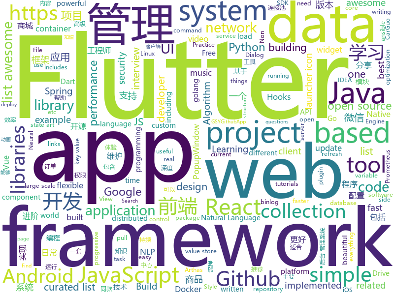

# 2018-12-27
See what the GitHub community is most excited about today.

## python
* [sherlock](https://github.com/sdushantha/sherlock)(**365 stars today**): 🔎Find usernames across over 75 social networks
* [awesome-python-applications](https://github.com/mahmoud/awesome-python-applications)(**343 stars today**): 💿Free software that works great, and also happens to be open-source Python.
* [mars](https://github.com/mars-project/mars)(**185 stars today**): Mars is a tensor-based unified framework for large-scale data computation.
* [HelloGitHub](https://github.com/521xueweihan/HelloGitHub)(**169 stars today**): 分享 GitHub 上有趣、入门级的开源项目，帮你找到编程的乐趣。欢迎推荐、自荐项目，让更多人知道你的项目⭐️
* [home-assistant](https://github.com/home-assistant/home-assistant)(**140 stars today**): 🏡Open source home automation that puts local control and privacy first
* [opensnitch](https://github.com/evilsocket/opensnitch)(**91 stars today**): OpenSnitch is a GNU/Linux port of the Little Snitch application firewall.
* [Python](https://github.com/TheAlgorithms/Python)(**69 stars today**): All Algorithms implemented in Python
* [pytext](https://github.com/facebookresearch/pytext)(**69 stars today**): A natural language modeling framework based on PyTorch
* [bert](https://github.com/google-research/bert)(**68 stars today**): TensorFlow code and pre-trained models for BERT
* [system-design-primer](https://github.com/donnemartin/system-design-primer)(**64 stars today**): Learn how to design large-scale systems. Prep for the system design interview. Includes Anki flashcards.
* [models](https://github.com/tensorflow/models)(**37 stars today**): Models and examples built with TensorFlow
* [tetris_mcts](https://github.com/hrpan/tetris_mcts)(**55 stars today**): MCTS project for Tetris
* [awesome-python](https://github.com/vinta/awesome-python)(**47 stars today**): A curated list of awesome Python frameworks, libraries, software and resources
* [youtube-dl](https://github.com/rg3/youtube-dl)(**42 stars today**): Command-line program to download videos from YouTube.com and other video sites
* [keras](https://github.com/keras-team/keras)(**39 stars today**): Deep Learning for humans
* [flair](https://github.com/zalandoresearch/flair)(**42 stars today**): A very simple framework for state-of-the-art Natural Language Processing (NLP)
* [faceswap](https://github.com/deepfakes/faceswap)(**39 stars today**): Non official project based on original /r/Deepfakes thread. Many thanks to him!
* [nevergrad](https://github.com/facebookresearch/nevergrad)(**41 stars today**): A Python toolbox for performing gradient-free optimization
* [d2l-zh](https://github.com/d2l-ai/d2l-zh)(**36 stars today**): 《动手学深度学习》，英文版即伯克利深度学习（STAT 157，2019春）教材。面向中文读者、能运行、可讨论。
* [cpython](https://github.com/python/cpython)(**33 stars today**): The Python programming language
* [scikit-learn](https://github.com/scikit-learn/scikit-learn)(**33 stars today**): scikit-learn: machine learning in Python
* [ansible](https://github.com/ansible/ansible)(**32 stars today**): Ansible is a radically simple IT automation platform that makes your applications and systems easier to deploy. Avoid writing scripts or custom code to deploy and update your applications — automate in a language that approaches plain English, using SSH, with no agents to install on remote systems. https://docs.ansible.com/ansible/
* [face_recognition](https://github.com/ageitgey/face_recognition)(**30 stars today**): The world's simplest facial recognition api for Python and the command line
* [flask](https://github.com/pallets/flask)(**31 stars today**): The Python micro framework for building web applications.
* [XX-Net](https://github.com/XX-net/XX-Net)(**25 stars today**): a web proxy tool

## java
* [matrix](https://github.com/Tencent/matrix)(**713 stars today**): Matrix is a plugin style, non-invasive APM system developed by WeChat.
* [advanced-java](https://github.com/doocs/advanced-java)(**392 stars today**): 😮互联网 Java 工程师进阶知识完全扫盲
* [JavaGuide](https://github.com/Snailclimb/JavaGuide)(**160 stars today**): 【Java学习+面试指南】 一份涵盖大部分Java程序员所需要掌握的核心知识。
* [mall](https://github.com/macrozheng/mall)(**123 stars today**): mall项目是一套电商系统，包括前台商城系统及后台管理系统，基于SpringBoot+MyBatis实现。 前台商城系统包含首页门户、商品推荐、商品搜索、商品展示、购物车、订单流程、会员中心、客户服务、帮助中心等模块。 后台管理系统包含商品管理、订单管理、会员管理、促销管理、运营管理、内容管理、统计报表、财务管理、权限管理、设置等模块。
* [spring-boot](https://github.com/spring-projects/spring-boot)(**59 stars today**): Spring Boot
* [arthas](https://github.com/alibaba/arthas)(**60 stars today**): Alibaba Java Diagnostic Tool Arthas/Alibaba Java诊断利器Arthas
* [BasePopup](https://github.com/razerdp/BasePopup)(**59 stars today**): 亲，还在为PopupWindow烦恼吗？不如试试BasePopup，你会爱上他的~
* [java-design-patterns](https://github.com/iluwatar/java-design-patterns)(**50 stars today**): Design patterns implemented in Java
* [miaosha](https://github.com/qiurunze123/miaosha)(**49 stars today**): 😮😮秒杀系统设计与实现.互联网工程师进阶与分析🙋🐓
* [hutool](https://github.com/looly/hutool)(**43 stars today**): A set of tools that keep Java sweet.
* [tutorials](https://github.com/eugenp/tutorials)(**25 stars today**): The "REST With Spring" Course:
* [QMUI_Android](https://github.com/Tencent/QMUI_Android)(**43 stars today**): 提高 Android UI 开发效率的 UI 库
* [spring-framework](https://github.com/spring-projects/spring-framework)(**34 stars today**): Spring Framework
* [incubator-dubbo](https://github.com/apache/incubator-dubbo)(**37 stars today**): Apache Dubbo (incubating) is a high-performance, java based, open source RPC framework.
* [apollo](https://github.com/ctripcorp/apollo)(**32 stars today**): Apollo（阿波罗）是携程框架部门研发的分布式配置中心，能够集中化管理应用不同环境、不同集群的配置，配置修改后能够实时推送到应用端，并且具备规范的权限、流程治理等特性，适用于微服务配置管理场景。
* [MVVMHabit](https://github.com/goldze/MVVMHabit)(**35 stars today**): 👕基于谷歌最新AAC架构，MVVM设计模式的一套快速开发库，整合Okhttp+RxJava+Retrofit+Glide等主流模块，满足日常开发需求。使用该框架可以快速开发一个高质量、易维护的Android应用。
* [elasticsearch](https://github.com/elastic/elasticsearch)(**30 stars today**): Open Source, Distributed, RESTful Search Engine
* [litemall](https://github.com/linlinjava/litemall)(**29 stars today**): 又一个小商城。litemall = Spring Boot后端 + Vue管理员前端 + 微信小程序用户前端
* [guava](https://github.com/google/guava)(**29 stars today**): Google core libraries for Java
* [Java](https://github.com/TheAlgorithms/Java)(**29 stars today**): All Algorithms implemented in Java
* [WxJava](https://github.com/Wechat-Group/WxJava)(**27 stars today**): WxJava （微信开发 Java SDK），支持包括微信支付、开放平台、小程序、企业微信/企业号和公众号等的后端开发
* [druid](https://github.com/alibaba/druid)(**29 stars today**): 阿里巴巴数据库事业部出品，为监控而生的数据库连接池。阿里云Data Lake Analytics(https://www.aliyun.com/product/datalakeanalytics )、DRDS、TDDL 连接池powered by Druid
* [DoraemonKit](https://github.com/didi/DoraemonKit)(**28 stars today**): A full-featured APP ( iOS & Android ) development assistant. You deserve it.
* [XPopup](https://github.com/li-xiaojun/XPopup)(**25 stars today**): 🔥功能强大，UI简洁，交互优雅的通用弹窗！可以替代Dialog，PopupWindow，PopupMenu，BottomSheet，DrawerLayout等组件，自带十几种效果良好的动画， 支持完全的UI和动画自定义！(Powerful and Beautiful Popup，can absolutely replace Dialog，PopupWindow，PopupMenu，BottomSheet，DrawerLayout. With built-in animators , very easy to custom Popup View.)
* [AndroidUtilCode](https://github.com/Blankj/AndroidUtilCode)(**22 stars today**): 🔥Android developers should collect the following utils(updating).

## unknown
* [the-book-of-secret-knowledge](https://github.com/trimstray/the-book-of-secret-knowledge)(**396 stars today**): 💫A collection of awesome lists, manuals, blogs, hacks, one-liners, cli/web tools and more. Especially for System and Network Administrators, DevOps, Pentesters or Security Researchers.
* [ds-cheatsheets](https://github.com/FavioVazquez/ds-cheatsheets)(**348 stars today**): List of Data Science Cheatsheets to rule the world
* [GNNPapers](https://github.com/thunlp/GNNPapers)(**331 stars today**): Must-read papers on graph neural network (GNN)
* [awesome-golang-security](https://github.com/guardrailsio/awesome-golang-security)(**264 stars today**): Awesome golang Security resources
* [CS-Notes](https://github.com/CyC2018/CS-Notes)(**72 stars today**): 📚Computer Science Learning Notes
* [FAQGURU](https://github.com/FAQGURU/FAQGURU)(**59 stars today**): 🎒🚀🎉A list of interview questions. This repository is everything you need to prepare for your technical interview.
* [gitignore](https://github.com/github/gitignore)(**42 stars today**): A collection of useful .gitignore templates
* [CS-Interview-Knowledge-Map](https://github.com/InterviewMap/CS-Interview-Knowledge-Map)(**55 stars today**): Build the best interview map. The current content includes JS, network, browser related, performance optimization, security, framework, Git, data structure, algorithm, etc.
* [awesome](https://github.com/sindresorhus/awesome)(**55 stars today**): 😎Curated list of awesome lists
* [free-programming-books](https://github.com/EbookFoundation/free-programming-books)(**43 stars today**): 📚Freely available programming books
* [awesome-machine-learning-portugues](https://github.com/italojs/awesome-machine-learning-portugues)(**47 stars today**): Um plano de estudos para o aprender machine learning em português
* [awesome-vue](https://github.com/vuejs/awesome-vue)(**45 stars today**): 🎉A curated list of awesome things related to Vue.js
* [project-based-learning](https://github.com/tuvtran/project-based-learning)(**29 stars today**): Curated list of project-based tutorials
* [blog](https://github.com/yygmind/blog)(**33 stars today**): 我是木易杨，网易高级前端工程师，跟着我每周重点攻克一个前端面试重难点。接下来让我带你走进高级前端的世界，在进阶的路上，共勉！
* [trackerslist](https://github.com/ngosang/trackerslist)(**27 stars today**): An updated list of public BitTorrent trackers
* [android-architecture](https://github.com/googlesamples/android-architecture)(**26 stars today**): A collection of samples to discuss and showcase different architectural tools and patterns for Android apps.
* [IntelliJ-IDEA-Tutorial](https://github.com/judasn/IntelliJ-IDEA-Tutorial)(**25 stars today**): IntelliJ IDEA 简体中文专题教程
* [hosts](https://github.com/googlehosts/hosts)(**22 stars today**): 镜像：https://coding.net/u/scaffrey/p/hosts/git
* [flink-forward-china-2018](https://github.com/flink-china/flink-forward-china-2018)(**20 stars today**): Flink Forward China 2018 Slides
* [awesome-public-datasets](https://github.com/awesomedata/awesome-public-datasets)(**23 stars today**): A topic-centric list of HQ open datasets in public domains. PR ☛☛☛
* [dev-practice](https://github.com/alinebastos/dev-practice)(**23 stars today**): Practice your skills with these ideas.
* [build-your-own-x](https://github.com/danistefanovic/build-your-own-x)(**21 stars today**): 🤓Build your own (insert technology here)
* [awesome-cpp](https://github.com/fffaraz/awesome-cpp)(**22 stars today**): A curated list of awesome C++ (or C) frameworks, libraries, resources, and shiny things. Inspired by awesome-... stuff.
* [The-Economist](https://github.com/nailperry-zd/The-Economist)(**22 stars today**): The Economist 经济学人，持续更新
* [awesome-for-beginners](https://github.com/MunGell/awesome-for-beginners)(**20 stars today**): A list of awesome beginners-friendly projects.

## javascript
* [atree](https://github.com/anvaka/atree)(**338 stars today**): Just a simple christmas tree, based on redit story
* [swc](https://github.com/swc-project/swc)(**210 stars today**): Super-fast alternative for babel written in rust
* [nodebestpractices](https://github.com/i0natan/nodebestpractices)(**174 stars today**): The largest Node.JS best practices list (November 2018)
* [Magic-Grid](https://github.com/e-oj/Magic-Grid)(**172 stars today**): A simple, lightweight Javascript library for dynamic grid layouts.
* [autoComplete.js](https://github.com/TarekRaafat/autoComplete.js)(**167 stars today**): Simple autocomplete pure vanilla Javascript library.
* [next](https://github.com/alibaba-fusion/next)(**161 stars today**): A configurable component library for web built on React.
* [vue](https://github.com/vuejs/vue)(**123 stars today**): 🖖Vue.js is a progressive, incrementally-adoptable JavaScript framework for building UI on the web.
* [react](https://github.com/facebook/react)(**100 stars today**): A declarative, efficient, and flexible JavaScript library for building user interfaces.
* [music-fns](https://github.com/madewithlove/music-fns)(**101 stars today**): a JavaScript music utility library that contains small music notation related functions.
* [javascript-algorithms](https://github.com/trekhleb/javascript-algorithms)(**90 stars today**): 📝Algorithms and data structures implemented in JavaScript with explanations and links to further readings
* [ant-design-pro](https://github.com/ant-design/ant-design-pro)(**84 stars today**): 👨🏻‍💻👩🏻‍💻 Use Ant Design like a Pro!
* [33-js-concepts](https://github.com/leonardomso/33-js-concepts)(**77 stars today**): 📜33 concepts every JavaScript developer should know.
* [codelf](https://github.com/unbug/codelf)(**71 stars today**): Best GitHub stars, repositories tagger and organizer. Search over projects from Github, Bitbucket, Google Code, Codeplex, Sourceforge, Fedora Project, GitLab to find real-world usage variable names
* [Boostnote](https://github.com/BoostIO/Boostnote)(**66 stars today**): A markdown editor for developers on Mac, Windows and Linux.
* [zaobao](https://github.com/wubaiqing/zaobao)(**67 stars today**): 每日时报，会以前端技术体系为主要分享课题。内容会以：文章、工具、新闻、视频几大板块作为主要分类。如果我的分享对你有所帮助，还请大家给个⭐️让更多的人知道它。
* [30-seconds-of-code](https://github.com/30-seconds/30-seconds-of-code)(**63 stars today**): Curated collection of useful JavaScript snippets that you can understand in 30 seconds or less.
* [ice](https://github.com/alibaba/ice)(**60 stars today**): 🚀飞冰 - 让前端开发简单而友好，海量可复用物料，配套桌面工具极速构建前端应用，效率提升 100%
* [free-programming-books-zh_CN](https://github.com/justjavac/free-programming-books-zh_CN)(**55 stars today**): 📚免费的计算机编程类中文书籍，欢迎投稿
* [Librefox](https://github.com/intika/Librefox)(**61 stars today**): Librefox: Firefox with privacy enhancements
* [quicklink](https://github.com/GoogleChromeLabs/quicklink)(**57 stars today**): ⚡️Faster subsequent page-loads by prefetching in-viewport links during idle time
* [create-react-app](https://github.com/facebook/create-react-app)(**48 stars today**): Set up a modern web app by running one command.
* [taro](https://github.com/NervJS/taro)(**55 stars today**): 多端统一开发框架，支持用 React 的开发方式编写一次代码，生成能运行在微信/百度/支付宝/字节跳动小程序、H5、React Native 等的应用。 https://taro.js.org/
* [axios](https://github.com/axios/axios)(**54 stars today**): Promise based HTTP client for the browser and node.js
* [react-developer-roadmap](https://github.com/adam-golab/react-developer-roadmap)(**51 stars today**): Roadmap to becoming a React developer in 2018
* [brain.js](https://github.com/BrainJS/brain.js)(**48 stars today**): 🤖Neural networks in JavaScript

## html
* [wiv.js](https://github.com/jjkaufman/wiv.js)(**71 stars today**): A library for a more wiggly div
* [NLP-progress](https://github.com/sebastianruder/NLP-progress)(**29 stars today**): Repository to track the progress in Natural Language Processing (NLP), including the datasets and the current state-of-the-art for the most common NLP tasks.
* [iA-Fonts](https://github.com/iaolo/iA-Fonts)(**25 stars today**): Free variable writing fonts from iA
* [Characters_of_the_Three_Kingdoms](https://github.com/myvin/Characters_of_the_Three_Kingdoms)(**23 stars today**): 😄Characters_of_the_Three_Kingdoms - 三国人物结构化数据
* [Front-end-Developer-Interview-Questions](https://github.com/h5bp/Front-end-Developer-Interview-Questions)(**18 stars today**): A list of helpful front-end related questions you can use to interview potential candidates, test yourself or completely ignore.
* [portainer](https://github.com/portainer/portainer)(**19 stars today**): Simple management UI for Docker
* [flutter-in-action](https://github.com/flutterchina/flutter-in-action)(**16 stars today**): 《Flutter实战》电子书
* [JavaScript30](https://github.com/wesbos/JavaScript30)(**9 stars today**): 30 Day Vanilla JS Challenge
* [Spoon-Knife](https://github.com/octocat/Spoon-Knife)(****): This repo is for demonstration purposes only.
* [styleguide](https://github.com/google/styleguide)(**10 stars today**): Style guides for Google-originated open-source projects
* [java-bible](https://github.com/biezhi/java-bible)(**11 stars today**): 🍌我的技术摘要
* [qianduan-yule-club](https://github.com/YongHaoWu/qianduan-yule-club)(**10 stars today**): 前端娱乐圈大事记 http://qianduanyule.club/
* [react-app-rewired](https://github.com/timarney/react-app-rewired)(**10 stars today**): Override create-react-app webpack configs without ejecting
* [fastText](https://github.com/facebookresearch/fastText)(**9 stars today**): Library for fast text representation and classification.
* [ionic](https://github.com/ionic-team/ionic)(**9 stars today**): Build amazing native and progressive web apps with open web technologies. One app running on everything🎉
* [blog](https://github.com/lifesinger/blog)(**9 stars today**): 岁月如歌
* [swagger-codegen](https://github.com/swagger-api/swagger-codegen)(**8 stars today**): swagger-codegen contains a template-driven engine to generate documentation, API clients and server stubs in different languages by parsing your OpenAPI / Swagger definition.
* [js-xss](https://github.com/leizongmin/js-xss)(**8 stars today**): Sanitize untrusted HTML (to prevent XSS) with a configuration specified by a Whitelist
* [18.06-linalg-notes](https://github.com/apachecn/18.06-linalg-notes)(**7 stars today**): MIT-18.06-线性代数-完整笔记
* [ckeditor-dev](https://github.com/ckeditor/ckeditor-dev)(**7 stars today**): The development repository of CKEditor 4.
* [coding-interview](https://github.com/doocs/coding-interview)(**6 stars today**): 😀代码面试题集，包括剑指 Offer、编程之美等。
* [ecma262](https://github.com/tc39/ecma262)(**7 stars today**): Status, process, and documents for ECMA262
* [LIVEBOX-0DAY](https://github.com/zadewg/LIVEBOX-0DAY)(**7 stars today**): Arcadyan ARV7519RW22-A-L T VR9 1.2 Multiple security vulnerabilities affecting latest firmware release on ORANGE Livebox modems.
* [simple-icons](https://github.com/simple-icons/simple-icons)(**6 stars today**): SVG icons for popular brands
* [glTF](https://github.com/KhronosGroup/glTF)(**5 stars today**): glTF – Runtime 3D Asset Delivery

## dart
* [flutter](https://github.com/flutter/flutter)(**158 stars today**): Flutter makes it easy and fast to build beautiful mobile apps.
* [flutter-ui-nice](https://github.com/nb312/flutter-ui-nice)(**61 stars today**): More than 100 pages in this beautiful app and more than 45 developers has contributed to it.
* [awesome-flutter](https://github.com/Solido/awesome-flutter)(**47 stars today**): An awesome list that curates the best Flutter libraries, tools, tutorials, articles and more.
* [Liquid-Pull-To-Refresh](https://github.com/aagarwal1012/Liquid-Pull-To-Refresh)(**42 stars today**): 🔁A custom refresh indicator for flutter.
* [GSYGithubAppFlutter](https://github.com/CarGuo/GSYGithubAppFlutter)(**34 stars today**): 超完整的Flutter项目，功能丰富，适合学习和日常使用。GSYGithubApp系列的优势：我们目前已经拥有Flutter、Weex、ReactNative、kotlin 四个版本。 功能齐全，项目框架内技术涉及面广，完成度高，持续维护，配套文章，适合全面学习，对比参考。跨平台的开源Github客户端App，更好的体验，更丰富的功能，旨在更好的日常管理和维护个人Github，提供更好更方便的驾车体验Σ(￣。￣ﾉ)ﾉ。同款Weex版本 ： https://github.com/CarGuo/GSYGithubAppWeex 、同款React Native版本 ： https://github.com/CarGuo/GSYGithubApp 、原生 kotlin 版本 https://g…
* [plugins](https://github.com/flutter/plugins)(**30 stars today**): Plugins for Flutter, including FlutterFire, maintained by the Flutter team
* [FlutterExampleApps](https://github.com/iampawan/FlutterExampleApps)(**30 stars today**): [Example APPS] Basic Flutter apps, for flutter devs.
* [Flutter-Notebook](https://github.com/OpenFlutter/Flutter-Notebook)(**27 stars today**): 日更的FlutterDemo合集，今天你fu了吗
* [dio](https://github.com/flutterchina/dio)(**26 stars today**): A powerful Http client for Dart, which supports Interceptors, FormData, Request Cancellation, File Downloading, Timeout etc.
* [flutter_hooks](https://github.com/rrousselGit/flutter_hooks)(**16 stars today**): A flutter implementation of React hooks. Hooks are a new kind of object that manages a Widget life-cycles. They exists for one reason: increase the code sharing between widgets and as a complete replacement for StatefulWidget.
* [devtools](https://github.com/flutter/devtools)(**16 stars today**): Performance tools for Flutter.
* [inKino](https://github.com/roughike/inKino)(**15 stars today**): A multiplatform Dart movie app with 40% of code sharing between Flutter and the Web.
* [flhooks](https://github.com/alfredosalzillo/flhooks)(**15 stars today**): React like Hooks implementation for Flutter.
* [wechat_clone_flutter](https://github.com/iosyaowei/wechat_clone_flutter)(**13 stars today**): flutter 学习 demo
* [flutter_easyrefresh](https://github.com/xuelongqy/flutter_easyrefresh)(**11 stars today**): A widget provided to the flutter scroll component drop-down refresh and pull up load.
* [sdk](https://github.com/dart-lang/sdk)(**12 stars today**): The Dart SDK, including the VM, dart2js, core libraries, and more.
* [samples](https://github.com/flutter/samples)(**11 stars today**): A collection of Flutter examples and demos.
* [flutter-osc](https://github.com/yubo725/flutter-osc)(**7 stars today**): 基于Google Flutter的开源中国客户端，支持Android和iOS。
* [annotation_route](https://github.com/alibaba-flutter/annotation_route)(**7 stars today**): 一个以注解方式实现的路由映射解决方案
* [quiet-flutter](https://github.com/boyan01/quiet-flutter)(**6 stars today**): a flutter music player app
* [xtimer-flutter-app](https://github.com/pedromassango/xtimer-flutter-app)(**5 stars today**): Flutter timer app
* [flutter_catalog](https://github.com/X-Wei/flutter_catalog)(**5 stars today**): An app showcasing Flutter components, with side-by-side source code view.
* [flutter_launcher_icons](https://github.com/fluttercommunity/flutter_launcher_icons)(**6 stars today**): Flutter Launcher Icons - A package which simplifies the task of updating your Flutter app's launcher icon. Fully flexible, allowing you to choose what platform you wish to update the launcher icon for and if you want, the option to keep your old launcher icon in case you want to revert back sometime in the future. Maintainer: @MarkOSullivan94
* [Flare-Flutter](https://github.com/2d-inc/Flare-Flutter)(**5 stars today**): 
* [bloc](https://github.com/felangel/bloc)(**5 stars today**): A collection of packages that help implement the BLoC design pattern

## go
* [txqr](https://github.com/divan/txqr)(**77 stars today**): Transfer data via animated QR codes
* [kubernetes](https://github.com/kubernetes/kubernetes)(**64 stars today**): Production-Grade Container Scheduling and Management
* [pgweb](https://github.com/sosedoff/pgweb)(**71 stars today**): Cross-platform client for PostgreSQL databases
* [netcap](https://github.com/dreadl0ck/netcap)(**62 stars today**): A framework for secure and scalable network traffic analysis
* [go](https://github.com/golang/go)(**55 stars today**): The Go programming language
* [rclone](https://github.com/ncw/rclone)(**56 stars today**): "rsync for cloud storage" - Google Drive, Amazon Drive, S3, Dropbox, Backblaze B2, One Drive, Swift, Hubic, Cloudfiles, Google Cloud Storage, Yandex Files
* [roadrunner](https://github.com/spiral/roadrunner)(**56 stars today**): High-performance PHP application server, load-balancer and process manager written in Golang
* [makisu](https://github.com/uber/makisu)(**48 stars today**): Fast and flexible Docker image building tool, works in unprivileged containerized environments like Mesos and Kubernetes.
* [awesome-go](https://github.com/avelino/awesome-go)(**47 stars today**): A curated list of awesome Go frameworks, libraries and software
* [kanzi-go](https://github.com/flanglet/kanzi-go)(**45 stars today**): Lossless data compression in Go
* [loki](https://github.com/grafana/loki)(**40 stars today**): Like Prometheus, but for logs.
* [dolphinbeat](https://github.com/bytewatch/dolphinbeat)(**39 stars today**): An application that pulls MySQL binlog, parses binlog and pushs incremental update data into different sinks, for example, kafka.
* [dive](https://github.com/wagoodman/dive)(**38 stars today**): A tool for exploring each layer in a docker image
* [redix](https://github.com/alash3al/redix)(**34 stars today**): a persistent real-time key-value store, with the same redis protocol with powerful features
* [gin](https://github.com/gin-gonic/gin)(**32 stars today**): Gin is a HTTP web framework written in Go (Golang). It features a Martini-like API with much better performance -- up to 40 times faster. If you need smashing performance, get yourself some Gin.
* [syncthing](https://github.com/syncthing/syncthing)(**32 stars today**): Open Source Continuous File Synchronization
* [build-web-application-with-golang](https://github.com/astaxie/build-web-application-with-golang)(**31 stars today**): A golang ebook intro how to build a web with golang
* [tidb](https://github.com/pingcap/tidb)(**29 stars today**): TiDB is a distributed HTAP database compatible with the MySQL protocol
* [annie](https://github.com/iawia002/annie)(**31 stars today**): 👾Fast, simple and clean video downloader
* [etcd](https://github.com/etcd-io/etcd)(**27 stars today**): Distributed reliable key-value store for the most critical data of a distributed system
* [prometheus](https://github.com/prometheus/prometheus)(**26 stars today**): The Prometheus monitoring system and time series database.
* [hugo](https://github.com/gohugoio/hugo)(**25 stars today**): The world’s fastest framework for building websites.
* [gogs](https://github.com/gogs/gogs)(**24 stars today**): Gogs is a painless self-hosted Git service.
* [istio](https://github.com/istio/istio)(**23 stars today**): Connect, secure, control, and observe services.
* [moby](https://github.com/moby/moby)(**23 stars today**): Moby Project - a collaborative project for the container ecosystem to assemble container-based systems

## WordCloud

