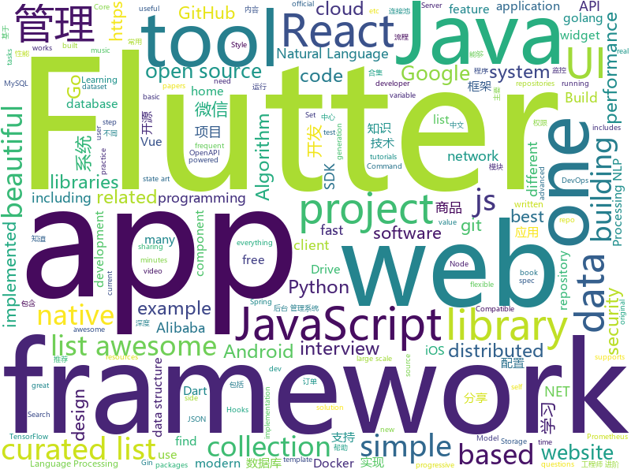

# 2018-12-28
See what the GitHub community is most excited about today.

## python
* [awesome-python-applications](https://github.com/mahmoud/awesome-python-applications)(**276 stars today**): 💿Free software that works great, and also happens to be open-source Python.
* [sherlock](https://github.com/sdushantha/sherlock)(**280 stars today**): 🔎Find usernames across over 75 social networks
* [Super-SloMo](https://github.com/avinashpaliwal/Super-SloMo)(**235 stars today**): PyTorch implementation of Super SloMo by Jiang et al.
* [HelloGitHub](https://github.com/521xueweihan/HelloGitHub)(**151 stars today**): 分享 GitHub 上有趣、入门级的开源项目，帮你找到编程的乐趣。欢迎推荐、自荐项目，让更多人知道你的项目⭐️
* [home-assistant](https://github.com/home-assistant/home-assistant)(**140 stars today**): 🏡Open source home automation that puts local control and privacy first
* [flair](https://github.com/zalandoresearch/flair)(**98 stars today**): A very simple framework for state-of-the-art Natural Language Processing (NLP)
* [mars](https://github.com/mars-project/mars)(**85 stars today**): Mars is a tensor-based unified framework for large-scale data computation.
* [Python](https://github.com/TheAlgorithms/Python)(**69 stars today**): All Algorithms implemented in Python
* [models](https://github.com/tensorflow/models)(**61 stars today**): Models and examples built with TensorFlow
* [system-design-primer](https://github.com/donnemartin/system-design-primer)(**71 stars today**): Learn how to design large-scale systems. Prep for the system design interview. Includes Anki flashcards.
* [bert](https://github.com/google-research/bert)(**58 stars today**): TensorFlow code and pre-trained models for BERT
* [awesome-python](https://github.com/vinta/awesome-python)(**52 stars today**): A curated list of awesome Python frameworks, libraries, software and resources
* [nevergrad](https://github.com/facebookresearch/nevergrad)(**51 stars today**): A Python toolbox for performing gradient-free optimization
* [imbalanced-dataset-sampler](https://github.com/ufoym/imbalanced-dataset-sampler)(**45 stars today**): A (PyTorch) imbalanced dataset sampler for oversampling low frequent classes and undersampling high frequent ones.
* [pytext](https://github.com/facebookresearch/pytext)(**42 stars today**): A natural language modeling framework based on PyTorch
* [d2l-zh](https://github.com/d2l-ai/d2l-zh)(**40 stars today**): 《动手学深度学习》，英文版即伯克利深度学习（STAT 157，2019春）教材。面向中文读者、能运行、可讨论。
* [django](https://github.com/django/django)(**39 stars today**): The Web framework for perfectionists with deadlines.
* [youtube-dl](https://github.com/rg3/youtube-dl)(**36 stars today**): Command-line program to download videos from YouTube.com and other video sites
* [keras](https://github.com/keras-team/keras)(**32 stars today**): Deep Learning for humans
* [bw_plex](https://github.com/Hellowlol/bw_plex)(**39 stars today**): binge watching for plex
* [public-apis](https://github.com/toddmotto/public-apis)(**32 stars today**): A collective list of free APIs for use in software and web development.
* [road-network](https://github.com/arun1729/road-network)(**34 stars today**): QuadTree Model for generating random road network
* [flask](https://github.com/pallets/flask)(**27 stars today**): The Python micro framework for building web applications.
* [cpython](https://github.com/python/cpython)(**25 stars today**): The Python programming language
* [faceswap](https://github.com/deepfakes/faceswap)(**27 stars today**): Non official project based on original /r/Deepfakes thread. Many thanks to him!

## java
* [advanced-java](https://github.com/doocs/advanced-java)(**283 stars today**): 😮互联网 Java 工程师进阶知识完全扫盲
* [matrix](https://github.com/Tencent/matrix)(**294 stars today**): Matrix is a plugin style, non-invasive APM system developed by WeChat.
* [JavaGuide](https://github.com/Snailclimb/JavaGuide)(**172 stars today**): 【Java学习+面试指南】 一份涵盖大部分Java程序员所需要掌握的核心知识。
* [mall](https://github.com/macrozheng/mall)(**89 stars today**): mall项目是一套电商系统，包括前台商城系统及后台管理系统，基于SpringBoot+MyBatis实现。 前台商城系统包含首页门户、商品推荐、商品搜索、商品展示、购物车、订单流程、会员中心、客户服务、帮助中心等模块。 后台管理系统包含商品管理、订单管理、会员管理、促销管理、运营管理、内容管理、统计报表、财务管理、权限管理、设置等模块。
* [arthas](https://github.com/alibaba/arthas)(**68 stars today**): Alibaba Java Diagnostic Tool Arthas/Alibaba Java诊断利器Arthas
* [java-design-patterns](https://github.com/iluwatar/java-design-patterns)(**55 stars today**): Design patterns implemented in Java
* [spring-boot](https://github.com/spring-projects/spring-boot)(**48 stars today**): Spring Boot
* [miaosha](https://github.com/qiurunze123/miaosha)(**54 stars today**): 😮😮秒杀系统设计与实现.互联网工程师进阶与分析🙋🐓
* [DoraemonKit](https://github.com/didi/DoraemonKit)(**51 stars today**): A full-featured APP ( iOS & Android ) development assistant. You deserve it.
* [JCSprout](https://github.com/crossoverJie/JCSprout)(**41 stars today**): 👨‍🎓Java Core Sprout : basic, concurrent, algorithm
* [tutorials](https://github.com/eugenp/tutorials)(**22 stars today**): The "REST With Spring" Course:
* [apollo](https://github.com/ctripcorp/apollo)(**33 stars today**): Apollo（阿波罗）是携程框架部门研发的分布式配置中心，能够集中化管理应用不同环境、不同集群的配置，配置修改后能够实时推送到应用端，并且具备规范的权限、流程治理等特性，适用于微服务配置管理场景。
* [incubator-dubbo](https://github.com/apache/incubator-dubbo)(**30 stars today**): Apache Dubbo (incubating) is a high-performance, java based, open source RPC framework.
* [hutool](https://github.com/looly/hutool)(**33 stars today**): A set of tools that keep Java sweet.
* [AndroidProject](https://github.com/getActivity/AndroidProject)(**34 stars today**): An advanced template project
* [QPM](https://github.com/ZhuoKeTeam/QPM)(**33 stars today**): 质量性能监控组件，方便查看当前 APP 的性能。
* [BasePopup](https://github.com/razerdp/BasePopup)(**33 stars today**): 亲，还在为PopupWindow烦恼吗？不如试试BasePopup，你会爱上他的~
* [spring-cloud-alibaba](https://github.com/spring-cloud-incubator/spring-cloud-alibaba)(**30 stars today**): Spring Cloud Alibaba provides a one-stop solution for application development for the distributed solutions of Alibaba middleware.
* [Java](https://github.com/TheAlgorithms/Java)(**26 stars today**): All Algorithms implemented in Java
* [WxJava](https://github.com/Wechat-Group/WxJava)(**31 stars today**): WxJava （微信开发 Java SDK），支持包括微信支付、开放平台、小程序、企业微信/企业号和公众号等的后端开发
* [symphony](https://github.com/b3log/symphony)(**30 stars today**): 🎶一款用 Java 实现的现代化社区（论坛/BBS/社交网络/博客）平台。https://hacpai.com
* [QMUI_Android](https://github.com/Tencent/QMUI_Android)(**29 stars today**): 提高 Android UI 开发效率的 UI 库
* [druid](https://github.com/alibaba/druid)(**29 stars today**): 阿里巴巴数据库事业部出品，为监控而生的数据库连接池。阿里云Data Lake Analytics(https://www.aliyun.com/product/datalakeanalytics )、DRDS、TDDL 连接池powered by Druid
* [elasticsearch](https://github.com/elastic/elasticsearch)(**27 stars today**): Open Source, Distributed, RESTful Search Engine
* [spring-framework](https://github.com/spring-projects/spring-framework)(**17 stars today**): Spring Framework

## unknown
* [the-book-of-secret-knowledge](https://github.com/trimstray/the-book-of-secret-knowledge)(**431 stars today**): 💫A collection of awesome lists, manuals, blogs, hacks, one-liners, cli/web tools and more. Especially for System and Network Administrators, DevOps, Pentesters or Security Researchers.
* [GNNPapers](https://github.com/thunlp/GNNPapers)(**344 stars today**): Must-read papers on graph neural network (GNN)
* [ds-cheatsheets](https://github.com/FavioVazquez/ds-cheatsheets)(**290 stars today**): List of Data Science Cheatsheets to rule the world
* [awesome-golang-security](https://github.com/guardrailsio/awesome-golang-security)(**272 stars today**): Awesome golang Security resources
* [spec](https://github.com/ulid/spec)(**164 stars today**): The canonical spec for ulid
* [Hacking-With-Golang](https://github.com/re4lity/Hacking-With-Golang)(**88 stars today**): Golang安全资源合集
* [CS-Notes](https://github.com/CyC2018/CS-Notes)(**67 stars today**): 📚Computer Science Learning Notes
* [awesome-lane-detection](https://github.com/amusi/awesome-lane-detection)(**63 stars today**): lane detection
* [awesome](https://github.com/sindresorhus/awesome)(**65 stars today**): 😎Curated list of awesome lists
* [gitignore](https://github.com/github/gitignore)(**51 stars today**): A collection of useful .gitignore templates
* [FAQGURU](https://github.com/FAQGURU/FAQGURU)(**58 stars today**): 🎒🚀🎉A list of interview questions. This repository is everything you need to prepare for your technical interview.
* [free-programming-books](https://github.com/EbookFoundation/free-programming-books)(**42 stars today**): 📚Freely available programming books
* [awesome-vue](https://github.com/vuejs/awesome-vue)(**40 stars today**): 🎉A curated list of awesome things related to Vue.js
* [hosts](https://github.com/googlehosts/hosts)(**30 stars today**): 镜像：https://coding.net/u/scaffrey/p/hosts/git
* [ramen](https://github.com/niw/ramen)(**35 stars today**): 🍜A repository to organize self-made ramen recipes.
* [mml-book.github.io](https://github.com/mml-book/mml-book.github.io)(**30 stars today**): Companion webpage to the book "Mathematics For Machine Learning"
* [technology-talk](https://github.com/aalansehaiyang/technology-talk)(**28 stars today**): 汇总java生态圈常用技术框架、开源中间件，系统架构、项目管理、经典架构案例、数据库、常用三方库、线上运维等知识
* [awesome-nodejs](https://github.com/sindresorhus/awesome-nodejs)(**29 stars today**): ⚡️Delightful Node.js packages and resources
* [CS-Interview-Knowledge-Map](https://github.com/InterviewMap/CS-Interview-Knowledge-Map)(**28 stars today**): Build the best interview map. The current content includes JS, network, browser related, performance optimization, security, framework, Git, data structure, algorithm, etc.
* [typidor](https://github.com/coocoomeow/typidor)(**28 stars today**): 
* [papers](https://github.com/shadowsocks/papers)(**28 stars today**): List of papers related to shadowsocks
* [android-architecture](https://github.com/googlesamples/android-architecture)(**24 stars today**): A collection of samples to discuss and showcase different architectural tools and patterns for Android apps.
* [project-based-learning](https://github.com/tuvtran/project-based-learning)(**24 stars today**): Curated list of project-based tutorials
* [awesome-relation-extraction](https://github.com/roomylee/awesome-relation-extraction)(**23 stars today**): 📖A curated list of awesome resources dedicated to Relation Extraction, one of the most important tasks in Natural Language Processing (NLP).
* [trackerslist](https://github.com/ngosang/trackerslist)(**25 stars today**): An updated list of public BitTorrent trackers

## javascript
* [atree](https://github.com/anvaka/atree)(**201 stars today**): Just a simple Christmas tree, based on reddit story
* [nodebestpractices](https://github.com/i0natan/nodebestpractices)(**175 stars today**): The largest Node.JS best practices list (November 2018)
* [Magic-Grid](https://github.com/e-oj/Magic-Grid)(**177 stars today**): A simple, lightweight Javascript library for dynamic grid layouts.
* [autoComplete.js](https://github.com/TarekRaafat/autoComplete.js)(**164 stars today**): Simple autocomplete pure vanilla Javascript library.
* [fiddly](https://github.com/SaraVieira/fiddly)(**157 stars today**): Create beautiful and simple HTML pages from your Readme.md files
* [codelf](https://github.com/unbug/codelf)(**139 stars today**): Best GitHub stars, repositories tagger and organizer. Search over projects from Github, Bitbucket, Google Code, Codeplex, Sourceforge, Fedora Project, GitLab to find real-world usage variable names
* [javascript-algorithms](https://github.com/trekhleb/javascript-algorithms)(**116 stars today**): 📝Algorithms and data structures implemented in JavaScript with explanations and links to further readings
* [gatsby](https://github.com/gatsbyjs/gatsby)(**112 stars today**): Build blazing fast, modern apps and websites with React
* [vue](https://github.com/vuejs/vue)(**102 stars today**): 🖖Vue.js is a progressive, incrementally-adoptable JavaScript framework for building UI on the web.
* [swc](https://github.com/swc-project/swc)(**108 stars today**): Super-fast alternative for babel written in rust
* [awesome-mac](https://github.com/jaywcjlove/awesome-mac)(**96 stars today**):  Now we have become very big, Different from the original idea. Collect premium software in various categories.
* [next](https://github.com/alibaba-fusion/next)(**97 stars today**): A configurable component library for web built on React.
* [react](https://github.com/facebook/react)(**83 stars today**): A declarative, efficient, and flexible JavaScript library for building user interfaces.
* [cuke-ui](https://github.com/cuke-ui/cuke-ui)(**89 stars today**): 🥒黄瓜ui：一个即插即用的React UI 库
* [33-js-concepts](https://github.com/leonardomso/33-js-concepts)(**89 stars today**): 📜33 concepts every JavaScript developer should know.
* [30-seconds-of-code](https://github.com/30-seconds/30-seconds-of-code)(**68 stars today**): Curated collection of useful JavaScript snippets that you can understand in 30 seconds or less.
* [taro](https://github.com/NervJS/taro)(**65 stars today**): 多端统一开发框架，支持用 React 的开发方式编写一次代码，生成能运行在微信/百度/支付宝/字节跳动小程序、H5、React Native 等的应用。 https://taro.js.org/
* [free-programming-books-zh_CN](https://github.com/justjavac/free-programming-books-zh_CN)(**56 stars today**): 📚免费的计算机编程类中文书籍，欢迎投稿
* [storybook](https://github.com/storybooks/storybook)(**61 stars today**): Interactive UI component dev & test: React, React Native, Vue, Angular, Ember
* [zaobao](https://github.com/wubaiqing/zaobao)(**59 stars today**): 每日时报，会以前端技术体系为主要分享课题。内容会以：文章、工具、新闻、视频几大板块作为主要分类。如果我的分享对你有所帮助，还请大家给个⭐️让更多的人知道它。
* [create-react-app](https://github.com/facebook/create-react-app)(**52 stars today**): Set up a modern web app by running one command.
* [ant-design-pro](https://github.com/ant-design/ant-design-pro)(**49 stars today**): 👨🏻‍💻👩🏻‍💻 Use Ant Design like a Pro!
* [react-native](https://github.com/facebook/react-native)(**51 stars today**): A framework for building native apps with React.
* [ice](https://github.com/alibaba/ice)(**52 stars today**): 🚀飞冰 - 让前端开发简单而友好
* [music-fns](https://github.com/madewithlove/music-fns)(**49 stars today**): a JavaScript music utility library that contains small music notation related functions.

## html
* [flutter-in-action](https://github.com/flutterchina/flutter-in-action)(**28 stars today**): 《Flutter实战》电子书
* [NLP-progress](https://github.com/sebastianruder/NLP-progress)(**23 stars today**): Repository to track the progress in Natural Language Processing (NLP), including the datasets and the current state-of-the-art for the most common NLP tasks.
* [fastText](https://github.com/facebookresearch/fastText)(**23 stars today**): Library for fast text representation and classification.
* [wiv.js](https://github.com/jjkaufman/wiv.js)(**20 stars today**): A library for a more wiggly div
* [iA-Fonts](https://github.com/iaolo/iA-Fonts)(**19 stars today**): Free variable writing fonts from iA
* [ionic](https://github.com/ionic-team/ionic)(**14 stars today**): Build amazing native and progressive web apps with open web technologies. One app running on everything🎉
* [Front-end-Developer-Interview-Questions](https://github.com/h5bp/Front-end-Developer-Interview-Questions)(**17 stars today**): A list of helpful front-end related questions you can use to interview potential candidates, test yourself or completely ignore.
* [awesome-competitive-programming](https://github.com/lnishan/awesome-competitive-programming)(**10 stars today**): 💎A curated list of awesome Competitive Programming, Algorithm and Data Structure resources
* [qianduan-yule-club](https://github.com/YongHaoWu/qianduan-yule-club)(**13 stars today**): 前端娱乐圈大事记 http://qianduanyule.club/
* [portainer](https://github.com/portainer/portainer)(**12 stars today**): Simple management UI for Docker
* [Spoon-Knife](https://github.com/octocat/Spoon-Knife)(****): This repo is for demonstration purposes only.
* [styleguide](https://github.com/google/styleguide)(**9 stars today**): Style guides for Google-originated open-source projects
* [beautiful-jekyll](https://github.com/daattali/beautiful-jekyll)(**5 stars today**): ✨Build a beautiful and simple website in literally minutes. Demo at http://deanattali.com/beautiful-jekyll
* [JavaScript30](https://github.com/wesbos/JavaScript30)(**6 stars today**): 30 Day Vanilla JS Challenge
* [java-bible](https://github.com/biezhi/java-bible)(**8 stars today**): 🍌我的技术摘要
* [Characters_of_the_Three_Kingdoms](https://github.com/myvin/Characters_of_the_Three_Kingdoms)(**9 stars today**): 😄Characters_of_the_Three_Kingdoms - 三国人物结构化数据
* [javascript-tutorial-en](https://github.com/iliakan/javascript-tutorial-en)(**8 stars today**): Modern JavaScript Tutorial
* [intro.js](https://github.com/usablica/intro.js)(**8 stars today**): A better way for new feature introduction and step-by-step users guide for your website and project.
* [bootstrap-table](https://github.com/wenzhixin/bootstrap-table)(**7 stars today**): An extended Bootstrap table with radio, checkbox, sort, pagination, and other added features. (supports twitter bootstrap v2, v3 and v4)
* [hugo-academic](https://github.com/gcushen/hugo-academic)(**5 stars today**): The website designer for Hugo. Build and deploy a beautiful website in minutes🚀
* [SocialFish](https://github.com/UndeadSec/SocialFish)(**7 stars today**): Ultimate phishing tool. Socialize with the credentials.
* [openapi-generator](https://github.com/OpenAPITools/openapi-generator)(**7 stars today**): OpenAPI Generator allows generation of API client libraries (SDK generation), server stubs, documentation and configuration automatically given an OpenAPI Spec (v2, v3)
* [blog](https://github.com/lifesinger/blog)(**7 stars today**): 岁月如歌
* [www.rust-lang.org](https://github.com/rust-lang/www.rust-lang.org)(**6 stars today**): the home of the Rust website
* [dotnet](https://github.com/Microsoft/dotnet)(**5 stars today**): This repo is the official home of .NET on GitHub. It's a great starting point to find many .NET OSS projects from Microsoft and the community, including many that are part of the .NET Foundation.

## dart
* [flutter](https://github.com/flutter/flutter)(**158 stars today**): Flutter makes it easy and fast to build beautiful mobile apps.
* [flutter-ui-nice](https://github.com/nb312/flutter-ui-nice)(**97 stars today**): More than 130+ pages in this beautiful app and more than 45 developers has contributed to it.
* [HistoryOfEverything](https://github.com/2d-inc/HistoryOfEverything)(**89 stars today**): Flutter Launch Timeline Demo
* [awesome-flutter](https://github.com/Solido/awesome-flutter)(**75 stars today**): An awesome list that curates the best Flutter libraries, tools, tutorials, articles and more.
* [flutter-things-todo](https://github.com/nacasha/flutter-things-todo)(**38 stars today**): An example Todo App using Flutter with advanced features
* [plugins](https://github.com/flutter/plugins)(**23 stars today**): Plugins for Flutter, including FlutterFire, maintained by the Flutter team
* [flutter_firebase](https://github.com/dvmjoshi/flutter_firebase)(**23 stars today**): Flutter UI with different widgets and firebase authentication email and gmail
* [FlutterExampleApps](https://github.com/iampawan/FlutterExampleApps)(**22 stars today**): [Example APPS] Basic Flutter apps, for flutter devs.
* [dio](https://github.com/flutterchina/dio)(**23 stars today**): A powerful Http client for Dart, which supports Interceptors, FormData, Request Cancellation, File Downloading, Timeout etc.
* [Flutter-Notebook](https://github.com/OpenFlutter/Flutter-Notebook)(**23 stars today**): 日更的FlutterDemo合集，今天你fu了吗
* [Liquid-Pull-To-Refresh](https://github.com/aagarwal1012/Liquid-Pull-To-Refresh)(**14 stars today**): 🔁A custom refresh indicator for flutter.
* [devtools](https://github.com/flutter/devtools)(**14 stars today**): Performance tools for Flutter.
* [samples](https://github.com/flutter/samples)(**10 stars today**): A collection of Flutter examples and demos.
* [flutter_hooks](https://github.com/rrousselGit/flutter_hooks)(**9 stars today**): A flutter implementation of React hooks. Hooks are a new kind of object that manages a Widget life-cycles. They exists for one reason: increase the code sharing between widgets and as a complete replacement for StatefulWidget.
* [flutter_catalog](https://github.com/X-Wei/flutter_catalog)(**8 stars today**): An app showcasing Flutter components, with side-by-side source code view.
* [xtimer-flutter-app](https://github.com/pedromassango/xtimer-flutter-app)(**8 stars today**): Flutter timer app
* [inKino](https://github.com/roughike/inKino)(**8 stars today**): A multiplatform Dart movie app with 40% of code sharing between Flutter and the Web.
* [Flare-Flutter](https://github.com/2d-inc/Flare-Flutter)(**7 stars today**): 
* [flutter_swiper](https://github.com/best-flutter/flutter_swiper)(**6 stars today**): The best swiper for flutter , with multiple layouts, infinite loop. Compatible with Android & iOS.
* [wechat_clone_flutter](https://github.com/iosyaowei/wechat_clone_flutter)(**5 stars today**): flutter 学习 demo
* [sdk](https://github.com/dart-lang/sdk)(**5 stars today**): The Dart SDK, including the VM, dart2js, core libraries, and more.
* [flutter-osc](https://github.com/yubo725/flutter-osc)(**5 stars today**): 基于Google Flutter的开源中国客户端，支持Android和iOS。
* [sqflite](https://github.com/tekartik/sqflite)(**5 stars today**): SQLite flutter plugin
* [bloc](https://github.com/felangel/bloc)(**5 stars today**): A collection of packages that help implement the BLoC design pattern
* [github.dart](https://github.com/DirectMyFile/github.dart)(****): GitHub Client Library for Dart

## go
* [gitbatch](https://github.com/isacikgoz/gitbatch)(**119 stars today**): manage your git repositories in one place
* [kubernetes](https://github.com/kubernetes/kubernetes)(**59 stars today**): Production-Grade Container Scheduling and Management
* [hugo](https://github.com/gohugoio/hugo)(**55 stars today**): The world’s fastest framework for building websites.
* [gin](https://github.com/gin-gonic/gin)(**51 stars today**): Gin is a HTTP web framework written in Go (Golang). It features a Martini-like API with much better performance -- up to 40 times faster. If you need smashing performance, get yourself some Gin.
* [pgweb](https://github.com/sosedoff/pgweb)(**54 stars today**): Cross-platform client for PostgreSQL databases
* [go](https://github.com/golang/go)(**50 stars today**): The Go programming language
* [awesome-go](https://github.com/avelino/awesome-go)(**46 stars today**): A curated list of awesome Go frameworks, libraries and software
* [txqr](https://github.com/divan/txqr)(**45 stars today**): Transfer data via animated QR codes
* [kanzi-go](https://github.com/flanglet/kanzi-go)(**45 stars today**): Lossless data compression in Go
* [tidb](https://github.com/pingcap/tidb)(**42 stars today**): TiDB is a distributed HTAP database compatible with the MySQL protocol
* [netcap](https://github.com/dreadl0ck/netcap)(**42 stars today**): A framework for secure and scalable network traffic analysis
* [loki](https://github.com/grafana/loki)(**42 stars today**): Like Prometheus, but for logs.
* [build-web-application-with-golang](https://github.com/astaxie/build-web-application-with-golang)(**38 stars today**): A golang ebook intro how to build a web with golang
* [gjson](https://github.com/tidwall/gjson)(**41 stars today**): Get JSON values quickly - JSON Parser for Go
* [makisu](https://github.com/uber/makisu)(**39 stars today**): Fast and flexible Docker image building tool, works in unprivileged containerized environments like Mesos and Kubernetes.
* [dolphinbeat](https://github.com/bytewatch/dolphinbeat)(**40 stars today**): An application that pulls MySQL binlog, parses binlog and pushs incremental update data into different sinks, for example, kafka.
* [dive](https://github.com/wagoodman/dive)(**34 stars today**): A tool for exploring each layer in a docker image
* [cockroach](https://github.com/cockroachdb/cockroach)(**30 stars today**): CockroachDB - the open source, cloud-native SQL database.
* [hydra](https://github.com/ory/hydra)(**33 stars today**): OpenID Connect certified OAuth2 Server - cloud native, security-first, open source API security for your infrastructure. Written in Go. SDKs for any language.
* [prometheus](https://github.com/prometheus/prometheus)(**30 stars today**): The Prometheus monitoring system and time series database.
* [etcd](https://github.com/etcd-io/etcd)(**29 stars today**): Distributed reliable key-value store for the most critical data of a distributed system
* [gogs](https://github.com/gogs/gogs)(**30 stars today**): Gogs is a painless self-hosted Git service.
* [docker_practice](https://github.com/yeasy/docker_practice)(**29 stars today**): Learn and understand Docker technologies, with real DevOps practice!
* [rclone](https://github.com/ncw/rclone)(**31 stars today**): "rsync for cloud storage" - Google Drive, Amazon Drive, S3, Dropbox, Backblaze B2, One Drive, Swift, Hubic, Cloudfiles, Google Cloud Storage, Yandex Files
* [photoprism](https://github.com/photoprism/photoprism)(**29 stars today**): Personal photo management powered by Go and Google TensorFlow

## WordCloud

