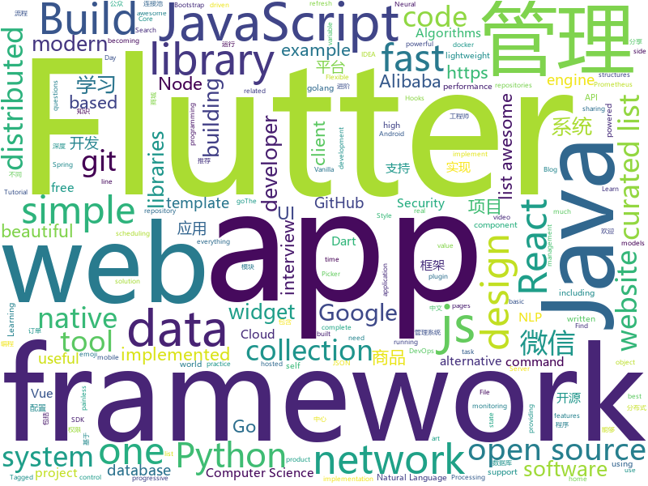

# 2018-12-29
See what the GitHub community is most excited about today.

## python
* [Super-SloMo](https://github.com/avinashpaliwal/Super-SloMo)(**409 stars today**): PyTorch implementation of Super SloMo by Jiang et al.
* [awesome-python-applications](https://github.com/mahmoud/awesome-python-applications)(**257 stars today**): 💿Free software that works great, and also happens to be open-source Python.
* [sherlock](https://github.com/sdushantha/sherlock)(**186 stars today**): 🔎Find usernames across social networks
* [HelloGitHub](https://github.com/521xueweihan/HelloGitHub)(**132 stars today**): 分享 GitHub 上有趣、入门级的开源项目，帮你找到编程的乐趣。欢迎推荐、自荐项目，让更多人知道你的项目⭐️
* [CVE-2018-8581](https://github.com/WyAtu/CVE-2018-8581)(**102 stars today**): CVE-2018-8581 | Microsoft Exchange Server Elevation of Privilege Vulnerability
* [flair](https://github.com/zalandoresearch/flair)(**76 stars today**): A very simple framework for state-of-the-art Natural Language Processing (NLP)
* [models](https://github.com/tensorflow/models)(**49 stars today**): Models and examples built with TensorFlow
* [bert](https://github.com/google-research/bert)(**59 stars today**): TensorFlow code and pre-trained models for BERT
* [vault_scanner](https://github.com/abhisharma404/vault_scanner)(**60 stars today**): swiss army knife for hackers
* [home-assistant](https://github.com/home-assistant/home-assistant)(**54 stars today**): 🏡Open source home automation that puts local control and privacy first
* [Python](https://github.com/TheAlgorithms/Python)(**49 stars today**): All Algorithms implemented in Python
* [youtube-dl](https://github.com/rg3/youtube-dl)(**46 stars today**): Command-line program to download videos from YouTube.com and other video sites
* [awesome-python](https://github.com/vinta/awesome-python)(**46 stars today**): A curated list of awesome Python frameworks, libraries, software and resources
* [keras](https://github.com/keras-team/keras)(**41 stars today**): Deep Learning for humans
* [system-design-primer](https://github.com/donnemartin/system-design-primer)(**44 stars today**): Learn how to design large-scale systems. Prep for the system design interview. Includes Anki flashcards.
* [weixin_crawler](https://github.com/wonderfulsuccess/weixin_crawler)(**47 stars today**): 高效微信公众号历史文章和阅读数据爬虫powered by scrapy
* [d2l-zh](https://github.com/d2l-ai/d2l-zh)(**43 stars today**): 《动手学深度学习》，英文版即伯克利深度学习（STAT 157，2019春）教材。面向中文读者、能运行、可讨论。
* [pytext](https://github.com/facebookresearch/pytext)(**40 stars today**): A natural language modeling framework based on PyTorch
* [django](https://github.com/django/django)(**39 stars today**): The Web framework for perfectionists with deadlines.
* [gluon-face](https://github.com/THUFutureLab/gluon-face)(**41 stars today**): An unofficial Gluon FR Toolkit for face recognition.
* [pandas](https://github.com/pandas-dev/pandas)(**35 stars today**): Flexible and powerful data analysis / manipulation library for Python, providing labeled data structures similar to R data.frame objects, statistical functions, and much more
* [Python](https://github.com/geekcomputers/Python)(**34 stars today**): My Python Examples
* [public-apis](https://github.com/toddmotto/public-apis)(**35 stars today**): A collective list of free APIs for use in software and web development.
* [MS17-010_WORAWIT](https://github.com/mez0cc/MS17-010_WORAWIT)(**30 stars today**): MS17-010: Python and Meterpreter
* [scrapy](https://github.com/scrapy/scrapy)(**32 stars today**): Scrapy, a fast high-level web crawling & scraping framework for Python.

## java
* [advanced-java](https://github.com/doocs/advanced-java)(**315 stars today**): 😮互联网 Java 工程师进阶知识完全扫盲
* [matrix](https://github.com/Tencent/matrix)(**254 stars today**): Matrix is a plugin style, non-invasive APM system developed by WeChat.
* [JavaGuide](https://github.com/Snailclimb/JavaGuide)(**142 stars today**): 【Java学习+面试指南】 一份涵盖大部分Java程序员所需要掌握的核心知识。
* [arthas](https://github.com/alibaba/arthas)(**121 stars today**): Alibaba Java Diagnostic Tool Arthas/Alibaba Java诊断利器Arthas
* [mall](https://github.com/macrozheng/mall)(**70 stars today**): mall项目是一套电商系统，包括前台商城系统及后台管理系统，基于SpringBoot+MyBatis实现。 前台商城系统包含首页门户、商品推荐、商品搜索、商品展示、购物车、订单流程、会员中心、客户服务、帮助中心等模块。 后台管理系统包含商品管理、订单管理、会员管理、促销管理、运营管理、内容管理、统计报表、财务管理、权限管理、设置等模块。
* [kob](https://github.com/LianjiaTech/kob)(**69 stars today**): 
* [java-design-patterns](https://github.com/iluwatar/java-design-patterns)(**48 stars today**): Design patterns implemented in Java
* [spring-boot](https://github.com/spring-projects/spring-boot)(**36 stars today**): Spring Boot
* [spring-cloud-alibaba](https://github.com/spring-cloud-incubator/spring-cloud-alibaba)(**40 stars today**): Spring Cloud Alibaba provides a one-stop solution for application development for the distributed solutions of Alibaba middleware.
* [hutool](https://github.com/looly/hutool)(**41 stars today**): A set of tools that keep Java sweet.
* [spring-framework](https://github.com/spring-projects/spring-framework)(**31 stars today**): Spring Framework
* [tutorials](https://github.com/eugenp/tutorials)(**26 stars today**): The "REST With Spring" Course:
* [BasePopup](https://github.com/razerdp/BasePopup)(**39 stars today**): 亲，还在为PopupWindow烦恼吗？不如试试BasePopup，你会爱上他的~
* [elasticsearch](https://github.com/elastic/elasticsearch)(**35 stars today**): Open Source, Distributed, RESTful Search Engine
* [miaosha](https://github.com/qiurunze123/miaosha)(**39 stars today**): 😮😮秒杀系统设计与实现.互联网工程师进阶与分析🙋🐓
* [apollo](https://github.com/ctripcorp/apollo)(**35 stars today**): Apollo（阿波罗）是携程框架部门研发的分布式配置中心，能够集中化管理应用不同环境、不同集群的配置，配置修改后能够实时推送到应用端，并且具备规范的权限、流程治理等特性，适用于微服务配置管理场景。
* [Java](https://github.com/TheAlgorithms/Java)(**31 stars today**): All Algorithms implemented in Java
* [Sentinel](https://github.com/alibaba/Sentinel)(**28 stars today**): A lightweight flow-control library providing high-available protection and monitoring (高可用防护的流量管理框架)
* [WxJava](https://github.com/Wechat-Group/WxJava)(**27 stars today**): WxJava （微信开发 Java SDK），支持包括微信支付、开放平台、小程序、企业微信/企业号和公众号等的后端开发
* [druid](https://github.com/alibaba/druid)(**28 stars today**): 阿里巴巴数据库事业部出品，为监控而生的数据库连接池。阿里云Data Lake Analytics(https://www.aliyun.com/product/datalakeanalytics )、DRDS、TDDL 连接池powered by Druid
* [symphony](https://github.com/b3log/symphony)(**30 stars today**): 🎶一款用 Java 实现的现代化社区（论坛/BBS/社交网络/博客）平台。https://hacpai.com
* [JCSprout](https://github.com/crossoverJie/JCSprout)(**25 stars today**): 👨‍🎓Java Core Sprout : basic, concurrent, algorithm
* [incubator-dubbo](https://github.com/apache/incubator-dubbo)(**20 stars today**): Apache Dubbo (incubating) is a high-performance, java based, open source RPC framework.
* [netty](https://github.com/netty/netty)(**24 stars today**): Netty project - an event-driven asynchronous network application framework
* [xxl-job](https://github.com/xuxueli/xxl-job)(**22 stars today**): A lightweight distributed task scheduling framework.（分布式任务调度平台XXL-JOB）

## unknown
* [spec](https://github.com/ulid/spec)(**321 stars today**): The canonical spec for ulid
* [ds-cheatsheets](https://github.com/FavioVazquez/ds-cheatsheets)(**287 stars today**): List of Data Science Cheatsheets to rule the world
* [the-book-of-secret-knowledge](https://github.com/trimstray/the-book-of-secret-knowledge)(**297 stars today**): 💫A collection of awesome lists, manuals, blogs, hacks, one-liners, cli/web tools and more. Especially for System and Network Administrators, DevOps, Pentesters or Security Researchers.
* [Best-websites-a-programmer-should-visit](https://github.com/sdmg15/Best-websites-a-programmer-should-visit)(**290 stars today**): 🔗Some useful websites for programmers.
* [GNNPapers](https://github.com/thunlp/GNNPapers)(**220 stars today**): Must-read papers on graph neural network (GNN)
* [awesome-sentence-embedding](https://github.com/Separius/awesome-sentence-embedding)(**92 stars today**): A curated list of pretrained sentence(and word) embedding models
* [awesome-golang-security](https://github.com/guardrailsio/awesome-golang-security)(**91 stars today**): Awesome golang Security resources
* [CS-Notes](https://github.com/CyC2018/CS-Notes)(**72 stars today**): 📚Computer Science Learning Notes
* [awesome](https://github.com/sindresorhus/awesome)(**71 stars today**): 😎Curated list of awesome lists
* [http3-explained](https://github.com/bagder/http3-explained)(**54 stars today**): A document describing the HTTP/3 and QUIC protocols
* [developer-roadmap](https://github.com/kamranahmedse/developer-roadmap)(**50 stars today**): Roadmap to becoming a web developer in 2018
* [FAQGURU](https://github.com/FAQGURU/FAQGURU)(**53 stars today**): 🎒🚀🎉A list of interview questions. This repository is everything you need to prepare for your technical interview.
* [free-programming-books](https://github.com/EbookFoundation/free-programming-books)(**45 stars today**): 📚Freely available programming books
* [gitignore](https://github.com/github/gitignore)(**36 stars today**): A collection of useful .gitignore templates
* [awesome-vue](https://github.com/vuejs/awesome-vue)(**44 stars today**): 🎉A curated list of awesome things related to Vue.js
* [src](https://github.com/cvkki/src)(**42 stars today**): 日常src平台域名收集
* [coding-interview-university](https://github.com/jwasham/coding-interview-university)(**34 stars today**): A complete computer science study plan to become a software engineer.
* [weekly](https://github.com/ruanyf/weekly)(**40 stars today**): 技术分享周刊，每周五发布
* [mml-book.github.io](https://github.com/mml-book/mml-book.github.io)(**32 stars today**): Companion webpage to the book "Mathematics For Machine Learning"
* [awesome-lane-detection](https://github.com/amusi/awesome-lane-detection)(**33 stars today**): lane detection
* [ClashA](https://github.com/ccg2018/ClashA)(**37 stars today**): A Android GUI for Clash
* [build-your-own-x](https://github.com/danistefanovic/build-your-own-x)(**34 stars today**): 🤓Build your own (insert technology here)
* [computer-science](https://github.com/ossu/computer-science)(**27 stars today**): 🎓Path to a free self-taught education in Computer Science!
* [IntelliJ-IDEA-Tutorial](https://github.com/judasn/IntelliJ-IDEA-Tutorial)(**25 stars today**): IntelliJ IDEA 简体中文专题教程
* [hosts](https://github.com/googlehosts/hosts)(**26 stars today**): 镜像：https://coding.net/u/scaffrey/p/hosts/git

## javascript
* [brain.js](https://github.com/BrainJS/brain.js)(**473 stars today**): 🤖Neural networks in JavaScript
* [swc](https://github.com/swc-project/swc)(**194 stars today**): Super-fast alternative for babel written in rust
* [fiddly](https://github.com/SaraVieira/fiddly)(**183 stars today**): Create beautiful and simple HTML pages from your Readme.md files
* [nodebestpractices](https://github.com/i0natan/nodebestpractices)(**140 stars today**): The largest Node.JS best practices list (November 2018)
* [Magic-Grid](https://github.com/e-oj/Magic-Grid)(**131 stars today**): A simple, lightweight Javascript library for dynamic grid layouts.
* [javascript-algorithms](https://github.com/trekhleb/javascript-algorithms)(**119 stars today**): 📝Algorithms and data structures implemented in JavaScript with explanations and links to further readings
* [vue](https://github.com/vuejs/vue)(**114 stars today**): 🖖Vue.js is a progressive, incrementally-adoptable JavaScript framework for building UI on the web.
* [dayjs](https://github.com/iamkun/dayjs)(**123 stars today**): ⏰Day.js 2KB immutable date library alternative to Moment.js with the same modern API
* [codelf](https://github.com/unbug/codelf)(**121 stars today**): Best GitHub stars, repositories tagger and organizer. Search over projects from Github, Bitbucket, Google Code, Codeplex, Sourceforge, Fedora Project, GitLab to find real-world usage variable names
* [react](https://github.com/facebook/react)(**104 stars today**): A declarative, efficient, and flexible JavaScript library for building user interfaces.
* [gatsby](https://github.com/gatsbyjs/gatsby)(**87 stars today**): Build blazing fast, modern apps and websites with React
* [33-js-concepts](https://github.com/leonardomso/33-js-concepts)(**79 stars today**): 📜33 concepts every JavaScript developer should know.
* [autoComplete.js](https://github.com/TarekRaafat/autoComplete.js)(**85 stars today**): Simple autocomplete pure vanilla Javascript library.
* [atree](https://github.com/anvaka/atree)(**67 stars today**): Just a simple Christmas tree, based on reddit story
* [free-programming-books-zh_CN](https://github.com/justjavac/free-programming-books-zh_CN)(**61 stars today**): 📚免费的计算机编程类中文书籍，欢迎投稿
* [create-react-app](https://github.com/facebook/create-react-app)(**54 stars today**): Set up a modern web app by running one command.
* [30-seconds-of-code](https://github.com/30-seconds/30-seconds-of-code)(**61 stars today**): Curated collection of useful JavaScript snippets that you can understand in 30 seconds or less.
* [taro](https://github.com/NervJS/taro)(**57 stars today**): 多端统一开发框架，支持用 React 的开发方式编写一次代码，生成能运行在微信/百度/支付宝/字节跳动小程序、H5、React Native 等的应用。 https://taro.js.org/
* [axios](https://github.com/axios/axios)(**52 stars today**): Promise based HTTP client for the browser and node.js
* [puppeteer](https://github.com/GoogleChrome/puppeteer)(**49 stars today**): Headless Chrome Node API
* [react-developer-roadmap](https://github.com/adam-golab/react-developer-roadmap)(**46 stars today**): Roadmap to becoming a React developer in 2018
* [htm](https://github.com/developit/htm)(**47 stars today**): Hyperscript Tagged Markup: JSX alternative using standard tagged templates, with compiler support.
* [javascript](https://github.com/airbnb/javascript)(**43 stars today**): JavaScript Style Guide
* [material-ui](https://github.com/mui-org/material-ui)(**41 stars today**): React components that implement Google's Material Design.
* [ice](https://github.com/alibaba/ice)(**43 stars today**): 🚀飞冰 - 让前端开发简单而友好

## html
* [NLP-progress](https://github.com/sebastianruder/NLP-progress)(**26 stars today**): Repository to track the progress in Natural Language Processing (NLP), including the datasets and the current state-of-the-art for the most common NLP tasks.
* [fastText](https://github.com/facebookresearch/fastText)(**24 stars today**): Library for fast text representation and classification.
* [ionic](https://github.com/ionic-team/ionic)(**12 stars today**): Build amazing native and progressive web apps with open web technologies. One app running on everything🎉
* [flutter-in-action](https://github.com/flutterchina/flutter-in-action)(**18 stars today**): 《Flutter实战》电子书
* [wiv.js](https://github.com/jjkaufman/wiv.js)(**17 stars today**): A library for a more wiggly div
* [styleguide](https://github.com/google/styleguide)(**10 stars today**): Style guides for Google-originated open-source projects
* [JavaScript30](https://github.com/wesbos/JavaScript30)(**12 stars today**): 30 Day Vanilla JS Challenge
* [opencvjs](https://github.com/haoking/opencvjs)(**12 stars today**): Complete opencvjs for single channel.(With the lastest OpenCV 4.0.0+)
* [qiubaiying.github.io](https://github.com/qiubaiying/qiubaiying.github.io)(**5 stars today**): BY Blog ->
* [Front-end-Developer-Interview-Questions](https://github.com/h5bp/Front-end-Developer-Interview-Questions)(**10 stars today**): A list of helpful front-end related questions you can use to interview potential candidates, test yourself or completely ignore.
* [hugo-academic](https://github.com/gcushen/hugo-academic)(**8 stars today**): The website designer for Hugo. Build and deploy a beautiful website in minutes🚀
* [zenbot](https://github.com/DeviaVir/zenbot)(**10 stars today**): Zenbot is a command-line cryptocurrency trading bot using Node.js and MongoDB.
* [javascript-tutorial-en](https://github.com/iliakan/javascript-tutorial-en)(**8 stars today**): Modern JavaScript Tutorial
* [es6.io](https://github.com/wesbos/es6.io)(**8 stars today**): 🔥Starter Files to Learn with ES6 for Everyone
* [iA-Fonts](https://github.com/iaolo/iA-Fonts)(**9 stars today**): Free variable writing fonts from iA
* [Spoon-Knife](https://github.com/octocat/Spoon-Knife)(****): This repo is for demonstration purposes only.
* [gds-way](https://github.com/alphagov/gds-way)(**7 stars today**): How we build and operate products at GDS
* [bootstrap-table](https://github.com/wenzhixin/bootstrap-table)(**7 stars today**): An extended Bootstrap table with radio, checkbox, sort, pagination, and other added features. (supports twitter bootstrap v2, v3 and v4)
* [portainer](https://github.com/portainer/portainer)(**7 stars today**): Simple management UI for Docker
* [swagger-codegen](https://github.com/swagger-api/swagger-codegen)(**6 stars today**): swagger-codegen contains a template-driven engine to generate documentation, API clients and server stubs in different languages by parsing your OpenAPI / Swagger definition.
* [www.rust-lang.org](https://github.com/rust-lang/www.rust-lang.org)(**6 stars today**): the home of the Rust website
* [react-app-rewired](https://github.com/timarney/react-app-rewired)(**6 stars today**): Override create-react-app webpack configs without ejecting
* [metasploitable3](https://github.com/rapid7/metasploitable3)(**5 stars today**): Metasploitable3 is a VM that is built from the ground up with a large amount of security vulnerabilities.
* [blog](https://github.com/lifesinger/blog)(**6 stars today**): 岁月如歌
* [cool-emoji-picker](https://github.com/kevinfaguiar/cool-emoji-picker)(**6 stars today**): Cool Emoji Picker - A fast plug-n-play [Tw]emoji Picker (+textarea for Twemoji rendering) for Vue.

## dart
* [HistoryOfEverything](https://github.com/2d-inc/HistoryOfEverything)(**709 stars today**): Flutter Launch Timeline Demo
* [flutter](https://github.com/flutter/flutter)(**134 stars today**): Flutter makes it easy and fast to build beautiful mobile apps.
* [flutter-ui-nice](https://github.com/nb312/flutter-ui-nice)(**61 stars today**): More than 130+ pages in this beautiful app and more than 45 developers has contributed to it.
* [awesome-flutter](https://github.com/Solido/awesome-flutter)(**43 stars today**): An awesome list that curates the best Flutter libraries, tools, tutorials, articles and more.
* [Flutter_shop](https://github.com/MissYoung/Flutter_shop)(**36 stars today**): 全网最全flutter 学习案例 仿闲鱼（开源版）
* [plugins](https://github.com/flutter/plugins)(**26 stars today**): Plugins for Flutter, including FlutterFire, maintained by the Flutter team
* [FlutterExampleApps](https://github.com/iampawan/FlutterExampleApps)(**22 stars today**): [Example APPS] Basic Flutter apps, for flutter devs.
* [password_animation](https://github.com/tunitowen/password_animation)(**18 stars today**): Flutter app to demonstrate password validation design idea
* [Flutter-Notebook](https://github.com/OpenFlutter/Flutter-Notebook)(**17 stars today**): 日更的FlutterDemo合集，今天你fu了吗
* [Flare-Flutter](https://github.com/2d-inc/Flare-Flutter)(**17 stars today**): 
* [bloc](https://github.com/felangel/bloc)(**14 stars today**): A collection of packages that help implement the BLoC design pattern
* [samples](https://github.com/flutter/samples)(**13 stars today**): A collection of Flutter examples and demos.
* [inKino](https://github.com/roughike/inKino)(**11 stars today**): A multiplatform Dart movie app with 40% of code sharing between Flutter and the Web.
* [dio](https://github.com/flutterchina/dio)(**11 stars today**): A powerful Http client for Dart, which supports Interceptors, FormData, Request Cancellation, File Downloading, Timeout etc.
* [flutter-things-todo](https://github.com/nacasha/flutter-things-todo)(**10 stars today**): An example Todo App using Flutter with advanced features
* [flame](https://github.com/luanpotter/flame)(**9 stars today**): A minimalist Flutter game engine
* [flutter-osc](https://github.com/yubo725/flutter-osc)(**8 stars today**): 基于Google Flutter的开源中国客户端，支持Android和iOS。
* [flutter_catalog](https://github.com/X-Wei/flutter_catalog)(**8 stars today**): An app showcasing Flutter components, with side-by-side source code view.
* [Liquid-Pull-To-Refresh](https://github.com/aagarwal1012/Liquid-Pull-To-Refresh)(**8 stars today**): 🔁A custom refresh indicator for flutter.
* [sdk](https://github.com/dart-lang/sdk)(**7 stars today**): The Dart SDK, including the VM, dart2js, core libraries, and more.
* [flutter_easyrefresh](https://github.com/xuelongqy/flutter_easyrefresh)(**6 stars today**): A widget provided to the flutter scroll component drop-down refresh and pull up load.
* [flutter_firebase](https://github.com/dvmjoshi/flutter_firebase)(**5 stars today**): Flutter UI with different widgets and firebase authentication email and gmail
* [flutter_hooks](https://github.com/rrousselGit/flutter_hooks)(**6 stars today**): A flutter implementation of React hooks. Hooks are a new kind of object that manages a Widget life-cycles. They exists for one reason: increase the code sharing between widgets and as a complete replacement for StatefulWidget.
* [page-transformer](https://github.com/roughike/page-transformer)(**5 stars today**): A sample for having PageView transformation effects in Flutter.
* [udacity-course](https://github.com/flutter/udacity-course)(****): Build native mobile apps with Flutter

## go
* [gitbatch](https://github.com/isacikgoz/gitbatch)(**193 stars today**): manage your git repositories in one place
* [kubernetes](https://github.com/kubernetes/kubernetes)(**161 stars today**): Production-Grade Container Scheduling and Management
* [netcap](https://github.com/dreadl0ck/netcap)(**50 stars today**): A framework for secure and scalable network traffic analysis
* [go](https://github.com/golang/go)(**45 stars today**): The Go programming language
* [gin](https://github.com/gin-gonic/gin)(**40 stars today**): Gin is a HTTP web framework written in Go (Golang). It features a Martini-like API with much better performance -- up to 40 times faster. If you need smashing performance, get yourself some Gin.
* [photoprism](https://github.com/photoprism/photoprism)(**39 stars today**): Personal photo management powered by Go and Google TensorFlow
* [loki](https://github.com/grafana/loki)(**37 stars today**): Like Prometheus, but for logs.
* [awesome-go](https://github.com/avelino/awesome-go)(**33 stars today**): A curated list of awesome Go frameworks, libraries and software
* [tidb](https://github.com/pingcap/tidb)(**32 stars today**): TiDB is a distributed HTAP database compatible with the MySQL protocol
* [gitea](https://github.com/go-gitea/gitea)(**30 stars today**): Git with a cup of tea, painless self-hosted git service
* [hugo](https://github.com/gohugoio/hugo)(**31 stars today**): The world’s fastest framework for building websites.
* [build-web-application-with-golang](https://github.com/astaxie/build-web-application-with-golang)(**28 stars today**): A golang ebook intro how to build a web with golang
* [etcd](https://github.com/etcd-io/etcd)(**27 stars today**): Distributed reliable key-value store for the most critical data of a distributed system
* [tldr](https://github.com/isacikgoz/tldr)(**30 stars today**): fast and interactive tldr client written with go
* [prometheus](https://github.com/prometheus/prometheus)(**28 stars today**): The Prometheus monitoring system and time series database.
* [cockroach](https://github.com/cockroachdb/cockroach)(**28 stars today**): CockroachDB - the open source, cloud-native SQL database.
* [docker_practice](https://github.com/yeasy/docker_practice)(**27 stars today**): Learn and understand Docker technologies, with real DevOps practice!
* [amazonriver](https://github.com/hellobike/amazonriver)(**28 stars today**): 
* [v2ray-core](https://github.com/v2ray/v2ray-core)(**27 stars today**): A platform for building proxies to bypass network restrictions.
* [gogs](https://github.com/gogs/gogs)(**26 stars today**): Gogs is a painless self-hosted Git service.
* [txqr](https://github.com/divan/txqr)(**26 stars today**): Transfer data via animated QR codes
* [gjson](https://github.com/tidwall/gjson)(**26 stars today**): Get JSON values quickly - JSON Parser for Go
* [traefik](https://github.com/containous/traefik)(**25 stars today**): The Cloud Native Edge Router
* [dive](https://github.com/wagoodman/dive)(**24 stars today**): A tool for exploring each layer in a docker image
* [lazygit](https://github.com/jesseduffield/lazygit)(**25 stars today**): simple terminal UI for git commands

## WordCloud

