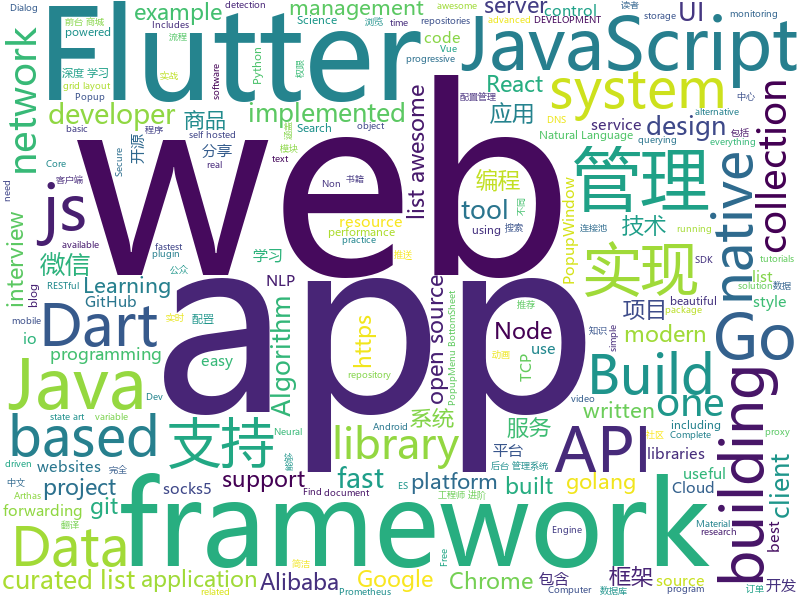

# 2018-12-30
See what the GitHub community is most excited about today.

## python
* [Super-SloMo](https://github.com/avinashpaliwal/Super-SloMo)(**166 stars today**): PyTorch implementation of Super SloMo by Jiang et al.
* [awesome-python-applications](https://github.com/mahmoud/awesome-python-applications)(**127 stars today**): 💿Free software that works great, and also happens to be open-source Python.
* [sherlock](https://github.com/sdushantha/sherlock)(**118 stars today**): 🔎Find usernames across social networks
* [inter](https://github.com/rsms/inter)(**105 stars today**): The Inter UI font family
* [HelloGitHub](https://github.com/521xueweihan/HelloGitHub)(**69 stars today**): 分享 GitHub 上有趣、入门级的开源项目，帮你找到编程的乐趣。欢迎推荐、自荐项目，让更多人知道你的项目⭐️
* [models](https://github.com/tensorflow/models)(**46 stars today**): Models and examples built with TensorFlow
* [bert](https://github.com/google-research/bert)(**53 stars today**): TensorFlow code and pre-trained models for BERT
* [home-assistant](https://github.com/home-assistant/home-assistant)(**49 stars today**): 🏡Open source home automation that puts local control and privacy first
* [Python](https://github.com/TheAlgorithms/Python)(**49 stars today**): All Algorithms implemented in Python
* [weixin_crawler](https://github.com/wonderfulsuccess/weixin_crawler)(**48 stars today**): 高效微信公众号历史文章和阅读数据爬虫powered by scrapy
* [Python](https://github.com/geekcomputers/Python)(**42 stars today**): My Python Examples
* [keras](https://github.com/keras-team/keras)(**38 stars today**): Deep Learning for humans
* [XSStrike](https://github.com/s0md3v/XSStrike)(**42 stars today**): Most advanced XSS detection suite.
* [faceswap](https://github.com/deepfakes/faceswap)(**35 stars today**): Non official project based on original /r/Deepfakes thread. Many thanks to him!
* [gluon-face](https://github.com/THUFutureLab/gluon-face)(**36 stars today**): An unofficial Gluon FR Toolkit for face recognition.
* [pytext](https://github.com/facebookresearch/pytext)(**36 stars today**): A natural language modeling framework based on PyTorch
* [django](https://github.com/django/django)(**27 stars today**): The Web framework for perfectionists with deadlines.
* [d2l-zh](https://github.com/d2l-ai/d2l-zh)(**31 stars today**): 《动手学深度学习》，英文版即伯克利深度学习（STAT 157，2019春）教材。面向中文读者、能运行、可讨论。
* [system-design-primer](https://github.com/donnemartin/system-design-primer)(**27 stars today**): Learn how to design large-scale systems. Prep for the system design interview. Includes Anki flashcards.
* [Detectron](https://github.com/facebookresearch/Detectron)(**27 stars today**): FAIR's research platform for object detection research, implementing popular algorithms like Mask R-CNN and RetinaNet.
* [CVE-2018-14442](https://github.com/payatu/CVE-2018-14442)(**26 stars today**): PoC for Foxit Reader CVE-2018-14442
* [youtube-dl](https://github.com/rg3/youtube-dl)(**29 stars today**): Command-line program to download videos from YouTube.com and other video sites
* [AiLearning](https://github.com/apachecn/AiLearning)(**25 stars today**): AiLearning: 机器学习 - MachineLearning - ML、深度学习 - DeepLearning - DL、自然语言处理 NLP
* [flair](https://github.com/zalandoresearch/flair)(**26 stars today**): A very simple framework for state-of-the-art Natural Language Processing (NLP)
* [vault_scanner](https://github.com/abhisharma404/vault_scanner)(**24 stars today**): swiss army knife for hackers

## java
* [advanced-java](https://github.com/doocs/advanced-java)(**312 stars today**): 😮互联网 Java 工程师进阶知识完全扫盲
* [matrix](https://github.com/Tencent/matrix)(**140 stars today**): Matrix is a plugin style, non-invasive APM system developed by WeChat.
* [JavaGuide](https://github.com/Snailclimb/JavaGuide)(**112 stars today**): 【Java学习+面试指南】 一份涵盖大部分Java程序员所需要掌握的核心知识。
* [mall](https://github.com/macrozheng/mall)(**87 stars today**): mall项目是一套电商系统，包括前台商城系统及后台管理系统，基于SpringBoot+MyBatis实现。 前台商城系统包含首页门户、商品推荐、商品搜索、商品展示、购物车、订单流程、会员中心、客户服务、帮助中心等模块。 后台管理系统包含商品管理、订单管理、会员管理、促销管理、运营管理、内容管理、统计报表、财务管理、权限管理、设置等模块。
* [arthas](https://github.com/alibaba/arthas)(**82 stars today**): Alibaba Java Diagnostic Tool Arthas/Alibaba Java诊断利器Arthas
* [tech-weekly](https://github.com/mercyblitz/tech-weekly)(**77 stars today**): 「小马哥技术周报」
* [gravitee-gateway](https://github.com/gravitee-io/gravitee-gateway)(**76 stars today**): Gravitee.io - API Management - Gateway
* [spring-boot](https://github.com/spring-projects/spring-boot)(**37 stars today**): Spring Boot
* [spring-cloud-alibaba](https://github.com/spring-cloud-incubator/spring-cloud-alibaba)(**38 stars today**): Spring Cloud Alibaba provides a one-stop solution for application development for the distributed solutions of Alibaba middleware.
* [Java](https://github.com/TheAlgorithms/Java)(**35 stars today**): All Algorithms implemented in Java
* [miaosha](https://github.com/qiurunze123/miaosha)(**33 stars today**): 😮😮秒杀系统设计与实现.互联网工程师进阶与分析🙋🐓
* [java-design-patterns](https://github.com/iluwatar/java-design-patterns)(**35 stars today**): Design patterns implemented in Java
* [Sentinel](https://github.com/alibaba/Sentinel)(**33 stars today**): A lightweight flow-control library providing high-available protection and monitoring (高可用防护的流量管理框架)
* [JCSprout](https://github.com/crossoverJie/JCSprout)(**27 stars today**): 👨‍🎓Java Core Sprout : basic, concurrent, algorithm
* [spring-framework](https://github.com/spring-projects/spring-framework)(**24 stars today**): Spring Framework
* [sirix](https://github.com/sirixdb/sirix)(**32 stars today**): Sirix facilitates effective and efficient storing and querying of your temporal data through snapshotting and a novel versioning approach called sliding snapshot. Currently we support the storage and querying of XML-documents in our binary format through a RESTful-API, an XQuery-API and a low-level cursor based API. We aim to support JSON next.
* [XPopup](https://github.com/li-xiaojun/XPopup)(**30 stars today**): 🔥功能强大，UI简洁，交互优雅的通用弹窗！可以替代Dialog，PopupWindow，PopupMenu，BottomSheet，DrawerLayout等组件，自带十几种效果良好的动画， 支持完全的UI和动画自定义！(Powerful and Beautiful Popup，can absolutely replace Dialog，PopupWindow，PopupMenu，BottomSheet，DrawerLayout. With built-in animators , very easy to custom Popup View.)
* [symphony](https://github.com/b3log/symphony)(**30 stars today**): 🎶一款用 Java 实现的现代化社区（论坛/BBS/社交网络/博客）平台。https://hacpai.com
* [elasticsearch](https://github.com/elastic/elasticsearch)(**26 stars today**): Open Source, Distributed, RESTful Search Engine
* [BasePopup](https://github.com/razerdp/BasePopup)(**29 stars today**): 亲，还在为PopupWindow烦恼吗？不如试试BasePopup，你会爱上他的~
* [druid](https://github.com/alibaba/druid)(**25 stars today**): 阿里巴巴数据库事业部出品，为监控而生的数据库连接池。阿里云Data Lake Analytics(https://www.aliyun.com/product/datalakeanalytics )、DRDS、TDDL 连接池powered by Druid
* [apollo](https://github.com/ctripcorp/apollo)(**22 stars today**): Apollo（阿波罗）是携程框架部门研发的分布式配置中心，能够集中化管理应用不同环境、不同集群的配置，配置修改后能够实时推送到应用端，并且具备规范的权限、流程治理等特性，适用于微服务配置管理场景。
* [nacos](https://github.com/alibaba/nacos)(**20 stars today**): an easy-to-use dynamic service discovery, configuration and service management platform for building cloud native applications(更易于构建云原生应用的动态服务发现、配置管理和服务管理平台)
* [tutorials](https://github.com/eugenp/tutorials)(**18 stars today**): The "REST With Spring" Course:
* [WxJava](https://github.com/Wechat-Group/WxJava)(**23 stars today**): WxJava （微信开发 Java SDK），支持包括微信支付、开放平台、小程序、企业微信/企业号和公众号等的后端开发

## unknown
* [Best-websites-a-programmer-should-visit](https://github.com/sdmg15/Best-websites-a-programmer-should-visit)(**254 stars today**): 🔗Some useful websites for programmers.
* [EmojiPackage](https://github.com/getActivity/EmojiPackage)(**199 stars today**): A rich emoji package resources
* [the-book-of-secret-knowledge](https://github.com/trimstray/the-book-of-secret-knowledge)(**155 stars today**): 💫A collection of awesome lists, manuals, blogs, hacks, one-liners, cli/web tools and more. Especially for System and Network Administrators, DevOps, Pentesters or Security Researchers.
* [ds-cheatsheets](https://github.com/FavioVazquez/ds-cheatsheets)(**149 stars today**): List of Data Science Cheatsheets to rule the world
* [spec](https://github.com/ulid/spec)(**148 stars today**): The canonical spec for ulid
* [GNNPapers](https://github.com/thunlp/GNNPapers)(**130 stars today**): Must-read papers on graph neural networks (GNN)
* [Flutter-for-Android-developers](https://github.com/m3sv/Flutter-for-Android-developers)(**121 stars today**): Compilation of Flutter materials for Android developers
* [CS-Notes](https://github.com/CyC2018/CS-Notes)(**72 stars today**): 📚Computer Science Learning Notes
* [awesome-sentence-embedding](https://github.com/Separius/awesome-sentence-embedding)(**57 stars today**): A curated list of pretrained sentence(and word) embedding models
* [coding-interview-university](https://github.com/jwasham/coding-interview-university)(**48 stars today**): A complete computer science study plan to become a software engineer.
* [awesome](https://github.com/sindresorhus/awesome)(**46 stars today**): 😎Curated list of awesome lists
* [gitignore](https://github.com/github/gitignore)(**36 stars today**): A collection of useful .gitignore templates
* [project-based-learning](https://github.com/tuvtran/project-based-learning)(**39 stars today**): Curated list of project-based tutorials
* [weekly](https://github.com/ruanyf/weekly)(**41 stars today**): 技术分享周刊，每周五发布
* [developer-roadmap](https://github.com/kamranahmedse/developer-roadmap)(**36 stars today**): Roadmap to becoming a web developer in 2019
* [free-programming-books](https://github.com/EbookFoundation/free-programming-books)(**34 stars today**): 📚Freely available programming books
* [http3-explained](https://github.com/bagder/http3-explained)(**32 stars today**): A document describing the HTTP/3 and QUIC protocols
* [SPW](https://github.com/Gameboypi/SPW)(**31 stars today**): Gameboy SP Raspberry pi board
* [awesome-operators](https://github.com/operator-framework/awesome-operators)(**29 stars today**): A resource tracking a number of Operators out in the wild.
* [build-your-own-x](https://github.com/danistefanovic/build-your-own-x)(**31 stars today**): 🤓Build your own (insert technology here)
* [FAQGURU](https://github.com/FAQGURU/FAQGURU)(**28 stars today**): 🎒🚀🎉A list of interview questions. This repository is everything you need to prepare for your technical interview.
* [gold-miner](https://github.com/xitu/gold-miner)(**28 stars today**): 🥇掘金翻译计划，可能是世界最大最好的英译中技术社区，最懂读者和译者的翻译平台：
* [awesome-vue](https://github.com/vuejs/awesome-vue)(**25 stars today**): 🎉A curated list of awesome things related to Vue.js
* [IntelliJ-IDEA-Tutorial](https://github.com/judasn/IntelliJ-IDEA-Tutorial)(**25 stars today**): IntelliJ IDEA 简体中文专题教程
* [LEGO-EV3-Image-Scanner](https://github.com/javiercordero/LEGO-EV3-Image-Scanner)(**24 stars today**): Image scanner built using a LEGO Mindstorms EV3 set and an extra wheel. Includes source and build instructions.

## javascript
* [brain.js](https://github.com/BrainJS/brain.js)(**402 stars today**): 🤖Neural networks in JavaScript
* [nodebestpractices](https://github.com/i0natan/nodebestpractices)(**138 stars today**): The largest Node.JS best practices list (November 2018)
* [dayjs](https://github.com/iamkun/dayjs)(**113 stars today**): ⏰Day.js 2KB immutable date library alternative to Moment.js with the same modern API
* [vue](https://github.com/vuejs/vue)(**103 stars today**): 🖖Vue.js is a progressive, incrementally-adoptable JavaScript framework for building UI on the web.
* [javascript-algorithms](https://github.com/trekhleb/javascript-algorithms)(**81 stars today**): 📝Algorithms and data structures implemented in JavaScript with explanations and links to further readings
* [swc](https://github.com/swc-project/swc)(**84 stars today**): Super-fast alternative for babel written in rust
* [react](https://github.com/facebook/react)(**67 stars today**): A declarative, efficient, and flexible JavaScript library for building user interfaces.
* [taro](https://github.com/NervJS/taro)(**57 stars today**): 多端统一开发框架，支持用 React 的开发方式编写一次代码，生成能运行在微信/百度/支付宝/字节跳动小程序、H5、React Native 等的应用。 https://taro.js.org/
* [create-react-app](https://github.com/facebook/create-react-app)(**48 stars today**): Set up a modern web app by running one command.
* [Magic-Grid](https://github.com/e-oj/Magic-Grid)(**54 stars today**): A simple, lightweight Javascript library for dynamic grid layouts.
* [free-programming-books-zh_CN](https://github.com/justjavac/free-programming-books-zh_CN)(**49 stars today**): 📚免费的计算机编程类中文书籍，欢迎投稿
* [codelf](https://github.com/unbug/codelf)(**50 stars today**): Best GitHub stars, repositories tagger and organizer. Search over projects from Github, Bitbucket, Google Code, Codeplex, Sourceforge, Fedora Project, GitLab to find real-world usage variable names
* [puppeteer](https://github.com/GoogleChrome/puppeteer)(**48 stars today**): Headless Chrome Node API
* [overreacted.io](https://github.com/gaearon/overreacted.io)(**43 stars today**): Personal blog by Dan Abramov.
* [three.js](https://github.com/mrdoob/three.js)(**42 stars today**): JavaScript 3D library.
* [gatsby](https://github.com/gatsbyjs/gatsby)(**39 stars today**): Build blazing fast, modern apps and websites with React
* [node](https://github.com/nodejs/node)(**40 stars today**): Node.js JavaScript runtime✨🐢🚀✨
* [axios](https://github.com/axios/axios)(**44 stars today**): Promise based HTTP client for the browser and node.js
* [rollup](https://github.com/rollup/rollup)(**45 stars today**): Next-generation ES module bundler
* [33-js-concepts](https://github.com/leonardomso/33-js-concepts)(**42 stars today**): 📜33 concepts every JavaScript developer should know.
* [javascript](https://github.com/airbnb/javascript)(**42 stars today**): JavaScript Style Guide
* [ant-design-pro](https://github.com/ant-design/ant-design-pro)(**36 stars today**): 👨🏻‍💻👩🏻‍💻 Use Ant Design like a Pro!
* [30-seconds-of-code](https://github.com/30-seconds/30-seconds-of-code)(**37 stars today**): Curated collection of useful JavaScript snippets that you can understand in 30 seconds or less.
* [next](https://github.com/alibaba-fusion/next)(**37 stars today**): A configurable component library for web built on React.
* [react-native](https://github.com/facebook/react-native)(**34 stars today**): A framework for building native apps with React.

## html
* [DoomFirePSX](https://github.com/fabiensanglard/DoomFirePSX)(**45 stars today**): Fire effect from Doom PSX/Nintendo64
* [Machine-Learning-in-Action-Python3](https://github.com/wzy6642/Machine-Learning-in-Action-Python3)(**38 stars today**): 《机器学习实战》python3源码
* [NLP-progress](https://github.com/sebastianruder/NLP-progress)(**33 stars today**): Repository to track the progress in Natural Language Processing (NLP), including the datasets and the current state-of-the-art for the most common NLP tasks.
* [iA-Fonts](https://github.com/iaolo/iA-Fonts)(**23 stars today**): Free variable writing fonts from iA
* [java-books-collections](https://github.com/wangen2009/java-books-collections)(**20 stars today**): Java相关的编程藏书书籍收集分享。Java programming books collection to share.🚀
* [node_passport_login](https://github.com/bradtraversy/node_passport_login)(**12 stars today**): Node.js login, registration and access control using Express and Passport
* [styleguide](https://github.com/google/styleguide)(**14 stars today**): Style guides for Google-originated open-source projects
* [fastText](https://github.com/facebookresearch/fastText)(**14 stars today**): Library for fast text representation and classification.
* [opencvjs](https://github.com/haoking/opencvjs)(**14 stars today**): Complete opencvjs for single channel.(With the lastest OpenCV 4.0.0+)
* [flutter-in-action](https://github.com/flutterchina/flutter-in-action)(**11 stars today**): 《Flutter实战》电子书
* [javascript-tutorial-en](https://github.com/iliakan/javascript-tutorial-en)(**12 stars today**): Modern JavaScript Tutorial
* [portainer](https://github.com/portainer/portainer)(**12 stars today**): Simple management UI for Docker
* [JavaScript30](https://github.com/wesbos/JavaScript30)(**8 stars today**): 30 Day Vanilla JS Challenge
* [qiubaiying.github.io](https://github.com/qiubaiying/qiubaiying.github.io)(**5 stars today**): BY Blog ->
* [swagger-codegen](https://github.com/swagger-api/swagger-codegen)(**8 stars today**): swagger-codegen contains a template-driven engine to generate documentation, API clients and server stubs in different languages by parsing your OpenAPI / Swagger definition.
* [Spoon-Knife](https://github.com/octocat/Spoon-Knife)(****): This repo is for demonstration purposes only.
* [Front-end-Developer-Interview-Questions](https://github.com/h5bp/Front-end-Developer-Interview-Questions)(**6 stars today**): A list of helpful front-end related questions you can use to interview potential candidates, test yourself or completely ignore.
* [ionic](https://github.com/ionic-team/ionic)(**6 stars today**): Build amazing native and progressive web apps with open web technologies. One app running on everything🎉
* [awesome-competitive-programming](https://github.com/lnishan/awesome-competitive-programming)(**6 stars today**): 💎A curated list of awesome Competitive Programming, Algorithm and Data Structure resources
* [masonry](https://github.com/desandro/masonry)(**6 stars today**): 🏩Cascading grid layout plugin
* [vimways.org](https://github.com/vim-advent-calendar/vimways.org)(**6 stars today**): vimways.org
* [McLighting](https://github.com/toblum/McLighting)(**5 stars today**): The ESP8266 based multi-client lighting gadget
* [DIGITS](https://github.com/NVIDIA/DIGITS)(**5 stars today**): Deep Learning GPU Training System
* [java-bible](https://github.com/biezhi/java-bible)(**5 stars today**): 🍌我的技术摘要
* [blog](https://github.com/lifesinger/blog)(**5 stars today**): 岁月如歌

## dart
* [HistoryOfEverything](https://github.com/2d-inc/HistoryOfEverything)(**277 stars today**): Flutter Launch Timeline Demo
* [flutter](https://github.com/flutter/flutter)(**97 stars today**): Flutter makes it easy and fast to build beautiful mobile apps.
* [awesome-flutter](https://github.com/Solido/awesome-flutter)(**49 stars today**): An awesome list that curates the best Flutter libraries, tools, tutorials, articles and more.
* [flutter-ui-nice](https://github.com/nb312/flutter-ui-nice)(**29 stars today**): More than 130+ pages in this beautiful app and more than 45 developers has contributed to it.
* [flutter_gank](https://github.com/lijinshanmx/flutter_gank)(**22 stars today**): 🔥「干货集中营」是一款注重体验的 Gank.io 官方客户端，App整体秉承Material简洁风格，包含搜索，收藏，提交干货，按期浏览、分类浏览等功能，还有漂亮的妹纸等你哦，快来下载吧~。
* [plugins](https://github.com/flutter/plugins)(**17 stars today**): Plugins for Flutter, including FlutterFire, maintained by the Flutter team
* [dio](https://github.com/flutterchina/dio)(**18 stars today**): A powerful Http client for Dart, which supports Interceptors, FormData, Request Cancellation, File Downloading, Timeout etc.
* [FlutterExampleApps](https://github.com/iampawan/FlutterExampleApps)(**13 stars today**): [Example APPS] Basic Flutter apps, for flutter devs.
* [flutter-osc](https://github.com/yubo725/flutter-osc)(**9 stars today**): 基于Google Flutter的开源中国客户端，支持Android和iOS。
* [Flutter-Notebook](https://github.com/OpenFlutter/Flutter-Notebook)(**9 stars today**): 日更的FlutterDemo合集，今天你fu了吗
* [Flare-Flutter](https://github.com/2d-inc/Flare-Flutter)(**8 stars today**): 
* [bloc](https://github.com/felangel/bloc)(**7 stars today**): A collection of packages that help implement the BLoC design pattern
* [udacity-course](https://github.com/flutter/udacity-course)(**5 stars today**): Build native mobile apps with Flutter
* [flutter_layout](https://github.com/nb312/flutter_layout)(**6 stars today**): Layout of the flutter example.such as Row,Comlun,listview,Just for learning.
* [inKino](https://github.com/roughike/inKino)(**5 stars today**): A multiplatform Dart movie app with 40% of code sharing between Flutter and the Web.
* [flutter-things-todo](https://github.com/nacasha/flutter-things-todo)(**6 stars today**): An example Todo App using Flutter with advanced features
* [website](https://github.com/flutter/website)(**5 stars today**): Flutter web site
* [angel](https://github.com/angel-dart/angel)(**5 stars today**): A batteries-included, full-stack Web server framework for Dart. (Application boilerplate)
* [site-www](https://github.com/dart-lang/site-www)(****): Source for Dart website
* [flutter_programs](https://github.com/AseemWangoo/flutter_programs)(****): Samples for flutter programs
* [flutter-search-bar](https://github.com/ArcticZeroo/flutter-search-bar)(****): (mostly) Automatic search-enabled appBar for flutter
* [dart-sass](https://github.com/sass/dart-sass)(****): The reference implementation of Sass, written in Dart.
* [zefyr](https://github.com/memspace/zefyr)(****): Soft and gentle rich text editing for Flutter applications.
* [chromedeveditor](https://github.com/googlearchive/chromedeveditor)(****): Chrome Dev Editor is a developer tool for building apps on the Chrome platform - Chrome Apps and Web Apps, in JavaScript or Dart. (NO LONGER IN ACTIVE DEVELOPMENT)
* [sdk](https://github.com/dart-lang/sdk)(****): The Dart SDK, including the VM, dart2js, core libraries, and more.

## go
* [gitbatch](https://github.com/isacikgoz/gitbatch)(**88 stars today**): manage your git repositories in one place
* [kubernetes](https://github.com/kubernetes/kubernetes)(**56 stars today**): Production-Grade Container Scheduling and Management
* [gravity](https://github.com/moiot/gravity)(**52 stars today**): A Data Replication Center
* [gin](https://github.com/gin-gonic/gin)(**36 stars today**): Gin is a HTTP web framework written in Go (Golang). It features a Martini-like API with much better performance -- up to 40 times faster. If you need smashing performance, get yourself some Gin.
* [go](https://github.com/golang/go)(**33 stars today**): The Go programming language
* [dive](https://github.com/wagoodman/dive)(**33 stars today**): A tool for exploring each layer in a docker image
* [awesome-go](https://github.com/avelino/awesome-go)(**30 stars today**): A curated list of awesome Go frameworks, libraries and software
* [loki](https://github.com/grafana/loki)(**29 stars today**): Like Prometheus, but for logs.
* [netcap](https://github.com/dreadl0ck/netcap)(**28 stars today**): A framework for secure and scalable network traffic analysis
* [build-web-application-with-golang](https://github.com/astaxie/build-web-application-with-golang)(**24 stars today**): A golang ebook intro how to build a web with golang
* [goproxy](https://github.com/snail007/goproxy)(**23 stars today**): Proxy is a high performance HTTP(S), websocket, TCP, UDP,Secure DNS, Socks5 proxy server implemented by golang. Now, it supports chain-style proxies,nat forwarding in different lan,TCP/UDP port forwarding, SSH forwarding.Proxy是golang实现的高性能http,https,websocket,tcp,防污染DNS,socks5代理服务器,支持内网穿透,链式代理,通讯加密,智能HTTP,SOCKS5代理,域名黑白名单,跨平台,KCP协议支持,集成外部API。
* [gitea](https://github.com/go-gitea/gitea)(**23 stars today**): Git with a cup of tea, painless self-hosted git service
* [docker_practice](https://github.com/yeasy/docker_practice)(**20 stars today**): Learn and understand Docker technologies, with real DevOps practice!
* [go-push](https://github.com/owenliang/go-push)(**21 stars today**): 用GO做推送
* [v2ray-core](https://github.com/v2ray/v2ray-core)(**19 stars today**): A platform for building proxies to bypass network restrictions.
* [iris](https://github.com/kataras/iris)(**19 stars today**): The fastest backend community-driven web framework on (THIS) Earth. HTTP/2, MVC and more. Can your favourite web framework do that?👉http://bit.ly/iriscandothat1 or even http://bit.ly/iriscandothat2
* [hugo](https://github.com/gohugoio/hugo)(**19 stars today**): The world’s fastest framework for building websites.
* [tldr](https://github.com/isacikgoz/tldr)(**18 stars today**): fast and interactive tldr client written with go
* [advanced-go-programming-book](https://github.com/chai2010/advanced-go-programming-book)(**16 stars today**): 📚《Go语言高级编程》开源图书，涵盖CGO、Go汇编语言、RPC实现、Protobuf插件实现、Web框架实现、分布式系统等高阶主题(完稿)
* [traefik](https://github.com/containous/traefik)(**18 stars today**): The Cloud Native Edge Router
* [photoprism](https://github.com/photoprism/photoprism)(**18 stars today**): Personal photo management powered by Go and Google TensorFlow
* [gogs](https://github.com/gogs/gogs)(**15 stars today**): Gogs is a painless self-hosted Git service.
* [minio](https://github.com/minio/minio)(**15 stars today**): Minio is an open source object storage server compatible with Amazon S3 APIs
* [prometheus](https://github.com/prometheus/prometheus)(**13 stars today**): The Prometheus monitoring system and time series database.
* [amazonriver](https://github.com/hellobike/amazonriver)(**15 stars today**): amazonriver 是一个将postgresql的实时数据同步到es或kafka的服务

## WordCloud

