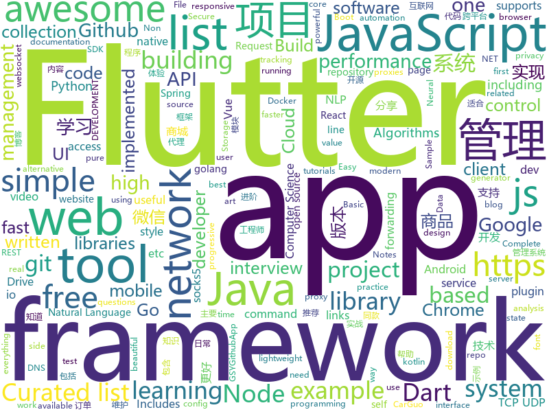

# 2018-12-31
See what the GitHub community is most excited about today.

## python
* [inter](https://github.com/rsms/inter)(**309 stars today**): The Inter UI font family
* [awesome-python-applications](https://github.com/mahmoud/awesome-python-applications)(**120 stars today**): 💿Free software that works great, and also happens to be open-source Python.
* [sherlock](https://github.com/sdushantha/sherlock)(**98 stars today**): 🔎Find usernames across social networks
* [byob](https://github.com/malwaredllc/byob)(**65 stars today**): BYOB (Build Your Own Botnet)
* [Super-SloMo](https://github.com/avinashpaliwal/Super-SloMo)(**55 stars today**): PyTorch implementation of Super SloMo by Jiang et al.
* [faceswap](https://github.com/deepfakes/faceswap)(**47 stars today**): Non official project based on original /r/Deepfakes thread. Many thanks to him!
* [awesome-python](https://github.com/vinta/awesome-python)(**39 stars today**): A curated list of awesome Python frameworks, libraries, software and resources
* [system-design-primer](https://github.com/donnemartin/system-design-primer)(**35 stars today**): Learn how to design large-scale systems. Prep for the system design interview. Includes Anki flashcards.
* [DeepFaceLab](https://github.com/iperov/DeepFaceLab)(**39 stars today**): DeepFaceLab is a tool that utilizes deep learning to recognize and swap faces in pictures and videos. Includes prebuilt ready to work standalone Windows 7,8,10 binary (look readme.md).
* [Python](https://github.com/TheAlgorithms/Python)(**38 stars today**): All Algorithms implemented in Python
* [home-assistant](https://github.com/home-assistant/home-assistant)(**33 stars today**): 🏡Open source home automation that puts local control and privacy first
* [rlkit](https://github.com/vitchyr/rlkit)(**34 stars today**): Collection of reinforcement learning algorithms
* [toolkit](https://github.com/got-10k/toolkit)(**34 stars today**): Official Python toolkit for generic object tracking benchmark GOT-10k
* [youtube-dl](https://github.com/rg3/youtube-dl)(**30 stars today**): Command-line program to download videos from YouTube.com and other video sites
* [models](https://github.com/tensorflow/models)(**28 stars today**): Models and examples built with TensorFlow
* [HelloGitHub](https://github.com/521xueweihan/HelloGitHub)(**31 stars today**): 分享 GitHub 上有趣、入门级的开源项目，帮你找到编程的乐趣。欢迎推荐、自荐项目，让更多人知道你的项目⭐️
* [django](https://github.com/django/django)(**27 stars today**): The Web framework for perfectionists with deadlines.
* [drive-cli](https://github.com/nurdtechie98/drive-cli)(**30 stars today**): A command line interface for accessing google drive
* [flair](https://github.com/zalandoresearch/flair)(**28 stars today**): A very simple framework for state-of-the-art Natural Language Processing (NLP)
* [pytext](https://github.com/facebookresearch/pytext)(**25 stars today**): A natural language modeling framework based on PyTorch
* [bert](https://github.com/google-research/bert)(**23 stars today**): TensorFlow code and pre-trained models for BERT
* [keras](https://github.com/keras-team/keras)(**20 stars today**): Deep Learning for humans
* [requests](https://github.com/requests/requests)(**25 stars today**): Python HTTP Requests for Humans™✨🍰✨
* [CTF-Web-Challenges](https://github.com/inory009/CTF-Web-Challenges)(**26 stars today**): 
* [public-apis](https://github.com/toddmotto/public-apis)(**21 stars today**): A collective list of free APIs for use in software and web development.

## java
* [advanced-java](https://github.com/doocs/advanced-java)(**99 stars today**): 😮互联网 Java 工程师进阶知识完全扫盲
* [gravitee-gateway](https://github.com/gravitee-io/gravitee-gateway)(**103 stars today**): Gravitee.io - API Management - Gateway
* [website](https://github.com/risk-first/website)(**94 stars today**): Risk-First Analysis Framework
* [JavaGuide](https://github.com/Snailclimb/JavaGuide)(**46 stars today**): 【Java学习+面试指南】 一份涵盖大部分Java程序员所需要掌握的核心知识。
* [mall](https://github.com/macrozheng/mall)(**43 stars today**): mall项目是一套电商系统，包括前台商城系统及后台管理系统，基于SpringBoot+MyBatis实现。 前台商城系统包含首页门户、商品推荐、商品搜索、商品展示、购物车、订单流程、会员中心、客户服务、帮助中心等模块。 后台管理系统包含商品管理、订单管理、会员管理、促销管理、运营管理、内容管理、统计报表、财务管理、权限管理、设置等模块。
* [SchemaCrawler](https://github.com/schemacrawler/SchemaCrawler)(**44 stars today**): Free database schema discovery and comprehension tool
* [x7](https://github.com/x-ream/x7)(**27 stars today**): 
* [spring-boot](https://github.com/spring-projects/spring-boot)(**22 stars today**): Spring Boot
* [symphony](https://github.com/b3log/symphony)(**23 stars today**): 🎶一款用 Java 实现的现代化社区（论坛/BBS/社交网络/博客）平台。https://hacpai.com
* [matrix](https://github.com/Tencent/matrix)(**23 stars today**): Matrix is a plugin style, non-invasive APM system developed by WeChat.
* [halo](https://github.com/ruibaby/halo)(**18 stars today**): Halo可能是最好的Java博客系统😉
* [Java](https://github.com/TheAlgorithms/Java)(**18 stars today**): All Algorithms implemented in Java
* [tutorials](https://github.com/eugenp/tutorials)(**11 stars today**): The "REST With Spring" Course:
* [tech-weekly](https://github.com/mercyblitz/tech-weekly)(**18 stars today**): 「小马哥技术周报」
* [Magisk](https://github.com/topjohnwu/Magisk)(**16 stars today**): A Magic Mask to Alter Android System Systemless-ly
* [arthas](https://github.com/alibaba/arthas)(**16 stars today**): Alibaba Java Diagnostic Tool Arthas/Alibaba Java诊断利器Arthas
* [Sentinel](https://github.com/alibaba/Sentinel)(**15 stars today**): A lightweight flow-control library providing high-available protection and monitoring (高可用防护的流量管理框架)
* [NetGuard](https://github.com/M66B/NetGuard)(**16 stars today**): A simple way to block access to the internet per application
* [elasticsearch](https://github.com/elastic/elasticsearch)(**12 stars today**): Open Source, Distributed, RESTful Search Engine
* [selenium](https://github.com/SeleniumHQ/selenium)(**12 stars today**): A browser automation framework and ecosystem.
* [miaosha](https://github.com/qiurunze123/miaosha)(**13 stars today**): 😮😮秒杀系统设计与实现.互联网工程师进阶与分析🙋🐓
* [litemall](https://github.com/linlinjava/litemall)(**12 stars today**): 又一个小商城。litemall = Spring Boot后端 + Vue管理员前端 + 微信小程序用户前端
* [WxJava](https://github.com/Wechat-Group/WxJava)(**12 stars today**): WxJava （微信开发 Java SDK），支持包括微信支付、开放平台、小程序、企业微信/企业号和公众号等的后端开发
* [incubator-dubbo](https://github.com/apache/incubator-dubbo)(**10 stars today**): Apache Dubbo (incubating) is a high-performance, java based, open source RPC framework.
* [spring-framework](https://github.com/spring-projects/spring-framework)(**10 stars today**): Spring Framework

## unknown
* [awesome](https://github.com/sindresorhus/awesome)(**170 stars today**): 😎Curated list of awesome lists
* [Best-websites-a-programmer-should-visit](https://github.com/sdmg15/Best-websites-a-programmer-should-visit)(**166 stars today**): 🔗Some useful websites for programmers.
* [ds-cheatsheets](https://github.com/FavioVazquez/ds-cheatsheets)(**133 stars today**): List of Data Science Cheatsheets to rule the world
* [the-book-of-secret-knowledge](https://github.com/trimstray/the-book-of-secret-knowledge)(**109 stars today**): 💫A collection of awesome lists, manuals, blogs, hacks, one-liners, cli/web tools and more. Especially for System and Network Administrators, DevOps, Pentesters or Security Researchers.
* [Pi-Hole-PiVPN-on-Google-Compute-Engine-Free-Tier-with-Full-Tunnel-and-Split-Tunnel-OpenVPN-Configs](https://github.com/rajannpatel/Pi-Hole-PiVPN-on-Google-Compute-Engine-Free-Tier-with-Full-Tunnel-and-Split-Tunnel-OpenVPN-Configs)(**103 stars today**): Run your own privacy-first ad blocking service in the cloud for free on Google Cloud Services.
* [EmojiPackage](https://github.com/getActivity/EmojiPackage)(**89 stars today**): A rich emoji package resources
* [spec](https://github.com/ulid/spec)(**78 stars today**): The canonical spec for ulid
* [GNNPapers](https://github.com/thunlp/GNNPapers)(**70 stars today**): Must-read papers on graph neural networks (GNN)
* [developer-roadmap](https://github.com/kamranahmedse/developer-roadmap)(**52 stars today**): Roadmap to becoming a web developer in 2019
* [ixy-languages](https://github.com/ixy-languages/ixy-languages)(**45 stars today**): The same high-speed user space network driver written in lots of different high-level languages.
* [Flutter-for-Android-developers](https://github.com/m3sv/Flutter-for-Android-developers)(**43 stars today**): Compilation of Flutter materials for Android developers
* [MathAndScienceNotes](https://github.com/melling/MathAndScienceNotes)(**41 stars today**): Notes/links on math and science, including statistics, bayes, cmpsc, quant trading, machine learning, etc
* [CS-Notes](https://github.com/CyC2018/CS-Notes)(**32 stars today**): 📚Computer Science Learning Notes
* [free-programming-books](https://github.com/EbookFoundation/free-programming-books)(**35 stars today**): 📚Freely available programming books
* [gitignore](https://github.com/github/gitignore)(**24 stars today**): A collection of useful .gitignore templates
* [awesome-vue](https://github.com/vuejs/awesome-vue)(**30 stars today**): 🎉A curated list of awesome things related to Vue.js
* [coding-interview-university](https://github.com/jwasham/coding-interview-university)(**27 stars today**): A complete computer science study plan to become a software engineer.
* [build-your-own-x](https://github.com/danistefanovic/build-your-own-x)(**30 stars today**): 🤓Build your own (insert technology here)
* [computer-science](https://github.com/ossu/computer-science)(**29 stars today**): 🎓Path to a free self-taught education in Computer Science!
* [project-based-learning](https://github.com/tuvtran/project-based-learning)(**28 stars today**): Curated list of project-based tutorials
* [FAQGURU](https://github.com/FAQGURU/FAQGURU)(**19 stars today**): 🎒🚀🎉A list of interview questions. This repository is everything you need to prepare for your technical interview.
* [awesome-ray-tracing](https://github.com/dannyfritz/awesome-ray-tracing)(**20 stars today**): Curated list of ray tracing resources
* [algorithms](https://github.com/jeffgerickson/algorithms)(**20 stars today**): Bug-tracking for Jeff's algorithms book, notes, etc.
* [hosts](https://github.com/googlehosts/hosts)(**18 stars today**): 镜像：https://coding.net/u/scaffrey/p/hosts/git
* [trackerslist](https://github.com/ngosang/trackerslist)(**16 stars today**): An updated list of public BitTorrent trackers

## javascript
* [Motrix](https://github.com/agalwood/Motrix)(**193 stars today**): A full-featured download manger.
* [brain.js](https://github.com/BrainJS/brain.js)(**172 stars today**): 🤖Neural networks in JavaScript
* [node-security](https://github.com/matthaywardwebdesign/node-security)(**156 stars today**): 🔑The easiest way to control what npm modules can access
* [swc](https://github.com/swc-project/swc)(**93 stars today**): Super-fast alternative for babel written in rust
* [overreacted.io](https://github.com/gaearon/overreacted.io)(**60 stars today**): Personal blog by Dan Abramov.
* [nodebestpractices](https://github.com/i0natan/nodebestpractices)(**60 stars today**): The largest Node.JS best practices list (November 2018)
* [vue](https://github.com/vuejs/vue)(**56 stars today**): 🖖Vue.js is a progressive, incrementally-adoptable JavaScript framework for building UI on the web.
* [react](https://github.com/facebook/react)(**46 stars today**): A declarative, efficient, and flexible JavaScript library for building user interfaces.
* [javascript-algorithms](https://github.com/trekhleb/javascript-algorithms)(**47 stars today**): 📝Algorithms and data structures implemented in JavaScript with explanations and links to further readings
* [rxjs-watcher](https://github.com/xripcsu/rxjs-watcher)(**47 stars today**): 
* [zaobao](https://github.com/wubaiqing/zaobao)(**46 stars today**): 每日时报，会以前端技术体系为主要分享课题。内容会以：文章、工具、新闻、视频几大板块作为主要分类。如果我的分享对你有所帮助，还请大家给个⭐️让更多的人知道它。
* [dayjs](https://github.com/iamkun/dayjs)(**36 stars today**): ⏰Day.js 2KB immutable date library alternative to Moment.js with the same modern API
* [node](https://github.com/nodejs/node)(**29 stars today**): Node.js JavaScript runtime✨🐢🚀✨
* [create-react-app](https://github.com/facebook/create-react-app)(**30 stars today**): Set up a modern web app by running one command.
* [Magic-Grid](https://github.com/e-oj/Magic-Grid)(**33 stars today**): A simple, lightweight Javascript library for dynamic grid layouts.
* [33-js-concepts](https://github.com/leonardomso/33-js-concepts)(**28 stars today**): 📜33 concepts every JavaScript developer should know.
* [quicklink](https://github.com/GoogleChromeLabs/quicklink)(**31 stars today**): ⚡️Faster subsequent page-loads by prefetching in-viewport links during idle time
* [30-seconds-of-code](https://github.com/30-seconds/30-seconds-of-code)(**28 stars today**): Curated collection of useful JavaScript snippets that you can understand in 30 seconds or less.
* [puppeteer](https://github.com/GoogleChrome/puppeteer)(**28 stars today**): Headless Chrome Node API
* [react-cosmos](https://github.com/react-cosmos/react-cosmos)(**30 stars today**): Dev tool for creating reusable React components
* [otter](https://github.com/poowf/otter)(**30 stars today**): A relatively automatic CRUD backend administration panel
* [javascript](https://github.com/airbnb/javascript)(**26 stars today**): JavaScript Style Guide
* [axios](https://github.com/axios/axios)(**26 stars today**): Promise based HTTP client for the browser and node.js
* [autoComplete.js](https://github.com/TarekRaafat/autoComplete.js)(**28 stars today**): Simple autocomplete pure vanilla Javascript library.
* [next.js](https://github.com/zeit/next.js)(**25 stars today**): The React Framework

## html
* [iA-Fonts](https://github.com/iaolo/iA-Fonts)(**32 stars today**): Free variable writing fonts from iA
* [nginxconfig.io](https://github.com/valentinxxx/nginxconfig.io)(**28 stars today**): ⚙️NGiИX config generator generator on steroids💉
* [NLP-progress](https://github.com/sebastianruder/NLP-progress)(**24 stars today**): Repository to track the progress in Natural Language Processing (NLP), including the datasets and the current state-of-the-art for the most common NLP tasks.
* [node_passport_login](https://github.com/bradtraversy/node_passport_login)(**13 stars today**): Node.js login, registration and access control using Express and Passport
* [website](https://github.com/kubernetes/website)(**13 stars today**): Kubernetes website and documentation repo:
* [Front-end-Developer-Interview-Questions](https://github.com/h5bp/Front-end-Developer-Interview-Questions)(**11 stars today**): A list of helpful front-end related questions you can use to interview potential candidates, test yourself or completely ignore.
* [opencvjs](https://github.com/haoking/opencvjs)(**12 stars today**): Complete opencvjs for single channel.(With the lastest OpenCV 4.0.0+)
* [fastText](https://github.com/facebookresearch/fastText)(**11 stars today**): Library for fast text representation and classification.
* [DoomFirePSX](https://github.com/fabiensanglard/DoomFirePSX)(**10 stars today**): Fire effect from Doom PSX/Nintendo64
* [javascript-tutorial-en](https://github.com/iliakan/javascript-tutorial-en)(**8 stars today**): Modern JavaScript Tutorial
* [ionic](https://github.com/ionic-team/ionic)(**7 stars today**): Build amazing native and progressive web apps with open web technologies. One app running on everything🎉
* [Machine-Learning-in-Action-Python3](https://github.com/wzy6642/Machine-Learning-in-Action-Python3)(**7 stars today**): 《机器学习实战》python3源码
* [responsive-html-email-template](https://github.com/leemunroe/responsive-html-email-template)(**7 stars today**): A free simple responsive HTML email template
* [ecma262](https://github.com/tc39/ecma262)(**7 stars today**): Status, process, and documents for ECMA262
* [now-github-starter](https://github.com/zeit/now-github-starter)(****): Starter project to demonstrate a project whose pull requests get automatically deployed
* [Spoon-Knife](https://github.com/octocat/Spoon-Knife)(****): This repo is for demonstration purposes only.
* [speedtest](https://github.com/adolfintel/speedtest)(**5 stars today**): Self-hosted HTML5 Speedtest. Easy setup, examples, configurable, responsive and mobile friendly. Supports PHP, Node, and more.
* [portainer](https://github.com/portainer/portainer)(**5 stars today**): Simple management UI for Docker
* [Kitchen-Inventory](https://github.com/fuzzymannerz/Kitchen-Inventory)(**5 stars today**): A stock system for food and such.
* [patchwork](https://github.com/jlord/patchwork)(****): All the Git-it Workshop completers!
* [pipelines-dotnet-core](https://github.com/MicrosoftDocs/pipelines-dotnet-core)(****): Sample .NET core app for Azure Pipelines docs
* [openhab-docs](https://github.com/openhab/openhab-docs)(****): This repository contains the documentation for openHAB.
* [larabbs](https://github.com/summerblue/larabbs)(****): A forum project base on Laravel 5.7
* [amp-by-example](https://github.com/ampproject/amp-by-example)(****): A hands-on introduction to Accelerated Mobile Pages (AMP) focusing on code and live samples.
* [reference](https://github.com/rust-lang-nursery/reference)(****): The Rust Reference

## dart
* [HistoryOfEverything](https://github.com/2d-inc/HistoryOfEverything)(**103 stars today**): Flutter Launch Timeline Demo
* [flutter](https://github.com/flutter/flutter)(**74 stars today**): Flutter makes it easy and fast to build beautiful mobile apps.
* [awesome-flutter](https://github.com/Solido/awesome-flutter)(**36 stars today**): An awesome list that curates the best Flutter libraries, tools, tutorials, articles and more.
* [FlutterExampleApps](https://github.com/iampawan/FlutterExampleApps)(**19 stars today**): [Example APPS] Basic Flutter apps, for flutter devs.
* [flutter-ui-nice](https://github.com/nb312/flutter-ui-nice)(**15 stars today**): More than 130+ pages in this beautiful app and more than 45 developers has contributed to it.
* [plugins](https://github.com/flutter/plugins)(**12 stars today**): Plugins for Flutter, including FlutterFire, maintained by the Flutter team
* [flutter_layout](https://github.com/nb312/flutter_layout)(**9 stars today**): Layout of the flutter example.such as Row,Comlun,listview,Just for learning.
* [udacity-course](https://github.com/flutter/udacity-course)(**5 stars today**): Build native mobile apps with Flutter
* [flutter_catalog](https://github.com/X-Wei/flutter_catalog)(**9 stars today**): An app showcasing Flutter components, with side-by-side source code view.
* [flutter-examples](https://github.com/nisrulz/flutter-examples)(**6 stars today**): [Examples] Simple basic isolated apps, for budding flutter devs.
* [Flare-Flutter](https://github.com/2d-inc/Flare-Flutter)(**7 stars today**): 
* [flutter-things-todo](https://github.com/nacasha/flutter-things-todo)(**5 stars today**): An example Todo App using Flutter with advanced features
* [aqueduct](https://github.com/stablekernel/aqueduct)(**5 stars today**): Dart HTTP server framework for building REST APIs. Includes PostgreSQL ORM and OAuth2 provider.
* [dio](https://github.com/flutterchina/dio)(**5 stars today**): A powerful Http client for Dart, which supports Interceptors, FormData, Request Cancellation, File Downloading, Timeout etc.
* [Liquid-Pull-To-Refresh](https://github.com/aagarwal1012/Liquid-Pull-To-Refresh)(**5 stars today**): 🔁A custom refresh indicator for flutter.
* [sentry](https://github.com/flutter/sentry)(****): A pure Dart Sentry.io client.
* [built_value.dart](https://github.com/google/built_value.dart)(****): Immutable value types, enum classes, and serialization.
* [image_crop](https://github.com/VolodymyrLykhonis/image_crop)(****): A flutter plugin to crop image on iOS and Android.
* [chromedeveditor](https://github.com/googlearchive/chromedeveditor)(****): Chrome Dev Editor is a developer tool for building apps on the Chrome platform - Chrome Apps and Web Apps, in JavaScript or Dart. (NO LONGER IN ACTIVE DEVELOPMENT)
* [sdk](https://github.com/dart-lang/sdk)(****): The Dart SDK, including the VM, dart2js, core libraries, and more.
* [GSYGithubAppFlutter](https://github.com/CarGuo/GSYGithubAppFlutter)(****): 超完整的Flutter项目，功能丰富，适合学习和日常使用。GSYGithubApp系列的优势：我们目前已经拥有Flutter、Weex、ReactNative、kotlin 四个版本。 功能齐全，项目框架内技术涉及面广，完成度高，持续维护，配套文章，适合全面学习，对比参考。跨平台的开源Github客户端App，更好的体验，更丰富的功能，旨在更好的日常管理和维护个人Github，提供更好更方便的驾车体验Σ(￣。￣ﾉ)ﾉ。同款Weex版本 ： https://github.com/CarGuo/GSYGithubAppWeex 、同款React Native版本 ： https://github.com/CarGuo/GSYGithubApp 、原生 kotlin 版本 https://g…
* [flutter_architecture_samples](https://github.com/brianegan/flutter_architecture_samples)(****): TodoMVC for Flutter
* [Flutter-UI-Kit](https://github.com/iampawan/Flutter-UI-Kit)(****): Flutter app for collection of UI in a UIKit
* [Flutter-learning](https://github.com/AweiLoveAndroid/Flutter-learning)(****): 🔥👍🌟⭐️⭐️⭐️Flutter安装和配置，Flutter开发遇到的难题，Flutter示例代码和模板，Flutter项目实战，Dart语言学习示例代码。
* [inKino](https://github.com/roughike/inKino)(****): A multiplatform Dart movie app with 40% of code sharing between Flutter and the Web.

## go
* [gitbatch](https://github.com/isacikgoz/gitbatch)(**60 stars today**): manage your git repositories in one place
* [kubernetes](https://github.com/kubernetes/kubernetes)(**44 stars today**): Production-Grade Container Scheduling and Management
* [go](https://github.com/golang/go)(**42 stars today**): The Go programming language
* [dive](https://github.com/wagoodman/dive)(**40 stars today**): A tool for exploring each layer in a docker image
* [cli](https://github.com/kubedb/cli)(**40 stars today**): KubeDB CLI
* [gmailfilters](https://github.com/jessfraz/gmailfilters)(**40 stars today**): A tool to sync Gmail filters from a config file to your account.
* [tldr](https://github.com/isacikgoz/tldr)(**35 stars today**): fast and interactive tldr client written with go
* [awesome-go](https://github.com/avelino/awesome-go)(**34 stars today**): A curated list of awesome Go frameworks, libraries and software
* [loki](https://github.com/grafana/loki)(**25 stars today**): Like Prometheus, but for logs.
* [goldpinger](https://github.com/bloomberg/goldpinger)(**25 stars today**): Debugging tool for Kubernetes which tests and displays connectivity between nodes in the cluster.
* [fzf](https://github.com/junegunn/fzf)(**24 stars today**): 🌸A command-line fuzzy finder
* [micro](https://github.com/micro/micro)(**21 stars today**): A microservice toolkit
* [hugo](https://github.com/gohugoio/hugo)(**19 stars today**): The world’s fastest framework for building websites.
* [netcap](https://github.com/dreadl0ck/netcap)(**19 stars today**): A framework for secure and scalable network traffic analysis
* [rclone](https://github.com/ncw/rclone)(**19 stars today**): "rsync for cloud storage" - Google Drive, Amazon Drive, S3, Dropbox, Backblaze B2, One Drive, Swift, Hubic, Cloudfiles, Google Cloud Storage, Yandex Files
* [redix](https://github.com/alash3al/redix)(**18 stars today**): a persistent real-time key-value store, with the same redis protocol with powerful features
* [goproxy](https://github.com/snail007/goproxy)(**18 stars today**): Proxy is a high performance HTTP(S), websocket, TCP, UDP,Secure DNS, Socks5 proxy server implemented by golang. Now, it supports chain-style proxies,nat forwarding in different lan,TCP/UDP port forwarding, SSH forwarding.Proxy是golang实现的高性能http,https,websocket,tcp,防污染DNS,socks5代理服务器,支持内网穿透,链式代理,通讯加密,智能HTTP,SOCKS5代理,域名黑白名单,跨平台,KCP协议支持,集成外部API。
* [gin](https://github.com/gin-gonic/gin)(**16 stars today**): Gin is a HTTP web framework written in Go (Golang). It features a Martini-like API with much better performance -- up to 40 times faster. If you need smashing performance, get yourself some Gin.
* [v2ray-core](https://github.com/v2ray/v2ray-core)(**15 stars today**): A platform for building proxies to bypass network restrictions.
* [gitea](https://github.com/go-gitea/gitea)(**14 stars today**): Git with a cup of tea, painless self-hosted git service
* [hub](https://github.com/github/hub)(**15 stars today**): hub helps you win at git.
* [photoprism](https://github.com/photoprism/photoprism)(**15 stars today**): Personal photo management powered by Go and Google TensorFlow
* [docker_practice](https://github.com/yeasy/docker_practice)(**13 stars today**): Learn and understand Docker technologies, with real DevOps practice!
* [ethr](https://github.com/Microsoft/ethr)(**13 stars today**): Ethr is a Network Performance Measurement Tool for TCP, UDP & HTTP.
* [vault](https://github.com/hashicorp/vault)(**13 stars today**): A tool for secrets management, encryption as a service, and privileged access management

## WordCloud

